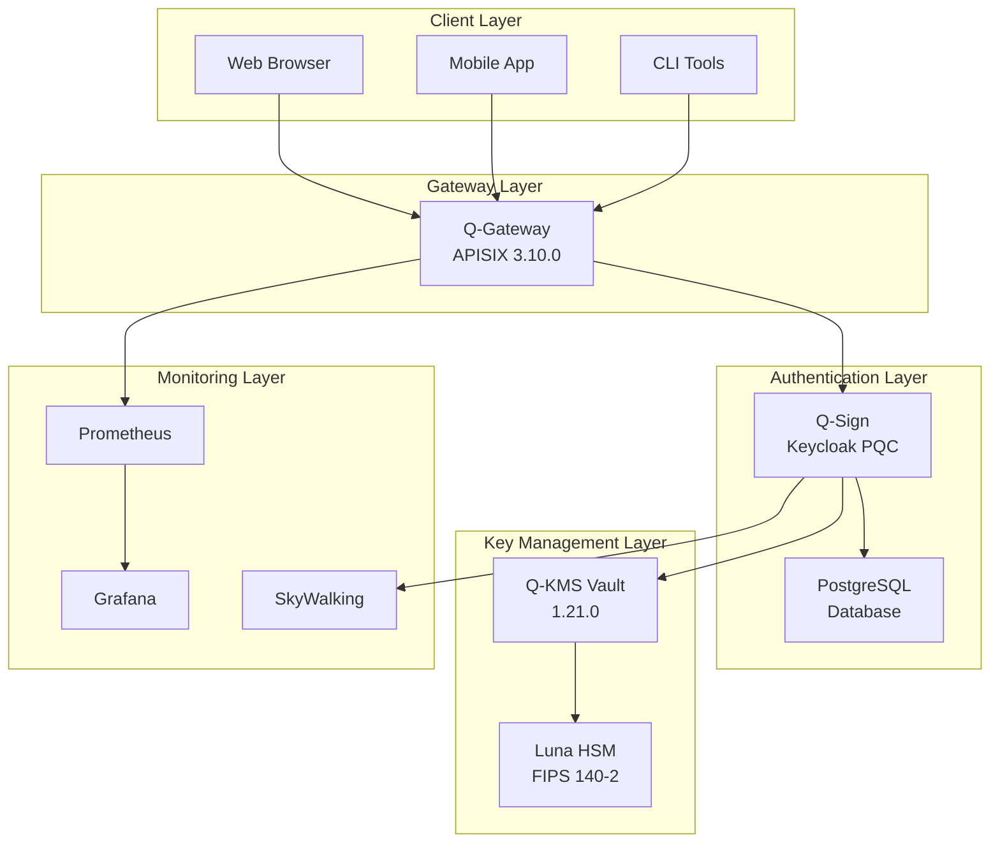
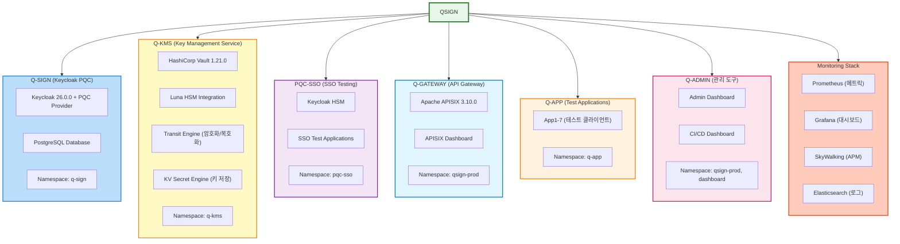
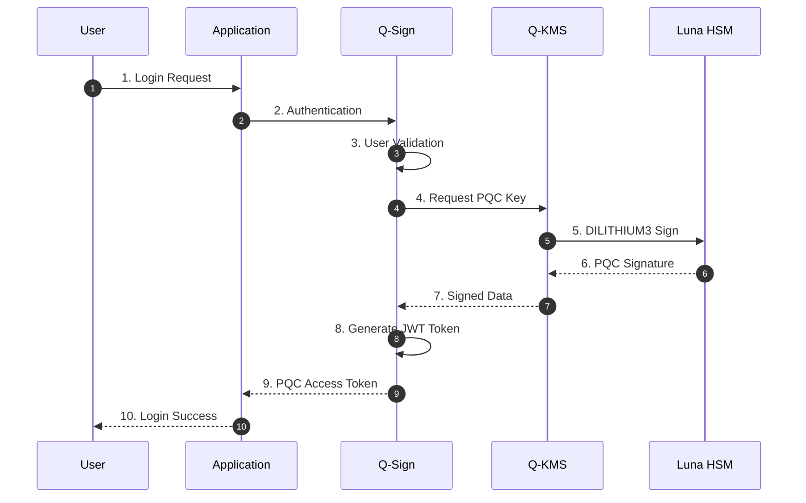
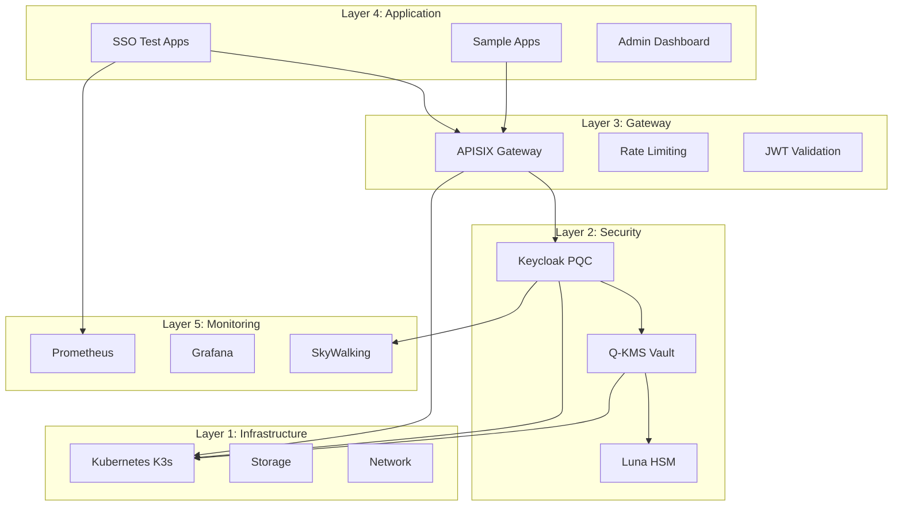

# QSIGN 프로젝트 개요

## 🎯 프로젝트 목표

QSIGN은 **Post-Quantum Cryptography (PQC)** 기술을 활용한 차세대 SSO(Single Sign-On) 및 키 관리 시스템입니다. 양자 컴퓨터 시대를 대비한 안전한 인증 및 암호화 인프라를 제공합니다.

## 🌟 핵심 가치

### 1. 양자 내성 (Quantum-Resistant)
- NIST 표준 PQC 알고리즘 (FIPS 204, 203, 205)
- 양자 컴퓨터 공격으로부터 안전한 암호화
- Hybrid 모드: Classical + PQC 이중 보안

### 2. 엔터프라이즈급 보안
- Luna HSM 하드웨어 보안 모듈 통합
- FIPS 140-2 Level 3 인증
- 안전한 키 생성, 저장, 관리

### 3. 확장 가능한 아키텍처
- Kubernetes 기반 마이크로서비스
- GitOps를 통한 자동화 배포
- 수평 확장 가능한 구조

### 4. 통합 인증 시스템
- Keycloak 기반 SSO
- OIDC/OAuth 2.0 표준 준수
- 다양한 클라이언트 지원

## 📊 프로젝트 구성

### 시스템 아키텍처



### 주요 컴포넌트



## 🔐 PQC 알고리즘

### NIST 표준 알고리즘

| 알고리즘 | NIST FIPS | 용도 | 보안 레벨 |
|---------|-----------|------|-----------|
| **DILITHIUM3** | FIPS 204 (ML-DSA) | 디지털 서명 | Level 3 |
| **KYBER1024** | FIPS 203 (ML-KEM) | 키 교환 | Level 5 |
| **SPHINCS+** | FIPS 205 (SLH-DSA) | 백업 서명 | Stateless |

### Hybrid 모드
```
Hybrid JWT = Classical Signature (RS256) + PQC Signature (DILITHIUM3)
```
- 하위 호환성 보장
- 이중 보안 레이어
- 점진적 마이그레이션 지원

### PQC 워크플로우



## 🏗️ 아키텍처 계층



### Layer 1: 인프라 계층
- **Kubernetes**: 컨테이너 오케스트레이션
- **K3s**: 경량 Kubernetes 배포
- **Local Path Provisioner**: 스토리지

### Layer 2: 보안 계층
- **Luna HSM**: 하드웨어 보안 모듈
- **Vault**: 키 관리 시스템
- **Keycloak**: 인증/인가 서버

### Layer 3: 게이트웨이 계층
- **APISIX**: API Gateway
- **Rate Limiting**: 요청 제한
- **JWT Validation**: 토큰 검증

### Layer 4: 애플리케이션 계층
- **SSO Test Apps**: 인증 테스트
- **Sample Apps**: PQC 통합 예제

### Layer 5: 모니터링 계층
- **Prometheus**: 메트릭 수집
- **Grafana**: 시각화
- **SkyWalking**: 분산 추적

## 📈 프로젝트 현황

### 배포 현황
- ✅ **Kubernetes 클러스터**: 1노드 (user-system-product-name)
- ✅ **네임스페이스**: 9개
- ✅ **Pod**: 50+ 실행 중
- ✅ **Service**: 30+ NodePort/ClusterIP

### 기능 현황
- ✅ PQC JWT 토큰 발급 및 검증
- ✅ Luna HSM 통합 인증
- ✅ Vault Transit Engine
- ✅ APISIX Gateway 라우팅
- ✅ ArgoCD GitOps 배포
- ✅ Prometheus/Grafana 모니터링

### 테스트 현황
- ✅ SSO 로그인 플로우
- ✅ PQC 서명/검증
- ✅ Hybrid 토큰 생성
- ✅ API Gateway JWT 검증
- ✅ Vault 암호화/복호화

## 🎓 기술 스택

### 보안 & 암호화
- Post-Quantum Cryptography (PQC)
- Luna HSM (PKCS#11)
- HashiCorp Vault
- Bouncy Castle Crypto

### 인증 & 인가
- Keycloak 26.0.0
- OIDC/OAuth 2.0
- PKCE Flow
- JWT (RS256, DILITHIUM3)

### 컨테이너 & 오케스트레이션
- Kubernetes (K3s)
- Docker
- Helm Charts
- ArgoCD

### API & Gateway
- Apache APISIX 3.10.0
- OpenResty
- Nginx

### 모니터링 & 로깅
- Prometheus
- Grafana
- SkyWalking OAP
- Elasticsearch 7.17.10

### CI/CD
- GitLab 17.7.0
- ArgoCD 3.2.0
- Harbor 2.14.0
- Jenkins

## 🚀 사용 사례

### 1. 엔터프라이즈 SSO
- 전사 통합 인증
- PQC 기반 안전한 토큰
- 다양한 애플리케이션 통합

### 2. 금융 서비스
- FIPS 140-2 Level 3 준수
- HSM 기반 키 관리
- 양자 내성 암호화

### 3. 정부/공공기관
- 차세대 암호화 표준 대응
- 보안성 강화
- 감사 추적 (Audit Trail)

### 4. 클라우드 네이티브 애플리케이션
- Kubernetes 기반 배포
- 마이크로서비스 인증
- API Gateway 통합

## 📚 문서 가이드

### 개발자용
- [아키텍처 문서](../01-architecture/)
- [API 레퍼런스](../05-api-reference/)
- [설치 가이드](../02-setup/)

### 운영자용
- [배포 가이드](../03-deployment/)
- [운영 가이드](../04-operations/)
- [문제 해결](../06-troubleshooting/)

## 🔗 관련 리소스

### 표준 문서
- [NIST PQC Project](https://csrc.nist.gov/projects/post-quantum-cryptography)
- [FIPS 204 (ML-DSA)](https://csrc.nist.gov/pubs/fips/204/final)
- [FIPS 203 (ML-KEM)](https://csrc.nist.gov/pubs/fips/203/final)
- [FIPS 205 (SLH-DSA)](https://csrc.nist.gov/pubs/fips/205/final)

### 기술 문서
- [Keycloak Documentation](https://www.keycloak.org/documentation)
- [HashiCorp Vault](https://developer.hashicorp.com/vault)
- [Apache APISIX](https://apisix.apache.org/docs/)
- [Luna HSM](https://thalesdocs.com/gphsm/luna/)

---

**Last Updated**: 2025-11-16
**Version**: 1.0.0
**Project Lead**: QSIGN Team
