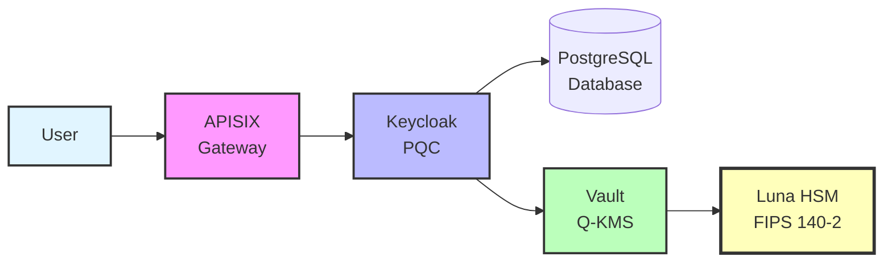
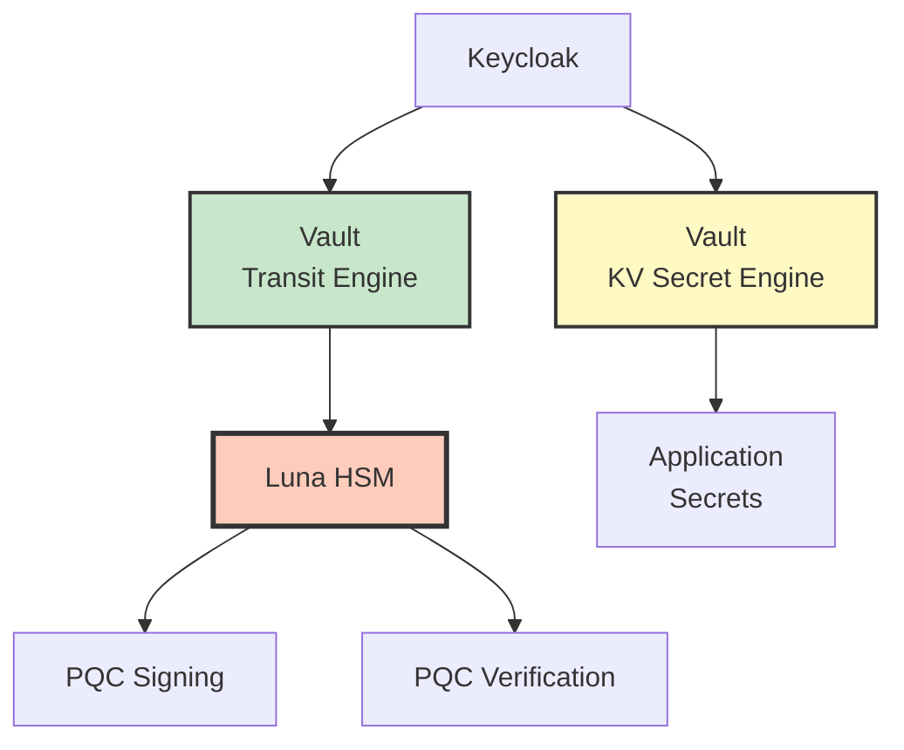
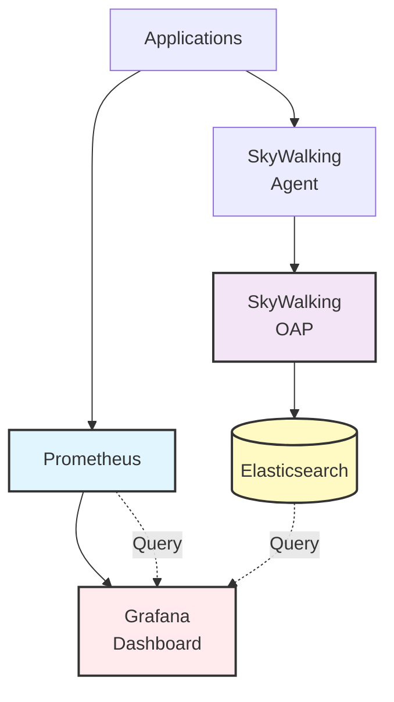

# QSIGN 시스템 컴포넌트

## 🏗️ 컴포넌트 아키텍처

```
┌─────────────────────────────────────────────────────────┐
│                    Client Layer                          │
│  Web Apps, Mobile Apps, CLI Tools, Test Clients         │
└────────────────┬────────────────────────────────────────┘
                 │
┌────────────────▼────────────────────────────────────────┐
│               API Gateway Layer                          │
│  ┌──────────┐  ┌──────────┐  ┌──────────────────┐      │
│  │  APISIX  │  │Dashboard │  │  Route Manager   │      │
│  │  Gateway │  │   UI     │  │                  │      │
│  └──────────┘  └──────────┘  └──────────────────┘      │
└────────────────┬────────────────────────────────────────┘
                 │
┌────────────────▼────────────────────────────────────────┐
│              Authentication Layer                        │
│  ┌─────────────────┐    ┌─────────────────┐            │
│  │  Keycloak PQC   │    │  Keycloak HSM   │            │
│  │   (Q-Sign)      │    │   (PQC-SSO)     │            │
│  │  - PQC Provider │    │  - Luna HSM     │            │
│  │  - Vault Integ  │    │  - Hybrid JWT   │            │
│  └─────────────────┘    └─────────────────┘            │
└────────────────┬────────────────────────────────────────┘
                 │
┌────────────────▼────────────────────────────────────────┐
│           Key Management Layer                           │
│  ┌──────────────────────────────────────────┐           │
│  │          Q-KMS Vault                      │           │
│  │  ┌──────────┐  ┌──────────┐  ┌────────┐ │           │
│  │  │ Transit  │  │ KV v2    │  │  PKI   │ │           │
│  │  │ Engine   │  │ Secrets  │  │ Engine │ │           │
│  │  └──────────┘  └──────────┘  └────────┘ │           │
│  └───────────────┬──────────────────────────┘           │
│                  │                                       │
│  ┌───────────────▼──────────────────────────┐           │
│  │         Luna HSM Device                   │           │
│  │  FIPS 140-2 Level 3 Certified            │           │
│  │  - DILITHIUM3 Key Generation             │           │
│  │  - Secure Signing Operations             │           │
│  └───────────────────────────────────────────┘           │
└──────────────────────────────────────────────────────────┘
```

## 📦 주요 컴포넌트

### 1. Q-SIGN (Keycloak PQC)

**네임스페이스**: `q-sign`
**서비스 포트**: NodePort 30181

#### 구성 요소
```yaml
Components:
  - Keycloak 26.0.0
    - PQC Provider (DILITHIUM3)
    - Vault Integration
    - Hybrid Signature Support

  - PostgreSQL 15
    - Keycloak Database
    - User/Session Storage

  - PQC Providers
    - keycloak-spi-luna-pqc-2.0.0.jar
    - hybrid-signature-provider-1.0.0.jar
    - luna-hsm-provider-1.0.0.jar
```

#### 주요 기능
- ✅ PQC JWT 토큰 발급 (DILITHIUM3)
- ✅ Q-KMS Vault 통합
- ✅ Hybrid 서명 (RSA + DILITHIUM3)
- ✅ OIDC/OAuth 2.0 프로토콜
- ✅ Realm 관리 (myrealm)

#### 환경 변수
```bash
KEYCLOAK_ADMIN=admin
KEYCLOAK_ADMIN_PASSWORD=admin
KC_DB=postgres
KC_DB_URL=jdbc:postgresql://postgres-qsign:5432/keycloak
KC_HOSTNAME=192.168.0.11
KC_HTTP_PORT=8080
```

#### 리소스
```yaml
Resources:
  requests:
    cpu: 1000m
    memory: 2Gi
  limits:
    cpu: 4000m
    memory: 4Gi
```

---

### 2. Q-KMS (Key Management Service)

**네임스페이스**: `q-kms`
**서비스 포트**: NodePort 30820

#### 구성 요소
```yaml
Components:
  - HashiCorp Vault 1.21.0
    - Transit Engine (pqc-keys/)
    - KV Secret Engine v2 (secret/)
    - PKI Engine (pki/)

  - Luna HSM Device
    - Device Path: /dev/k7pf0
    - PKCS#11 Interface
    - Group ID: 997
```

#### 주요 기능
- ✅ Transit Engine: 암호화/복호화/서명
- ✅ KV Secret Engine: 비밀 키 저장
- ✅ Luna HSM 통합
- ✅ Auto-unseal 지원
- ✅ PQC 키 생성 및 관리

#### Vault 구성
```hcl
storage "file" {
  path = "/vault/data"
}

listener "tcp" {
  address = "0.0.0.0:8200"
  tls_disable = true
}

seal "pkcs11" {
  lib            = "/usr/safenet/lunaclient/lib/libCryptoki2_64.so"
  slot           = "0"
  pin            = "userpin"
  key_label      = "vault-hsm-key"
  hmac_key_label = "vault-hsm-hmac-key"
}
```

#### Unseal Keys
```yaml
vaultInit:
  enabled: true
  unsealKeys:
    key1: "ZGHLJns5x2hKpvMTWEP1b7XXEoC8vJPZlF+HafVWi+dC"
    key2: "xOnAwPR/VCo95IY71to8X2OOwfcPQ0z0Ga95XAaKqVj8"
    key3: "tppyUv85Ahfea7MoS9jxF4ODjiMu44cAL/ncLoYbBIfZ"
  rootToken: "hvs.nQKDvTCalx5XGJvDQe2J2phC"
```

---

### 3. PQC-SSO (SSO Testing Environment)

**네임스페이스**: `pqc-sso`

#### 구성 요소
```yaml
Components:
  - Keycloak HSM
    - Port: 30699
    - Hybrid PQC Support
    - PostgreSQL Backend

  - SSO Test App
    - Port: 32127
    - PKCE Flow
    - PQC Token Testing
```

#### 주요 기능
- ✅ Keycloak HSM 인증 테스트
- ✅ SSO 로그인 플로우 검증
- ✅ PQC 토큰 발급 테스트
- ✅ Hybrid JWT 검증

---

### 4. Q-GATEWAY (API Gateway)

**네임스페이스**: `qsign-prod`

#### 구성 요소
```yaml
Components:
  - Apache APISIX 3.10.0
    - HTTP Gateway: 32602
    - HTTPS Gateway: 32294
    - Admin API: 30282

  - APISIX Dashboard
    - Port: 31281
    - Admin Credentials: admin/admin
```

#### 주요 기능
- ✅ 동적 라우팅
- ✅ JWT 토큰 검증
- ✅ Rate Limiting
- ✅ CORS 설정
- ✅ 플러그인 관리
- ✅ 로드 밸런싱

#### 라우트 예제
```yaml
routes:
  - uri: /api/v1/*
    upstream:
      nodes:
        - "backend-service:8080"
    plugins:
      jwt-auth:
        enabled: true
      rate-limit:
        count: 100
        time_window: 60
```

---

### 5. Q-APP (Test Applications)

**네임스페이스**: `q-app`

#### 애플리케이션 목록
| App | Port | NodePort | 설명 |
|-----|------|----------|------|
| App1 | 4200 | 30210 | APISIX Dashboard |
| App2 | 4201 | 30201 | Angular Application |
| App3 | 4202 | 30202 | Node.js SSO Client |
| App4 | 4203 | 30203 | Node.js SSO Client |
| App6 | 4205 | 30205 | Luna HSM Test |
| App7 | 80 | 30207 | HSM PQC Integration |
| SSO Test App | 3000 | 30300 | SSO Test Client |

#### 공통 기능
- ✅ Keycloak 인증 통합
- ✅ PKCE Flow
- ✅ PQC JWT 검증
- ✅ Session 관리

---

### 6. Q-ADMIN (관리 도구)

**네임스페이스**: `qsign-prod`, `dashboard`

#### 구성 요소
```yaml
Components:
  - Admin Dashboard (qsign-prod)
    - Port: 30093
    - 전체 시스템 모니터링
    - 접속 정보 관리

  - CI/CD Dashboard (dashboard)
    - Port: 30098
    - 빌드/배포 상태
    - Pipeline 관리
```

#### 주요 기능
- ✅ 시스템 상태 모니터링
- ✅ 서비스 접속 정보
- ✅ 빌드/배포 현황
- ✅ Quick Access Links

---

### 7. Monitoring Stack

**네임스페이스**: `qsign-prod`

#### 구성 요소
```yaml
Components:
  - Prometheus (30092)
    - 메트릭 수집
    - 시계열 데이터베이스
    - AlertManager 연동

  - Grafana (30030)
    - 대시보드 시각화
    - 알림 설정
    - 다양한 데이터 소스

  - SkyWalking (30094)
    - APM (Application Performance Monitoring)
    - 분산 추적
    - 서비스 맵

  - Elasticsearch (ClusterIP)
    - 로그 저장
    - Full-text Search
    - 7.17.10
```

#### 메트릭 수집
```yaml
Targets:
  - Kubernetes API
  - Keycloak JMX
  - Vault Metrics
  - APISIX Metrics
  - Application Metrics
```

---

### 8. CI/CD Infrastructure

#### GitLab (External)
```yaml
URL: https://192.168.0.11:7743
Version: 17.7.0
Repositories:
  - root/q-sign
  - root/q-kms
  - root/q-app
  - root/q-admin
  - root/q-gateway
```

#### Harbor (Namespace: harbor)
```yaml
URL: http://192.168.0.11:31800
Version: 2.14.0
Projects:
  - qsign-prod
  - qsign
  - library
  - q-sign
```

#### ArgoCD (Namespace: argocd)
```yaml
URL: http://192.168.0.11:30080
Version: 3.2.0
Applications:
  - q-sign
  - q-kms
  - q-app
  - qsign-prod
```

---

## 🔗 컴포넌트 통신

### 인증 플로우



### 키 관리 플로우



### 모니터링 플로우



---

## 📊 리소스 요구사항

### 전체 클러스터
```yaml
Total Resources:
  CPU Requests: ~8000m (8 cores)
  CPU Limits: ~16000m (16 cores)
  Memory Requests: ~10Gi
  Memory Limits: ~20Gi
  Storage: ~100Gi
```

### 네임스페이스별
| Namespace | Pods | CPU Requests | Memory Requests |
|-----------|------|--------------|-----------------|
| q-sign | 2 | 1000m | 2Gi |
| q-kms | 1 | 500m | 512Mi |
| pqc-sso | 2 | 500m | 1Gi |
| qsign-prod | 8 | 2000m | 4Gi |
| q-app | 6 | 600m | 768Mi |
| argocd | 6 | 1500m | 2Gi |
| harbor | 6 | 2000m | 3Gi |

---

**Last Updated**: 2025-11-16
**Version**: 1.0.0
