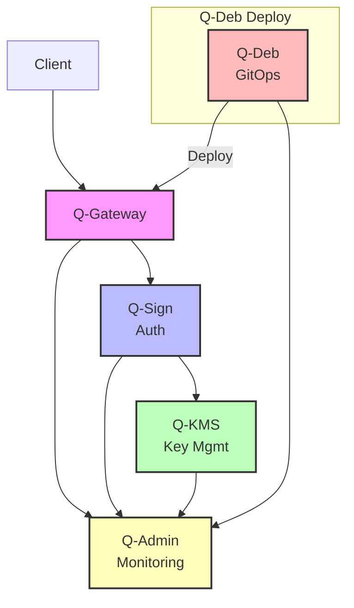
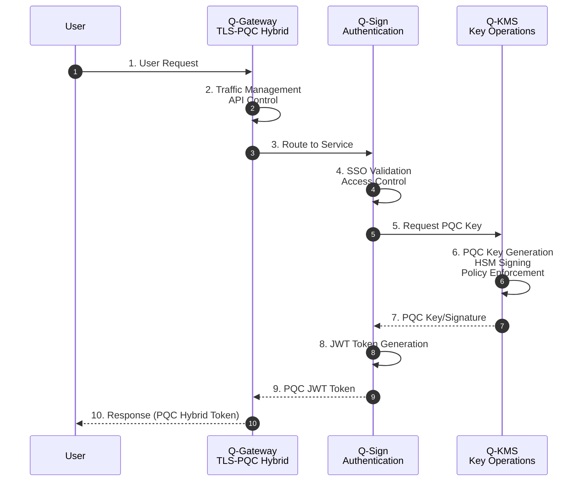

# QSIGN 기술 스택

## 🎯 Q-Sign™ On-Premises Edition

QSIGN은 5개의 핵심 컴포넌트로 구성된 통합 PQC 솔루션입니다.

```
┌─────────────────────────────────────────────────────────────────┐
│            Q-Sign™ On-Premises Edition™                         │
│                                                                  │
│  ┌──────────┐  ┌──────────┐  ┌──────────┐                      │
│  │Q-Gateway │→│ Q-Sign   │→│  Q-KMS   │                      │
│  │   ™      │  │   ™      │  │   ™      │                      │
│  └──────────┘  └──────────┘  └──────────┘                      │
│                                                                  │
│  ┌─────────────────────┐  ┌─────────────────────┐              │
│  │      Q-Deb™         │  │     Q-Admin™        │              │
│  └─────────────────────┘  └─────────────────────┘              │
└─────────────────────────────────────────────────────────────────┘
```

## 🔷 Q-Gateway™

**역할**: TLS-PQC Hybrid 기반 API Gateway

### 주요 기능
```yaml
Components:
  - TLS-PQC Hybrid mode
    • Post-Quantum TLS 지원
    • 하이브리드 암호화 (Classical + PQC)

  - 트래픽 관리 (Traffic Management)
    • 동적 라우팅
    • 로드 밸런싱
    • Rate Limiting

  - API 제어 (API Control)
    • JWT 토큰 검증
    • 접근 제어
    • API 버전 관리

  - 모니터링/확장 (Monitoring & Extensibility)
    • 메트릭 수집
    • 로그 관리
    • 플러그인 시스템
```

### 기술 스택
- **Apache APISIX 3.10.0**
- **OpenResty** (Nginx + LuaJIT)
- **etcd** (Configuration Store)
- **Prometheus** (Metrics)

### 배포 정보
```yaml
Namespace: qsign-prod
Services:
  - HTTP Gateway: :32602
  - HTTPS Gateway: :32294
  - Dashboard: :31281
  - Admin API: :30282
  - Metrics: :31337
```

---

## 🔷 Q-Sign™

**역할**: SSO 인증 및 JWT 토큰 서비스

### 주요 기능
```yaml
Auth & Crypto:
  - SSO 인증 (Authentication)
    • OIDC/OAuth 2.0
    • SAML 2.0
    • Multi-factor Authentication

  - 접근제어 (Access Control)
    • Role-Based Access Control (RBAC)
    • Attribute-Based Access Control (ABAC)
    • Policy Enforcement

  - JWT 토큰 (Token Service)
    • PQC JWT 발급
    • Hybrid Signature (RSA + DILITHIUM3)
    • Token Validation

  - Account Operation
    • User Management
    • Session Management
    • Password Policy
```

### 기술 스택
- **Keycloak 26.0.0**
- **PostgreSQL 15**
- **PQC Providers**:
  - keycloak-spi-luna-pqc-2.0.0.jar
  - hybrid-signature-provider-1.0.0.jar
  - luna-hsm-provider-1.0.0.jar

### PQC 알고리즘
```yaml
Algorithms:
  - DILITHIUM3 (NIST FIPS 204)
    • Digital Signature
    • Security Level 3

  - Hybrid Mode
    • RS256 + DILITHIUM3
    • Backward Compatibility
```

### 배포 정보
```yaml
Namespaces:
  - q-sign (Keycloak PQC)
    Port: 30181

  - pqc-sso (Keycloak HSM)
    Port: 30699
```

---

## 🔷 Q-KMS™

**역할**: 키 생성, 관리 및 PQC 암호화 엔진

### 주요 기능
```yaml
Key Generation & PQC Engine:
  - 키 생성 (Key Generation)
    • PQC 키 쌍 생성
    • DILITHIUM3, KYBER1024, SPHINCS+
    • Hardware-based Key Gen (Luna HSM)

  - 키 분배 (Key Distribution)
    • Secure Key Transport
    • Key Rotation
    • Key Versioning

  - PQC 암호화 (Encryption)
    • Transit Engine (Encrypt/Decrypt)
    • Data Encryption
    • Signature Generation

  - Policy Management
    • Access Policies
    • Key Usage Policies
    • Audit Logging
```

### HSM & QRNG
```yaml
Luna HSM:
  - FIPS 140-2 Level 3 Certified
  - PKCS#11 Interface
  - Device Path: /dev/k7pf0
  - Secure Key Storage

QRNG (Quantum Random Number Generator):
  - Hardware-based Entropy
  - Cryptographically Secure
  - High-quality Randomness
```

### 기술 스택
- **HashiCorp Vault 1.21.0**
- **Luna HSM** (Thales)
- **Bouncy Castle** (PQC Provider)
- **Transit Engine** (Cryptographic Operations)
- **KV Secret Engine v2** (Secret Storage)

### 엔진 구성
```yaml
Vault Engines:
  - pqc-keys/ (Transit Engine)
    • DILITHIUM3 Sign/Verify
    • KYBER1024 Encrypt/Decrypt

  - secret/ (KV v2)
    • Application Secrets
    • API Keys
    • Credentials

  - pki/ (PKI Engine)
    • Certificate Authority
    • Certificate Issuance
```

### 배포 정보
```yaml
Namespace: q-kms
Service: NodePort 30820
Persistence:
  - Data: 10Gi
  - Logs: 5Gi
Auto-unseal: Enabled
```

---

## 🔷 Q-Deb™

**역할**: 소스 관리, 빌드, 컨테이너 레지스트리 및 배포

### 주요 기능
```yaml
DevOps Pipeline:
  - 소스 관리 (Source Control)
    • Git Repository
    • Version Control
    • Branch Management

  - 자동 빌드 (Build Automation)
    • CI/CD Pipeline
    • Docker Build
    • Helm Packaging

  - 이미지 저장소 (Container Registry)
    • Docker Registry
    • Image Scanning
    • Vulnerability Detection

  - 자동 배포 (Deployment)
    • GitOps (ArgoCD)
    • Continuous Deployment
    • Rollback Support
```

### 기술 스택
```yaml
Source Control:
  - GitLab 17.7.0
    URL: https://192.168.0.11:7743
    Projects: q-sign, q-kms, q-app, q-admin, q-gateway

Container Registry:
  - Harbor 2.14.0
    URL: http://192.168.0.11:31800
    Projects: qsign-prod, qsign, library, q-sign

CI/CD:
  - Jenkins
    URL: https://192.168.0.11:7643
    Pipelines: Build, Test, Deploy

  - ArgoCD 3.2.0
    URL: http://192.168.0.11:30080
    Applications: 8+ managed apps
```

### 배포 플로우
```
Developer → GitLab → Jenkins → Harbor → ArgoCD → Kubernetes
   (Code)   (Source)  (Build)  (Image)  (Deploy)   (Runtime)
```

---

## 🔷 Q-Admin™

**역할**: 통합 관리 및 모니터링 플랫폼

### 주요 기능
```yaml
Administration:
  - 정책 관리 (Policy Control)
    • Security Policies
    • Access Policies
    • Compliance Rules

  - 사용자 관리 (User Management)
    • User Provisioning
    • Role Assignment
    • Group Management

  - 관제/모니터링 (Monitoring)
    • Real-time Monitoring
    • Alert Management
    • Incident Response

  - 대시보드 (Dashboard)
    • System Overview
    • Service Status
    • Performance Metrics
```

### 기술 스택
```yaml
Monitoring Stack:
  - Prometheus
    • Metrics Collection
    • Time-series Database
    • AlertManager Integration

  - Grafana
    • Visualization
    • Custom Dashboards
    • Multi-datasource

  - SkyWalking
    • APM (Application Performance Monitoring)
    • Distributed Tracing
    • Service Map

  - Elasticsearch
    • Log Aggregation
    • Full-text Search
    • Kibana Integration
```

### 대시보드
```yaml
Admin Dashboard:
  - URL: http://192.168.0.11:30093
  - Features:
    • Quick Access Links
    • Service Status
    • Resource Monitoring
    • Access Information

CI/CD Dashboard:
  - URL: http://192.168.0.11:30098
  - Features:
    • Build Status
    • Deployment History
    • Pipeline Metrics
```

---

## 🔗 컴포넌트 통합

### 데이터 흐름



### 인증 & 암호화 플로우



---

## 📊 통합 기술 스택

### 프로그래밍 언어
- **Java** 11+ (Keycloak, Vault Plugins)
- **Go** (Vault)
- **Lua** (APISIX)
- **JavaScript/Node.js** (Test Apps)
- **Python** (Scripts)

### 프레임워크 & 라이브러리
- **Spring Boot** (Backend Services)
- **Bouncy Castle** (PQC Cryptography)
- **OpenID Connect** (Authentication)
- **gRPC** (Service Communication)
- **Protocol Buffers** (Data Serialization)

### 데이터베이스
- **PostgreSQL 15** (Keycloak, Application Data)
- **etcd** (APISIX Configuration)
- **Elasticsearch 7.17.10** (Logs, Metrics)

### 컨테이너 & 오케스트레이션
- **Docker** (Container Runtime)
- **Kubernetes (K3s)** (Orchestration)
- **Helm 3** (Package Management)
- **ArgoCD** (GitOps)

### 보안 & 암호화
- **Luna HSM** (Hardware Security)
- **PKCS#11** (HSM Interface)
- **PQC Algorithms**:
  - DILITHIUM3 (NIST FIPS 204)
  - KYBER1024 (NIST FIPS 203)
  - SPHINCS+ (NIST FIPS 205)
- **TLS 1.3** (Transport Security)

### 모니터링 & 로깅
- **Prometheus** (Metrics)
- **Grafana** (Visualization)
- **SkyWalking OAP** (APM)
- **Elasticsearch** (Log Storage)
- **Fluentd/Filebeat** (Log Shipping)

---

## 🎯 시스템 요구사항

### 하드웨어
```yaml
Minimum:
  - CPU: 8 cores
  - Memory: 16 GB RAM
  - Storage: 100 GB SSD
  - Network: 1 Gbps

Recommended:
  - CPU: 16 cores
  - Memory: 32 GB RAM
  - Storage: 500 GB NVMe SSD
  - Network: 10 Gbps

Luna HSM:
  - USB/PCIe HSM Device
  - FIPS 140-2 Level 3
```

### 소프트웨어
```yaml
Operating System:
  - Ubuntu 20.04 LTS or later
  - RHEL 8/9
  - Rocky Linux 8/9

Kubernetes:
  - K3s v1.28+
  - K8s v1.28+

Container Runtime:
  - containerd 1.6+
  - Docker 24.0+
```

---

**Last Updated**: 2025-11-16
**Version**: 1.0.0
**Edition**: Q-Sign™ On-Premises Edition™
