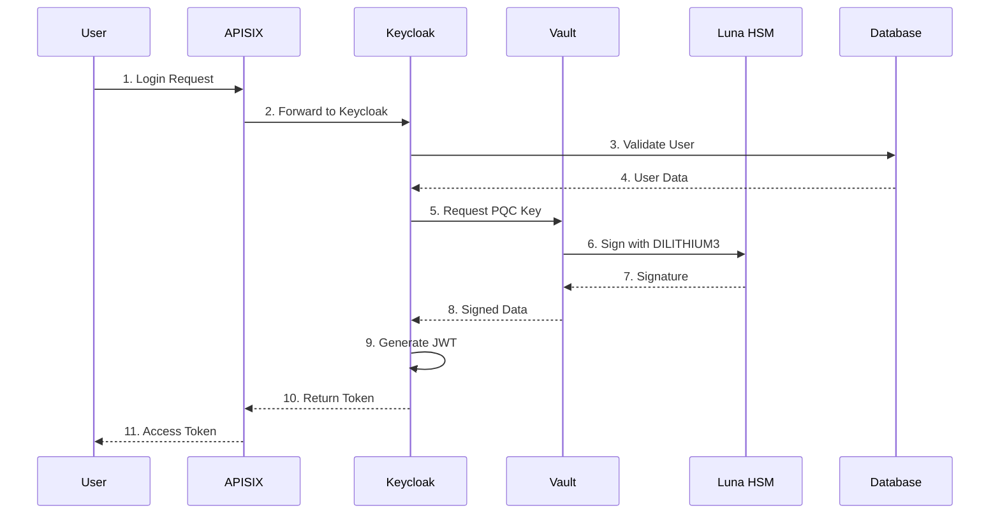
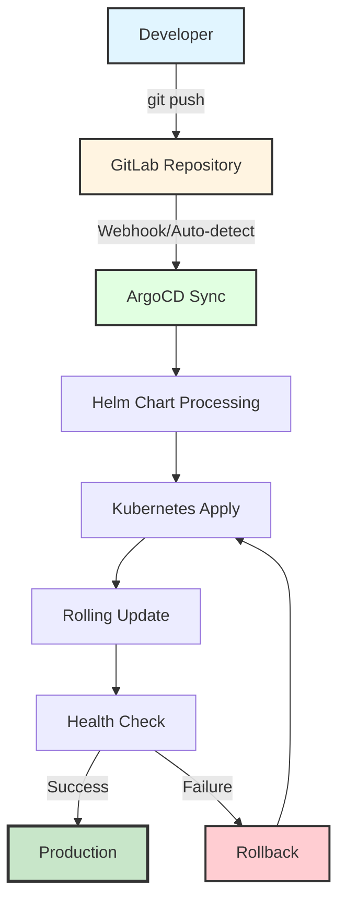
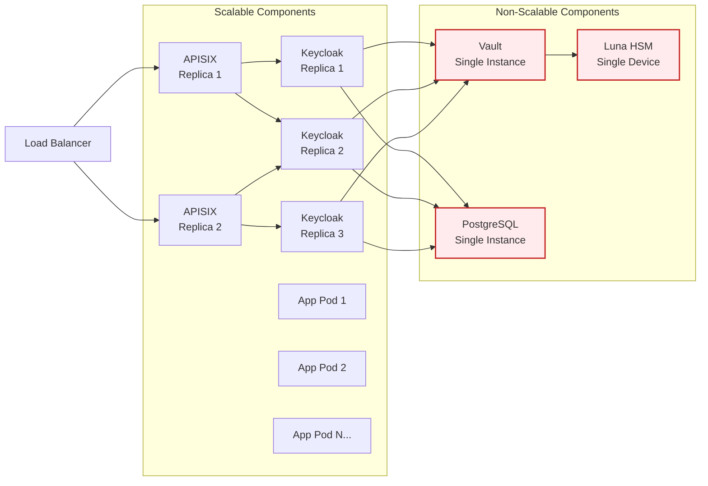
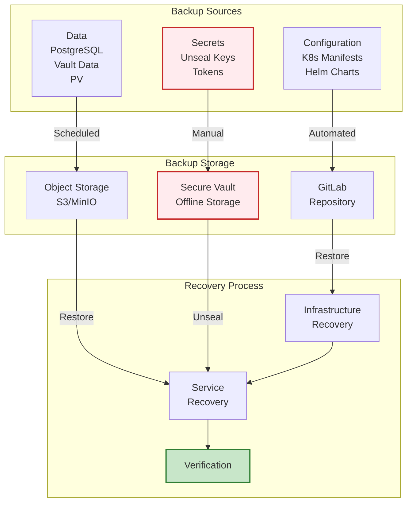
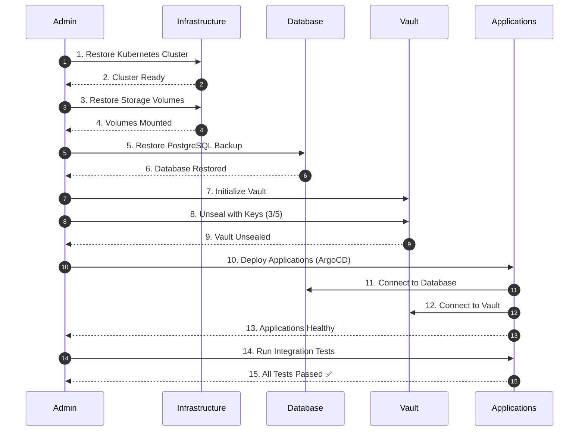

# QSIGN 아키텍처 개요

## 🏛️ 전체 아키텍처

```
┌──────────────────────────────────────────────────────────────────────────┐
│                          External Access Layer                            │
│  ┌─────────────┐  ┌─────────────┐  ┌─────────────┐  ┌─────────────┐    │
│  │   GitLab    │  │   Harbor    │  │   Jenkins   │  │   Clients   │    │
│  │   :7743     │  │   :31800    │  │   :7643     │  │   Browser   │    │
│  └──────┬──────┘  └──────┬──────┘  └──────┬──────┘  └──────┬──────┘    │
└─────────┼─────────────────┼─────────────────┼─────────────────┼──────────┘
          │                 │                 │                 │
┌─────────▼─────────────────▼─────────────────▼─────────────────▼──────────┐
│                        Kubernetes Cluster (K3s)                           │
│  ┌────────────────────────────────────────────────────────────────────┐  │
│  │                    Ingress/Gateway Layer                           │  │
│  │  ┌──────────────────┐  ┌──────────────────┐  ┌────────────────┐  │  │
│  │  │  APISIX Gateway  │  │ APISIX Dashboard │  │  ArgoCD UI     │  │  │
│  │  │  :32602/:32294   │  │     :31281       │  │   :30080       │  │  │
│  │  └────────┬─────────┘  └──────────────────┘  └────────────────┘  │  │
│  └───────────┼────────────────────────────────────────────────────────┘  │
│              │                                                            │
│  ┌───────────▼─────────────────────────────────────────────────────┐    │
│  │                  Authentication & Authorization                  │    │
│  │  ┌──────────────────┐              ┌───────────────────────┐    │    │
│  │  │  Keycloak PQC    │◄────────────►│   Keycloak HSM        │    │    │
│  │  │  (Q-Sign)        │              │   (PQC-SSO)           │    │    │
│  │  │  Namespace:      │              │   Namespace:          │    │    │
│  │  │  q-sign          │              │   pqc-sso             │    │    │
│  │  │  Port: 30181     │              │   Port: 30699         │    │    │
│  │  └────────┬─────────┘              └───────────┬───────────┘    │    │
│  └───────────┼──────────────────────────────────────┼──────────────┘    │
│              │                                      │                    │
│  ┌───────────▼──────────────────────────────────────▼──────────────┐    │
│  │                   Key Management Layer                           │    │
│  │  ┌───────────────────────────────────────────────────────────┐  │    │
│  │  │               Q-KMS Vault (Namespace: q-kms)              │  │    │
│  │  │  ┌──────────────┐  ┌──────────────┐  ┌──────────────┐   │  │    │
│  │  │  │   Transit    │  │   KV v2      │  │     PKI      │   │  │    │
│  │  │  │   Engine     │  │   Secrets    │  │   Engine     │   │  │    │
│  │  │  │  pqc-keys/   │  │   secret/    │  │    pki/      │   │  │    │
│  │  │  └──────┬───────┘  └──────────────┘  └──────────────┘   │  │    │
│  │  │         │                                                 │  │    │
│  │  │  ┌──────▼───────────────────────────────────────────┐   │  │    │
│  │  │  │          Luna HSM Device (/dev/k7pf0)            │   │  │    │
│  │  │  │  FIPS 140-2 Level 3 • PKCS#11 • Group: 997       │   │  │    │
│  │  │  └──────────────────────────────────────────────────┘   │  │    │
│  │  │  Port: 30820                                             │  │    │
│  │  └───────────────────────────────────────────────────────────┘  │    │
│  └──────────────────────────────────────────────────────────────────┘    │
│                                                                           │
│  ┌──────────────────────────────────────────────────────────────────┐    │
│  │                      Application Layer                           │    │
│  │  ┌──────────┐  ┌──────────┐  ┌──────────┐  ┌──────────────┐    │    │
│  │  │   App1   │  │   App3   │  │   App6   │  │ SSO Test App │    │    │
│  │  │  :30210  │  │  :30202  │  │  :30205  │  │    :32127    │    │    │
│  │  └──────────┘  └──────────┘  └──────────┘  └──────────────┘    │    │
│  │  Namespace: q-app                                                │    │
│  └──────────────────────────────────────────────────────────────────┘    │
│                                                                           │
│  ┌──────────────────────────────────────────────────────────────────┐    │
│  │                    Monitoring & Logging                          │    │
│  │  ┌─────────────┐  ┌─────────────┐  ┌──────────────────────┐    │    │
│  │  │ Prometheus  │  │   Grafana   │  │    SkyWalking        │    │    │
│  │  │   :30092    │  │   :30030    │  │      :30094          │    │    │
│  │  └──────┬──────┘  └──────┬──────┘  └──────┬───────────────┘    │    │
│  │         └─────────────────┴────────────────▼───────────────┐    │    │
│  │                       Elasticsearch :ClusterIP              │    │    │
│  │  Namespace: qsign-prod                                      │    │    │
│  └──────────────────────────────────────────────────────────────────┘    │
│                                                                           │
│  ┌──────────────────────────────────────────────────────────────────┐    │
│  │                     Storage & Database                           │    │
│  │  ┌──────────────┐  ┌──────────────┐  ┌───────────────────┐     │    │
│  │  │  PostgreSQL  │  │  PostgreSQL  │  │  Local Path PV    │     │    │
│  │  │  (Q-Sign)    │  │  (PQC-SSO)   │  │  Storage          │     │    │
│  │  │  :5432       │  │  :5432       │  │                   │     │    │
│  │  └──────────────┘  └──────────────┘  └───────────────────┘     │    │
│  └──────────────────────────────────────────────────────────────────┘    │
└───────────────────────────────────────────────────────────────────────────┘
```

## 🎯 아키텍처 원칙

### 1. 보안 우선 (Security First)
- **Defense in Depth**: 다층 보안 구조
- **Zero Trust**: 모든 요청 검증
- **Quantum-Resistant**: PQC 알고리즘 사용
- **HSM Integration**: 하드웨어 기반 키 보호

### 2. 확장성 (Scalability)
- **Horizontal Scaling**: 수평 확장 가능
- **Stateless Design**: 상태 비저장 애플리케이션
- **Load Balancing**: 트래픽 분산
- **Auto-scaling**: 자동 스케일링 지원

### 3. 가용성 (High Availability)
- **Redundancy**: 중복 구성
- **Health Checks**: 상태 모니터링
- **Rolling Updates**: 무중단 배포
- **Backup & Recovery**: 백업 및 복구

### 4. 관찰성 (Observability)
- **Metrics**: Prometheus 메트릭
- **Logging**: Centralized 로그
- **Tracing**: 분산 추적
- **Dashboards**: 시각화

### 5. 자동화 (Automation)
- **GitOps**: Git 기반 배포
- **CI/CD**: 자동 빌드/배포
- **IaC**: Infrastructure as Code
- **Self-healing**: 자가 복구

## 🔐 보안 아키텍처

### 인증 흐름
```
1. User Request
   ↓
2. APISIX Gateway
   ├─ Rate Limiting
   ├─ CORS Check
   └─ Routing
   ↓
3. Keycloak Authentication
   ├─ User Validation
   ├─ OIDC/OAuth 2.0
   └─ Session Management
   ↓
4. Vault Key Management
   ├─ Transit Engine (Crypto Operations)
   ├─ KV Engine (Secret Storage)
   └─ Luna HSM (Hardware Security)
   ↓
5. PQC Token Generation
   ├─ DILITHIUM3 Signature
   ├─ Hybrid Mode (RSA + PQC)
   └─ JWT Encoding
   ↓
6. Response to Client
```

### 키 계층 구조
```
Root CA (Vault PKI)
  ├─ Intermediate CA
  │   ├─ Server Certificates
  │   └─ Client Certificates
  │
  ├─ PQC Keys (Transit Engine)
  │   ├─ DILITHIUM3 (Signing)
  │   ├─ KYBER1024 (Encryption)
  │   └─ SPHINCS+ (Backup)
  │
  └─ Application Secrets (KV v2)
      ├─ Database Credentials
      ├─ API Keys
      └─ Client Secrets
```

## 🌐 네트워크 아키텍처

### NodePort 매핑
| Service | Internal Port | NodePort | Protocol |
|---------|---------------|----------|----------|
| Keycloak PQC | 8080 | 30181 | HTTP |
| Keycloak HSM | 80 | 30699 | HTTP |
| Q-KMS Vault | 8200 | 30820 | HTTP |
| APISIX Gateway | 9080 | 32602 | HTTP |
| APISIX HTTPS | 9443 | 32294 | HTTPS |
| APISIX Dashboard | 9000 | 31281 | HTTP |
| Grafana | 3000 | 30030 | HTTP |
| Prometheus | 9090 | 30092 | HTTP |
| SkyWalking | 8080 | 30094 | HTTP |
| ArgoCD | 8080 | 30080 | HTTP/HTTPS |
| Admin Dashboard | 80 | 30093 | HTTP |
| Harbor | 80 | 31800 | HTTP |

### 서비스 메시
```
┌─────────────────────────────────────────────┐
│        Service Discovery (K8s DNS)          │
│                                             │
│  keycloak.q-sign.svc.cluster.local         │
│  q-kms.q-kms.svc.cluster.local             │
│  apisix.qsign-prod.svc.cluster.local       │
│  prometheus.qsign-prod.svc.cluster.local   │
└─────────────────────────────────────────────┘
```

## 📊 데이터 흐름

### SSO 인증 데이터 흐름


### 키 관리 데이터 흐름
```
Application
    ↓ (1) Request Key
Vault Transit Engine
    ↓ (2) PKCS#11 Call
Luna HSM
    ↓ (3) Hardware Operation
    ↓ (4) Return Signature
Vault
    ↓ (5) Encode Response
Application
```

## 🔄 GitOps 흐름



## 📈 확장 전략

### 수평 확장



**Scalable Components:**
- Keycloak: ReplicaSet (2+)
- APISIX: ReplicaSet (2+)
- Application Pods: Auto-scaling
- Prometheus: Federation
- Grafana: Load Balanced

**Non-scalable Components:**
- Vault: Single Instance (HA requires Raft)
- PostgreSQL: Single Instance (Replication possible)
- Luna HSM: Single Device

### 리소스 최적화
```yaml
Resource Management:
  - Resource Requests/Limits
  - HPA (Horizontal Pod Autoscaler)
  - VPA (Vertical Pod Autoscaler)
  - Node Affinity
  - Pod Anti-affinity
```

## 🛡️ 재해 복구

### 백업 및 복구 플로우



### 백업 대상
**1. Configuration Backups**
- Kubernetes Manifests (GitLab)
- Helm Charts (GitLab)
- ArgoCD Applications (GitLab)

**2. Data Backups**
- PostgreSQL Databases
- Vault Data
- Persistent Volumes

**3. Secrets Backups**
- Vault Unseal Keys
- Root Tokens
- Client Secrets

### 복구 절차



---

**Last Updated**: 2025-11-16
**Version**: 1.0.0
**Architecture Review**: Quarterly
