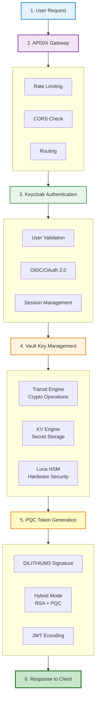
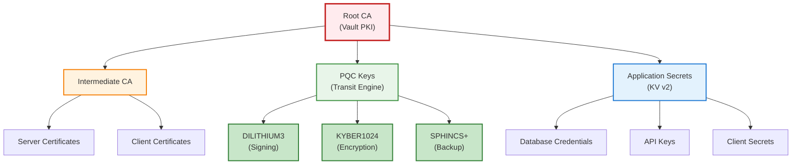
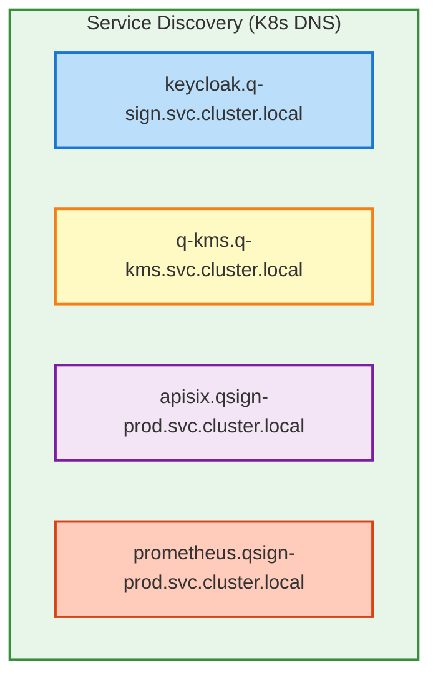
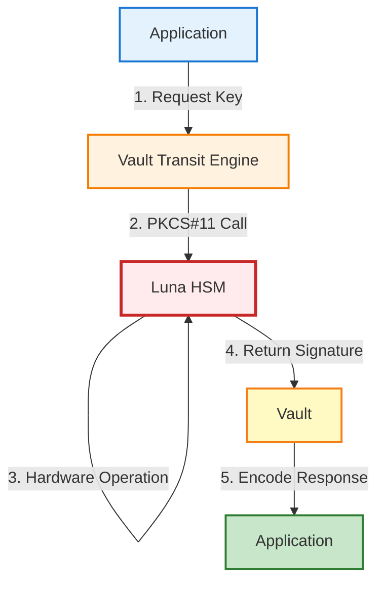

# QSIGN 아키텍처 개요

## 🏛️ 전체 아키텍처

```mermaid
graph TB
    subgraph External["External Access Layer"]
        GitLab["GitLab<br/>:7743"]
        Harbor["Harbor<br/>:31800"]
        Jenkins["Jenkins<br/>:7643"]
        Clients["Clients<br/>Browser"]
    end

    subgraph K8s["Kubernetes Cluster (K3s)"]
        subgraph Gateway["Ingress/Gateway Layer"]
            APISIX["APISIX Gateway<br/>:32602/:32294"]
            APIDash["APISIX Dashboard<br/>:31281"]
            ArgoUI["ArgoCD UI<br/>:30080"]
        end

        subgraph Auth["Authentication & Authorization"]
            KC_PQC["Keycloak PQC<br/>- Q-Sign<br/>Namespace: q-sign<br/>Port: 30181"]
            KC_HSM["Keycloak HSM<br/>- PQC-SSO<br/>Namespace: pqc-sso<br/>Port: 30699"]
        end

        subgraph KeyMgmt["Key Management Layer"]
            subgraph Vault["Q-KMS Vault (Namespace: q-kms)"]
                Transit["Transit Engine<br/>pqc-keys/"]
                KV["KV v2 Secrets<br/>secret/"]
                PKI["PKI Engine<br/>pki/"]
                HSM["Luna HSM Device<br/>/dev/k7pf0<br/>FIPS 140-2 Level 3<br/>PKCS#11 • Group: 997"]
                Transit --> HSM
            end
            VaultPort["Port: 30820"]
        end

        subgraph AppLayer["Application Layer"]
            App1["App1<br/>:30210"]
            App3["App3<br/>:30202"]
            App6["App6<br/>:30205"]
            SSOTest["SSO Test App<br/>:32127"]
            AppNS["Namespace: q-app"]
        end

        subgraph Monitor["Monitoring & Logging"]
            Prom["Prometheus<br/>:30092"]
            Grafana["Grafana<br/>:30030"]
            Sky["SkyWalking<br/>:30094"]
            ES["Elasticsearch<br/>ClusterIP"]
            MonNS["Namespace: qsign-prod"]
        end

        subgraph Storage["Storage & Database"]
            PG1["PostgreSQL<br/>- Q-Sign<br/>:5432"]
            PG2["PostgreSQL<br/>- PQC-SSO<br/>:5432"]
            PV["Local Path PV<br/>Storage"]
        end
    end

    GitLab --> APISIX
    Harbor --> APISIX
    Jenkins --> APISIX
    Clients --> APISIX

    APISIX --> KC_PQC
    APISIX --> KC_HSM

    KC_PQC <--> KC_HSM
    KC_PQC --> Vault
    KC_HSM --> Vault

    KC_PQC --> PG1
    KC_HSM --> PG2

    Prom --> Grafana
    Sky --> ES
    ES --> Grafana

    style External fill:#e3f2fd,stroke:#1976d2,stroke-width:2px
    style Gateway fill:#f3e5f5,stroke:#7b1fa2,stroke-width:2px
    style Auth fill:#e8f5e9,stroke:#388e3c,stroke-width:2px
    style KeyMgmt fill:#fff3e0,stroke:#f57c00,stroke-width:2px
    style Vault fill:#fff9c4,stroke:#f57f17,stroke-width:2px
    style HSM fill:#ffebee,stroke:#c62828,stroke-width:3px
    style AppLayer fill:#e1f5fe,stroke:#0277bd,stroke-width:2px
    style Monitor fill:#fce4ec,stroke:#c2185b,stroke-width:2px
    style Storage fill:#f1f8e9,stroke:#558b2f,stroke-width:2px
```



## 🎯 아키텍처 원칙

### 1. 보안 우선 (Security First)
- **Defense in Depth**: 다층 보안 구조
- **Zero Trust**: 모든 요청 검증
- **Quantum-Resistant**: PQC 알고리즘 사용
- **HSM Integration**: 하드웨어 기반 키 보호

### 2. 확장성 (Scalability)
- **Horizontal Scaling**: 수평 확장 가능
- **Stateless Design**: 상태 비저장 애플리케이션
- **Load Balancing**: 트래픽 분산
- **Auto-scaling**: 자동 스케일링 지원

### 3. 가용성 (High Availability)
- **Redundancy**: 중복 구성
- **Health Checks**: 상태 모니터링
- **Rolling Updates**: 무중단 배포
- **Backup & Recovery**: 백업 및 복구

### 4. 관찰성 (Observability)
- **Metrics**: Prometheus 메트릭
- **Logging**: Centralized 로그
- **Tracing**: 분산 추적
- **Dashboards**: 시각화

### 5. 자동화 (Automation)
- **GitOps**: Git 기반 배포
- **CI/CD**: 자동 빌드/배포
- **IaC**: Infrastructure as Code
- **Self-healing**: 자가 복구

## 🔐 보안 아키텍처

### 인증 흐름



### 키 계층 구조



## 🌐 네트워크 아키텍처

### NodePort 매핑
| Service | Internal Port | NodePort | Protocol |
|---------|---------------|----------|----------|
| Keycloak PQC | 8080 | 30181 | HTTP |
| Keycloak HSM | 80 | 30699 | HTTP |
| Q-KMS Vault | 8200 | 30820 | HTTP |
| APISIX Gateway | 9080 | 32602 | HTTP |
| APISIX HTTPS | 9443 | 32294 | HTTPS |
| APISIX Dashboard | 9000 | 31281 | HTTP |
| Grafana | 3000 | 30030 | HTTP |
| Prometheus | 9090 | 30092 | HTTP |
| SkyWalking | 8080 | 30094 | HTTP |
| ArgoCD | 8080 | 30080 | HTTP/HTTPS |
| Admin Dashboard | 80 | 30093 | HTTP |
| Harbor | 80 | 31800 | HTTP |

### 서비스 메시



## 📊 데이터 흐름

### SSO 인증 데이터 흐름

```mermaid
sequenceDiagram
    participant U as 사용자<br/>- 브라우저
    participant APP as Q-App<br/>- 애플리케이션
    participant A as APISIX<br/>Gateway
    participant K as Keycloak<br/>- Q-Sign
    participant V as Vault<br/>- 키 관리
    participant H as Luna HSM<br/>- 하드웨어 보안
    participant D as PostgreSQL<br/>- 사용자 DB

    U->>APP: 1. 애플리케이션 접속
    APP-->>U: 2. 메인 페이지 표시<br/>- 로그인 버튼
    U->>APP: 3. 로그인 버튼 클릭
    APP->>A: 4. 로그인 요청
    A->>K: 5. Redirect to Keycloak
    K->>D: 6. 사용자 검증
    D-->>K: 7. 사용자 데이터
    K->>V: 8. PQC 키 요청
    V->>H: 9. DILITHIUM3 서명
    H-->>V: 10. 서명 결과
    V-->>K: 11. 서명된 데이터
    K->>K: 12. JWT 토큰 생성
    K-->>A: 13. 토큰 반환
    A-->>APP: 14. 액세스 토큰
    APP-->>U: 15. 인증 완료<br/>- 메인 화면 이동
```


### 키 관리 데이터 흐름



## 🔄 GitOps 흐름


## 📈 확장 전략

### 수평 확장


**Scalable Components:**
- Keycloak: ReplicaSet (2+)
- APISIX: ReplicaSet (2+)
- Application Pods: Auto-scaling
- Prometheus: Federation
- Grafana: Load Balanced

**Non-scalable Components:**
- Vault: Single Instance (HA requires Raft)
- PostgreSQL: Single Instance (Replication possible)
- Luna HSM: Single Device

### 리소스 최적화
```yaml
Resource Management:
  - Resource Requests/Limits
  - HPA (Horizontal Pod Autoscaler)
  - VPA (Vertical Pod Autoscaler)
  - Node Affinity
  - Pod Anti-affinity
```

## 🛡️ 재해 복구

### 백업 및 복구 플로우


### 백업 대상
**1. Configuration Backups**
- Kubernetes Manifests (GitLab)
- Helm Charts (GitLab)
- ArgoCD Applications (GitLab)

**2. Data Backups**
- PostgreSQL Databases
- Vault Data
- Persistent Volumes

**3. Secrets Backups**
- Vault Unseal Keys
- Root Tokens
- Client Secrets

### 복구 절차


---

**Last Updated**: 2025-11-16
**Version**: 1.0.0
**Architecture Review**: Quarterly
