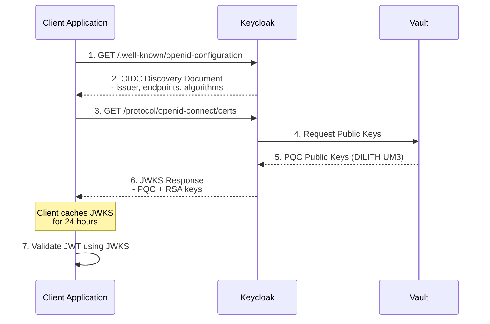
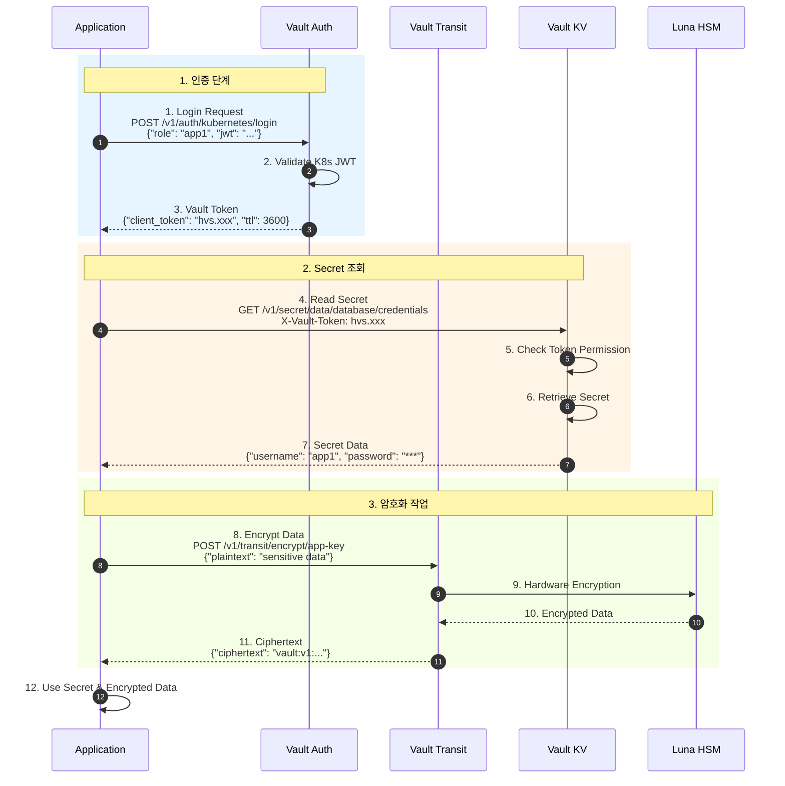
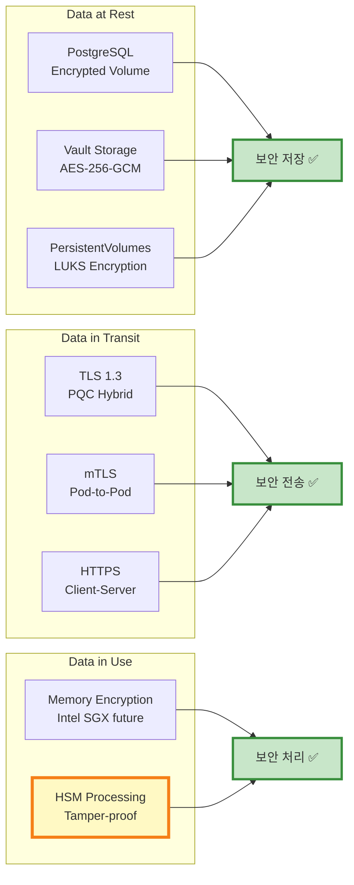

# 데이터 플로우

## 📘 개요

QSIGN 시스템의 데이터 플로우는 사용자 인증, 토큰 발급, 키 관리, API 호출 등 다양한 시나리오에서 데이터가 어떻게 흐르는지를 상세하게 기술합니다.

## 🔐 인증 플로우

### 1. 전체 SSO 인증 플로우

```mermaid
sequenceDiagram
    autonumber
    participant U as 사용자<br/>- 브라우저
    participant GW as APISIX<br/>Gateway
    participant KC as Keycloak<br/>- Q-Sign
    participant DB as PostgreSQL<br/>- 사용자 DB
    participant V as Vault<br/>- Q-KMS
    participant HSM as Luna HSM<br/>- Hardware

    U->>GW: 1. 로그인 페이지 요청
    GW->>KC: 2. Redirect to Keycloak
    KC-->>U: 3. 로그인 폼 반환

    U->>KC: 4. 사용자 인증 정보 제출<br/>- username, password
    KC->>DB: 5. 사용자 검증 쿼리
    DB-->>KC: 6. 사용자 정보 반환

    alt 인증 성공
        KC->>KC: 7. 세션 생성
        KC->>V: 8. PQC 서명 키 요청<br/>- Transit API
        V->>HSM: 9. DILITHIUM3 서명 요청<br/>- PKCS#11
        HSM->>HSM: 10. Hardware 서명 생성
        HSM-->>V: 11. 서명 데이터 반환
        V-->>KC: 12. 서명된 데이터 반환

        KC->>KC: 13. JWT 토큰 생성<br/>- Header + Payload + PQC Signature
        KC-->>U: 14. Access Token + Refresh Token<br/>- Set-Cookie / Response Body

        U->>GW: 15. API 요청 + JWT Token
        GW->>GW: 16. JWT 검증<br/>- PQC Signature Verification
        GW->>KC: 17. Token Introspection (선택적)
        KC-->>GW: 18. Token Valid ✅

        GW->>APP: 19. Authenticated Request
        APP-->>GW: 20. Response
        GW-->>U: 21. Final Response
    else 인증 실패
        KC-->>U: 로그인 실패 ❌
    end

    style KC fill:#bbdefb,stroke:#1976d2,stroke-width:3px
    style V fill:#c8e6c9,stroke:#388e3c,stroke-width:3px
    style HSM fill:#fff9c4,stroke:#f57f17,stroke-width:4px
```

### 2. OAuth 2.0 Authorization Code Flow

```mermaid
sequenceDiagram
    autonumber
    participant U as 사용자
    participant APP as 애플리케이션
    participant KC as Keycloak
    participant V as Vault
    participant HSM as Luna HSM

    U->>APP: 1. 서비스 접속
    APP->>KC: 2. Authorization Request<br/>/auth?client_id=xxx&redirect_uri=xxx

    KC-->>U: 3. 로그인 페이지 표시
    U->>KC: 4. 로그인 (username/password)
    KC->>KC: 5. 사용자 인증

    alt 사용자 동의 필요
        KC-->>U: 6. Consent Screen
        U->>KC: 7. 동의 승인
    end

    KC->>V: 8. PQC 키로 Code 서명
    V->>HSM: 9. DILITHIUM3 서명
    HSM-->>V: 10. 서명 반환
    V-->>KC: 11. 서명된 Code

    KC-->>U: 12. Redirect with Authorization Code<br/>redirect_uri?code=xxx&state=xxx
    U->>APP: 13. Authorization Code 전달

    APP->>KC: 14. Token Request<br/>/token (code, client_secret)
    KC->>KC: 15. Code 검증
    KC->>V: 16. JWT 서명 요청
    V->>HSM: 17. DILITHIUM3 서명
    HSM-->>V: 18. 서명 반환
    V-->>KC: 19. 서명 데이터

    KC-->>APP: 20. Access Token + Refresh Token + ID Token
    APP->>APP: 21. 토큰 저장

    APP->>GW: 22. API 요청 with Token
    GW->>API: 23. Authenticated Request
    API-->>GW: 24. Response
    GW-->>APP: 25. Final Response
    APP-->>U: 26. 서비스 제공

    style KC fill:#bbdefb,stroke:#1976d2,stroke-width:3px
    style V fill:#c8e6c9,stroke:#388e3c,stroke-width:3px
    style HSM fill:#fff9c4,stroke:#f57f17,stroke-width:4px
```

### 3. OIDC Discovery 및 JWKS



## 🔑 키 관리 플로우

### 1. PQC 키 생성 플로우

```mermaid
sequenceDiagram
    autonumber
    participant Admin
    participant V as Vault
    participant HSM as Luna HSM
    participant QRNG as Quantum RNG
    participant DB as Vault Storage

    Admin->>V: 1. Create Transit Key<br/>POST /v1/transit/keys/dilithium3-key

    V->>V: 2. Validate Request
    V->>HSM: 3. Initialize PKCS#11 Session
    HSM-->>V: 4. Session Handle

    V->>HSM: 5. Request Entropy
    HSM->>QRNG: 6. Generate Quantum Random
    QRNG-->>HSM: 7. 256-bit Entropy
    HSM-->>V: 8. Random Bytes

    V->>HSM: 9. Generate DILITHIUM3 Keypair<br/>- C_GenerateKeyPair
    HSM->>HSM: 10. Create Key in Hardware
    HSM-->>V: 11. Key Handle + Public Key

    V->>DB: 12. Store Metadata<br/>- key_id, algorithm, created_at
    DB-->>V: 13. Storage Confirmed

    V-->>Admin: 14. Key Created ✅<br/>{key_id, public_key, metadata}

    Note over HSM: Private Key는<br/>HSM에만 저장됨<br/>- 절대 추출 불가

    style QRNG fill:#ffccbc,stroke:#d84315,stroke-width:3px
    style HSM fill:#fff9c4,stroke:#f57f17,stroke-width:4px
```

### 2. 서명 생성 플로우

```mermaid
sequenceDiagram
    autonumber
    participant APP as Application
    participant V as Vault Transit
    participant HSM as Luna HSM
    participant CACHE as Key Cache

    APP->>V: 1. Sign Request<br/>POST /v1/transit/sign/dilithium3-key<br/>{"input": "base64(data)"}

    V->>CACHE: 2. Check Key Handle Cache
    alt Cache Hit
        CACHE-->>V: 3. Key Handle
    else Cache Miss
        V->>HSM: 4. Lookup Key
        HSM-->>V: 5. Key Handle
        V->>CACHE: 6. Update Cache
    end

    V->>V: 7. Decode Input Data
    V->>HSM: 8. Sign Request<br/>C_Sign(handle, data)

    HSM->>HSM: 9. DILITHIUM3 Signature<br/>- Hardware Operation
    HSM-->>V: 10. Signature (~3,293 bytes)

    V->>V: 11. Encode Signature (Base64)
    V-->>APP: 12. Sign Response<br/>{"signature": "base64(sig)"}

    Note over HSM: 서명 시간: ~1-2ms

    style HSM fill:#fff9c4,stroke:#f57f17,stroke-width:4px
```

### 3. 암호화/복호화 플로우

```mermaid
sequenceDiagram
    autonumber
    participant APP as Application
    participant V as Vault Transit
    participant HSM as Luna HSM

    rect rgb(200, 230, 255)
    Note over APP,HSM: 암호화 (Encryption)
    APP->>V: 1. Encrypt Request<br/>POST /v1/transit/encrypt/kyber1024-key<br/>{"plaintext": "base64(data)"}

    V->>HSM: 2. KYBER1024 Encapsulation<br/>C_Encrypt(data)
    HSM->>HSM: 3. Generate Shared Secret
    HSM->>HSM: 4. Encrypt with AES-256-GCM
    HSM-->>V: 5. Ciphertext + Encapsulated Key

    V-->>APP: 6. Encrypted Response<br/>{"ciphertext": "vault:v1:base64(ct)"}
    end

    rect rgb(200, 255, 200)
    Note over APP,HSM: 복호화 (Decryption)
    APP->>V: 7. Decrypt Request<br/>POST /v1/transit/decrypt/kyber1024-key<br/>{"ciphertext": "vault:v1:..."}

    V->>HSM: 8. KYBER1024 Decapsulation<br/>C_Decrypt(ciphertext)
    HSM->>HSM: 9. Recover Shared Secret
    HSM->>HSM: 10. Decrypt with AES-256-GCM
    HSM-->>V: 11. Plaintext

    V-->>APP: 12. Decrypted Response<br/>{"plaintext": "base64(data)"}
    end

    style HSM fill:#fff9c4,stroke:#f57f17,stroke-width:4px
```

### 4. 키 순환 플로우

```mermaid
sequenceDiagram
    autonumber
    participant CRON as Scheduled Job
    participant V as Vault
    participant HSM as Luna HSM
    participant OLD as Old Key
    participant NEW as New Key

    CRON->>V: 1. Rotate Key Request<br/>POST /v1/transit/keys/key-name/rotate

    V->>V: 2. Check Rotation Policy<br/>- min_rotation_period

    alt Rotation Allowed
        V->>HSM: 3. Generate New Keypair
        HSM-->>V: 4. New Key Handle + Public Key

        V->>V: 5. Update Key Version<br/>- v1 -> v2
        V->>V: 6. Set New Key as Primary

        Note over OLD,NEW: Old Key (v1): 검증 전용<br/>New Key (v2): 서명 + 검증

        V->>V: 7. Schedule Old Key Deletion<br/>- deletion_allowed_at: +90 days

        V-->>CRON: 8. Rotation Success ✅<br/>{latest_version: 2}
    else Rotation Not Allowed
        V-->>CRON: 9. Error: Too Soon
    end

    Note over V: 이전 버전 키는<br/>grace period 동안<br/>검증 가능

    style NEW fill:#c8e6c9,stroke:#388e3c,stroke-width:3px
    style OLD fill:#ffccbc,stroke:#d84315,stroke-width:2px
```

## 🌐 API 요청 플로우

### 1. APISIX Gateway를 통한 API 호출

```mermaid
sequenceDiagram
    autonumber
    participant C as Client
    participant GW as APISIX Gateway
    participant JWT as JWT Plugin
    participant RL as Rate Limit Plugin
    participant CORS as CORS Plugin
    participant UP as Upstream (App)
    participant PROM as Prometheus

    C->>GW: 1. API Request<br/>GET /api/v1/resource<br/>Authorization: Bearer <jwt>

    GW->>CORS: 2. CORS Check
    CORS->>CORS: 3. Validate Origin
    CORS-->>GW: 4. CORS OK ✅

    GW->>RL: 5. Rate Limit Check
    RL->>RL: 6. Check Request Count<br/>- Redis/Memory
    alt Rate Limit Exceeded
        RL-->>C: 429 Too Many Requests ❌
    else Rate Limit OK
        RL-->>GW: 7. Rate Limit OK ✅
    end

    GW->>JWT: 8. JWT Verification
    JWT->>JWT: 9. Extract Token from Header
    JWT->>JWT: 10. Decode JWT
    JWT->>JWT: 11. Verify PQC Signature<br/>- DILITHIUM3

    alt JWT Invalid
        JWT-->>C: 401 Unauthorized ❌
    else JWT Valid
        JWT-->>GW: 12. JWT Valid ✅<br/>- user_id, roles, scope
    end

    GW->>GW: 13. Add Headers<br/>- X-User-Id, X-User-Roles
    GW->>UP: 14. Upstream Request<br/>- with user context

    UP->>UP: 15. Business Logic
    UP-->>GW: 16. Response

    GW->>PROM: 17. Metrics Export<br/>- latency, status, path

    GW-->>C: 18. Final Response<br/>- with CORS headers

    style JWT fill:#bbdefb,stroke:#1976d2,stroke-width:3px
    style RL fill:#ffccbc,stroke:#d84315,stroke-width:2px
```

### 2. 애플리케이션에서 Vault 사용



## 📊 데이터 저장 플로우

### 1. PostgreSQL 데이터 저장

```mermaid
sequenceDiagram
    autonumber
    participant KC as Keycloak
    participant PG as PostgreSQL
    participant PV as Persistent Volume

    rect rgb(230, 245, 255)
    Note over KC,PG: 사용자 등록
    KC->>KC: 1. Hash Password<br/>- bcrypt/PBKDF2
    KC->>PG: 2. INSERT INTO users<br/>- username, password_hash, email
    PG->>PV: 3. Write to Disk
    PV-->>PG: 4. Write Confirmed
    PG-->>KC: 5. User Created ✅
    end

    rect rgb(255, 245, 230)
    Note over KC,PG: 세션 저장
    KC->>PG: 6. INSERT INTO sessions<br/>- session_id, user_id, expires_at
    PG->>PV: 7. Write to Disk
    PV-->>PG: 8. Write Confirmed
    PG-->>KC: 9. Session Stored ✅
    end

    rect rgb(245, 255, 230)
    Note over KC,PG: 백업
    PG->>PV: 10. pg_dump (Scheduled)
    PV-->>PG: 11. Backup File Created<br/>- /var/lib/postgresql/backups/
    end

    style PV fill:#f3e5f5,stroke:#7b1fa2,stroke-width:2px
```

### 2. Vault 데이터 저장

```mermaid
sequenceDiagram
    autonumber
    participant API as Vault API
    participant CORE as Vault Core
    participant ENC as Encryption
    participant STORAGE as File Storage
    participant MASTER as Master Key

    API->>CORE: 1. Write Secret<br/>PUT /v1/secret/data/myapp

    CORE->>CORE: 2. Check Token ACL
    CORE->>ENC: 3. Encrypt Secret

    ENC->>MASTER: 4. Get Encryption Key
    MASTER-->>ENC: 5. DEK (Data Encryption Key)

    ENC->>ENC: 6. AES-256-GCM Encrypt
    ENC-->>CORE: 7. Encrypted Data

    CORE->>STORAGE: 8. Write to Disk<br/>- /vault/data/logical/...
    STORAGE-->>CORE: 9. Write Confirmed

    CORE->>CORE: 10. Update Index
    CORE-->>API: 11. Write Success ✅

    Note over STORAGE: 모든 데이터는<br/>암호화되어 저장됨

    style ENC fill:#c8e6c9,stroke:#388e3c,stroke-width:3px
    style MASTER fill:#ffccbc,stroke:#d84315,stroke-width:4px
```

## 🔄 GitOps 배포 플로우

### 1. ArgoCD 자동 배포

```mermaid
sequenceDiagram
    autonumber
    participant DEV as Developer
    participant GIT as GitLab
    participant AR as ArgoCD
    participant K8S as Kubernetes
    participant APP as Application

    DEV->>GIT: 1. git push<br/>- update manifests
    GIT-->>DEV: 2. Commit SHA

    rect rgb(230, 245, 255)
    Note over GIT,AR: Auto Sync (3분마다)
    AR->>GIT: 3. Poll Repository
    GIT-->>AR: 4. Latest Commit

    AR->>AR: 5. Compare with Cluster State
    alt Changes Detected
        AR->>AR: 6. Generate Diff
        AR->>K8S: 7. kubectl apply<br/>- Rolling Update

        K8S->>K8S: 8. Create New Pod
        K8S->>APP: 9. Health Check
        APP-->>K8S: 10. Ready ✅

        K8S->>K8S: 11. Terminate Old Pod
        K8S-->>AR: 12. Deployment Success

        AR->>GIT: 13. Update Sync Status
    else No Changes
        AR->>AR: 14. Skip Sync
    end
    end

    AR->>AR: 15. Record Event
    AR-->>DEV: 16. Notification<br/>- Slack/Email

    style AR fill:#c8e6c9,stroke:#388e3c,stroke-width:3px
```

### 2. CI/CD 파이프라인 플로우

```mermaid
sequenceDiagram
    autonumber
    participant DEV as Developer
    participant GIT as GitLab
    participant JK as Jenkins
    participant HB as Harbor
    participant AR as ArgoCD
    participant K8S as Kubernetes

    DEV->>GIT: 1. git push (code)
    GIT->>JK: 2. Webhook Trigger

    rect rgb(255, 245, 230)
    Note over JK: Build Stage
    JK->>JK: 3. Checkout Code
    JK->>JK: 4. Run Tests
    JK->>JK: 5. Build Docker Image
    end

    rect rgb(245, 255, 230)
    Note over JK,HB: Push Stage
    JK->>HB: 6. docker push<br/>harbor.local/qsign/app:v1.2.3
    HB->>HB: 7. Security Scan
    HB-->>JK: 8. Image Pushed ✅
    end

    rect rgb(230, 245, 255)
    Note over JK,GIT: Update Manifests
    JK->>GIT: 9. Update image tag in<br/>gitops-repo/apps/deployment.yaml
    GIT-->>JK: 10. Commit Success
    end

    rect rgb(255, 230, 245)
    Note over AR,K8S: Deploy Stage
    AR->>GIT: 11. Detect Change
    AR->>K8S: 12. Apply Manifests
    K8S->>HB: 13. Pull Image
    HB-->>K8S: 14. Image Downloaded
    K8S->>K8S: 15. Deploy Pod
    K8S-->>AR: 16. Deployment Success ✅
    end

    AR-->>DEV: 17. Deployment Notification

    style JK fill:#bbdefb,stroke:#1976d2,stroke-width:2px
    style HB fill:#ffccbc,stroke:#d84315,stroke-width:2px
    style AR fill:#c8e6c9,stroke:#388e3c,stroke-width:3px
```

## 📈 모니터링 데이터 플로우

### 1. Prometheus 메트릭 수집

```mermaid
sequenceDiagram
    autonumber
    participant SRC as Metric Sources
    participant PROM as Prometheus
    participant GRAF as Grafana
    participant AM as AlertManager
    participant SLACK as Slack

    loop Every 15 seconds
        PROM->>SRC: 1. Scrape /metrics endpoint
        SRC-->>PROM: 2. Metrics Data<br/>- Prometheus format
    end

    PROM->>PROM: 3. Store in TSDB<br/>- Time Series Database

    rect rgb(230, 245, 255)
    Note over PROM,GRAF: Visualization
    GRAF->>PROM: 4. PromQL Query<br/>rate(http_requests_total[5m])
    PROM-->>GRAF: 5. Query Result
    GRAF->>GRAF: 6. Render Dashboard
    end

    rect rgb(255, 245, 230)
    Note over PROM,SLACK: Alerting
    PROM->>PROM: 7. Evaluate Alert Rules
    alt Alert Firing
        PROM->>AM: 8. Send Alert
        AM->>AM: 9. Group & Route
        AM->>SLACK: 10. Notification
        SLACK-->>AM: 11. Delivered ✅
    end
    end

    style PROM fill:#c8e6c9,stroke:#388e3c,stroke-width:3px
```

### 2. 로그 수집 플로우

```mermaid
sequenceDiagram
    autonumber
    participant APP as Application
    participant STDOUT as Container Logs
    participant FB as Fluent Bit
    participant ES as Elasticsearch
    participant KB as Kibana

    APP->>STDOUT: 1. Log Message<br/>- stdout/stderr
    STDOUT->>FB: 2. Tail Logs<br/>- DaemonSet

    FB->>FB: 3. Parse Log<br/>- JSON/Regex
    FB->>FB: 4. Add Metadata<br/>- namespace, pod, labels
    FB->>FB: 5. Filter/Transform

    FB->>ES: 6. Bulk Insert<br/>POST /_bulk
    ES->>ES: 7. Index Document
    ES-->>FB: 8. Index Success ✅

    KB->>ES: 9. Search Logs<br/>GET /logs-*/_search
    ES-->>KB: 10. Search Results
    KB->>KB: 11. Display in UI

    style ES fill:#c8e6c9,stroke:#388e3c,stroke-width:2px
```

## 🔍 데이터 흐름 메트릭

### 주요 지표

```yaml
데이터 처리 메트릭:

  인증 처리량:
    - 초당 로그인: ~100 requests/sec
    - JWT 발급: ~100 tokens/sec
    - JWT 검증: ~1,000 verifications/sec

  키 관리 처리량:
    - 서명 생성: ~500 signs/sec (HSM)
    - 서명 검증: ~2,000 verifies/sec
    - 암호화: ~300 ops/sec
    - 복호화: ~300 ops/sec

  API Gateway:
    - 총 요청 처리: ~5,000 requests/sec
    - 평균 레이턴시: < 10ms
    - P95 레이턴시: < 50ms
    - P99 레이턴시: < 100ms

  데이터 저장:
    - PostgreSQL Write: ~500 writes/sec
    - PostgreSQL Read: ~2,000 reads/sec
    - Vault Write: ~100 writes/sec
    - Vault Read: ~500 reads/sec

  모니터링:
    - Prometheus Samples: ~500,000/sec
    - Log Lines: ~10,000/sec
    - Metrics Retention: 15 days
    - Logs Retention: 30 days
```

## 🛡️ 데이터 보안

### 데이터 암호화 상태



---

**Last Updated**: 2025-11-16
**Version**: 1.0.0
**Data Classification**: Confidential
**Encryption**: TLS 1.3, AES-256-GCM, PQC (DILITHIUM3, KYBER1024)
