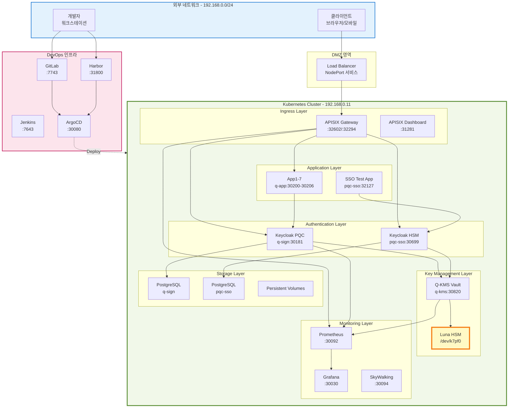
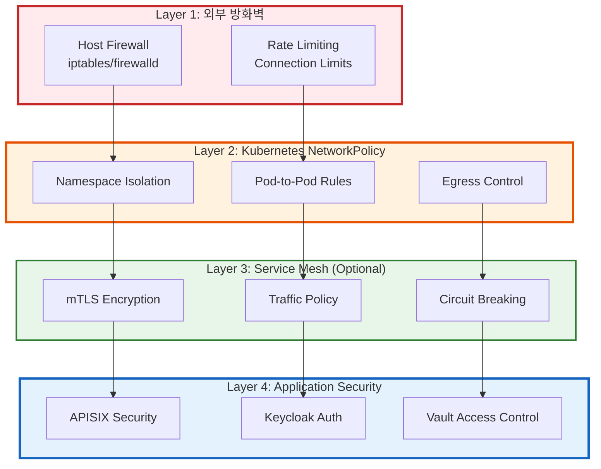
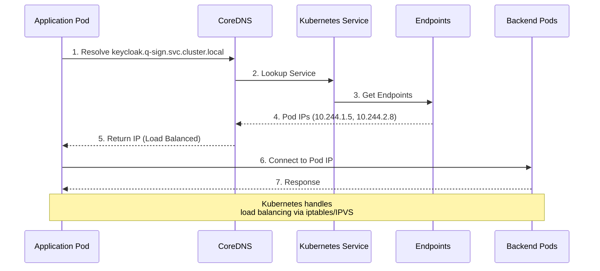
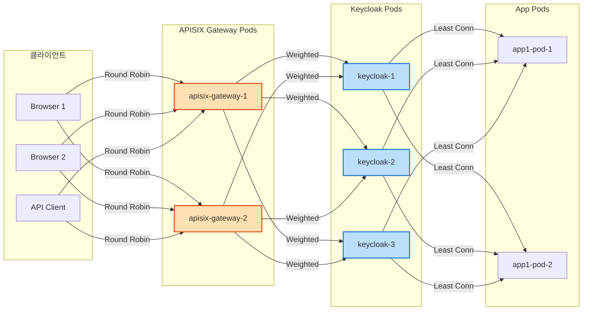
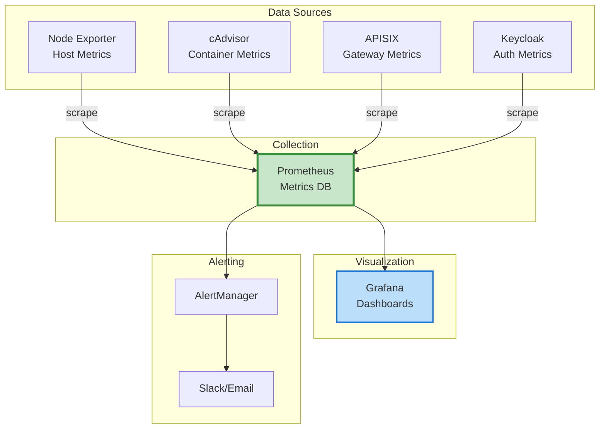
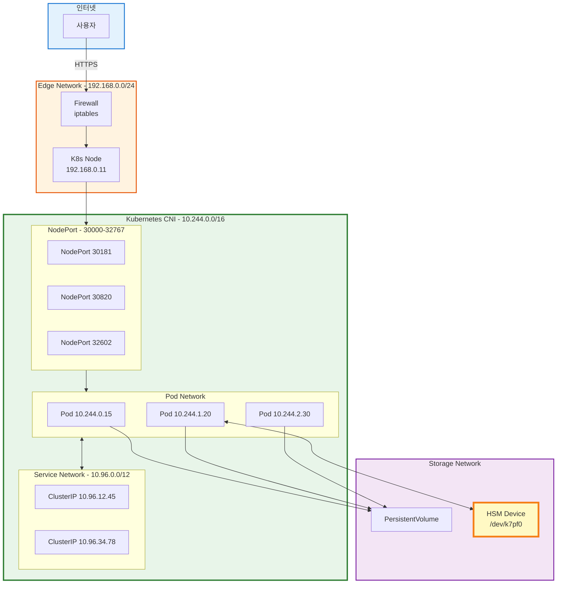

# 네트워크 토폴로지

## 📘 개요

QSIGN 시스템의 네트워크 구성은 Kubernetes 기반의 마이크로서비스 아키텍처로 설계되어 있으며, 보안, 확장성, 고가용성을 고려한 네트워크 토폴로지를 구축합니다.

## 🌐 전체 네트워크 구조

### 물리적 네트워크 토폴로지



## 🏗️ Kubernetes 네트워크 구조

### 네임스페이스 구성

```mermaid
graph TB
    subgraph K8S["Kubernetes Cluster"]
        subgraph NS1["Namespace: argocd"]
            AR_SVC[argocd-server<br/>ClusterIP + NodePort:30080]
            AR_REPO[argocd-repo-server<br/>ClusterIP]
            AR_CTRL[argocd-application-controller<br/>ClusterIP]
        end

        subgraph NS2["Namespace: q-sign"]
            KC_SVC[keycloak<br/>ClusterIP + NodePort:30181]
            PG_SVC[postgresql<br/>ClusterIP:5432]
        end

        subgraph NS3["Namespace: pqc-sso"]
            KC_HSM_SVC[keycloak-hsm<br/>ClusterIP + NodePort:30699]
            PG_HSM_SVC[postgresql-hsm<br/>ClusterIP:5432]
            SSO_SVC[sso-test-app<br/>ClusterIP + NodePort:32127]
        end

        subgraph NS4["Namespace: q-kms"]
            V_SVC[vault<br/>ClusterIP + NodePort:30820]
            V_AGENT[vault-agent<br/>DaemonSet]
        end

        subgraph NS5["Namespace: q-app"]
            APP_SVCS[app1-app7<br/>ClusterIP + NodePort:30200-30206]
        end

        subgraph NS6["Namespace: qsign-prod"]
            APISIX_SVC[apisix-gateway<br/>ClusterIP + NodePort:32602/32294]
            APISIX_ADMIN[apisix-admin<br/>ClusterIP:9180]
            APISIX_DASH_SVC[apisix-dashboard<br/>ClusterIP + NodePort:31281]
            PROM_SVC[prometheus<br/>ClusterIP + NodePort:30092]
            GRAF_SVC[grafana<br/>ClusterIP + NodePort:30030]
            SKY_SVC[skywalking-ui<br/>ClusterIP + NodePort:30094]
            ADMIN_SVC[admin-dashboard<br/>ClusterIP + NodePort:30093]
        end

        subgraph NS7["Namespace: harbor"]
            HB_CORE[harbor-core<br/>ClusterIP]
            HB_PORTAL[harbor-portal<br/>ClusterIP + NodePort:31800]
            HB_REG[harbor-registry<br/>ClusterIP]
        end
    end

    KC_SVC --> V_SVC
    KC_HSM_SVC --> V_SVC
    V_SVC -.->|HSM| HSM_DEV[/dev/k7pf0]

    APISIX_SVC --> KC_SVC
    APISIX_SVC --> KC_HSM_SVC
    APISIX_SVC --> APP_SVCS

    APP_SVCS --> KC_SVC
    SSO_SVC --> KC_HSM_SVC

    PROM_SVC --> KC_SVC
    PROM_SVC --> V_SVC
    PROM_SVC --> APISIX_SVC

    AR_SVC --> K8S

    style NS2 fill:#bbdefb,stroke:#1976d2,stroke-width:2px
    style NS3 fill:#b2dfdb,stroke:#00796b,stroke-width:2px
    style NS4 fill:#c8e6c9,stroke:#388e3c,stroke-width:2px
    style NS6 fill:#ffe0b2,stroke:#e64a19,stroke-width:2px
```

### Service 유형별 구성

```yaml
Service Types:

  ClusterIP (내부 통신):
    - PostgreSQL (q-sign, pqc-sso)
    - Vault (내부 API)
    - APISIX Admin API
    - ArgoCD Repo Server
    - Harbor Registry
    - Elasticsearch

  NodePort (외부 접근):
    - Keycloak PQC: 30181
    - Keycloak HSM: 30699
    - Q-KMS Vault: 30820
    - APISIX Gateway HTTP: 32602
    - APISIX Gateway HTTPS: 32294
    - APISIX Dashboard: 31281
    - Grafana: 30030
    - Prometheus: 30092
    - SkyWalking: 30094
    - ArgoCD: 30080
    - Admin Dashboard: 30093
    - App1-7: 30200-30206
    - SSO Test App: 32127
    - Harbor Portal: 31800

  LoadBalancer:
    - Not used (NodePort로 대체)

  ExternalName:
    - GitLab: gitlab.external
    - Jenkins: jenkins.external
```

## 🔒 네트워크 보안 정책

### NetworkPolicy 구성

```yaml
# q-sign 네임스페이스 NetworkPolicy
apiVersion: networking.k8s.io/v1
kind: NetworkPolicy
metadata:
  name: q-sign-network-policy
  namespace: q-sign
spec:
  podSelector:
    matchLabels:
      app: keycloak
  policyTypes:
    - Ingress
    - Egress

  ingress:
    # APISIX에서의 트래픽 허용
    - from:
      - namespaceSelector:
          matchLabels:
            name: qsign-prod
        podSelector:
          matchLabels:
            app: apisix
      ports:
      - protocol: TCP
        port: 8080

    # Prometheus 메트릭 수집 허용
    - from:
      - namespaceSelector:
          matchLabels:
            name: qsign-prod
        podSelector:
          matchLabels:
            app: prometheus
      ports:
      - protocol: TCP
        port: 9000

  egress:
    # PostgreSQL 접근 허용
    - to:
      - podSelector:
          matchLabels:
            app: postgresql
      ports:
      - protocol: TCP
        port: 5432

    # Vault 접근 허용
    - to:
      - namespaceSelector:
          matchLabels:
            name: q-kms
        podSelector:
          matchLabels:
            app: vault
      ports:
      - protocol: TCP
        port: 8200

    # DNS 쿼리 허용
    - to:
      - namespaceSelector:
          matchLabels:
            name: kube-system
        podSelector:
          matchLabels:
            k8s-app: kube-dns
      ports:
      - protocol: UDP
        port: 53
```

### 네트워크 보안 계층



## 📡 서비스 메시 및 DNS

### Kubernetes DNS 구조

```yaml
DNS 네이밍 컨벤션:

  서비스 FQDN:
    형식: <service>.<namespace>.svc.cluster.local
    예시:
      - keycloak.q-sign.svc.cluster.local
      - vault.q-kms.svc.cluster.local
      - apisix-gateway.qsign-prod.svc.cluster.local
      - postgresql.q-sign.svc.cluster.local

  Pod FQDN:
    형식: <pod-ip>.<namespace>.pod.cluster.local
    예시:
      - 10-244-0-10.q-sign.pod.cluster.local

  Headless Service:
    형식: <pod-name>.<service>.<namespace>.svc.cluster.local
    예시:
      - vault-0.vault.q-kms.svc.cluster.local
```

### Service Discovery



## 🌍 IP 주소 할당

### 네트워크 범위

```yaml
IP Address Allocation:

  호스트 네트워크:
    범위: 192.168.0.0/24
    게이트웨이: 192.168.0.1
    Kubernetes Node: 192.168.0.11
    GitLab: 192.168.0.11 (NodePort)
    Harbor: 192.168.0.11 (NodePort)
    Jenkins: 192.168.0.11 (NodePort)

  Kubernetes Pod Network:
    범위: 10.244.0.0/16
    서브넷 크기: /24 per node
    예시:
      - Node 1: 10.244.0.0/24
      - Node 2: 10.244.1.0/24
      - Node 3: 10.244.2.0/24

  Kubernetes Service Network:
    범위: 10.96.0.0/12
    ClusterIP 범위: 10.96.0.1 - 10.111.255.254
    예시:
      - kube-dns: 10.96.0.10
      - keycloak: 10.96.12.45
      - vault: 10.96.34.78

  NodePort Range:
    범위: 30000-32767
    사용 중:
      - 30080 (ArgoCD)
      - 30181 (Keycloak PQC)
      - 30699 (Keycloak HSM)
      - 30820 (Vault)
      - 32602/32294 (APISIX)
      - 30030 (Grafana)
      - 30092 (Prometheus)
      - 등등...
```

### Pod IP 할당 예시

| Namespace | Pod | IP Address | Node |
|-----------|-----|------------|------|
| q-sign | keycloak-0 | 10.244.0.15 | node-1 |
| q-sign | postgresql-0 | 10.244.0.16 | node-1 |
| q-kms | vault-0 | 10.244.1.20 | node-2 |
| qsign-prod | apisix-gateway-xxx | 10.244.2.30 | node-3 |
| qsign-prod | prometheus-xxx | 10.244.0.45 | node-1 |

## 🔀 트래픽 라우팅

### APISIX Gateway 라우팅

```yaml
APISIX Routes:

  # Keycloak PQC 라우팅
  - uri: /auth/*
    upstream: keycloak.q-sign.svc.cluster.local:8080
    plugins:
      - rate-limit
      - cors
      - jwt-auth

  # Vault API 라우팅
  - uri: /v1/*
    upstream: vault.q-kms.svc.cluster.local:8200
    plugins:
      - key-auth
      - ip-restriction

  # Application 라우팅
  - uri: /app1/*
    upstream: app1.q-app.svc.cluster.local:8080
    plugins:
      - jwt-auth
      - prometheus

  # Admin Dashboard
  - uri: /admin/*
    upstream: admin-dashboard.qsign-prod.svc.cluster.local:80
    plugins:
      - jwt-auth
      - rbac
```

### 로드 밸런싱



### 로드 밸런싱 알고리즘

```yaml
Load Balancing Strategies:

  APISIX Gateway:
    알고리즘: Round Robin
    헬스 체크: Passive + Active
    장애 조치: Automatic
    세션 고정: Cookie-based (선택적)

  Keycloak:
    알고리즘: Weighted Round Robin
    가중치: Based on Pod CPU/Memory
    헬스 체크: /health endpoint
    Retry: 3 attempts

  Vault:
    알고리즘: Consistent Hashing (단일 인스턴스)
    헬스 체크: /v1/sys/health
    Standby 모드: HA 지원 시

  Applications:
    알고리즘: Least Connection
    헬스 체크: Custom endpoint
    Circuit Breaker: Enabled
```

## 🔍 네트워크 모니터링

### 메트릭 수집



### 주요 네트워크 메트릭

```yaml
Network Metrics:

  Throughput:
    - apisix_http_requests_total
    - apisix_bandwidth
    - container_network_transmit_bytes_total
    - container_network_receive_bytes_total

  Latency:
    - apisix_http_latency
    - keycloak_response_time
    - vault_core_handle_request

  Errors:
    - apisix_http_status{code="5xx"}
    - keycloak_failed_login_total
    - vault_core_unsealed{status="false"}

  Connections:
    - apisix_http_connections_total
    - postgresql_connections_active
    - vault_runtime_num_goroutines

  DNS:
    - coredns_dns_request_duration_seconds
    - coredns_cache_hits_total
    - coredns_dns_responses_total
```

## 🛡️ 네트워크 보안 Best Practices

```yaml
보안 권장사항:

1. NetworkPolicy 사용:
   ✅ 모든 네임스페이스에 NetworkPolicy 적용
   ✅ 최소 권한 원칙 (Least Privilege)
   ✅ Deny All by Default
   ✅ 명시적 Allow Rules

2. 암호화 통신:
   ✅ Pod-to-Pod: mTLS (Optional)
   ✅ External: TLS 1.3
   ✅ Database: SSL/TLS
   ✅ HSM: Encrypted PKCS#11

3. 네트워크 격리:
   ✅ 네임스페이스 분리
   ✅ 민감 데이터 격리
   ✅ DMZ 구성
   ✅ Bastion Host (관리용)

4. 모니터링 및 로깅:
   ✅ 네트워크 플로우 로그
   ✅ 침입 탐지 시스템 (IDS)
   ✅ 비정상 트래픽 감지
   ✅ 정기 보안 감사

5. Rate Limiting:
   ✅ APISIX Rate Limiting
   ✅ Connection Limits
   ✅ Request Size Limits
   ✅ DDoS 방어
```

## 📊 네트워크 다이어그램 - 상세



---

**Last Updated**: 2025-11-16
**Version**: 1.0.0
**Network**: Kubernetes CNI (Flannel/Calico)
**IP Range**: 192.168.0.0/24 (Host), 10.244.0.0/16 (Pod), 10.96.0.0/12 (Service)
