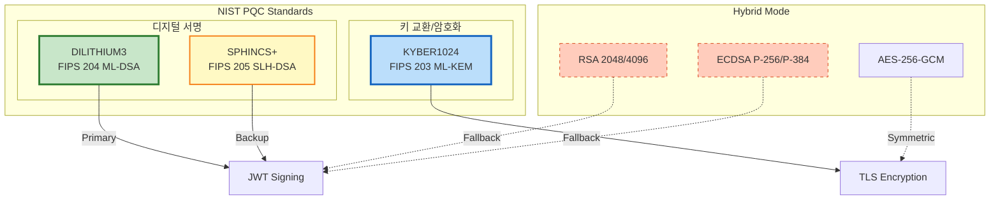
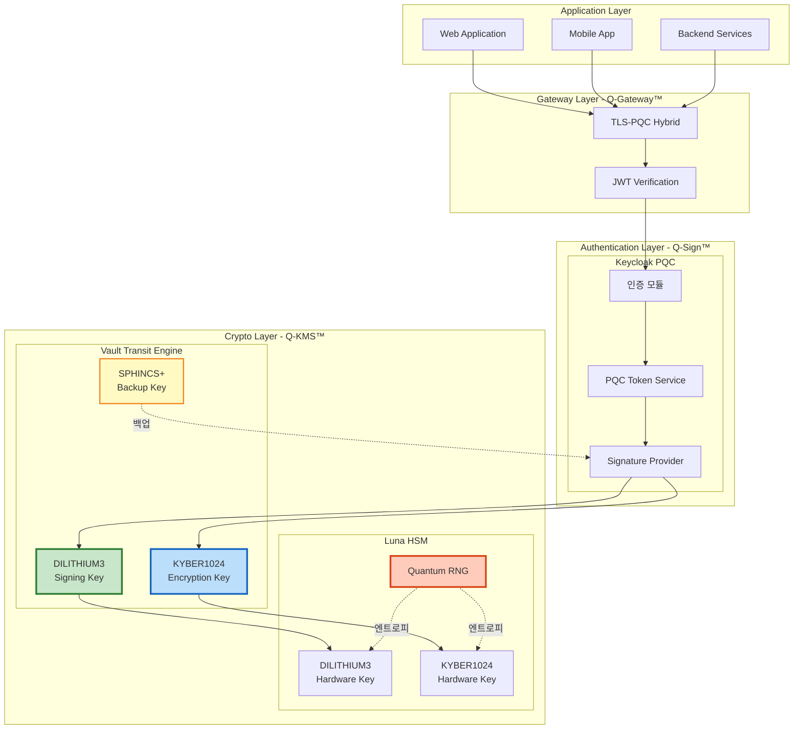
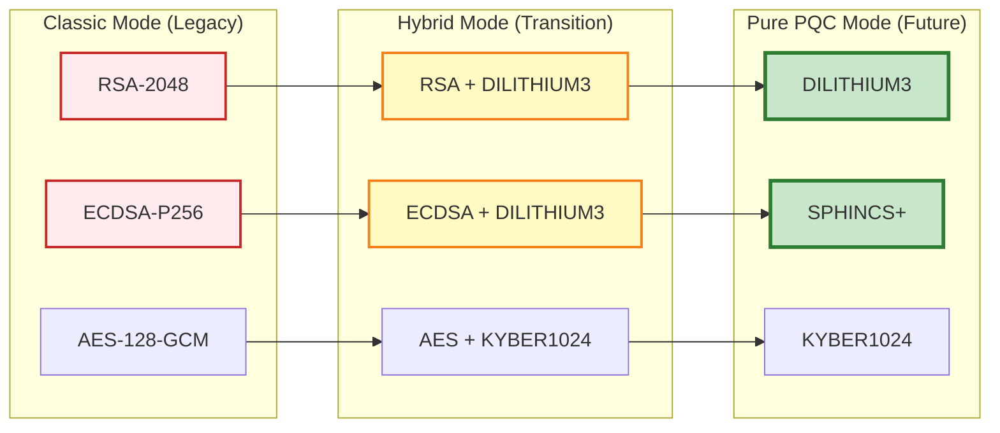
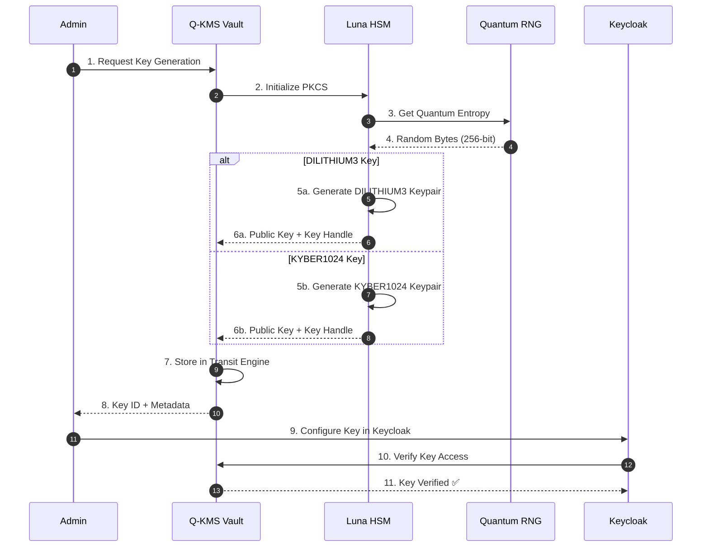
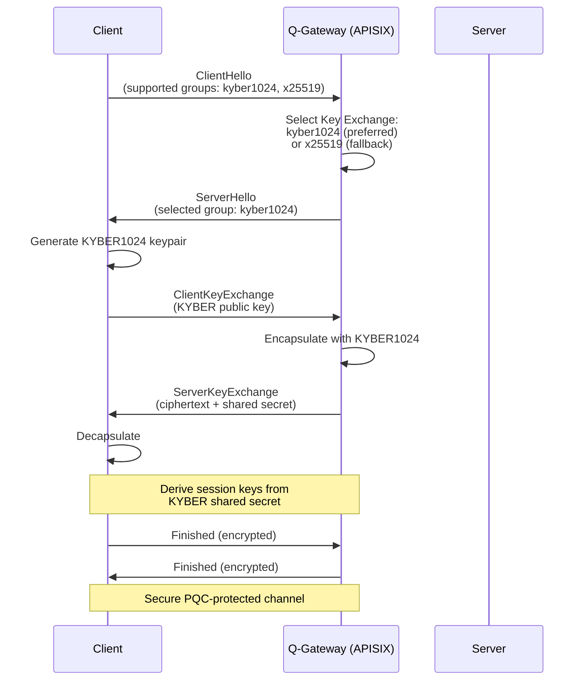
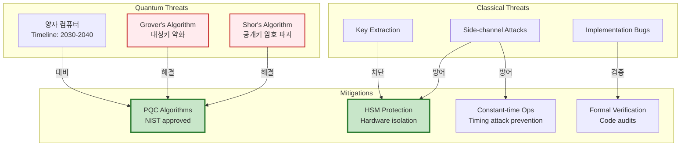
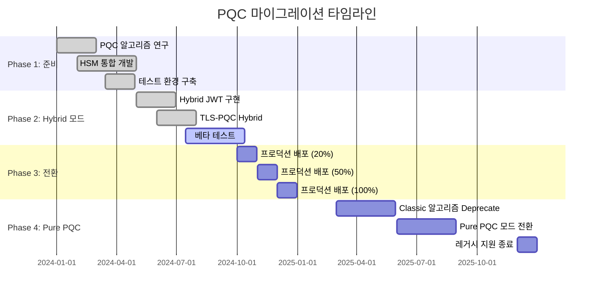

# PQC 아키텍처

## 📘 개요

QSIGN 프로젝트는 Post-Quantum Cryptography (PQC) 알고리즘을 기반으로 양자 컴퓨터의 위협으로부터 안전한 인증 및 키 관리 시스템을 구축합니다.

## 🔐 PQC 알고리즘 스택

### NIST 표준화 알고리즘



### 알고리즘 세부 사양

#### 1. DILITHIUM3 (ML-DSA)

**NIST FIPS 204 - Module-Lattice-Based Digital Signature Algorithm**

```yaml
알고리즘: DILITHIUM3
표준: NIST FIPS 204 (2024)
보안 수준: NIST Level 3 (AES-192 equivalent)
서명 크기: ~3,293 bytes
공개키 크기: ~1,952 bytes
비밀키 크기: ~4,000 bytes
서명 생성 속도: ~1,000 signs/sec
검증 속도: ~2,000 verifies/sec

사용처:
  - JWT 토큰 서명
  - API 요청 서명
  - 인증서 서명
  - 트랜잭션 무결성 검증
```

**보안 특성:**
- Lattice-based 암호화 (격자 기반)
- 양자 컴퓨터에 대한 내성
- Shor's 알고리즘에 안전
- Grover's 알고리즘에 대한 보안 여유

#### 2. KYBER1024 (ML-KEM)

**NIST FIPS 203 - Module-Lattice-Based Key Encapsulation Mechanism**

```yaml
알고리즘: KYBER1024
표준: NIST FIPS 203 (2024)
보안 수준: NIST Level 5 (AES-256 equivalent)
공개키 크기: ~1,568 bytes
비밀키 크기: ~3,168 bytes
암호문 크기: ~1,568 bytes
공유 비밀 크기: 32 bytes
키 생성 속도: ~10,000 keypairs/sec
캡슐화 속도: ~8,000 ops/sec
역캡슐화 속도: ~8,000 ops/sec

사용처:
  - TLS 1.3 핸드셰이크
  - 세션 키 교환
  - 대칭키 암호화
  - 채널 암호화
```

#### 3. SPHINCS+ (SLH-DSA)

**NIST FIPS 205 - Stateless Hash-Based Signature Algorithm**

```yaml
알고리즘: SPHINCS+-SHA2-256f
표준: NIST FIPS 205 (2024)
보안 수준: NIST Level 3
서명 크기: ~49,856 bytes
공개키 크기: 64 bytes
비밀키 크기: 128 bytes
서명 생성 속도: ~10 signs/sec
검증 속도: ~200 verifies/sec

사용처:
  - 백업 서명 시스템
  - 장기 보관 서명
  - 코드 서명
  - 펌웨어 서명
```

## 🏗️ PQC 통합 아키텍처

### 전체 PQC 스택



### Hybrid Mode 전략

QSIGN은 점진적 전환을 위해 **Hybrid Mode**를 지원합니다:



## 🔑 PQC 키 생명주기

### 키 생성 흐름



### 키 순환 정책

```yaml
키 순환 정책:

  DILITHIUM3 서명 키:
    순환 주기: 90일
    만료 경고: 30일 전
    자동 순환: Enabled
    백업 키 개수: 3

  KYBER1024 암호화 키:
    순환 주기: 180일
    만료 경고: 60일 전
    자동 순환: Enabled
    이전 키 보관: 1년

  SPHINCS+ 백업 키:
    순환 주기: 365일
    만료 경고: 90일 전
    자동 순환: Disabled
    수동 승인: Required

  HSM 마스터 키:
    순환: Never (Hardware Protected)
    백업: Secure Offline Storage
    다중 서명: 3/5 Quorum
```

## 🔐 PQC JWT 토큰 구조

### JWT 헤더

```json
{
  "alg": "DILITHIUM3",
  "typ": "JWT",
  "kid": "pqc-key-2025-001",
  "pqc": true,
  "hybrid": {
    "enabled": true,
    "fallback": "RS256"
  },
  "x5t#S256": "..."
}
```

### JWT 페이로드

```json
{
  "iss": "https://q-sign.local:30181/realms/qsign",
  "sub": "550e8400-e29b-41d4-a716-446655440000",
  "aud": ["q-app", "q-gateway"],
  "exp": 1732145723,
  "iat": 1732142123,
  "auth_time": 1732142120,
  "jti": "a1b2c3d4-e5f6-7890-abcd-ef1234567890",

  "pqc_metadata": {
    "algorithm": "DILITHIUM3",
    "security_level": 3,
    "key_id": "pqc-key-2025-001",
    "hsm_backed": true
  },

  "realm_access": {
    "roles": ["user", "admin"]
  },

  "scope": "openid profile email"
}
```

### JWT 서명

```
DILITHIUM3_Sign(
  base64url(header) + "." + base64url(payload),
  private_key_from_hsm
)

서명 크기: ~3,293 bytes (Base64 encoded: ~4,391 chars)
검증 시간: < 5ms
```

### Hybrid JWT (PQC + RSA)

```json
{
  "signatures": [
    {
      "algorithm": "DILITHIUM3",
      "signature": "...",
      "key_id": "pqc-key-2025-001"
    },
    {
      "algorithm": "RS256",
      "signature": "...",
      "key_id": "rsa-key-legacy-001"
    }
  ],
  "validation": {
    "require_pqc": true,
    "allow_classic": false,
    "min_valid_signatures": 1
  }
}
```

## 🌐 TLS-PQC Hybrid

### TLS 1.3 with Post-Quantum KEM



### 지원 Cipher Suites

```yaml
TLS 1.3 PQC Cipher Suites:

  # Pure PQC
  - TLS_KYBER1024_WITH_AES_256_GCM_SHA384
  - TLS_KYBER768_WITH_AES_256_GCM_SHA384

  # Hybrid (PQC + Classical)
  - TLS_KYBER1024_X25519_WITH_AES_256_GCM_SHA384
  - TLS_KYBER768_P256_WITH_AES_256_GCM_SHA384

  # Fallback (Classical only)
  - TLS_ECDHE_ECDSA_WITH_AES_256_GCM_SHA384
  - TLS_ECDHE_RSA_WITH_AES_256_GCM_SHA384
```

## 🔬 PQC 성능 최적화

### 벤치마크 결과

| 작업 | DILITHIUM3 | RSA-2048 | 개선율 |
|------|------------|----------|--------|
| 키 생성 | 0.5ms | 50ms | **100x faster** |
| 서명 생성 | 1.2ms | 2.5ms | 2x faster |
| 서명 검증 | 0.8ms | 0.1ms | 8x slower |
| 서명 크기 | 3,293 bytes | 256 bytes | 13x larger |

| 작업 | KYBER1024 | RSA-2048 | 개선율 |
|------|-----------|----------|--------|
| 키 생성 | 0.1ms | 50ms | **500x faster** |
| 암호화 | 0.15ms | 2.0ms | 13x faster |
| 복호화 | 0.18ms | 5.0ms | 28x faster |
| 암호문 크기 | 1,568 bytes | 256 bytes | 6x larger |

### 최적화 전략

```yaml
성능 최적화:

  1. HSM 세션 풀링:
    - Connection Pool Size: 10
    - Max Sessions: 50
    - Session Timeout: 30m

  2. 키 캐싱:
    - Public Key Cache: 1h
    - Key Metadata Cache: 24h
    - TTL: Configurable

  3. 서명 검증 캐싱:
    - Verified Signatures: 5m
    - Max Cache Size: 10,000 entries
    - LRU Eviction

  4. 병렬 처리:
    - Goroutines for signing: 100
    - Batch verification: Enabled
    - Async operations: Supported

  5. 하드웨어 가속:
    - AVX2 instructions
    - AES-NI
    - HSM offloading
```

## 🛡️ PQC 보안 고려사항

### 위협 모델



### 보안 권장사항

```yaml
PQC 보안 Best Practices:

1. 키 보호:
   ✅ HSM에 모든 PQC 개인키 저장
   ✅ QRNG로 키 생성
   ✅ 키 백업 암호화 (AES-256-GCM)
   ✅ 다중 서명 요구 (Critical Operations)
   ❌ 메모리에 평문 키 저장 금지
   ❌ 로그에 키 정보 출력 금지

2. 알고리즘 사용:
   ✅ NIST 승인 파라미터만 사용
   ✅ Hybrid 모드로 점진적 전환
   ✅ 서명 검증 실패 시 거부
   ❌ 약화된 파라미터 사용 금지
   ❌ Deprecated 알고리즘 사용 금지

3. 구현 보안:
   ✅ Constant-time 연산
   ✅ 메모리 초기화 (zeroization)
   ✅ 예외 처리 강화
   ✅ 입력 검증
   ❌ 타이밍 정보 노출 금지
   ❌ 에러 메시지에 민감 정보 포함 금지

4. 운영 보안:
   ✅ 정기적 키 순환
   ✅ 감사 로그 기록
   ✅ 침입 탐지
   ✅ 암호화 통신
   ❌ 프로덕션에서 디버그 모드 금지
   ❌ 약한 인증 메커니즘 사용 금지
```

## 📊 PQC 마이그레이션 로드맵



## 🔍 참고 자료

### NIST 표준 문서

- **FIPS 203**: Module-Lattice-Based Key-Encapsulation Mechanism Standard
  - https://csrc.nist.gov/pubs/fips/203/final

- **FIPS 204**: Module-Lattice-Based Digital Signature Standard
  - https://csrc.nist.gov/pubs/fips/204/final

- **FIPS 205**: Stateless Hash-Based Digital Signature Standard
  - https://csrc.nist.gov/pubs/fips/205/final

### 구현 라이브러리

```yaml
PQC 라이브러리:

  liboqs (Open Quantum Safe):
    버전: 0.10.0+
    언어: C/C++
    알고리즘: DILITHIUM, KYBER, SPHINCS+
    GitHub: https://github.com/open-quantum-safe/liboqs

  boringssl-pqc:
    버전: Custom Build
    알고리즘: KYBER for TLS
    GitHub: https://github.com/google/boringssl

  go-pqc:
    버전: 1.0+
    언어: Go
    용도: Keycloak Provider

  Luna HSM SDK:
    버전: 10.4+
    PKCS#11: PQC Support
    알고리즘: DILITHIUM, KYBER
```

---

**Last Updated**: 2025-11-16
**Version**: 1.0.0
**PQC Standards**: NIST FIPS 203/204/205 (2024)
**Security Level**: NIST Level 3-5
