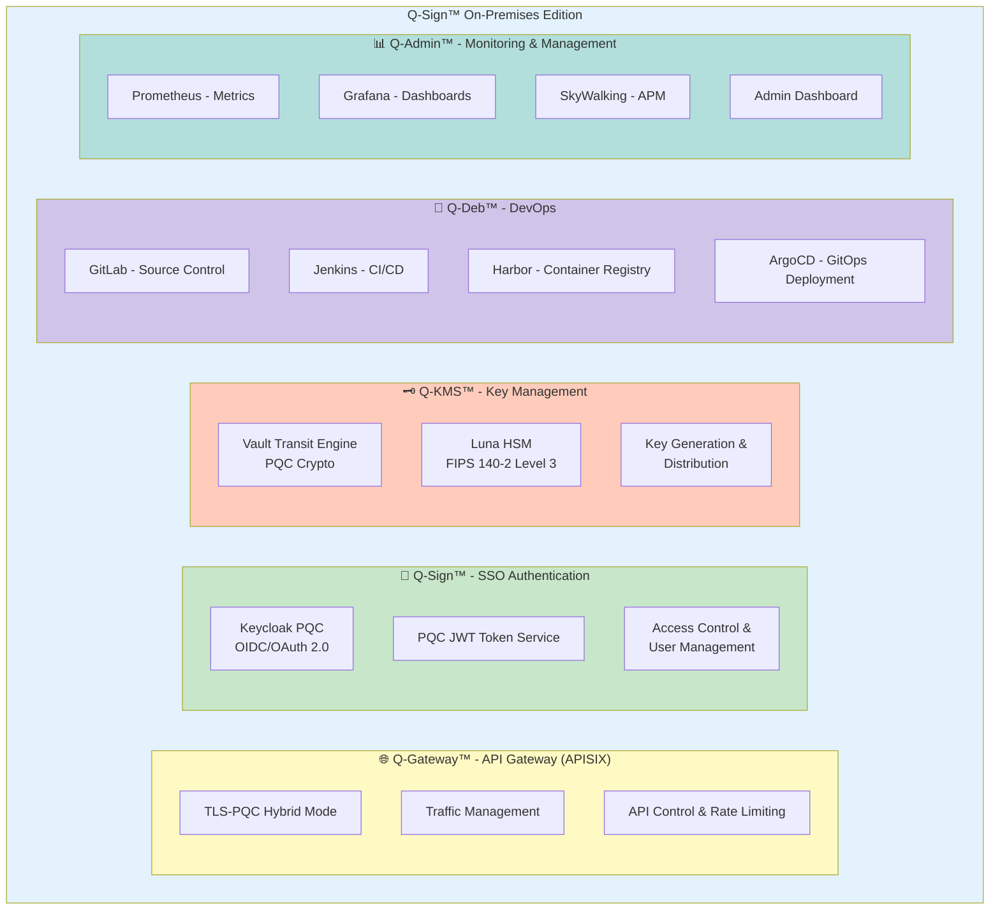

# 아키텍처 문서

QSIGN 시스템 아키텍처 및 설계 문서입니다.

## 📖 문서 목록

### 1. [ARCHITECTURE-OVERVIEW.md](./ARCHITECTURE-OVERVIEW.md)
전체 시스템 아키텍처 개요
- 전체 아키텍처 다이어그램
- 아키텍처 원칙 (보안, 확장성, 가용성, 관찰성, 자동화)
- 보안 아키텍처 및 인증 흐름
- 네트워크 아키텍처 및 NodePort 매핑
- GitOps 흐름 및 확장 전략
- 재해 복구 및 백업 플로우

### 2. [PQC-ARCHITECTURE.md](./PQC-ARCHITECTURE.md)
Post-Quantum Cryptography 아키텍처
- NIST PQC 표준 알고리즘 (DILITHIUM3, KYBER1024, SPHINCS+)
- PQC 통합 아키텍처 및 Hybrid Mode 전략
- PQC 키 생명주기 관리
- PQC JWT 토큰 구조
- TLS-PQC Hybrid 구성
- 성능 최적화 및 보안 고려사항

### 3. [NETWORK-TOPOLOGY.md](./NETWORK-TOPOLOGY.md)
네트워크 토폴로지 및 구성
- 전체 네트워크 구조 (물리/논리)
- Kubernetes 네트워크 구조 및 네임스페이스 구성
- NetworkPolicy 및 보안 정책
- Service Discovery 및 DNS
- IP 주소 할당 (Pod/Service/NodePort)
- 트래픽 라우팅 및 로드 밸런싱
- 네트워크 모니터링 및 메트릭

### 4. [DATA-FLOW.md](./DATA-FLOW.md)
데이터 플로우 및 통신 패턴
- 전체 SSO 인증 플로우
- OAuth 2.0 Authorization Code Flow
- OIDC Discovery 및 JWKS
- PQC 키 생성/서명/암호화/순환 플로우
- API Gateway를 통한 API 호출 플로우
- 데이터 저장 플로우 (PostgreSQL, Vault)
- GitOps 배포 및 CI/CD 파이프라인
- 모니터링 데이터 플로우 (Prometheus, 로그)

### 5. [SECURITY-DESIGN.md](./SECURITY-DESIGN.md)
보안 설계 및 정책
- Defense in Depth 다층 보안 아키텍처
- 인증 및 권한 부여 (MFA, RBAC)
- Keycloak 보안 정책
- HSM 기반 키 관리 및 보호
- 네트워크 보안 (TLS/SSL, NetworkPolicy, API Gateway)
- 데이터 보안 (암호화, 마스킹)
- 침입 탐지 및 방어
- 보안 감사 및 사고 대응

## 🏗️ 아키텍처 개요

### 시스템 구성 요소

### 핵심 아키텍처 원칙

1. **보안 우선 (Security First)**
   - PQC 알고리즘 (NIST FIPS 203/204/205)
   - HSM 하드웨어 키 보호
   - 다층 보안 (Defense in Depth)
   - Zero Trust 모델

2. **확장성 (Scalability)**
   - Kubernetes 기반 오케스트레이션
   - 수평 확장 (Horizontal Scaling)
   - 마이크로서비스 아키텍처
   - 로드 밸런싱

3. **고가용성 (High Availability)**
   - 다중 복제본 (Replicas)
   - 자동 장애 조치 (Failover)
   - Health Check & Self-healing
   - 백업 및 복구

4. **관찰성 (Observability)**
   - 중앙화된 로깅
   - 메트릭 수집 (Prometheus)
   - 분산 추적 (SkyWalking)
   - 실시간 모니터링

5. **자동화 (Automation)**
   - GitOps 배포 (ArgoCD)
   - CI/CD 파이프라인
   - Infrastructure as Code
   - 자동 스케일링

## 🔗 관련 문서

- [프로젝트 개요](../00-overview/) - 프로젝트 소개 및 시스템 컴포넌트
- [설치 가이드](../02-setup/) - 사전 요구사항 및 설치 방법
- [배포 가이드](../03-deployment/) - GitOps 및 Kubernetes 배포
- [운영 가이드](../04-operations/) - 일상 운영 및 모니터링
- [API 레퍼런스](../05-api-reference/) - API 문서 및 사용 예제
- [문제 해결](../06-troubleshooting/) - 일반적인 문제 및 디버깅

---

**Last Updated**: 2025-11-16
**Version**: 1.0.0
**Architecture Review**: Quarterly
