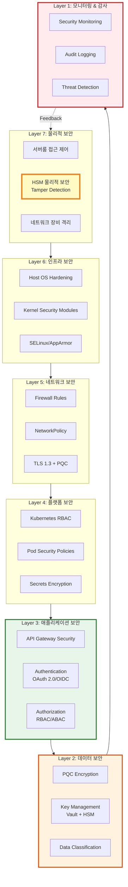
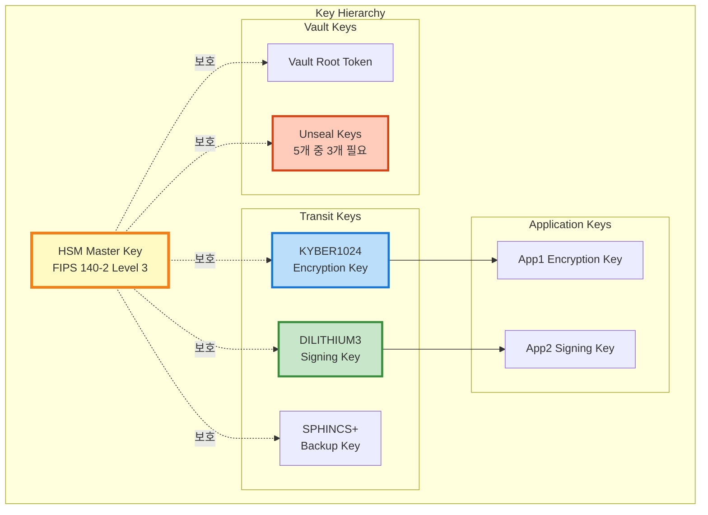
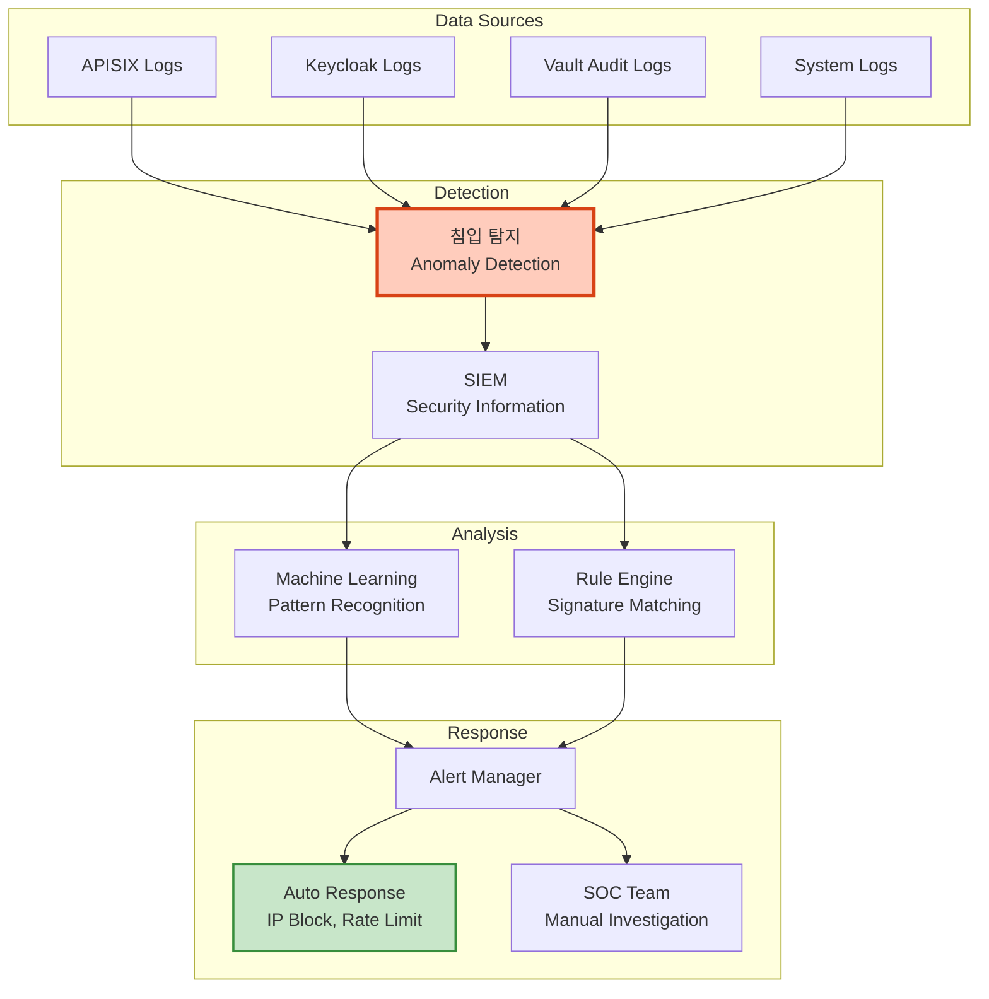
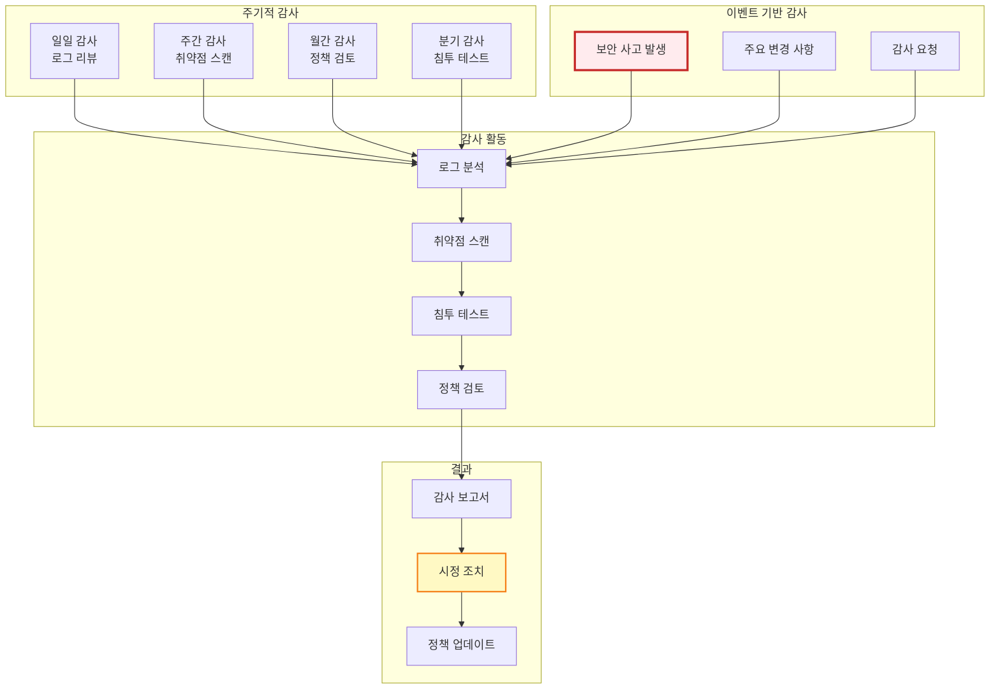

# 보안 설계

## 📘 개요

QSIGN 시스템은 Post-Quantum Cryptography (PQC)를 기반으로 다층 보안 아키텍처를 구현하여 양자 컴퓨터 시대에도 안전한 인증 및 키 관리 시스템을 제공합니다.

## 🛡️ 보안 아키텍처 계층

### Defense in Depth 전략



## 🔐 인증 및 권한 부여

### 1. 다단계 인증 (MFA)

```mermaid
sequenceDiagram
    autonumber
    participant U as 사용자
    participant KC as Keycloak
    participant OTP as OTP Provider
    participant DB as Database

    U->>KC: 1. Username + Password
    KC->>DB: 2. Verify Credentials
    DB-->>KC: 3. User Valid ✅

    alt MFA Enabled
        KC->>OTP: 4. Generate OTP
        OTP-->>U: 5. Send OTP (SMS/Email/App)
        U->>KC: 6. Submit OTP
        KC->>OTP: 7. Verify OTP
        OTP-->>KC: 8. OTP Valid ✅

        KC->>KC: 9. Create Session
        KC-->>U: 10. Access Token + Refresh Token
    else MFA Not Enabled
        KC-->>U: 11. Access Token (단일 인증)
    end

    style OTP fill:#bbdefb,stroke:#1976d2,stroke-width:2px
```

### 2. RBAC (Role-Based Access Control)

```yaml
역할 기반 접근 제어:

  역할 계층:
    1. Super Admin:
       - 모든 리소스 완전한 접근
       - 시스템 설정 변경
       - 사용자 관리
       - 키 관리

    2. Admin:
       - 애플리케이션 관리
       - 사용자 관리 (제한적)
       - 모니터링 대시보드 접근

    3. Developer:
       - API 접근
       - 애플리케이션 배포
       - 로그 조회

    4. User:
       - 자신의 리소스만 접근
       - 프로필 수정
       - 애플리케이션 사용

  권한 매트릭스:
    Resource         | Super Admin | Admin | Developer | User
    ─────────────────|─────────────|───────|───────────|──────
    Vault Keys       | CRUD        | R     | -         | -
    Keycloak Realm   | CRUD        | RU    | R         | -
    Applications     | CRUD        | CRUD  | RU        | R
    User Management  | CRUD        | RU    | R         | R(self)
    Monitoring       | CRUD        | R     | R         | -
    Audit Logs       | R           | R     | -         | -
```

### 3. Keycloak 보안 정책

```yaml
Keycloak 보안 설정:

  비밀번호 정책:
    - 최소 길이: 12자
    - 복잡도: 대문자 + 소문자 + 숫자 + 특수문자
    - 이력: 최근 5개 비밀번호 재사용 금지
    - 만료: 90일
    - 임시 잠금: 5회 실패 시 30분

  세션 관리:
    - SSO Session Idle: 30분
    - SSO Session Max: 10시간
    - Offline Session Idle: 30일
    - Remember Me: 비활성화 (프로덕션)

  토큰 정책:
    - Access Token Lifespan: 5분
    - Refresh Token Lifespan: 30분
    - Client Session Idle: 10분
    - Client Session Max: 1시간

  브루트 포스 방어:
    - 활성화: Yes
    - 최대 로그인 실패: 5회
    - 잠금 시간: 30분
    - 빠른 로그인 체크: 활성화
    - 최소 빠른 로그인 대기: 1분
```

## 🔑 키 관리 보안

### 1. HSM 기반 키 보호



### 2. 키 생명주기 관리

```yaml
키 생명주기 정책:

  1. 키 생성 (Key Generation):
     - HSM 내부 생성 (절대 외부 반출 불가)
     - Quantum RNG 사용
     - NIST 승인 파라미터
     - 생성 감사 로그

  2. 키 활성화 (Key Activation):
     - 다중 서명 승인 (3/5 quorum)
     - 활성화 시간 기록
     - 알림 전송

  3. 키 사용 (Key Usage):
     - ACL 기반 접근 제어
     - 사용량 모니터링
     - 이상 사용 감지

  4. 키 순환 (Key Rotation):
     - DILITHIUM3: 90일
     - KYBER1024: 180일
     - SPHINCS+: 365일
     - 자동 순환 + 수동 승인

  5. 키 아카이빙 (Key Archive):
     - Grace Period: 90일
     - 검증 전용 사용
     - 암호화 보관

  6. 키 폐기 (Key Destruction):
     - 승인 프로세스
     - 안전한 삭제 (Zeroization)
     - HSM 내부 파기
     - 폐기 증명서 발급
```

### 3. Vault 보안 설정

```yaml
Vault 보안 구성:

  초기화 (Initialization):
    - Shamir's Secret Sharing
    - Key Shares: 5
    - Key Threshold: 3
    - PGP Keys for Unseal (권장)

  Unsealing:
    - 수동 Unseal (자동 금지)
    - 3명의 Key Custodian 필요
    - Unseal Key 오프라인 보관
    - 하드웨어 토큰 사용 (YubiKey)

  인증 방법:
    - Kubernetes Auth (Pod 인증)
    - AppRole (애플리케이션)
    - LDAP (사용자)
    - Token (임시)
    - Cert (mTLS)

  Audit Device:
    - File Audit: /vault/audit/audit.log
    - Syslog Audit: localhost:514
    - Socket Audit: 10.0.0.100:9999
    - 모든 요청/응답 기록

  ACL Policy:
    path "secret/data/myapp/*" {
      capabilities = ["create", "read", "update"]
    }

    path "transit/sign/dilithium3-key" {
      capabilities = ["update"]
    }

    path "sys/*" {
      capabilities = ["deny"]
    }
```

## 🌐 네트워크 보안

### 1. TLS/SSL 설정

```yaml
TLS 구성:

  TLS 버전:
    - 최소: TLS 1.2
    - 권장: TLS 1.3
    - PQC Hybrid: 활성화

  Cipher Suites (TLS 1.3):
    # PQC Hybrid
    - TLS_KYBER1024_X25519_WITH_AES_256_GCM_SHA384
    - TLS_KYBER768_P256_WITH_AES_256_GCM_SHA384

    # Classical (Fallback)
    - TLS_AES_256_GCM_SHA384
    - TLS_CHACHA20_POLY1305_SHA256
    - TLS_AES_128_GCM_SHA256

  인증서 관리:
    - CA: Vault PKI Engine
    - 자동 갱신: 30일 전
    - 인증서 수명: 90일
    - SAN (Subject Alternative Names) 필수
    - OCSP Stapling: 활성화

  HSTS (HTTP Strict Transport Security):
    - max-age: 31536000 (1년)
    - includeSubDomains: true
    - preload: true
```

### 2. NetworkPolicy

```yaml
# 기본 Deny All 정책
apiVersion: networking.k8s.io/v1
kind: NetworkPolicy
metadata:
  name: default-deny-all
  namespace: q-sign
spec:
  podSelector: {}
  policyTypes:
    - Ingress
    - Egress

---
# Keycloak 허용 정책
apiVersion: networking.k8s.io/v1
kind: NetworkPolicy
metadata:
  name: keycloak-policy
  namespace: q-sign
spec:
  podSelector:
    matchLabels:
      app: keycloak
  policyTypes:
    - Ingress
    - Egress

  ingress:
    # APISIX에서만 접근 허용
    - from:
      - namespaceSelector:
          matchLabels:
            name: qsign-prod
        podSelector:
          matchLabels:
            app: apisix
      ports:
      - protocol: TCP
        port: 8080

  egress:
    # PostgreSQL 접근
    - to:
      - podSelector:
          matchLabels:
            app: postgresql
      ports:
      - protocol: TCP
        port: 5432

    # Vault 접근
    - to:
      - namespaceSelector:
          matchLabels:
            name: q-kms
        podSelector:
          matchLabels:
            app: vault
      ports:
      - protocol: TCP
        port: 8200

    # DNS
    - to:
      - namespaceSelector:
          matchLabels:
            name: kube-system
      ports:
      - protocol: UDP
        port: 53
```

### 3. API Gateway 보안

```yaml
APISIX 보안 플러그인:

  jwt-auth:
    algorithm: DILITHIUM3
    secret: from-vault
    exp: 300
    clock_skew: 10

  rate-limit:
    count: 100
    time_window: 60
    rejected_code: 429
    policy: local  # or redis

  ip-restriction:
    whitelist:
      - 192.168.0.0/24
      - 10.244.0.0/16
    message: "IP not allowed"

  cors:
    allow_origins: "https://app.example.com"
    allow_methods: "GET,POST,PUT,DELETE"
    allow_headers: "Authorization,Content-Type"
    max_age: 3600
    allow_credential: true

  request-validation:
    header_schema:
      type: object
      required: ["Authorization"]
    body_schema:
      type: object
      maxProperties: 10

  limit-req:
    rate: 100
    burst: 50
    key: "remote_addr"
    rejected_code: 503

  csrf:
    key: "csrf-token-secret-key"
```

## 🔒 데이터 보안

### 1. 암호화 정책

```yaml
데이터 암호화:

  데이터 분류:
    Level 1 - 공개:
      - 암호화: 선택적
      - 예: 공개 문서, 로고

    Level 2 - 내부:
      - 암호화: TLS in transit
      - 예: 일반 업무 데이터

    Level 3 - 기밀:
      - 암호화: TLS + at-rest encryption
      - 예: 사용자 정보, 로그

    Level 4 - 극비:
      - 암호화: PQC + HSM
      - 예: 인증 토큰, 암호화 키

  암호화 알고리즘:
    대칭키:
      - AES-256-GCM (인증 암호화)
      - ChaCha20-Poly1305

    비대칭키 (PQC):
      - DILITHIUM3 (서명)
      - KYBER1024 (키 교환)
      - SPHINCS+ (백업)

    비대칭키 (Classical):
      - RSA-4096 (레거시)
      - ECDSA-P384 (레거시)

    해시:
      - SHA-256
      - SHA-384
      - BLAKE2b

  키 관리:
    - 모든 키는 HSM 저장
    - 키 순환: 정기적
    - 키 백업: 암호화 + 오프라인
```

### 2. 데이터 마스킹

```yaml
민감 데이터 처리:

  로그 마스킹:
    패턴:
      - 비밀번호: password=***
      - 토큰: token=xxx...xxx (앞뒤 3자만)
      - 이메일: u***@example.com
      - 전화번호: 010-****-5678
      - 주민번호: ******-*******

  데이터베이스:
    - 비밀번호: bcrypt hash
    - 개인정보: AES-256 암호화
    - 카드번호: Vault Transit Encryption

  API 응답:
    - 에러 메시지: 상세 정보 제거
    - 스택 트레이스: 프로덕션에서 비활성화
```

## 🛡️ 침입 탐지 및 방어

### 1. 보안 모니터링



### 2. 위협 탐지 규칙

```yaml
탐지 규칙:

  인증 공격:
    - 5분 내 로그인 실패 10회 이상
    - 1시간 내 50개 이상의 계정 시도
    - 새로운 IP에서 관리자 로그인
    - 비정상 시간대 접근 (새벽 2-5시)

  API 악용:
    - 1분 내 1000회 이상 API 호출
    - 404 에러 비율 > 50%
    - 비정상적인 User-Agent
    - SQL Injection 패턴 감지

  데이터 유출:
    - 대량 데이터 다운로드
    - 민감 데이터 접근 급증
    - 비정상 시간대 DB 쿼리
    - 외부 IP로 대량 전송

  권한 상승:
    - 권한 변경 시도
    - 관리자 API 무단 접근
    - Vault Root Token 사용
    - Kubernetes API 직접 호출
```

## 🔍 보안 감사

### 1. 감사 로그

```yaml
감사 로그 정책:

  로그 대상:
    인증/권한:
      - 로그인/로그아웃
      - 비밀번호 변경
      - 권한 변경
      - 토큰 발급/갱신

    키 관리:
      - 키 생성/삭제
      - 키 사용 (서명/암호화)
      - 키 순환
      - Vault Unseal

    데이터 접근:
      - 민감 데이터 조회
      - 데이터 수정/삭제
      - API 호출
      - 파일 다운로드

    시스템 변경:
      - 설정 변경
      - 소프트웨어 업데이트
      - 사용자 추가/삭제
      - 네트워크 정책 변경

  로그 형식:
    timestamp: 2025-11-16T10:30:45.123Z
    event_type: authentication.login
    user_id: user@example.com
    source_ip: 192.168.1.100
    user_agent: Mozilla/5.0...
    result: success
    resource: /api/v1/resource
    method: POST
    duration_ms: 45
    metadata:
      client_id: web-app
      realm: qsign

  로그 보관:
    - 실시간: Elasticsearch (30일)
    - 아카이브: Object Storage (1년)
    - 백업: Tape/Offline (7년)
    - 무결성: Digital Signature
```

### 2. 보안 감사 프로세스



## 🚨 사고 대응

### 보안 사고 대응 플로우

```mermaid
sequenceDiagram
    autonumber
    participant MON as Monitoring System
    participant IDS as IDS/IPS
    participant SOC as SOC Team
    participant IR as Incident Response
    participant MGMT as Management

    MON->>IDS: 1. 이상 징후 탐지
    IDS->>IDS: 2. 위협 분석

    alt Critical Threat
        IDS->>IR: 3. 즉시 알림
        IR->>IR: 4. 자동 차단<br/>(IP Block, Service Isolation)
        IR->>SOC: 5. 긴급 알림
    else Medium Threat
        IDS->>SOC: 6. 알림
        SOC->>SOC: 7. 분석
    end

    SOC->>IR: 8. 사고 확인
    IR->>IR: 9. 격리 조치
    IR->>IR: 10. 증거 수집
    IR->>IR: 11. 근본 원인 분석

    IR->>MGMT: 12. 사고 보고
    MGMT->>IR: 13. 대응 승인

    IR->>IR: 14. 복구 작업
    IR->>IR: 15. 검증

    IR->>MGMT: 16. 사후 보고
    IR->>IR: 17. 교훈 정리

    style IDS fill:#ffccbc,stroke:#d84315,stroke-width:3px
    style IR fill:#fff9c4,stroke:#f57f17,stroke-width:3px
```

### 사고 심각도 분류

```yaml
사고 심각도:

  P1 - Critical (치명적):
    정의:
      - 시스템 전체 중단
      - 데이터 유출 발생
      - HSM 침해
      - Root 권한 탈취

    대응 시간:
      - 인지: 15분 이내
      - 대응 시작: 30분 이내
      - 일차 차단: 1시간 이내

    대응 팀:
      - SOC: 전원
      - DevOps: On-call
      - Management: 임원

  P2 - High (높음):
    정의:
      - 주요 서비스 장애
      - 권한 상승 시도
      - DDoS 공격
      - 인증 우회 시도

    대응 시간:
      - 인지: 30분 이내
      - 대응 시작: 2시간 이내
      - 일차 차단: 4시간 이내

    대응 팀:
      - SOC: On-call
      - DevOps: Standby

  P3 - Medium (중간):
    정의:
      - 부분 서비스 장애
      - 브루트 포스 공격
      - 악성 트래픽

    대응 시간:
      - 인지: 1시간 이내
      - 대응 시작: 4시간 이내
      - 차단: 1일 이내

  P4 - Low (낮음):
    정의:
      - 정책 위반
      - 의심스러운 활동
      - 설정 오류

    대응 시간:
      - 검토: 1일 이내
      - 대응: 3일 이내
```

## 📋 보안 체크리스트

```yaml
보안 체크리스트 (배포 전 필수):

✅ 인증 & 권한:
  ☐ MFA 활성화
  ☐ 비밀번호 정책 설정
  ☐ RBAC 구성 완료
  ☐ 토큰 만료 시간 설정
  ☐ 세션 타임아웃 설정

✅ 암호화:
  ☐ TLS 1.3 활성화
  ☐ PQC Hybrid 모드 설정
  ☐ 인증서 유효성 확인
  ☐ 데이터베이스 암호화
  ☐ 백업 암호화

✅ 네트워크:
  ☐ NetworkPolicy 적용
  ☐ Firewall 규칙 설정
  ☐ IP Whitelist 구성
  ☐ Rate Limiting 활성화
  ☐ DDoS 방어 설정

✅ 키 관리:
  ☐ HSM 초기화 완료
  ☐ Vault Unseal Keys 안전 보관
  ☐ 키 순환 정책 설정
  ☐ 백업 키 생성
  ☐ 키 접근 권한 제한

✅ 모니터링:
  ☐ 감사 로그 활성화
  ☐ 보안 알림 설정
  ☐ IDS/IPS 배포
  ☐ 메트릭 수집 확인
  ☐ 대시보드 구성

✅ 애플리케이션:
  ☐ 취약점 스캔 완료
  ☐ 코드 리뷰 완료
  ☐ SAST/DAST 실행
  ☐ 의존성 검사
  ☐ 컨테이너 이미지 스캔

✅ 데이터:
  ☐ 데이터 분류 완료
  ☐ 민감 데이터 마스킹
  ☐ 백업 정책 설정
  ☐ 복구 테스트 완료
  ☐ 보관 정책 설정

✅ 규정 준수:
  ☐ 개인정보보호법 준수
  ☐ 정보보호 관리체계 (ISMS)
  ☐ 클라우드 보안 인증 (CSA)
  ☐ ISO 27001
  ☐ NIST Cybersecurity Framework
```

## 🔗 보안 참고 자료

### 표준 및 프레임워크

```yaml
보안 표준:

  암호화:
    - NIST FIPS 203: ML-KEM (Kyber)
    - NIST FIPS 204: ML-DSA (Dilithium)
    - NIST FIPS 205: SLH-DSA (SPHINCS+)
    - FIPS 140-2 Level 3: HSM 요구사항

  인증:
    - OAuth 2.0: RFC 6749
    - OpenID Connect 1.0
    - SAML 2.0
    - JWT: RFC 7519

  보안 프레임워크:
    - NIST Cybersecurity Framework
    - ISO/IEC 27001:2013
    - CIS Controls v8
    - OWASP Top 10
    - SANS Top 25

  클라우드 보안:
    - CSA STAR
    - Kubernetes Security Best Practices
    - CIS Kubernetes Benchmark
```

---

**Last Updated**: 2025-11-16
**Version**: 1.0.0
**Security Level**: NIST Level 3-5 (PQC)
**Compliance**: ISMS, ISO 27001, NIST CSF
**HSM**: Luna HSM FIPS 140-2 Level 3
