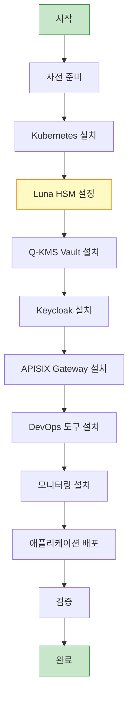

# 설치 가이드

## 📘 개요

QSIGN 시스템의 전체 설치 프로세스를 단계별로 안내합니다.

## 🚀 설치 흐름



## 📋 설치 순서

### 1단계: 시스템 준비

#### 1.1 OS 설치 및 업데이트

```bash
# Ubuntu 22.04 LTS 기준
sudo apt-get update
sudo apt-get upgrade -y
sudo apt-get install -y curl wget git jq openssl ca-certificates

# 시스템 재부팅 (필요시)
sudo reboot
```

#### 1.2 방화벽 설정

```bash
# UFW 방화벽 설정 (Ubuntu)
sudo ufw allow 22/tcp    # SSH
sudo ufw allow 80/tcp    # HTTP
sudo ufw allow 443/tcp   # HTTPS
sudo ufw allow 6443/tcp  # Kubernetes API
sudo ufw allow 30000:32767/tcp  # NodePort Range

# 방화벽 활성화
sudo ufw enable
sudo ufw status
```

#### 1.3 호스트명 및 네트워크 설정

```bash
# 호스트명 설정
sudo hostnamectl set-hostname qsign-node

# /etc/hosts 설정
sudo tee -a /etc/hosts <<EOF
192.168.0.11 qsign-node
192.168.0.11 vault.local
192.168.0.11 keycloak.local
192.168.0.11 argocd.local
EOF
```

### 2단계: Kubernetes (K3s) 설치

#### 2.1 K3s 설치

```bash
# K3s 설치 (단일 노드)
curl -sfL https://get.k3s.io | INSTALL_K3S_VERSION=v1.28.5+k3s1 sh -s - \
  --write-kubeconfig-mode 644 \
  --disable traefik \
  --disable servicelb

# K3s 상태 확인
sudo systemctl status k3s

# kubectl 설정
mkdir -p $HOME/.kube
sudo cp /etc/rancher/k3s/k3s.yaml $HOME/.kube/config
sudo chown $(id -u):$(id -g) $HOME/.kube/config

# 확인
kubectl get nodes
kubectl get pods -A
```

#### 2.2 Helm 설치

```bash
# Helm 3 설치
curl https://raw.githubusercontent.com/helm/helm/main/scripts/get-helm-3 | bash

# 버전 확인
helm version

# Helm 저장소 추가
helm repo add bitnami https://charts.bitnami.com/bitnami
helm repo add prometheus-community https://prometheus-community.github.io/helm-charts
helm repo add grafana https://grafana.github.io/helm-charts
helm repo update
```

### 3단계: Luna HSM 설정

#### 3.1 Luna HSM Client 설치

```bash
# Luna HSM Client 다운로드 (Thales 포털에서)
# lunaclient-10.4.0-linux-x86_64.tar

# 압축 해제
tar -xvf lunaclient-10.4.0-linux-x86_64.tar
cd lunaclient-10.4.0

# 설치
sudo ./install.sh -p sa

# 환경 변수 설정
echo 'export ChrystokiConfigurationPath=/etc/Chrystoki.conf' >> ~/.bashrc
echo 'export LD_LIBRARY_PATH=/usr/lib:$LD_LIBRARY_PATH' >> ~/.bashrc
source ~/.bashrc
```

#### 3.2 HSM 디바이스 확인

```bash
# HSM 디바이스 확인
ls -l /dev/k7pf0

# vault 사용자 생성
sudo useradd -r -s /bin/bash -u 997 -g 997 vault
sudo usermod -a -G hsmusers vault

# 디바이스 권한 설정
sudo chown root:hsmusers /dev/k7pf0
sudo chmod 0660 /dev/k7pf0
```

#### 3.3 HSM 파티션 초기화

```bash
# Luna Client Manager 실행
lunacm

# 슬롯 확인
lunacm:> slot list

# 파티션 초기화
lunacm:> partition init -label qsign-partition

# 파티션 비밀번호 설정 (프롬프트)
# 비밀번호 입력 (최소 8자, 복잡도 요구사항 충족)

# 슬롯 활성화
lunacm:> slot set -slot 0

# 파티션 로그인
lunacm:> partition login

# 종료
lunacm:> exit
```

### 4단계: 네임스페이스 생성

```bash
# 네임스페이스 생성
kubectl create namespace argocd
kubectl create namespace q-sign
kubectl create namespace pqc-sso
kubectl create namespace q-kms
kubectl create namespace q-app
kubectl create namespace qsign-prod
kubectl create namespace harbor

# 네임스페이스 확인
kubectl get namespaces
```

### 5단계: Q-KMS Vault 설치

#### 5.1 Vault Helm Chart 배포

```bash
# Vault Helm 저장소 추가
helm repo add hashicorp https://helm.releases.hashicorp.com
helm repo update

# Vault values.yaml 생성
cat > vault-values.yaml <<EOF
server:
  standalone:
    enabled: true
    config: |
      ui = true
      listener "tcp" {
        tls_disable = 1
        address = "[::]:8200"
        cluster_address = "[::]:8201"
      }
      storage "file" {
        path = "/vault/data"
      }
      seal "pkcs11" {
        lib = "/usr/lib/libCryptoki2_64.so"
        slot = "0"
        pin = "VAULT_HSM_PIN"
        key_label = "vault-hsm-key"
        hmac_key_label = "vault-hsm-hmac"
        generate_key = "true"
      }

  service:
    type: NodePort
    nodePort: 30820

  dataStorage:
    enabled: true
    size: 100Gi

ui:
  enabled: true
  serviceType: "NodePort"
EOF

# Vault 설치
helm install vault hashicorp/vault \
  --namespace q-kms \
  --values vault-values.yaml

# Vault Pod 확인
kubectl get pods -n q-kms
kubectl logs -n q-kms vault-0
```

#### 5.2 Vault 초기화

```bash
# Vault Pod에 접속
kubectl exec -it -n q-kms vault-0 -- /bin/sh

# Vault 초기화 (5 key shares, 3 key threshold)
vault operator init \
  -key-shares=5 \
  -key-threshold=3 \
  -format=json > /tmp/vault-init.json

# Unseal Keys와 Root Token 저장 (안전한 곳에 보관!)
cat /tmp/vault-init.json

# Vault Unseal (3개의 키 필요)
vault operator unseal <key1>
vault operator unseal <key2>
vault operator unseal <key3>

# Vault 로그인
export VAULT_TOKEN=<root-token>
vault login $VAULT_TOKEN

# Vault 상태 확인
vault status
```

#### 5.3 Vault Transit Engine 설정

```bash
# Transit Engine 활성화
vault secrets enable transit

# PQC 키 생성 (PKCS#11 via HSM)
vault write -f transit/keys/dilithium3-key \
  type=dilithium3 \
  exportable=false

vault write -f transit/keys/kyber1024-key \
  type=kyber1024 \
  exportable=false

# 키 목록 확인
vault list transit/keys
vault read transit/keys/dilithium3-key
```

### 6단계: Keycloak 설치

#### 6.1 Keycloak PQC (q-sign) 설치

```bash
# PostgreSQL 설치 (StatefulSet)
kubectl apply -f - <<EOF
apiVersion: apps/v1
kind: StatefulSet
metadata:
  name: postgresql
  namespace: q-sign
spec:
  serviceName: postgresql
  replicas: 1
  selector:
    matchLabels:
      app: postgresql
  template:
    metadata:
      labels:
        app: postgresql
    spec:
      containers:
      - name: postgresql
        image: postgres:15
        env:
        - name: POSTGRES_DB
          value: keycloak
        - name: POSTGRES_USER
          value: keycloak
        - name: POSTGRES_PASSWORD
          value: keycloak_password
        ports:
        - containerPort: 5432
        volumeMounts:
        - name: data
          mountPath: /var/lib/postgresql/data
  volumeClaimTemplates:
  - metadata:
      name: data
    spec:
      accessModes: ["ReadWriteOnce"]
      resources:
        requests:
          storage: 50Gi
---
apiVersion: v1
kind: Service
metadata:
  name: postgresql
  namespace: q-sign
spec:
  ports:
  - port: 5432
  selector:
    app: postgresql
EOF

# Keycloak 배포
kubectl apply -f - <<EOF
apiVersion: apps/v1
kind: Deployment
metadata:
  name: keycloak
  namespace: q-sign
spec:
  replicas: 1
  selector:
    matchLabels:
      app: keycloak
  template:
    metadata:
      labels:
        app: keycloak
    spec:
      containers:
      - name: keycloak
        image: quay.io/keycloak/keycloak:26.0.0
        args: ["start-dev"]
        env:
        - name: KEYCLOAK_ADMIN
          value: admin
        - name: KEYCLOAK_ADMIN_PASSWORD
          value: admin
        - name: KC_DB
          value: postgres
        - name: KC_DB_URL
          value: jdbc:postgresql://postgresql:5432/keycloak
        - name: KC_DB_USERNAME
          value: keycloak
        - name: KC_DB_PASSWORD
          value: keycloak_password
        - name: KC_HOSTNAME_STRICT
          value: "false"
        - name: KC_HTTP_ENABLED
          value: "true"
        ports:
        - containerPort: 8080
---
apiVersion: v1
kind: Service
metadata:
  name: keycloak
  namespace: q-sign
spec:
  type: NodePort
  ports:
  - port: 8080
    nodePort: 30181
  selector:
    app: keycloak
EOF

# Keycloak 접속 확인
kubectl get pods -n q-sign
kubectl get svc -n q-sign

# 브라우저에서 접속
# http://192.168.0.11:30181
# admin / admin
```

#### 6.2 Keycloak Realm 생성

```bash
# Keycloak Admin CLI 설정
kubectl exec -it -n q-sign deployment/keycloak -- /opt/keycloak/bin/kcadm.sh config credentials \
  --server http://localhost:8080 \
  --realm master \
  --user admin \
  --password admin

# qsign Realm 생성
kubectl exec -it -n q-sign deployment/keycloak -- /opt/keycloak/bin/kcadm.sh create realms \
  -s realm=qsign \
  -s enabled=true
```

### 7단계: APISIX Gateway 설치

```bash
# APISIX Helm 저장소 추가
helm repo add apisix https://charts.apiseven.com
helm repo update

# APISIX 설치
helm install apisix apisix/apisix \
  --namespace qsign-prod \
  --set gateway.type=NodePort \
  --set gateway.http.nodePort=32602 \
  --set gateway.tls.nodePort=32294 \
  --set admin.allow.ipList={0.0.0.0/0}

# APISIX Dashboard 설치
helm install apisix-dashboard apisix/apisix-dashboard \
  --namespace qsign-prod \
  --set service.type=NodePort \
  --set service.nodePort=31281

# APISIX 상태 확인
kubectl get pods -n qsign-prod
kubectl get svc -n qsign-prod

# APISIX Dashboard 접속
# http://192.168.0.11:31281
# admin / admin
```

### 8단계: ArgoCD 설치

```bash
# ArgoCD 매니페스트 다운로드
kubectl apply -n argocd -f https://raw.githubusercontent.com/argoproj/argo-cd/stable/manifests/install.yaml

# ArgoCD Service NodePort로 변경
kubectl patch svc argocd-server -n argocd -p '{"spec": {"type": "NodePort"}}'
kubectl patch svc argocd-server -n argocd --type='json' -p='[{"op": "replace", "path": "/spec/ports/0/nodePort", "value":30080}]'

# ArgoCD 초기 비밀번호 확인
kubectl -n argocd get secret argocd-initial-admin-secret -o jsonpath="{.data.password}" | base64 -d; echo

# ArgoCD CLI 로그인
argocd login 192.168.0.11:30080 --username admin --password <password> --insecure

# 비밀번호 변경
argocd account update-password

# ArgoCD 접속
# http://192.168.0.11:30080
# admin / <new-password>
```

### 9단계: 모니터링 스택 설치

#### 9.1 Prometheus 설치

```bash
# Prometheus Operator 설치
helm install prometheus prometheus-community/kube-prometheus-stack \
  --namespace qsign-prod \
  --set prometheus.service.type=NodePort \
  --set prometheus.service.nodePort=30092 \
  --set grafana.service.type=NodePort \
  --set grafana.service.nodePort=30030

# Prometheus 확인
kubectl get pods -n qsign-prod | grep prometheus
```

#### 9.2 Grafana 설정

```bash
# Grafana 초기 비밀번호 확인
kubectl get secret -n qsign-prod prometheus-grafana -o jsonpath="{.data.admin-password}" | base64 -d; echo

# Grafana 접속
# http://192.168.0.11:30030
# admin / <password>
```

### 10단계: GitLab 설치 (선택사항)

```bash
# GitLab Helm 저장소 추가
helm repo add gitlab https://charts.gitlab.io/
helm repo update

# GitLab 설치 (간단 버전)
helm install gitlab gitlab/gitlab \
  --namespace gitlab \
  --create-namespace \
  --set global.hosts.domain=gitlab.local \
  --set global.hosts.externalIP=192.168.0.11 \
  --set certmanager.install=false \
  --set global.ingress.configureCertmanager=false \
  --set gitlab-runner.install=false

# GitLab Root 비밀번호 확인
kubectl get secret -n gitlab gitlab-gitlab-initial-root-password -o jsonpath='{.data.password}' | base64 -d; echo
```

### 11단계: Harbor Registry 설치 (선택사항)

```bash
# Harbor Helm 저장소 추가
helm repo add harbor https://helm.goharbor.io
helm repo update

# Harbor 설치
helm install harbor harbor/harbor \
  --namespace harbor \
  --set expose.type=nodePort \
  --set expose.nodePort.ports.http.nodePort=31800 \
  --set externalURL=http://192.168.0.11:31800 \
  --set harborAdminPassword=Harbor12345

# Harbor 접속
# http://192.168.0.11:31800
# admin / Harbor12345
```

## ✅ 설치 검증

### 시스템 상태 확인

```bash
#!/bin/bash
# 설치 검증 스크립트

echo "=== QSIGN 설치 검증 ==="

# Kubernetes
echo -e "\n[Kubernetes]"
kubectl get nodes
kubectl get pods -A

# Vault
echo -e "\n[Vault]"
kubectl get pods -n q-kms
kubectl exec -it -n q-kms vault-0 -- vault status

# Keycloak
echo -e "\n[Keycloak]"
kubectl get pods -n q-sign
curl -s http://192.168.0.11:30181/health | jq

# APISIX
echo -e "\n[APISIX]"
kubectl get pods -n qsign-prod | grep apisix
curl -s http://192.168.0.11:32602

# ArgoCD
echo -e "\n[ArgoCD]"
kubectl get pods -n argocd
argocd app list

# Prometheus
echo -e "\n[Prometheus]"
kubectl get pods -n qsign-prod | grep prometheus
curl -s http://192.168.0.11:30092/-/healthy

echo -e "\n=== 검증 완료 ==="
```

### 서비스 접속 테스트

```yaml
서비스 URL 목록:

  ArgoCD:
    URL: http://192.168.0.11:30080
    사용자: admin
    비밀번호: <argocd-password>

  Keycloak PQC:
    URL: http://192.168.0.11:30181
    사용자: admin
    비밀번호: admin

  Vault:
    URL: http://192.168.0.11:30820
    토큰: <root-token>

  APISIX Dashboard:
    URL: http://192.168.0.11:31281
    사용자: admin
    비밀번호: admin

  Grafana:
    URL: http://192.168.0.11:30030
    사용자: admin
    비밀번호: <grafana-password>

  Prometheus:
    URL: http://192.168.0.11:30092

  Harbor (선택사항):
    URL: http://192.168.0.11:31800
    사용자: admin
    비밀번호: Harbor12345
```

## 🔧 설치 후 작업

### 1. Vault PQC 키 생성

```bash
# Vault에 로그인
export VAULT_ADDR=http://192.168.0.11:30820
export VAULT_TOKEN=<root-token>

# Transit Engine에서 PQC 키 생성
vault write -f transit/keys/dilithium3-key type=dilithium3
vault write -f transit/keys/kyber1024-key type=kyber1024
vault write -f transit/keys/sphincs-key type=sphincs

# 키 확인
vault list transit/keys
```

### 2. Keycloak Vault Provider 설정

```bash
# Keycloak에서 Vault Provider 설정
# Admin Console -> Realm Settings -> Keys -> Providers
# Add Provider -> vault-key-provider

# Vault 연동 설정:
# - Vault URL: http://vault.q-kms.svc.cluster.local:8200
# - Token: <vault-token>
# - Transit Path: transit/keys/dilithium3-key
```

### 3. APISIX 라우트 설정

```bash
# APISIX Admin API로 라우트 생성
curl http://192.168.0.11:9180/apisix/admin/routes/1 \
  -H 'X-API-KEY: edd1c9f034335f136f87ad84b625c8f1' \
  -X PUT -d '
{
  "uri": "/auth/*",
  "upstream": {
    "type": "roundrobin",
    "nodes": {
      "keycloak.q-sign.svc.cluster.local:8080": 1
    }
  },
  "plugins": {
    "cors": {},
    "limit-req": {
      "rate": 100,
      "burst": 50,
      "key": "remote_addr"
    }
  }
}'
```

## 📋 설치 체크리스트

```yaml
✅ 설치 완료 체크리스트:
  ☐ OS 설치 및 업데이트
  ☐ Kubernetes (K3s) 설치
  ☐ Helm 설치
  ☐ Luna HSM Client 설치
  ☐ HSM 파티션 초기화
  ☐ 네임스페이스 생성
  ☐ Vault 설치 및 초기화
  ☐ Vault Unseal (3/5 keys)
  ☐ Transit Engine 활성화
  ☐ PQC 키 생성
  ☐ PostgreSQL 설치 (q-sign, pqc-sso)
  ☐ Keycloak PQC 설치
  ☐ Keycloak HSM 설치
  ☐ APISIX Gateway 설치
  ☐ ArgoCD 설치
  ☐ Prometheus 설치
  ☐ Grafana 설치
  ☐ 모든 서비스 접속 테스트
  ☐ Vault-Keycloak 연동
  ☐ APISIX 라우트 설정

✅ 선택사항:
  ☐ GitLab 설치
  ☐ Harbor Registry 설치
  ☐ Jenkins 설치
  ☐ SkyWalking APM 설치
```

## 🔗 다음 단계

- [CONFIGURATION.md](./CONFIGURATION.md) - 상세 설정
- [HSM-SETUP.md](./HSM-SETUP.md) - Luna HSM 상세 설정
- [../03-deployment/GITOPS-DEPLOYMENT.md](../03-deployment/GITOPS-DEPLOYMENT.md) - GitOps 배포

---

**Last Updated**: 2025-11-16
**Version**: 1.0.0
**Installation Time**: 약 2-3시간
**Difficulty**: 중급
