# 설치 및 설정 가이드

QSIGN 시스템의 설치 및 초기 설정 문서입니다.

## 📖 문서 목록

### 1. [PREREQUISITES.md](./PREREQUISITES.md)
사전 요구사항
- 하드웨어 요구사항 (CPU, 메모리, 디스크, HSM)
- 소프트웨어 요구사항 (OS, Kubernetes, Helm, Luna HSM Client)
- 네트워크 요구사항 (포트, 방화벽, DNS)
- 보안 요구사항 (인증서, 사용자, 권한)
- 스토리지 요구사항 (PV/PVC)
- 사전 준비 체크리스트

### 2. [INSTALLATION.md](./INSTALLATION.md)
설치 가이드
- 전체 설치 흐름
- 시스템 준비 (OS, 방화벽, 네트워크)
- Kubernetes (K3s) 설치
- Luna HSM 설정
- Q-KMS Vault 설치 및 초기화
- Keycloak 설치
- APISIX Gateway 설치
- ArgoCD 설치
- 모니터링 스택 설치 (Prometheus, Grafana)
- GitLab, Harbor 설치 (선택사항)
- 설치 검증

### 3. [CONFIGURATION.md](./CONFIGURATION.md)
환경 설정
- Vault 설정 (정책, Kubernetes Auth, Transit Engine)
- Keycloak 설정 (Realm, Client, 사용자, Role)
- APISIX 설정 (Route, Plugin)
- Prometheus 설정 (ServiceMonitor, Alert Rules)
- ArgoCD 설정 (Git Repository, Application)
- ConfigMap 및 Secret 설정
- 환경 변수 설정

### 4. [KEYCLOAK-PQC-CONFIGURATION.md](./KEYCLOAK-PQC-CONFIGURATION.md)
Keycloak PQC 설정 가이드
- Pure DILITHIUM3 설정 방법 (Keycloak Admin Console, REST API, Realm Import)
- Hybrid Mode 설정 방법 (Hybrid Signature Provider, Protocol Mapper)
- 설정 비교표 (Pure vs Hybrid)
- 실전 예제 (신규 클라이언트 생성, 모드 전환, 일괄 설정)
- 검증 방법 (JWT Header 확인, Payload 검증)
- 언제 어떤 모드를 사용할지 가이드

### 5. [HSM-SETUP.md](./HSM-SETUP.md)
Luna HSM 상세 설정
- Luna HSM 초기 설정
- HSM 디바이스 확인 및 설치
- 파티션 생성 및 초기화
- PQC 키 생성 (DILITHIUM3, KYBER1024)
- Vault와 HSM 연동
- 사용자 및 권한 관리
- 백업 및 복구
- 모니터링 및 감사
- 문제 해결

## 🚀 빠른 설치 가이드

### 설치 순서

```mermaid
graph LR
    A[사전 요구사항 확인] --> B[시스템 준비]
    B --> C[K8s 설치]
    C --> D[HSM 설정]
    D --> E[Vault 설치]
    E --> F[Keycloak 설치]
    F --> G[APISIX 설치]
    G --> H[ArgoCD 설치]
    H --> I[모니터링 설치]
    I --> J[검증]

    style A fill:#e3f2fd
    style D fill:#fff9c4
    style E fill:#c8e6c9
    style F fill:#bbdefb
    style J fill:#c8e6c9
```



### 예상 소요 시간

| 단계 | 소요 시간 | 난이도 |
|------|-----------|--------|
| 사전 준비 | 30분 | 하 |
| Kubernetes 설치 | 20분 | 중 |
| Luna HSM 설정 | 40분 | 상 |
| Vault 설치 | 30분 | 중 |
| Keycloak 설치 | 20분 | 하 |
| APISIX 설치 | 15분 | 하 |
| ArgoCD 설치 | 15분 | 하 |
| 모니터링 설치 | 20분 | 하 |
| **전체** | **약 3시간** | **중급** |

## 📋 설치 체크리스트

```yaml
✅ 설치 전:
  ☐ 하드웨어 요구사항 확인
  ☐ OS 설치 (Ubuntu 22.04 LTS)
  ☐ 네트워크 구성 (고정 IP)
  ☐ Luna HSM 하드웨어 연결
  ☐ 필수 패키지 설치

✅ 핵심 컴포넌트:
  ☐ Kubernetes (K3s) 설치
  ☐ Helm 설치
  ☐ Luna HSM Client 설치
  ☐ HSM 파티션 초기화
  ☐ Vault 설치 및 Unseal
  ☐ PQC 키 생성
  ☐ Keycloak 설치
  ☐ APISIX Gateway 설치
  ☐ ArgoCD 설치

✅ 모니터링:
  ☐ Prometheus 설치
  ☐ Grafana 설치
  ☐ Alert Rules 설정

✅ 검증:
  ☐ 모든 Pod Running 상태
  ☐ 서비스 접속 테스트
  ☐ Vault HSM Auto-Unseal 확인
  ☐ 인증 플로우 테스트
```

## 🎯 주요 설정 값

### 접속 정보

```yaml
서비스 URL:
  ArgoCD: http://192.168.0.11:30080
  Keycloak PQC: http://192.168.0.11:30181
  Keycloak HSM: http://192.168.0.11:30699
  Vault: http://192.168.0.11:30820
  APISIX: http://192.168.0.11:32602
  APISIX Dashboard: http://192.168.0.11:31281
  Grafana: http://192.168.0.11:30030
  Prometheus: http://192.168.0.11:30092

기본 계정:
  ArgoCD: admin / <초기 비밀번호>
  Keycloak: admin / admin
  Vault: <root-token>
  APISIX: admin / admin
  Grafana: admin / <초기 비밀번호>
```

### 주요 경로

```yaml
설정 파일:
  Vault: /etc/vault.d/vault.hcl
  Luna Client: /etc/Chrystoki.conf
  Kubernetes: /etc/rancher/k3s/k3s.yaml

데이터 경로:
  Vault: /vault/data
  PostgreSQL: /var/lib/postgresql/data
  Prometheus: /prometheus

로그 경로:
  Luna HSM: /var/log/chrystoki.log
  Kubernetes: /var/log/pods/
```

## 🔧 트러블슈팅

### 일반적인 문제

```yaml
Kubernetes Pod 시작 실패:
  - kubectl describe pod <pod-name>
  - kubectl logs <pod-name>
  - 이미지 pull 확인
  - 리소스 부족 확인

Vault Sealed 상태:
  - kubectl exec -it vault-0 -- vault status
  - HSM 연결 확인
  - Auto-Unseal 설정 확인

Keycloak 데이터베이스 연결 실패:
  - PostgreSQL Pod 상태 확인
  - Service DNS 확인
  - 연결 문자열 확인

APISIX Route 동작 안 함:
  - Route 설정 확인
  - Upstream 서비스 확인
  - 플러그인 설정 확인
```

## 🔗 관련 문서

- [프로젝트 개요](../00-overview/) - QSIGN 프로젝트 소개
- [아키텍처](../01-architecture/) - 시스템 아키텍처
- [배포](../03-deployment/) - GitOps 배포
- [운영](../04-operations/) - 일상 운영 및 모니터링
- [문제 해결](../06-troubleshooting/) - 상세 문제 해결 가이드

---

**Last Updated**: 2025-11-16
**Version**: 1.0.0
**Installation Guide**: Complete
