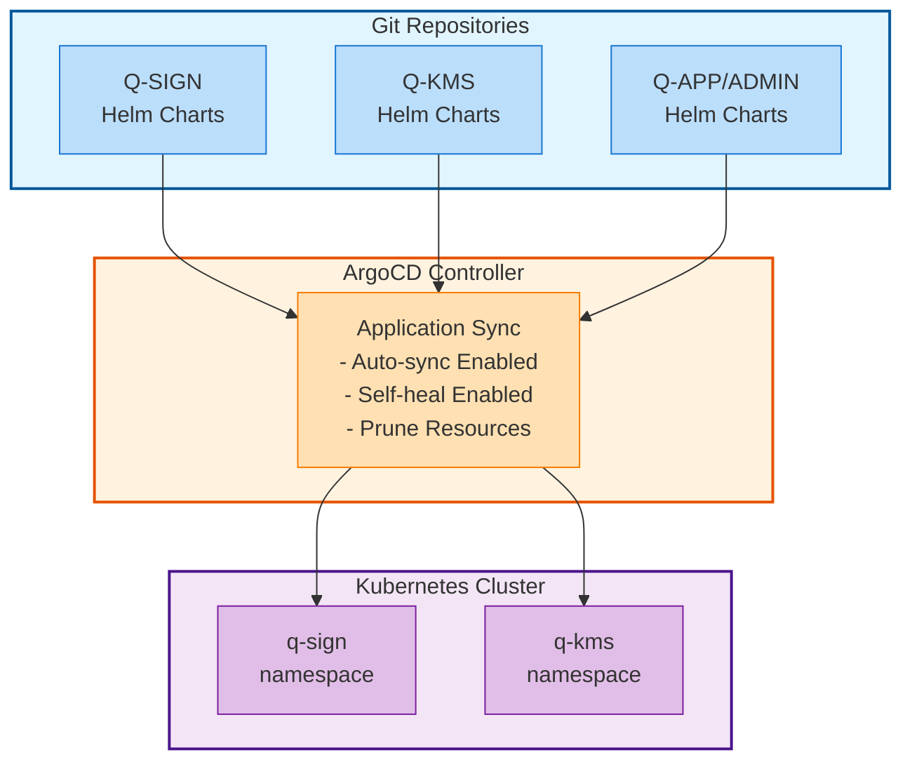
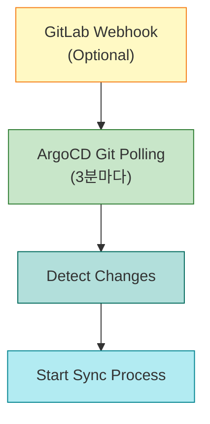
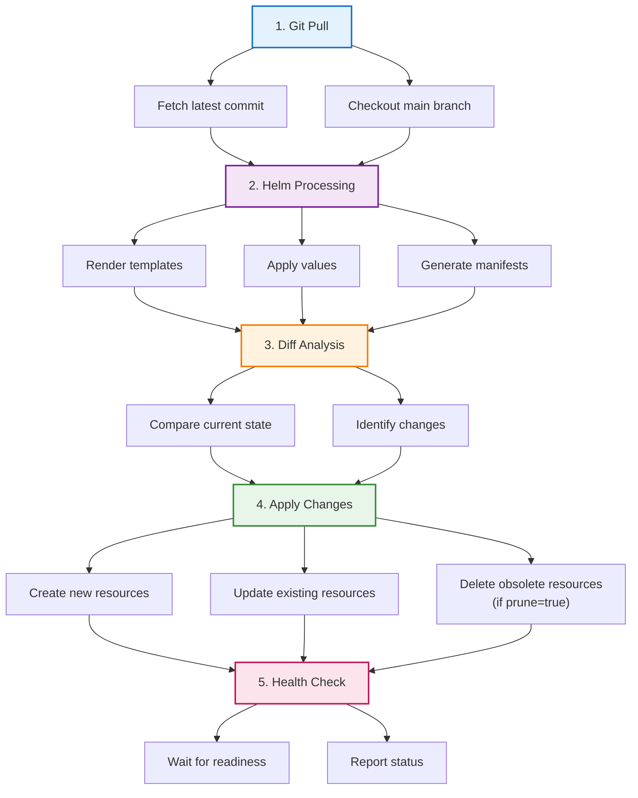
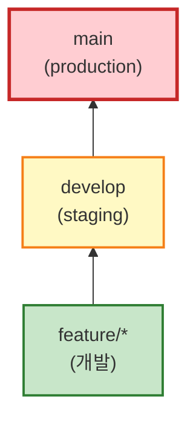

# GitOps 배포 가이드

## 🎯 GitOps 개요

QSIGN 프로젝트는 **GitOps** 방법론을 사용하여 모든 인프라와 애플리케이션을 관리합니다. Git 저장소를 "Single Source of Truth"로 사용하며, ArgoCD가 자동으로 동기화를 수행합니다.

## 🏗️ GitOps 아키텍처



## 📁 Git 저장소 구조

### Q-SIGN Repository
```
q-sign/
├── helm/
│   └── keycloak-pqc/
│       ├── Chart.yaml
│       ├── values.yaml
│       └── templates/
│           ├── deployment.yaml
│           ├── service.yaml
│           ├── configmap.yaml
│           └── secret.yaml
└── argocd/
    └── application.yaml
```

### Q-KMS Repository
```
q-kms/
├── helm/
│   └── q-kms/
│       ├── Chart.yaml
│       ├── values.yaml
│       └── templates/
│           ├── deployment.yaml
│           ├── service.yaml
│           ├── persistentvolume.yaml
│           └── configmap.yaml
└── argocd/
    └── q-kms-application.yaml
```

### Q-APP Repository
```
q-app/
├── k8s/
│   └── helm/
│       └── q-app/
│           ├── Chart.yaml
│           ├── values.yaml
│           └── templates/
│               ├── app1-deployment.yaml
│               ├── app3-deployment.yaml
│               ├── app6-deployment.yaml
│               └── ...
└── argocd/
    └── q-app-application.yaml
```

## 🚀 ArgoCD 애플리케이션 설정

### Q-SIGN Application
```yaml
apiVersion: argoproj.io/v1alpha1
kind: Application
metadata:
  name: q-sign
  namespace: argocd
  finalizers:
    - resources-finalizer.argocd.argoproj.io
spec:
  project: default

  source:
    repoURL: http://192.168.0.11:7780/root/q-sign.git
    targetRevision: main
    path: helm/keycloak-pqc
    helm:
      values: |
        image:
          repository: 192.168.0.11:30800/qsign/keycloak-pqc
          tag: "v1.0.1-qkms"

        replicaCount: 1

        service:
          type: NodePort
          port: 8080
          nodePort: 30181

  destination:
    server: https://kubernetes.default.svc
    namespace: q-sign

  syncPolicy:
    automated:
      prune: true          # 자동 리소스 정리
      selfHeal: true       # 자동 복구
      allowEmpty: false
    syncOptions:
      - CreateNamespace=true
      - PrunePropagationPolicy=foreground
      - PruneLast=true
    retry:
      limit: 5
      backoff:
        duration: 5s
        factor: 2
        maxDuration: 3m
```

### Q-KMS Application
```yaml
apiVersion: argoproj.io/v1alpha1
kind: Application
metadata:
  name: q-kms
  namespace: argocd
spec:
  project: default

  source:
    repoURL: http://192.168.0.11:7780/root/q-kms.git
    targetRevision: main
    path: helm/q-kms
    helm:
      values: |
        image:
          repository: 192.168.0.11:30800/qsign-prod/vault-ubuntu-luna
          tag: "1.21.0"

        lunaHsm:
          enabled: true
          devicePath: "/dev/k7pf0"
          groupId: "997"

        vaultInit:
          enabled: true
          unsealKeys:
            # 예제 값 - 실제 배포 시 Vault init 출력값으로 교체 필요
            key1: "EXAMPLE-UNSEAL-KEY-1-REPLACE-WITH-REAL-KEY"
            key2: "EXAMPLE-UNSEAL-KEY-2-REPLACE-WITH-REAL-KEY"
            key3: "EXAMPLE-UNSEAL-KEY-3-REPLACE-WITH-REAL-KEY"
          rootToken: "EXAMPLE-ROOT-TOKEN-REPLACE-WITH-REAL-TOKEN"

  destination:
    server: https://kubernetes.default.svc
    namespace: q-kms

  syncPolicy:
    automated:
      prune: true
      selfHeal: true
```

## 📝 배포 워크플로우

### 1. 코드 변경 (Developer)
```bash
# 1. 저장소 클론
git clone http://192.168.0.11:7780/root/q-sign.git
cd q-sign

# 2. Helm values 수정
vim helm/keycloak-pqc/values.yaml

# 3. 변경사항 커밋
git add helm/keycloak-pqc/values.yaml
git commit -m "Update Keycloak configuration"

# 4. GitLab에 푸시
git push origin main
```

### 2. ArgoCD 자동 감지


### 3. 동기화 프로세스


### 4. 롤링 업데이트
```yaml
strategy:
  type: RollingUpdate
  rollingUpdate:
    maxSurge: 1        # 최대 1개 추가 Pod
    maxUnavailable: 0  # 항상 최소 1개 실행
```

## 🔄 Sync 정책

### Auto-Sync 모드
```yaml
syncPolicy:
  automated:
    prune: true      # 불필요한 리소스 자동 삭제
    selfHeal: true   # 수동 변경 자동 복구
    allowEmpty: false
```

**장점**:
- ✅ Git 변경 즉시 반영
- ✅ 드리프트 방지 (Configuration Drift)
- ✅ 운영 부담 감소

**주의사항**:
- ⚠️  프로덕션에서는 신중하게 사용
- ⚠️  중요 변경은 수동 승인 권장

### Manual Sync 모드
```yaml
syncPolicy:
  automated: null  # Auto-sync 비활성화
```

**수동 동기화**:
```bash
# ArgoCD CLI
argocd app sync q-sign

# 또는 ArgoCD UI
# Applications → q-sign → SYNC
```

## 📊 배포 모니터링

### ArgoCD UI
```
http://192.168.0.11:30080

Login:
  Username: admin
  Password: <admin-password>

Dashboard:
  ├─ Applications (전체 앱 상태)
  ├─ Sync Status (동기화 상태)
  ├─ Health Status (헬스 상태)
  └─ Last Sync Result (마지막 동기화 결과)
```

### CLI 모니터링
```bash
# 애플리케이션 목록
argocd app list

# 상세 상태
argocd app get q-sign

# 동기화 이력
argocd app history q-sign

# 리소스 트리
argocd app resources q-sign

# 로그 확인
argocd app logs q-sign
```

## 🔧 문제 해결

### Out of Sync 상태
```bash
# 원인 확인
argocd app diff q-sign

# 강제 동기화
argocd app sync q-sign --force

# Hard Refresh
argocd app get q-sign --hard-refresh
```

### Sync Failed
```bash
# 에러 로그 확인
argocd app get q-sign

# 리소스별 상태
argocd app resources q-sign

# Helm 템플릿 확인
helm template q-sign ./helm/keycloak-pqc --values ./helm/keycloak-pqc/values.yaml
```

### Rollback
```bash
# 이전 버전 확인
argocd app history q-sign

# 특정 버전으로 롤백
argocd app rollback q-sign <revision-id>
```

## 📚 모범 사례

### 1. Git 브랜치 전략


### 2. Helm Values 분리
```yaml
# values.yaml (기본값)
image:
  repository: keycloak-pqc
  tag: latest

# values-prod.yaml (프로덕션)
image:
  tag: "v1.0.1"
replicaCount: 3

# values-dev.yaml (개발)
image:
  tag: "develop"
replicaCount: 1
```

### 3. Secret 관리
```yaml
# ❌ Git에 직접 저장하지 말것
apiVersion: v1
kind: Secret
data:
  password: cGFzc3dvcmQ=  # 평문 base64

# ✅ Sealed Secrets 사용
apiVersion: bitnami.com/v1alpha1
kind: SealedSecret
metadata:
  name: mysecret
spec:
  encryptedData:
    password: AgBy3i4OJSWK+PiTySYZZA9rO43cGDEq...
```

### 4. 환경별 분리
```
environments/
├── production/
│   ├── q-sign-application.yaml
│   └── values-prod.yaml
├── staging/
│   ├── q-sign-application.yaml
│   └── values-staging.yaml
└── development/
    ├── q-sign-application.yaml
    └── values-dev.yaml
```

## 🎯 배포 체크리스트

### Pre-Deployment
- [ ] Git 변경사항 리뷰
- [ ] Helm Chart Lint (`helm lint`)
- [ ] 템플릿 검증 (`helm template`)
- [ ] Secret 암호화 확인
- [ ] 리소스 요구사항 확인

### Deployment
- [ ] ArgoCD Sync 시작
- [ ] Pod 상태 모니터링
- [ ] Health Check 확인
- [ ] 로그 확인
- [ ] Metrics 확인

### Post-Deployment
- [ ] 기능 테스트
- [ ] 통합 테스트
- [ ] 모니터링 대시보드 확인
- [ ] Alert 설정 확인
- [ ] 문서 업데이트

---

**Last Updated**: 2025-11-16
**Version**: 1.0.0
**GitOps Tool**: ArgoCD 3.2.0
