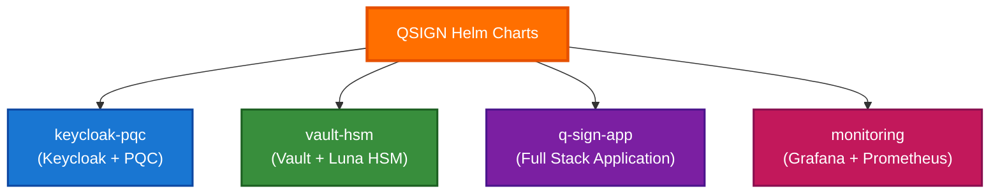

# Helm Charts 가이드

## 목차
- [Helm 소개](#helm-소개)
- [Helm Chart 구조](#helm-chart-구조)
- [values.yaml 설정](#valuesyaml-설정)
- [템플릿 작성](#템플릿-작성)
- [Chart 커스터마이징](#chart-커스터마이징)
- [버전 관리](#버전-관리)
- [Chart Repository 설정](#chart-repository-설정)
- [의존성 관리](#의존성-관리)
- [고급 기능](#고급-기능)
- [배포 및 관리](#배포-및-관리)

## Helm 소개

Helm은 Kubernetes 패키지 관리자로, 복잡한 애플리케이션을 쉽게 정의, 설치, 업그레이드할 수 있게 해줍니다.

### Helm 3 주요 특징

- **Tiller 제거**: 클라이언트만으로 동작
- **3-Way Merge**: 더 정확한 업그레이드
- **Secrets 관리 개선**: 보안 강화
- **Release Namespace**: 명시적 네임스페이스 관리
- **Library Charts**: 재사용 가능한 차트

### QSIGN 프로젝트 Helm Charts



## Helm Chart 구조

### 1. 기본 Chart 구조

```
keycloak-pqc/
├── Chart.yaml              # Chart 메타데이터
├── values.yaml             # 기본 설정값
├── values-dev.yaml         # 개발 환경 설정
├── values-staging.yaml     # 스테이징 환경 설정
├── values-prod.yaml        # 프로덕션 환경 설정
├── templates/              # Kubernetes 매니페스트 템플릿
│   ├── NOTES.txt          # 설치 후 안내 메시지
│   ├── _helpers.tpl       # 헬퍼 함수
│   ├── deployment.yaml    # Deployment 템플릿
│   ├── service.yaml       # Service 템플릿
│   ├── configmap.yaml     # ConfigMap 템플릿
│   ├── secret.yaml        # Secret 템플릿
│   ├── ingress.yaml       # Ingress 템플릿
│   ├── hpa.yaml           # HorizontalPodAutoscaler
│   ├── pdb.yaml           # PodDisruptionBudget
│   ├── serviceaccount.yaml # ServiceAccount
│   └── tests/             # 테스트
│       └── test-connection.yaml
├── charts/                 # 의존성 차트
├── crds/                   # Custom Resource Definitions
└── README.md              # 차트 문서
```

### 2. Chart.yaml

```yaml
# keycloak-pqc/Chart.yaml
apiVersion: v2
name: keycloak-pqc
description: Keycloak with Post-Quantum Cryptography and Luna HSM support
type: application
version: 1.0.1
appVersion: "23.0.1"

keywords:
  - keycloak
  - authentication
  - sso
  - pqc
  - hsm
  - identity

home: https://qsign.local
sources:
  - http://192.168.0.11:7780/root/q-sign.git

maintainers:
  - name: QSIGN Team
    email: devops@qsign.local

icon: https://www.keycloak.org/resources/images/keycloak_logo_480x108.png

# 의존성 차트
dependencies:
  - name: postgresql
    version: "12.x.x"
    repository: https://charts.bitnami.com/bitnami
    condition: postgresql.enabled
    tags:
      - database

# Annotations
annotations:
  category: Security
  licenses: Apache-2.0
  images: |
    - name: keycloak-pqc
      image: 192.168.0.11:30800/qsign/keycloak-pqc:v1.0.1-qkms
```

### 3. values.yaml (기본 설정)

```yaml
# keycloak-pqc/values.yaml
# 기본 이미지 설정
image:
  repository: 192.168.0.11:30800/qsign/keycloak-pqc
  pullPolicy: Always
  tag: "v1.0.1-qkms"

imagePullSecrets:
  - name: harbor-registry

# 레플리카 수
replicaCount: 1

# 네임스페이스
namespaceOverride: ""

# ServiceAccount
serviceAccount:
  create: true
  annotations: {}
  name: ""

# Pod Annotations
podAnnotations:
  prometheus.io/scrape: "true"
  prometheus.io/port: "8080"
  prometheus.io/path: "/auth/realms/master/metrics"

# Pod Labels
podLabels:
  app: keycloak
  version: v1.0.1

# Pod Security Context
podSecurityContext:
  runAsNonRoot: true
  runAsUser: 1000
  fsGroup: 1000

# Container Security Context
securityContext:
  allowPrivilegeEscalation: false
  capabilities:
    drop:
    - ALL
  readOnlyRootFilesystem: false

# Service
service:
  type: ClusterIP
  port: 8080
  httpsPort: 8443
  annotations: {}

# Ingress
ingress:
  enabled: false
  className: nginx
  annotations:
    cert-manager.io/cluster-issuer: letsencrypt-prod
    nginx.ingress.kubernetes.io/ssl-redirect: "true"
  hosts:
    - host: keycloak.qsign.local
      paths:
        - path: /
          pathType: Prefix
  tls:
    - secretName: keycloak-tls
      hosts:
        - keycloak.qsign.local

# Resources
resources:
  limits:
    cpu: 2000m
    memory: 4Gi
  requests:
    cpu: 500m
    memory: 1Gi

# Autoscaling
autoscaling:
  enabled: false
  minReplicas: 1
  maxReplicas: 10
  targetCPUUtilizationPercentage: 70
  targetMemoryUtilizationPercentage: 80

# Node Selector
nodeSelector: {}

# Tolerations
tolerations: []

# Affinity
affinity:
  podAntiAffinity:
    preferredDuringSchedulingIgnoredDuringExecution:
      - weight: 100
        podAffinityTerm:
          labelSelector:
            matchExpressions:
              - key: app
                operator: In
                values:
                  - keycloak
          topologyKey: kubernetes.io/hostname

# Keycloak Configuration
keycloak:
  admin:
    username: admin
    password: ""  # values-{env}.yaml에서 설정
    existingSecret: ""
    existingSecretKey: password

  database:
    vendor: postgres
    host: postgres
    port: 5432
    database: keycloak
    username: postgres
    password: ""
    existingSecret: ""
    existingSecretKey: password

  extraEnv:
    - name: KC_PROXY
      value: "edge"
    - name: KC_HOSTNAME_STRICT
      value: "false"
    - name: KC_HTTP_ENABLED
      value: "true"
    - name: KC_HEALTH_ENABLED
      value: "true"
    - name: KC_METRICS_ENABLED
      value: "true"
    - name: JAVA_OPTS
      value: "-Xms1024m -Xmx2048m"

  javaOpts: "-Xms1024m -Xmx2048m -XX:MetaspaceSize=256m -XX:MaxMetaspaceSize=512m"

  # Liveness Probe
  livenessProbe:
    enabled: true
    httpGet:
      path: /auth/
      port: http
    initialDelaySeconds: 120
    periodSeconds: 30
    timeoutSeconds: 10
    failureThreshold: 3
    successThreshold: 1

  # Readiness Probe
  readinessProbe:
    enabled: true
    httpGet:
      path: /auth/realms/master
      port: http
    initialDelaySeconds: 60
    periodSeconds: 10
    timeoutSeconds: 5
    failureThreshold: 3
    successThreshold: 1

  # Startup Probe
  startupProbe:
    enabled: true
    httpGet:
      path: /auth/
      port: http
    initialDelaySeconds: 30
    periodSeconds: 10
    failureThreshold: 30

# HSM Configuration
hsm:
  enabled: true
  pin: ""  # Secret으로 관리
  partition:
    label: keycloak-partition
    serialNumber: ""
    hsmIpAddress: ""
  fipsMode: true
  haOnly: true
  existingSecret: ""

# Java Security Configuration
javaSecurity:
  enabled: true
  config: |
    security.provider.1=com.safenetinc.luna.provider.LunaProvider
    security.provider.2=sun.security.provider.Sun
    security.provider.3=sun.security.rsa.SunRsaSign
    security.provider.4=sun.security.ec.SunEC
    security.provider.5=com.sun.net.ssl.internal.ssl.Provider
    security.provider.6=com.sun.crypto.provider.SunJCE
    security.provider.7=sun.security.jgss.SunProvider
    security.provider.8=com.sun.security.sasl.Provider
    security.provider.9=org.jcp.xml.dsig.internal.dom.XMLDSigRI
    security.provider.10=sun.security.smartcardio.SunPCSC
    keystore.type.compat=true
    keystore.type=PKCS12
    crypto.policy=unlimited

# PostgreSQL (Dependency Chart)
postgresql:
  enabled: true
  auth:
    username: postgres
    password: postgres123
    database: keycloak
  primary:
    persistence:
      enabled: true
      size: 10Gi
    resources:
      limits:
        memory: 2Gi
        cpu: 1000m
      requests:
        memory: 512Mi
        cpu: 250m

# Monitoring
monitoring:
  enabled: true
  serviceMonitor:
    enabled: true
    interval: 30s
    path: /auth/realms/master/metrics

# PodDisruptionBudget
pdb:
  enabled: true
  minAvailable: 1
```

## values.yaml 설정

### 1. Development 환경 (values-dev.yaml)

```yaml
# values-dev.yaml
replicaCount: 1

image:
  tag: "develop"
  pullPolicy: Always

resources:
  limits:
    cpu: 500m
    memory: 1Gi
  requests:
    cpu: 100m
    memory: 256Mi

keycloak:
  admin:
    password: dev-password

  database:
    password: dev-postgres-pass

  extraEnv:
    - name: KC_LOG_LEVEL
      value: "DEBUG"

autoscaling:
  enabled: false

postgresql:
  enabled: true
  auth:
    password: dev-postgres-pass
  primary:
    persistence:
      size: 5Gi

ingress:
  enabled: true
  hosts:
    - host: keycloak-dev.qsign.local
      paths:
        - path: /
          pathType: Prefix

monitoring:
  enabled: false
```

### 2. Staging 환경 (values-staging.yaml)

```yaml
# values-staging.yaml
replicaCount: 2

image:
  tag: "v1.0.1-rc1"
  pullPolicy: Always

resources:
  limits:
    cpu: 1500m
    memory: 3Gi
  requests:
    cpu: 300m
    memory: 768Mi

keycloak:
  admin:
    existingSecret: keycloak-staging-secret

  database:
    existingSecret: postgres-staging-secret

autoscaling:
  enabled: true
  minReplicas: 2
  maxReplicas: 5

postgresql:
  enabled: true
  auth:
    existingSecret: postgres-staging-secret
  primary:
    persistence:
      size: 20Gi

ingress:
  enabled: true
  className: nginx
  annotations:
    cert-manager.io/cluster-issuer: letsencrypt-staging
  hosts:
    - host: keycloak-staging.qsign.local
      paths:
        - path: /
          pathType: Prefix
  tls:
    - secretName: keycloak-staging-tls
      hosts:
        - keycloak-staging.qsign.local

monitoring:
  enabled: true
  serviceMonitor:
    enabled: true

pdb:
  enabled: true
  minAvailable: 1
```

### 3. Production 환경 (values-prod.yaml)

```yaml
# values-prod.yaml
replicaCount: 3

image:
  tag: "v1.0.1-qkms"
  pullPolicy: IfNotPresent

resources:
  limits:
    cpu: 2000m
    memory: 4Gi
  requests:
    cpu: 500m
    memory: 1Gi

keycloak:
  admin:
    existingSecret: keycloak-prod-secret

  database:
    existingSecret: postgres-prod-secret

  javaOpts: "-Xms2048m -Xmx4096m -XX:MetaspaceSize=512m -XX:MaxMetaspaceSize=1024m"

autoscaling:
  enabled: true
  minReplicas: 3
  maxReplicas: 10
  targetCPUUtilizationPercentage: 70
  targetMemoryUtilizationPercentage: 80

affinity:
  podAntiAffinity:
    requiredDuringSchedulingIgnoredDuringExecution:
      - labelSelector:
          matchExpressions:
            - key: app
              operator: In
              values:
                - keycloak
        topologyKey: kubernetes.io/hostname

postgresql:
  enabled: true
  auth:
    existingSecret: postgres-prod-secret
  primary:
    persistence:
      enabled: true
      size: 50Gi
      storageClass: fast-ssd
    resources:
      limits:
        memory: 4Gi
        cpu: 2000m
      requests:
        memory: 1Gi
        cpu: 500m

ingress:
  enabled: true
  className: nginx
  annotations:
    cert-manager.io/cluster-issuer: letsencrypt-prod
    nginx.ingress.kubernetes.io/ssl-redirect: "true"
    nginx.ingress.kubernetes.io/force-ssl-redirect: "true"
    nginx.ingress.kubernetes.io/backend-protocol: "HTTP"
  hosts:
    - host: keycloak.qsign.com
      paths:
        - path: /
          pathType: Prefix
  tls:
    - secretName: keycloak-prod-tls
      hosts:
        - keycloak.qsign.com

monitoring:
  enabled: true
  serviceMonitor:
    enabled: true
    interval: 30s
    scrapeTimeout: 10s

pdb:
  enabled: true
  minAvailable: 2

hsm:
  enabled: true
  existingSecret: hsm-prod-secret
```

## 템플릿 작성

### 1. _helpers.tpl (헬퍼 함수)

```yaml
{{/* vim: set filetype=mustache: */}}

{{/*
Expand the name of the chart.
*/}}
{{- define "keycloak-pqc.name" -}}
{{- default .Chart.Name .Values.nameOverride | trunc 63 | trimSuffix "-" }}
{{- end }}

{{/*
Create a default fully qualified app name.
*/}}
{{- define "keycloak-pqc.fullname" -}}
{{- if .Values.fullnameOverride }}
{{- .Values.fullnameOverride | trunc 63 | trimSuffix "-" }}
{{- else }}
{{- $name := default .Chart.Name .Values.nameOverride }}
{{- if contains $name .Release.Name }}
{{- .Release.Name | trunc 63 | trimSuffix "-" }}
{{- else }}
{{- printf "%s-%s" .Release.Name $name | trunc 63 | trimSuffix "-" }}
{{- end }}
{{- end }}
{{- end }}

{{/*
Create chart name and version as used by the chart label.
*/}}
{{- define "keycloak-pqc.chart" -}}
{{- printf "%s-%s" .Chart.Name .Chart.Version | replace "+" "_" | trunc 63 | trimSuffix "-" }}
{{- end }}

{{/*
Common labels
*/}}
{{- define "keycloak-pqc.labels" -}}
helm.sh/chart: {{ include "keycloak-pqc.chart" . }}
{{ include "keycloak-pqc.selectorLabels" . }}
{{- if .Chart.AppVersion }}
app.kubernetes.io/version: {{ .Chart.AppVersion | quote }}
{{- end }}
app.kubernetes.io/managed-by: {{ .Release.Service }}
{{- end }}

{{/*
Selector labels
*/}}
{{- define "keycloak-pqc.selectorLabels" -}}
app.kubernetes.io/name: {{ include "keycloak-pqc.name" . }}
app.kubernetes.io/instance: {{ .Release.Name }}
{{- end }}

{{/*
Create the name of the service account to use
*/}}
{{- define "keycloak-pqc.serviceAccountName" -}}
{{- if .Values.serviceAccount.create }}
{{- default (include "keycloak-pqc.fullname" .) .Values.serviceAccount.name }}
{{- else }}
{{- default "default" .Values.serviceAccount.name }}
{{- end }}
{{- end }}

{{/*
Database host
*/}}
{{- define "keycloak-pqc.databaseHost" -}}
{{- if .Values.postgresql.enabled }}
{{- printf "%s-postgresql" .Release.Name }}
{{- else }}
{{- .Values.keycloak.database.host }}
{{- end }}
{{- end }}

{{/*
Image pull secrets
*/}}
{{- define "keycloak-pqc.imagePullSecrets" -}}
{{- if .Values.imagePullSecrets }}
imagePullSecrets:
{{- range .Values.imagePullSecrets }}
  - name: {{ .name }}
{{- end }}
{{- end }}
{{- end }}
```

### 2. deployment.yaml

```yaml
# templates/deployment.yaml
apiVersion: apps/v1
kind: Deployment
metadata:
  name: {{ include "keycloak-pqc.fullname" . }}
  namespace: {{ .Values.namespaceOverride | default .Release.Namespace }}
  labels:
    {{- include "keycloak-pqc.labels" . | nindent 4 }}
    {{- with .Values.podLabels }}
    {{- toYaml . | nindent 4 }}
    {{- end }}
spec:
  {{- if not .Values.autoscaling.enabled }}
  replicas: {{ .Values.replicaCount }}
  {{- end }}
  strategy:
    type: RollingUpdate
    rollingUpdate:
      maxSurge: 1
      maxUnavailable: 0
  revisionHistoryLimit: 5
  selector:
    matchLabels:
      {{- include "keycloak-pqc.selectorLabels" . | nindent 6 }}
  template:
    metadata:
      annotations:
        checksum/config: {{ include (print $.Template.BasePath "/configmap.yaml") . | sha256sum }}
        checksum/secret: {{ include (print $.Template.BasePath "/secret.yaml") . | sha256sum }}
        {{- with .Values.podAnnotations }}
        {{- toYaml . | nindent 8 }}
        {{- end }}
      labels:
        {{- include "keycloak-pqc.selectorLabels" . | nindent 8 }}
        {{- with .Values.podLabels }}
        {{- toYaml . | nindent 8 }}
        {{- end }}
    spec:
      {{- include "keycloak-pqc.imagePullSecrets" . | nindent 6 }}
      serviceAccountName: {{ include "keycloak-pqc.serviceAccountName" . }}
      securityContext:
        {{- toYaml .Values.podSecurityContext | nindent 8 }}

      {{- with .Values.affinity }}
      affinity:
        {{- toYaml . | nindent 8 }}
      {{- end }}

      {{- with .Values.nodeSelector }}
      nodeSelector:
        {{- toYaml . | nindent 8 }}
      {{- end }}

      {{- with .Values.tolerations }}
      tolerations:
        {{- toYaml . | nindent 8 }}
      {{- end }}

      initContainers:
      - name: wait-for-postgres
        image: busybox:1.35
        command:
        - sh
        - -c
        - |
          until nc -z {{ include "keycloak-pqc.databaseHost" . }} {{ .Values.keycloak.database.port }}; do
            echo "Waiting for PostgreSQL..."
            sleep 2
          done

      containers:
      - name: keycloak
        securityContext:
          {{- toYaml .Values.securityContext | nindent 12 }}
        image: "{{ .Values.image.repository }}:{{ .Values.image.tag | default .Chart.AppVersion }}"
        imagePullPolicy: {{ .Values.image.pullPolicy }}

        ports:
        - name: http
          containerPort: 8080
          protocol: TCP
        - name: https
          containerPort: 8443
          protocol: TCP

        env:
        - name: KEYCLOAK_ADMIN
          valueFrom:
            secretKeyRef:
              name: {{ include "keycloak-pqc.fullname" . }}-secret
              key: admin-username
        - name: KEYCLOAK_ADMIN_PASSWORD
          valueFrom:
            secretKeyRef:
              name: {{ include "keycloak-pqc.fullname" . }}-secret
              key: admin-password
        - name: KC_DB_URL
          value: "jdbc:postgresql://{{ include "keycloak-pqc.databaseHost" . }}:{{ .Values.keycloak.database.port }}/{{ .Values.keycloak.database.database }}"
        - name: KC_DB_USERNAME
          valueFrom:
            secretKeyRef:
              name: {{ include "keycloak-pqc.fullname" . }}-db-secret
              key: username
        - name: KC_DB_PASSWORD
          valueFrom:
            secretKeyRef:
              name: {{ include "keycloak-pqc.fullname" . }}-db-secret
              key: password
        - name: JAVA_OPTS
          value: {{ .Values.keycloak.javaOpts | quote }}
        {{- range .Values.keycloak.extraEnv }}
        - name: {{ .name }}
          value: {{ .value | quote }}
        {{- end }}

        volumeMounts:
        {{- if .Values.javaSecurity.enabled }}
        - name: java-security
          mountPath: /etc/java-security
          readOnly: true
        {{- end }}
        {{- if .Values.hsm.enabled }}
        - name: hsm-config
          mountPath: /etc/hsm
          readOnly: true
        {{- end }}
        - name: tmp
          mountPath: /tmp

        {{- if .Values.keycloak.livenessProbe.enabled }}
        livenessProbe:
          {{- toYaml .Values.keycloak.livenessProbe.httpGet | nindent 12 }}
          initialDelaySeconds: {{ .Values.keycloak.livenessProbe.initialDelaySeconds }}
          periodSeconds: {{ .Values.keycloak.livenessProbe.periodSeconds }}
          timeoutSeconds: {{ .Values.keycloak.livenessProbe.timeoutSeconds }}
          failureThreshold: {{ .Values.keycloak.livenessProbe.failureThreshold }}
        {{- end }}

        {{- if .Values.keycloak.readinessProbe.enabled }}
        readinessProbe:
          {{- toYaml .Values.keycloak.readinessProbe.httpGet | nindent 12 }}
          initialDelaySeconds: {{ .Values.keycloak.readinessProbe.initialDelaySeconds }}
          periodSeconds: {{ .Values.keycloak.readinessProbe.periodSeconds }}
          timeoutSeconds: {{ .Values.keycloak.readinessProbe.timeoutSeconds }}
          failureThreshold: {{ .Values.keycloak.readinessProbe.failureThreshold }}
        {{- end }}

        {{- if .Values.keycloak.startupProbe.enabled }}
        startupProbe:
          {{- toYaml .Values.keycloak.startupProbe.httpGet | nindent 12 }}
          initialDelaySeconds: {{ .Values.keycloak.startupProbe.initialDelaySeconds }}
          periodSeconds: {{ .Values.keycloak.startupProbe.periodSeconds }}
          failureThreshold: {{ .Values.keycloak.startupProbe.failureThreshold }}
        {{- end }}

        resources:
          {{- toYaml .Values.resources | nindent 12 }}

      volumes:
      {{- if .Values.javaSecurity.enabled }}
      - name: java-security
        configMap:
          name: {{ include "keycloak-pqc.fullname" . }}-java-security
      {{- end }}
      {{- if .Values.hsm.enabled }}
      - name: hsm-config
        configMap:
          name: {{ include "keycloak-pqc.fullname" . }}-hsm-config
      {{- end }}
      - name: tmp
        emptyDir: {}

      terminationGracePeriodSeconds: 60
```

### 3. service.yaml

```yaml
# templates/service.yaml
apiVersion: v1
kind: Service
metadata:
  name: {{ include "keycloak-pqc.fullname" . }}
  namespace: {{ .Values.namespaceOverride | default .Release.Namespace }}
  labels:
    {{- include "keycloak-pqc.labels" . | nindent 4 }}
  {{- with .Values.service.annotations }}
  annotations:
    {{- toYaml . | nindent 4 }}
  {{- end }}
spec:
  type: {{ .Values.service.type }}
  selector:
    {{- include "keycloak-pqc.selectorLabels" . | nindent 4 }}
  ports:
  - name: http
    port: {{ .Values.service.port }}
    targetPort: http
    protocol: TCP
    {{- if and (eq .Values.service.type "NodePort") .Values.service.nodePort }}
    nodePort: {{ .Values.service.nodePort }}
    {{- end }}
  - name: https
    port: {{ .Values.service.httpsPort }}
    targetPort: https
    protocol: TCP
    {{- if and (eq .Values.service.type "NodePort") .Values.service.httpsNodePort }}
    nodePort: {{ .Values.service.httpsNodePort }}
    {{- end }}
  {{- if eq .Values.service.type "ClusterIP" }}
  sessionAffinity: ClientIP
  sessionAffinityConfig:
    clientIP:
      timeoutSeconds: 10800
  {{- end }}
```

### 4. configmap.yaml

```yaml
# templates/configmap.yaml
{{- if .Values.javaSecurity.enabled }}
apiVersion: v1
kind: ConfigMap
metadata:
  name: {{ include "keycloak-pqc.fullname" . }}-java-security
  namespace: {{ .Values.namespaceOverride | default .Release.Namespace }}
  labels:
    {{- include "keycloak-pqc.labels" . | nindent 4 }}
data:
  java.security: |
{{ .Values.javaSecurity.config | indent 4 }}
{{- end }}

---
{{- if .Values.hsm.enabled }}
apiVersion: v1
kind: ConfigMap
metadata:
  name: {{ include "keycloak-pqc.fullname" . }}-hsm-config
  namespace: {{ .Values.namespaceOverride | default .Release.Namespace }}
  labels:
    {{- include "keycloak-pqc.labels" . | nindent 4 }}
data:
  HSM_ENABLED: "true"
  HSM_PARTITION_LABEL: {{ .Values.hsm.partition.label | quote }}
  HSM_FIPS_MODE: {{ .Values.hsm.fipsMode | quote }}
  HSM_HA_ONLY: {{ .Values.hsm.haOnly | quote }}
{{- end }}
```

### 5. secret.yaml

```yaml
# templates/secret.yaml
apiVersion: v1
kind: Secret
metadata:
  name: {{ include "keycloak-pqc.fullname" . }}-secret
  namespace: {{ .Values.namespaceOverride | default .Release.Namespace }}
  labels:
    {{- include "keycloak-pqc.labels" . | nindent 4 }}
type: Opaque
stringData:
  admin-username: {{ .Values.keycloak.admin.username | quote }}
  admin-password: {{ .Values.keycloak.admin.password | quote }}

---
apiVersion: v1
kind: Secret
metadata:
  name: {{ include "keycloak-pqc.fullname" . }}-db-secret
  namespace: {{ .Values.namespaceOverride | default .Release.Namespace }}
  labels:
    {{- include "keycloak-pqc.labels" . | nindent 4 }}
type: Opaque
stringData:
  username: {{ .Values.keycloak.database.username | quote }}
  password: {{ .Values.keycloak.database.password | quote }}
  database: {{ .Values.keycloak.database.database | quote }}
```

### 6. ingress.yaml

```yaml
# templates/ingress.yaml
{{- if .Values.ingress.enabled -}}
apiVersion: networking.k8s.io/v1
kind: Ingress
metadata:
  name: {{ include "keycloak-pqc.fullname" . }}
  namespace: {{ .Values.namespaceOverride | default .Release.Namespace }}
  labels:
    {{- include "keycloak-pqc.labels" . | nindent 4 }}
  {{- with .Values.ingress.annotations }}
  annotations:
    {{- toYaml . | nindent 4 }}
  {{- end }}
spec:
  {{- if .Values.ingress.className }}
  ingressClassName: {{ .Values.ingress.className }}
  {{- end }}
  {{- if .Values.ingress.tls }}
  tls:
    {{- range .Values.ingress.tls }}
    - hosts:
        {{- range .hosts }}
        - {{ . | quote }}
        {{- end }}
      secretName: {{ .secretName }}
    {{- end }}
  {{- end }}
  rules:
    {{- range .Values.ingress.hosts }}
    - host: {{ .host | quote }}
      http:
        paths:
          {{- range .paths }}
          - path: {{ .path }}
            pathType: {{ .pathType }}
            backend:
              service:
                name: {{ include "keycloak-pqc.fullname" $ }}
                port:
                  number: {{ $.Values.service.port }}
          {{- end }}
    {{- end }}
{{- end }}
```

### 7. hpa.yaml

```yaml
# templates/hpa.yaml
{{- if .Values.autoscaling.enabled }}
apiVersion: autoscaling/v2
kind: HorizontalPodAutoscaler
metadata:
  name: {{ include "keycloak-pqc.fullname" . }}
  namespace: {{ .Values.namespaceOverride | default .Release.Namespace }}
  labels:
    {{- include "keycloak-pqc.labels" . | nindent 4 }}
spec:
  scaleTargetRef:
    apiVersion: apps/v1
    kind: Deployment
    name: {{ include "keycloak-pqc.fullname" . }}
  minReplicas: {{ .Values.autoscaling.minReplicas }}
  maxReplicas: {{ .Values.autoscaling.maxReplicas }}
  metrics:
    {{- if .Values.autoscaling.targetCPUUtilizationPercentage }}
    - type: Resource
      resource:
        name: cpu
        target:
          type: Utilization
          averageUtilization: {{ .Values.autoscaling.targetCPUUtilizationPercentage }}
    {{- end }}
    {{- if .Values.autoscaling.targetMemoryUtilizationPercentage }}
    - type: Resource
      resource:
        name: memory
        target:
          type: Utilization
          averageUtilization: {{ .Values.autoscaling.targetMemoryUtilizationPercentage }}
    {{- end }}
{{- end }}
```

### 8. NOTES.txt

```
# templates/NOTES.txt
================================================================================
 Keycloak PQC has been deployed!
================================================================================

🎉 Installation Summary:
  - Release Name: {{ .Release.Name }}
  - Namespace: {{ .Release.Namespace }}
  - Chart Version: {{ .Chart.Version }}
  - App Version: {{ .Chart.AppVersion }}

🔗 Access Keycloak:

{{- if .Values.ingress.enabled }}
  Ingress is enabled. Access Keycloak at:
  {{- range .Values.ingress.hosts }}
  - https://{{ .host }}
  {{- end }}
{{- else if contains "NodePort" .Values.service.type }}
  Get the application URL by running these commands:
    export NODE_PORT=$(kubectl get --namespace {{ .Release.Namespace }} -o jsonpath="{.spec.ports[0].nodePort}" services {{ include "keycloak-pqc.fullname" . }})
    export NODE_IP=$(kubectl get nodes --namespace {{ .Release.Namespace }} -o jsonpath="{.items[0].status.addresses[0].address}")
    echo "Keycloak URL: http://$NODE_IP:$NODE_PORT/auth"
{{- else if contains "LoadBalancer" .Values.service.type }}
  Get the application URL by running these commands:
    export SERVICE_IP=$(kubectl get svc --namespace {{ .Release.Namespace }} {{ include "keycloak-pqc.fullname" . }} -o jsonpath='{.status.loadBalancer.ingress[0].ip}')
    echo "Keycloak URL: http://$SERVICE_IP:{{ .Values.service.port }}/auth"
{{- else if contains "ClusterIP" .Values.service.type }}
  Forward local port to Keycloak:
    kubectl port-forward --namespace {{ .Release.Namespace }} svc/{{ include "keycloak-pqc.fullname" . }} 8080:{{ .Values.service.port }}
    echo "Keycloak URL: http://localhost:8080/auth"
{{- end }}

🔐 Admin Credentials:
  Username: {{ .Values.keycloak.admin.username }}
  Password: <check secret {{ include "keycloak-pqc.fullname" . }}-secret>

  To get the admin password:
    kubectl get secret --namespace {{ .Release.Namespace }} {{ include "keycloak-pqc.fullname" . }}-secret -o jsonpath="{.data.admin-password}" | base64 --decode; echo

📊 Status:
  Check pod status:
    kubectl get pods --namespace {{ .Release.Namespace }} -l "app.kubernetes.io/name={{ include "keycloak-pqc.name" . }},app.kubernetes.io/instance={{ .Release.Name }}"

  Check logs:
    kubectl logs --namespace {{ .Release.Namespace }} -l "app.kubernetes.io/name={{ include "keycloak-pqc.name" . }}" -f

{{- if .Values.monitoring.enabled }}

📈 Monitoring:
  ServiceMonitor is enabled for Prometheus integration
  Metrics endpoint: /auth/realms/master/metrics
{{- end }}

{{- if .Values.hsm.enabled }}

🔒 HSM:
  Luna HSM integration is enabled
  Partition: {{ .Values.hsm.partition.label }}
{{- end }}

For more information, visit: {{ .Chart.Home }}
```

## Chart 커스터마이징

### 1. 조건부 리소스

```yaml
# templates/pdb.yaml
{{- if .Values.pdb.enabled }}
apiVersion: policy/v1
kind: PodDisruptionBudget
metadata:
  name: {{ include "keycloak-pqc.fullname" . }}
  namespace: {{ .Values.namespaceOverride | default .Release.Namespace }}
spec:
  {{- if .Values.pdb.minAvailable }}
  minAvailable: {{ .Values.pdb.minAvailable }}
  {{- else }}
  maxUnavailable: {{ .Values.pdb.maxUnavailable }}
  {{- end }}
  selector:
    matchLabels:
      {{- include "keycloak-pqc.selectorLabels" . | nindent 6 }}
{{- end }}
```

### 2. 반복문 사용

```yaml
# templates/extra-services.yaml
{{- range .Values.extraServices }}
---
apiVersion: v1
kind: Service
metadata:
  name: {{ .name }}
  namespace: {{ $.Release.Namespace }}
spec:
  type: {{ .type }}
  ports:
    {{- range .ports }}
    - name: {{ .name }}
      port: {{ .port }}
      targetPort: {{ .targetPort }}
      {{- if .nodePort }}
      nodePort: {{ .nodePort }}
      {{- end }}
    {{- end }}
  selector:
    {{- toYaml .selector | nindent 4 }}
{{- end }}
```

### 3. 변수 및 범위

```yaml
{{- $fullName := include "keycloak-pqc.fullname" . -}}
{{- $svcPort := .Values.service.port -}}

{{- range .Values.ingress.hosts }}
- host: {{ .host | quote }}
  http:
    paths:
      {{- range .paths }}
      - path: {{ .path }}
        pathType: {{ .pathType }}
        backend:
          service:
            name: {{ $fullName }}
            port:
              number: {{ $svcPort }}
      {{- end }}
{{- end }}
```

## 버전 관리

### 1. Chart 버저닝

```yaml
# Chart.yaml
version: 1.0.1  # Chart 버전 (SemVer)
appVersion: "23.0.1"  # 애플리케이션 버전
```

버전 규칙:
- MAJOR: 호환되지 않는 변경
- MINOR: 하위 호환 기능 추가
- PATCH: 하위 호환 버그 수정

### 2. Chart 패키징

```bash
# Chart 검증
helm lint keycloak-pqc/

# Chart 패키징
helm package keycloak-pqc/
# 출력: keycloak-pqc-1.0.1.tgz

# 특정 버전으로 패키징
helm package keycloak-pqc/ --version 1.0.2 --app-version 23.0.2
```

### 3. 의존성 업데이트

```bash
# 의존성 업데이트
helm dependency update keycloak-pqc/

# 의존성 빌드
helm dependency build keycloak-pqc/

# 의존성 목록
helm dependency list keycloak-pqc/
```

## Chart Repository 설정

### 1. Harbor Chart Repository

```bash
# Harbor에 로그인
helm registry login 192.168.0.11:30800 \
  --username admin \
  --password Harbor12345

# Chart 업로드
helm push keycloak-pqc-1.0.1.tgz oci://192.168.0.11:30800/qsign

# Repository 추가
helm repo add qsign https://192.168.0.11:30800/chartrepo/qsign \
  --username admin \
  --password Harbor12345 \
  --insecure-skip-tls-verify

# Repository 업데이트
helm repo update
```

### 2. ChartMuseum

```bash
# ChartMuseum 설치
helm install chartmuseum stable/chartmuseum \
  --set env.open.DISABLE_API=false \
  --set persistence.enabled=true

# Chart 업로드
curl --data-binary "@keycloak-pqc-1.0.1.tgz" \
  http://chartmuseum.qsign.local:8080/api/charts

# Repository 추가
helm repo add qsign-charts http://chartmuseum.qsign.local:8080
helm repo update
```

### 3. index.yaml 생성

```bash
# Chart Repository 디렉토리 생성
mkdir -p helm-repo

# Chart 복사
cp keycloak-pqc-1.0.1.tgz helm-repo/

# index.yaml 생성
helm repo index helm-repo/ --url https://charts.qsign.local

# Git에 푸시
cd helm-repo
git add .
git commit -m "Add keycloak-pqc chart v1.0.1"
git push
```

## 의존성 관리

### 1. Chart.yaml에 의존성 정의

```yaml
# Chart.yaml
dependencies:
  - name: postgresql
    version: "12.x.x"
    repository: https://charts.bitnami.com/bitnami
    condition: postgresql.enabled
    tags:
      - database

  - name: common
    version: "2.x.x"
    repository: https://charts.bitnami.com/bitnami
```

### 2. 의존성 values 오버라이드

```yaml
# values.yaml
postgresql:
  enabled: true
  auth:
    username: keycloak
    password: keycloak123
    database: keycloak
  primary:
    persistence:
      enabled: true
      size: 10Gi
```

### 3. 로컬 의존성

```yaml
# Chart.yaml
dependencies:
  - name: common
    version: "1.0.0"
    repository: "file://../common"
```

## 고급 기능

### 1. Hooks

```yaml
# templates/pre-install-job.yaml
apiVersion: batch/v1
kind: Job
metadata:
  name: {{ include "keycloak-pqc.fullname" . }}-pre-install
  annotations:
    "helm.sh/hook": pre-install
    "helm.sh/hook-weight": "-5"
    "helm.sh/hook-delete-policy": before-hook-creation
spec:
  template:
    spec:
      restartPolicy: Never
      containers:
      - name: pre-install
        image: busybox
        command:
          - sh
          - -c
          - echo "Pre-install tasks"
```

Hook 종류:
- pre-install
- post-install
- pre-delete
- post-delete
- pre-upgrade
- post-upgrade
- pre-rollback
- post-rollback
- test

### 2. 차트 테스트

```yaml
# templates/tests/test-connection.yaml
apiVersion: v1
kind: Pod
metadata:
  name: "{{ include "keycloak-pqc.fullname" . }}-test-connection"
  annotations:
    "helm.sh/hook": test
spec:
  containers:
  - name: wget
    image: busybox
    command: ['wget']
    args: ['{{ include "keycloak-pqc.fullname" . }}:{{ .Values.service.port }}/auth/']
  restartPolicy: Never
```

```bash
# 테스트 실행
helm test keycloak-pqc
```

### 3. Library Charts

```yaml
# common/Chart.yaml
apiVersion: v2
name: common
type: library
version: 1.0.0
```

```yaml
# keycloak-pqc/Chart.yaml
dependencies:
  - name: common
    version: "1.0.0"
    repository: "file://../common"
```

```yaml
# keycloak-pqc/templates/_helpers.tpl
{{- include "common.labels" . }}
```

## 배포 및 관리

### 1. Chart 설치

```bash
# 로컬 Chart 설치
helm install keycloak-pqc ./keycloak-pqc \
  --namespace q-sign \
  --create-namespace \
  --values ./keycloak-pqc/values-prod.yaml

# Repository에서 설치
helm install keycloak-pqc qsign/keycloak-pqc \
  --namespace q-sign \
  --version 1.0.1 \
  --values values-prod.yaml

# Dry run
helm install keycloak-pqc ./keycloak-pqc \
  --dry-run --debug

# 렌더링된 매니페스트 확인
helm template keycloak-pqc ./keycloak-pqc \
  --values values-prod.yaml
```

### 2. Chart 업그레이드

```bash
# 업그레이드
helm upgrade keycloak-pqc ./keycloak-pqc \
  --namespace q-sign \
  --values values-prod.yaml

# 업그레이드 or 설치
helm upgrade --install keycloak-pqc ./keycloak-pqc \
  --namespace q-sign \
  --values values-prod.yaml

# 특정 값만 오버라이드
helm upgrade keycloak-pqc ./keycloak-pqc \
  --set image.tag=v1.0.2 \
  --reuse-values
```

### 3. Rollback

```bash
# 히스토리 확인
helm history keycloak-pqc -n q-sign

# 이전 버전으로 롤백
helm rollback keycloak-pqc 1 -n q-sign

# 특정 revision으로 롤백
helm rollback keycloak-pqc 3 -n q-sign
```

### 4. Chart 관리

```bash
# Release 목록
helm list -n q-sign

# Release 상태
helm status keycloak-pqc -n q-sign

# Release 값 확인
helm get values keycloak-pqc -n q-sign

# Release 매니페스트 확인
helm get manifest keycloak-pqc -n q-sign

# Release 삭제
helm uninstall keycloak-pqc -n q-sign

# 삭제 시 히스토리 유지
helm uninstall keycloak-pqc -n q-sign --keep-history
```

---

**Last Updated**: 2025-11-16
**Helm Version**: 3.13+
**Author**: QSIGN DevOps Team
