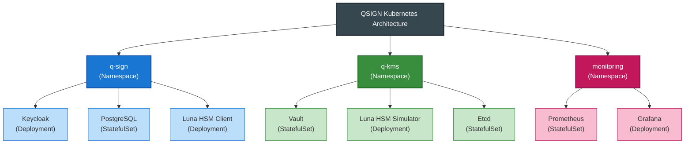

# Kubernetes 배포 가이드

## 목차
- [개요](#개요)
- [Namespace 및 리소스 구조](#namespace-및-리소스-구조)
- [Deployment 작성](#deployment-작성)
- [Service 설정](#service-설정)
- [ConfigMap과 Secret](#configmap과-secret)
- [StatefulSet](#statefulset)
- [PersistentVolume 설정](#persistentvolume-설정)
- [NetworkPolicy](#networkpolicy)
- [고급 배포 전략](#고급-배포-전략)
- [보안 설정](#보안-설정)
- [모니터링 및 로깅](#모니터링-및-로깅)

## 개요

QSIGN 프로젝트의 Kubernetes 매니페스트 작성 가이드입니다. 모든 컴포넌트는 선언적 방식으로 정의되며, GitOps를 통해 관리됩니다.

### 주요 컴포넌트



## Namespace 및 리소스 구조

### 1. Namespace 정의

```yaml
# 00-namespaces.yaml
apiVersion: v1
kind: Namespace
metadata:
  name: q-sign
  labels:
    name: q-sign
    environment: production
    project: qsign
    monitoring: enabled

---
apiVersion: v1
kind: Namespace
metadata:
  name: q-kms
  labels:
    name: q-kms
    environment: production
    project: qsign
    monitoring: enabled

---
apiVersion: v1
kind: Namespace
metadata:
  name: monitoring
  labels:
    name: monitoring
    environment: production
    project: qsign
```

### 2. ResourceQuota

```yaml
# resource-quota.yaml
apiVersion: v1
kind: ResourceQuota
metadata:
  name: q-sign-quota
  namespace: q-sign
spec:
  hard:
    requests.cpu: "10"
    requests.memory: 20Gi
    limits.cpu: "20"
    limits.memory: 40Gi
    persistentvolumeclaims: "10"
    services.loadbalancers: "2"
    services.nodeports: "5"

---
apiVersion: v1
kind: LimitRange
metadata:
  name: q-sign-limits
  namespace: q-sign
spec:
  limits:
  - max:
      cpu: "4"
      memory: 8Gi
    min:
      cpu: 100m
      memory: 128Mi
    default:
      cpu: 500m
      memory: 512Mi
    defaultRequest:
      cpu: 250m
      memory: 256Mi
    type: Container
  - max:
      cpu: "8"
      memory: 16Gi
    min:
      cpu: 200m
      memory: 256Mi
    type: Pod
```

## Deployment 작성

### 1. Keycloak Deployment

```yaml
# keycloak-deployment.yaml
apiVersion: apps/v1
kind: Deployment
metadata:
  name: keycloak
  namespace: q-sign
  labels:
    app: keycloak
    component: identity-provider
    version: v1.0.1
spec:
  replicas: 3
  strategy:
    type: RollingUpdate
    rollingUpdate:
      maxSurge: 1
      maxUnavailable: 0
  revisionHistoryLimit: 5
  selector:
    matchLabels:
      app: keycloak
  template:
    metadata:
      labels:
        app: keycloak
        version: v1.0.1
      annotations:
        prometheus.io/scrape: "true"
        prometheus.io/port: "8080"
        prometheus.io/path: "/auth/realms/master/metrics"
    spec:
      serviceAccountName: keycloak-sa

      # Pod Anti-Affinity (같은 노드에 배포 방지)
      affinity:
        podAntiAffinity:
          requiredDuringSchedulingIgnoredDuringExecution:
          - labelSelector:
              matchExpressions:
              - key: app
                operator: In
                values:
                - keycloak
            topologyKey: kubernetes.io/hostname

      # Init Container - 데이터베이스 대기
      initContainers:
      - name: wait-for-postgres
        image: busybox:1.35
        command:
        - sh
        - -c
        - |
          until nc -z postgres 5432; do
            echo "Waiting for PostgreSQL..."
            sleep 2
          done

      containers:
      - name: keycloak
        image: 192.168.0.11:30800/qsign/keycloak-pqc:v1.0.1-qkms
        imagePullPolicy: Always

        ports:
        - name: http
          containerPort: 8080
          protocol: TCP
        - name: https
          containerPort: 8443
          protocol: TCP

        env:
        - name: KEYCLOAK_ADMIN
          valueFrom:
            secretKeyRef:
              name: keycloak-secret
              key: admin-username
        - name: KEYCLOAK_ADMIN_PASSWORD
          valueFrom:
            secretKeyRef:
              name: keycloak-secret
              key: admin-password
        - name: KC_DB
          value: "postgres"
        - name: KC_DB_URL
          value: "jdbc:postgresql://postgres:5432/keycloak"
        - name: KC_DB_USERNAME
          valueFrom:
            secretKeyRef:
              name: postgres-secret
              key: username
        - name: KC_DB_PASSWORD
          valueFrom:
            secretKeyRef:
              name: postgres-secret
              key: password
        - name: KC_PROXY
          value: "edge"
        - name: KC_HOSTNAME_STRICT
          value: "false"
        - name: JAVA_OPTS
          value: "-Xms1024m -Xmx2048m -XX:MetaspaceSize=256m -XX:MaxMetaspaceSize=512m"

        # ConfigMap에서 HSM 설정 로드
        envFrom:
        - configMapRef:
            name: hsm-config

        volumeMounts:
        - name: java-security
          mountPath: /etc/java-security
          readOnly: true
        - name: hsm-config
          mountPath: /etc/hsm
          readOnly: true
        - name: tmp
          mountPath: /tmp

        # Liveness Probe
        livenessProbe:
          httpGet:
            path: /auth/
            port: 8080
            scheme: HTTP
          initialDelaySeconds: 120
          periodSeconds: 30
          timeoutSeconds: 10
          failureThreshold: 3
          successThreshold: 1

        # Readiness Probe
        readinessProbe:
          httpGet:
            path: /auth/realms/master
            port: 8080
            scheme: HTTP
          initialDelaySeconds: 60
          periodSeconds: 10
          timeoutSeconds: 5
          failureThreshold: 3
          successThreshold: 1

        # Startup Probe
        startupProbe:
          httpGet:
            path: /auth/
            port: 8080
          initialDelaySeconds: 30
          periodSeconds: 10
          failureThreshold: 30

        resources:
          limits:
            cpu: 2000m
            memory: 4Gi
          requests:
            cpu: 500m
            memory: 1Gi

        securityContext:
          allowPrivilegeEscalation: false
          runAsNonRoot: true
          runAsUser: 1000
          capabilities:
            drop:
            - ALL

      volumes:
      - name: java-security
        configMap:
          name: java-security-config
      - name: hsm-config
        configMap:
          name: hsm-config
      - name: tmp
        emptyDir: {}

      imagePullSecrets:
      - name: harbor-registry

      # DNS 설정
      dnsPolicy: ClusterFirst

      # 종료 유예 시간
      terminationGracePeriodSeconds: 60
```

### 2. Application Deployment (App1 예제)

```yaml
# app1-deployment.yaml
apiVersion: apps/v1
kind: Deployment
metadata:
  name: app1
  namespace: q-sign
  labels:
    app: app1
    tier: backend
spec:
  replicas: 2
  selector:
    matchLabels:
      app: app1
  template:
    metadata:
      labels:
        app: app1
        version: v1.0.0
    spec:
      containers:
      - name: app1
        image: 192.168.0.11:30800/qsign/app1:latest
        ports:
        - containerPort: 3000

        env:
        - name: KEYCLOAK_URL
          value: "http://keycloak:8080/auth"
        - name: KEYCLOAK_REALM
          value: "qsign"
        - name: KEYCLOAK_CLIENT_ID
          value: "app1"
        - name: KEYCLOAK_CLIENT_SECRET
          valueFrom:
            secretKeyRef:
              name: app1-secret
              key: client-secret

        livenessProbe:
          httpGet:
            path: /health
            port: 3000
          initialDelaySeconds: 30
          periodSeconds: 10

        readinessProbe:
          httpGet:
            path: /ready
            port: 3000
          initialDelaySeconds: 10
          periodSeconds: 5

        resources:
          limits:
            cpu: 500m
            memory: 512Mi
          requests:
            cpu: 100m
            memory: 128Mi
```

## Service 설정

### 1. ClusterIP Service (내부 통신)

```yaml
# keycloak-service.yaml
apiVersion: v1
kind: Service
metadata:
  name: keycloak
  namespace: q-sign
  labels:
    app: keycloak
spec:
  type: ClusterIP
  selector:
    app: keycloak
  ports:
  - name: http
    port: 8080
    targetPort: 8080
    protocol: TCP
  - name: https
    port: 8443
    targetPort: 8443
    protocol: TCP
  sessionAffinity: ClientIP
  sessionAffinityConfig:
    clientIP:
      timeoutSeconds: 10800
```

### 2. NodePort Service (외부 접근)

```yaml
# keycloak-nodeport.yaml
apiVersion: v1
kind: Service
metadata:
  name: keycloak-external
  namespace: q-sign
  labels:
    app: keycloak
spec:
  type: NodePort
  selector:
    app: keycloak
  ports:
  - name: http
    port: 8080
    targetPort: 8080
    nodePort: 30181
    protocol: TCP
  - name: https
    port: 8443
    targetPort: 8443
    nodePort: 30182
    protocol: TCP
```

### 3. LoadBalancer Service

```yaml
# keycloak-lb.yaml
apiVersion: v1
kind: Service
metadata:
  name: keycloak-lb
  namespace: q-sign
  labels:
    app: keycloak
  annotations:
    metallb.universe.tf/address-pool: qsign-pool
spec:
  type: LoadBalancer
  loadBalancerIP: 192.168.0.100
  selector:
    app: keycloak
  ports:
  - name: http
    port: 80
    targetPort: 8080
  - name: https
    port: 443
    targetPort: 8443
```

### 4. Headless Service (StatefulSet용)

```yaml
# postgres-headless.yaml
apiVersion: v1
kind: Service
metadata:
  name: postgres-headless
  namespace: q-sign
  labels:
    app: postgres
spec:
  clusterIP: None
  selector:
    app: postgres
  ports:
  - port: 5432
    targetPort: 5432
    name: postgres
```

## ConfigMap과 Secret

### 1. ConfigMap - 애플리케이션 설정

```yaml
# keycloak-config.yaml
apiVersion: v1
kind: ConfigMap
metadata:
  name: keycloak-config
  namespace: q-sign
data:
  # Keycloak 환경 변수
  KC_PROXY: "edge"
  KC_HOSTNAME_STRICT: "false"
  KC_HTTP_ENABLED: "true"
  KC_HEALTH_ENABLED: "true"
  KC_METRICS_ENABLED: "true"

  # 데이터베이스 설정
  KC_DB: "postgres"
  KC_DB_URL: "jdbc:postgresql://postgres:5432/keycloak"

  # 로깅 설정
  KC_LOG_LEVEL: "INFO"
  KC_LOG_CONSOLE_COLOR: "false"
```

### 2. ConfigMap - Java Security

```yaml
# java-security-config.yaml
apiVersion: v1
kind: ConfigMap
metadata:
  name: java-security-config
  namespace: q-sign
data:
  java.security: |
    # Luna HSM Provider 설정
    security.provider.1=com.safenetinc.luna.provider.LunaProvider
    security.provider.2=sun.security.provider.Sun
    security.provider.3=sun.security.rsa.SunRsaSign
    security.provider.4=sun.security.ec.SunEC
    security.provider.5=com.sun.net.ssl.internal.ssl.Provider
    security.provider.6=com.sun.crypto.provider.SunJCE
    security.provider.7=sun.security.jgss.SunProvider
    security.provider.8=com.sun.security.sasl.Provider
    security.provider.9=org.jcp.xml.dsig.internal.dom.XMLDSigRI
    security.provider.10=sun.security.smartcardio.SunPCSC

    # KeyStore 설정
    keystore.type.compat=true
    keystore.type=PKCS12

    # SSL/TLS 설정
    ssl.KeyManagerFactory.algorithm=SunX509
    ssl.TrustManagerFactory.algorithm=PKIX

    # 암호화 정책
    crypto.policy=unlimited

    # 비활성화 알고리즘
    jdk.tls.disabledAlgorithms=SSLv3, RC4, DES, MD5withRSA, \
      DH keySize < 1024, EC keySize < 224, 3DES_EDE_CBC, anon, NULL

    jdk.certpath.disabledAlgorithms=MD2, MD5, SHA1 jdkCA & usage TLSServer, \
      RSA keySize < 1024, DSA keySize < 1024, EC keySize < 224
```

### 3. ConfigMap - HSM 설정

```yaml
# hsm-config.yaml
apiVersion: v1
kind: ConfigMap
metadata:
  name: hsm-config
  namespace: q-sign
data:
  HSM_ENABLED: "true"
  HSM_PARTITION_LABEL: "keycloak-partition"
  HSM_SLOT_ID: "0"
  HSM_FIPS_MODE: "true"
  HSM_HA_ONLY: "true"
```

### 4. Secret - 민감 정보

```yaml
# keycloak-secret.yaml
apiVersion: v1
kind: Secret
metadata:
  name: keycloak-secret
  namespace: q-sign
type: Opaque
stringData:
  admin-username: admin
  admin-password: qwer1234!

---
# postgres-secret.yaml
apiVersion: v1
kind: Secret
metadata:
  name: postgres-secret
  namespace: q-sign
type: Opaque
stringData:
  username: postgres
  password: postgres123!
  database: keycloak

---
# hsm-secret.yaml
apiVersion: v1
kind: Secret
metadata:
  name: hsm-secret
  namespace: q-sign
type: Opaque
stringData:
  user-pin: "87654321"
  so-pin: "12345678"
  partition-serial: "PARTITION_SERIAL_NUMBER"
```

### 5. Docker Registry Secret

```bash
# Secret 생성
kubectl create secret docker-registry harbor-registry \
  --docker-server=192.168.0.11:30800 \
  --docker-username=admin \
  --docker-password=Harbor12345 \
  --docker-email=admin@qsign.local \
  -n q-sign
```

```yaml
# YAML로 생성
apiVersion: v1
kind: Secret
metadata:
  name: harbor-registry
  namespace: q-sign
type: kubernetes.io/dockerconfigjson
data:
  .dockerconfigjson: eyJhdXRocyI6eyIxOTIuMTY4LjAuMTE6MzA4MDAiOnsidXNlcm5hbWUiOiJhZG1pbiIsInBhc3N3b3JkIjoiSGFyYm9yMTIzNDUiLCJlbWFpbCI6ImFkbWluQHFzaWduLmxvY2FsIiwiYXV0aCI6IllXUnRhVzQ2U0dGeVltOXlNVEl6TkRVPSJ9fX0=
```

## StatefulSet

### 1. PostgreSQL StatefulSet

```yaml
# postgres-statefulset.yaml
apiVersion: apps/v1
kind: StatefulSet
metadata:
  name: postgres
  namespace: q-sign
  labels:
    app: postgres
spec:
  serviceName: postgres-headless
  replicas: 1
  selector:
    matchLabels:
      app: postgres
  template:
    metadata:
      labels:
        app: postgres
    spec:
      containers:
      - name: postgres
        image: postgres:14-alpine
        ports:
        - containerPort: 5432
          name: postgres

        env:
        - name: POSTGRES_DB
          valueFrom:
            secretKeyRef:
              name: postgres-secret
              key: database
        - name: POSTGRES_USER
          valueFrom:
            secretKeyRef:
              name: postgres-secret
              key: username
        - name: POSTGRES_PASSWORD
          valueFrom:
            secretKeyRef:
              name: postgres-secret
              key: password
        - name: PGDATA
          value: /var/lib/postgresql/data/pgdata

        volumeMounts:
        - name: postgres-storage
          mountPath: /var/lib/postgresql/data
        - name: postgres-init
          mountPath: /docker-entrypoint-initdb.d
          readOnly: true

        livenessProbe:
          exec:
            command:
            - pg_isready
            - -U
            - postgres
          initialDelaySeconds: 30
          periodSeconds: 10

        readinessProbe:
          exec:
            command:
            - pg_isready
            - -U
            - postgres
          initialDelaySeconds: 5
          periodSeconds: 5

        resources:
          limits:
            cpu: 1000m
            memory: 2Gi
          requests:
            cpu: 250m
            memory: 512Mi

      volumes:
      - name: postgres-init
        configMap:
          name: postgres-init-script

  volumeClaimTemplates:
  - metadata:
      name: postgres-storage
    spec:
      accessModes: [ "ReadWriteOnce" ]
      storageClassName: local-path
      resources:
        requests:
          storage: 10Gi
```

### 2. Vault StatefulSet

```yaml
# vault-statefulset.yaml
apiVersion: apps/v1
kind: StatefulSet
metadata:
  name: vault
  namespace: q-kms
  labels:
    app: vault
spec:
  serviceName: vault-internal
  replicas: 3
  selector:
    matchLabels:
      app: vault
  template:
    metadata:
      labels:
        app: vault
    spec:
      serviceAccountName: vault-sa

      affinity:
        podAntiAffinity:
          requiredDuringSchedulingIgnoredDuringExecution:
          - labelSelector:
              matchLabels:
                app: vault
            topologyKey: kubernetes.io/hostname

      containers:
      - name: vault
        image: 192.168.0.11:30800/qsign-prod/vault-ubuntu-luna:1.21.0
        imagePullPolicy: Always

        ports:
        - containerPort: 8200
          name: http
        - containerPort: 8201
          name: internal
        - containerPort: 8202
          name: replication

        env:
        - name: VAULT_ADDR
          value: "http://127.0.0.1:8200"
        - name: VAULT_API_ADDR
          value: "http://$(POD_IP):8200"
        - name: VAULT_CLUSTER_ADDR
          value: "https://$(POD_IP):8201"
        - name: POD_IP
          valueFrom:
            fieldRef:
              fieldPath: status.podIP
        - name: VAULT_SKIP_VERIFY
          value: "true"

        args:
        - server
        - -config=/vault/config/vault.hcl

        volumeMounts:
        - name: vault-config
          mountPath: /vault/config
        - name: vault-data
          mountPath: /vault/data
        - name: hsm-config
          mountPath: /etc/hsm
          readOnly: true

        livenessProbe:
          httpGet:
            path: /v1/sys/health?standbyok=true
            port: 8200
            scheme: HTTP
          initialDelaySeconds: 60
          periodSeconds: 10

        readinessProbe:
          httpGet:
            path: /v1/sys/health?standbyok=true&sealedcode=204&uninitcode=204
            port: 8200
            scheme: HTTP
          initialDelaySeconds: 10
          periodSeconds: 5

        resources:
          limits:
            cpu: 2000m
            memory: 4Gi
          requests:
            cpu: 500m
            memory: 1Gi

        securityContext:
          capabilities:
            add:
            - IPC_LOCK

      volumes:
      - name: vault-config
        configMap:
          name: vault-config
      - name: hsm-config
        configMap:
          name: vault-hsm-config

  volumeClaimTemplates:
  - metadata:
      name: vault-data
    spec:
      accessModes: [ "ReadWriteOnce" ]
      storageClassName: local-path
      resources:
        requests:
          storage: 5Gi
```

### 3. Etcd StatefulSet

```yaml
# etcd-statefulset.yaml
apiVersion: apps/v1
kind: StatefulSet
metadata:
  name: etcd
  namespace: q-sign
spec:
  serviceName: etcd-headless
  replicas: 3
  selector:
    matchLabels:
      app: etcd
  template:
    metadata:
      labels:
        app: etcd
    spec:
      containers:
      - name: etcd
        image: quay.io/coreos/etcd:v3.5.9
        ports:
        - containerPort: 2379
          name: client
        - containerPort: 2380
          name: peer

        env:
        - name: ETCD_NAME
          valueFrom:
            fieldRef:
              fieldPath: metadata.name
        - name: ETCD_DATA_DIR
          value: /var/lib/etcd
        - name: ETCD_INITIAL_ADVERTISE_PEER_URLS
          value: http://$(ETCD_NAME).etcd-headless:2380
        - name: ETCD_LISTEN_PEER_URLS
          value: http://0.0.0.0:2380
        - name: ETCD_LISTEN_CLIENT_URLS
          value: http://0.0.0.0:2379
        - name: ETCD_ADVERTISE_CLIENT_URLS
          value: http://$(ETCD_NAME).etcd-headless:2379
        - name: ETCD_INITIAL_CLUSTER_TOKEN
          value: etcd-cluster-qsign
        - name: ETCD_INITIAL_CLUSTER
          value: etcd-0=http://etcd-0.etcd-headless:2380,etcd-1=http://etcd-1.etcd-headless:2380,etcd-2=http://etcd-2.etcd-headless:2380
        - name: ETCD_INITIAL_CLUSTER_STATE
          value: new

        volumeMounts:
        - name: etcd-data
          mountPath: /var/lib/etcd

        resources:
          limits:
            cpu: 500m
            memory: 1Gi
          requests:
            cpu: 100m
            memory: 256Mi

  volumeClaimTemplates:
  - metadata:
      name: etcd-data
    spec:
      accessModes: [ "ReadWriteOnce" ]
      storageClassName: local-path
      resources:
        requests:
          storage: 2Gi
```

## PersistentVolume 설정

### 1. Local Path Storage

```yaml
# local-path-storage.yaml
apiVersion: storage.k8s.io/v1
kind: StorageClass
metadata:
  name: local-path
  annotations:
    storageclass.kubernetes.io/is-default-class: "true"
provisioner: rancher.io/local-path
volumeBindingMode: WaitForFirstConsumer
reclaimPolicy: Delete

---
# Manual PV 생성 (필요 시)
apiVersion: v1
kind: PersistentVolume
metadata:
  name: postgres-pv-0
  labels:
    type: local
    app: postgres
spec:
  storageClassName: local-path
  capacity:
    storage: 10Gi
  accessModes:
    - ReadWriteOnce
  persistentVolumeReclaimPolicy: Retain
  hostPath:
    path: "/mnt/data/postgres-0"
    type: DirectoryOrCreate
  nodeAffinity:
    required:
      nodeSelectorTerms:
      - matchExpressions:
        - key: kubernetes.io/hostname
          operator: In
          values:
          - node1
```

### 2. NFS Storage

```yaml
# nfs-storage.yaml
apiVersion: storage.k8s.io/v1
kind: StorageClass
metadata:
  name: nfs-storage
provisioner: nfs.csi.k8s.io
parameters:
  server: 192.168.0.100
  share: /nfs/qsign
volumeBindingMode: Immediate
reclaimPolicy: Retain

---
apiVersion: v1
kind: PersistentVolume
metadata:
  name: nfs-pv-postgres
spec:
  capacity:
    storage: 20Gi
  accessModes:
    - ReadWriteMany
  persistentVolumeReclaimPolicy: Retain
  storageClassName: nfs-storage
  nfs:
    server: 192.168.0.100
    path: /nfs/qsign/postgres
```

### 3. PersistentVolumeClaim

```yaml
# postgres-pvc.yaml
apiVersion: v1
kind: PersistentVolumeClaim
metadata:
  name: postgres-pvc
  namespace: q-sign
  labels:
    app: postgres
spec:
  accessModes:
    - ReadWriteOnce
  storageClassName: local-path
  resources:
    requests:
      storage: 10Gi

---
# vault-pvc.yaml
apiVersion: v1
kind: PersistentVolumeClaim
metadata:
  name: vault-data-pvc
  namespace: q-kms
spec:
  accessModes:
    - ReadWriteOnce
  storageClassName: local-path
  resources:
    requests:
      storage: 5Gi
```

## NetworkPolicy

### 1. 기본 Deny All 정책

```yaml
# default-deny-all.yaml
apiVersion: networking.k8s.io/v1
kind: NetworkPolicy
metadata:
  name: default-deny-all
  namespace: q-sign
spec:
  podSelector: {}
  policyTypes:
  - Ingress
  - Egress
```

### 2. Keycloak 네트워크 정책

```yaml
# keycloak-network-policy.yaml
apiVersion: networking.k8s.io/v1
kind: NetworkPolicy
metadata:
  name: keycloak-network-policy
  namespace: q-sign
spec:
  podSelector:
    matchLabels:
      app: keycloak

  policyTypes:
  - Ingress
  - Egress

  ingress:
  # Ingress Controller로부터의 트래픽 허용
  - from:
    - namespaceSelector:
        matchLabels:
          name: ingress-nginx
    ports:
    - protocol: TCP
      port: 8080
    - protocol: TCP
      port: 8443

  # 동일 Namespace의 애플리케이션으로부터 허용
  - from:
    - podSelector:
        matchLabels:
          tier: backend
    ports:
    - protocol: TCP
      port: 8080

  egress:
  # PostgreSQL 접근 허용
  - to:
    - podSelector:
        matchLabels:
          app: postgres
    ports:
    - protocol: TCP
      port: 5432

  # DNS 쿼리 허용
  - to:
    - namespaceSelector:
        matchLabels:
          name: kube-system
      podSelector:
        matchLabels:
          k8s-app: kube-dns
    ports:
    - protocol: UDP
      port: 53

  # HSM 접근 허용
  - to:
    - podSelector:
        matchLabels:
          app: luna-hsm-simulator
    ports:
    - protocol: TCP
      port: 8080
```

### 3. PostgreSQL 네트워크 정책

```yaml
# postgres-network-policy.yaml
apiVersion: networking.k8s.io/v1
kind: NetworkPolicy
metadata:
  name: postgres-network-policy
  namespace: q-sign
spec:
  podSelector:
    matchLabels:
      app: postgres

  policyTypes:
  - Ingress
  - Egress

  ingress:
  # Keycloak으로부터만 접근 허용
  - from:
    - podSelector:
        matchLabels:
          app: keycloak
    ports:
    - protocol: TCP
      port: 5432

  # 백업 Job으로부터 접근 허용
  - from:
    - podSelector:
        matchLabels:
          job: postgres-backup
    ports:
    - protocol: TCP
      port: 5432

  egress:
  # DNS만 허용
  - to:
    - namespaceSelector:
        matchLabels:
          name: kube-system
      podSelector:
        matchLabels:
          k8s-app: kube-dns
    ports:
    - protocol: UDP
      port: 53
```

### 4. Vault 네트워크 정책

```yaml
# vault-network-policy.yaml
apiVersion: networking.k8s.io/v1
kind: NetworkPolicy
metadata:
  name: vault-network-policy
  namespace: q-kms
spec:
  podSelector:
    matchLabels:
      app: vault

  policyTypes:
  - Ingress
  - Egress

  ingress:
  # API 접근 허용
  - from:
    - namespaceSelector:
        matchLabels:
          name: q-sign
    ports:
    - protocol: TCP
      port: 8200

  # Vault 클러스터 내부 통신
  - from:
    - podSelector:
        matchLabels:
          app: vault
    ports:
    - protocol: TCP
      port: 8200
    - protocol: TCP
      port: 8201
    - protocol: TCP
      port: 8202

  egress:
  # Vault 클러스터 내부 통신
  - to:
    - podSelector:
        matchLabels:
          app: vault
    ports:
    - protocol: TCP
      port: 8200
    - protocol: TCP
      port: 8201
    - protocol: TCP
      port: 8202

  # Luna HSM 접근
  - to:
    - podSelector:
        matchLabels:
          app: luna-hsm-simulator
    ports:
    - protocol: TCP
      port: 8080

  # DNS
  - to:
    - namespaceSelector:
        matchLabels:
          name: kube-system
      podSelector:
        matchLabels:
          k8s-app: kube-dns
    ports:
    - protocol: UDP
      port: 53
```

## 고급 배포 전략

### 1. HorizontalPodAutoscaler

```yaml
# keycloak-hpa.yaml
apiVersion: autoscaling/v2
kind: HorizontalPodAutoscaler
metadata:
  name: keycloak-hpa
  namespace: q-sign
spec:
  scaleTargetRef:
    apiVersion: apps/v1
    kind: Deployment
    name: keycloak
  minReplicas: 3
  maxReplicas: 10
  metrics:
  - type: Resource
    resource:
      name: cpu
      target:
        type: Utilization
        averageUtilization: 70
  - type: Resource
    resource:
      name: memory
      target:
        type: Utilization
        averageUtilization: 80
  behavior:
    scaleDown:
      stabilizationWindowSeconds: 300
      policies:
      - type: Percent
        value: 50
        periodSeconds: 60
      - type: Pods
        value: 2
        periodSeconds: 60
      selectPolicy: Min
    scaleUp:
      stabilizationWindowSeconds: 0
      policies:
      - type: Percent
        value: 100
        periodSeconds: 30
      - type: Pods
        value: 4
        periodSeconds: 30
      selectPolicy: Max
```

### 2. PodDisruptionBudget

```yaml
# keycloak-pdb.yaml
apiVersion: policy/v1
kind: PodDisruptionBudget
metadata:
  name: keycloak-pdb
  namespace: q-sign
spec:
  minAvailable: 2
  selector:
    matchLabels:
      app: keycloak

---
# vault-pdb.yaml
apiVersion: policy/v1
kind: PodDisruptionBudget
metadata:
  name: vault-pdb
  namespace: q-kms
spec:
  maxUnavailable: 1
  selector:
    matchLabels:
      app: vault
```

### 3. ServiceAccount 및 RBAC

```yaml
# keycloak-sa.yaml
apiVersion: v1
kind: ServiceAccount
metadata:
  name: keycloak-sa
  namespace: q-sign

---
apiVersion: rbac.authorization.k8s.io/v1
kind: Role
metadata:
  name: keycloak-role
  namespace: q-sign
rules:
- apiGroups: [""]
  resources: ["secrets", "configmaps"]
  verbs: ["get", "list"]
- apiGroups: [""]
  resources: ["pods"]
  verbs: ["get", "list"]

---
apiVersion: rbac.authorization.k8s.io/v1
kind: RoleBinding
metadata:
  name: keycloak-rolebinding
  namespace: q-sign
subjects:
- kind: ServiceAccount
  name: keycloak-sa
  namespace: q-sign
roleRef:
  kind: Role
  name: keycloak-role
  apiGroup: rbac.authorization.k8s.io
```

## 보안 설정

### 1. PodSecurityPolicy

```yaml
# restricted-psp.yaml
apiVersion: policy/v1beta1
kind: PodSecurityPolicy
metadata:
  name: restricted
  annotations:
    seccomp.security.alpha.kubernetes.io/allowedProfileNames: 'runtime/default'
    apparmor.security.beta.kubernetes.io/allowedProfileNames: 'runtime/default'
spec:
  privileged: false
  allowPrivilegeEscalation: false
  requiredDropCapabilities:
    - ALL
  volumes:
    - 'configMap'
    - 'emptyDir'
    - 'projected'
    - 'secret'
    - 'downwardAPI'
    - 'persistentVolumeClaim'
  hostNetwork: false
  hostIPC: false
  hostPID: false
  runAsUser:
    rule: 'MustRunAsNonRoot'
  seLinux:
    rule: 'RunAsAny'
  fsGroup:
    rule: 'RunAsAny'
  readOnlyRootFilesystem: false
```

### 2. SecurityContext

```yaml
# Pod-level SecurityContext
spec:
  securityContext:
    runAsNonRoot: true
    runAsUser: 1000
    fsGroup: 2000
    seccompProfile:
      type: RuntimeDefault

  containers:
  - name: keycloak
    securityContext:
      allowPrivilegeEscalation: false
      readOnlyRootFilesystem: true
      capabilities:
        drop:
        - ALL
```

## 모니터링 및 로깅

### 1. ServiceMonitor (Prometheus)

```yaml
# keycloak-servicemonitor.yaml
apiVersion: monitoring.coreos.com/v1
kind: ServiceMonitor
metadata:
  name: keycloak
  namespace: q-sign
  labels:
    app: keycloak
spec:
  selector:
    matchLabels:
      app: keycloak
  endpoints:
  - port: http
    path: /auth/realms/master/metrics
    interval: 30s
```

### 2. PodMonitor

```yaml
# vault-podmonitor.yaml
apiVersion: monitoring.coreos.com/v1
kind: PodMonitor
metadata:
  name: vault
  namespace: q-kms
spec:
  selector:
    matchLabels:
      app: vault
  podMetricsEndpoints:
  - port: http
    path: /v1/sys/metrics
    params:
      format: ['prometheus']
```

---

**Last Updated**: 2025-11-16
**Kubernetes Version**: v1.28+
**Author**: QSIGN DevOps Team
