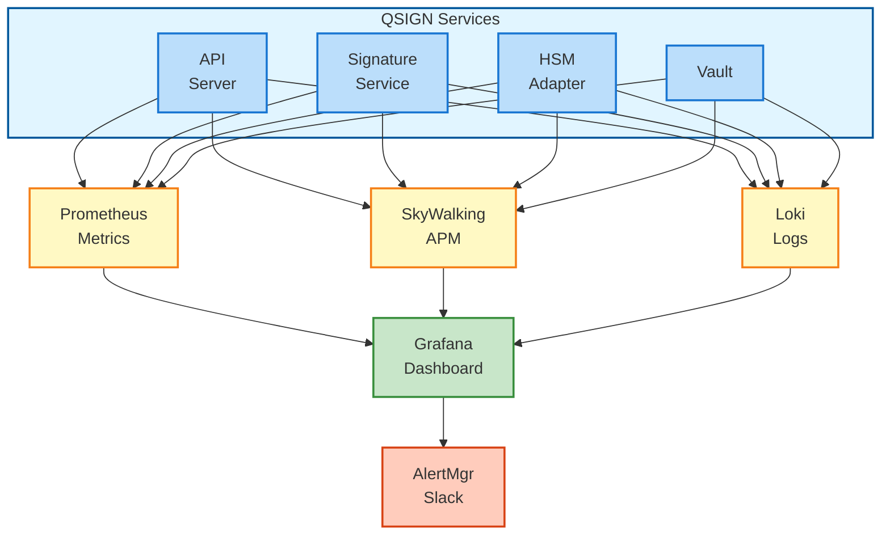

# 모니터링

QSIGN 시스템의 모니터링 구성 및 운영 가이드입니다.

## 목차
- [모니터링 아키텍처](#모니터링-아키텍처)
- [Prometheus 메트릭](#prometheus-메트릭)
- [Grafana 대시보드](#grafana-대시보드)
- [Alert 설정](#alert-설정)
- [SkyWalking APM](#skywalking-apm)
- [로그 집계](#로그-집계)
- [성능 메트릭](#성능-메트릭)

---

## 모니터링 아키텍처

### 전체 구조



### 모니터링 스택 배포

```yaml
# monitoring-stack.yaml
apiVersion: v1
kind: Namespace
metadata:
  name: monitoring
---
# Prometheus
apiVersion: apps/v1
kind: Deployment
metadata:
  name: prometheus
  namespace: monitoring
spec:
  replicas: 1
  selector:
    matchLabels:
      app: prometheus
  template:
    metadata:
      labels:
        app: prometheus
    spec:
      serviceAccountName: prometheus
      containers:
      - name: prometheus
        image: prom/prometheus:v2.45.0
        args:
        - '--config.file=/etc/prometheus/prometheus.yml'
        - '--storage.tsdb.path=/prometheus'
        - '--storage.tsdb.retention.time=30d'
        - '--web.enable-lifecycle'
        ports:
        - containerPort: 9090
        volumeMounts:
        - name: config
          mountPath: /etc/prometheus
        - name: storage
          mountPath: /prometheus
      volumes:
      - name: config
        configMap:
          name: prometheus-config
      - name: storage
        persistentVolumeClaim:
          claimName: prometheus-pvc
---
# Grafana
apiVersion: apps/v1
kind: Deployment
metadata:
  name: grafana
  namespace: monitoring
spec:
  replicas: 1
  selector:
    matchLabels:
      app: grafana
  template:
    metadata:
      labels:
        app: grafana
    spec:
      containers:
      - name: grafana
        image: grafana/grafana:10.0.0
        ports:
        - containerPort: 3000
        env:
        - name: GF_SECURITY_ADMIN_PASSWORD
          valueFrom:
            secretKeyRef:
              name: grafana-secret
              key: admin-password
        volumeMounts:
        - name: storage
          mountPath: /var/lib/grafana
      volumes:
      - name: storage
        persistentVolumeClaim:
          claimName: grafana-pvc
```

---

## Prometheus 메트릭

### Prometheus 설정

```yaml
# prometheus-config.yaml
apiVersion: v1
kind: ConfigMap
metadata:
  name: prometheus-config
  namespace: monitoring
data:
  prometheus.yml: |
    global:
      scrape_interval: 15s
      evaluation_interval: 15s
      external_labels:
        cluster: 'qsign-production'

    # AlertManager 설정
    alerting:
      alertmanagers:
      - static_configs:
        - targets:
          - alertmanager:9093

    # 알림 규칙
    rule_files:
    - '/etc/prometheus/rules/*.yml'

    # 스크랩 설정
    scrape_configs:
    # Kubernetes API Server
    - job_name: 'kubernetes-apiservers'
      kubernetes_sd_configs:
      - role: endpoints
      scheme: https
      tls_config:
        ca_file: /var/run/secrets/kubernetes.io/serviceaccount/ca.crt
      bearer_token_file: /var/run/secrets/kubernetes.io/serviceaccount/token
      relabel_configs:
      - source_labels: [__meta_kubernetes_namespace, __meta_kubernetes_service_name, __meta_kubernetes_endpoint_port_name]
        action: keep
        regex: default;kubernetes;https

    # Kubernetes Nodes
    - job_name: 'kubernetes-nodes'
      kubernetes_sd_configs:
      - role: node
      scheme: https
      tls_config:
        ca_file: /var/run/secrets/kubernetes.io/serviceaccount/ca.crt
      bearer_token_file: /var/run/secrets/kubernetes.io/serviceaccount/token
      relabel_configs:
      - action: labelmap
        regex: __meta_kubernetes_node_label_(.+)

    # QSIGN Services
    - job_name: 'qsign-api-server'
      kubernetes_sd_configs:
      - role: pod
        namespaces:
          names:
          - qsign
      relabel_configs:
      - source_labels: [__meta_kubernetes_pod_label_app]
        action: keep
        regex: api-server
      - source_labels: [__meta_kubernetes_pod_ip]
        target_label: __address__
        replacement: '${1}:8080'

    - job_name: 'qsign-signature-service'
      kubernetes_sd_configs:
      - role: pod
        namespaces:
          names:
          - qsign
      relabel_configs:
      - source_labels: [__meta_kubernetes_pod_label_app]
        action: keep
        regex: signature-service
      - source_labels: [__meta_kubernetes_pod_ip]
        target_label: __address__
        replacement: '${1}:8080'

    - job_name: 'qsign-hsm-adapter'
      kubernetes_sd_configs:
      - role: pod
        namespaces:
          names:
          - qsign
      relabel_configs:
      - source_labels: [__meta_kubernetes_pod_label_app]
        action: keep
        regex: hsm-adapter
      - source_labels: [__meta_kubernetes_pod_ip]
        target_label: __address__
        replacement: '${1}:8080'

    # PostgreSQL
    - job_name: 'postgresql'
      static_configs:
      - targets:
        - postgresql-exporter:9187

    # Vault
    - job_name: 'vault'
      static_configs:
      - targets:
        - vault:8200
      metrics_path: /v1/sys/metrics
      params:
        format: ['prometheus']
```

### 애플리케이션 메트릭 노출

#### Spring Boot (Java)

```java
// build.gradle
dependencies {
    implementation 'org.springframework.boot:spring-boot-starter-actuator'
    implementation 'io.micrometer:micrometer-registry-prometheus'
}

// application.yml
management:
  endpoints:
    web:
      exposure:
        include: health,info,metrics,prometheus
  metrics:
    export:
      prometheus:
        enabled: true
    tags:
      application: ${spring.application.name}
      environment: ${ENVIRONMENT:dev}

// Custom Metrics
@Component
public class SignatureMetrics {
    private final Counter signatureRequestCounter;
    private final Timer signatureDuration;
    private final Gauge activeSignatures;

    public SignatureMetrics(MeterRegistry registry) {
        this.signatureRequestCounter = Counter.builder("qsign.signature.requests.total")
            .description("Total signature requests")
            .tag("type", "digital")
            .register(registry);

        this.signatureDuration = Timer.builder("qsign.signature.duration")
            .description("Signature processing time")
            .tag("algorithm", "RSA")
            .register(registry);

        this.activeSignatures = Gauge.builder("qsign.signature.active",
            activeSignatureCount, AtomicInteger::get)
            .description("Active signature operations")
            .register(registry);
    }

    public void recordSignatureRequest() {
        signatureRequestCounter.increment();
    }

    public void recordSignatureDuration(long millis) {
        signatureDuration.record(millis, TimeUnit.MILLISECONDS);
    }
}
```

#### Go

```go
// metrics.go
package metrics

import (
    "github.com/prometheus/client_golang/prometheus"
    "github.com/prometheus/client_golang/prometheus/promauto"
    "github.com/prometheus/client_golang/prometheus/promhttp"
)

var (
    SignatureRequests = promauto.NewCounterVec(
        prometheus.CounterOpts{
            Name: "qsign_signature_requests_total",
            Help: "Total signature requests",
        },
        []string{"algorithm", "status"},
    )

    SignatureDuration = promauto.NewHistogramVec(
        prometheus.HistogramOpts{
            Name: "qsign_signature_duration_seconds",
            Help: "Signature processing duration",
            Buckets: prometheus.DefBuckets,
        },
        []string{"algorithm"},
    )

    HSMConnections = promauto.NewGauge(
        prometheus.GaugeOpts{
            Name: "qsign_hsm_connections_active",
            Help: "Active HSM connections",
        },
    )
)

// HTTP Handler
func MetricsHandler() http.Handler {
    return promhttp.Handler()
}
```

### 주요 메트릭 목록

#### 시스템 메트릭

```promql
# CPU 사용률
rate(process_cpu_seconds_total[5m])

# 메모리 사용량
process_resident_memory_bytes

# JVM 힙 사용률 (Java)
jvm_memory_used_bytes{area="heap"} / jvm_memory_max_bytes{area="heap"}

# Goroutine 수 (Go)
go_goroutines
```

#### 애플리케이션 메트릭

```promql
# HTTP 요청 수
rate(http_requests_total[5m])

# HTTP 응답 시간 (P95)
histogram_quantile(0.95, rate(http_request_duration_seconds_bucket[5m]))

# 서명 요청 수
rate(qsign_signature_requests_total[5m])

# 서명 처리 시간 (평균)
rate(qsign_signature_duration_seconds_sum[5m]) / rate(qsign_signature_duration_seconds_count[5m])

# 서명 성공률
rate(qsign_signature_requests_total{status="success"}[5m]) / rate(qsign_signature_requests_total[5m])
```

#### 비즈니스 메트릭

```promql
# 시간당 서명 요청 수
sum(increase(qsign_signature_requests_total[1h]))

# 알고리즘별 서명 분포
sum by (algorithm) (rate(qsign_signature_requests_total[5m]))

# 사용자별 서명 요청
sum by (user_id) (rate(qsign_signature_requests_total[1h]))
```

---

## Grafana 대시보드

### Grafana 데이터소스 설정

```yaml
# grafana-datasources.yaml
apiVersion: v1
kind: ConfigMap
metadata:
  name: grafana-datasources
  namespace: monitoring
data:
  datasources.yaml: |
    apiVersion: 1
    datasources:
    - name: Prometheus
      type: prometheus
      access: proxy
      url: http://prometheus:9090
      isDefault: true
      editable: false

    - name: Loki
      type: loki
      access: proxy
      url: http://loki:3100
      editable: false

    - name: PostgreSQL
      type: postgres
      url: postgresql.qsign.svc.cluster.local:5432
      database: qsign
      user: grafana
      secureJsonData:
        password: ${POSTGRES_PASSWORD}
      jsonData:
        sslmode: require
        postgresVersion: 1500
```

### QSIGN Overview Dashboard

```json
{
  "dashboard": {
    "title": "QSIGN System Overview",
    "tags": ["qsign", "overview"],
    "timezone": "browser",
    "panels": [
      {
        "title": "Request Rate",
        "targets": [
          {
            "expr": "sum(rate(http_requests_total{namespace=\"qsign\"}[5m]))",
            "legendFormat": "Total Requests/s"
          }
        ],
        "type": "graph",
        "gridPos": {"h": 8, "w": 12, "x": 0, "y": 0}
      },
      {
        "title": "Response Time (P95)",
        "targets": [
          {
            "expr": "histogram_quantile(0.95, sum(rate(http_request_duration_seconds_bucket{namespace=\"qsign\"}[5m])) by (le, service))",
            "legendFormat": "{{service}}"
          }
        ],
        "type": "graph",
        "gridPos": {"h": 8, "w": 12, "x": 12, "y": 0}
      },
      {
        "title": "Service Health",
        "targets": [
          {
            "expr": "up{namespace=\"qsign\"}",
            "legendFormat": "{{job}}"
          }
        ],
        "type": "stat",
        "gridPos": {"h": 4, "w": 6, "x": 0, "y": 8}
      },
      {
        "title": "Error Rate",
        "targets": [
          {
            "expr": "sum(rate(http_requests_total{namespace=\"qsign\",status=~\"5..\"}[5m])) / sum(rate(http_requests_total{namespace=\"qsign\"}[5m]))",
            "legendFormat": "Error Rate"
          }
        ],
        "type": "gauge",
        "gridPos": {"h": 4, "w": 6, "x": 6, "y": 8}
      }
    ]
  }
}
```

### Signature Service Dashboard

```json
{
  "dashboard": {
    "title": "QSIGN Signature Service",
    "panels": [
      {
        "title": "Signature Requests/min",
        "targets": [
          {
            "expr": "sum(rate(qsign_signature_requests_total[1m])) by (algorithm)",
            "legendFormat": "{{algorithm}}"
          }
        ],
        "type": "graph"
      },
      {
        "title": "Signature Success Rate",
        "targets": [
          {
            "expr": "sum(rate(qsign_signature_requests_total{status=\"success\"}[5m])) / sum(rate(qsign_signature_requests_total[5m]))",
            "legendFormat": "Success Rate"
          }
        ],
        "type": "gauge",
        "thresholds": [
          {"value": 0.95, "color": "green"},
          {"value": 0.90, "color": "yellow"},
          {"value": 0.00, "color": "red"}
        ]
      },
      {
        "title": "Signature Duration",
        "targets": [
          {
            "expr": "histogram_quantile(0.50, rate(qsign_signature_duration_seconds_bucket[5m]))",
            "legendFormat": "P50"
          },
          {
            "expr": "histogram_quantile(0.95, rate(qsign_signature_duration_seconds_bucket[5m]))",
            "legendFormat": "P95"
          },
          {
            "expr": "histogram_quantile(0.99, rate(qsign_signature_duration_seconds_bucket[5m]))",
            "legendFormat": "P99"
          }
        ],
        "type": "graph"
      },
      {
        "title": "HSM Connection Status",
        "targets": [
          {
            "expr": "qsign_hsm_connections_active",
            "legendFormat": "Active Connections"
          }
        ],
        "type": "stat"
      }
    ]
  }
}
```

### Resource Monitoring Dashboard

```json
{
  "dashboard": {
    "title": "QSIGN Resources",
    "panels": [
      {
        "title": "Pod CPU Usage",
        "targets": [
          {
            "expr": "sum(rate(container_cpu_usage_seconds_total{namespace=\"qsign\"}[5m])) by (pod)",
            "legendFormat": "{{pod}}"
          }
        ],
        "type": "graph"
      },
      {
        "title": "Pod Memory Usage",
        "targets": [
          {
            "expr": "sum(container_memory_working_set_bytes{namespace=\"qsign\"}) by (pod)",
            "legendFormat": "{{pod}}"
          }
        ],
        "type": "graph"
      },
      {
        "title": "Network I/O",
        "targets": [
          {
            "expr": "sum(rate(container_network_receive_bytes_total{namespace=\"qsign\"}[5m])) by (pod)",
            "legendFormat": "RX {{pod}}"
          },
          {
            "expr": "sum(rate(container_network_transmit_bytes_total{namespace=\"qsign\"}[5m])) by (pod)",
            "legendFormat": "TX {{pod}}"
          }
        ],
        "type": "graph"
      },
      {
        "title": "Disk Usage",
        "targets": [
          {
            "expr": "kubelet_volume_stats_used_bytes{namespace=\"qsign\"} / kubelet_volume_stats_capacity_bytes{namespace=\"qsign\"}",
            "legendFormat": "{{persistentvolumeclaim}}"
          }
        ],
        "type": "gauge"
      }
    ]
  }
}
```

---

## Alert 설정

### Alert Rules

```yaml
# prometheus-rules.yaml
apiVersion: v1
kind: ConfigMap
metadata:
  name: prometheus-rules
  namespace: monitoring
data:
  qsign-alerts.yml: |
    groups:
    - name: qsign_alerts
      interval: 30s
      rules:
      # Service Down
      - alert: ServiceDown
        expr: up{namespace="qsign"} == 0
        for: 1m
        labels:
          severity: critical
        annotations:
          summary: "Service {{ $labels.job }} is down"
          description: "{{ $labels.job }} in namespace {{ $labels.namespace }} has been down for more than 1 minute."

      # High Error Rate
      - alert: HighErrorRate
        expr: |
          sum(rate(http_requests_total{namespace="qsign",status=~"5.."}[5m]))
          /
          sum(rate(http_requests_total{namespace="qsign"}[5m]))
          > 0.05
        for: 5m
        labels:
          severity: warning
        annotations:
          summary: "High error rate detected"
          description: "Error rate is {{ $value | humanizePercentage }} for the last 5 minutes."

      # Slow Response Time
      - alert: SlowResponseTime
        expr: |
          histogram_quantile(0.95,
            sum(rate(http_request_duration_seconds_bucket{namespace="qsign"}[5m])) by (le, service)
          ) > 1
        for: 10m
        labels:
          severity: warning
        annotations:
          summary: "Slow response time for {{ $labels.service }}"
          description: "P95 response time is {{ $value }}s for {{ $labels.service }}."

      # High CPU Usage
      - alert: HighCPUUsage
        expr: |
          sum(rate(container_cpu_usage_seconds_total{namespace="qsign"}[5m])) by (pod)
          /
          sum(container_spec_cpu_quota{namespace="qsign"}/container_spec_cpu_period{namespace="qsign"}) by (pod)
          > 0.8
        for: 10m
        labels:
          severity: warning
        annotations:
          summary: "High CPU usage on {{ $labels.pod }}"
          description: "CPU usage is {{ $value | humanizePercentage }} on {{ $labels.pod }}."

      # High Memory Usage
      - alert: HighMemoryUsage
        expr: |
          sum(container_memory_working_set_bytes{namespace="qsign"}) by (pod)
          /
          sum(container_spec_memory_limit_bytes{namespace="qsign"}) by (pod)
          > 0.9
        for: 5m
        labels:
          severity: warning
        annotations:
          summary: "High memory usage on {{ $labels.pod }}"
          description: "Memory usage is {{ $value | humanizePercentage }} on {{ $labels.pod }}."

      # Signature Failure Rate
      - alert: HighSignatureFailureRate
        expr: |
          sum(rate(qsign_signature_requests_total{status="failed"}[5m]))
          /
          sum(rate(qsign_signature_requests_total[5m]))
          > 0.1
        for: 5m
        labels:
          severity: critical
        annotations:
          summary: "High signature failure rate"
          description: "Signature failure rate is {{ $value | humanizePercentage }}."

      # HSM Connection Lost
      - alert: HSMConnectionLost
        expr: qsign_hsm_connections_active == 0
        for: 1m
        labels:
          severity: critical
        annotations:
          summary: "HSM connection lost"
          description: "No active HSM connections detected."

      # Vault Sealed
      - alert: VaultSealed
        expr: vault_core_unsealed == 0
        for: 1m
        labels:
          severity: critical
        annotations:
          summary: "Vault is sealed"
          description: "Vault has been sealed and needs to be unsealed."

      # Database Connection Pool Exhausted
      - alert: DatabaseConnectionPoolExhausted
        expr: hikaricp_connections_active >= hikaricp_connections_max
        for: 5m
        labels:
          severity: warning
        annotations:
          summary: "Database connection pool exhausted"
          description: "All database connections are in use."

      # Disk Space Low
      - alert: DiskSpaceLow
        expr: |
          kubelet_volume_stats_used_bytes{namespace="qsign"}
          /
          kubelet_volume_stats_capacity_bytes{namespace="qsign"}
          > 0.85
        for: 10m
        labels:
          severity: warning
        annotations:
          summary: "Disk space low on {{ $labels.persistentvolumeclaim }}"
          description: "Disk usage is {{ $value | humanizePercentage }}."

      # Certificate Expiring Soon
      - alert: CertificateExpiringSoon
        expr: (cert_expiry_timestamp - time()) / 86400 < 30
        for: 1h
        labels:
          severity: warning
        annotations:
          summary: "Certificate {{ $labels.cert_name }} expiring soon"
          description: "Certificate will expire in {{ $value }} days."
```

### AlertManager 설정

```yaml
# alertmanager-config.yaml
apiVersion: v1
kind: ConfigMap
metadata:
  name: alertmanager-config
  namespace: monitoring
data:
  alertmanager.yml: |
    global:
      resolve_timeout: 5m
      slack_api_url: 'https://hooks.slack.com/services/YOUR/WEBHOOK/URL'

    # 알림 라우팅
    route:
      receiver: 'default-receiver'
      group_by: ['alertname', 'cluster', 'service']
      group_wait: 10s
      group_interval: 10s
      repeat_interval: 12h

      routes:
      # Critical alerts - 즉시 알림
      - match:
          severity: critical
        receiver: 'critical-receiver'
        group_wait: 0s
        repeat_interval: 5m

      # Warning alerts - 그룹화하여 알림
      - match:
          severity: warning
        receiver: 'warning-receiver'
        group_wait: 30s
        repeat_interval: 1h

    # 중복 억제
    inhibit_rules:
    - source_match:
        severity: 'critical'
      target_match:
        severity: 'warning'
      equal: ['alertname', 'cluster', 'service']

    # Receivers
    receivers:
    - name: 'default-receiver'
      slack_configs:
      - channel: '#qsign-alerts'
        title: 'QSIGN Alert'
        text: '{{ range .Alerts }}{{ .Annotations.summary }}\n{{ .Annotations.description }}{{ end }}'
        send_resolved: true

    - name: 'critical-receiver'
      slack_configs:
      - channel: '#qsign-critical'
        title: ':rotating_light: CRITICAL ALERT :rotating_light:'
        text: '{{ range .Alerts }}{{ .Annotations.summary }}\n{{ .Annotations.description }}{{ end }}'
        send_resolved: true

      email_configs:
      - to: 'ops-team@example.com,on-call@example.com'
        from: 'alertmanager@example.com'
        smarthost: 'smtp.example.com:587'
        auth_username: 'alertmanager@example.com'
        auth_password: '${SMTP_PASSWORD}'
        headers:
          Subject: '[CRITICAL] QSIGN Alert - {{ .GroupLabels.alertname }}'

      pagerduty_configs:
      - service_key: '${PAGERDUTY_SERVICE_KEY}'
        description: '{{ .CommonAnnotations.summary }}'

    - name: 'warning-receiver'
      slack_configs:
      - channel: '#qsign-alerts'
        title: ':warning: Warning Alert'
        text: '{{ range .Alerts }}{{ .Annotations.summary }}\n{{ .Annotations.description }}{{ end }}'
        send_resolved: true
```

---

## SkyWalking APM

### SkyWalking 배포

```yaml
# skywalking-deployment.yaml
apiVersion: apps/v1
kind: Deployment
metadata:
  name: skywalking-oap
  namespace: monitoring
spec:
  replicas: 2
  selector:
    matchLabels:
      app: skywalking-oap
  template:
    metadata:
      labels:
        app: skywalking-oap
    spec:
      containers:
      - name: oap
        image: apache/skywalking-oap-server:9.5.0
        ports:
        - containerPort: 11800
          name: grpc
        - containerPort: 12800
          name: rest
        env:
        - name: SW_STORAGE
          value: elasticsearch
        - name: SW_STORAGE_ES_CLUSTER_NODES
          value: elasticsearch:9200
        - name: SW_NAMESPACE
          value: qsign
---
apiVersion: apps/v1
kind: Deployment
metadata:
  name: skywalking-ui
  namespace: monitoring
spec:
  replicas: 1
  selector:
    matchLabels:
      app: skywalking-ui
  template:
    metadata:
      labels:
        app: skywalking-ui
    spec:
      containers:
      - name: ui
        image: apache/skywalking-ui:9.5.0
        ports:
        - containerPort: 8080
        env:
        - name: SW_OAP_ADDRESS
          value: http://skywalking-oap:12800
```

### Java Agent 설정

```yaml
# Deployment에 SkyWalking Agent 추가
apiVersion: apps/v1
kind: Deployment
metadata:
  name: api-server
  namespace: qsign
spec:
  template:
    spec:
      initContainers:
      - name: skywalking-agent
        image: apache/skywalking-java-agent:8.16.0-java17
        command:
        - sh
        - -c
        - cp -r /skywalking/agent /agent
        volumeMounts:
        - name: skywalking-agent
          mountPath: /agent

      containers:
      - name: api-server
        image: qsign/api-server:latest
        env:
        - name: JAVA_TOOL_OPTIONS
          value: "-javaagent:/agent/skywalking-agent.jar"
        - name: SW_AGENT_NAME
          value: "qsign-api-server"
        - name: SW_AGENT_COLLECTOR_BACKEND_SERVICES
          value: "skywalking-oap.monitoring:11800"
        - name: SW_AGENT_NAMESPACE
          value: "qsign"
        volumeMounts:
        - name: skywalking-agent
          mountPath: /agent

      volumes:
      - name: skywalking-agent
        emptyDir: {}
```

### 분산 추적 예시

```java
// 커스텀 Span 생성
@Component
public class SignatureService {

    @Trace
    @Tag(key = "algorithm", value = "arg[0].algorithm")
    public SignatureResult sign(SignatureRequest request) {
        // SkyWalking이 자동으로 Span 생성

        // 커스텀 태그 추가
        ActiveSpan.tag("user_id", request.getUserId());
        ActiveSpan.tag("document_id", request.getDocumentId());

        try {
            SignatureResult result = performSignature(request);
            ActiveSpan.tag("status", "success");
            return result;
        } catch (Exception e) {
            ActiveSpan.error(e);
            ActiveSpan.tag("status", "failed");
            throw e;
        }
    }

    @Trace
    private SignatureResult performSignature(SignatureRequest request) {
        // HSM 호출 등
        return hsmAdapter.sign(request);
    }
}
```

---

## 로그 집계

### Loki 배포

```yaml
# loki-deployment.yaml
apiVersion: apps/v1
kind: StatefulSet
metadata:
  name: loki
  namespace: monitoring
spec:
  serviceName: loki
  replicas: 1
  selector:
    matchLabels:
      app: loki
  template:
    metadata:
      labels:
        app: loki
    spec:
      containers:
      - name: loki
        image: grafana/loki:2.9.0
        args:
        - -config.file=/etc/loki/loki.yaml
        ports:
        - containerPort: 3100
          name: http-metrics
        volumeMounts:
        - name: config
          mountPath: /etc/loki
        - name: storage
          mountPath: /loki
      volumes:
      - name: config
        configMap:
          name: loki-config
  volumeClaimTemplates:
  - metadata:
      name: storage
    spec:
      accessModes: ["ReadWriteOnce"]
      resources:
        requests:
          storage: 100Gi
```

### Promtail 설정

```yaml
# promtail-daemonset.yaml
apiVersion: apps/v1
kind: DaemonSet
metadata:
  name: promtail
  namespace: monitoring
spec:
  selector:
    matchLabels:
      app: promtail
  template:
    metadata:
      labels:
        app: promtail
    spec:
      serviceAccountName: promtail
      containers:
      - name: promtail
        image: grafana/promtail:2.9.0
        args:
        - -config.file=/etc/promtail/promtail.yaml
        volumeMounts:
        - name: config
          mountPath: /etc/promtail
        - name: varlog
          mountPath: /var/log
        - name: varlibdockercontainers
          mountPath: /var/lib/docker/containers
          readOnly: true
      volumes:
      - name: config
        configMap:
          name: promtail-config
      - name: varlog
        hostPath:
          path: /var/log
      - name: varlibdockercontainers
        hostPath:
          path: /var/lib/docker/containers
```

### Promtail Config

```yaml
# promtail-config.yaml
apiVersion: v1
kind: ConfigMap
metadata:
  name: promtail-config
  namespace: monitoring
data:
  promtail.yaml: |
    server:
      http_listen_port: 9080
      grpc_listen_port: 0

    positions:
      filename: /tmp/positions.yaml

    clients:
    - url: http://loki:3100/loki/api/v1/push

    scrape_configs:
    # QSIGN Pod 로그
    - job_name: kubernetes-pods
      kubernetes_sd_configs:
      - role: pod

      relabel_configs:
      # QSIGN namespace만 수집
      - source_labels: [__meta_kubernetes_namespace]
        action: keep
        regex: qsign

      - source_labels: [__meta_kubernetes_pod_label_app]
        target_label: app

      - source_labels: [__meta_kubernetes_pod_name]
        target_label: pod

      - source_labels: [__meta_kubernetes_namespace]
        target_label: namespace

      - source_labels: [__meta_kubernetes_pod_container_name]
        target_label: container

      # 로그 파일 경로
      - replacement: /var/log/pods/*$1/*.log
        separator: /
        source_labels:
        - __meta_kubernetes_pod_uid
        - __meta_kubernetes_pod_container_name
        target_label: __path__

      # 로그 파싱 (JSON)
      pipeline_stages:
      - json:
          expressions:
            timestamp: timestamp
            level: level
            message: message
            logger: logger

      - timestamp:
          source: timestamp
          format: RFC3339

      - labels:
          level:
          logger:
```

### LogQL 쿼리 예시

```logql
# 모든 에러 로그
{namespace="qsign"} |= "ERROR"

# 특정 서비스의 로그
{namespace="qsign", app="signature-service"}

# 서명 실패 로그
{namespace="qsign"} |= "signature failed"

# 응답 시간 > 1초
{namespace="qsign"} | json | response_time > 1000

# 알고리즘별 로그 집계
sum by (algorithm) (count_over_time({namespace="qsign"} |= "Signature request" | json [5m]))

# 에러 발생 추세
rate({namespace="qsign"} |= "ERROR" [5m])
```

---

## 성능 메트릭

### JVM 메트릭 (Java)

```promql
# GC 시간
rate(jvm_gc_pause_seconds_sum[5m])

# GC 횟수
rate(jvm_gc_pause_seconds_count[5m])

# 힙 메모리 사용률
jvm_memory_used_bytes{area="heap"} / jvm_memory_max_bytes{area="heap"}

# Thread 수
jvm_threads_live_threads
```

### Database 메트릭

```promql
# Connection Pool 사용률
hikaricp_connections_active / hikaricp_connections_max

# 대기 중인 Connection 요청
hikaricp_connections_pending

# Query 실행 시간
rate(hikaricp_connections_usage_seconds_sum[5m]) / rate(hikaricp_connections_usage_seconds_count[5m])
```

### HSM 메트릭

```promql
# HSM 연결 수
qsign_hsm_connections_active

# HSM 서명 시간
rate(qsign_hsm_sign_duration_seconds_sum[5m]) / rate(qsign_hsm_sign_duration_seconds_count[5m])

# HSM 에러율
rate(qsign_hsm_errors_total[5m])
```

---

## 참고 자료

- [Daily Operations](./DAILY-OPERATIONS.md)
- [Alert Runbook](../04-operations/MONITORING.md)
- [Prometheus Documentation](https://prometheus.io/docs/)
- [Grafana Documentation](https://grafana.com/docs/)
- [SkyWalking Documentation](https://skywalking.apache.org/docs/)
