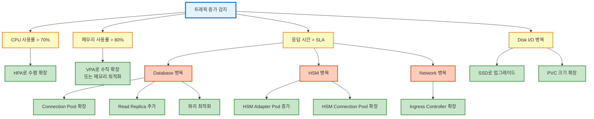

# 확장 가이드

QSIGN 시스템의 수평/수직 확장 및 성능 최적화 가이드입니다.

## 목차
- [확장 전략](#확장-전략)
- [수평 확장 (HPA)](#수평-확장-hpa)
- [수직 확장 (VPA)](#수직-확장-vpa)
- [리소스 최적화](#리소스-최적화)
- [성능 튜닝](#성능-튜닝)
- [용량 계획](#용량-계획)
- [부하 테스트](#부하-테스트)

---

## 확장 전략

### 확장 결정 트리



### 확장 우선순위

1. **즉시 확장 (자동)**
   - HPA 기반 Pod 수평 확장
   - Cluster Autoscaler로 노드 추가

2. **단기 확장 (수동, 1-2일)**
   - VPA로 리소스 제한 조정
   - Database Connection Pool 확장
   - Cache 용량 증가

3. **중기 확장 (계획, 1-2주)**
   - Read Replica 추가
   - 서비스 분리 (마이크로서비스화)
   - CDN 도입

4. **장기 확장 (아키텍처, 1-3개월)**
   - Multi-region 배포
   - Sharding 전략
   - 비동기 처리 아키텍처

---

## 수평 확장 (HPA)

### Horizontal Pod Autoscaler 설정

#### API Server HPA

```yaml
# api-server-hpa.yaml
apiVersion: autoscaling/v2
kind: HorizontalPodAutoscaler
metadata:
  name: api-server-hpa
  namespace: qsign
spec:
  scaleTargetRef:
    apiVersion: apps/v1
    kind: Deployment
    name: api-server
  minReplicas: 3
  maxReplicas: 20
  metrics:
  # CPU 기반 스케일링
  - type: Resource
    resource:
      name: cpu
      target:
        type: Utilization
        averageUtilization: 70

  # 메모리 기반 스케일링
  - type: Resource
    resource:
      name: memory
      target:
        type: Utilization
        averageUtilization: 80

  # 커스텀 메트릭: 요청 수
  - type: Pods
    pods:
      metric:
        name: http_requests_per_second
      target:
        type: AverageValue
        averageValue: "1000"

  # 외부 메트릭: SQS 큐 길이
  - type: External
    external:
      metric:
        name: sqs_queue_messages
        selector:
          matchLabels:
            queue_name: signature-requests
      target:
        type: AverageValue
        averageValue: "100"

  behavior:
    scaleDown:
      stabilizationWindowSeconds: 300  # 5분 안정화
      policies:
      - type: Percent
        value: 50  # 한 번에 최대 50% 감소
        periodSeconds: 60
      - type: Pods
        value: 2  # 또는 2개씩 감소
        periodSeconds: 60
      selectPolicy: Min  # 더 보수적인 정책 선택

    scaleUp:
      stabilizationWindowSeconds: 0  # 즉시 스케일 업
      policies:
      - type: Percent
        value: 100  # 한 번에 최대 100% 증가
        periodSeconds: 30
      - type: Pods
        value: 4  # 또는 4개씩 증가
        periodSeconds: 30
      selectPolicy: Max  # 더 공격적인 정책 선택
```

#### Signature Service HPA

```yaml
# signature-service-hpa.yaml
apiVersion: autoscaling/v2
kind: HorizontalPodAutoscaler
metadata:
  name: signature-service-hpa
  namespace: qsign
spec:
  scaleTargetRef:
    apiVersion: apps/v1
    kind: Deployment
    name: signature-service
  minReplicas: 5
  maxReplicas: 30
  metrics:
  - type: Resource
    resource:
      name: cpu
      target:
        type: Utilization
        averageUtilization: 75

  # 서명 요청 큐 길이
  - type: Pods
    pods:
      metric:
        name: signature_queue_length
      target:
        type: AverageValue
        averageValue: "10"

  # 평균 서명 처리 시간
  - type: Pods
    pods:
      metric:
        name: signature_duration_seconds
      target:
        type: AverageValue
        averageValue: "0.5"  # 500ms

  behavior:
    scaleDown:
      stabilizationWindowSeconds: 600  # 10분 안정화 (서명 서비스는 더 보수적)
      policies:
      - type: Pods
        value: 1
        periodSeconds: 120

    scaleUp:
      stabilizationWindowSeconds: 30
      policies:
      - type: Pods
        value: 3
        periodSeconds: 30
```

#### HSM Adapter HPA

```yaml
# hsm-adapter-hpa.yaml
apiVersion: autoscaling/v2
kind: HorizontalPodAutoscaler
metadata:
  name: hsm-adapter-hpa
  namespace: qsign
spec:
  scaleTargetRef:
    apiVersion: apps/v1
    kind: Deployment
    name: hsm-adapter
  minReplicas: 2
  maxReplicas: 10  # HSM 연결 제한 고려
  metrics:
  - type: Resource
    resource:
      name: cpu
      target:
        type: Utilization
        averageUtilization: 60

  # HSM 활성 연결 수
  - type: Pods
    pods:
      metric:
        name: hsm_active_connections
      target:
        type: AverageValue
        averageValue: "8"  # Pod당 평균 8개 연결

  behavior:
    scaleDown:
      stabilizationWindowSeconds: 900  # 15분 (HSM 연결 비용 고려)
      policies:
      - type: Pods
        value: 1
        periodSeconds: 300

    scaleUp:
      stabilizationWindowSeconds: 60
      policies:
      - type: Pods
        value: 1
        periodSeconds: 60
```

### Cluster Autoscaler 설정

```yaml
# cluster-autoscaler.yaml
apiVersion: apps/v1
kind: Deployment
metadata:
  name: cluster-autoscaler
  namespace: kube-system
spec:
  replicas: 1
  selector:
    matchLabels:
      app: cluster-autoscaler
  template:
    metadata:
      labels:
        app: cluster-autoscaler
    spec:
      serviceAccountName: cluster-autoscaler
      containers:
      - name: cluster-autoscaler
        image: k8s.gcr.io/autoscaling/cluster-autoscaler:v1.27.0
        command:
        - ./cluster-autoscaler
        - --v=4
        - --stderrthreshold=info
        - --cloud-provider=aws
        - --skip-nodes-with-local-storage=false
        - --expander=least-waste
        - --node-group-auto-discovery=asg:tag=k8s.io/cluster-autoscaler/enabled,k8s.io/cluster-autoscaler/qsign-cluster
        - --balance-similar-node-groups
        - --skip-nodes-with-system-pods=false
        - --scale-down-enabled=true
        - --scale-down-delay-after-add=10m
        - --scale-down-unneeded-time=10m
        - --scale-down-utilization-threshold=0.5
        env:
        - name: AWS_REGION
          value: ap-northeast-2
```

### 커스텀 메트릭 어댑터

```yaml
# custom-metrics-adapter.yaml
apiVersion: v1
kind: ConfigMap
metadata:
  name: adapter-config
  namespace: monitoring
data:
  config.yaml: |
    rules:
    # HTTP 요청 수 메트릭
    - seriesQuery: 'http_requests_total{namespace="qsign"}'
      resources:
        overrides:
          namespace: {resource: "namespace"}
          pod: {resource: "pod"}
      name:
        matches: "^(.*)_total"
        as: "${1}_per_second"
      metricsQuery: 'sum(rate(<<.Series>>{<<.LabelMatchers>>}[1m])) by (<<.GroupBy>>)'

    # 서명 큐 길이 메트릭
    - seriesQuery: 'signature_queue_length{namespace="qsign"}'
      resources:
        overrides:
          namespace: {resource: "namespace"}
          pod: {resource: "pod"}
      name:
        matches: "^(.*)"
        as: "${1}"
      metricsQuery: 'avg(<<.Series>>{<<.LabelMatchers>>}) by (<<.GroupBy>>)'

    # 서명 처리 시간 메트릭
    - seriesQuery: 'signature_duration_seconds{namespace="qsign"}'
      resources:
        overrides:
          namespace: {resource: "namespace"}
          pod: {resource: "pod"}
      name:
        matches: "^(.*)"
        as: "${1}"
      metricsQuery: |
        avg(rate(<<.Series>>_sum{<<.LabelMatchers>>}[2m]) /
            rate(<<.Series>>_count{<<.LabelMatchers>>}[2m])) by (<<.GroupBy>>)
---
apiVersion: apps/v1
kind: Deployment
metadata:
  name: prometheus-adapter
  namespace: monitoring
spec:
  replicas: 1
  selector:
    matchLabels:
      app: prometheus-adapter
  template:
    metadata:
      labels:
        app: prometheus-adapter
    spec:
      serviceAccountName: prometheus-adapter
      containers:
      - name: prometheus-adapter
        image: k8s.gcr.io/prometheus-adapter/prometheus-adapter:v0.11.0
        args:
        - --cert-dir=/var/run/serving-cert
        - --config=/etc/adapter/config.yaml
        - --prometheus-url=http://prometheus:9090
        - --metrics-relist-interval=1m
        - --v=4
        volumeMounts:
        - name: config
          mountPath: /etc/adapter
      volumes:
      - name: config
        configMap:
          name: adapter-config
```

---

## 수직 확장 (VPA)

### Vertical Pod Autoscaler 설정

#### VPA 설치

```bash
#!/bin/bash
# install-vpa.sh

# VPA 설치
git clone https://github.com/kubernetes/autoscaler.git
cd autoscaler/vertical-pod-autoscaler

./hack/vpa-up.sh

# 확인
kubectl get pods -n kube-system | grep vpa
```

#### API Server VPA

```yaml
# api-server-vpa.yaml
apiVersion: autoscaling.k8s.io/v1
kind: VerticalPodAutoscaler
metadata:
  name: api-server-vpa
  namespace: qsign
spec:
  targetRef:
    apiVersion: apps/v1
    kind: Deployment
    name: api-server

  updatePolicy:
    updateMode: "Auto"  # Auto, Recreate, Initial, Off

  resourcePolicy:
    containerPolicies:
    - containerName: api-server
      minAllowed:
        cpu: 500m
        memory: 512Mi
      maxAllowed:
        cpu: 4000m
        memory: 8Gi
      controlledResources:
      - cpu
      - memory
      mode: Auto
```

#### Signature Service VPA

```yaml
# signature-service-vpa.yaml
apiVersion: autoscaling.k8s.io/v1
kind: VerticalPodAutoscaler
metadata:
  name: signature-service-vpa
  namespace: qsign
spec:
  targetRef:
    apiVersion: apps/v1
    kind: Deployment
    name: signature-service

  updatePolicy:
    updateMode: "Recreate"  # HPA와 함께 사용 시 Recreate 권장

  resourcePolicy:
    containerPolicies:
    - containerName: signature-service
      minAllowed:
        cpu: 1000m
        memory: 1Gi
      maxAllowed:
        cpu: 8000m
        memory: 16Gi
      controlledResources:
      - memory  # 메모리만 VPA로 관리
      mode: Auto
```

### VPA Recommendation 확인

```bash
# VPA 추천 리소스 확인
kubectl describe vpa -n qsign api-server-vpa

# 출력 예시:
# Recommendation:
#   Container Recommendations:
#     Container Name:  api-server
#     Lower Bound:
#       Cpu:     500m
#       Memory:  512Mi
#     Target:
#       Cpu:     1500m
#       Memory:  2Gi
#     Uncapped Target:
#       Cpu:     1500m
#       Memory:  2Gi
#     Upper Bound:
#       Cpu:     4000m
#       Memory:  8Gi
```

---

## 리소스 최적화

### 리소스 Request/Limit 설정

#### 적절한 Request/Limit 설정

```yaml
# optimized-deployment.yaml
apiVersion: apps/v1
kind: Deployment
metadata:
  name: api-server
  namespace: qsign
spec:
  replicas: 3
  template:
    spec:
      containers:
      - name: api-server
        image: qsign/api-server:latest
        resources:
          requests:
            # Request: 평균 사용량 + 20%
            cpu: 1000m
            memory: 2Gi
          limits:
            # Limit: Request의 1.5-2배 (버스트 허용)
            cpu: 2000m
            memory: 4Gi

      # 사이드카 컨테이너 리소스도 고려
      - name: skywalking-agent
        resources:
          requests:
            cpu: 100m
            memory: 128Mi
          limits:
            cpu: 200m
            memory: 256Mi
```

#### QoS Class 최적화

```yaml
# Guaranteed QoS (중요한 서비스)
apiVersion: apps/v1
kind: Deployment
metadata:
  name: signature-service
  namespace: qsign
spec:
  template:
    spec:
      containers:
      - name: signature-service
        resources:
          requests:
            cpu: 2000m
            memory: 4Gi
          limits:
            cpu: 2000m      # Request와 동일 = Guaranteed QoS
            memory: 4Gi

---
# Burstable QoS (일반 서비스)
apiVersion: apps/v1
kind: Deployment
metadata:
  name: api-server
  namespace: qsign
spec:
  template:
    spec:
      containers:
      - name: api-server
        resources:
          requests:
            cpu: 1000m
            memory: 2Gi
          limits:
            cpu: 2000m      # Request보다 큼 = Burstable QoS
            memory: 4Gi
```

### PodDisruptionBudget 설정

```yaml
# pod-disruption-budget.yaml
apiVersion: policy/v1
kind: PodDisruptionBudget
metadata:
  name: api-server-pdb
  namespace: qsign
spec:
  minAvailable: 2  # 최소 2개 Pod 유지
  selector:
    matchLabels:
      app: api-server
---
apiVersion: policy/v1
kind: PodDisruptionBudget
metadata:
  name: signature-service-pdb
  namespace: qsign
spec:
  maxUnavailable: 1  # 최대 1개 Pod만 중단 허용
  selector:
    matchLabels:
      app: signature-service
```

### 노드 Affinity/Anti-Affinity

```yaml
# node-affinity.yaml
apiVersion: apps/v1
kind: Deployment
metadata:
  name: signature-service
  namespace: qsign
spec:
  template:
    spec:
      # Node Affinity: 고성능 노드 선호
      affinity:
        nodeAffinity:
          preferredDuringSchedulingIgnoredDuringExecution:
          - weight: 100
            preference:
              matchExpressions:
              - key: node.kubernetes.io/instance-type
                operator: In
                values:
                - c5.2xlarge
                - c5.4xlarge

          requiredDuringSchedulingIgnoredDuringExecution:
            nodeSelectorTerms:
            - matchExpressions:
              - key: workload
                operator: In
                values:
                - compute-intensive

        # Pod Anti-Affinity: 가용성을 위해 다른 노드에 분산
        podAntiAffinity:
          preferredDuringSchedulingIgnoredDuringExecution:
          - weight: 100
            podAffinityTerm:
              labelSelector:
                matchLabels:
                  app: signature-service
              topologyKey: kubernetes.io/hostname

          # 같은 가용 영역에는 배치 허용
          - weight: 50
            podAffinityTerm:
              labelSelector:
                matchLabels:
                  app: signature-service
              topologyKey: topology.kubernetes.io/zone
```

---

## 성능 튜닝

### Application 레벨 튜닝

#### Java (Spring Boot) 성능 튜닝

```yaml
# api-server-deployment.yaml
apiVersion: apps/v1
kind: Deployment
metadata:
  name: api-server
  namespace: qsign
spec:
  template:
    spec:
      containers:
      - name: api-server
        image: qsign/api-server:latest
        env:
        # JVM 옵션
        - name: JAVA_OPTS
          value: |
            -Xms2g -Xmx2g
            -XX:+UseG1GC
            -XX:MaxGCPauseMillis=200
            -XX:+UseStringDeduplication
            -XX:+ParallelRefProcEnabled
            -XX:MaxMetaspaceSize=512m
            -XX:+HeapDumpOnOutOfMemoryError
            -XX:HeapDumpPath=/tmp/heapdump.hprof

        # Spring Boot 설정
        - name: SPRING_PROFILES_ACTIVE
          value: "production"

        # Tomcat 튜닝
        - name: SERVER_TOMCAT_THREADS_MAX
          value: "200"
        - name: SERVER_TOMCAT_THREADS_MIN_SPARE
          value: "20"
        - name: SERVER_TOMCAT_MAX_CONNECTIONS
          value: "10000"
        - name: SERVER_TOMCAT_ACCEPT_COUNT
          value: "100"

        resources:
          requests:
            cpu: 1000m
            memory: 2Gi
          limits:
            cpu: 2000m
            memory: 4Gi
```

#### Connection Pool 튜닝

```yaml
# application.yaml
spring:
  datasource:
    hikari:
      # Connection Pool 크기
      minimum-idle: 10
      maximum-pool-size: 50

      # Connection 타임아웃
      connection-timeout: 30000  # 30초
      idle-timeout: 600000       # 10분
      max-lifetime: 1800000      # 30분

      # 성능 최적화
      auto-commit: false
      connection-test-query: SELECT 1

      # Pool 이름
      pool-name: QSignHikariCP

      # 메트릭 활성화
      register-mbeans: true

  # JPA 최적화
  jpa:
    properties:
      hibernate:
        # 2차 캐시
        cache:
          use_second_level_cache: true
          use_query_cache: true
          region:
            factory_class: org.hibernate.cache.jcache.JCacheRegionFactory

        # 배치 처리
        jdbc:
          batch_size: 50
          fetch_size: 100
        order_inserts: true
        order_updates: true

        # Statement 캐시
        query:
          plan_cache_max_size: 2048
          plan_parameter_metadata_max_size: 128
```

### Database 튜닝

#### PostgreSQL 설정 최적화

```yaml
# postgresql-config.yaml
apiVersion: v1
kind: ConfigMap
metadata:
  name: postgresql-config
  namespace: qsign
data:
  postgresql.conf: |
    # 메모리 설정
    shared_buffers = 4GB
    effective_cache_size = 12GB
    work_mem = 64MB
    maintenance_work_mem = 1GB

    # Connection 설정
    max_connections = 200

    # 쿼리 플래너
    random_page_cost = 1.1  # SSD 기준
    effective_io_concurrency = 200

    # WAL 설정
    wal_buffers = 16MB
    min_wal_size = 2GB
    max_wal_size = 8GB
    checkpoint_completion_target = 0.9

    # 로깅 (성능 모니터링)
    log_min_duration_statement = 1000  # 1초 이상 쿼리 로깅
    log_line_prefix = '%t [%p]: [%l-1] user=%u,db=%d,app=%a,client=%h '
    log_checkpoints = on
    log_connections = on
    log_disconnections = on
    log_lock_waits = on

    # 통계 수집
    track_io_timing = on
    track_functions = all
```

#### 인덱스 최적화

```sql
-- 자주 사용되는 쿼리 패턴 분석
SELECT query, calls, total_time, mean_time, rows
FROM pg_stat_statements
ORDER BY total_time DESC
LIMIT 20;

-- 서명 조회 최적화 인덱스
CREATE INDEX CONCURRENTLY idx_signatures_user_created
ON signatures(user_id, created_at DESC);

-- 복합 인덱스
CREATE INDEX CONCURRENTLY idx_signatures_status_algorithm
ON signatures(status, algorithm)
WHERE status = 'COMPLETED';

-- 부분 인덱스
CREATE INDEX CONCURRENTLY idx_signatures_pending
ON signatures(created_at)
WHERE status = 'PENDING';

-- BRIN 인덱스 (시계열 데이터)
CREATE INDEX idx_audit_logs_timestamp_brin
ON audit_logs USING BRIN (timestamp);

-- 인덱스 사용률 확인
SELECT
    schemaname,
    tablename,
    indexname,
    idx_scan,
    idx_tup_read,
    idx_tup_fetch,
    pg_size_pretty(pg_relation_size(indexrelid)) AS index_size
FROM pg_stat_user_indexes
ORDER BY idx_scan ASC;
```

#### Read Replica 설정

```yaml
# postgresql-read-replica.yaml
apiVersion: apps/v1
kind: StatefulSet
metadata:
  name: postgresql-read
  namespace: qsign
spec:
  replicas: 2
  serviceName: postgresql-read
  selector:
    matchLabels:
      app: postgresql
      role: read-replica
  template:
    metadata:
      labels:
        app: postgresql
        role: read-replica
    spec:
      containers:
      - name: postgresql
        image: postgres:15
        env:
        - name: POSTGRES_PASSWORD
          valueFrom:
            secretKeyRef:
              name: postgresql-secret
              key: password
        - name: PGDATA
          value: /var/lib/postgresql/data/pgdata

        # Read Replica 설정
        - name: POSTGRES_REPLICATION_MODE
          value: "slave"
        - name: POSTGRES_MASTER_SERVICE
          value: "postgresql-0.postgresql"

        ports:
        - containerPort: 5432
        volumeMounts:
        - name: data
          mountPath: /var/lib/postgresql/data
  volumeClaimTemplates:
  - metadata:
      name: data
    spec:
      accessModes: ["ReadWriteOnce"]
      resources:
        requests:
          storage: 500Gi
---
# Read-only Service
apiVersion: v1
kind: Service
metadata:
  name: postgresql-read
  namespace: qsign
spec:
  selector:
    app: postgresql
    role: read-replica
  ports:
  - port: 5432
    targetPort: 5432
  sessionAffinity: ClientIP  # Connection 유지
```

### 캐싱 전략

#### Redis 캐시 배포

```yaml
# redis-deployment.yaml
apiVersion: apps/v1
kind: Deployment
metadata:
  name: redis
  namespace: qsign
spec:
  replicas: 3
  selector:
    matchLabels:
      app: redis
  template:
    metadata:
      labels:
        app: redis
    spec:
      containers:
      - name: redis
        image: redis:7-alpine
        command:
        - redis-server
        - --maxmemory 2gb
        - --maxmemory-policy allkeys-lru
        - --save ""
        - --appendonly no
        ports:
        - containerPort: 6379
        resources:
          requests:
            cpu: 500m
            memory: 2Gi
          limits:
            cpu: 1000m
            memory: 4Gi
```

#### 애플리케이션 캐싱 설정

```java
// CacheConfig.java
@Configuration
@EnableCaching
public class CacheConfig {

    @Bean
    public CacheManager cacheManager(RedisConnectionFactory connectionFactory) {
        RedisCacheConfiguration config = RedisCacheConfiguration.defaultCacheConfig()
            .entryTtl(Duration.ofMinutes(10))
            .serializeKeysWith(
                RedisSerializationContext.SerializationPair.fromSerializer(
                    new StringRedisSerializer()))
            .serializeValuesWith(
                RedisSerializationContext.SerializationPair.fromSerializer(
                    new GenericJackson2JsonRedisSerializer()));

        Map<String, RedisCacheConfiguration> cacheConfigurations = new HashMap<>();

        // 사용자 정보 캐시 (1시간)
        cacheConfigurations.put("users",
            config.entryTtl(Duration.ofHours(1)));

        // 서명 결과 캐시 (1일)
        cacheConfigurations.put("signatures",
            config.entryTtl(Duration.ofDays(1)));

        // 공개키 캐시 (6시간)
        cacheConfigurations.put("publicKeys",
            config.entryTtl(Duration.ofHours(6)));

        return RedisCacheManager.builder(connectionFactory)
            .cacheDefaults(config)
            .withInitialCacheConfigurations(cacheConfigurations)
            .build();
    }
}

// 캐시 사용 예시
@Service
public class SignatureService {

    @Cacheable(value = "signatures", key = "#signatureId")
    public SignatureResult getSignature(String signatureId) {
        return signatureRepository.findById(signatureId)
            .orElseThrow(() -> new NotFoundException("Signature not found"));
    }

    @CacheEvict(value = "signatures", key = "#result.id")
    public SignatureResult createSignature(SignatureRequest request) {
        // 서명 생성
        return signatureRepository.save(signature);
    }
}
```

---

## 용량 계획

### 트래픽 예측 모델

```python
# capacity_planning.py
import pandas as pd
import numpy as np
from sklearn.linear_model import LinearRegression

# 과거 트래픽 데이터 로드
df = pd.read_csv('signature_requests.csv')
df['timestamp'] = pd.to_datetime(df['timestamp'])
df['day_of_year'] = df['timestamp'].dt.dayofyear

# 트렌드 분석
X = df[['day_of_year']].values
y = df['requests_per_hour'].values

model = LinearRegression()
model.fit(X, y)

# 6개월 후 예측
future_days = np.array([[day] for day in range(365, 365+180)])
predictions = model.predict(future_days)

# 필요한 리소스 계산
current_capacity = 1000  # requests/hour
predicted_max = predictions.max()
required_scaling = predicted_max / current_capacity

print(f"현재 용량: {current_capacity} req/h")
print(f"예상 최대 부하: {predicted_max:.0f} req/h")
print(f"필요한 확장 비율: {required_scaling:.2f}x")

# Pod 수 계산
requests_per_pod = 100  # 1 Pod당 처리 가능한 req/h
required_pods = int(np.ceil(predicted_max / requests_per_pod))
print(f"필요한 Pod 수: {required_pods}")
```

### 리소스 계산 스프레드시트

```yaml
# capacity-planning.yaml
capacity_planning:
  # 현재 상태 (Baseline)
  current:
    api_server:
      replicas: 3
      cpu_per_pod: 1000m
      memory_per_pod: 2Gi
      requests_per_second: 100

    signature_service:
      replicas: 5
      cpu_per_pod: 2000m
      memory_per_pod: 4Gi
      signatures_per_second: 50

    database:
      connections: 100
      cpu: 4000m
      memory: 16Gi
      iops: 3000

  # 6개월 후 예측
  forecast_6months:
    growth_rate: 2.5  # 2.5배 증가 예상

    api_server:
      replicas: 8      # 3 * 2.5 ≈ 8
      cpu_per_pod: 1000m
      memory_per_pod: 2Gi

    signature_service:
      replicas: 13     # 5 * 2.5 ≈ 13
      cpu_per_pod: 2000m
      memory_per_pod: 4Gi

    database:
      connections: 250
      cpu: 8000m
      memory: 32Gi
      iops: 7500
      read_replicas: 2  # Read Replica 추가

  # 비용 추정
  cost_estimate:
    compute:
      current_monthly: 5000  # USD
      forecast_monthly: 12500

    storage:
      current_monthly: 500
      forecast_monthly: 1250

    total:
      current_monthly: 5500
      forecast_monthly: 13750
      increase: 150%
```

---

## 부하 테스트

### K6 부하 테스트 스크립트

```javascript
// load-test.js
import http from 'k6/http';
import { check, sleep } from 'k6';
import { Rate, Trend } from 'k6/metrics';

// 커스텀 메트릭
const errorRate = new Rate('errors');
const signatureDuration = new Trend('signature_duration');

export const options = {
  stages: [
    { duration: '2m', target: 50 },    // Ramp-up to 50 users
    { duration: '5m', target: 50 },    // Stay at 50 users
    { duration: '2m', target: 100 },   // Ramp-up to 100 users
    { duration: '5m', target: 100 },   // Stay at 100 users
    { duration: '2m', target: 200 },   // Ramp-up to 200 users
    { duration: '5m', target: 200 },   // Stay at 200 users
    { duration: '5m', target: 0 },     // Ramp-down to 0 users
  ],
  thresholds: {
    'http_req_duration': ['p(95)<500', 'p(99)<1000'],  // 95%는 500ms 이하
    'http_req_failed': ['rate<0.01'],  // 에러율 1% 이하
    'errors': ['rate<0.1'],
  },
};

const BASE_URL = 'https://api.qsign.example.com';

export default function () {
  // 1. 서명 요청 생성
  const signaturePayload = JSON.stringify({
    document: 'VGVzdCBkb2N1bWVudA==',
    algorithm: 'RSA-2048',
    hashAlgorithm: 'SHA-256',
  });

  const signatureParams = {
    headers: {
      'Content-Type': 'application/json',
      'Authorization': `Bearer ${__ENV.API_TOKEN}`,
    },
    tags: { name: 'CreateSignature' },
  };

  const signatureStart = new Date();
  const signatureRes = http.post(
    `${BASE_URL}/api/v1/signatures`,
    signaturePayload,
    signatureParams
  );

  const signatureEnd = new Date();
  signatureDuration.add(signatureEnd - signatureStart);

  check(signatureRes, {
    'signature created': (r) => r.status === 201,
    'signature has id': (r) => r.json('id') !== undefined,
  }) || errorRate.add(1);

  // 2. 서명 조회
  if (signatureRes.status === 201) {
    const signatureId = signatureRes.json('id');

    const getParams = {
      headers: {
        'Authorization': `Bearer ${__ENV.API_TOKEN}`,
      },
      tags: { name: 'GetSignature' },
    };

    const getRes = http.get(
      `${BASE_URL}/api/v1/signatures/${signatureId}`,
      getParams
    );

    check(getRes, {
      'signature retrieved': (r) => r.status === 200,
      'signature status is COMPLETED': (r) => r.json('status') === 'COMPLETED',
    }) || errorRate.add(1);
  }

  sleep(1);
}

// 부하 테스트 결과 핸들러
export function handleSummary(data) {
  return {
    'load-test-summary.json': JSON.stringify(data),
    stdout: textSummary(data, { indent: ' ', enableColors: true }),
  };
}
```

### 실행 및 분석

```bash
#!/bin/bash
# run-load-test.sh

# K6 설치
brew install k6  # macOS
# 또는
sudo apt-get install k6  # Ubuntu

# API 토큰 설정
export API_TOKEN="your-api-token"

# 부하 테스트 실행
k6 run --out json=results.json load-test.js

# Grafana로 결과 전송 (옵션)
k6 run --out influxdb=http://localhost:8086/k6 load-test.js

# 결과 분석
cat results.json | jq '.metrics |
  {
    http_req_duration_p95: .http_req_duration.values["p(95)"],
    http_req_duration_p99: .http_req_duration.values["p(99)"],
    http_req_failed_rate: .http_req_failed.values.rate,
    signature_duration_avg: .signature_duration.values.avg
  }'
```

---

## 참고 자료

- [Daily Operations](./DAILY-OPERATIONS.md)
- [Monitoring Guide](./MONITORING.md)
- [HPA Documentation](https://kubernetes.io/docs/tasks/run-application/horizontal-pod-autoscale/)
- [VPA Documentation](https://github.com/kubernetes/autoscaler/tree/master/vertical-pod-autoscaler)
- [K6 Load Testing](https://k6.io/docs/)
