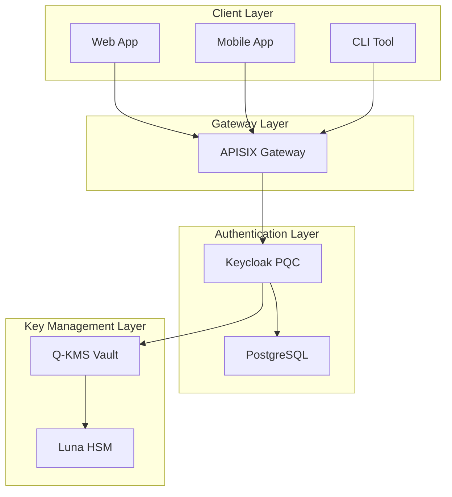
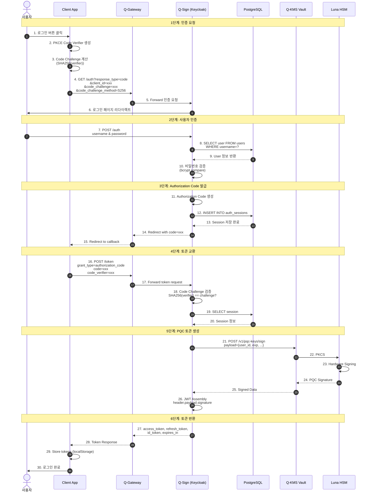
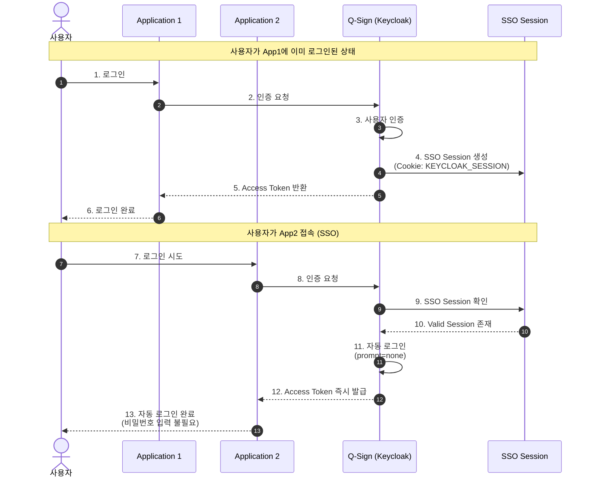
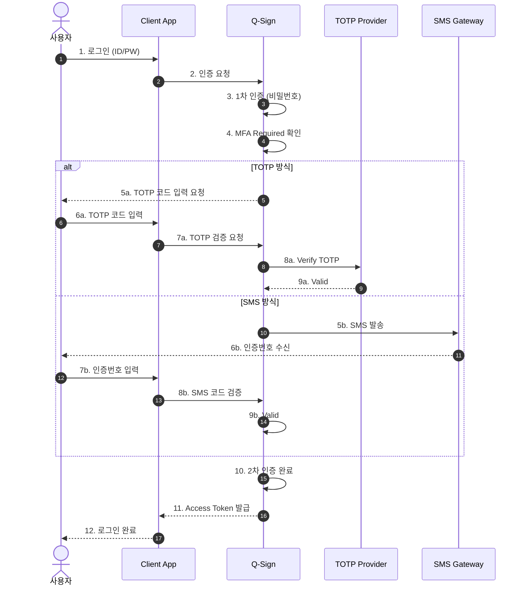
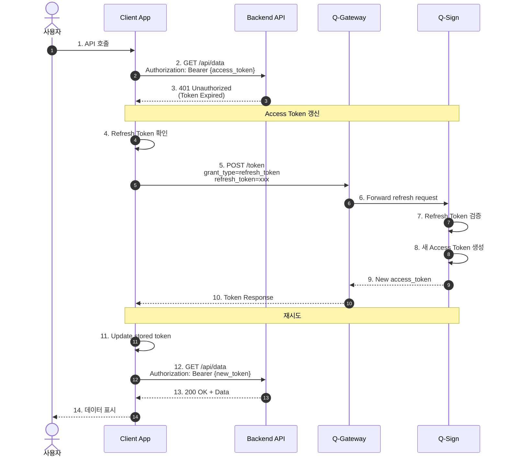
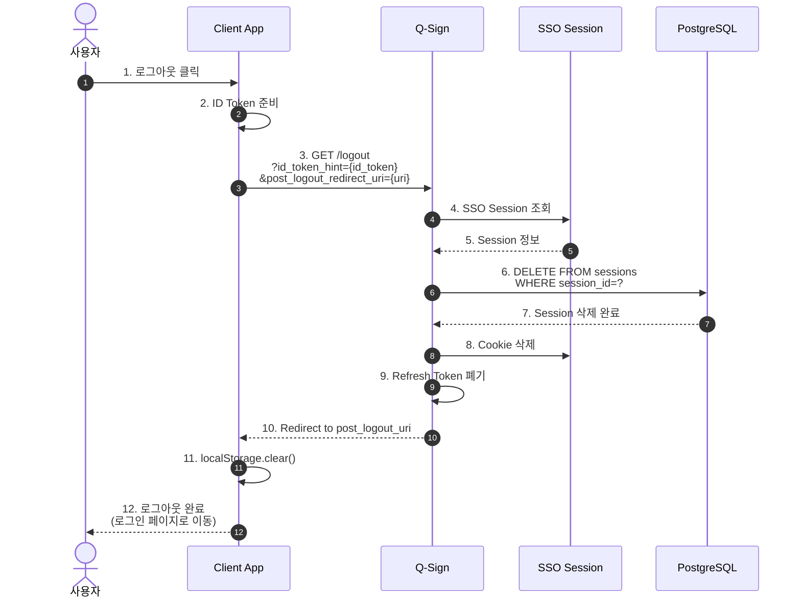
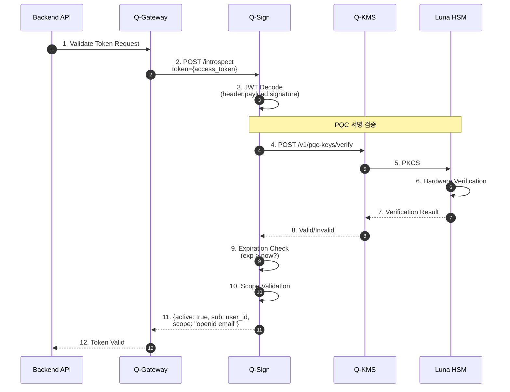
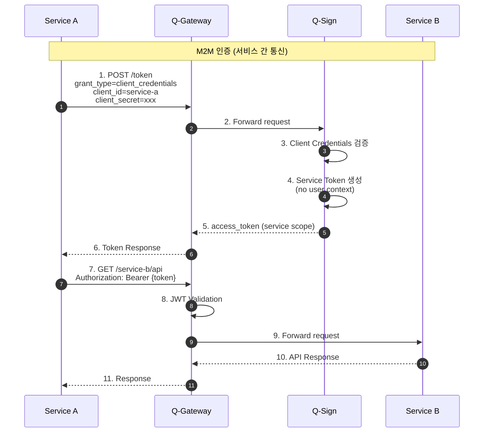
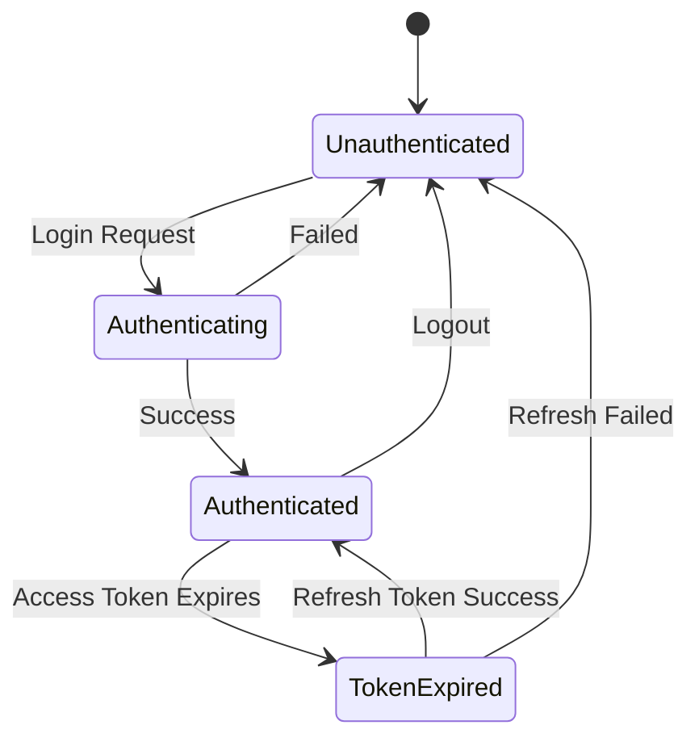

# 인증 플로우 시퀀스 다이어그램

## 🔐 전체 인증 아키텍처

## 1. OIDC 인증 플로우 (Authorization Code Flow with PKCE)

## 2. SSO (Single Sign-On) 플로우

## 3. MFA (Multi-Factor Authentication) 플로우

## 4. Refresh Token 플로우

## 5. Logout 플로우

## 6. Token Introspection (토큰 검증)

## 7. Client Credentials Flow (Machine-to-Machine)

## 📊 인증 상태 다이어그램

## 🔑 토큰 타입

### Access Token
- **용도**: API 접근 권한
- **유효기간**: 5분 ~ 30분
- **형식**: PQC JWT (DILITHIUM3 서명)

### Refresh Token
- **용도**: Access Token 갱신
- **유효기간**: 30일
- **형식**: Opaque Token (UUID)

### ID Token
- **용도**: 사용자 정보 전달
- **유효기간**: Access Token과 동일
- **형식**: Standard JWT (RS256 or PQC)

---

**Last Updated**: 2025-11-16
**Version**: 1.0.0
**Protocol**: OIDC/OAuth 2.0 + PQC
