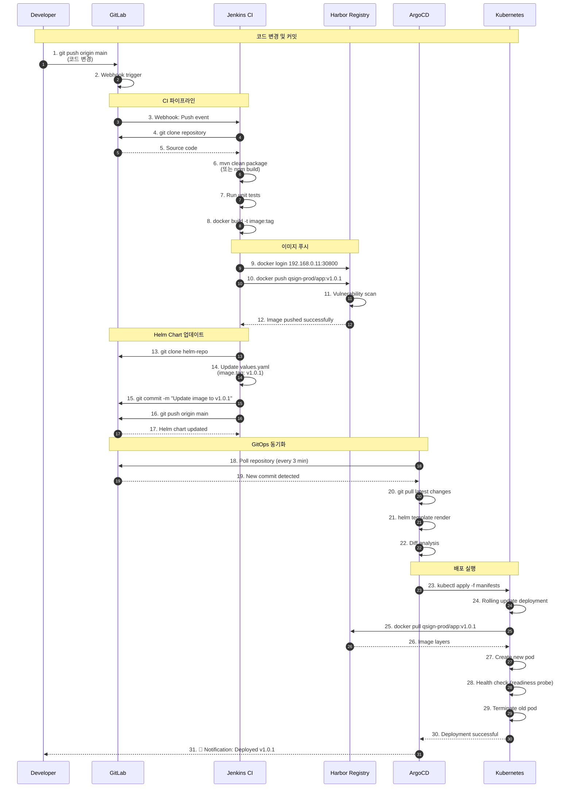
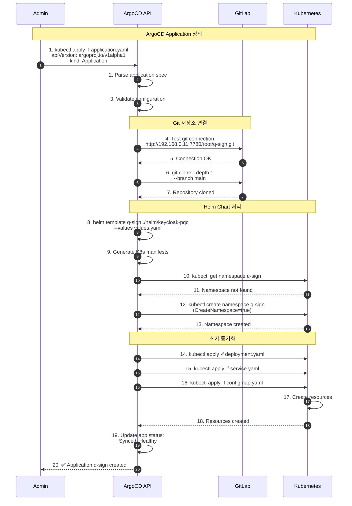
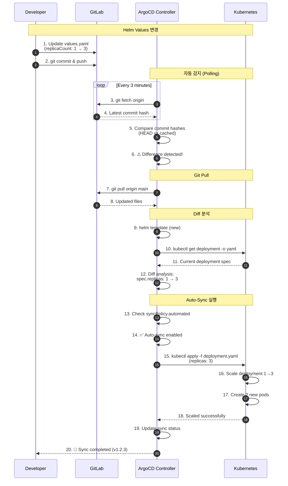
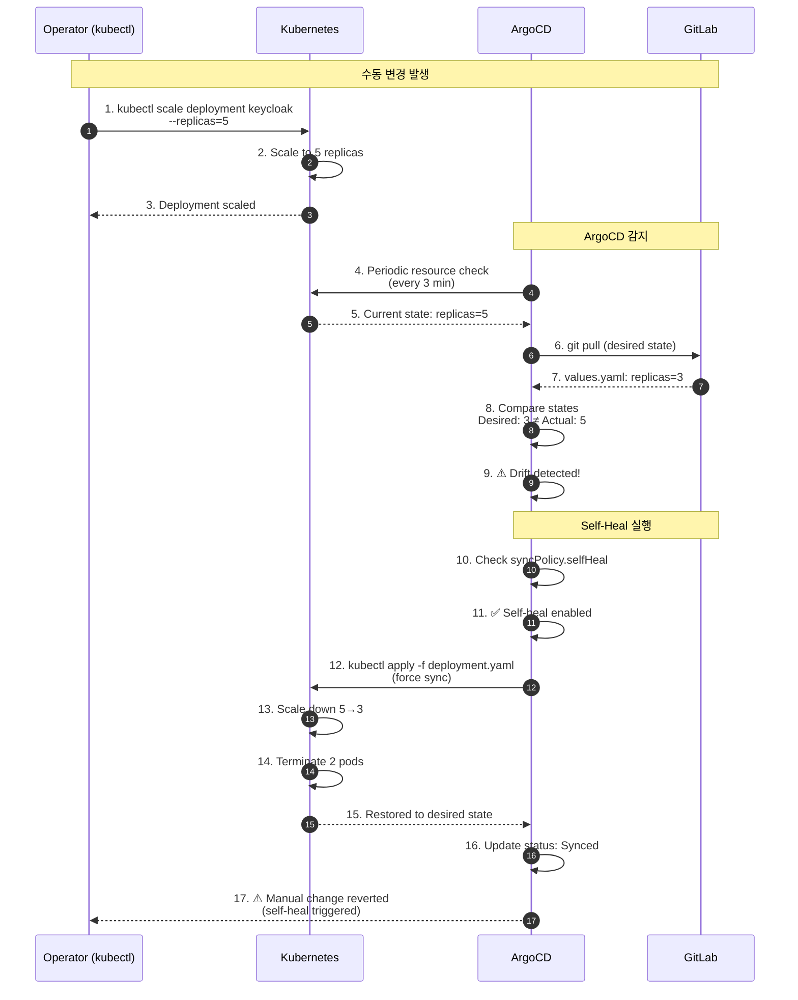
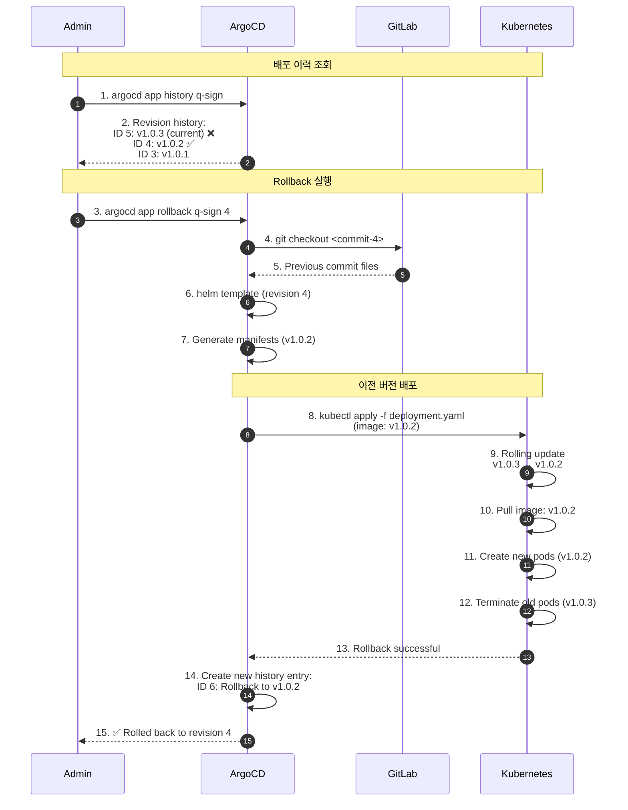
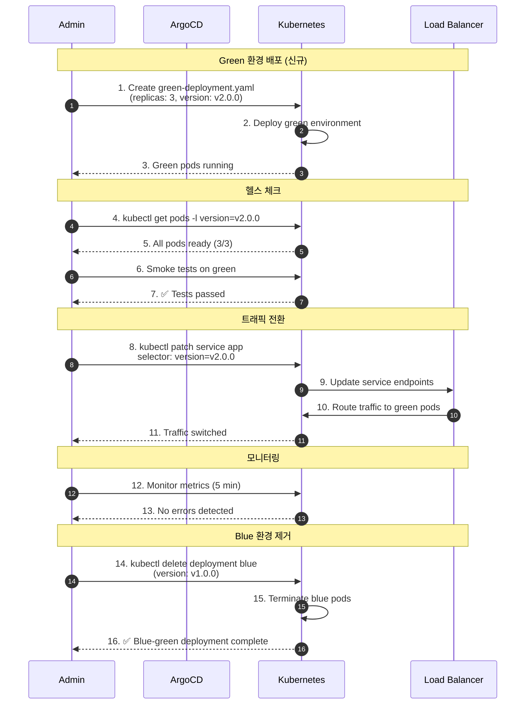
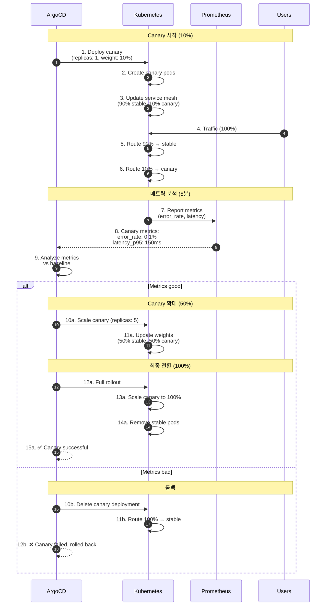
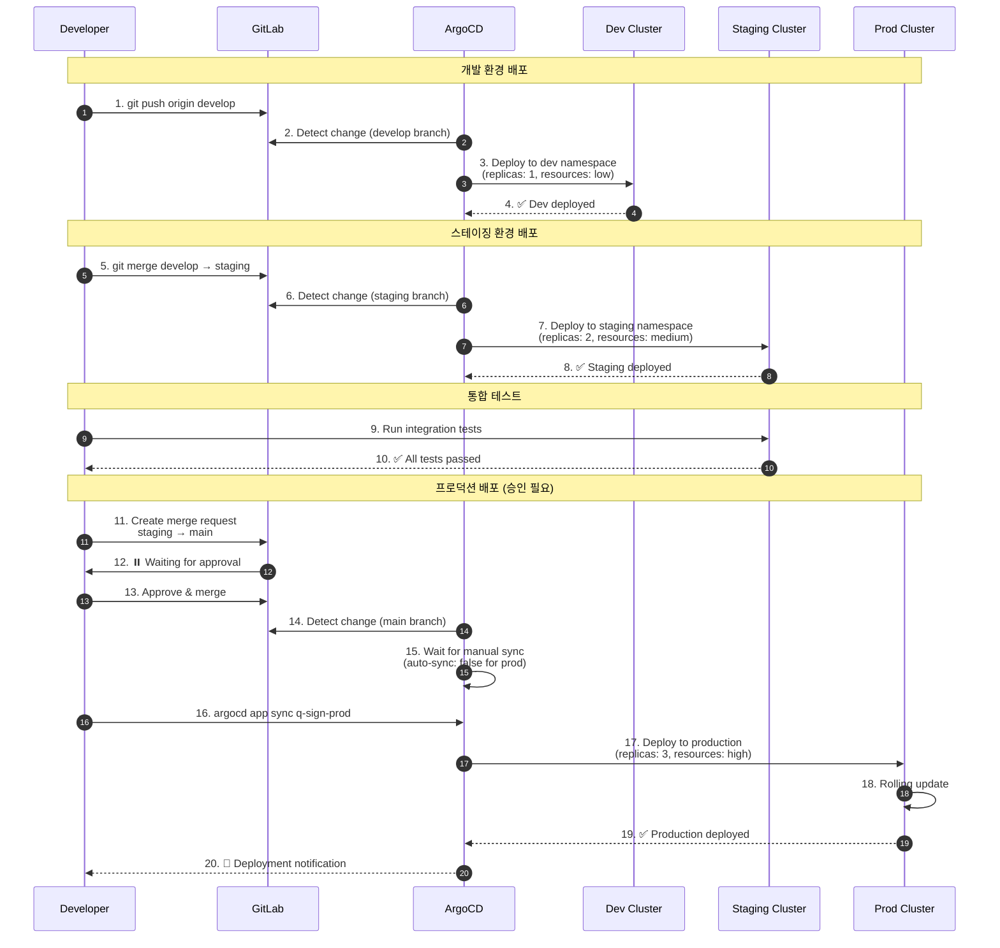
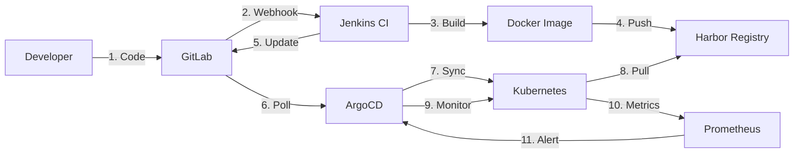

# GitOps 배포 플로우 시퀀스 다이어그램

## 1. 전체 CI/CD 파이프라인



## 2. ArgoCD Application 생성



## 3. Auto-Sync 동기화



## 4. Self-Heal (자동 복구)



## 5. Rollback (이전 버전 복원)



## 6. Blue-Green 배포



## 7. Canary 배포



## 8. Multi-Environment 배포



## 🔄 GitOps 워크플로우 다이어그램



## 📊 배포 전략 비교

| 전략 | 다운타임 | 리소스 사용 | 롤백 속도 | 위험도 | 사용 사례 |
|------|----------|-------------|-----------|---------|-----------|
| Rolling Update | 없음 | 낮음 | 중간 | 중간 | 일반 배포 |
| Blue-Green | 없음 | 높음 (2배) | 빠름 | 낮음 | 중요 배포 |
| Canary | 없음 | 중간 | 빠름 | 낮음 | 신규 기능 |
| Recreate | 있음 | 낮음 | 느림 | 높음 | 개발 환경 |

## ⚙️ ArgoCD Sync 옵션

```yaml
syncPolicy:
  automated:
    prune: true           # 불필요한 리소스 삭제
    selfHeal: true        # 수동 변경 자동 복구
    allowEmpty: false     # 빈 커밋 허용 안함
  syncOptions:
    - CreateNamespace=true
    - PrunePropagationPolicy=foreground
    - PruneLast=true
  retry:
    limit: 5
    backoff:
      duration: 5s
      factor: 2
      maxDuration: 3m
```

---

**Last Updated**: 2025-11-16
**Version**: 1.0.0
**GitOps Tool**: ArgoCD 3.2.0
