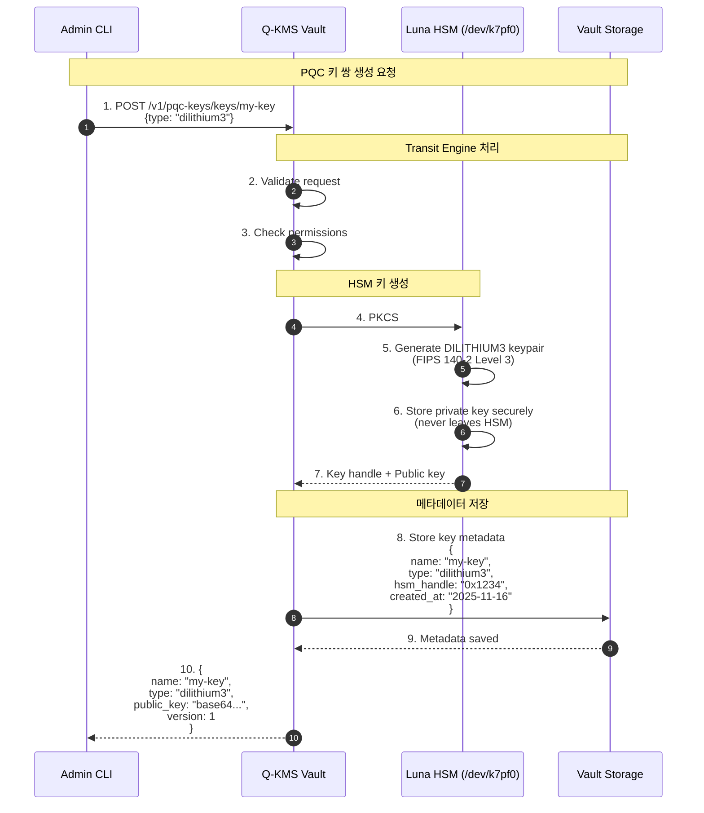
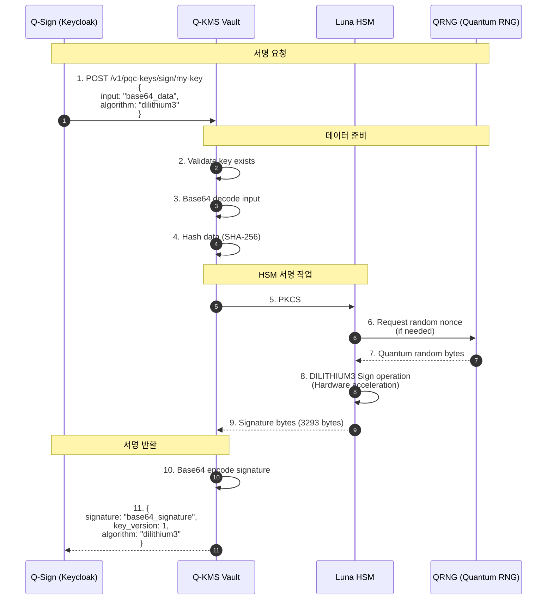
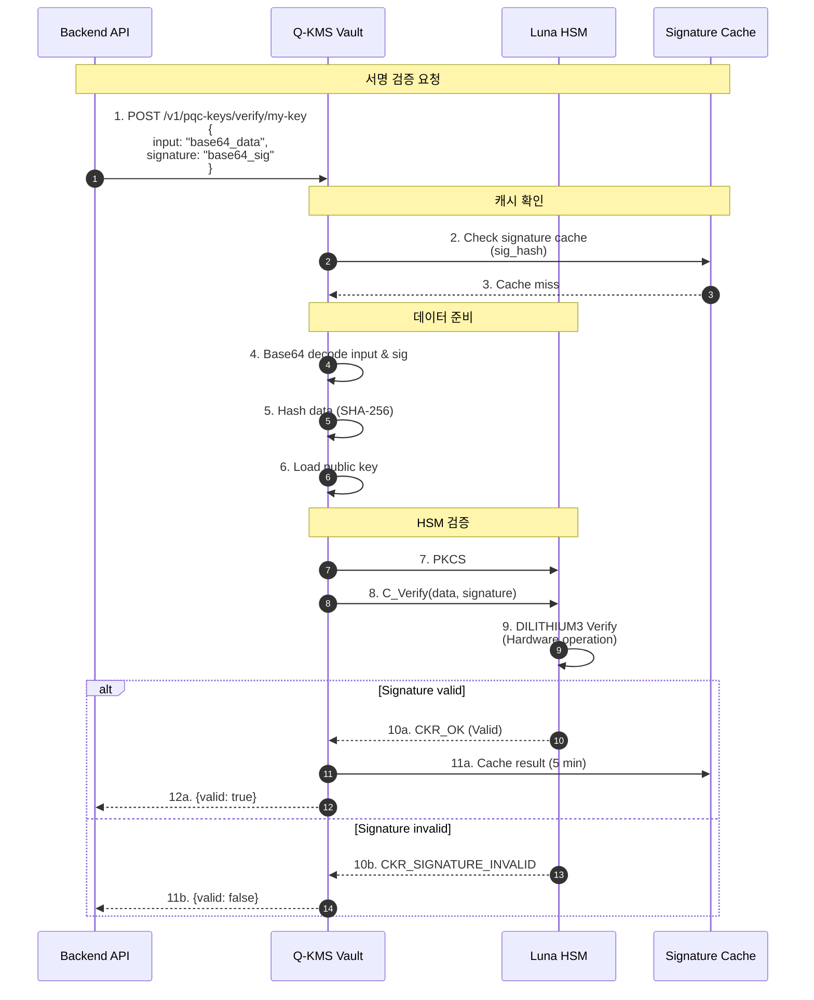
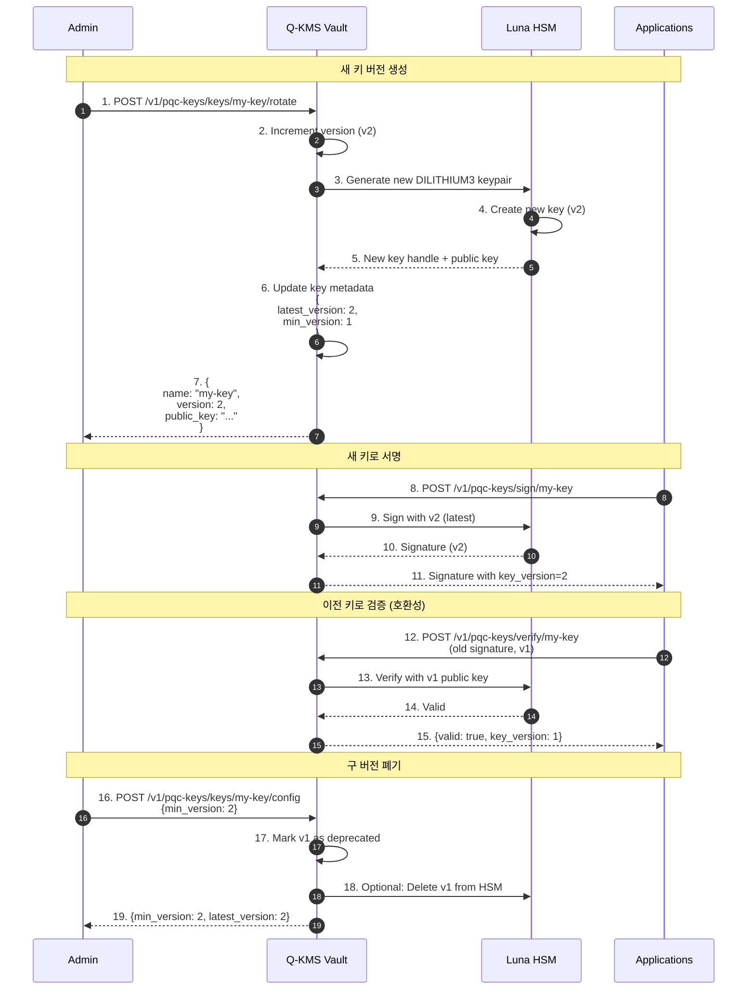
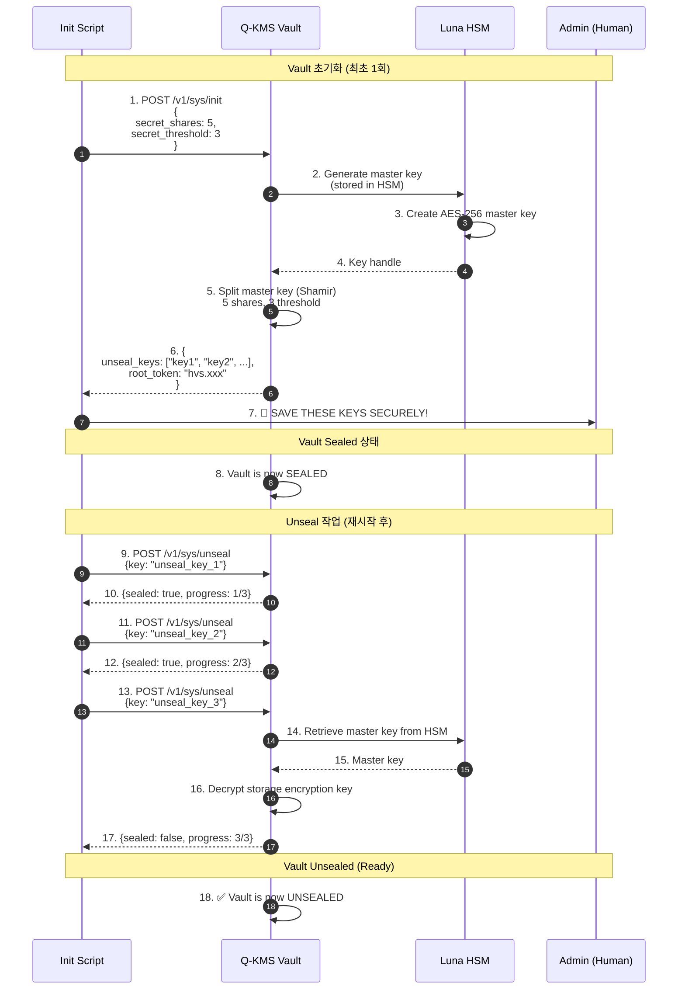
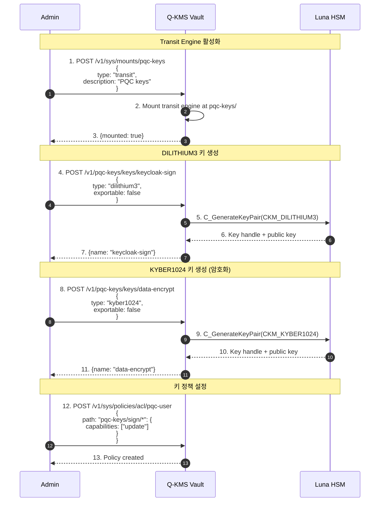
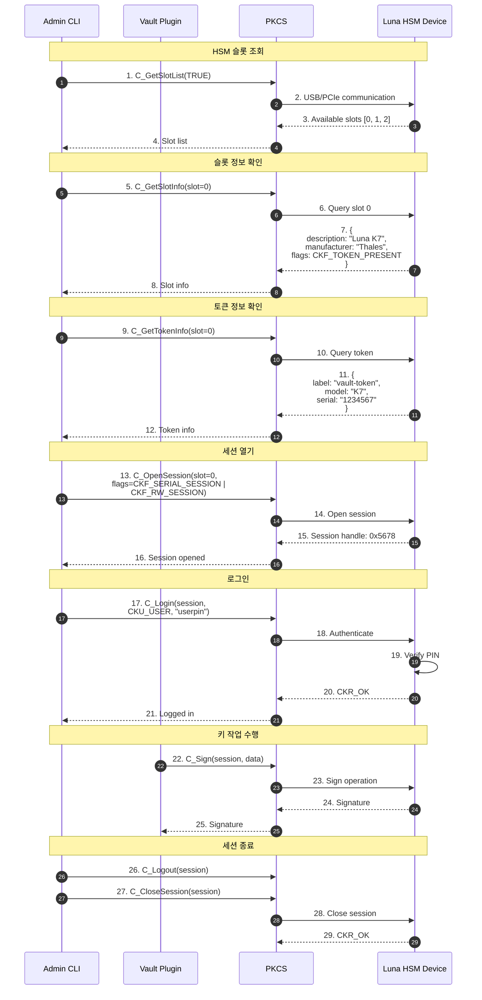
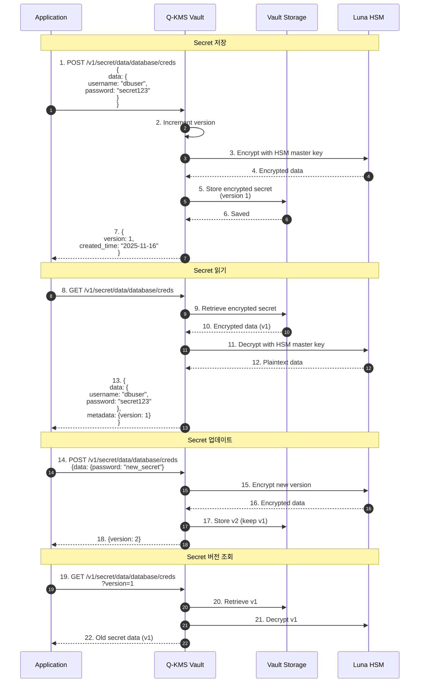

# 키 관리 시퀀스 다이어그램

## 1. PQC 키 생성 플로우 (Luna HSM)



## 2. PQC 서명 생성 플로우



## 3. PQC 서명 검증 플로우



## 4. 키 회전 (Key Rotation) 플로우



## 5. Vault 초기화 및 Unseal



## 6. Transit Engine 설정



## 7. HSM 슬롯 관리



## 8. 비밀 키 관리 (KV Secret Engine)



## 🔐 HSM 키 타입

| Algorithm | Key Size | Use Case | NIST Standard |
|-----------|----------|----------|---------------|
| DILITHIUM3 | Public: 1952B<br/>Private: 4000B<br/>Signature: 3293B | Digital Signature | FIPS 204 |
| KYBER1024 | Public: 1568B<br/>Private: 3168B<br/>Ciphertext: 1568B | Key Encapsulation | FIPS 203 |
| SPHINCS+ | Varies | Stateless Signature | FIPS 205 |

## 🏗️ Vault Storage Layout

```
/vault/data/
├── logical/
│   ├── pqc-keys/          # Transit Engine
│   │   ├── policy/
│   │   │   ├── keycloak-sign
│   │   │   └── data-encrypt
│   │   └── archive/       # Old key versions
│   └── secret/            # KV v2 Engine
│       └── database/
│           └── creds      # Encrypted secrets
└── sys/
    ├── policy/            # ACL Policies
    └── mounts/            # Engine mounts
```

## ⚙️ PKCS#11 메커니즘

```c
// DILITHIUM3 서명
CK_MECHANISM mechanism = {
    .mechanism = CKM_DILITHIUM3,
    .pParameter = NULL,
    .ulParameterLen = 0
};

// KYBER1024 암호화
CK_MECHANISM mechanism = {
    .mechanism = CKM_KYBER1024,
    .pParameter = NULL,
    .ulParameterLen = 0
};
```

---

**Last Updated**: 2025-11-16
**Version**: 1.0.0
**HSM**: Luna K7 (FIPS 140-2 Level 3)
