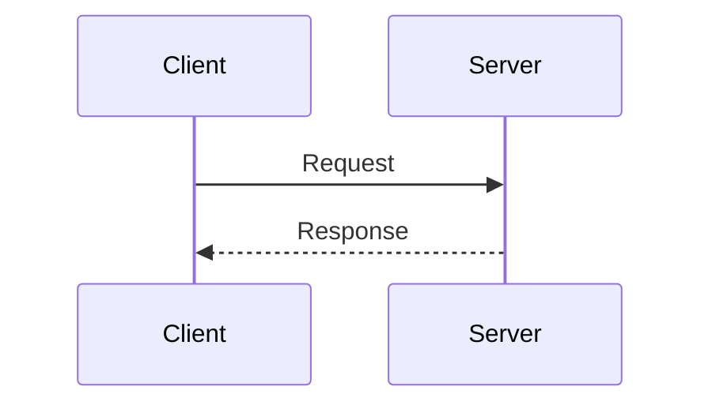

# 시퀀스 다이어그램

QSIGN 시스템의 주요 프로세스 플로우를 시각화한 시퀀스 다이어그램입니다.

## 📖 문서 목록

- [SEQUENCE-DIAGRAMS.md](./SEQUENCE-DIAGRAMS.md) - 전체 시퀀스 다이어그램
- [AUTH-FLOW.md](./AUTH-FLOW.md) - 인증 플로우
- [TOKEN-LIFECYCLE.md](./TOKEN-LIFECYCLE.md) - 토큰 라이프사이클
- [KEY-MANAGEMENT.md](./KEY-MANAGEMENT.md) - 키 관리 플로우
- [DEPLOYMENT-FLOW.md](./DEPLOYMENT-FLOW.md) - 배포 플로우

## 🔄 주요 플로우

### 1. 사용자 인증
- OIDC/OAuth 2.0 인증
- PQC 토큰 발급
- Hybrid 서명 처리

### 2. 토큰 관리
- JWT 발급 및 검증
- 토큰 갱신 (Refresh)
- 토큰 폐기 (Revocation)

### 3. 키 관리
- PQC 키 생성
- Luna HSM 통합
- Vault Transit Engine

### 4. GitOps 배포
- Git Push → ArgoCD Sync
- Kubernetes Rolling Update
- Health Check & Monitoring

## 🎨 다이어그램 형식

모든 다이어그램은 **Mermaid** 형식으로 작성되어 있습니다.

## 🔗 관련 문서

- [아키텍처 개요](../01-architecture/ARCHITECTURE-OVERVIEW.md)
- [시스템 컴포넌트](../00-overview/SYSTEM-COMPONENTS.md)
- [GitOps 배포](../03-deployment/GITOPS-DEPLOYMENT.md)
