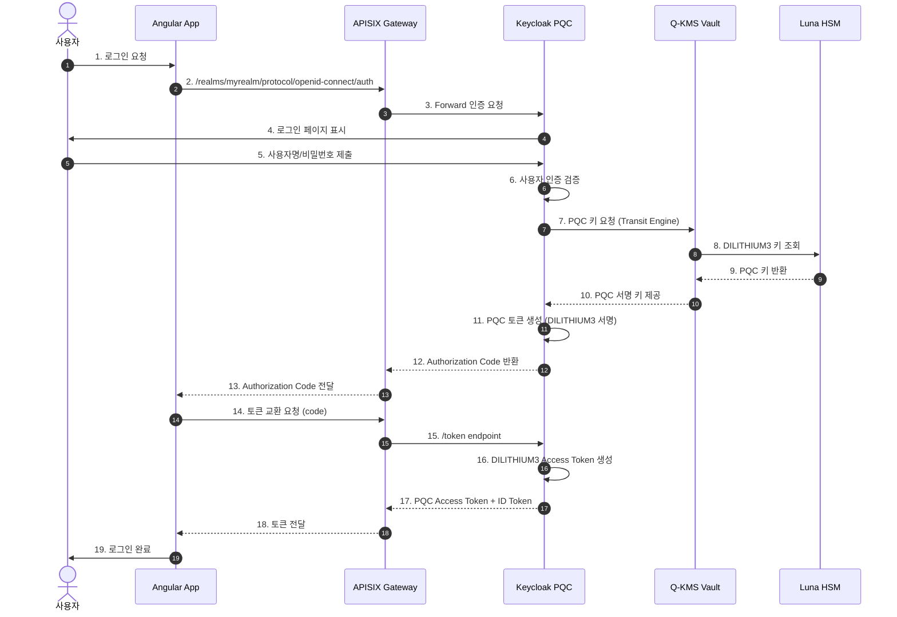
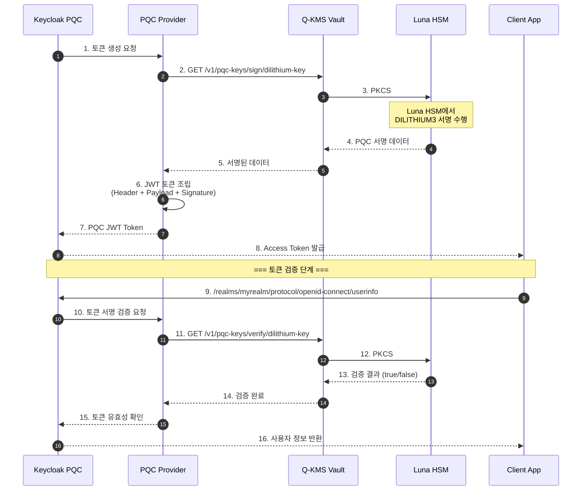
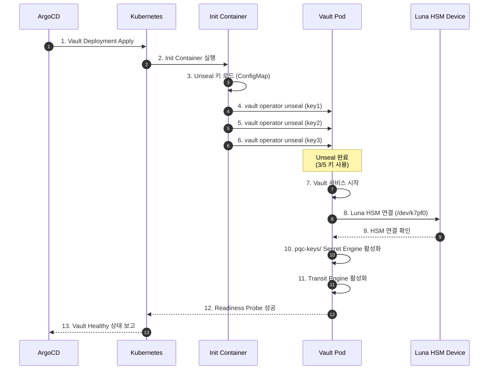
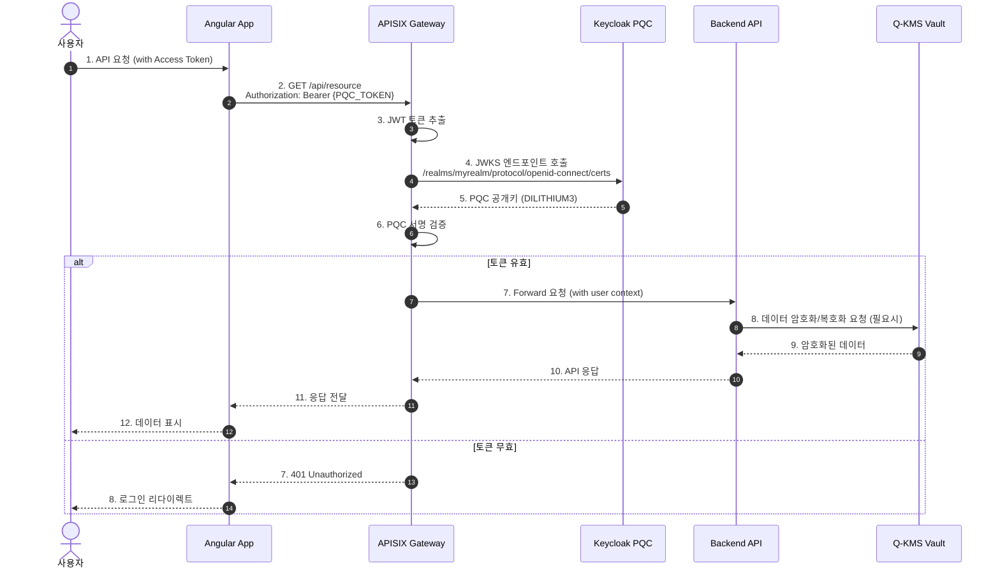
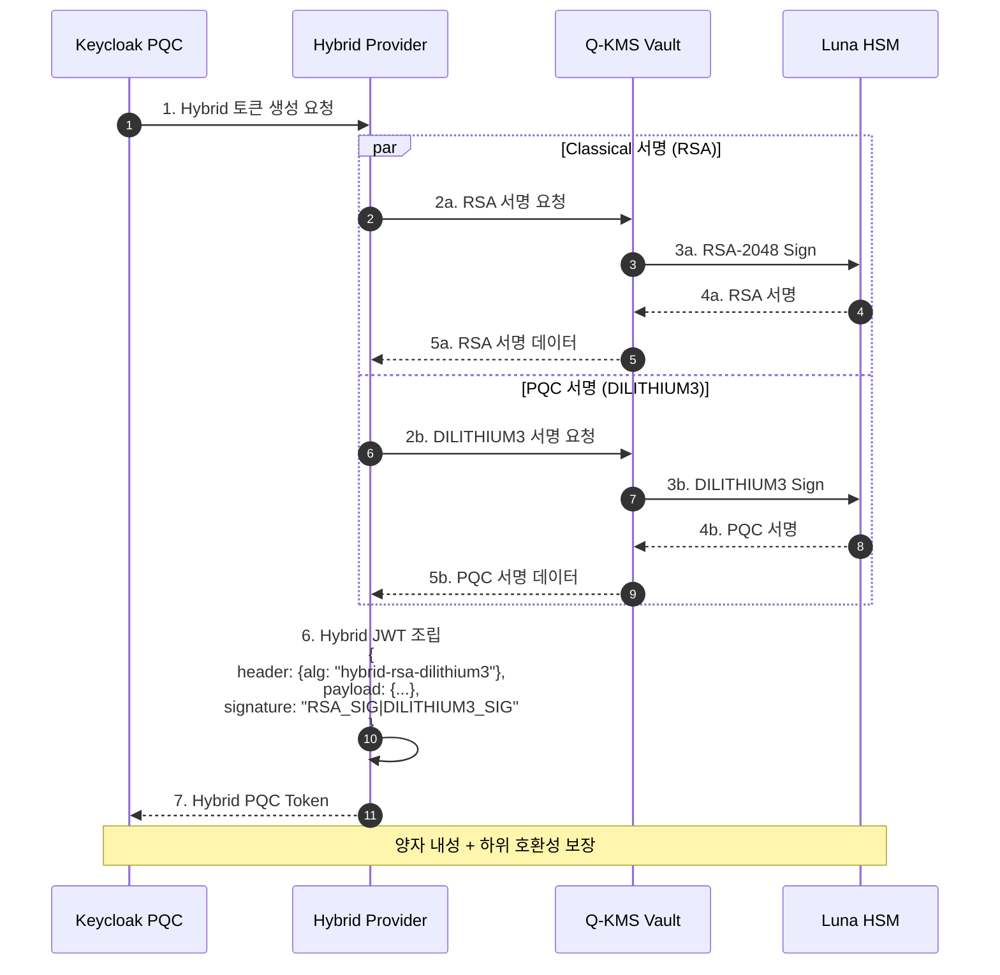
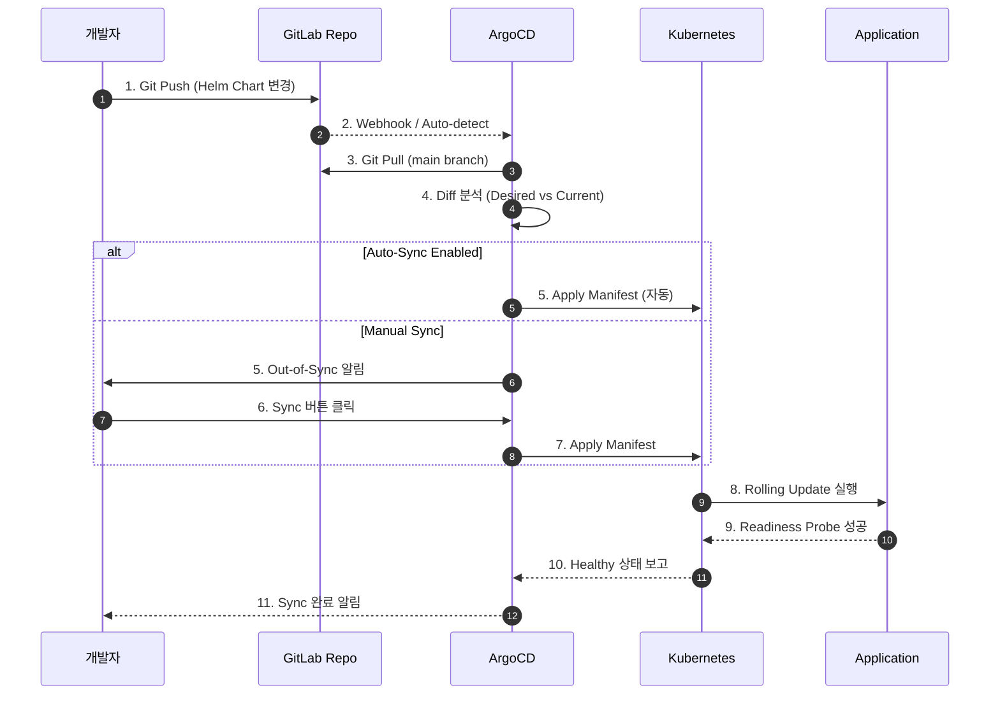
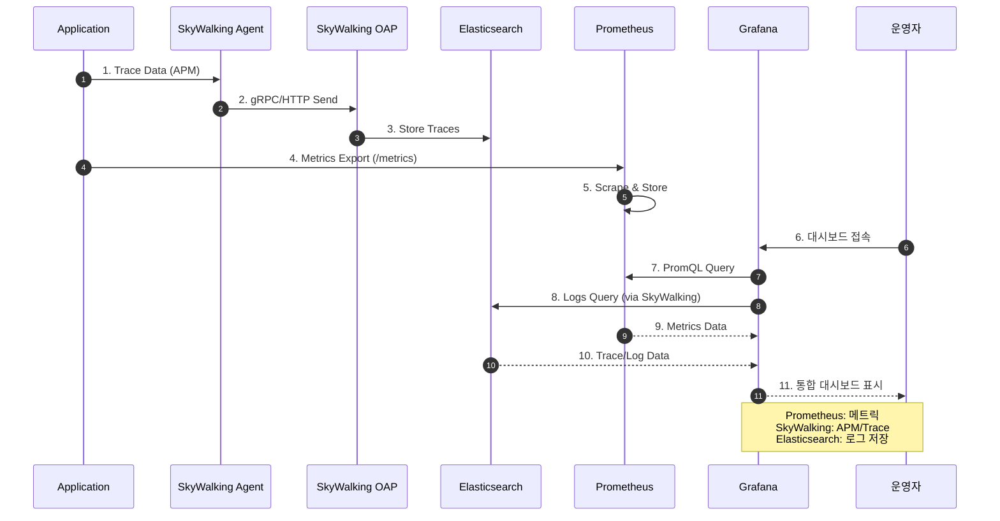

# Q-SIGN 시퀀스 다이어그램

> Post-Quantum Cryptography 기반 SSO 인증 시스템의 주요 플로우

## 📑 시퀀스 다이어그램 카탈로그

### 인증 플로우
- **[AUTH-FLOW.md](AUTH-FLOW.md)** - 상세 인증 플로우 (7개 다이어그램)
  - OIDC 인증 플로우 (Authorization Code with PKCE)
  - SSO (Single Sign-On) 플로우
  - MFA (Multi-Factor Authentication) 플로우
  - Refresh Token 플로우
  - Logout 플로우
  - Token Introspection 플로우
  - Client Credentials Flow (M2M)

### 토큰 관리
- **[TOKEN-LIFECYCLE.md](TOKEN-LIFECYCLE.md)** - 토큰 라이프사이클 (7개 다이어그램)
  - Access Token 생성 플로우
  - Refresh Token 플로우
  - Token Revocation (토큰 폐기)
  - Token Validation (검증)
  - Token Expiration & Auto-Renewal
  - Hybrid Token Generation (RSA + PQC)
  - Session Management & Token Binding

### 키 관리
- **[KEY-MANAGEMENT.md](KEY-MANAGEMENT.md)** - PQC 키 관리 (8개 다이어그램)
  - PQC 키 생성 플로우 (Luna HSM)
  - PQC 서명 생성 플로우
  - PQC 서명 검증 플로우
  - 키 회전 (Key Rotation)
  - Vault 초기화 및 Unseal
  - Transit Engine 설정
  - HSM 슬롯 관리
  - 비밀 키 관리 (KV Secret Engine)

### 배포 관리
- **[DEPLOYMENT-FLOW.md](DEPLOYMENT-FLOW.md)** - GitOps 배포 플로우 (8개 다이어그램)
  - 전체 CI/CD 파이프라인
  - ArgoCD Application 생성
  - Auto-Sync 동기화
  - Self-Heal (자동 복구)
  - Rollback (이전 버전 복원)
  - Blue-Green 배포
  - Canary 배포
  - Multi-Environment 배포

---

## 💡 빠른 시작 다이어그램

이 문서에는 QSIGN 시스템의 핵심 플로우를 이해하기 위한 기본 시퀀스 다이어그램이 포함되어 있습니다. 더 상세한 플로우는 위 카탈로그의 전용 문서를 참조하세요.

## 1. 사용자 인증 플로우 (PQC SSO)

## 2. PQC 토큰 발급 및 검증 플로우

## 3. Q-KMS Vault 초기화 및 Unseal 플로우

## 4. API Gateway를 통한 보호된 리소스 접근

## 5. Hybrid 서명 플로우 (RSA + DILITHIUM3)

## 6. ArgoCD GitOps 배포 플로우

## 7. 모니터링 및 로깅 플로우

## 📊 다이어그램 범례

### 주요 컴포넌트
- **Keycloak PQC**: PQC SSO 인증 서버 (Namespace: pqc-sso)
- **Q-KMS Vault**: Vault + Luna HSM (Namespace: q-kms)
- **APISIX Gateway**: API Gateway (Namespace: qsign-prod)
- **Luna HSM**: 하드웨어 보안 모듈 (/dev/k7pf0)

### 프로토콜
- **PKCS#11**: HSM 통신 프로토콜
- **OIDC**: OpenID Connect (OAuth 2.0 기반)
- **gRPC**: SkyWalking 통신
- **HTTP/REST**: API 통신

### 엔드포인트
- **Keycloak**: http://192.168.0.11:30699
- **Q-KMS Vault**: http://192.168.0.11:30820
- **APISIX Gateway**: http://192.168.0.11:32236
- **Grafana**: http://192.168.0.11:30030

---

**Last Updated**: 2025-11-16
**Version**: 1.0.0
