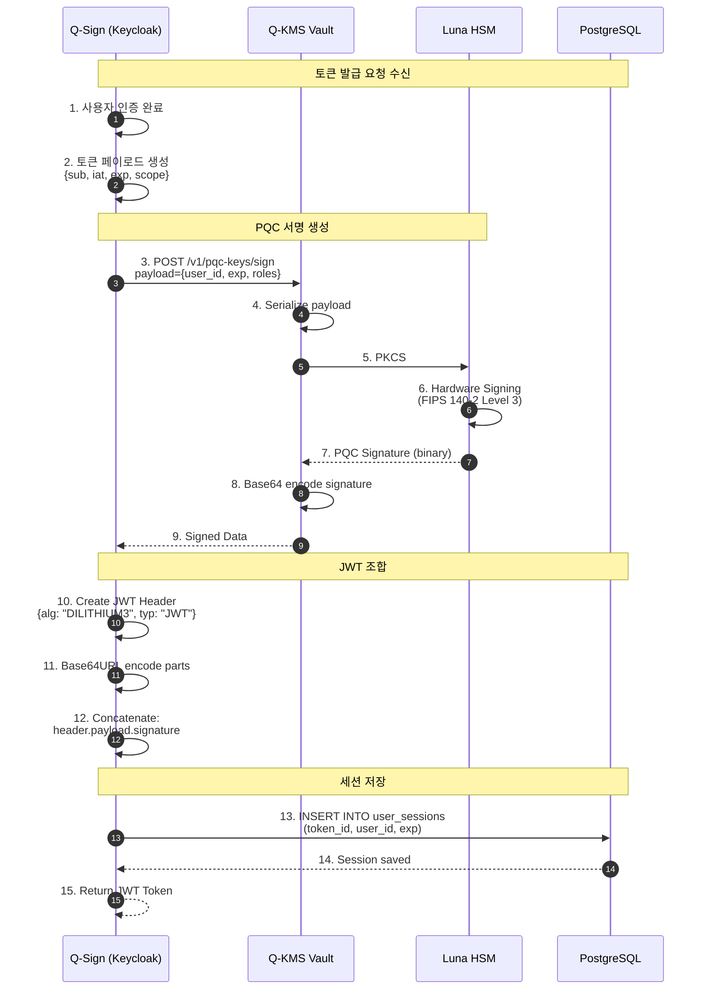
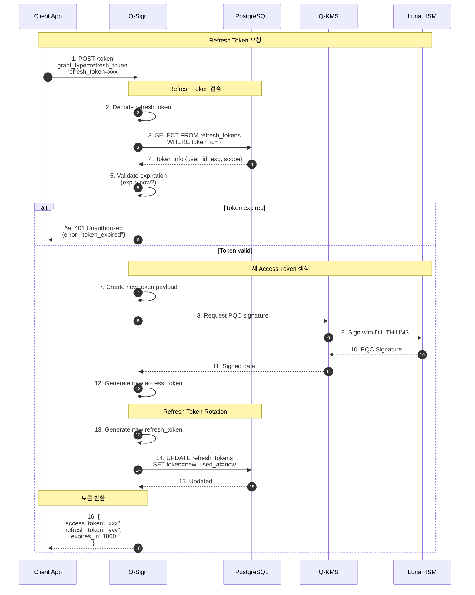
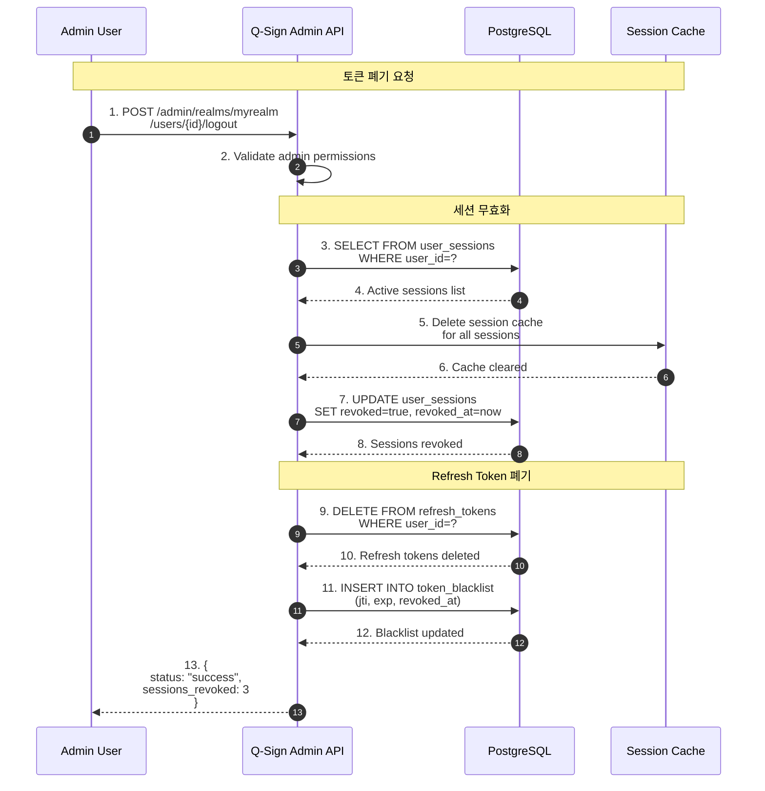
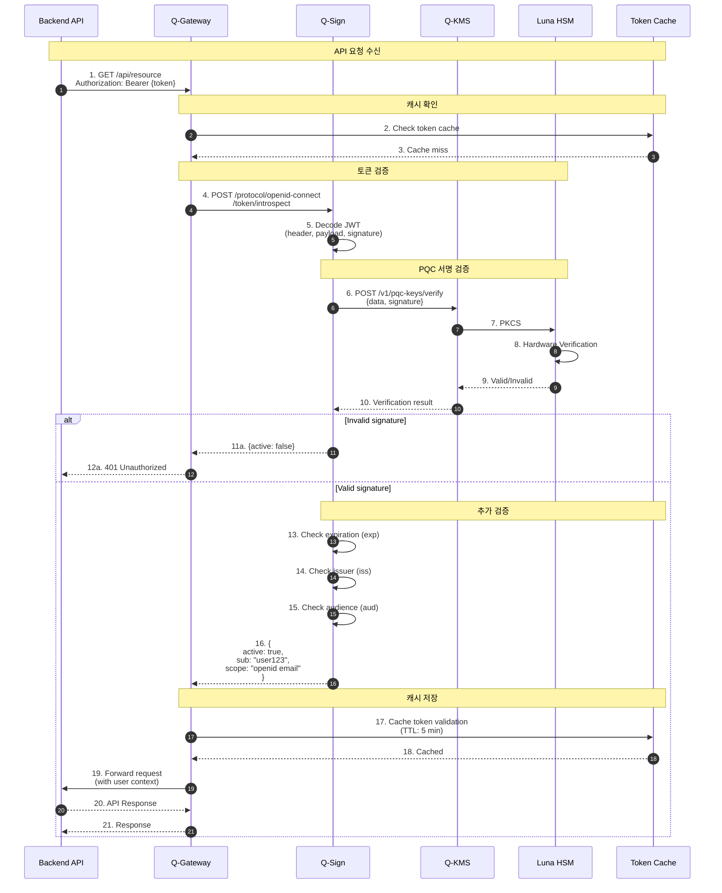
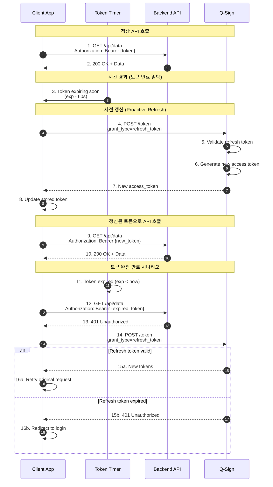
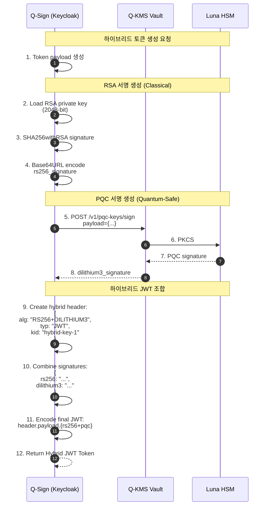
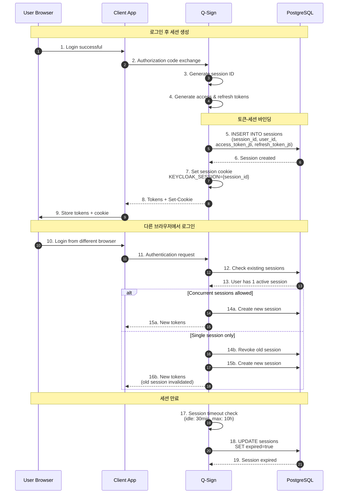
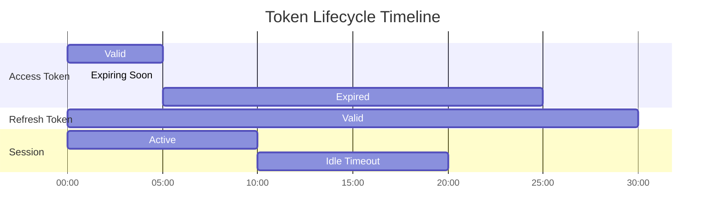

# 토큰 라이프사이클 시퀀스 다이어그램

## 1. Access Token 생성 플로우



## 2. Refresh Token 플로우



## 3. Token Revocation (토큰 폐기)



## 4. Token Validation (검증)



## 5. Token Expiration & Auto-Renewal



## 6. Hybrid Token Generation (RSA + PQC)



## 7. Session Management & Token Binding



## 📊 토큰 타임라인



## 🔑 토큰 구조

### Access Token (PQC JWT)
```json
{
  "header": {
    "alg": "DILITHIUM3",
    "typ": "JWT",
    "kid": "pqc-key-1"
  },
  "payload": {
    "sub": "user-uuid-123",
    "iat": 1700000000,
    "exp": 1700001800,
    "iss": "http://192.168.0.11:30181/realms/myrealm",
    "aud": "account",
    "scope": "openid email profile",
    "azp": "app-client",
    "session_state": "session-uuid-456"
  },
  "signature": "dilithium3_signature_base64url"
}
```

### Refresh Token (Opaque)
```json
{
  "id": "refresh-uuid-789",
  "user_id": "user-uuid-123",
  "client_id": "app-client",
  "iat": 1700000000,
  "exp": 1702592000,
  "scope": "openid email profile offline_access"
}
```

## ⏱️ 토큰 타임 설정

| Token Type | Default Lifetime | Configurable |
|------------|------------------|--------------|
| Access Token | 5분 - 30분 | ✅ |
| Refresh Token | 30일 | ✅ |
| ID Token | Access Token과 동일 | ✅ |
| Session (SSO) | 10시간 | ✅ |
| Idle Timeout | 30분 | ✅ |

---

**Last Updated**: 2025-11-16
**Version**: 1.0.0
**Token Algorithm**: DILITHIUM3 (PQC)
