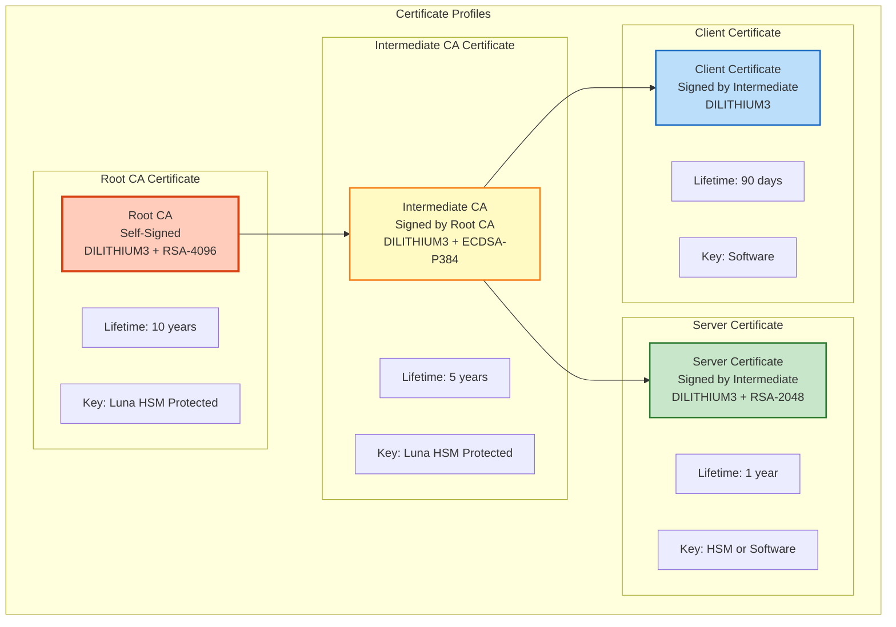
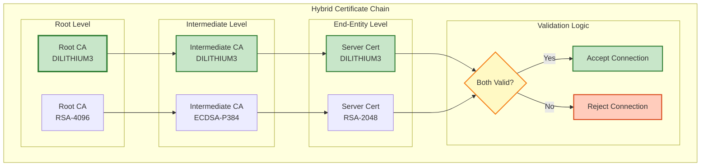
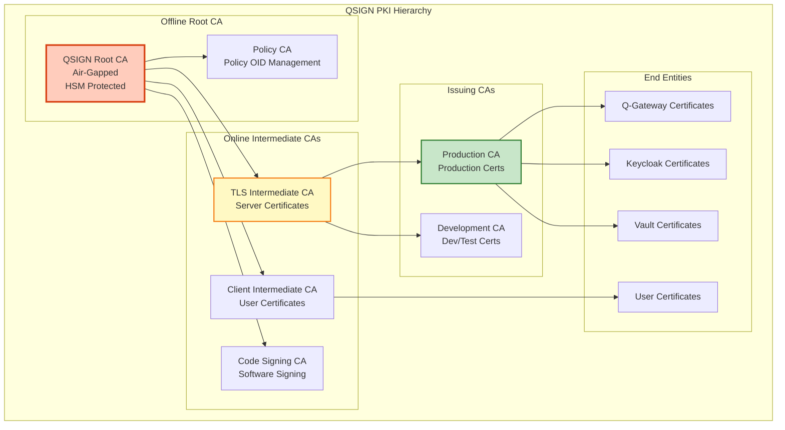
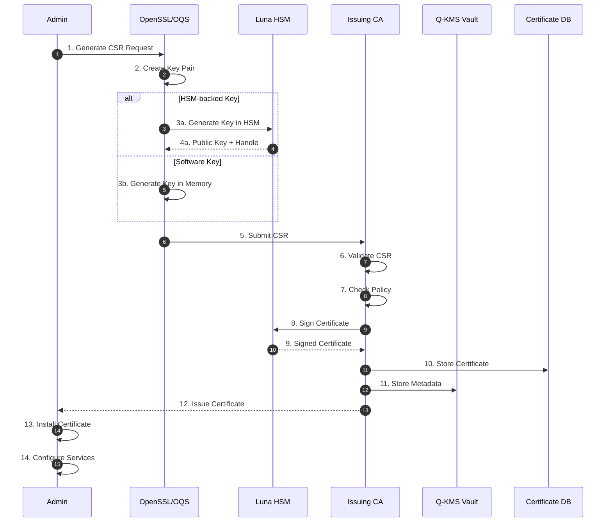
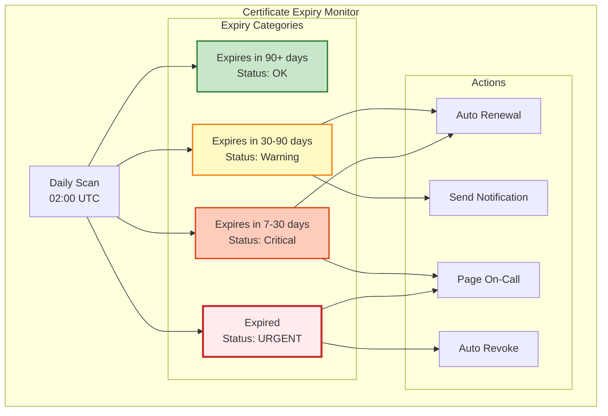
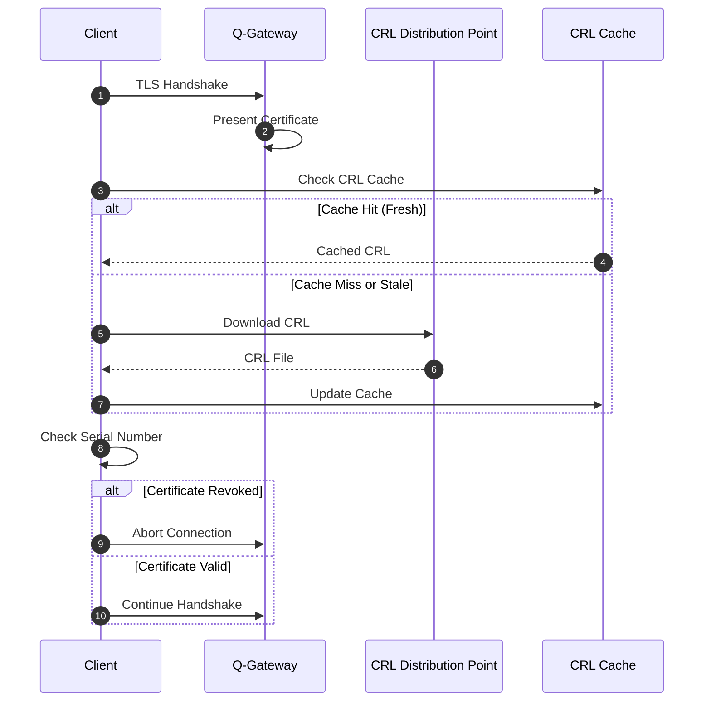
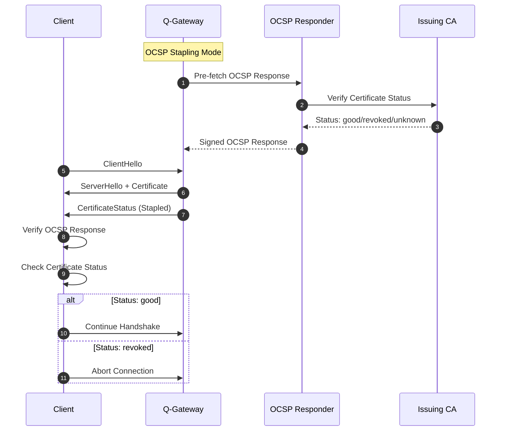
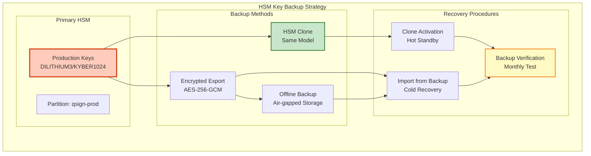
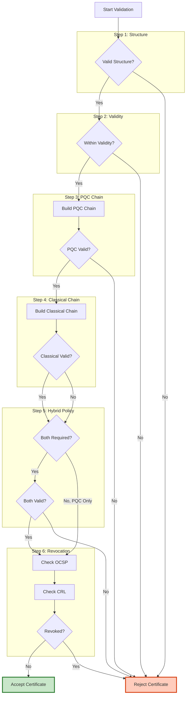

# 인증서 관리 (Certificate Management)

## 📘 개요

Q-TLS에서 사용하는 PQC 인증서 관리 시스템에 대한 상세 문서입니다. X.509v3 표준을 기반으로 하이브리드 인증서 체인(Classical + PQC) 구조를 구현하며, Luna HSM을 통한 안전한 키 보호를 제공합니다.

## 🔐 PQC 인증서 구조

### X.509v3 확장

```yaml
X.509v3 Certificate Structure:
  Version: 3 (X.509v3)
  Serial Number: 0x1A2B3C4D5E6F7890

  Signature Algorithm:
    Primary: dilithium3WithSHA384
    Fallback: rsaEncryption (Hybrid Mode)

  Issuer:
    CN: QSIGN Root CA
    O: Q-Sign Corporation
    C: KR
    OU: PQC Certificate Authority

  Validity:
    Not Before: 2025-01-01 00:00:00 UTC
    Not After: 2026-01-01 00:00:00 UTC

  Subject:
    CN: q-gateway.qsign.local
    O: Q-Sign Corporation
    OU: Q-TLS Services

  Subject Public Key Info:
    Algorithm: dilithium3
    Public Key: (1952 bytes)

  Extensions:
    X509v3 Key Usage: critical
      - Digital Signature
      - Key Encipherment
      - Data Encipherment

    X509v3 Extended Key Usage:
      - TLS Web Server Authentication
      - TLS Web Client Authentication

    X509v3 Subject Alternative Name:
      - DNS:q-gateway.qsign.local
      - DNS:*.qsign.local
      - IP:192.168.1.100

    X509v3 Basic Constraints: critical
      CA: FALSE

    # PQC 전용 확장
    PQC Algorithm Info: (OID 1.3.6.1.4.1.2.267.7.4.4)
      Algorithm: DILITHIUM3
      Security Level: NIST Level 3
      FIPS: 204

    Hybrid Certificate Info: (OID 1.3.6.1.4.1.2.267.12.4.1)
      Hybrid Mode: Enabled
      Classical Algorithm: RSA-4096
      PQC Algorithm: DILITHIUM3
      Validation Policy: Require Both
```

### 인증서 프로파일



## 🔗 하이브리드 인증서 체인

### Classical + PQC 조합



### 체인 검증 프로세스

```yaml
Certificate Chain Validation:

  Step 1: Path Building
    - Build chain from end-entity to root
    - Include both PQC and classical chains
    - Verify chain completeness

  Step 2: Signature Verification
    PQC Chain:
      - Verify DILITHIUM3 signatures
      - Check NIST FIPS 204 compliance
      - Validate public key parameters

    Classical Chain:
      - Verify RSA/ECDSA signatures
      - Check key size requirements
      - Validate algorithm compatibility

  Step 3: Validity Period
    - Check notBefore and notAfter
    - Verify current time is within validity
    - Check for early renewal (90 days before expiry)

  Step 4: Revocation Status
    - Check CRL (Certificate Revocation List)
    - Query OCSP (Online Certificate Status Protocol)
    - Verify stapled OCSP response

  Step 5: Policy Validation
    - Verify certificate policies
    - Check extended key usage
    - Validate subject alternative names

  Step 6: Hybrid Validation
    - Require both chains to be valid
    - Fail if either chain is invalid
    - Log validation results
```

## 🏛️ CA (Certificate Authority) 구성

### CA 계층 구조



### CA 설정

```yaml
Root CA Configuration:
  CommonName: "QSIGN Root CA"
  KeyType: DILITHIUM3 + RSA-4096
  Validity: 3650 days (10 years)
  Storage: Luna HSM (Air-gapped)
  Policy:
    - Any Policy: 2.5.29.32.0
    - QSIGN Policy: 1.3.6.1.4.1.999999.1.1

  Constraints:
    pathLenConstraint: 2
    CA: TRUE
    Critical: TRUE

Intermediate CA Configuration:
  CommonName: "QSIGN TLS Intermediate CA"
  KeyType: DILITHIUM3 + ECDSA-P384
  Validity: 1825 days (5 years)
  Storage: Luna HSM (Online)

  Constraints:
    pathLenConstraint: 1
    CA: TRUE
    Critical: TRUE

  Extended Key Usage:
    - serverAuth (1.3.6.1.5.5.7.3.1)
    - clientAuth (1.3.6.1.5.5.7.3.2)

Issuing CA Configuration:
  CommonName: "QSIGN Production Issuing CA"
  KeyType: DILITHIUM3 + RSA-2048
  Validity: 730 days (2 years)
  Storage: Luna HSM (Online)

  Constraints:
    pathLenConstraint: 0
    CA: TRUE
```

## 📜 인증서 발급 프로세스

### OpenSSL + OQS 명령어

```bash
# 1. PQC 개인키 생성 (DILITHIUM3)
openssl genpkey \
  -algorithm dilithium3 \
  -out /etc/pki/private/server-dilithium3.key \
  -provider oqsprovider \
  -provider default

# 키 권한 설정
chmod 400 /etc/pki/private/server-dilithium3.key

# 2. 하이브리드 개인키 생성 (Classical RSA)
openssl genrsa -out /etc/pki/private/server-rsa.key 2048
chmod 400 /etc/pki/private/server-rsa.key

# 3. PQC CSR 생성
openssl req -new \
  -key /etc/pki/private/server-dilithium3.key \
  -out /etc/pki/csr/server-dilithium3.csr \
  -provider oqsprovider \
  -provider default \
  -subj "/C=KR/O=Q-Sign/OU=Q-TLS/CN=q-gateway.qsign.local" \
  -addext "subjectAltName=DNS:q-gateway.qsign.local,DNS:*.qsign.local"

# 4. Classical CSR 생성
openssl req -new \
  -key /etc/pki/private/server-rsa.key \
  -out /etc/pki/csr/server-rsa.csr \
  -subj "/C=KR/O=Q-Sign/OU=Q-TLS/CN=q-gateway.qsign.local" \
  -addext "subjectAltName=DNS:q-gateway.qsign.local,DNS:*.qsign.local"

# 5. OpenSSL CA 설정 파일 생성
cat > /etc/pki/ca/openssl-pqc.cnf << 'EOF'
[ ca ]
default_ca = CA_default

[ CA_default ]
dir               = /etc/pki/ca
certs             = $dir/certs
crl_dir           = $dir/crl
new_certs_dir     = $dir/newcerts
database          = $dir/index.txt
serial            = $dir/serial
RANDFILE          = $dir/private/.rand

private_key       = $dir/private/ca-dilithium3.key
certificate       = $dir/certs/ca-dilithium3.crt

crlnumber         = $dir/crlnumber
crl               = $dir/crl/ca.crl
crl_extensions    = crl_ext
default_crl_days  = 30

default_md        = sha384
preserve          = no
policy            = policy_loose

[ policy_loose ]
countryName             = optional
stateOrProvinceName     = optional
localityName            = optional
organizationName        = optional
organizationalUnitName  = optional
commonName              = supplied
emailAddress            = optional

[ req ]
default_bits        = 2048
distinguished_name  = req_distinguished_name
string_mask         = utf8only
default_md          = sha384
x509_extensions     = v3_ca

[ req_distinguished_name ]
countryName                     = Country Name (2 letter code)
stateOrProvinceName             = State or Province Name
localityName                    = Locality Name
0.organizationName              = Organization Name
organizationalUnitName          = Organizational Unit Name
commonName                      = Common Name
emailAddress                    = Email Address

[ v3_ca ]
subjectKeyIdentifier = hash
authorityKeyIdentifier = keyid:always,issuer
basicConstraints = critical, CA:true
keyUsage = critical, digitalSignature, cRLSign, keyCertSign

[ v3_intermediate_ca ]
subjectKeyIdentifier = hash
authorityKeyIdentifier = keyid:always,issuer
basicConstraints = critical, CA:true, pathlen:1
keyUsage = critical, digitalSignature, cRLSign, keyCertSign

[ server_cert ]
basicConstraints = CA:FALSE
nsCertType = server
nsComment = "OpenSSL Generated Server Certificate"
subjectKeyIdentifier = hash
authorityKeyIdentifier = keyid,issuer:always
keyUsage = critical, digitalSignature, keyEncipherment
extendedKeyUsage = serverAuth
subjectAltName = @alt_names

[ client_cert ]
basicConstraints = CA:FALSE
nsCertType = client, email
nsComment = "OpenSSL Generated Client Certificate"
subjectKeyIdentifier = hash
authorityKeyIdentifier = keyid,issuer
keyUsage = critical, nonRepudiation, digitalSignature, keyEncipherment
extendedKeyUsage = clientAuth, emailProtection

[ crl_ext ]
authorityKeyIdentifier=keyid:always

[ alt_names ]
DNS.1 = q-gateway.qsign.local
DNS.2 = *.qsign.local
IP.1 = 192.168.1.100
EOF

# 6. CA로 서버 인증서 서명 (PQC)
openssl ca \
  -config /etc/pki/ca/openssl-pqc.cnf \
  -extensions server_cert \
  -days 365 \
  -notext \
  -md sha384 \
  -in /etc/pki/csr/server-dilithium3.csr \
  -out /etc/pki/certs/server-dilithium3.crt \
  -provider oqsprovider \
  -provider default

# 7. CA로 서버 인증서 서명 (Classical)
openssl ca \
  -config /etc/pki/ca/openssl-rsa.cnf \
  -extensions server_cert \
  -days 365 \
  -notext \
  -md sha256 \
  -in /etc/pki/csr/server-rsa.csr \
  -out /etc/pki/certs/server-rsa.crt

# 8. 인증서 검증
openssl x509 -in /etc/pki/certs/server-dilithium3.crt \
  -text -noout -provider oqsprovider -provider default

# 9. 인증서 체인 생성
cat /etc/pki/certs/server-dilithium3.crt \
    /etc/pki/ca/certs/intermediate-dilithium3.crt \
    /etc/pki/ca/certs/root-dilithium3.crt \
    > /etc/pki/certs/server-dilithium3-chain.crt

# 10. PEM 포맷 변환
openssl x509 -in /etc/pki/certs/server-dilithium3.crt \
  -out /etc/pki/certs/server-dilithium3.pem \
  -outform PEM
```

### Luna HSM 기반 키 생성

```bash
# 1. HSM에서 DILITHIUM3 키 생성
lunacm
lunacm:> partition login
lunacm:> key generate -label q-gateway-dilithium3 \
  -keyType dilithium3 \
  -sign=1 -verify=1 \
  -extractable=0 -modifiable=0

# 2. 공개키 추출
lunacm:> key export -label q-gateway-dilithium3 \
  -publicKey -out /tmp/q-gateway-public.key

# 3. Vault Transit를 통한 CSR 서명
vault write transit/sign/q-gateway-dilithium3 \
  input=$(base64 < /etc/pki/csr/server-dilithium3.csr) \
  hash_algorithm=sha2-384

# 4. 서명된 인증서 저장
vault write pki/sign/server-cert \
  csr=@/etc/pki/csr/server-dilithium3.csr \
  common_name=q-gateway.qsign.local \
  ttl=8760h
```

## 🔄 인증서 발급 플로우



## 🔄 인증서 갱신 및 만료 관리

### 자동 갱신 프로세스

```yaml
Certificate Renewal Policy:

  Renewal Window:
    Start: 90 days before expiration
    End: 30 days before expiration
    Critical: 7 days before expiration

  Automatic Renewal:
    Enabled: true
    Check Interval: daily at 02:00 UTC
    Notification:
      - Email: security@qsign.local
      - Slack: #security-alerts
      - PagerDuty: Critical certs only

  Renewal Process:
    1. Generate new key pair
    2. Create CSR with same subject
    3. Submit to CA
    4. Receive new certificate
    5. Install alongside old certificate
    6. Graceful switchover
    7. Revoke old certificate after 7 days
```

### Cert-Manager 통합 (Kubernetes)

```yaml
apiVersion: cert-manager.io/v1
kind: Certificate
metadata:
  name: q-gateway-tls
  namespace: qsign
spec:
  secretName: q-gateway-tls-secret

  duration: 8760h  # 1 year
  renewBefore: 2160h  # 90 days

  subject:
    organizations:
      - Q-Sign Corporation
    organizationalUnits:
      - Q-TLS Services

  commonName: q-gateway.qsign.local

  dnsNames:
    - q-gateway.qsign.local
    - "*.qsign.local"

  ipAddresses:
    - 192.168.1.100

  issuerRef:
    name: qsign-issuing-ca
    kind: ClusterIssuer
    group: cert-manager.io

  # PQC 확장
  usages:
    - digital signature
    - key encipherment
    - server auth

  # Vault 통합
  privateKey:
    algorithm: DILITHIUM3
    rotationPolicy: Always
    encoding: PKCS8
    size: 0  # PQC does not use size

  # HSM 백엔드
  keystores:
    pkcs11:
      create: true
      provider: /usr/lib/libCryptoki2_64.so
      slot: 0
      label: q-gateway-dilithium3
```

### 만료 모니터링



## 🚫 CRL (Certificate Revocation List)

### CRL 구조

```yaml
CRL Format:
  Version: 2 (X.509 CRL v2)

  Signature Algorithm: dilithium3WithSHA384

  Issuer: CN=QSIGN Issuing CA

  This Update: 2025-11-16 00:00:00 UTC
  Next Update: 2025-11-17 00:00:00 UTC

  Revoked Certificates:
    - Serial Number: 0x1A2B3C4D5E6F7890
      Revocation Date: 2025-11-15 14:30:00 UTC
      Reason: keyCompromise (1)

    - Serial Number: 0x9F8E7D6C5B4A3210
      Revocation Date: 2025-11-14 09:15:00 UTC
      Reason: cessationOfOperation (5)

  Extensions:
    CRL Number: 12345
    Authority Key Identifier: keyid:...
    Issuing Distribution Point:
      Full Name: URI:http://crl.qsign.local/issuing-ca.crl
```

### CRL 생성 및 배포

```bash
# 1. CRL 생성
openssl ca -config /etc/pki/ca/openssl-pqc.cnf \
  -gencrl \
  -out /var/www/crl/qsign-issuing-ca.crl \
  -provider oqsprovider \
  -provider default

# 2. CRL을 DER 포맷으로 변환
openssl crl -inform PEM -outform DER \
  -in /var/www/crl/qsign-issuing-ca.crl \
  -out /var/www/crl/qsign-issuing-ca.der

# 3. CRL 검증
openssl crl -in /var/www/crl/qsign-issuing-ca.crl \
  -text -noout

# 4. 인증서 폐기
openssl ca -config /etc/pki/ca/openssl-pqc.cnf \
  -revoke /etc/pki/certs/compromised-cert.crt \
  -crl_reason keyCompromise

# 5. CRL 재생성 (폐기 후)
openssl ca -config /etc/pki/ca/openssl-pqc.cnf \
  -gencrl \
  -out /var/www/crl/qsign-issuing-ca.crl

# 6. Nginx CRL 배포 설정
cat > /etc/nginx/sites-available/crl.conf << 'EOF'
server {
    listen 80;
    server_name crl.qsign.local;

    root /var/www/crl;

    location ~ \.crl$ {
        add_header Content-Type application/pkix-crl;
        add_header Cache-Control "max-age=3600";
    }
}
EOF

# 7. Nginx 재시작
sudo systemctl restart nginx
```

### CRL 다이어그램



## 🔍 OCSP (Online Certificate Status Protocol)

### OCSP 응답 구조

```yaml
OCSP Response:
  Response Status: successful (0)

  Response Type: Basic OCSP Response

  Version: 1

  Responder ID: CN=QSIGN OCSP Responder

  Produced At: 2025-11-16 10:30:00 UTC

  Responses:
    Certificate ID:
      Hash Algorithm: sha384
      Issuer Name Hash: ...
      Issuer Key Hash: ...
      Serial Number: 0x1A2B3C4D5E6F7890

    Cert Status: good

    This Update: 2025-11-16 10:30:00 UTC
    Next Update: 2025-11-16 11:30:00 UTC

  Signature Algorithm: dilithium3WithSHA384
  Signature: (3293 bytes)
```

### OCSP Responder 설정

```bash
# 1. OCSP Responder 인증서 생성
openssl req -new -nodes \
  -keyout /etc/pki/ocsp/ocsp-dilithium3.key \
  -out /etc/pki/ocsp/ocsp-dilithium3.csr \
  -subj "/C=KR/O=Q-Sign/CN=QSIGN OCSP Responder" \
  -provider oqsprovider -provider default

# 2. CA로 OCSP 인증서 서명
openssl ca -config /etc/pki/ca/openssl-pqc.cnf \
  -extensions ocsp \
  -days 365 \
  -in /etc/pki/ocsp/ocsp-dilithium3.csr \
  -out /etc/pki/ocsp/ocsp-dilithium3.crt

# 3. OCSP Responder 시작
openssl ocsp \
  -port 2560 \
  -text \
  -CA /etc/pki/ca/certs/issuing-ca.crt \
  -index /etc/pki/ca/index.txt \
  -rkey /etc/pki/ocsp/ocsp-dilithium3.key \
  -rsigner /etc/pki/ocsp/ocsp-dilithium3.crt \
  -provider oqsprovider -provider default

# 4. OCSP 쿼리 테스트
openssl ocsp \
  -CAfile /etc/pki/ca/certs/ca-chain.crt \
  -issuer /etc/pki/ca/certs/issuing-ca.crt \
  -cert /etc/pki/certs/server-dilithium3.crt \
  -url http://ocsp.qsign.local:2560 \
  -resp_text

# 5. OCSP Stapling 설정 (Nginx)
cat >> /etc/nginx/nginx.conf << 'EOF'
ssl_stapling on;
ssl_stapling_verify on;
ssl_trusted_certificate /etc/pki/ca/certs/ca-chain.crt;
resolver 8.8.8.8 8.8.4.4 valid=300s;
resolver_timeout 5s;
EOF
```

### OCSP 플로우



## 🔐 Luna HSM 기반 키 저장 및 보호

### HSM 키 관리 정책

```yaml
HSM Key Management:

  Key Generation:
    Location: Luna HSM Partition
    Algorithm: DILITHIUM3, KYBER1024
    Entropy Source: Quantum RNG
    Extractable: false
    Modifiable: false

  Key Storage:
    Primary: Luna HSM (FIPS 140-2 Level 3)
    Backup: Encrypted HSM Backup
    Geographic: Multi-site replication

  Access Control:
    Authentication: PIN + Multi-factor
    Role Separation:
      - Security Officer (SO)
      - Crypto Officer (CO)
      - Crypto User (CU)

    Quorum: 3 of 5 for critical operations

  Key Lifecycle:
    Generation: On-demand or scheduled
    Activation: Immediate
    Rotation: 90 days (configurable)
    Archival: Encrypted backup
    Destruction: Secure wipe
```

### HSM 키 백업



## ✅ 인증서 검증 알고리즘

### 하이브리드 검증 알고리즘

```python
def verify_hybrid_certificate(cert, trust_store):
    """
    하이브리드 인증서 검증 알고리즘
    """

    # Step 1: 기본 구조 검증
    if not verify_certificate_structure(cert):
        return False, "Invalid certificate structure"

    # Step 2: 만료일 검증
    if not is_within_validity_period(cert):
        return False, "Certificate expired"

    # Step 3: PQC 체인 구축 및 검증
    pqc_chain = build_certificate_chain(cert, trust_store, "DILITHIUM3")
    if not pqc_chain:
        return False, "Cannot build PQC chain"

    pqc_valid = True
    for i in range(len(pqc_chain) - 1):
        if not verify_pqc_signature(pqc_chain[i], pqc_chain[i+1]):
            pqc_valid = False
            break

    # Step 4: Classical 체인 구축 및 검증
    classical_chain = build_certificate_chain(cert, trust_store, "RSA/ECDSA")
    if not classical_chain:
        return False, "Cannot build classical chain"

    classical_valid = True
    for i in range(len(classical_chain) - 1):
        if not verify_classical_signature(classical_chain[i], classical_chain[i+1]):
            classical_valid = False
            break

    # Step 5: 하이브리드 정책 검증
    if cert.hybrid_policy == "REQUIRE_BOTH":
        if not (pqc_valid and classical_valid):
            return False, "Hybrid validation failed (both required)"

    elif cert.hybrid_policy == "REQUIRE_PQC":
        if not pqc_valid:
            return False, "PQC validation failed"

    # Step 6: 폐기 상태 확인
    revocation_status = check_revocation_status(cert)
    if revocation_status == "REVOKED":
        return False, "Certificate revoked"

    # Step 7: 확장 필드 검증
    if not verify_extensions(cert):
        return False, "Invalid extensions"

    # Step 8: 정책 검증
    if not verify_certificate_policy(cert, trust_store):
        return False, "Policy validation failed"

    return True, "Certificate valid"


def verify_pqc_signature(cert, issuer_cert):
    """
    DILITHIUM3 서명 검증
    """
    # 1. 발급자 공개키 추출
    public_key = extract_public_key(issuer_cert, "DILITHIUM3")

    # 2. 서명 대상 데이터 (TBSCertificate)
    tbs_cert = cert.tbs_certificate

    # 3. 서명값 추출
    signature = cert.signature_value

    # 4. DILITHIUM3 검증
    return dilithium3_verify(public_key, tbs_cert, signature)


def check_revocation_status(cert):
    """
    인증서 폐기 상태 확인 (CRL + OCSP)
    """
    # 1. OCSP 우선 확인 (빠름)
    if cert.has_ocsp_url():
        ocsp_response = query_ocsp(cert)
        if ocsp_response:
            return ocsp_response.status

    # 2. CRL 확인 (백업)
    if cert.has_crl_url():
        crl = download_crl(cert.crl_url)
        if is_certificate_in_crl(cert.serial_number, crl):
            return "REVOKED"

    return "GOOD"
```

### 검증 플로우



## 🔗 참고 자료

```yaml
Standards:
  X.509v3:
    - RFC 5280: Internet X.509 Public Key Infrastructure
    - RFC 6960: X.509 Internet Public Key Infrastructure OCSP
    - RFC 5759: CMS SignedData for CRLs

  PQC:
    - NIST FIPS 204: ML-DSA (DILITHIUM)
    - IETF Draft: Hybrid Certificates

  Tools:
    - OpenSSL: https://www.openssl.org/
    - Open Quantum Safe: https://openquantumsafe.org/
    - Cert-Manager: https://cert-manager.io/

HSM Integration:
  - Thales Luna HSM Documentation
  - PKCS#11 v2.40 Specification
  - Vault PKCS#11 Integration Guide
```

---

**Last Updated**: 2025-11-16
**Version**: 1.0.0
**Certificate Standards**: X.509v3, NIST FIPS 204
**HSM**: Luna HSM FIPS 140-2 Level 3
