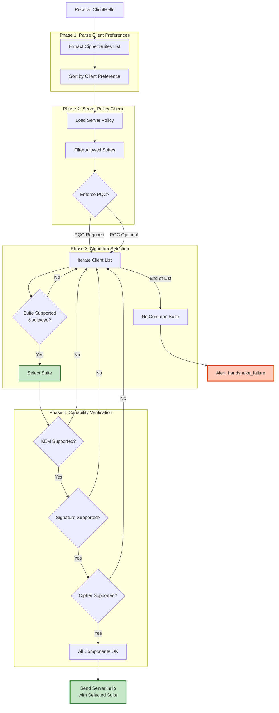
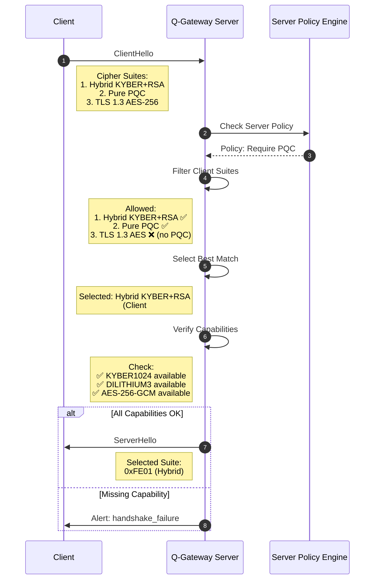
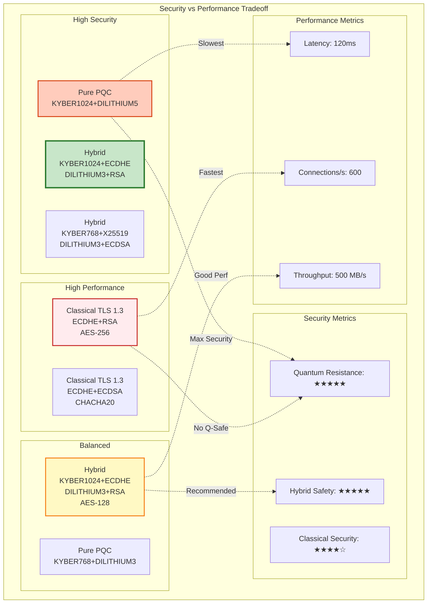

# 암호화 스위트 (Cipher Suites)

## 📘 개요

Q-TLS에서 지원하는 암호화 스위트(Cipher Suites) 및 PQC 알고리즘 조합에 대한 상세 문서입니다. 보안 수준, 성능 특성, 권장 설정을 포함합니다.

## 🔐 Q-TLS 지원 Cipher Suites 전체 목록

### Cipher Suite 명명 규칙

```yaml
Cipher Suite Naming Convention:

  Format: TLS_{KeyExchange}_{Authentication}_WITH_{Encryption}_{Hash}

  Components:
    KeyExchange: 키 교환 알고리즘
      - KYBER1024: Pure PQC KEM
      - KYBER768: Lower security PQC KEM
      - ECDHE_KYBER1024: Hybrid (Classical + PQC)
      - HYBRID_ECDHE_KYBER1024: Explicit Hybrid

    Authentication: 인증/서명 알고리즘
      - DILITHIUM3: Pure PQC signature
      - DILITHIUM5: Higher security PQC signature
      - RSA_DILITHIUM3: Hybrid RSA + PQC
      - ECDSA_DILITHIUM3: Hybrid ECDSA + PQC

    Encryption: 대칭 암호화 알고리즘
      - AES_256_GCM: AES-256 in GCM mode (AEAD)
      - AES_128_GCM: AES-128 in GCM mode
      - CHACHA20_POLY1305: ChaCha20-Poly1305 (AEAD)

    Hash: 해시 알고리즘
      - SHA384: SHA-384 (48 bytes)
      - SHA256: SHA-256 (32 bytes)
```

### 지원 Cipher Suites 목록

```yaml
Q-TLS Supported Cipher Suites:

  # Tier 1: Hybrid PQC+Classical (Recommended)
  - TLS_HYBRID_ECDHE_KYBER1024_RSA_DILITHIUM3_WITH_AES_256_GCM_SHA384
    Code: 0xFE01
    Security Level: NIST Level 5 + RSA-4096
    Key Exchange: ECDHE P-384 + KYBER1024
    Authentication: RSA-4096 + DILITHIUM3
    Encryption: AES-256-GCM
    HMAC: SHA-384
    Perfect Forward Secrecy: Yes
    Quantum Resistant: Yes

  - TLS_HYBRID_ECDHE_KYBER1024_ECDSA_DILITHIUM3_WITH_AES_256_GCM_SHA384
    Code: 0xFE02
    Security Level: NIST Level 5 + ECDSA-P384
    Key Exchange: ECDHE P-384 + KYBER1024
    Authentication: ECDSA-P384 + DILITHIUM3
    Encryption: AES-256-GCM
    HMAC: SHA-384
    Perfect Forward Secrecy: Yes
    Quantum Resistant: Yes

  - TLS_HYBRID_X25519_KYBER768_RSA_DILITHIUM3_WITH_AES_256_GCM_SHA384
    Code: 0xFE03
    Security Level: NIST Level 3 + X25519
    Key Exchange: X25519 + KYBER768
    Authentication: RSA-4096 + DILITHIUM3
    Encryption: AES-256-GCM
    HMAC: SHA-384
    Perfect Forward Secrecy: Yes
    Quantum Resistant: Yes (Level 3)

  # Tier 2: Pure PQC (Future-proof)
  - TLS_KYBER1024_DILITHIUM3_WITH_AES_256_GCM_SHA384
    Code: 0xFE11
    Security Level: NIST Level 5
    Key Exchange: KYBER1024
    Authentication: DILITHIUM3
    Encryption: AES-256-GCM
    HMAC: SHA-384
    Perfect Forward Secrecy: Yes
    Quantum Resistant: Yes

  - TLS_KYBER1024_DILITHIUM5_WITH_AES_256_GCM_SHA384
    Code: 0xFE12
    Security Level: NIST Level 5
    Key Exchange: KYBER1024
    Authentication: DILITHIUM5 (Higher security)
    Encryption: AES-256-GCM
    HMAC: SHA-384
    Perfect Forward Secrecy: Yes
    Quantum Resistant: Yes

  - TLS_KYBER768_DILITHIUM3_WITH_AES_256_GCM_SHA384
    Code: 0xFE13
    Security Level: NIST Level 3
    Key Exchange: KYBER768
    Authentication: DILITHIUM3
    Encryption: AES-256-GCM
    HMAC: SHA-384
    Perfect Forward Secrecy: Yes
    Quantum Resistant: Yes

  # Tier 3: Performance Optimized
  - TLS_HYBRID_ECDHE_KYBER1024_RSA_DILITHIUM3_WITH_AES_128_GCM_SHA256
    Code: 0xFE21
    Security Level: NIST Level 5 + RSA-4096
    Key Exchange: ECDHE P-384 + KYBER1024
    Authentication: RSA-4096 + DILITHIUM3
    Encryption: AES-128-GCM (Faster)
    HMAC: SHA-256
    Perfect Forward Secrecy: Yes
    Quantum Resistant: Yes
    Note: Optimized for high-throughput scenarios

  - TLS_HYBRID_ECDHE_KYBER1024_RSA_DILITHIUM3_WITH_CHACHA20_POLY1305_SHA256
    Code: 0xFE22
    Security Level: NIST Level 5 + RSA-4096
    Key Exchange: ECDHE P-384 + KYBER1024
    Authentication: RSA-4096 + DILITHIUM3
    Encryption: CHACHA20-POLY1305
    HMAC: SHA-256
    Perfect Forward Secrecy: Yes
    Quantum Resistant: Yes
    Note: Better for ARM/mobile devices

  # Tier 4: Classical Fallback (Compatibility)
  - TLS_AES_256_GCM_SHA384
    Code: 0x1301
    Security Level: AES-256
    Key Exchange: ECDHE (TLS 1.3 default)
    Authentication: RSA/ECDSA
    Encryption: AES-256-GCM
    HMAC: SHA-384
    Perfect Forward Secrecy: Yes
    Quantum Resistant: No
    Note: TLS 1.3 standard suite

  - TLS_CHACHA20_POLY1305_SHA256
    Code: 0x1303
    Security Level: ChaCha20-256
    Key Exchange: ECDHE (TLS 1.3 default)
    Authentication: RSA/ECDSA
    Encryption: CHACHA20-POLY1305
    HMAC: SHA-256
    Perfect Forward Secrecy: Yes
    Quantum Resistant: No
    Note: TLS 1.3 standard suite

  - TLS_AES_128_GCM_SHA256
    Code: 0x1302
    Security Level: AES-128
    Key Exchange: ECDHE (TLS 1.3 default)
    Authentication: RSA/ECDSA
    Encryption: AES-128-GCM
    HMAC: SHA-256
    Perfect Forward Secrecy: Yes
    Quantum Resistant: No
    Note: TLS 1.3 standard suite (lower security)
```

## 🔬 PQC 알고리즘 조합 상세

### Tier 1: TLS_HYBRID_ECDHE_KYBER1024_RSA_DILITHIUM3_WITH_AES_256_GCM_SHA384

```yaml
Cipher Suite: TLS_HYBRID_ECDHE_KYBER1024_RSA_DILITHIUM3_WITH_AES_256_GCM_SHA384

Specification:
  Code Point: 0xFE01
  Protocol: TLS 1.3
  Security Category: Hybrid (PQC + Classical)

Key Exchange:
  Classical:
    Algorithm: ECDHE
    Curve: secp384r1 (P-384)
    Key Size: 384 bits
    Shared Secret: 48 bytes

  PQC:
    Algorithm: KYBER1024
    Standard: NIST FIPS 203
    Security Level: NIST Level 5 (AES-256 equivalent)
    Public Key: 1568 bytes
    Ciphertext: 1568 bytes
    Shared Secret: 32 bytes

  Combined:
    Method: Concatenation + HKDF
    Total Shared Secret: 80 bytes (48 + 32)
    Derived Key Material: 48 bytes

Authentication:
  Classical:
    Algorithm: RSA-PSS
    Key Size: 4096 bits
    Hash: SHA-384
    Signature Size: 512 bytes

  PQC:
    Algorithm: DILITHIUM3
    Standard: NIST FIPS 204
    Security Level: NIST Level 3 (AES-192 equivalent)
    Public Key: 1952 bytes
    Signature Size: 3293 bytes

  Validation:
    Policy: Both signatures must be valid
    Failure Mode: Reject connection if either fails

Encryption:
  Algorithm: AES-256-GCM
  Key Size: 256 bits (32 bytes)
  IV Size: 96 bits (12 bytes)
  Tag Size: 128 bits (16 bytes)
  Mode: AEAD (Authenticated Encryption)

Hash:
  Algorithm: SHA-384
  Output Size: 48 bytes
  Usage: HKDF, HMAC, Transcript Hash

Performance Characteristics:
  Handshake Time: ~80-100ms
  Key Generation: ~0.6ms
  Signature Generation: ~3.7ms (RSA) + ~1.2ms (DILITHIUM3) = ~4.9ms
  Signature Verification: ~0.1ms (RSA) + ~0.8ms (DILITHIUM3) = ~0.9ms
  Throughput: ~500 MB/s (AES-256-GCM with AES-NI)
  Memory Usage: ~32 KB per connection

Security Properties:
  Confidentiality: ✅ AES-256
  Integrity: ✅ GCM Authentication Tag
  Authentication: ✅ Dual Signature
  Forward Secrecy: ✅ Ephemeral Key Exchange
  Quantum Resistance: ✅ KYBER1024 + DILITHIUM3
  Classical Security: ✅ ECDHE P-384 + RSA-4096
  Hybrid Security: ✅ Both must be broken to compromise

Use Cases:
  - Production environments requiring maximum security
  - External client connections (Internet-facing)
  - Government/regulated industries (FIPS compliance)
  - Long-term data protection (quantum threat timeline: 2030+)
```

### Tier 2: TLS_KYBER1024_DILITHIUM3_WITH_AES_256_GCM_SHA384

```yaml
Cipher Suite: TLS_KYBER1024_DILITHIUM3_WITH_AES_256_GCM_SHA384

Specification:
  Code Point: 0xFE11
  Protocol: TLS 1.3
  Security Category: Pure PQC

Key Exchange:
  Algorithm: KYBER1024
  Standard: NIST FIPS 203
  Security Level: NIST Level 5
  Public Key: 1568 bytes
  Ciphertext: 1568 bytes
  Shared Secret: 32 bytes
  Perfect Forward Secrecy: Yes

Authentication:
  Algorithm: DILITHIUM3
  Standard: NIST FIPS 204
  Security Level: NIST Level 3
  Public Key: 1952 bytes
  Signature Size: 3293 bytes

Encryption:
  Algorithm: AES-256-GCM
  Key Size: 256 bits
  AEAD: Yes

Hash:
  Algorithm: SHA-384
  Output Size: 48 bytes

Performance Characteristics:
  Handshake Time: ~120-150ms (PQC overhead)
  Signature Generation: ~1.2ms
  Signature Verification: ~0.8ms
  Throughput: ~500 MB/s
  Memory Usage: ~48 KB per connection

Security Properties:
  Quantum Resistance: ✅ Pure PQC
  Classical Security: ❌ None
  Hybrid Security: ❌ PQC only

Use Cases:
  - Future-proof environments (post-quantum era)
  - Internal services (service mesh)
  - Research and testing
  - Zero classical cryptography dependency
```

### Cipher Suite 비교표

```yaml
Comparison Matrix:

┌─────────────────────────────────────────────────────────────────────────────┐
│                         Cipher Suite Comparison                              │
├──────────────┬──────────┬──────────┬──────────┬──────────┬──────────────────┤
│ Suite        │ Security │ Perf.    │ Compat.  │ Q-Safe   │ Recommended Use  │
├──────────────┼──────────┼──────────┼──────────┼──────────┼──────────────────┤
│ Hybrid       │ ★★★★★    │ ★★★☆☆    │ ★★★★☆    │ ★★★★★    │ Production       │
│ KYBER+ECDHE  │          │          │          │          │ External Traffic │
│ DILITHIUM+RSA│          │          │          │          │                  │
├──────────────┼──────────┼──────────┼──────────┼──────────┼──────────────────┤
│ Pure PQC     │ ★★★★☆    │ ★★☆☆☆    │ ★★☆☆☆    │ ★★★★★    │ Future-proof     │
│ KYBER1024    │          │          │          │          │ Internal Services│
│ DILITHIUM3   │          │          │          │          │                  │
├──────────────┼──────────┼──────────┼──────────┼──────────┼──────────────────┤
│ Hybrid       │ ★★★★★    │ ★★★★☆    │ ★★★★☆    │ ★★★★★    │ High Throughput  │
│ KYBER+ECDHE  │          │          │          │          │ APIs             │
│ DILITHIUM+RSA│          │          │          │          │                  │
│ AES-128-GCM  │          │          │          │          │                  │
├──────────────┼──────────┼──────────┼──────────┼──────────┼──────────────────┤
│ Classical    │ ★★★☆☆    │ ★★★★★    │ ★★★★★    │ ☆☆☆☆☆    │ Legacy Support   │
│ TLS 1.3      │          │          │          │          │ Fallback Only    │
│ AES-256-GCM  │          │          │          │          │                  │
└──────────────┴──────────┴──────────┴──────────┴──────────┴──────────────────┘

Legend:
  ★★★★★ = Excellent
  ★★★★☆ = Very Good
  ★★★☆☆ = Good
  ★★☆☆☆ = Fair
  ☆☆☆☆☆ = Poor
```

## 🔄 Cipher Suite 협상 프로세스

### 협상 알고리즘



### 협상 시퀀스



### 협상 정책 설정

```yaml
Server Cipher Suite Policy:

  # Policy Mode
  mode: strict  # strict | permissive | hybrid

  # Enforcement Rules
  rules:
    # PQC Requirements
    require_pqc: true
    require_pqc_kem: true
    require_pqc_signature: true

    # Minimum Security Levels
    min_pqc_level: 3  # NIST Level (1-5)
    min_classical_bits: 256  # For hybrid mode

    # Allowed Algorithms
    allowed_kems:
      - kyber1024
      - kyber768
      - ecdhe_p384  # Classical (hybrid mode only)

    allowed_signatures:
      - dilithium3
      - dilithium5
      - rsa_pss_4096  # Classical (hybrid mode only)
      - ecdsa_p384    # Classical (hybrid mode only)

    allowed_ciphers:
      - aes_256_gcm
      - aes_128_gcm
      - chacha20_poly1305

    # Preferred Order (Server preference)
    preference_order:
      - TLS_HYBRID_ECDHE_KYBER1024_RSA_DILITHIUM3_WITH_AES_256_GCM_SHA384
      - TLS_HYBRID_ECDHE_KYBER1024_ECDSA_DILITHIUM3_WITH_AES_256_GCM_SHA384
      - TLS_KYBER1024_DILITHIUM3_WITH_AES_256_GCM_SHA384

    # Fallback Policy
    allow_classical_fallback: false
    fallback_suites: []  # Empty = no fallback

  # Client Compatibility
  compatibility:
    honor_client_preference: false  # Server chooses
    require_sni: true
    require_alpn: false

  # Logging
  logging:
    log_negotiation: true
    log_rejected_suites: true
    alert_on_fallback: true
```

## 📊 성능 vs 보안 트레이드오프 분석

### 성능 분석표

```yaml
Performance vs Security Analysis:

┌─────────────────────────────────────────────────────────────────────────────┐
│                    Performance Metrics Comparison                            │
├──────────────────────┬──────────┬──────────┬──────────┬──────────────────────┤
│ Metric               │ Hybrid   │ Pure PQC │ Classical│ Impact               │
├──────────────────────┼──────────┼──────────┼──────────┼──────────────────────┤
│ Handshake Latency    │ 80-100ms │ 120-150ms│ 30-50ms  │ 2-3x increase (PQC)  │
│ Key Generation       │ 0.6ms    │ 0.5ms    │ 50ms(RSA)│ 80x faster (PQC)     │
│ Signature Gen        │ 4.9ms    │ 1.2ms    │ 2.5ms    │ 2x slower (Hybrid)   │
│ Signature Verify     │ 0.9ms    │ 0.8ms    │ 0.1ms    │ 9x slower (PQC)      │
│ Cert Size            │ 8 KB     │ 5 KB     │ 2 KB     │ 4x larger (Hybrid)   │
│ Bandwidth Overhead   │ +15 KB   │ +10 KB   │ +2 KB    │ 7x increase (Hybrid) │
│ Memory per Conn      │ 32 KB    │ 48 KB    │ 8 KB     │ 4-6x increase (PQC)  │
│ CPU Usage (Handshake)│ +40%     │ +80%     │ Baseline │ Moderate impact      │
│ Throughput (Data)    │ 500 MB/s │ 500 MB/s │ 600 MB/s │ Minimal impact       │
│ Connections/sec      │ 1,000    │ 600      │ 2,000    │ 50% reduction (PQC)  │
└──────────────────────┴──────────┴──────────┴──────────┴──────────────────────┘

Notes:
  - Measurements on: Intel Xeon Gold 6248R @ 3.0GHz, 256GB RAM
  - With: AES-NI hardware acceleration
  - Network: 10 Gbps
  - HSM: Luna Network HSM 7
```

### 트레이드오프 다이어그램



### 최적화 권장사항

```yaml
Optimization Recommendations:

  For Maximum Security (Government, Finance):
    Cipher Suite: TLS_HYBRID_ECDHE_KYBER1024_RSA_DILITHIUM3_WITH_AES_256_GCM_SHA384
    Tradeoff: +40% CPU, +80ms latency
    Mitigation:
      - Use hardware acceleration (AES-NI, HSM)
      - Enable session resumption (reduce handshakes)
      - Implement connection pooling
      - Use HTTP/2 multiplexing

  For Balanced Performance (Enterprise):
    Cipher Suite: TLS_HYBRID_X25519_KYBER768_RSA_DILITHIUM3_WITH_AES_256_GCM_SHA384
    Tradeoff: +20% CPU, +50ms latency
    Mitigation:
      - Session tickets for fast resumption
      - OCSP stapling to reduce lookups
      - Optimize certificate chain length

  For High Throughput (APIs, Microservices):
    Cipher Suite: TLS_HYBRID_ECDHE_KYBER1024_RSA_DILITHIUM3_WITH_AES_128_GCM_SHA256
    Tradeoff: Slightly lower encryption security
    Benefit: +20% throughput, -10ms latency
    Use Case: Internal service mesh, high-volume APIs

  For Mobile/IoT:
    Cipher Suite: TLS_HYBRID_X25519_KYBER768_ECDSA_DILITHIUM3_WITH_CHACHA20_POLY1305_SHA256
    Benefit: Better ARM performance, lower battery usage
    Tradeoff: Slightly lower security level (NIST Level 3)

  For Legacy Compatibility (Temporary):
    Cipher Suite: TLS_AES_256_GCM_SHA384 (Classical TLS 1.3)
    Risk: No quantum resistance
    Timeline: Migrate to PQC within 12 months
    Use Only: For legacy clients during transition
```

## ⚙️ 권장 설정

### Production 환경

```yaml
# /etc/q-tls/production.yaml
cipher_suite_config:
  environment: production

  # Cipher Suite Selection
  allowed_suites:
    # Tier 1: Hybrid (Mandatory)
    - TLS_HYBRID_ECDHE_KYBER1024_RSA_DILITHIUM3_WITH_AES_256_GCM_SHA384
    - TLS_HYBRID_ECDHE_KYBER1024_ECDSA_DILITHIUM3_WITH_AES_256_GCM_SHA384

    # Tier 2: Pure PQC (Optional)
    - TLS_KYBER1024_DILITHIUM3_WITH_AES_256_GCM_SHA384

  # Preference Order (Server-side)
  preference_order:
    - TLS_HYBRID_ECDHE_KYBER1024_RSA_DILITHIUM3_WITH_AES_256_GCM_SHA384
    - TLS_HYBRID_ECDHE_KYBER1024_ECDSA_DILITHIUM3_WITH_AES_256_GCM_SHA384
    - TLS_KYBER1024_DILITHIUM3_WITH_AES_256_GCM_SHA384

  # Security Policy
  security:
    require_pqc: true
    require_hybrid: true
    min_pqc_level: 3  # NIST Level 3+
    allow_classical_fallback: false

  # Performance Tuning
  performance:
    enable_session_cache: true
    session_cache_size: 10000
    session_timeout: 3600  # 1 hour

    enable_session_tickets: true
    ticket_lifetime: 7200  # 2 hours
    ticket_keys_rotation: 3600  # 1 hour

    enable_0rtt: false  # Disabled for security

  # Certificate Validation
  certificates:
    verify_depth: 3
    check_revocation: true
    ocsp_stapling: true
    crl_check: true

  # Logging
  logging:
    level: info
    log_handshakes: true
    log_cipher_selection: true
    log_errors: true
```

### Development 환경

```yaml
# /etc/q-tls/development.yaml
cipher_suite_config:
  environment: development

  # Cipher Suite Selection (More Permissive)
  allowed_suites:
    # Hybrid PQC
    - TLS_HYBRID_ECDHE_KYBER1024_RSA_DILITHIUM3_WITH_AES_256_GCM_SHA384
    - TLS_HYBRID_X25519_KYBER768_RSA_DILITHIUM3_WITH_AES_256_GCM_SHA384

    # Pure PQC
    - TLS_KYBER1024_DILITHIUM3_WITH_AES_256_GCM_SHA384
    - TLS_KYBER768_DILITHIUM3_WITH_AES_256_GCM_SHA384

    # Classical (for testing)
    - TLS_AES_256_GCM_SHA384
    - TLS_CHACHA20_POLY1305_SHA256

  # Security Policy (Relaxed)
  security:
    require_pqc: false  # Allow classical for dev
    require_hybrid: false
    min_pqc_level: 1
    allow_classical_fallback: true

  # Performance Tuning
  performance:
    enable_session_cache: true
    session_cache_size: 1000
    session_timeout: 600  # 10 minutes

    enable_0rtt: true  # Enabled for testing

  # Certificate Validation (Relaxed)
  certificates:
    verify_depth: 3
    check_revocation: false  # Disabled for dev
    ocsp_stapling: false
    crl_check: false
    allow_self_signed: true

  # Logging (Verbose)
  logging:
    level: debug
    log_handshakes: true
    log_cipher_selection: true
    log_key_derivation: true  # Debug only
    log_errors: true
```

### Testing 환경

```yaml
# /etc/q-tls/testing.yaml
cipher_suite_config:
  environment: testing

  # All Cipher Suites (for compatibility testing)
  allowed_suites:
    - TLS_HYBRID_ECDHE_KYBER1024_RSA_DILITHIUM3_WITH_AES_256_GCM_SHA384
    - TLS_HYBRID_ECDHE_KYBER1024_ECDSA_DILITHIUM3_WITH_AES_256_GCM_SHA384
    - TLS_HYBRID_X25519_KYBER768_RSA_DILITHIUM3_WITH_AES_256_GCM_SHA384
    - TLS_KYBER1024_DILITHIUM3_WITH_AES_256_GCM_SHA384
    - TLS_KYBER1024_DILITHIUM5_WITH_AES_256_GCM_SHA384
    - TLS_KYBER768_DILITHIUM3_WITH_AES_256_GCM_SHA384
    - TLS_HYBRID_ECDHE_KYBER1024_RSA_DILITHIUM3_WITH_AES_128_GCM_SHA256
    - TLS_AES_256_GCM_SHA384
    - TLS_CHACHA20_POLY1305_SHA256
    - TLS_AES_128_GCM_SHA256

  # Security Policy
  security:
    require_pqc: false
    require_hybrid: false
    allow_classical_fallback: true

  # Test-specific Settings
  testing:
    enable_all_suites: true
    allow_weak_ciphers: true  # For negative testing
    log_all_negotiations: true

  # Performance Profiling
  performance:
    enable_metrics: true
    metrics_interval: 60
    profile_handshakes: true

  # Logging (Maximum Verbosity)
  logging:
    level: trace
    log_everything: true
```

## 🔧 APISIX 설정 예제

### APISIX Q-TLS Configuration

```yaml
# /etc/apisix/config.yaml
apisix:
  ssl:
    # Enable Q-TLS
    enable_pqc: true

    # Cipher Suite Configuration
    ciphers:
      # Hybrid PQC Suites (OpenSSL syntax)
      - TLS_HYBRID_ECDHE_KYBER1024_RSA_DILITHIUM3_WITH_AES_256_GCM_SHA384
      - TLS_HYBRID_ECDHE_KYBER1024_ECDSA_DILITHIUM3_WITH_AES_256_GCM_SHA384

      # Pure PQC Suites
      - TLS_KYBER1024_DILITHIUM3_WITH_AES_256_GCM_SHA384

      # TLS 1.3 Standard Suites (Fallback)
      - TLS_AES_256_GCM_SHA384

    # Supported Groups (KEMs + Curves)
    groups:
      - kyber1024
      - kyber768
      - secp384r1
      - x25519

    # Certificate Configuration
    certificate:
      # PQC Certificate Chain
      pqc_cert: /etc/apisix/certs/gateway-dilithium3.crt
      pqc_key: /etc/apisix/certs/gateway-dilithium3.key

      # Classical Certificate Chain (Hybrid)
      classical_cert: /etc/apisix/certs/gateway-rsa.crt
      classical_key: /etc/apisix/certs/gateway-rsa.key

      # Certificate Chain
      chain: /etc/apisix/certs/ca-chain.crt

    # Protocol Versions
    protocols:
      - TLSv1.3

    # Client Certificate Verification (mTLS)
    verify_client: optional
    client_ca: /etc/apisix/certs/client-ca.crt
    verify_depth: 3

    # Session Configuration
    session_cache: shared:SSL:10m
    session_timeout: 1h
    session_tickets: on
    session_ticket_key:
      - /etc/apisix/certs/ticket-key-1.key
      - /etc/apisix/certs/ticket-key-2.key

    # OCSP Stapling
    ocsp_stapling: on
    ocsp_verify: on

  # OpenSSL Provider Configuration
  openssl:
    # Load OQS Provider for PQC support
    providers:
      - name: oqsprovider
        path: /usr/lib/ossl-modules/oqsprovider.so

      - name: default
        activate: true

  # Performance Settings
  performance:
    worker_processes: auto
    worker_connections: 10240

    # SSL-specific
    ssl_buffer_size: 16k
    ssl_session_cache_size: 10m
```

### APISIX Route with Q-TLS

```yaml
# Route configuration for Q-TLS
routes:
  - uri: /api/v1/*
    name: secure-api-route
    methods:
      - GET
      - POST
      - PUT
      - DELETE

    # Upstream Configuration
    upstream:
      type: roundrobin
      nodes:
        "backend-1.qsign.local:8443": 1
        "backend-2.qsign.local:8443": 1

      # Upstream SSL (Q-TLS to backend)
      scheme: https
      tls:
        client_cert: /etc/apisix/certs/upstream-client-dilithium3.crt
        client_key: /etc/apisix/certs/upstream-client-dilithium3.key

    # SSL Configuration Override
    ssl:
      # Require Hybrid PQC for this route
      ciphers:
        - TLS_HYBRID_ECDHE_KYBER1024_RSA_DILITHIUM3_WITH_AES_256_GCM_SHA384
        - TLS_HYBRID_ECDHE_KYBER1024_ECDSA_DILITHIUM3_WITH_AES_256_GCM_SHA384

      # Require client certificates
      verify_client: require

    # Security Plugins
    plugins:
      # Rate Limiting
      limit-req:
        rate: 100
        burst: 50
        key: remote_addr

      # Authentication
      jwt-auth:
        key: qsign-jwt-key
        algorithm: DILITHIUM3  # PQC signature

      # Logging
      http-logger:
        uri: http://logger.qsign.local/logs
        include_req_body: false
```

## 🌐 Nginx 설정 예제

### Nginx Q-TLS Configuration

```nginx
# /etc/nginx/nginx.conf
user nginx;
worker_processes auto;
error_log /var/log/nginx/error.log info;

# Load OQS Module
load_module /usr/lib/nginx/modules/ngx_oqs_module.so;

events {
    worker_connections 10240;
}

http {
    # OpenSSL Engine Configuration
    ssl_engine oqs;

    # Q-TLS Server Block
    server {
        listen 443 ssl http2;
        server_name q-gateway.qsign.local;

        # Q-TLS Configuration
        ssl_protocols TLSv1.3;

        # Cipher Suites (Hybrid PQC)
        ssl_ciphers 'TLS_HYBRID_ECDHE_KYBER1024_RSA_DILITHIUM3_WITH_AES_256_GCM_SHA384:TLS_HYBRID_ECDHE_KYBER1024_ECDSA_DILITHIUM3_WITH_AES_256_GCM_SHA384:TLS_KYBER1024_DILITHIUM3_WITH_AES_256_GCM_SHA384';
        ssl_prefer_server_ciphers on;

        # Supported Groups (KEMs)
        ssl_ecdh_curve kyber1024:secp384r1:x25519;

        # PQC Certificate
        ssl_certificate /etc/nginx/certs/gateway-dilithium3-chain.crt;
        ssl_certificate_key /etc/nginx/certs/gateway-dilithium3.key;

        # Classical Certificate (Hybrid)
        ssl_certificate /etc/nginx/certs/gateway-rsa-chain.crt;
        ssl_certificate_key /etc/nginx/certs/gateway-rsa.key;

        # Client Certificate Verification (mTLS)
        ssl_verify_client optional;
        ssl_client_certificate /etc/nginx/certs/client-ca.crt;
        ssl_verify_depth 3;

        # Session Cache
        ssl_session_cache shared:QTSL:50m;
        ssl_session_timeout 1h;
        ssl_session_tickets on;
        ssl_session_ticket_key /etc/nginx/certs/ticket.key;

        # OCSP Stapling
        ssl_stapling on;
        ssl_stapling_verify on;
        ssl_trusted_certificate /etc/nginx/certs/ca-chain.crt;
        resolver 8.8.8.8 8.8.4.4 valid=300s;
        resolver_timeout 5s;

        # Security Headers
        add_header Strict-Transport-Security "max-age=31536000; includeSubDomains" always;
        add_header X-Frame-Options "DENY" always;
        add_header X-Content-Type-Options "nosniff" always;

        # Logging
        access_log /var/log/nginx/q-tls-access.log;
        error_log /var/log/nginx/q-tls-error.log;

        # Proxy to Backend
        location / {
            proxy_pass https://backend.qsign.local:8443;

            # Proxy SSL (Q-TLS to backend)
            proxy_ssl_protocols TLSv1.3;
            proxy_ssl_ciphers TLS_HYBRID_ECDHE_KYBER1024_RSA_DILITHIUM3_WITH_AES_256_GCM_SHA384;
            proxy_ssl_certificate /etc/nginx/certs/proxy-client-dilithium3.crt;
            proxy_ssl_certificate_key /etc/nginx/certs/proxy-client-dilithium3.key;
            proxy_ssl_verify on;
            proxy_ssl_trusted_certificate /etc/nginx/certs/backend-ca.crt;

            # Proxy Headers
            proxy_set_header Host $host;
            proxy_set_header X-Real-IP $remote_addr;
            proxy_set_header X-Forwarded-For $proxy_add_x_forwarded_for;
            proxy_set_header X-Forwarded-Proto $scheme;

            # Client Certificate Forwarding
            proxy_set_header X-Client-Cert $ssl_client_escaped_cert;
            proxy_set_header X-Client-Verify $ssl_client_verify;
        }

        # Health Check Endpoint
        location /health {
            access_log off;
            return 200 "OK\n";
            add_header Content-Type text/plain;
        }
    }

    # Monitoring Location
    server {
        listen 127.0.0.1:9090;

        location /nginx_status {
            stub_status;
            access_log off;
        }

        location /ssl_status {
            # Custom SSL metrics endpoint
            ssl_status;
            access_log off;
        }
    }
}
```

### Nginx SSL Status 모니터링

```bash
#!/bin/bash
# /usr/local/bin/nginx-qtsl-metrics.sh

# Query Nginx SSL status
curl -s http://127.0.0.1:9090/ssl_status | jq '{
  "active_connections": .active_connections,
  "handshakes": .handshakes,
  "handshake_failures": .handshake_failures,
  "session_reuses": .session_reuses,
  "cipher_suites": .cipher_suites
}'
```

## 🔗 참고 자료

```yaml
Standards and Specifications:
  TLS:
    - RFC 8446: TLS 1.3
    - RFC 5246: TLS 1.2 (legacy reference)

  PQC:
    - NIST FIPS 203: ML-KEM (KYBER)
    - NIST FIPS 204: ML-DSA (DILITHIUM)
    - IETF Draft: Hybrid Key Exchange in TLS

  AEAD:
    - RFC 5116: An Interface and Algorithms for AEAD
    - RFC 5288: AES-GCM Cipher Suites for TLS

Implementation References:
  - Open Quantum Safe: https://openquantumsafe.org/
  - OpenSSL OQS Provider: https://github.com/open-quantum-safe/oqs-provider
  - BoringSSL PQC: https://github.com/google/boringssl
  - APISIX: https://apisix.apache.org/
  - Nginx: https://nginx.org/

Performance Optimization:
  - Intel AES-NI: Hardware acceleration guide
  - Luna HSM Performance Tuning Guide
  - TLS Performance Best Practices
```

---

**Last Updated**: 2025-11-16
**Version**: 1.0.0
**Cipher Suites**: 10+ combinations (Hybrid + Pure PQC)
**Recommended**: TLS_HYBRID_ECDHE_KYBER1024_RSA_DILITHIUM3_WITH_AES_256_GCM_SHA384
