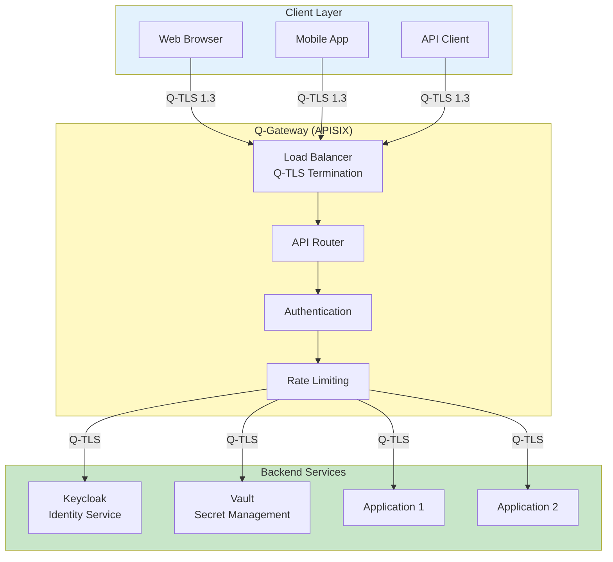
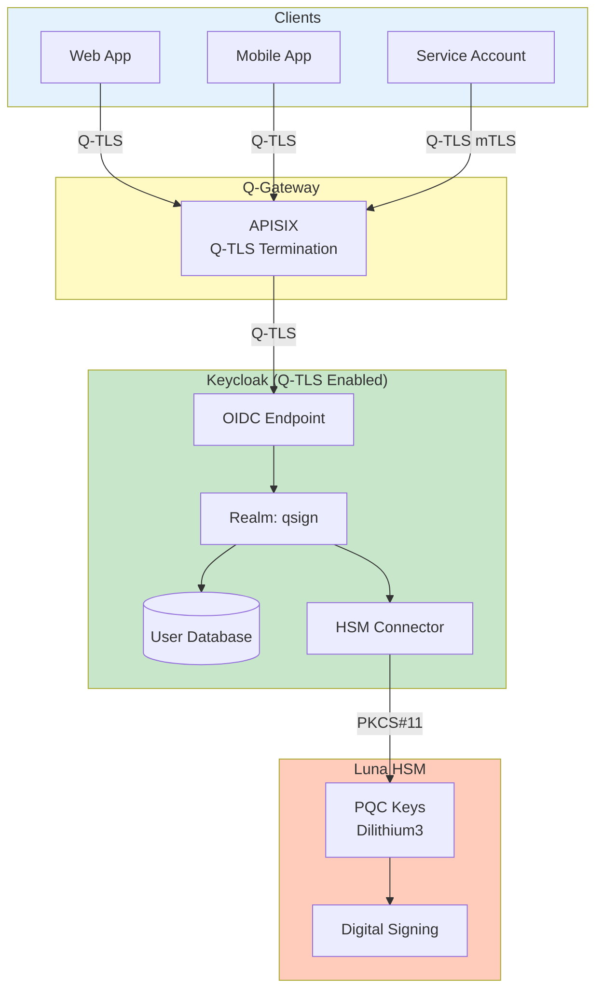
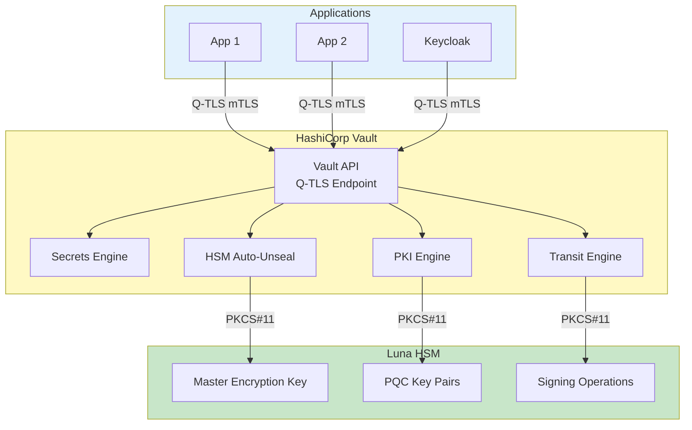
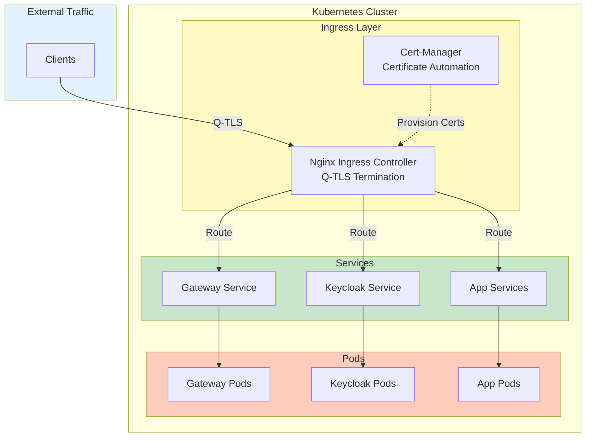
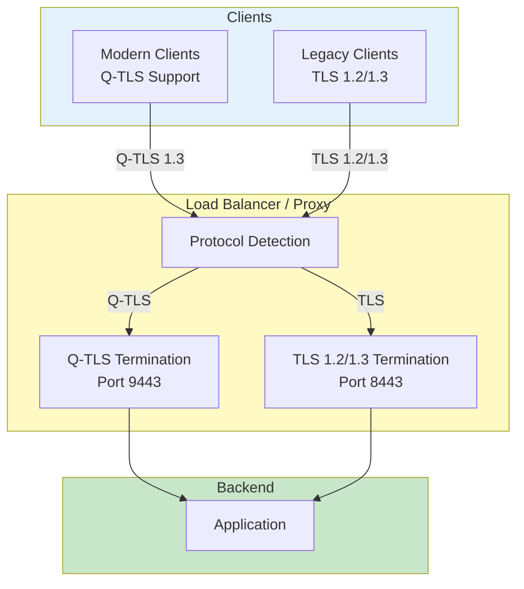
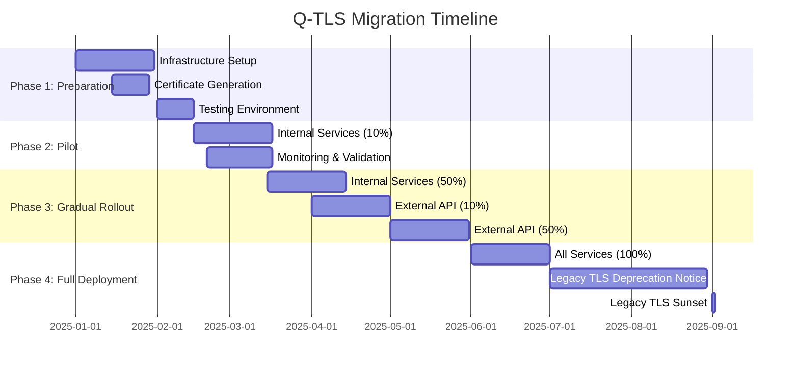

# Q-TLS System Integration Guide

Q-TLS (Quantum-resistant Transport Security Layer)을 QSIGN 시스템의 각 컴포넌트에 통합하는 가이드입니다.

## 목차

1. [Q-Gateway (APISIX) 통합](#1-q-gateway-apisix-통합)
2. [Keycloak PQC 연동](#2-keycloak-pqc-연동)
3. [Vault HSM Q-TLS 통합](#3-vault-hsm-q-tls-통합)
4. [Kubernetes Ingress Q-TLS 설정](#4-kubernetes-ingress-q-tls-설정)
5. [애플리케이션 레벨 Q-TLS 적용](#5-애플리케이션-레벨-q-tls-적용)
6. [레거시 시스템 호환성](#6-레거시-시스템-호환성)
7. [마이그레이션 전략](#7-마이그레이션-전략)

---

## 1. Q-Gateway (APISIX) 통합

### 1.1 전체 아키텍처



### 1.2 APISIX Q-TLS 설정

```yaml
# /opt/apisix/config/config.yaml
# Q-Gateway APISIX Configuration with Q-TLS

apisix:
  node_listen:
    # External HTTPS (Client-facing)
    - port: 9443
      enable_http2: true
      enable_http3: false
      ssl:
        enable: true
        ssl_protocols: "TLSv1.3"
        ssl_ciphers: "TLS_AES_256_GCM_SHA384:TLS_CHACHA20_POLY1305_SHA256"
        ssl_prefer_server_ciphers: true
        ssl_session_cache: "shared:QtslSSL:100m"
        ssl_session_timeout: "4h"
        ssl_session_tickets: true
        ssl_stapling: true
        ssl_stapling_verify: true

    # Internal HTTP (Backend communication)
    - port: 9080
      enable_http2: true

  enable_admin: true
  admin_key:
    - name: "admin"
      key: "${ADMIN_API_KEY}"
      role: admin

deployment:
  role: traditional
  role_traditional:
    config_provider: etcd

  etcd:
    host:
      - "http://etcd-cluster:2379"
    prefix: "/apisix"
    timeout: 30
    health_check_retry: 2

# Plugins
plugins:
  # Authentication
  - jwt-auth
  - key-auth
  - openid-connect  # Keycloak integration

  # Security
  - limit-req
  - limit-count
  - ip-restriction
  - cors
  - csrf

  # Observability
  - prometheus
  - skywalking
  - http-logger

  # Q-TLS specific
  - ssl-client-verify  # mTLS support

plugin_attr:
  # Prometheus metrics
  prometheus:
    enable_export_server: true
    export_addr:
      ip: "0.0.0.0"
      port: 9091

  # OpenID Connect (Keycloak)
  openid-connect:
    discovery: "https://keycloak.qsign.local/realms/qsign/.well-known/openid-configuration"
    ssl_verify: true
    ssl_trusted_certificate: /opt/certs/ca/root-ca.crt

nginx_config:
  http_server_configuration_snippet: |
    # Q-TLS Server Configuration
    ssl_certificate /opt/certs/server/gateway-bundle.crt;
    ssl_certificate_key /opt/certs/server/gateway.key;
    ssl_trusted_certificate /opt/certs/ca/root-ca.crt;

    # OCSP Stapling
    ssl_stapling on;
    ssl_stapling_verify on;
    resolver 8.8.8.8 8.8.4.4 valid=300s;

    # Session Settings
    ssl_session_cache shared:QtslSSL:100m;
    ssl_session_timeout 4h;
    ssl_session_tickets on;

    # Security Headers
    add_header Strict-Transport-Security "max-age=63072000; includeSubDomains; preload" always;
```

### 1.3 APISIX Route 설정 스크립트

```bash
#!/bin/bash
# configure-apisix-qtsl-routes.sh

set -e

ADMIN_API="http://localhost:9180"
ADMIN_KEY="your-admin-key-here"

# ============================================================================
# 1. Create SSL Certificate
# ============================================================================

echo "[1/5] Creating SSL certificate in APISIX..."

CERT_CONTENT=$(cat /opt/qsign/certs/server/gateway-bundle.crt | sed ':a;N;$!ba;s/\n/\\n/g')
KEY_CONTENT=$(cat /opt/qsign/certs/server/gateway.key | sed ':a;N;$!ba;s/\n/\\n/g')

curl -X PUT "${ADMIN_API}/apisix/admin/ssls/gateway-ssl" \
  -H "X-API-KEY: ${ADMIN_KEY}" \
  -H "Content-Type: application/json" \
  -d "{
    \"cert\": \"${CERT_CONTENT}\",
    \"key\": \"${KEY_CONTENT}\",
    \"snis\": [\"api.qsign.local\", \"*.qsign.local\"]
  }"

# ============================================================================
# 2. Create Upstreams (Backend Services)
# ============================================================================

echo "[2/5] Creating backend upstreams..."

# Keycloak upstream
curl -X PUT "${ADMIN_API}/apisix/admin/upstreams/keycloak" \
  -H "X-API-KEY: ${ADMIN_KEY}" \
  -H "Content-Type: application/json" \
  -d '{
    "type": "roundrobin",
    "scheme": "https",
    "nodes": {
      "keycloak.qsign.local:8443": 1
    },
    "timeout": {
      "connect": 10,
      "send": 10,
      "read": 30
    },
    "keepalive_pool": {
      "size": 320,
      "idle_timeout": 60
    },
    "tls": {
      "client_cert": "/opt/certs/client/gateway-client.crt",
      "client_key": "/opt/certs/client/gateway-client.key"
    }
  }'

# Application upstream
curl -X PUT "${ADMIN_API}/apisix/admin/upstreams/app-backend" \
  -H "X-API-KEY: ${ADMIN_KEY}" \
  -H "Content-Type: application/json" \
  -d '{
    "type": "roundrobin",
    "scheme": "https",
    "nodes": {
      "app1.qsign.local:8443": 1,
      "app2.qsign.local:8443": 1
    },
    "timeout": {
      "connect": 10,
      "send": 30,
      "read": 30
    },
    "checks": {
      "active": {
        "type": "https",
        "http_path": "/health",
        "healthy": {
          "interval": 5,
          "successes": 2
        },
        "unhealthy": {
          "interval": 5,
          "http_failures": 3
        }
      }
    },
    "keepalive_pool": {
      "size": 320,
      "idle_timeout": 60,
      "requests": 1000
    }
  }'

# ============================================================================
# 3. Create Routes
# ============================================================================

echo "[3/5] Creating API routes..."

# Public API route (no auth)
curl -X PUT "${ADMIN_API}/apisix/admin/routes/public-api" \
  -H "X-API-KEY: ${ADMIN_KEY}" \
  -H "Content-Type: application/json" \
  -d '{
    "uri": "/api/v1/public/*",
    "name": "public-api",
    "methods": ["GET"],
    "host": "api.qsign.local",
    "upstream_id": "app-backend",
    "plugins": {
      "limit-req": {
        "rate": 100,
        "burst": 200,
        "key": "remote_addr",
        "rejected_code": 429
      },
      "cors": {
        "allow_origins": "**",
        "allow_methods": "GET,OPTIONS",
        "max_age": 3600
      },
      "prometheus": {}
    }
  }'

# Protected API route (OAuth2/OIDC)
curl -X PUT "${ADMIN_API}/apisix/admin/routes/protected-api" \
  -H "X-API-KEY: ${ADMIN_KEY}" \
  -H "Content-Type: application/json" \
  -d '{
    "uri": "/api/v1/protected/*",
    "name": "protected-api",
    "methods": ["GET", "POST", "PUT", "DELETE"],
    "host": "api.qsign.local",
    "upstream_id": "app-backend",
    "plugins": {
      "openid-connect": {
        "client_id": "qsign-api",
        "client_secret": "your-client-secret",
        "discovery": "https://keycloak.qsign.local/realms/qsign/.well-known/openid-configuration",
        "scope": "openid profile email",
        "bearer_only": true,
        "realm": "qsign",
        "ssl_verify": true
      },
      "limit-req": {
        "rate": 500,
        "burst": 1000,
        "key": "consumer_name",
        "rejected_code": 429
      },
      "prometheus": {}
    }
  }'

# mTLS route (device authentication)
curl -X PUT "${ADMIN_API}/apisix/admin/routes/mtls-api" \
  -H "X-API-KEY: ${ADMIN_KEY}" \
  -H "Content-Type: application/json" \
  -d '{
    "uri": "/api/v1/device/*",
    "name": "mtls-api",
    "methods": ["GET", "POST"],
    "host": "api.qsign.local",
    "upstream_id": "app-backend",
    "plugins": {
      "ssl-client-verify": {
        "ca_cert": "/opt/certs/ca/device-ca.crt",
        "verify_depth": 3
      },
      "limit-req": {
        "rate": 1000,
        "burst": 2000,
        "key": "ssl_client_s_dn"
      }
    }
  }'

echo "[4/5] Creating health check route..."

curl -X PUT "${ADMIN_API}/apisix/admin/routes/health" \
  -H "X-API-KEY: ${ADMIN_KEY}" \
  -H "Content-Type: application/json" \
  -d '{
    "uri": "/health",
    "name": "health-check",
    "methods": ["GET"],
    "plugins": {
      "serverless-pre-function": {
        "phase": "rewrite",
        "functions": [
          "return function(conf, ctx) ngx.say(\"healthy\"); ngx.exit(200); end"
        ]
      }
    }
  }'

echo "[5/5] Verifying configuration..."

curl -s "${ADMIN_API}/apisix/admin/routes" \
  -H "X-API-KEY: ${ADMIN_KEY}" | jq '.list.total'

echo ""
echo "✓ APISIX Q-TLS routes configured successfully!"
```

---

## 2. Keycloak PQC 연동

### 2.1 Keycloak Q-TLS 아키텍처



### 2.2 Keycloak 서버 설정

```xml
<!-- /opt/keycloak/conf/standalone.xml -->
<!-- Keycloak Server Configuration with Q-TLS -->

<server xmlns="urn:jboss:domain:18.0">
    <extensions>
        <!-- ... -->
    </extensions>

    <system-properties>
        <!-- Q-TLS Configuration -->
        <property name="javax.net.ssl.keyStore" value="/opt/qsign/certs/keycloak/keystore.p12"/>
        <property name="javax.net.ssl.keyStorePassword" value="changeit"/>
        <property name="javax.net.ssl.trustStore" value="/opt/qsign/certs/ca/truststore.jks"/>
        <property name="javax.net.ssl.trustStorePassword" value="changeit"/>

        <!-- HSM Configuration -->
        <property name="pkcs11.config" value="/opt/keycloak/conf/pkcs11.cfg"/>
    </system-properties>

    <profile>
        <subsystem xmlns="urn:jboss:domain:undertow:12.0">
            <buffer-cache name="default"/>
            <server name="default-server">
                <http-listener name="default"
                               socket-binding="http"
                               redirect-socket="https"
                               enable-http2="true"/>

                <!-- Q-TLS HTTPS Listener -->
                <https-listener name="https"
                                socket-binding="https"
                                security-realm="ApplicationRealm"
                                enable-http2="true"
                                enabled-protocols="TLSv1.3"
                                enabled-cipher-suites="TLS_AES_256_GCM_SHA384,TLS_CHACHA20_POLY1305_SHA256">
                    <ssl>
                        <protocol>TLSv1.3</protocol>
                        <cipher-suite>TLS_AES_256_GCM_SHA384</cipher-suite>
                        <cipher-suite>TLS_CHACHA20_POLY1305_SHA256</cipher-suite>
                    </ssl>
                </https-listener>

                <host name="default-host" alias="keycloak.qsign.local">
                    <location name="/" handler="welcome-content"/>
                    <access-log pattern="%h %l %u %t &quot;%r&quot; %s %b %D %{SSL_PROTOCOL}e %{SSL_CIPHER}e"/>
                </host>
            </server>
        </subsystem>

        <!-- Security Realm -->
        <subsystem xmlns="urn:jboss:domain:elytron:12.0">
            <tls>
                <key-stores>
                    <key-store name="applicationKS">
                        <credential-reference clear-text="changeit"/>
                        <implementation type="PKCS12"/>
                        <file path="/opt/qsign/certs/keycloak/keystore.p12"/>
                    </key-store>

                    <key-store name="applicationTS">
                        <credential-reference clear-text="changeit"/>
                        <implementation type="JKS"/>
                        <file path="/opt/qsign/certs/ca/truststore.jks"/>
                    </key-store>
                </key-stores>

                <key-managers>
                    <key-manager name="applicationKM" key-store="applicationKS">
                        <credential-reference clear-text="changeit"/>
                    </key-manager>
                </key-managers>

                <trust-managers>
                    <trust-manager name="applicationTM" key-store="applicationTS"/>
                </trust-managers>

                <server-ssl-contexts>
                    <server-ssl-context name="applicationSSC"
                                        protocols="TLSv1.3"
                                        key-manager="applicationKM"
                                        trust-manager="applicationTM"
                                        cipher-suite-filter="TLS_AES_256_GCM_SHA384:TLS_CHACHA20_POLY1305_SHA256"
                                        want-client-auth="true"/>
                </server-ssl-contexts>
            </tls>
        </subsystem>
    </profile>

    <socket-binding-group name="standard-sockets" default-interface="public">
        <socket-binding name="http" port="8080"/>
        <socket-binding name="https" port="8443"/>
        <socket-binding name="management-http" interface="management" port="9990"/>
        <socket-binding name="management-https" interface="management" port="9993"/>
    </socket-binding-group>
</server>
```

### 2.3 Keycloak Realm 설정 스크립트

```bash
#!/bin/bash
# configure-keycloak-qtsl-realm.sh

set -e

KEYCLOAK_URL="https://keycloak.qsign.local:8443"
ADMIN_USER="admin"
ADMIN_PASS="admin-password"
REALM="qsign"

# Login to Keycloak Admin CLI
/opt/keycloak/bin/kcadm.sh config credentials \
    --server "${KEYCLOAK_URL}" \
    --realm master \
    --user "${ADMIN_USER}" \
    --password "${ADMIN_PASS}" \
    --config /tmp/kcadm.config

# Create Realm
echo "Creating realm: ${REALM}..."
/opt/keycloak/bin/kcadm.sh create realms \
    -s realm="${REALM}" \
    -s enabled=true \
    -s sslRequired=all \
    -s registrationAllowed=false \
    -s loginWithEmailAllowed=true \
    -s duplicateEmailsAllowed=false \
    -s resetPasswordAllowed=true \
    -s editUsernameAllowed=false \
    -s bruteForceProtected=true \
    -s permanentLockout=false \
    -s maxFailureWaitSeconds=900 \
    -s minimumQuickLoginWaitSeconds=60 \
    -s waitIncrementSeconds=60 \
    -s quickLoginCheckMilliSeconds=1000 \
    -s maxDeltaTimeSeconds=43200 \
    -s failureFactor=5

# Create Client for API Gateway
echo "Creating client: qsign-api..."
/opt/keycloak/bin/kcadm.sh create clients -r "${REALM}" \
    -s clientId=qsign-api \
    -s enabled=true \
    -s clientAuthenticatorType=client-secret \
    -s secret=your-client-secret-here \
    -s protocol=openid-connect \
    -s publicClient=false \
    -s serviceAccountsEnabled=true \
    -s directAccessGrantsEnabled=true \
    -s standardFlowEnabled=true \
    -s implicitFlowEnabled=false \
    -s 'redirectUris=["https://api.qsign.local/*"]' \
    -s 'webOrigins=["https://api.qsign.local"]' \
    -s fullScopeAllowed=true \
    -s consentRequired=false

# Create Client for mTLS (Device Authentication)
echo "Creating client: qsign-device..."
/opt/keycloak/bin/kcadm.sh create clients -r "${REALM}" \
    -s clientId=qsign-device \
    -s enabled=true \
    -s clientAuthenticatorType=client-x509 \
    -s protocol=openid-connect \
    -s publicClient=false \
    -s directAccessGrantsEnabled=true \
    -s 'attributes.x509.subjectdn=".*CN=(.*?)(?:,|$)"' \
    -s 'attributes.x509.allow.regex.pattern.comparison=true'

# Create Roles
echo "Creating roles..."
/opt/keycloak/bin/kcadm.sh create roles -r "${REALM}" \
    -s name=admin \
    -s description="Administrator role"

/opt/keycloak/bin/kcadm.sh create roles -r "${REALM}" \
    -s name=user \
    -s description="Standard user role"

/opt/keycloak/bin/kcadm.sh create roles -r "${REALM}" \
    -s name=device \
    -s description="IoT device role"

# Create test user
echo "Creating test user..."
USER_ID=$(/opt/keycloak/bin/kcadm.sh create users -r "${REALM}" \
    -s username=testuser \
    -s email=testuser@qsign.local \
    -s firstName=Test \
    -s lastName=User \
    -s enabled=true \
    -i)

# Set user password
/opt/keycloak/bin/kcadm.sh set-password -r "${REALM}" \
    --username testuser \
    --new-password testpassword

# Assign role to user
/opt/keycloak/bin/kcadm.sh add-roles -r "${REALM}" \
    --uusername testuser \
    --rolename user

echo "✓ Keycloak realm configured successfully!"
```

---

## 3. Vault HSM Q-TLS 통합

### 3.1 Vault Q-TLS 아키텍처



### 3.2 Vault 서버 설정

```hcl
# /opt/vault/config/vault.hcl
# Vault Configuration with Q-TLS and HSM Integration

# Storage backend (Raft for HA)
storage "raft" {
  path = "/opt/vault/data"
  node_id = "vault-node-1"

  retry_join {
    leader_api_addr = "https://vault-node-2.qsign.local:8200"
    leader_ca_cert_file = "/opt/qsign/certs/ca/root-ca.crt"
    leader_client_cert_file = "/opt/qsign/certs/client/vault-client.crt"
    leader_client_key_file = "/opt/qsign/certs/client/vault-client.key"
  }
}

# Q-TLS Listener
listener "tcp" {
  address = "0.0.0.0:8200"
  cluster_address = "0.0.0.0:8201"

  # Q-TLS Configuration
  tls_disable = false
  tls_cert_file = "/opt/qsign/certs/server/vault.crt"
  tls_key_file = "/opt/qsign/certs/server/vault.key"
  tls_client_ca_file = "/opt/qsign/certs/ca/root-ca.crt"

  # TLS 1.3 only
  tls_min_version = "tls13"
  tls_max_version = "tls13"

  # Cipher suites
  tls_cipher_suites = "TLS_AES_256_GCM_SHA384,TLS_CHACHA20_POLY1305_SHA256"

  # mTLS (optional, recommended for service-to-service)
  tls_require_and_verify_client_cert = true

  # Performance
  tls_prefer_server_cipher_suites = true
}

# HSM Seal (Luna HSM)
seal "pkcs11" {
  lib = "/usr/safenet/lunaclient/lib/libCryptoki2_64.so"
  slot = "0"
  pin = "partition-pin"
  key_label = "vault-master-key"
  hmac_key_label = "vault-hmac-key"

  # Generate key if not exists
  generate_key = true
}

# API configuration
api_addr = "https://vault.qsign.local:8200"
cluster_addr = "https://vault.qsign.local:8201"

# Disable mlock (if needed)
disable_mlock = false

# UI
ui = true

# Telemetry
telemetry {
  prometheus_retention_time = "24h"
  disable_hostname = false
}

# Logging
log_level = "info"
log_format = "json"
```

### 3.3 Vault PKI Engine 설정 (PQC)

```bash
#!/bin/bash
# configure-vault-pki-pqc.sh

set -e

VAULT_ADDR="https://vault.qsign.local:8200"
VAULT_TOKEN="root-token-here"

export VAULT_ADDR
export VAULT_TOKEN
export VAULT_CACERT="/opt/qsign/certs/ca/root-ca.crt"
export VAULT_CLIENT_CERT="/opt/qsign/certs/client/vault-admin.crt"
export VAULT_CLIENT_KEY="/opt/qsign/certs/client/vault-admin.key"

echo "[1/7] Enabling PKI secrets engine..."
vault secrets enable -path=pki pki

echo "[2/7] Configuring PKI max lease TTL..."
vault secrets tune -max-lease-ttl=87600h pki

echo "[3/7] Generating root CA certificate (PQC-enabled)..."
vault write pki/root/generate/internal \
    common_name="Q-Sign Root CA" \
    issuer_name="qsign-root" \
    ttl=87600h \
    key_type="rsa" \
    key_bits=4096 \
    signature_bits=512 \
    use_pss=true

echo "[4/7] Configuring PKI URLs..."
vault write pki/config/urls \
    issuing_certificates="${VAULT_ADDR}/v1/pki/ca" \
    crl_distribution_points="${VAULT_ADDR}/v1/pki/crl" \
    ocsp_servers="${VAULT_ADDR}/v1/pki/ocsp"

echo "[5/7] Enabling intermediate PKI..."
vault secrets enable -path=pki_int pki

vault secrets tune -max-lease-ttl=43800h pki_int

echo "[6/7] Generating intermediate CA CSR..."
CSR=$(vault write -field=csr pki_int/intermediate/generate/internal \
    common_name="Q-Sign Intermediate CA" \
    issuer_name="qsign-intermediate" \
    key_type="rsa" \
    key_bits=4096)

# Sign intermediate with root
INTERMEDIATE_CERT=$(vault write -field=certificate pki/root/sign-intermediate \
    issuer_ref="qsign-root" \
    csr="${CSR}" \
    format=pem_bundle \
    ttl=43800h)

# Import signed intermediate
vault write pki_int/intermediate/set-signed \
    certificate="${INTERMEDIATE_CERT}"

echo "[7/7] Creating PKI role for server certificates..."
vault write pki_int/roles/qsign-server \
    issuer_ref="qsign-intermediate" \
    allowed_domains="qsign.local" \
    allow_subdomains=true \
    allow_bare_domains=false \
    allow_localhost=true \
    allow_ip_sans=true \
    server_flag=true \
    client_flag=false \
    key_type="rsa" \
    key_bits=4096 \
    signature_bits=512 \
    use_pss=true \
    max_ttl="8760h" \
    require_cn=true

echo "Creating PKI role for client certificates..."
vault write pki_int/roles/qsign-client \
    issuer_ref="qsign-intermediate" \
    allowed_domains="qsign.local" \
    allow_subdomains=true \
    server_flag=false \
    client_flag=true \
    key_type="rsa" \
    key_bits=4096 \
    max_ttl="720h"

echo "✓ Vault PKI configured successfully!"

# Test: Issue a server certificate
echo ""
echo "Testing certificate issuance..."
vault write pki_int/issue/qsign-server \
    common_name="test.qsign.local" \
    alt_names="test.qsign.local" \
    ttl="720h" | tee /tmp/test-cert.json

echo ""
echo "✓ Test certificate issued successfully!"
```

### 3.4 Vault Transit Engine (PQC Signing)

```bash
#!/bin/bash
# configure-vault-transit-pqc.sh

set -e

export VAULT_ADDR="https://vault.qsign.local:8200"
export VAULT_TOKEN="root-token-here"
export VAULT_CACERT="/opt/qsign/certs/ca/root-ca.crt"

echo "[1/4] Enabling Transit secrets engine..."
vault secrets enable transit

echo "[2/4] Creating PQC-hybrid signing key..."
# Note: Current Vault doesn't natively support Dilithium
# This creates a strong RSA key; PQC support requires custom plugin

vault write -f transit/keys/qsign-signing \
    type="rsa-4096" \
    exportable=false \
    allow_plaintext_backup=false \
    derived=false

echo "[3/4] Creating encryption key..."
vault write -f transit/keys/qsign-encryption \
    type="aes256-gcm96" \
    exportable=false \
    allow_plaintext_backup=false \
    derived=true

echo "[4/4] Testing signing operation..."
SIGNATURE=$(vault write -field=signature transit/sign/qsign-signing/sha2-512 \
    input=$(echo "test data" | base64))

echo "Signature: ${SIGNATURE}"

echo ""
echo "✓ Vault Transit configured successfully!"
```

---

## 4. Kubernetes Ingress Q-TLS 설정

### 4.1 Kubernetes Q-TLS 아키텍처



### 4.2 Nginx Ingress Controller 설정

```yaml
# nginx-ingress-qtsl-values.yaml
# Helm values for Nginx Ingress Controller with Q-TLS

controller:
  replicaCount: 3

  image:
    repository: nginx/nginx-ingress
    tag: "3.3.0-alpine"

  config:
    # Q-TLS Configuration
    ssl-protocols: "TLSv1.3"
    ssl-ciphers: "TLS_AES_256_GCM_SHA384:TLS_CHACHA20_POLY1305_SHA256"
    ssl-prefer-server-ciphers: "true"

    # Session Settings
    ssl-session-cache: "shared:QtslSSL:50m"
    ssl-session-timeout: "4h"
    ssl-session-tickets: "true"

    # OCSP Stapling
    ssl-stapling: "true"
    ssl-stapling-verify: "true"

    # Security Headers
    hsts: "true"
    hsts-max-age: "63072000"
    hsts-include-subdomains: "true"
    hsts-preload: "true"

    # Performance
    ssl-buffer-size: "4k"
    keep-alive: "75"
    keep-alive-requests: "1000"

    # Logging
    log-format-upstream: '$remote_addr - $remote_user [$time_local] "$request" $status $body_bytes_sent "$http_referer" "$http_user_agent" ssl_protocol=$ssl_protocol ssl_cipher=$ssl_cipher session_reused=$ssl_session_reused'

  service:
    type: LoadBalancer
    externalTrafficPolicy: Local
    annotations:
      service.beta.kubernetes.io/aws-load-balancer-ssl-ports: "443"
      service.beta.kubernetes.io/aws-load-balancer-backend-protocol: "tcp"

  resources:
    requests:
      cpu: 500m
      memory: 512Mi
    limits:
      cpu: 2000m
      memory: 2Gi

  autoscaling:
    enabled: true
    minReplicas: 3
    maxReplicas: 10
    targetCPUUtilizationPercentage: 70
    targetMemoryUtilizationPercentage: 80

  metrics:
    enabled: true
    serviceMonitor:
      enabled: true

  # Anti-affinity for HA
  affinity:
    podAntiAffinity:
      requiredDuringSchedulingIgnoredDuringExecution:
        - labelSelector:
            matchExpressions:
              - key: app.kubernetes.io/name
                operator: In
                values:
                  - ingress-nginx
          topologyKey: kubernetes.io/hostname
```

### 4.3 Ingress 리소스 정의

```yaml
# api-ingress-qtsl.yaml
# Ingress resource with Q-TLS configuration

apiVersion: networking.k8s.io/v1
kind: Ingress
metadata:
  name: api-ingress
  namespace: qsign
  annotations:
    # Ingress class
    kubernetes.io/ingress.class: "nginx"

    # Q-TLS Configuration
    nginx.ingress.kubernetes.io/ssl-protocols: "TLSv1.3"
    nginx.ingress.kubernetes.io/ssl-ciphers: "TLS_AES_256_GCM_SHA384:TLS_CHACHA20_POLY1305_SHA256"
    nginx.ingress.kubernetes.io/ssl-prefer-server-ciphers: "true"

    # Force HTTPS
    nginx.ingress.kubernetes.io/force-ssl-redirect: "true"
    nginx.ingress.kubernetes.io/ssl-redirect: "true"

    # HSTS
    nginx.ingress.kubernetes.io/hsts: "true"
    nginx.ingress.kubernetes.io/hsts-max-age: "63072000"
    nginx.ingress.kubernetes.io/hsts-include-subdomains: "true"

    # Rate Limiting
    nginx.ingress.kubernetes.io/limit-rps: "100"
    nginx.ingress.kubernetes.io/limit-connections: "50"

    # Timeouts
    nginx.ingress.kubernetes.io/proxy-connect-timeout: "10"
    nginx.ingress.kubernetes.io/proxy-send-timeout: "30"
    nginx.ingress.kubernetes.io/proxy-read-timeout: "30"

    # Backend protocol (if backend also uses HTTPS)
    nginx.ingress.kubernetes.io/backend-protocol: "HTTPS"

    # mTLS to backend (optional)
    # nginx.ingress.kubernetes.io/proxy-ssl-verify: "true"
    # nginx.ingress.kubernetes.io/proxy-ssl-secret: "qsign/backend-ca-secret"

spec:
  tls:
    - hosts:
        - api.qsign.local
        - "*.qsign.local"
      secretName: qsign-tls-secret

  rules:
    # API Gateway
    - host: api.qsign.local
      http:
        paths:
          - path: /
            pathType: Prefix
            backend:
              service:
                name: gateway-service
                port:
                  number: 443

    # Keycloak
    - host: keycloak.qsign.local
      http:
        paths:
          - path: /
            pathType: Prefix
            backend:
              service:
                name: keycloak-service
                port:
                  number: 8443

    # Vault
    - host: vault.qsign.local
      http:
        paths:
          - path: /
            pathType: Prefix
            backend:
              service:
                name: vault-service
                port:
                  number: 8200

---
# TLS Secret (manually created or via cert-manager)
apiVersion: v1
kind: Secret
metadata:
  name: qsign-tls-secret
  namespace: qsign
type: kubernetes.io/tls
data:
  tls.crt: <base64-encoded-certificate-bundle>
  tls.key: <base64-encoded-private-key>
```

### 4.4 Cert-Manager 설정 (자동 인증서 관리)

```yaml
# cert-manager-issuer.yaml
# Cert-Manager Issuer for Vault PKI

apiVersion: cert-manager.io/v1
kind: ClusterIssuer
metadata:
  name: vault-issuer
spec:
  vault:
    server: https://vault.qsign.local:8200
    path: pki_int/sign/qsign-server
    caBundle: <base64-encoded-ca-cert>

    auth:
      kubernetes:
        role: cert-manager
        mountPath: /v1/auth/kubernetes
        secretRef:
          name: vault-token
          key: token

---
apiVersion: cert-manager.io/v1
kind: Certificate
metadata:
  name: api-qsign-local-cert
  namespace: qsign
spec:
  secretName: qsign-tls-secret
  issuerRef:
    name: vault-issuer
    kind: ClusterIssuer

  commonName: api.qsign.local
  dnsNames:
    - api.qsign.local
    - "*.qsign.local"

  duration: 2160h  # 90 days
  renewBefore: 720h  # 30 days before expiration

  privateKey:
    algorithm: RSA
    size: 4096

  usages:
    - digital signature
    - key encipherment
    - server auth
```

---

## 5. 애플리케이션 레벨 Q-TLS 적용

### 5.1 Spring Boot 애플리케이션

```yaml
# application.yml
# Spring Boot with Q-TLS

server:
  port: 8443
  ssl:
    enabled: true
    protocol: TLS
    enabled-protocols: TLSv1.3
    ciphers:
      - TLS_AES_256_GCM_SHA384
      - TLS_CHACHA20_POLY1305_SHA256

    key-store: /opt/qsign/certs/server/keystore.p12
    key-store-password: ${KEY_STORE_PASSWORD}
    key-store-type: PKCS12

    trust-store: /opt/qsign/certs/ca/truststore.jks
    trust-store-password: ${TRUST_STORE_PASSWORD}
    trust-store-type: JKS

    # mTLS
    client-auth: want  # or 'need' for mandatory

  http2:
    enabled: true

# Actuator over HTTPS
management:
  server:
    port: 9443
    ssl:
      enabled: true

# Logging
logging:
  level:
    org.springframework.security: DEBUG
    org.apache.tomcat.util.net: DEBUG
```

```java
// SecurityConfig.java
// Spring Security Configuration

@Configuration
@EnableWebSecurity
public class SecurityConfig {

    @Bean
    public SecurityFilterChain filterChain(HttpSecurity http) throws Exception {
        http
            .requiresChannel(channel -> channel
                .anyRequest().requiresSecure()  // HTTPS only
            )
            .x509(x509 -> x509
                .subjectPrincipalRegex("CN=(.*?)(?:,|$)")
                .userDetailsService(userDetailsService())
            )
            .authorizeHttpRequests(authz -> authz
                .requestMatchers("/actuator/health").permitAll()
                .requestMatchers("/api/public/**").permitAll()
                .requestMatchers("/api/protected/**").authenticated()
                .anyRequest().authenticated()
            );

        return http.build();
    }

    @Bean
    public UserDetailsService userDetailsService() {
        return username -> {
            // Load user from database based on certificate CN
            return User.withUsername(username)
                .password("")  // No password for certificate auth
                .authorities("ROLE_USER")
                .build();
        };
    }
}
```

### 5.2 Node.js (Express) 애플리케이션

```javascript
// app.js
// Express.js with Q-TLS

const express = require('express');
const https = require('https');
const fs = require('fs');

const app = express();

// Q-TLS Configuration
const httpsOptions = {
    // Server certificate
    cert: fs.readFileSync('/opt/qsign/certs/server/server.crt'),
    key: fs.readFileSync('/opt/qsign/certs/server/server.key'),

    // CA certificate (for client verification)
    ca: fs.readFileSync('/opt/qsign/certs/ca/root-ca.crt'),

    // TLS 1.3 only
    minVersion: 'TLSv1.3',
    maxVersion: 'TLSv1.3',

    // Cipher suites
    ciphers: [
        'TLS_AES_256_GCM_SHA384',
        'TLS_CHACHA20_POLY1305_SHA256'
    ].join(':'),

    // Request client certificate (mTLS)
    requestCert: true,
    rejectUnauthorized: false,  // Handle in middleware

    // Session resumption
    sessionIdContext: 'qsign-app'
};

// Middleware: Client certificate verification
app.use((req, res, next) => {
    const cert = req.socket.getPeerCertificate();

    if (!req.client.authorized && httpsOptions.requestCert) {
        console.warn('Client certificate not authorized:', cert.subject);
        // Optional: allow access but log warning
    }

    if (cert && cert.subject) {
        req.clientCert = {
            cn: cert.subject.CN,
            o: cert.subject.O,
            ou: cert.subject.OU,
            serialNumber: cert.serialNumber,
            fingerprint: cert.fingerprint
        };
    }

    next();
});

// Routes
app.get('/health', (req, res) => {
    res.json({ status: 'healthy' });
});

app.get('/api/protected', (req, res) => {
    if (!req.clientCert) {
        return res.status(401).json({ error: 'Client certificate required' });
    }

    res.json({
        message: 'Protected resource',
        client: req.clientCert
    });
});

// Start HTTPS server
const server = https.createServer(httpsOptions, app);

server.listen(8443, () => {
    console.log('Server running on https://localhost:8443');
    console.log('TLS Version:', httpsOptions.minVersion);
    console.log('Cipher Suites:', httpsOptions.ciphers);
});
```

---

## 6. 레거시 시스템 호환성

### 6.1 TLS Fallback 아키텍처



### 6.2 Dual-Port 설정 (Nginx)

```nginx
# nginx-dual-port.conf
# Nginx with both Q-TLS and legacy TLS support

http {
    # ... (common configuration)

    # Upstream
    upstream backend {
        server backend.qsign.local:8080;
    }

    # Q-TLS Server (Port 9443)
    server {
        listen 9443 ssl http2;
        server_name api.qsign.local;

        # Q-TLS Configuration
        ssl_protocols TLSv1.3;
        ssl_ciphers TLS_AES_256_GCM_SHA384:TLS_CHACHA20_POLY1305_SHA256;
        ssl_prefer_server_ciphers on;

        ssl_certificate /opt/qsign/certs/server/server-bundle.crt;
        ssl_certificate_key /opt/qsign/certs/server/server.key;

        # mTLS (optional)
        ssl_client_certificate /opt/qsign/certs/ca/root-ca.crt;
        ssl_verify_client optional;

        location / {
            proxy_pass http://backend;
            proxy_set_header X-TLS-Version "Q-TLS-1.3";
            proxy_set_header X-Client-Cert-CN $ssl_client_s_dn_cn;
        }
    }

    # Legacy TLS Server (Port 8443)
    server {
        listen 8443 ssl http2;
        server_name api.qsign.local;

        # Legacy TLS Configuration
        ssl_protocols TLSv1.2 TLSv1.3;
        ssl_ciphers ECDHE-RSA-AES256-GCM-SHA384:ECDHE-RSA-AES128-GCM-SHA256:ECDHE-RSA-CHACHA20-POLY1305;
        ssl_prefer_server_ciphers on;

        ssl_certificate /opt/qsign/certs/server/server-legacy.crt;
        ssl_certificate_key /opt/qsign/certs/server/server-legacy.key;

        # Log legacy connections
        access_log /var/log/nginx/legacy-access.log;

        location / {
            proxy_pass http://backend;
            proxy_set_header X-TLS-Version $ssl_protocol;
            proxy_set_header X-Legacy-Client "true";
        }
    }
}
```

---

## 7. 마이그레이션 전략

### 7.1 단계별 롤아웃 계획



### 7.2 마이그레이션 체크리스트

```bash
#!/bin/bash
# qtsl-migration-checklist.sh

cat << 'EOF'
========================================
Q-TLS Migration Checklist
========================================

Phase 1: Preparation
  [ ] OpenSSL + OQS installed and tested
  [ ] PQC certificates generated
  [ ] Certificate distribution plan
  [ ] HSM integration configured
  [ ] Monitoring and alerting setup
  [ ] Rollback plan documented

Phase 2: Infrastructure
  [ ] Q-Gateway (APISIX) configured
  [ ] Nginx/Load Balancer updated
  [ ] Keycloak Q-TLS enabled
  [ ] Vault Q-TLS endpoints active
  [ ] Kubernetes Ingress updated
  [ ] DNS records updated

Phase 3: Testing
  [ ] Unit tests passed
  [ ] Integration tests passed
  [ ] Performance benchmarks met
  [ ] Security scans completed
  [ ] Compatibility tests (legacy clients)
  [ ] Load testing completed
  [ ] Failover testing successful

Phase 4: Deployment
  [ ] Pilot deployment (10% traffic)
  [ ] Monitor for 48 hours
  [ ] Gradual rollout (25% → 50% → 75% → 100%)
  [ ] Client communication sent
  [ ] Documentation updated
  [ ] Training completed

Phase 5: Post-Deployment
  [ ] Performance monitoring (30 days)
  [ ] Security audit completed
  [ ] Legacy TLS deprecation scheduled
  [ ] Incident response plan tested
  [ ] Lessons learned documented

========================================
EOF
```

### 7.3 마이그레이션 스크립트

```bash
#!/bin/bash
# migrate-to-qtsl.sh - Automated migration script

set -e

ENVIRONMENT="${1:-staging}"  # staging | production
TRAFFIC_PERCENTAGE="${2:-10}"  # 10, 25, 50, 75, 100

echo "========================================="
echo "Q-TLS Migration Script"
echo "========================================="
echo "Environment: ${ENVIRONMENT}"
echo "Traffic Percentage: ${TRAFFIC_PERCENTAGE}%"
echo ""

# Pre-flight checks
echo "[1/7] Running pre-flight checks..."

# Check OpenSSL OQS
if ! command -v openssl &> /dev/null; then
    echo "✗ OpenSSL not found"
    exit 1
fi

if ! openssl list -providers 2>&1 | grep -q oqsprovider; then
    echo "✗ OQS Provider not loaded"
    exit 1
fi

# Check certificates
CERT_DIR="/opt/qsign/certs"
for cert in "${CERT_DIR}/ca/root-ca.crt" "${CERT_DIR}/server/server.crt"; do
    if [[ ! -f "${cert}" ]]; then
        echo "✗ Certificate not found: ${cert}"
        exit 1
    fi
done

echo "✓ Pre-flight checks passed"

# Backup current configuration
echo "[2/7] Backing up current configuration..."
BACKUP_DIR="/opt/qsign/backups/$(date +%Y%m%d%H%M%S)"
mkdir -p "${BACKUP_DIR}"

cp -r /opt/apisix/config "${BACKUP_DIR}/"
cp -r /opt/nginx-qtsl/conf "${BACKUP_DIR}/"

echo "✓ Backup created: ${BACKUP_DIR}"

# Update APISIX configuration
echo "[3/7] Updating APISIX configuration..."

# Apply new config (implementation depends on your setup)
# kubectl apply -f apisix-qtsl-config.yaml

echo "✓ APISIX configuration updated"

# Update traffic routing
echo "[4/7] Updating traffic routing (${TRAFFIC_PERCENTAGE}%)..."

# Example: Update Kubernetes Ingress weights
cat > /tmp/ingress-weight.yaml << EOF
apiVersion: networking.k8s.io/v1
kind: Ingress
metadata:
  name: api-ingress
  annotations:
    nginx.ingress.kubernetes.io/canary: "true"
    nginx.ingress.kubernetes.io/canary-weight: "${TRAFFIC_PERCENTAGE}"
spec:
  # ... (ingress spec)
EOF

# kubectl apply -f /tmp/ingress-weight.yaml

echo "✓ Traffic routing updated: ${TRAFFIC_PERCENTAGE}%"

# Health check
echo "[5/7] Running health checks..."
sleep 10

HEALTH_CHECK_URL="https://api.qsign.local/health"
if curl -s -k --cacert "${CERT_DIR}/ca/root-ca.crt" "${HEALTH_CHECK_URL}" | grep -q "healthy"; then
    echo "✓ Health check passed"
else
    echo "✗ Health check failed"
    echo "Rolling back..."
    # Rollback logic here
    exit 1
fi

# Monitor metrics
echo "[6/7] Monitoring metrics (60 seconds)..."
for i in {1..12}; do
    echo -n "."
    sleep 5
done
echo ""

# Check error rate
ERROR_RATE=$(curl -s http://localhost:9091/metrics | grep 'http_requests_total{status="5' | awk '{sum+=$2} END {print sum}')
echo "Error count (5xx): ${ERROR_RATE:-0}"

if [[ ${ERROR_RATE:-0} -gt 10 ]]; then
    echo "⚠ High error rate detected!"
    # Optionally rollback
fi

# Summary
echo "[7/7] Migration summary..."

cat << EOF

========================================
Migration Summary
========================================
Environment: ${ENVIRONMENT}
Traffic Percentage: ${TRAFFIC_PERCENTAGE}%
Backup Location: ${BACKUP_DIR}
Status: SUCCESS

Next Steps:
1. Monitor for 24-48 hours
2. Check error logs
3. Review performance metrics
4. Prepare for next rollout phase

Rollback Command:
  ./rollback-qtsl.sh ${BACKUP_DIR}

========================================
EOF
```

---

## 관련 문서

- [Q-TLS-OVERVIEW.md](./Q-TLS-OVERVIEW.md) - Q-TLS 개요
- [Q-TLS-ARCHITECTURE.md](./Q-TLS-ARCHITECTURE.md) - 아키텍처
- [IMPLEMENTATION-GUIDE.md](./IMPLEMENTATION-GUIDE.md) - 구현 가이드
- [SEQUENCE-DIAGRAMS.md](./SEQUENCE-DIAGRAMS.md) - 시퀀스 다이어그램
- [TESTING-VALIDATION.md](./TESTING-VALIDATION.md) - 테스트 및 검증

---

**Last Updated**: 2025-11-16
**Version**: 1.0.0
**Document Status**: Complete
