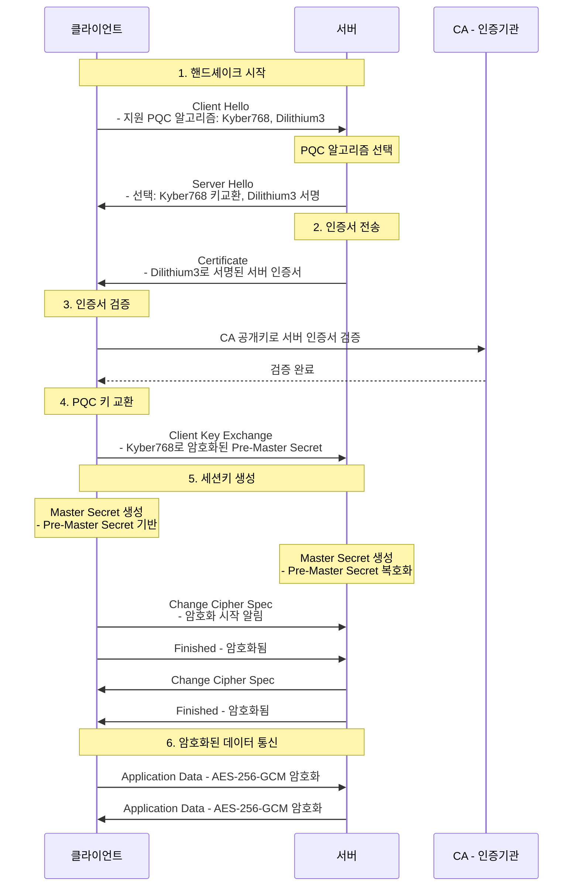
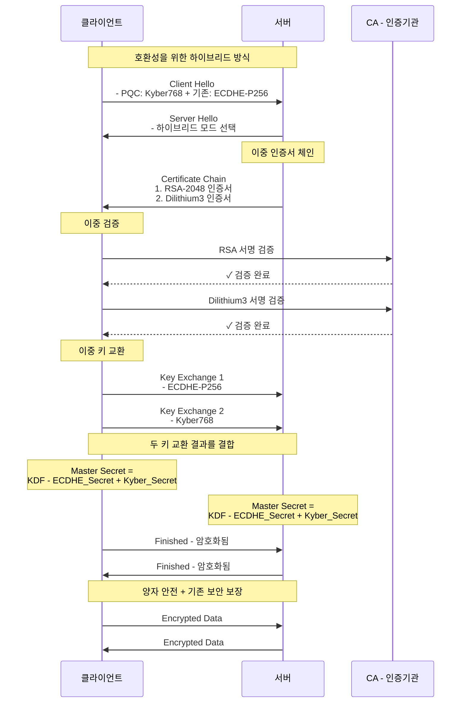
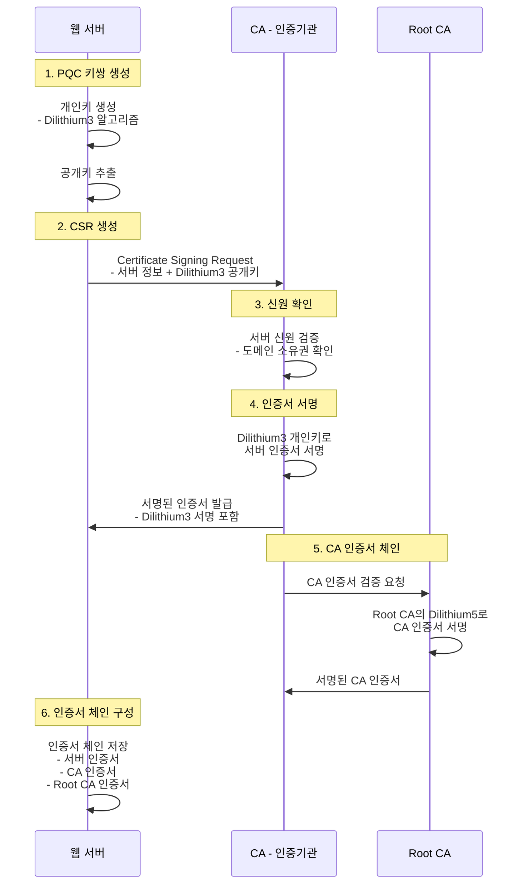
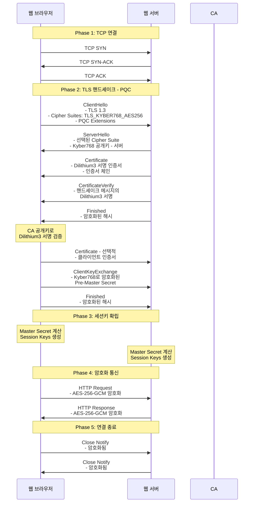

# PQC SSL/TLS 통신 시퀀스 다이어그램

## 📘 개요

양자내성암호(Post-Quantum Cryptography)가 적용된 SSL/TLS 핸드셰이크 과정을 시퀀스 다이어그램으로 상세하게 설명합니다.

## 1️⃣ 기본 PQC SSL/TLS 핸드셰이크

### 시퀀스 다이어그램

### 주요 단계 설명

**1단계 - Client Hello**
- 클라이언트가 지원하는 PQC 알고리즘 목록(Kyber, Dilithium 등)을 서버에 전송

**2단계 - Server Hello**
- 서버가 사용할 PQC 알고리즘 선택 (키교환: Kyber768, 서명: Dilithium3)

**3단계 - Certificate**
- Dilithium3 알고리즘으로 서명된 서버 인증서 전송

**4단계 - 인증서 검증**
- CA의 PQC 공개키로 서버 인증서의 Dilithium3 서명 검증

**5단계 - Key Exchange**
- Kyber768 알고리즘으로 Pre-Master Secret 암호화하여 전송

**6단계 - 세션키 생성**
- 양쪽에서 동일한 Master Secret(대칭키) 생성

**7단계 - 데이터 통신**
- 생성된 대칭키(AES)로 실제 데이터 암호화 통신

## 2️⃣ 하이브리드 모드 (PQC + 기존 알고리즘)

### 시퀀스 다이어그램

### 하이브리드 모드의 장점

- **하위 호환성**: 기존 시스템과의 호환성 유지
- **이중 보안**: 기존 알고리즘 + PQC 알고리즘 동시 적용
- **점진적 전환**: PQC로의 단계적 마이그레이션 가능
- **안전성 보장**: 하나의 알고리즘이 깨져도 다른 알고리즘으로 보호

## 3️⃣ PQC 인증서 발급 과정

### 시퀀스 다이어그램

### PQC 인증서 구조

| 구성요소 | PQC 알고리즘 | 기존 알고리즘 |
|---------|------------|-------------|
| 서버 인증서 서명 | Dilithium3 | RSA-2048 |
| CA 인증서 서명 | Dilithium3 | RSA-4096 |
| Root CA 서명 | Dilithium5 | RSA-4096 |
| 키 교환 | Kyber768 | ECDHE-P256 |
| 대칭키 암호화 | AES-256-GCM (양자 안전) | AES-256-GCM |

## 4️⃣ 전체 PQC SSL/TLS 통신 흐름 (상세)

### 시퀀스 다이어그램

## 5️⃣ PQC 알고리즘 특성 비교

### 서명 알고리즘 (인증서용)

| 알고리즘 | 공개키 크기 | 서명 크기 | 보안 수준 | 특징 |
|---------|-----------|---------|---------|-----|
| **Dilithium2** | 1,312 bytes | 2,420 bytes | NIST Level 2 | 빠른 속도, 작은 크기 |
| **Dilithium3** | 1,952 bytes | 3,293 bytes | NIST Level 3 | 균형잡힌 선택 (권장) |
| **Dilithium5** | 2,592 bytes | 4,595 bytes | NIST Level 5 | 최고 보안 |
| **Falcon512** | 897 bytes | 666 bytes | NIST Level 1 | 가장 작은 서명 |

### 키 교환 알고리즘 (핸드셰이크용)

| 알고리즘 | 공개키 크기 | 암호문 크기 | 보안 수준 | 특징 |
|---------|-----------|-----------|---------|-----|
| **Kyber512** | 800 bytes | 768 bytes | NIST Level 1 | 빠른 처리 |
| **Kyber768** | 1,184 bytes | 1,088 bytes | NIST Level 3 | 권장 (AES-128 수준) |
| **Kyber1024** | 1,568 bytes | 1,568 bytes | NIST Level 5 | 최고 보안 (AES-256 수준) |

### 알고리즘 선택 가이드

- **일반 웹사이트**: Dilithium3 + Kyber768 (권장)
- **금융/의료 시스템**: Dilithium5 + Kyber1024 (최고 보안)
- **IoT/모바일**: Dilithium2 + Kyber512 (경량)
- **하이브리드**: 기존 알고리즘 + PQC (전환기)

## 🔗 관련 문서

- [Q-TLS-OVERVIEW.md](./Q-TLS-OVERVIEW.md) - Q-TLS 개요
- [Q-TLS-ARCHITECTURE.md](./Q-TLS-ARCHITECTURE.md) - Q-TLS 아키텍처
- [HANDSHAKE-PROTOCOL.md](./HANDSHAKE-PROTOCOL.md) - 핸드셰이크 프로토콜 상세
- [CERTIFICATE-MANAGEMENT.md](./CERTIFICATE-MANAGEMENT.md) - PQC 인증서 관리
- [CIPHER-SUITES.md](./CIPHER-SUITES.md) - 암호화 스위트 설정

---

**Last Updated**: 2025-11-20
**Version**: 1.0.0
**Security Level**: PQC - NIST FIPS 203/204
**Algorithms**: Kyber (KEM), Dilithium (Signature)
