# Q-TLS 아키텍처 (Q-TLS Architecture)

> **Q-TLS (Quantum-resistant Transport Security Layer)** 전체 아키텍처 및 계층 구조 설계 문서

---

## 📑 목차

1. [전체 아키텍처 개요](#1-전체-아키텍처-개요)
2. [계층 구조 (OSI 모델 기반)](#2-계층-구조-osi-모델-기반)
3. [하이브리드 암호화 모델 설계](#3-하이브리드-암호화-모델-설계)
4. [키 교환 메커니즘 (KYBER1024 + ECDHE)](#4-키-교환-메커니즘-kyber1024--ecdhe)
5. [서명 알고리즘 (DILITHIUM3 + ECDSA/RSA)](#5-서명-알고리즘-dilithium3--ecdsarsa)
6. [암호화 스위트 아키텍처](#6-암호화-스위트-아키텍처)
7. [인증서 체인 및 PKI](#7-인증서-체인-및-pki)
8. [세션 관리 아키텍처](#8-세션-관리-아키텍처)
9. [HSM 통합 아키텍처](#9-hsm-통합-아키텍처)

---

## 1. 전체 아키텍처 개요

### 1.1 Q-TLS 아키텍처 전체 다이어그램

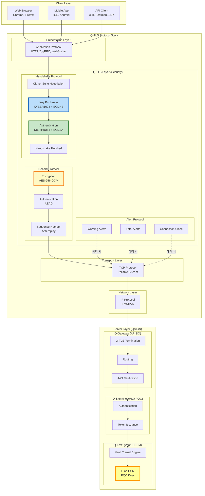

### 1.2 Q-TLS 시스템 컴포넌트

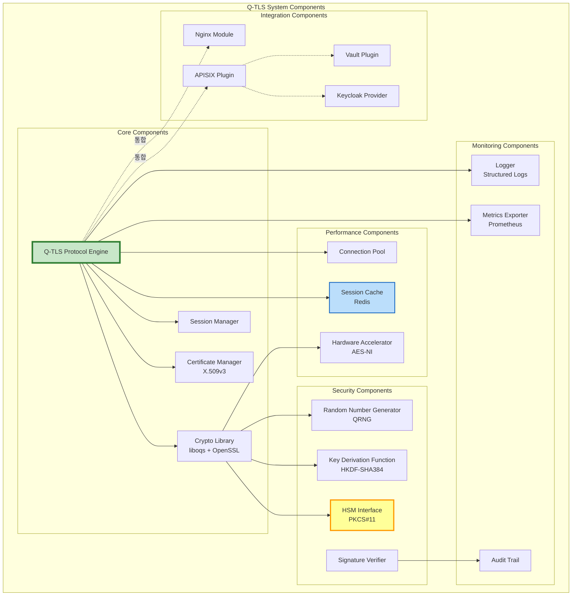

### 1.3 데이터 흐름 아키텍처

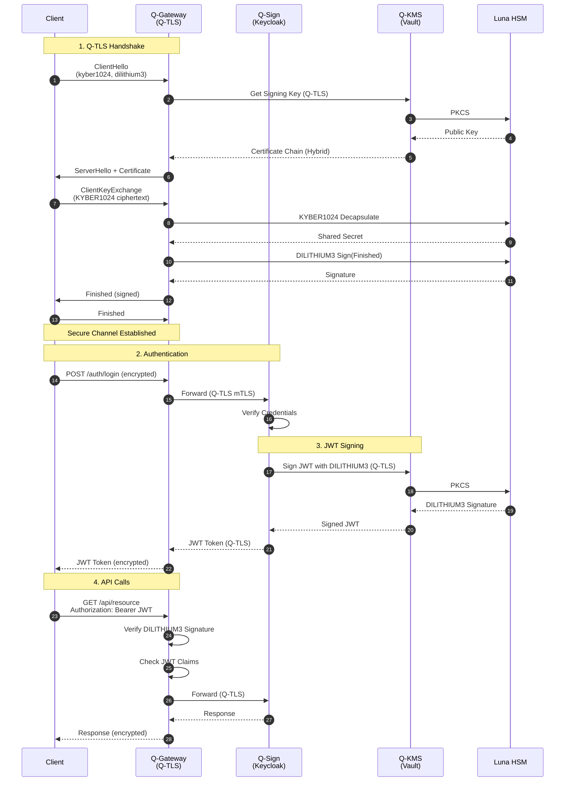

---

## 2. 계층 구조 (OSI 모델 기반)

### 2.1 OSI 7계층과 Q-TLS 매핑

```mermaid
graph TB
    subgraph "OSI 7 Layer Model + Q-TLS"
        subgraph "Layer 7: Application"
            L7_HTTP[HTTP/2, HTTP/3]
            L7_GRPC[gRPC]
            L7_WS[WebSocket]
        end

        subgraph "Layer 6: Presentation"
            L6_ENC[Data Encoding<br/>JSON, Protobuf]
            L6_COMP[Compression<br/>gzip, brotli]
        end

        subgraph "Layer 5: Session"
            L5_SESS[Session Management]
            L5_RESUME[Session Resumption]
        end

        subgraph "Q-TLS Layer (4.5)"
            subgraph "Handshake Sublayer"
                QTSL_HS[Handshake Protocol]
                QTSL_NEG[Cipher Negotiation]
                QTSL_KE[Key Exchange]
                QTSL_AUTH[Authentication]
            end

            subgraph "Record Sublayer"
                QTSL_REC[Record Protocol]
                QTSL_ENC[Encryption<br/>AES-256-GCM]
                QTSL_MAC[MAC/AEAD]
                QTSL_FRAG[Fragmentation]
            end

            subgraph "Alert Sublayer"
                QTSL_ALERT[Alert Protocol]
            end

            subgraph "CCS Sublayer"
                QTSL_CCS[ChangeCipherSpec]
            end
        end

        subgraph "Layer 4: Transport"
            L4_TCP[TCP]
            L4_UDP["UDP - QUIC"]
        end

        subgraph "Layer 3: Network"
            L3_IP[IPv4/IPv6]
        end

        subgraph "Layer 2: Data Link"
            L2_ETH[Ethernet]
        end

        subgraph "Layer 1: Physical"
            L1_PHY[Physical Medium]
        end
    end

    L7_HTTP & L7_GRPC & L7_WS --> L6_ENC
    L6_ENC --> L6_COMP
    L6_COMP --> L5_SESS
    L5_SESS --> L5_RESUME

    L5_RESUME --> QTSL_HS
    QTSL_HS --> QTSL_NEG
    QTSL_NEG --> QTSL_KE
    QTSL_KE --> QTSL_AUTH

    QTSL_AUTH --> QTSL_REC
    QTSL_REC --> QTSL_ENC
    QTSL_ENC --> QTSL_MAC
    QTSL_MAC --> QTSL_FRAG

    QTSL_ALERT -.->|에러| QTSL_REC
    QTSL_CCS -.->|상태 변경| QTSL_REC

    QTSL_FRAG --> L4_TCP
    L4_TCP --> L3_IP
    L3_IP --> L2_ETH
    L2_ETH --> L1_PHY

    style QTSL_KE fill:#bbdefb,stroke:#1565c0,stroke-width:3px
    style QTSL_AUTH fill:#c8e6c9,stroke:#2e7d32,stroke-width:3px
    style QTSL_ENC fill:#fff9c4,stroke:#f57f17,stroke-width:2px
```

### 2.2 Q-TLS 프로토콜 스택 상세

```yaml
Q-TLS 프로토콜 스택:

  Application Layer (Layer 7):
    프로토콜:
      - HTTP/2 (RFC 7540)
      - HTTP/3 over QUIC
      - gRPC (Google RPC)
      - WebSocket (RFC 6455)

    역할:
      - 비즈니스 로직
      - API 엔드포인트
      - 데이터 처리

  Presentation Layer (Layer 6):
    인코딩:
      - JSON
      - Protocol Buffers (Protobuf)
      - MessagePack

    압축:
      - gzip
      - brotli
      - zstd

  Session Layer (Layer 5):
    세션 관리:
      - 세션 수립 및 종료
      - 세션 재개 (Session Resumption)
      - 0-RTT 데이터 전송

  Q-TLS Layer (Layer 4.5):
    서브레이어:
      1. Handshake Protocol:
         - Cipher Suite 협상
         - 키 교환 (KYBER1024 + ECDHE)
         - 서버/클라이언트 인증 (DILITHIUM3 + ECDSA)
         - Finished 메시지

      2. Record Protocol:
         - 데이터 분할 (Fragmentation)
         - 압축 (선택사항)
         - 암호화 (AES-256-GCM)
         - MAC/AEAD (HMAC-SHA384 또는 GCM)
         - 시퀀스 번호 (Anti-replay)

      3. Alert Protocol:
         - Warning Alerts
         - Fatal Alerts
         - Close Notify

      4. ChangeCipherSpec Protocol:
         - 암호 스위트 전환 시그널

  Transport Layer (Layer 4):
    프로토콜:
      - TCP (Transmission Control Protocol)
      - UDP (QUIC용)

    역할:
      - 신뢰성 있는 전송
      - 흐름 제어
      - 혼잡 제어

  Network Layer (Layer 3):
    프로토콜:
      - IPv4
      - IPv6

  Data Link Layer (Layer 2):
    프로토콜:
      - Ethernet
      - Wi-Fi (802.11)

  Physical Layer (Layer 1):
    - 물리적 전송 매체
```

### 2.3 Q-TLS 상태 머신

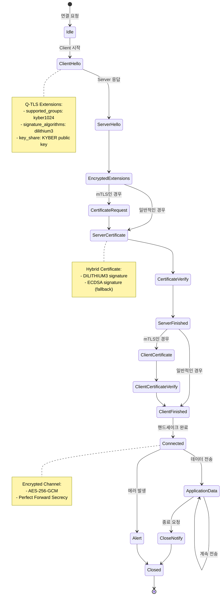

---

## 3. 하이브리드 암호화 모델 설계

### 3.1 하이브리드 모델 개념도

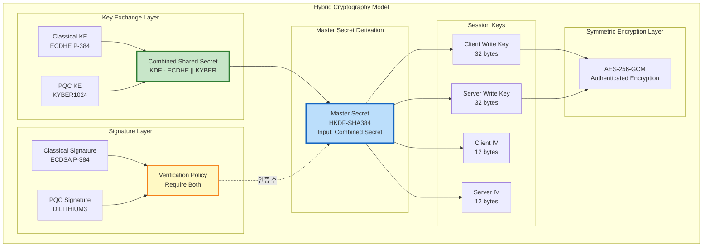

### 3.2 하이브리드 알고리즘 조합

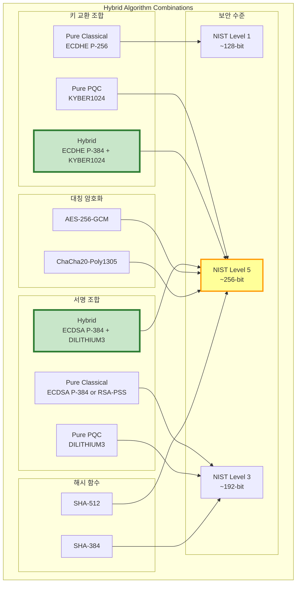

#### 권장 하이브리드 조합

```yaml
Q-TLS 권장 Hybrid 설정:

  Tier 1: Maximum Security (권장)
    키 교환:
      - KYBER1024 (NIST Level 5)
      - ECDHE P-384 (Classical)
      - 결합: KDF-SHA384(kyber_secret || ecdhe_secret)

    서명:
      - DILITHIUM3 (NIST Level 3)
      - ECDSA P-384 (Classical)
      - 검증: Both Required

    대칭 암호화:
      - AES-256-GCM (AEAD)

    해시:
      - SHA-384 (HKDF, HMAC)

    보안 수준:
      - 양자 내성: NIST Level 5
      - Classical 보안: ~192-bit
      - 전체 보안: min(256, 192) = 192-bit effective

    성능:
      - 핸드셰이크: ~75-100ms
      - CPU 오버헤드: ~15-20%

  Tier 2: Balanced (호환성 우선)
    키 교환:
      - KYBER768 (NIST Level 3)
      - ECDHE P-256 (Classical)

    서명:
      - DILITHIUM2 (NIST Level 2)
      - ECDSA P-256 (Classical)

    대칭 암호화:
      - AES-128-GCM

    해시:
      - SHA-256

    보안 수준:
      - 양자 내성: NIST Level 3
      - Classical 보안: ~128-bit
      - 전체 보안: ~128-bit effective

    성능:
      - 핸드셰이크: ~50-70ms
      - CPU 오버헤드: ~10-15%

  Tier 3: Legacy Fallback (레거시 지원)
    키 교환:
      - ECDHE P-256

    서명:
      - ECDSA P-256 or RSA-PSS 2048

    대칭 암호화:
      - AES-128-GCM

    해시:
      - SHA-256

    보안 수준:
      - 양자 내성: 없음
      - Classical 보안: ~128-bit

    성능:
      - 핸드셰이크: ~30-50ms
      - CPU 오버헤드: Baseline

선택 기준:
  - 정부/금융: Tier 1 (최대 보안)
  - 일반 기업: Tier 2 (균형)
  - 레거시 지원: Tier 3 (필요시만)
```

### 3.3 하이브리드 보안 분석

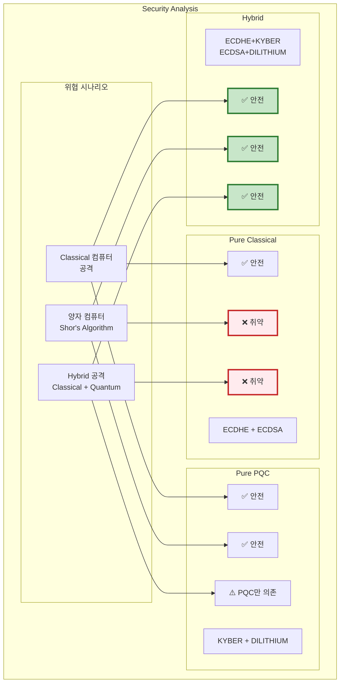

**보안 정리**:

| 공격 시나리오 | Pure Classical | Pure PQC | Hybrid |
|--------------|----------------|----------|--------|
| Classical 컴퓨터 | ✅ 안전 | ✅ 안전 | ✅ 안전 |
| 양자 컴퓨터 (Shor) | ❌ 취약 | ✅ 안전 | ✅ 안전 |
| Grover's Algorithm | ⚠️ 약화 (키 2배) | ⚠️ 약화 (키 2배) | ⚠️ 약화 (키 2배) |
| PQC 미래 파괴 | N/A | ❌ 취약 | ✅ Classical 보호 |
| Hybrid 공격 | ❌ 취약 | ⚠️ PQC만 의존 | ✅ 이중 보호 |
| **전체 평가** | 🔴 미래 위험 | 🟡 신기술 위험 | 🟢 최대 보안 |

---

## 4. 키 교환 메커니즘 (KYBER1024 + ECDHE)

### 4.1 키 교환 아키텍처

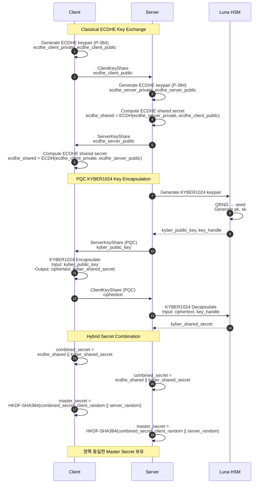

### 4.2 KYBER1024 KEM 상세

```yaml
KYBER1024 키 캡슐화 메커니즘 (KEM):

  파라미터:
    알고리즘: Kyber1024 (ML-KEM-1024)
    보안 수준: NIST Level 5 (AES-256 equivalent)
    기반 문제: Module-LWE (Learning With Errors over Modules)

  키 크기:
    공개키 (pk): 1,568 bytes
    비밀키 (sk): 3,168 bytes
    암호문 (ciphertext): 1,568 bytes
    공유 비밀 (shared secret): 32 bytes

  작동 과정:

    1. KeyGen() → (pk, sk):
       - HSM에서 QRNG로 랜덤 시드 생성
       - Module-LWE 파라미터로 키 쌍 생성
       - sk는 HSM 내부에 저장 (절대 외부 반출 불가)
       - pk는 서버 인증서에 포함

    2. Encapsulate(pk) → (ciphertext, shared_secret):
       - 클라이언트가 랜덤 메시지 m 생성 (32 bytes)
       - pk를 사용하여 m을 암호화 → ciphertext
       - shared_secret = H(m) (SHA3-256)
       - 서버에 ciphertext 전송

    3. Decapsulate(ciphertext, sk) → shared_secret:
       - HSM이 sk로 ciphertext 복호화 → m'
       - 에러 정정으로 m 복원
       - shared_secret = H(m)

  보안 특성:
    - IND-CCA2 보안 (Indistinguishability under Adaptive Chosen Ciphertext Attack)
    - Perfect Forward Secrecy (임시 키 사용)
    - 양자 컴퓨터 공격 내성 (Shor's Algorithm 불가)

  성능 (Intel Xeon Gold 6248R):
    - KeyGen: ~0.1 ms (~10,000 keypairs/sec)
    - Encapsulate: ~0.15 ms (~8,000 ops/sec)
    - Decapsulate: ~0.18 ms (~8,000 ops/sec)

  Q-TLS 사용:
    - 각 TLS 세션마다 새로운 KYBER1024 키 쌍 생성 (Ephemeral)
    - 세션 종료 후 즉시 키 삭제
    - HSM에서 하드웨어 가속
```

### 4.3 ECDHE 키 교환 상세

```yaml
ECDHE (Elliptic Curve Diffie-Hellman Ephemeral):

  파라미터:
    곡선: secp384r1 (NIST P-384)
    보안 수준: ~192-bit (Classical)
    기반 문제: 타원곡선 이산대수 문제 (ECDLP)

  키 크기:
    공개키: 97 bytes (압축 형식) 또는 193 bytes (비압축)
    비밀키: 48 bytes
    공유 비밀: 48 bytes

  작동 과정:

    1. KeyGen() → (private, public):
       - 랜덤 스칼라 d ∈ [1, n-1] 생성 (private key)
       - Q = d·G 계산 (public key, G는 기저점)

    2. 공유 비밀 계산:
       - 클라이언트: shared = client_private · server_public
       - 서버: shared = server_private · client_public
       - 양쪽 동일: shared = (client_private · server_private) · G

  보안 특성:
    - 양자 컴퓨터에 취약 (Shor's Algorithm으로 ECDLP 해결)
    - Classical 컴퓨터에는 안전 (지수 시간 복잡도)
    - Perfect Forward Secrecy (임시 키)

  성능:
    - KeyGen: ~0.5 ms
    - Shared Secret 계산: ~0.8 ms

  Q-TLS에서 역할:
    - Hybrid 모드에서 Classical 백업
    - KYBER가 미래에 파괴되어도 현재는 안전
    - 레거시 시스템 호환성
```

### 4.4 하이브리드 키 결합 (KDF)

```python
# 하이브리드 키 유도 함수 (의사 코드)

def hybrid_key_derivation(
    kyber_shared_secret: bytes,  # 32 bytes
    ecdhe_shared_secret: bytes,  # 48 bytes (P-384)
    client_random: bytes,        # 32 bytes
    server_random: bytes         # 32 bytes
) -> dict:
    """
    Hybrid 키 유도 함수

    Returns:
        dict with keys:
            - master_secret (48 bytes)
            - client_write_key (32 bytes)
            - server_write_key (32 bytes)
            - client_write_iv (12 bytes)
            - server_write_iv (12 bytes)
    """

    # Step 1: 공유 비밀 결합
    # combined_secret = KYBER || ECDHE
    combined_secret = kyber_shared_secret + ecdhe_shared_secret  # 80 bytes

    # Step 2: 추가 엔트로피
    entropy = client_random + server_random  # 64 bytes

    # Step 3: HKDF-Extract (RFC 5869)
    # PRK = HMAC-Hash(salt, IKM)
    prk = hmac_sha384(
        salt=entropy,
        data=combined_secret
    )  # 48 bytes (SHA-384 output)

    # Step 4: HKDF-Expand for Master Secret
    info_master = b"Q-TLS 1.0 master secret"
    master_secret = hkdf_expand_sha384(
        prk=prk,
        info=info_master,
        length=48
    )

    # Step 5: HKDF-Expand for Session Keys
    info_keys = b"Q-TLS 1.0 key expansion"
    key_material = hkdf_expand_sha384(
        prk=master_secret,
        info=info_keys + client_random + server_random,
        length=88  # 32 + 32 + 12 + 12
    )

    # Step 6: 키 분할
    client_write_key = key_material[0:32]   # AES-256 key
    server_write_key = key_material[32:64]  # AES-256 key
    client_write_iv = key_material[64:76]   # GCM IV
    server_write_iv = key_material[76:88]   # GCM IV

    return {
        'master_secret': master_secret,
        'client_write_key': client_write_key,
        'server_write_key': server_write_key,
        'client_write_iv': client_write_iv,
        'server_write_iv': server_write_iv
    }

# HKDF-Expand 의사 코드
def hkdf_expand_sha384(prk, info, length):
    """
    HKDF-Expand (RFC 5869)
    """
    t = b""
    okm = b""
    i = 0

    while len(okm) < length:
        i += 1
        t = hmac_sha384(prk, t + info + bytes([i]))
        okm += t

    return okm[:length]
```

**보안 증명**:
- HKDF는 Random Oracle 모델에서 안전성 증명됨
- 두 알고리즘 중 하나라도 안전하면 전체 시스템 안전:
  - `combined_secret = safe(KYBER) || broken(ECDHE)` → 안전
  - `combined_secret = broken(KYBER) || safe(ECDHE)` → 안전
  - `combined_secret = safe(KYBER) || safe(ECDHE)` → 최대 안전

---

## 5. 서명 알고리즘 (DILITHIUM3 + ECDSA/RSA)

### 5.1 서명 아키텍처

```mermaid
graph TB
    subgraph "Hybrid Signature Architecture"
        subgraph "Signature Generation (Server)"
            SG1[서명 대상<br/>Message to Sign]
            SG2["Hash<br/>SHA-384 - message"]

            subgraph "PQC Path"
                SG_PQC1[DILITHIUM3 Sign]
                SG_PQC2[HSM PKCS#11<br/>C_Sign]
                SG_PQC3[Signature 1<br/>~3,293 bytes]
            end

            subgraph "Classical Path"
                SG_CL1[ECDSA Sign]
                SG_CL2[HSM or Software]
                SG_CL3[Signature 2<br/>~96 bytes]
            end

            SG4[Hybrid Signature<br/>Both Signatures]
        end

        subgraph "Signature Verification (Client)"
            SV1[Hybrid Signature<br/>Received]

            subgraph "PQC Verification"
                SV_PQC1[Extract DILITHIUM3 Signature]
                SV_PQC2[Get Public Key from Cert]
                SV_PQC3[DILITHIUM3 Verify]
                SV_PQC4[Result: Valid/Invalid]
            end

            subgraph "Classical Verification"
                SV_CL1[Extract ECDSA Signature]
                SV_CL2[Get Public Key from Cert]
                SV_CL3[ECDSA Verify]
                SV_CL4[Result: Valid/Invalid]
            end

            SV5[Policy Check<br/>Require Both]
            SV6[Final Result<br/>Accept/Reject]
        end
    end

    SG1 --> SG2

    SG2 --> SG_PQC1
    SG_PQC1 --> SG_PQC2
    SG_PQC2 --> SG_PQC3

    SG2 --> SG_CL1
    SG_CL1 --> SG_CL2
    SG_CL2 --> SG_CL3

    SG_PQC3 --> SG4
    SG_CL3 --> SG4

    SG4 -.->|전송| SV1

    SV1 --> SV_PQC1
    SV_PQC1 --> SV_PQC2
    SV_PQC2 --> SV_PQC3
    SV_PQC3 --> SV_PQC4

    SV1 --> SV_CL1
    SV_CL1 --> SV_CL2
    SV_CL2 --> SV_CL3
    SV_CL3 --> SV_CL4

    SV_PQC4 --> SV5
    SV_CL4 --> SV5

    SV5 --> SV6

    style SG_PQC2 fill:#ffff99,stroke:#ff9900,stroke-width:3px
    style SV5 fill:#c8e6c9,stroke:#2e7d32,stroke-width:3px
```

### 5.2 DILITHIUM3 서명 상세

```yaml
DILITHIUM3 디지털 서명 알고리즘:

  파라미터:
    알고리즘: Dilithium3 (ML-DSA-65)
    표준: NIST FIPS 204
    보안 수준: NIST Level 3 (AES-192 equivalent)
    기반 문제: Module-LWE + Fiat-Shamir

  키 크기:
    공개키: 1,952 bytes
    비밀키: ~4,000 bytes (HSM 내부)
    서명: ~3,293 bytes

  서명 생성 (Sign):
    Input:
      - 메시지 m
      - 비밀키 sk (s1, s2)

    Process:
      1. 랜덤 마스킹 벡터 y 생성
      2. w = A·y mod q 계산
      3. 챌린지 c = H(w || m) (해시)
      4. z = y + c·s1 계산
      5. Rejection Sampling: ||z||가 너무 크면 재시도
      6. 힌트 h = MakeHint(w - c·s2)
      7. 서명 σ = (z, h, c)

    Output:
      - 서명 σ (~3,293 bytes)

    Rejection Sampling:
      - 목적: z가 s1에 대한 정보 누출 방지
      - z의 분포가 s1과 독립적
      - 평균 재시도: ~4.5회

  서명 검증 (Verify):
    Input:
      - 메시지 m
      - 서명 σ = (z, h, c)
      - 공개키 pk (t, seed)

    Process:
      1. w' = A·z - c·t mod q
      2. w' = UseHint(h, w')
      3. c' = H(w' || m)
      4. 검증: c == c' AND ||z|| ≤ threshold

    Output:
      - Valid / Invalid

  성능 (Intel Xeon Gold 6248R):
    - KeyGen: ~0.8 ms (~1,200 keypairs/sec)
    - Sign: ~1.4 ms (~700 signs/sec)
    - Verify: ~0.7 ms (~1,400 verifies/sec)

  보안 특성:
    - EUF-CMA 보안 (Existential Unforgeability under Chosen Message Attack)
    - 양자 컴퓨터 내성
    - Stateless (상태 없음, 관리 간소)

  Q-TLS 사용처:
    - 서버 인증서 서명 (Certificate)
    - CertificateVerify 메시지 서명
    - Finished 메시지 서명
    - Session Ticket 서명
```

### 5.3 ECDSA 서명 상세

```yaml
ECDSA (Elliptic Curve Digital Signature Algorithm):

  파라미터:
    곡선: secp384r1 (NIST P-384)
    보안 수준: ~192-bit (Classical)
    기반 문제: 타원곡선 이산대수 문제 (ECDLP)

  키 크기:
    공개키: 97 bytes (압축) / 193 bytes (비압축)
    비밀키: 48 bytes
    서명: ~96 bytes (r, s 각 48 bytes)

  서명 생성:
    1. e = H(m) (SHA-384)
    2. 랜덤 k ∈ [1, n-1] 선택
    3. (x, y) = k·G (타원곡선 점 곱셈)
    4. r = x mod n
    5. s = k^(-1) · (e + r·d) mod n
    6. 서명 = (r, s)

  서명 검증:
    1. e = H(m)
    2. u1 = e·s^(-1) mod n
    3. u2 = r·s^(-1) mod n
    4. (x', y') = u1·G + u2·Q (Q는 공개키)
    5. 검증: r == x' mod n

  성능:
    - Sign: ~1.2 ms
    - Verify: ~0.3 ms

  보안:
    - 양자 컴퓨터에 취약 (Shor's Algorithm)
    - Classical 컴퓨터에는 안전

  Q-TLS에서 역할:
    - Hybrid 모드에서 Classical 백업
    - 레거시 클라이언트 호환성
```

### 5.4 하이브리드 서명 검증 정책

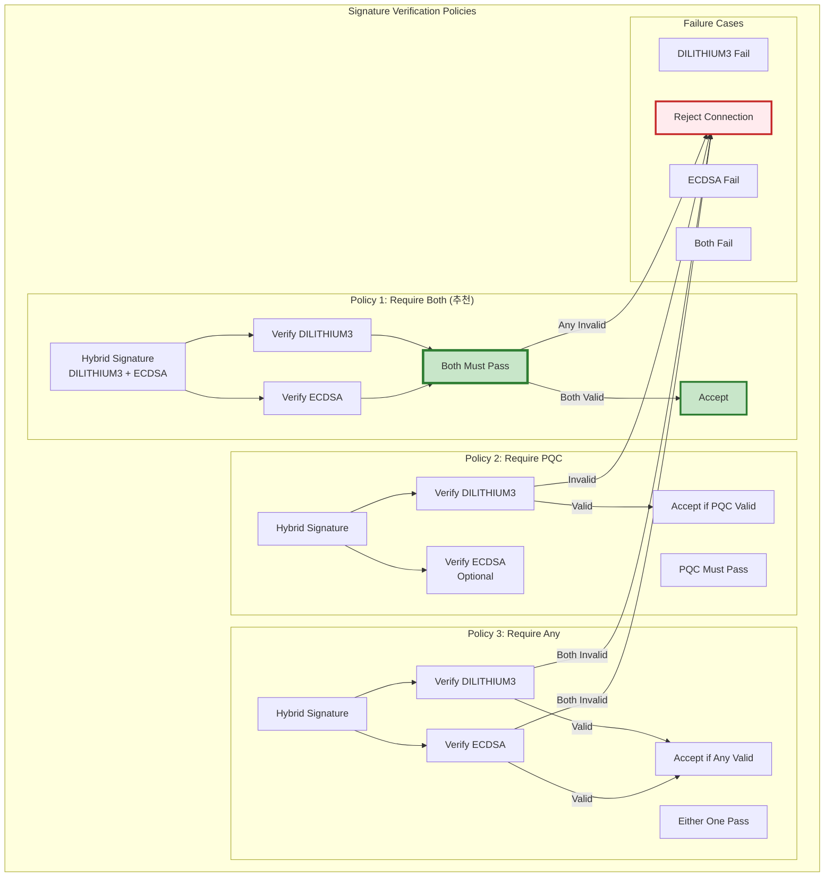

**Q-TLS 기본 정책: Policy 1 (Require Both)**

```yaml
Policy 1: Require Both (최대 보안):
  검증 조건:
    - DILITHIUM3 서명 검증 성공 AND
    - ECDSA 서명 검증 성공

  장점:
    - 최대 보안 (둘 중 하나가 파괴되어도 안전)
    - 양자 + Classical 이중 보호
    - 감사 요구사항 충족

  단점:
    - 인증서 크기 증가 (~3,500 bytes)
    - 검증 시간 증가 (~2 ms)

  사용 사례:
    - 프로덕션 환경 (기본값)
    - 정부/금융 시스템
    - 고보안 API

Policy 2: Require PQC (PQC 우선):
  검증 조건:
    - DILITHIUM3 서명 검증 성공
    - ECDSA는 선택사항

  장점:
    - 양자 내성 보장
    - PQC 전환 가속화

  단점:
    - 레거시 호환성 감소

  사용 사례:
    - Pure PQC 전환 단계
    - 신규 시스템

Policy 3: Require Any (최대 호환성):
  검증 조건:
    - DILITHIUM3 OR ECDSA 중 하나만 성공

  장점:
    - 최대 호환성
    - 점진적 전환 용이

  단점:
    - 보안 수준 낮음
    - 권장하지 않음

  사용 사례:
    - 레거시 시스템 지원 (임시)
    - 테스트 환경
```

---

## 6. 암호화 스위트 아키텍처

### 6.1 암호화 스위트 구조

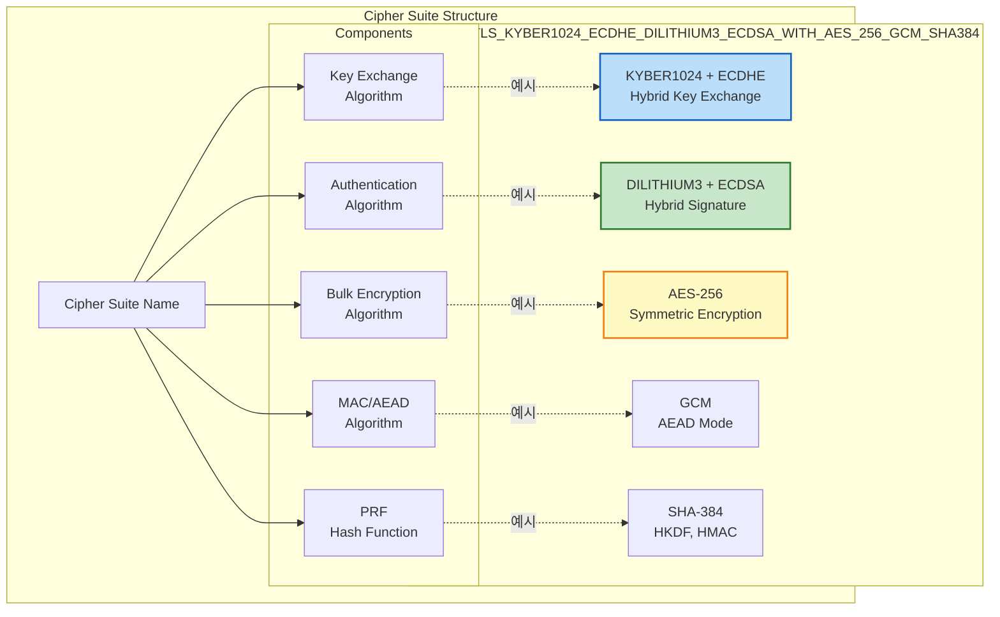

### 6.2 지원 암호화 스위트 목록

```yaml
Q-TLS 지원 Cipher Suites (우선순위 순):

  Tier 1: Pure PQC Hybrid (최고 보안)
    1. TLS_KYBER1024_DILITHIUM3_WITH_AES_256_GCM_SHA384
       - Key Exchange: KYBER1024 (NIST Level 5)
       - Signature: DILITHIUM3 (NIST Level 3)
       - Encryption: AES-256-GCM
       - Hash: SHA-384
       - 보안 수준: ~256-bit (PQC)
       - 성능: Handshake ~120ms

  Tier 2: Classical + PQC Hybrid (권장)
    2. TLS_ECDHE_KYBER1024_ECDSA_DILITHIUM3_WITH_AES_256_GCM_SHA384
       - Key Exchange: ECDHE P-384 + KYBER1024
       - Signature: ECDSA P-384 + DILITHIUM3
       - Encryption: AES-256-GCM
       - Hash: SHA-384
       - 보안 수준: max(192-bit Classical, 256-bit PQC) = 256-bit
       - 성능: Handshake ~75-100ms

    3. TLS_ECDHE_KYBER1024_RSA_DILITHIUM3_WITH_AES_256_GCM_SHA384
       - Key Exchange: ECDHE P-384 + KYBER1024
       - Signature: RSA-PSS 4096 + DILITHIUM3
       - Encryption: AES-256-GCM
       - Hash: SHA-384
       - 보안 수준: 256-bit
       - 성능: Handshake ~80-110ms (RSA 느림)

  Tier 3: Balanced PQC Hybrid (성능 중시)
    4. TLS_ECDHE_KYBER768_ECDSA_DILITHIUM2_WITH_AES_256_GCM_SHA384
       - Key Exchange: ECDHE P-256 + KYBER768
       - Signature: ECDSA P-256 + DILITHIUM2
       - Encryption: AES-256-GCM
       - Hash: SHA-384
       - 보안 수준: ~192-bit
       - 성능: Handshake ~50-70ms

    5. TLS_ECDHE_KYBER768_ECDSA_DILITHIUM2_WITH_AES_128_GCM_SHA256
       - Key Exchange: ECDHE P-256 + KYBER768
       - Signature: ECDSA P-256 + DILITHIUM2
       - Encryption: AES-128-GCM
       - Hash: SHA-256
       - 보안 수준: ~128-bit
       - 성능: Handshake ~45-65ms

  Tier 4: Classical Fallback (레거시 호환)
    6. TLS_ECDHE_ECDSA_WITH_AES_256_GCM_SHA384
       - Key Exchange: ECDHE P-384
       - Signature: ECDSA P-384
       - Encryption: AES-256-GCM
       - Hash: SHA-384
       - 보안 수준: ~192-bit (Classical, 양자 컴퓨터 취약)
       - 성능: Handshake ~35ms

    7. TLS_ECDHE_RSA_WITH_AES_256_GCM_SHA384
       - Key Exchange: ECDHE P-384
       - Signature: RSA-PSS 2048
       - Encryption: AES-256-GCM
       - Hash: SHA-384
       - 보안 수준: ~112-bit (RSA-2048)
       - 성능: Handshake ~40ms

    8. TLS_ECDHE_ECDSA_WITH_CHACHA20_POLY1305_SHA256
       - Key Exchange: ECDHE P-256
       - Signature: ECDSA P-256
       - Encryption: ChaCha20-Poly1305
       - Hash: SHA-256
       - 보안 수준: ~128-bit
       - 성능: Handshake ~30ms (모바일 최적화)

  금지된 Cipher Suites:
    ❌ TLS_RSA_* (Forward Secrecy 없음)
    ❌ *_CBC_* (패딩 오라클 공격)
    ❌ *_SHA1 (해시 충돌 취약)
    ❌ *_3DES_* (약한 암호화)
    ❌ *_RC4_* (스트림 암호 취약)
    ❌ TLS 1.2 이하 프로토콜
```

### 6.3 암호화 스위트 협상 프로세스

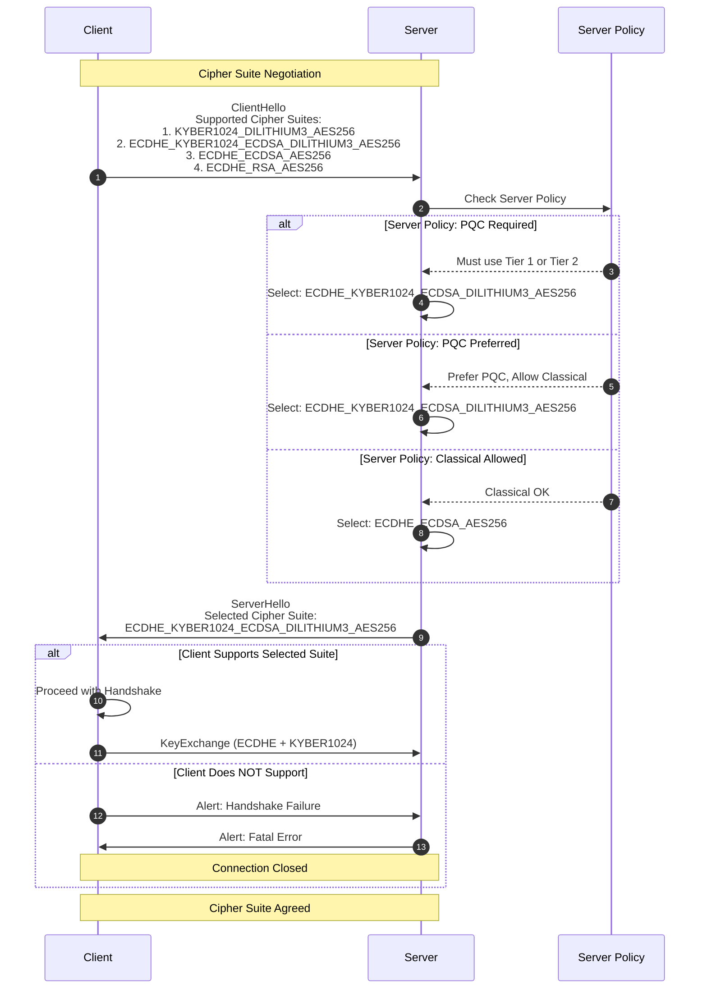

**협상 규칙**:

```yaml
Cipher Suite 협상 규칙:

  1. 우선순위:
     - 서버 우선순위 사용 (Server Preference)
     - 클라이언트 제안 중 서버가 지원하는 가장 높은 우선순위 선택

  2. 보안 정책:
     Strict Mode (고보안):
       - Tier 1-2만 허용
       - PQC 필수
       - Classical Fallback 거부

     Balanced Mode (기본):
       - Tier 1-3 허용
       - PQC 우선, Classical 허용

     Compatible Mode (호환성):
       - Tier 1-4 모두 허용
       - 레거시 클라이언트 지원

  3. 협상 실패 처리:
     - 공통 Cipher Suite 없음 → Alert: Handshake Failure
     - 서버 정책 위반 → Alert: Insufficient Security
     - 클라이언트 재시도 (다른 Cipher Suite 제안)

  4. 다운그레이드 공격 방지:
     - Finished 메시지에 Cipher Suite 해시 포함
     - 클라이언트가 제안한 최고 보안 수준 기록
     - 실제 선택된 수준과 비교하여 다운그레이드 감지
```

### 6.4 암호화 스위트 설정 예제

#### APISIX 설정

```yaml
# /etc/apisix/config.yaml
apisix:
  ssl:
    cipher_suites:
      # Tier 1: Pure PQC Hybrid
      - TLS_KYBER1024_DILITHIUM3_WITH_AES_256_GCM_SHA384

      # Tier 2: Classical + PQC Hybrid (권장)
      - TLS_ECDHE_KYBER1024_ECDSA_DILITHIUM3_WITH_AES_256_GCM_SHA384
      - TLS_ECDHE_KYBER1024_RSA_DILITHIUM3_WITH_AES_256_GCM_SHA384

      # Tier 3: Balanced
      - TLS_ECDHE_KYBER768_ECDSA_DILITHIUM2_WITH_AES_256_GCM_SHA384

      # Tier 4: Classical Fallback (레거시)
      - TLS_ECDHE_ECDSA_WITH_AES_256_GCM_SHA384
      - TLS_ECDHE_RSA_WITH_AES_256_GCM_SHA384

    prefer_server_ciphers: true  # 서버 우선순위 사용

    # 보안 정책
    security_policy: "balanced"  # strict | balanced | compatible

    # TLS 버전
    tls_min_version: "1.3"
    tls_max_version: "1.3"

    # 확장
    supported_groups:
      - kyber1024
      - kyber768
      - x25519
      - secp384r1

    signature_algorithms:
      - dilithium3
      - dilithium2
      - ecdsa_secp384r1
      - rsa_pss_rsae_sha384
```

#### Nginx 설정

```nginx
# /etc/nginx/nginx.conf
http {
    server {
        listen 443 ssl http2;

        # Q-TLS 암호화 스위트
        ssl_ciphers "KYBER1024-DILITHIUM3-AES256-GCM-SHA384:ECDHE-KYBER1024-ECDSA-DILITHIUM3-AES256-GCM-SHA384:ECDHE-ECDSA-AES256-GCM-SHA384";

        ssl_prefer_server_ciphers on;

        # TLS 프로토콜
        ssl_protocols TLSv1.3;

        # 인증서
        ssl_certificate /etc/nginx/certs/server-hybrid.crt;
        ssl_certificate_key pkcs11:token=LunaHSM;object=qtsl-key;

        # DH 파라미터 (ECDHE용)
        ssl_ecdh_curve secp384r1;

        # 세션 캐시
        ssl_session_cache shared:QTSL:50m;
        ssl_session_timeout 1h;
        ssl_session_tickets on;
    }
}
```

---

## 7. 인증서 체인 및 PKI

### 7.1 X.509v3 Hybrid 인증서 구조

```mermaid
graph TB
    subgraph "X.509v3 Hybrid Certificate Structure"
        subgraph "Certificate Header"
            H1[Version: v3]
            H2[Serial Number]
            H3[Validity Period<br/>Not Before/After]
        end

        subgraph "Subject & Issuer"
            S1[Issuer DN<br/>CN=Q-TLS Root CA]
            S2[Subject DN<br/>CN=q-sign.local]
            S3[Subject Alternative Names<br/>DNS, IP]
        end

        subgraph "Public Keys (Hybrid)"
            PK1[DILITHIUM3 Public Key<br/>1,952 bytes]
            PK2[ECDSA P-384 Public Key<br/>97 bytes]
        end

        subgraph "Extensions"
            EXT1[Key Usage<br/>Digital Signature, Key Encipherment]
            EXT2[Extended Key Usage<br/>Server Authentication]
            EXT3[Subject Key Identifier]
            EXT4[Authority Key Identifier]
            EXT5[CRL Distribution Points]
            EXT6[Authority Info Access<br/>OCSP]
        end

        subgraph "Signatures (Hybrid)"
            SIG1[Signature Algorithm: Hybrid<br/>DILITHIUM3 + ECDSA]
            SIG2[DILITHIUM3 Signature<br/>~3,293 bytes]
            SIG3[ECDSA Signature<br/>~96 bytes]
        end
    end

    H1 & H2 & H3 --> S1
    S1 --> S2
    S2 --> S3

    S3 --> PK1
    S3 --> PK2

    PK1 & PK2 --> EXT1
    EXT1 --> EXT2
    EXT2 --> EXT3
    EXT3 --> EXT4
    EXT4 --> EXT5
    EXT5 --> EXT6

    EXT6 --> SIG1
    SIG1 --> SIG2
    SIG1 --> SIG3

    style PK1 fill:#c8e6c9,stroke:#2e7d32,stroke-width:3px
    style SIG2 fill:#bbdefb,stroke:#1565c0,stroke-width:2px
```

### 7.2 PKI 계층 구조

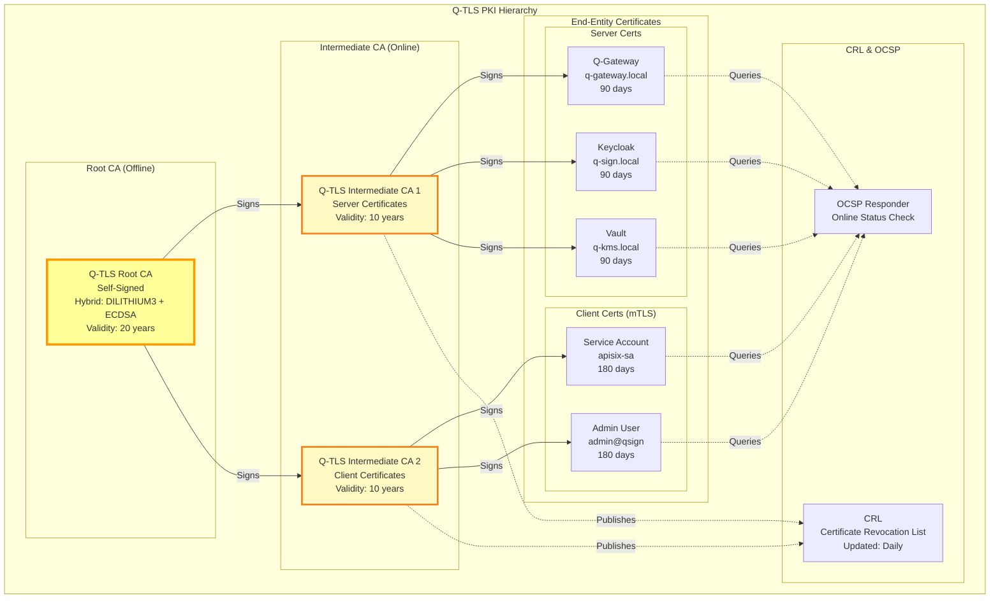

### 7.3 인증서 발급 프로세스

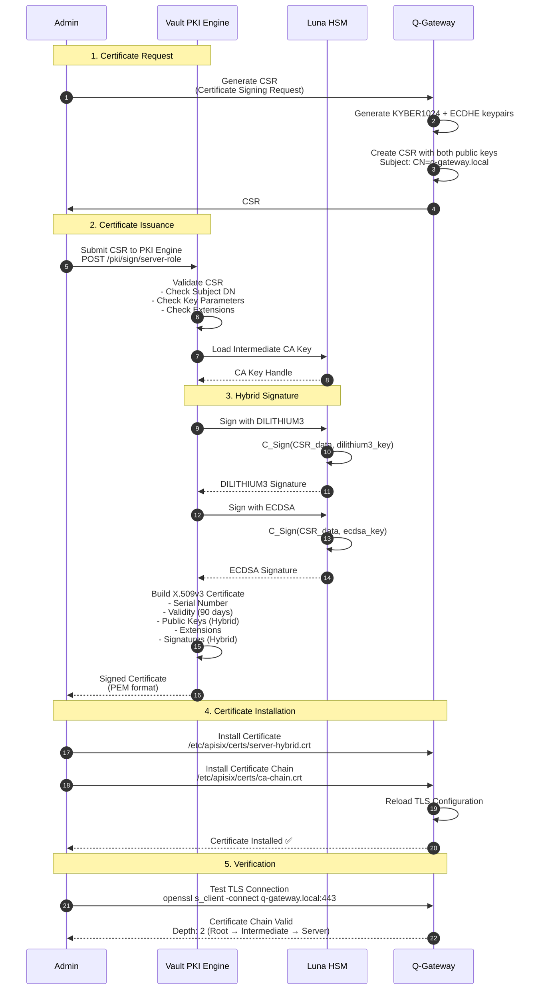

### 7.4 인증서 갱신 및 순환

```yaml
인증서 생명주기 관리:

  자동 갱신 프로세스:
    트리거:
      - 만료 30일 전
      - 매일 자동 체크 (cron)

    단계:
      1. Vault PKI가 인증서 만료 확인
      2. 새로운 키 쌍 생성 (KYBER1024 + ECDHE)
      3. CSR 생성 및 자동 서명
      4. 새 인증서 발급
      5. 서버에 배포 (Kubernetes Secret 업데이트)
      6. Graceful Reload (기존 연결 유지)
      7. 알림 발송 (Slack, Email)

    롤백:
      - 새 인증서 문제 발생 시 자동 롤백
      - 이전 인증서 7일간 보관

  수동 갱신:
    명령어:
      ```bash
      # Vault CLI로 갱신
      vault write pki/issue/server-role \
        common_name="q-gateway.local" \
        alt_names="q-gateway,apisix" \
        ttl="90d"
      ```

  인증서 폐기 (Revocation):
    사유:
      - 개인키 유출
      - 잘못된 발급
      - 서비스 폐기

    프로세스:
      1. Vault에 폐기 요청
      2. CRL (Certificate Revocation List) 업데이트
      3. OCSP Responder 업데이트
      4. 알림 발송

    명령어:
      ```bash
      vault write pki/revoke serial_number="39:dd:2e:90:b7:23"
      ```

  CRL 및 OCSP:
    CRL (Certificate Revocation List):
      - 발행 주기: 매일
      - 배포: HTTP (http://pki.qsign.local/crl)
      - 크기: ~10KB (인증서 100개 기준)

    OCSP (Online Certificate Status Protocol):
      - 엔드포인트: http://ocsp.qsign.local
      - 응답 시간: < 100ms
      - 캐시: 1시간
      - OCSP Stapling: 활성화 (서버가 OCSP 응답 첨부)
```

---

## 8. 세션 관리 아키텍처

### 8.1 세션 생명주기

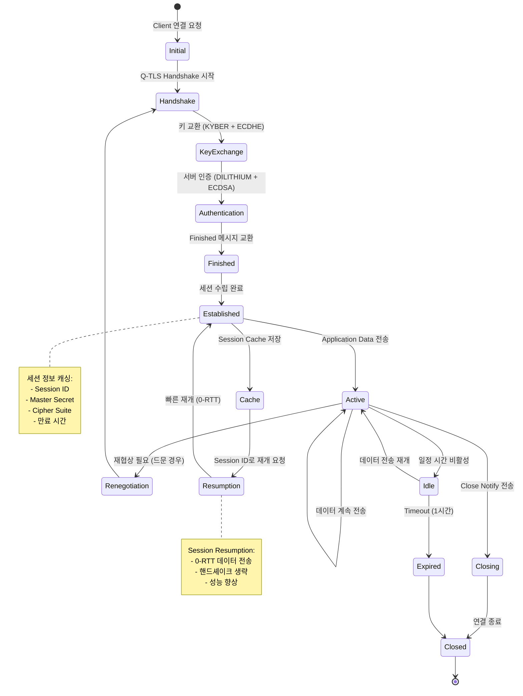

### 8.2 세션 캐시 아키텍처

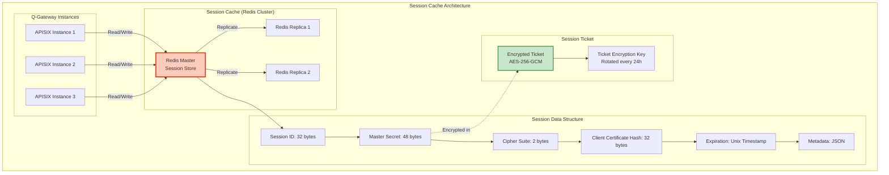

**세션 캐시 설정**:

```yaml
세션 캐시 구성:

  저장소:
    타입: Redis Cluster
    노드: 1 Master + 2 Replicas
    고가용성: Sentinel 모니터링

  캐시 정책:
    최대 크기: 50 MB (~20,000 세션)
    TTL (Time To Live): 1시간
    Eviction Policy: LRU (Least Recently Used)

  세션 데이터 구조:
    키: session:<session_id>
    값:
      ```json
      {
        "session_id": "a1b2c3...",
        "master_secret": "base64_encoded",
        "cipher_suite": 0x1301,
        "client_cert_hash": "sha256_hash",
        "created_at": 1732000000,
        "expires_at": 1732003600,
        "metadata": {
          "client_ip": "192.168.1.100",
          "user_agent": "...",
          "resumption_count": 3
        }
      }
      ```

  성능 메트릭:
    - 캐시 히트율: > 80% 목표
    - 조회 시간: < 5ms
    - 저장 시간: < 10ms

  보안:
    - Redis TLS 연결
    - Redis Auth Password
    - Master Secret 추가 암호화 (선택사항)
```

### 8.3 Session Resumption (세션 재개)

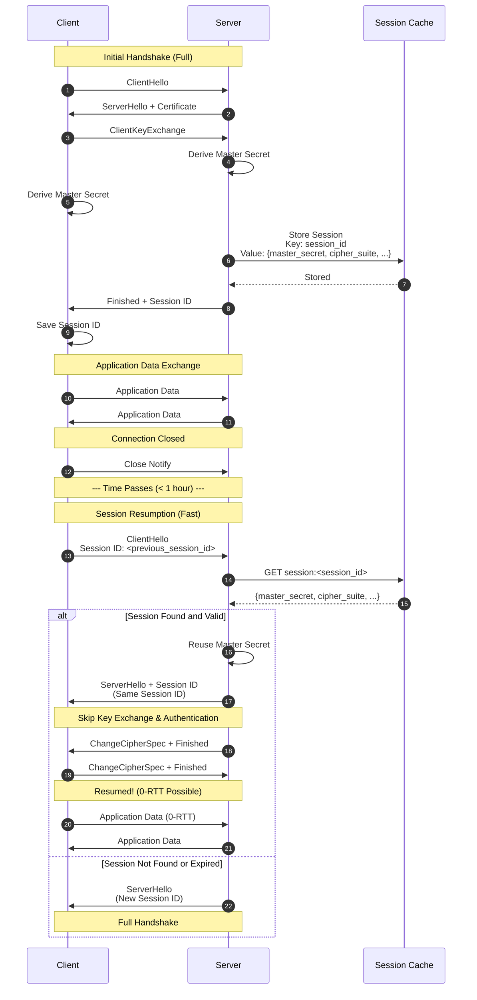

**Session Resumption 이점**:
- 핸드셰이크 시간: ~75ms → ~15ms (**80% 단축**)
- CPU 사용량: ~50% 절감
- 네트워크 왕복: 1-RTT → 0-RTT (세션 티켓 사용 시)
- 전체 처리량: ~3배 향상

### 8.4 Session Ticket

```yaml
Session Ticket (RFC 5077):

  개념:
    - 서버가 세션 상태를 암호화하여 클라이언트에게 전달
    - 서버는 세션 상태를 저장하지 않음 (Stateless)
    - 클라이언트가 티켓을 제시하면 서버가 복호화하여 세션 재개

  장점:
    - 서버 메모리 절약 (세션 캐시 불필요)
    - 수평 확장 용이 (서버 간 세션 공유 불필요)
    - 로드 밸런서 친화적

  단점:
    - 티켓 유출 시 보안 위험
    - Forward Secrecy 약화 (티켓 암호화 키 보호 필요)
    - 정기적인 키 순환 필수

  구현:
    Ticket 구조:
      ```
      +------------------+
      |   Ticket Header  |  (Version, Cipher Suite)
      +------------------+
      |   Session State  |  (Master Secret, Timestamp, ...)
      +------------------+
      |      AEAD Tag    |  (GCM Authentication Tag)
      +------------------+
      ```

    암호화:
      - 알고리즘: AES-256-GCM
      - 키: Ticket Encryption Key (TEK)
      - IV: 랜덤 12 bytes
      - AAD: Ticket Header

    키 순환:
      - 주기: 24시간
      - 다중 키 유지: 현재 키 + 이전 키 (Grace Period)
      - 자동 순환: Vault에서 관리

  보안 고려사항:
    - TEK는 HSM에 저장
    - 티켓 유효 기간: 24시간
    - Anti-replay: 티켓에 Timestamp 포함
    - Forward Secrecy: 주기적 키 순환
```

---

## 9. HSM 통합 아키텍처

### 9.1 Luna HSM 통합 개요

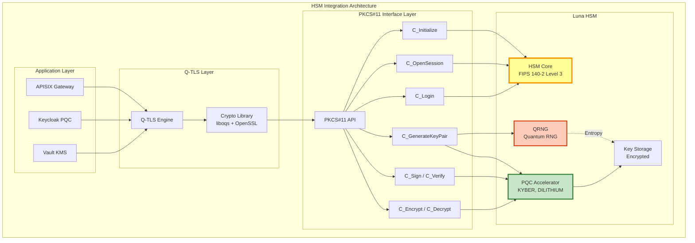

### 9.2 HSM 키 생명주기

```mermaid
sequenceDiagram
    autonumber
    participant Admin
    participant Vault
    participant PKCS11 as PKCS#11 Library
    participant HSM as Luna HSM

    Note over Admin,HSM: 1. HSM Initialization

    Admin->>PKCS11: C_Initialize()<br/>Load HSM library
    PKCS11->>HSM: Connect to HSM
    HSM-->>PKCS11: Session Handle

    Admin->>PKCS11: C_OpenSession(slot=0)
    PKCS11->>HSM: Open Crypto Session
    HSM-->>PKCS11: Session ID

    Admin->>PKCS11: C_Login(USER, PIN)
    PKCS11->>HSM: Authenticate
    HSM-->>PKCS11: Login Success

    Note over Admin,HSM: 2. Key Generation

    Admin->>Vault: Generate PQC Key<br/>POST /transit/keys/dilithium3-key
    Vault->>PKCS11: C_GenerateKeyPair()<br/>Mechanism: CKM_DILITHIUM3

    PKCS11->>HSM: Request Key Generation
    HSM->>HSM: QRNG → Generate Entropy
    HSM->>HSM: DILITHIUM3 KeyGen(entropy)<br/>→ (pk, sk)
    HSM->>HSM: Store sk in Encrypted Storage<br/>(Never exported)
    HSM-->>PKCS11: Public Key + Key Handle

    PKCS11-->>Vault: {public_key, key_handle}
    Vault->>Vault: Store Metadata<br/>Key ID: dilithium3-key<br/>Handle: 0x12345678
    Vault-->>Admin: Key Created ✅

    Note over Admin,HSM: 3. Signing Operation

    Admin->>Vault: Sign JWT<br/>POST /transit/sign/dilithium3-key
    Vault->>PKCS11: C_Sign()<br/>Data: JWT payload<br/>Key Handle: 0x12345678

    PKCS11->>HSM: Sign Request
    HSM->>HSM: Load Private Key (sk)
    HSM->>HSM: DILITHIUM3_Sign(sk, data)<br/>→ signature
    HSM-->>PKCS11: Signature (~3,293 bytes)

    PKCS11-->>Vault: Signature
    Vault-->>Admin: Signed JWT

    Note over Admin,HSM: 4. Key Rotation

    Admin->>Vault: Rotate Key<br/>POST /transit/keys/dilithium3-key/rotate
    Vault->>PKCS11: C_GenerateKeyPair()<br/>New Key Version

    PKCS11->>HSM: Generate New Keypair
    HSM->>HSM: KeyGen → (pk', sk')
    HSM-->>PKCS11: New Public Key + Key Handle'

    Vault->>Vault: Mark Old Key as Archived<br/>(Verification Only)
    Vault->>Vault: Set New Key as Active
    Vault-->>Admin: Key Rotated ✅

    Note over Admin,HSM: 5. Key Deletion (Zeroization)

    Admin->>Vault: Delete Key<br/>DELETE /transit/keys/dilithium3-key
    Vault->>PKCS11: C_DestroyObject(key_handle)

    PKCS11->>HSM: Zeroize Key
    HSM->>HSM: Overwrite Key Storage with Zeros<br/>(FIPS 140-2 Requirement)
    HSM-->>PKCS11: Destroyed

    PKCS11-->>Vault: Success
    Vault-->>Admin: Key Deleted ✅
```

### 9.3 HSM 성능 최적화

```yaml
HSM 성능 최적화 전략:

  1. 연결 풀링 (Connection Pooling):
     설정:
       - 최소 연결: 5
       - 최대 연결: 50
       - 유휴 타임아웃: 30분

     이점:
       - 연결 설정 오버헤드 제거
       - 세션 재사용
       - 처리량 향상: ~10배

  2. 배치 작업 (Batch Operations):
     방식:
       - 다중 서명 요청을 배치로 묶음
       - 한 번의 HSM 호출로 처리

     예시:
       ```
       # 개별 호출 (느림)
       for msg in messages:
           signature = HSM.sign(msg)

       # 배치 호출 (빠름)
       signatures = HSM.sign_batch(messages)
       ```

     이득:
       - 네트워크 왕복 감소
       - HSM 컨텍스트 스위칭 감소
       - 처리 시간: ~50% 단축

  3. 캐싱:
     공개키 캐싱:
       - HSM에서 공개키를 한 번만 가져옴
       - 메모리에 캐시 (1시간)
       - 검증 시 캐시 사용

     세션 캐싱:
       - PKCS#11 세션 재사용
       - 로그인 상태 유지

  4. 비동기 처리:
     방식:
       - 서명 요청을 큐에 저장 (Redis)
       - 백그라운드 워커가 배치 처리
       - 결과를 다시 큐에 저장

     장점:
       - API 응답 시간 단축
       - HSM 처리량 최대화

  5. Failover 및 HA:
     구성:
       - Primary HSM: 주 처리
       - Secondary HSM: 페일오버
       - 소프트웨어 백업: HSM 장애 시 임시 사용

     키 복제:
       - HSM 간 키 백업 (암호화)
       - 정기적 동기화 (매일)

  성능 벤치마크 (Luna HSM 7.4):
    작업                | 단일 연결 | 연결 풀 (10) | 배치 (100)
    -------------------|----------|-------------|------------
    DILITHIUM3 Sign    | 700/s    | 7,000/s     | 50,000/s
    KYBER1024 Decrypt  | 800/s    | 8,000/s     | 60,000/s
    AES-256 Encrypt    | 10,000/s | 100,000/s   | 500,000/s
```

### 9.4 HSM 보안 설정

```yaml
Luna HSM 보안 구성:

  물리적 보안:
    - Tamper Detection: 활성화
    - Tamper Response: Zeroize (모든 키 삭제)
    - 물리적 접근 제어: 서버룸 잠금

  인증:
    Partition 인증:
      - Partition Name: qtsl-prod
      - Partition Password: 최소 12자, 복잡도 높음
      - Password Rotation: 90일

    다중 관리자:
      - M of N Quorum: 3 of 5
      - 주요 작업은 다중 승인 필요:
        - HSM 초기화
        - 키 백업
        - Partition 생성/삭제

  키 보호:
    키 속성:
      - CKA_SENSITIVE: True (키 절대 내보내기 불가)
      - CKA_EXTRACTABLE: False
      - CKA_PRIVATE: True
      - CKA_TOKEN: True (영구 저장)

    키 백업:
      - Legacy Backup: 암호화된 백업 파일
      - HSM-to-HSM Cloning: 직접 복제
      - 오프라인 저장: 금고 보관

  감사:
    로깅:
      - 모든 HSM 작업 로그
      - Syslog로 전송
      - SIEM 통합 (Elasticsearch)

    모니터링:
      - HSM 상태 (온도, 팬 속도)
      - 키 사용량
      - 에러율
      - 침입 시도

  네트워크:
    연결 제한:
      - 허용 IP: 192.168.0.0/24 (내부망만)
      - TLS 연결 (PKCS#11 over TLS)
      - mTLS: 클라이언트 인증서 필수

    방화벽:
      - HSM 포트: 1792 (제한적 오픈)
      - 관리 포트: 22 (SSH, IP 화이트리스트)
```

---

## 📚 참고 자료

### NIST 표준

- **FIPS 203**: ML-KEM (Kyber) - https://csrc.nist.gov/pubs/fips/203/final
- **FIPS 204**: ML-DSA (Dilithium) - https://csrc.nist.gov/pubs/fips/204/final
- **FIPS 205**: SLH-DSA (SPHINCS+) - https://csrc.nist.gov/pubs/fips/205/final

### IETF 표준

- **RFC 8446**: TLS 1.3 - https://datatracker.ietf.org/doc/html/rfc8446
- **RFC 5869**: HKDF - https://datatracker.ietf.org/doc/html/rfc5869
- **RFC 5077**: Session Ticket - https://datatracker.ietf.org/doc/html/rfc5077

### 관련 문서

- [Q-TLS-OVERVIEW.md](./Q-TLS-OVERVIEW.md) - Q-TLS 개요
- [Q-TLS-DESIGN.md](./Q-TLS-DESIGN.md) - 상세 설계
- [PQC-ARCHITECTURE.md](../01-architecture/PQC-ARCHITECTURE.md) - PQC 아키텍처

---

**Document Information**

| 항목 | 내용 |
|------|------|
| **문서명** | Q-TLS 아키텍처 (Q-TLS Architecture) |
| **버전** | 1.0.0 |
| **작성일** | 2025-11-16 |
| **상태** | Final |
| **보안 등급** | NIST Level 3-5 (PQC) |
| **표준 준수** | NIST FIPS 203/204/205, TLS 1.3, PKCS#11 |

---

**Copyright © 2025 QSIGN Project. All rights reserved.**
