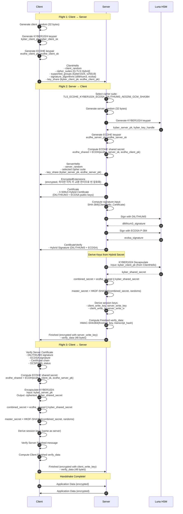
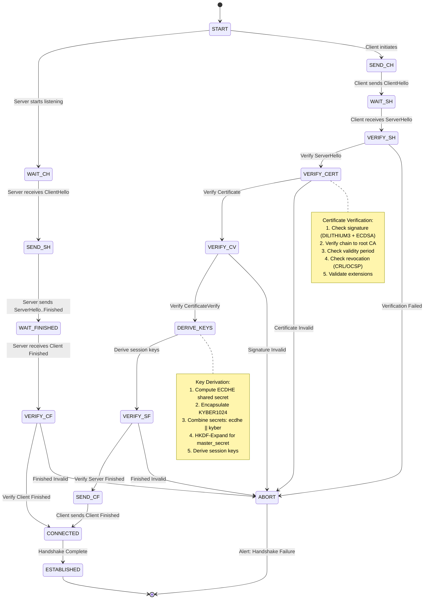
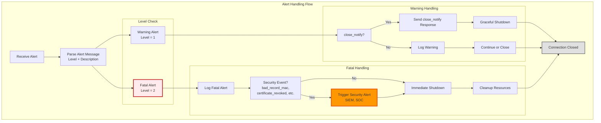
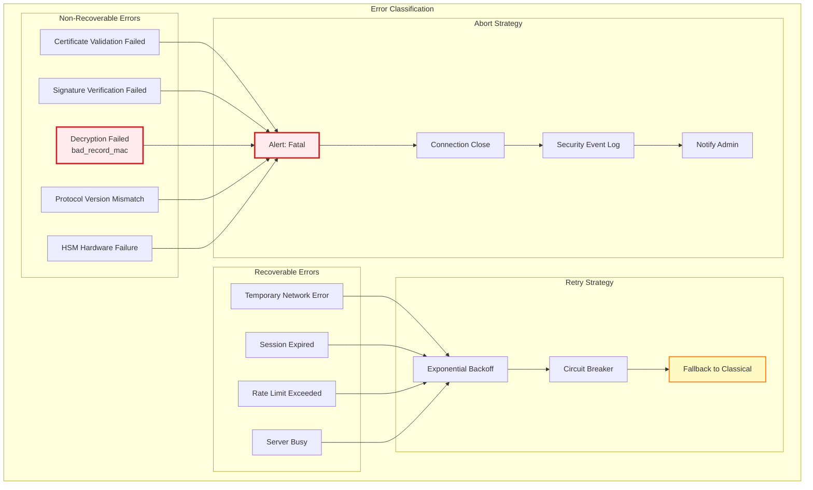
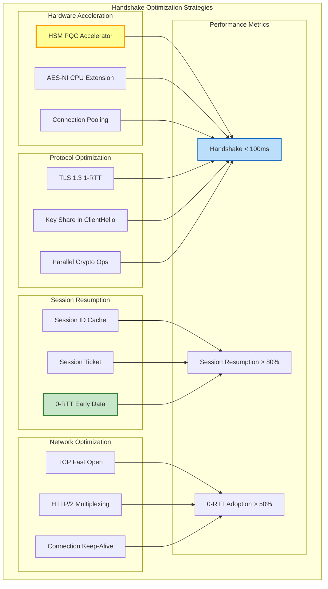
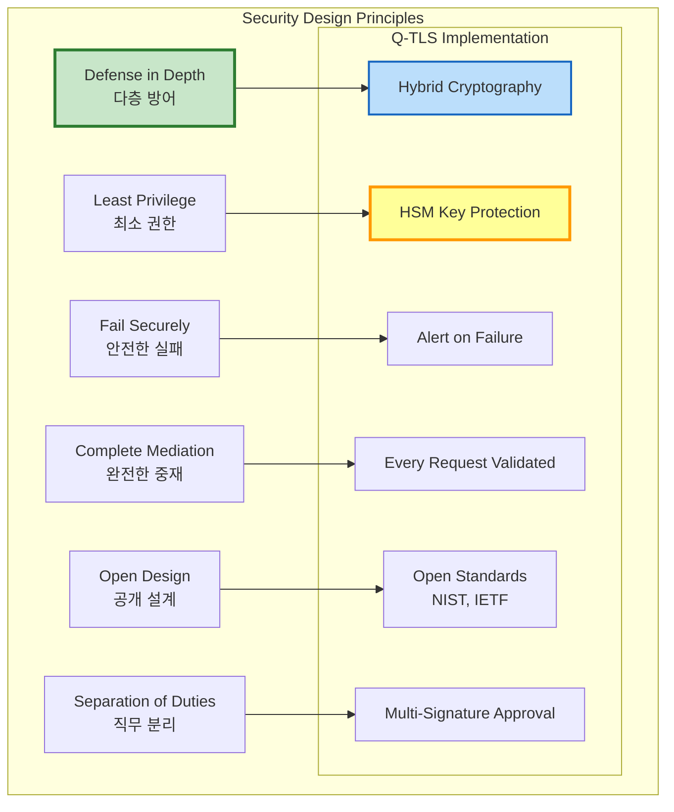

# Q-TLS 상세 설계 (Q-TLS Detailed Design)

> **Q-TLS (Quantum-resistant Transport Security Layer)** 프로토콜 메시지 포맷 및 상세 설계 명세

---

## 📑 목차

1. [프로토콜 메시지 포맷 (바이트 레벨)](#1-프로토콜-메시지-포맷-바이트-레벨)
2. [핸드셰이크 프로토콜 상세 설계](#2-핸드셰이크-프로토콜-상세-설계)
3. [레코드 프로토콜 구조](#3-레코드-프로토콜-구조)
4. [Alert 프로토콜](#4-alert-프로토콜)
5. [확장 메커니즘 (Extensions)](#5-확장-메커니즘-extensions)
6. [에러 처리 및 복구 전략](#6-에러-처리-및-복구-전략)
7. [성능 최적화 설계](#7-성능-최적화-설계)
8. [보안 고려사항](#8-보안-고려사항)

---

## 1. 프로토콜 메시지 포맷 (바이트 레벨)

### 1.1 Q-TLS 레코드 헤더

```
Q-TLS Record Header (5 bytes):
+--------+--------+--------+--------+--------+
| Type   | Version         | Length          |
| 1 byte | 2 bytes         | 2 bytes         |
+--------+--------+--------+--------+--------+

Field Descriptions:
  Type (1 byte):
    0x14 (20)  - ChangeCipherSpec
    0x15 (21)  - Alert
    0x16 (22)  - Handshake
    0x17 (23)  - Application Data

  Version (2 bytes):
    Major: 0x03 (TLS 1.x)
    Minor: 0x04 (TLS 1.3) or 0x05 (Q-TLS 1.0)
    Example: 0x0304 = TLS 1.3, 0x0305 = Q-TLS 1.0

  Length (2 bytes):
    Big-endian uint16
    Maximum: 2^14 = 16,384 bytes (per TLS 1.3)
    Q-TLS extension: Up to 2^16 for PQC signatures
```

**바이트 배치 예시**:

```
Offset  00 01 02 03 04 05 06 07 08 09 0A 0B 0C 0D 0E 0F
------  -----------------------------------------------
0x0000  16 03 04 00 A5 01 00 00 A1 03 03 ...
        │  │  │  │  │
        │  │  │  └──┴─ Length: 0x00A5 (165 bytes)
        │  └──┴─────── Version: 0x0304 (TLS 1.3)
        └──────────── Type: 0x16 (Handshake)
```

### 1.2 ClientHello 메시지 구조

```mermaid
graph TB
    subgraph "ClientHello Message Structure"
        CH1[Record Header<br/>5 bytes]

        subgraph "Handshake Header"
            CH2[Msg Type: 0x01<br/>1 byte]
            CH3[Length<br/>3 bytes]
        end

        subgraph "ClientHello Body"
            CH4[Client Version<br/>2 bytes: 0x0304]
            CH5[Client Random<br/>32 bytes]
            CH6[Session ID<br/>1 + 0~32 bytes]
            CH7[Cipher Suites<br/>2 + N*2 bytes]
            CH8[Compression Methods<br/>1 + 1 bytes: NULL]

            subgraph "Extensions"
                EXT1[Extensions Length<br/>2 bytes]
                EXT2[supported_groups<br/>KYBER1024, x25519]
                EXT3[signature_algorithms<br/>DILITHIUM3, ECDSA]
                EXT4[key_share<br/>KYBER + ECDHE public keys]
                EXT5[server_name<br/>SNI]
                EXT6[supported_versions<br/>TLS 1.3]
            end
        end
    end

    CH1 --> CH2
    CH2 --> CH3
    CH3 --> CH4
    CH4 --> CH5
    CH5 --> CH6
    CH6 --> CH7
    CH7 --> CH8
    CH8 --> EXT1
    EXT1 --> EXT2
    EXT2 --> EXT3
    EXT3 --> EXT4
    EXT4 --> EXT5
    EXT5 --> EXT6

    style CH1 fill:#c8e6c9,stroke:#2e7d32,stroke-width:2px
    style EXT4 fill:#bbdefb,stroke:#1565c0,stroke-width:2px
```



**ClientHello 바이트 포맷 (상세)**:

```
Offset  Description                              Size    Value
------  ---------------------------------------  ------  -------------
// Record Header
0x0000  Content Type (Handshake)                 1       0x16
0x0001  Protocol Version                         2       0x0304 (TLS 1.3)
0x0003  Record Length                            2       0xXXXX

// Handshake Header
0x0005  Handshake Type (ClientHello)             1       0x01
0x0006  Handshake Length                         3       0xXXXXXX

// ClientHello Body
0x0009  Client Version                           2       0x0303 (TLS 1.2 for compatibility)
0x000B  Client Random                           32       <random bytes>
0x002B  Session ID Length                        1       0x00 (0) or 0x20 (32)
0x002C  Session ID                            0~32       <session id if resuming>
0x00XX  Cipher Suites Length                     2       0xXXXX (N * 2 bytes)
0x00XX  Cipher Suites                        N*2        List of supported cipher suites:
                                                          0x1301 - TLS_AES_128_GCM_SHA256
                                                          0x1302 - TLS_AES_256_GCM_SHA384
                                                          0x13F1 - TLS_KYBER1024_DILITHIUM3_AES256_GCM_SHA384 (Q-TLS)
                                                          0x13F2 - TLS_ECDHE_KYBER1024_ECDSA_DILITHIUM3_AES256_GCM_SHA384 (Q-TLS)
0x00XX  Compression Methods Length               1       0x01
0x00XX  Compression Methods                      1       0x00 (NULL, no compression)

// Extensions
0x00XX  Extensions Length                        2       0xXXXX (Total extensions size)

        // Extension 1: supported_groups
0x00XX  Extension Type                           2       0x000A (supported_groups)
0x00XX  Extension Length                         2       0xXXXX
0x00XX  Supported Groups Length                  2       0xXXXX
0x00XX  Named Groups                          N*2        List:
                                                          0x0100 - kyber1024 (Q-TLS)
                                                          0x0101 - kyber768 (Q-TLS)
                                                          0x001D - x25519
                                                          0x0018 - secp384r1

        // Extension 2: signature_algorithms
0x00XX  Extension Type                           2       0x000D (signature_algorithms)
0x00XX  Extension Length                         2       0xXXXX
0x00XX  Signature Algorithms Length              2       0xXXXX
0x00XX  Signature Schemes                     N*2        List:
                                                          0x0900 - dilithium3 (Q-TLS)
                                                          0x0901 - dilithium2 (Q-TLS)
                                                          0x0403 - ecdsa_secp384r1_sha384
                                                          0x0804 - rsa_pss_rsae_sha384

        // Extension 3: key_share (ClientHello)
0x00XX  Extension Type                           2       0x0033 (key_share)
0x00XX  Extension Length                         2       0xXXXX
0x00XX  Key Share Entries Length                 2       0xXXXX

                // Key Share Entry 1: KYBER1024
0x00XX  Named Group                              2       0x0100 (kyber1024)
0x00XX  Key Exchange Length                      2       0x0620 (1568 bytes)
0x00XX  Key Exchange Data                     1568       <KYBER1024 public key>

                // Key Share Entry 2: x25519
0x00XX  Named Group                              2       0x001D (x25519)
0x00XX  Key Exchange Length                      2       0x0020 (32 bytes)
0x00XX  Key Exchange Data                       32       <x25519 public key>

        // Extension 4: server_name (SNI)
0x00XX  Extension Type                           2       0x0000 (server_name)
0x00XX  Extension Length                         2       0xXXXX
0x00XX  Server Name List Length                  2       0xXXXX
0x00XX  Server Name Type                         1       0x00 (host_name)
0x00XX  Server Name Length                       2       0xXXXX
0x00XX  Server Name                              N       <hostname string>

        // Extension 5: supported_versions (TLS 1.3)
0x00XX  Extension Type                           2       0x002B (supported_versions)
0x00XX  Extension Length                         2       0x03
0x00XX  Supported Versions Length                1       0x02
0x00XX  Supported Versions                       2       0x0304 (TLS 1.3)

        // Extension 6: psk_key_exchange_modes (if PSK)
0x00XX  Extension Type                           2       0x002D (psk_key_exchange_modes)
0x00XX  Extension Length                         2       0x02
0x00XX  PSK KEX Modes Length                     1       0x01
0x00XX  PSK KEX Mode                             1       0x01 (psk_dhe_ke)

        // ... 추가 확장들 ...
```

### 1.3 ServerHello 메시지 구조

```
ServerHello Message Format:

Offset  Description                              Size    Value
------  ---------------------------------------  ------  -------------
// Record Header
0x0000  Content Type (Handshake)                 1       0x16
0x0001  Protocol Version                         2       0x0303 (TLS 1.2 compatibility)
0x0003  Record Length                            2       0xXXXX

// Handshake Header
0x0005  Handshake Type (ServerHello)             1       0x02
0x0006  Handshake Length                         3       0xXXXXXX

// ServerHello Body
0x0009  Server Version                           2       0x0303 (TLS 1.2 for compatibility)
0x000B  Server Random                           32       <random bytes>
0x002B  Session ID Length                        1       0x00 or 0x20
0x002C  Session ID                            0~32       <session id>
0x00XX  Cipher Suite                             2       0x13F2 (Selected Q-TLS Hybrid suite)
0x00XX  Compression Method                       1       0x00 (NULL)

// Extensions
0x00XX  Extensions Length                        2       0xXXXX

        // Extension 1: key_share (ServerHello)
0x00XX  Extension Type                           2       0x0033 (key_share)
0x00XX  Extension Length                         2       0xXXXX
0x00XX  Selected Named Group                     2       0x0100 (kyber1024)
0x00XX  Key Exchange Length                      2       0x0620 (1568 bytes)
0x00XX  Key Exchange Data                     1568       <KYBER1024 server public key>

        // Extension 2: supported_versions
0x00XX  Extension Type                           2       0x002B (supported_versions)
0x00XX  Extension Length                         2       0x02
0x00XX  Selected Version                         2       0x0304 (TLS 1.3)

        // ... 추가 확장들 ...
```

### 1.4 Certificate 메시지 (Hybrid)

```
Certificate Message Format (Q-TLS Hybrid):

Offset  Description                              Size    Value
------  ---------------------------------------  ------  -------------
// Record Header
0x0000  Content Type (Handshake)                 1       0x16
0x0001  Protocol Version                         2       0x0303
0x0003  Record Length                            2       0xXXXX

// Handshake Header
0x0005  Handshake Type (Certificate)             1       0x0B
0x0006  Handshake Length                         3       0xXXXXXX

// Certificate Body
0x0009  Certificate Request Context Length       1       0x00 (empty for server cert)
0x000A  Certificates Length                      3       0xXXXXXX (total chain size)

        // Certificate Entry 1 (Server Certificate)
0x000D  Certificate Length                       3       0xXXXXXX
0x0010  Certificate Data                         N       <X.509v3 DER-encoded certificate>
                                                          Contains:
                                                          - DILITHIUM3 public key (1,952 bytes)
                                                          - ECDSA P-384 public key (97 bytes)
                                                          - DILITHIUM3 signature (~3,293 bytes)
                                                          - ECDSA signature (~96 bytes)

0x00XX  Certificate Extensions Length            2       0xXXXX

                // Certificate Extension: OCSP Stapling
0x00XX  Extension Type                           2       0x0005 (status_request)
0x00XX  Extension Length                         2       0xXXXX
0x00XX  Certificate Status Type                  1       0x01 (ocsp)
0x00XX  OCSP Response                            N       <DER-encoded OCSP response>

        // Certificate Entry 2 (Intermediate CA)
0x00XX  Certificate Length                       3       0xXXXXXX
0x00XX  Certificate Data                         N       <Intermediate CA cert>
0x00XX  Certificate Extensions Length            2       0x0000

        // Certificate Entry 3 (Root CA, optional)
        // ...
```

### 1.5 CertificateVerify 메시지 (Hybrid Signature)

```
CertificateVerify Message Format (Q-TLS Hybrid):

Offset  Description                              Size    Value
------  ---------------------------------------  ------  -------------
// Record Header
0x0000  Content Type (Handshake)                 1       0x16
0x0001  Protocol Version                         2       0x0303
0x0003  Record Length                            2       0xXXXX

// Handshake Header
0x0005  Handshake Type (CertificateVerify)       1       0x0F
0x0006  Handshake Length                         3       0xXXXXXX

// CertificateVerify Body
0x0009  Signature Algorithm                      2       0x0900 (dilithium3) or
                                                          0x13F0 (dilithium3_ecdsa_hybrid)

0x000B  Signature Length                         2       0xXXXX

        // Hybrid Signature Structure
0x000D  Signature Data:
                // PQC Signature (DILITHIUM3)
        0x0000  Algorithm ID                       2       0x0900 (dilithium3)
        0x0002  Signature Length                   2       0x0CDD (~3,293 bytes)
        0x0004  Signature Value                 3293       <DILITHIUM3 signature>

                // Classical Signature (ECDSA P-384)
        0x0CD9  Algorithm ID                       2       0x0403 (ecdsa_secp384r1_sha384)
        0x0CDB  Signature Length                   2       0x0060 (~96 bytes)
        0x0CDD  Signature Value                   96       <ECDSA signature>

Total CertificateVerify Size: ~3,500 bytes
```

**서명 대상 데이터 구성**:

```python
# CertificateVerify 서명 대상 계산

def compute_signature_input(context, handshake_messages):
    """
    TLS 1.3 CertificateVerify 서명 입력 생성

    Parameters:
        context: "TLS 1.3, server CertificateVerify" (서버) 또는
                 "TLS 1.3, client CertificateVerify" (클라이언트)
        handshake_messages: 이전까지의 모든 핸드셰이크 메시지 연결

    Returns:
        서명할 데이터
    """
    # 1. 64개의 0x20 (space) 패딩
    padding = b'\x20' * 64

    # 2. 컨텍스트 문자열
    context_bytes = context.encode('utf-8') + b'\x00'

    # 3. 핸드셰이크 해시 (SHA-384)
    handshake_hash = SHA384(handshake_messages)

    # 4. 결합
    signature_input = padding + context_bytes + handshake_hash

    return signature_input

# 예시 사용
handshake_messages = (
    ClientHello +
    ServerHello +
    EncryptedExtensions +
    Certificate
)

signature_input = compute_signature_input(
    "TLS 1.3, server CertificateVerify",
    handshake_messages
)

# HSM에서 DILITHIUM3 서명 생성
dilithium3_signature = HSM.sign(
    mechanism=CKM_DILITHIUM3,
    data=signature_input
)

# ECDSA 서명 생성 (Hybrid)
ecdsa_signature = HSM.sign(
    mechanism=CKM_ECDSA_SHA384,
    data=signature_input
)

# Hybrid 서명 구성
hybrid_signature = encode_hybrid_signature(
    dilithium3_signature,
    ecdsa_signature
)
```

### 1.6 Finished 메시지

```
Finished Message Format:

Offset  Description                              Size    Value
------  ---------------------------------------  ------  -------------
// Record Header
0x0000  Content Type (Handshake)                 1       0x16
0x0001  Protocol Version                         2       0x0303
0x0003  Record Length                            2       0xXXXX

// Handshake Header (암호화됨)
0x0005  Handshake Type (Finished)                1       0x14
0x0006  Handshake Length                         3       0x000030 (48 bytes for SHA-384)

// Finished Body (암호화됨)
0x0009  Verify Data                             48       HMAC-SHA384(
                                                            finished_key,
                                                            Transcript-Hash(
                                                              Handshake Messages
                                                            )
                                                          )

Note: Finished 메시지는 암호화된 상태로 전송됨 (Record Protocol 적용)
```

**Finished Verify Data 계산**:

```python
def compute_finished_verify_data(master_secret, handshake_messages, is_server):
    """
    TLS 1.3 Finished Verify Data 계산

    Parameters:
        master_secret: Master Secret (48 bytes)
        handshake_messages: 모든 핸드셰이크 메시지 (Finished 제외)
        is_server: True면 서버, False면 클라이언트

    Returns:
        Verify Data (48 bytes for SHA-384)
    """
    # 1. Transcript Hash 계산
    transcript_hash = SHA384(handshake_messages)

    # 2. Finished Key 유도
    label = b"server finished" if is_server else b"client finished"
    finished_key = HKDF_Expand_Label(
        secret=master_secret,
        label=label,
        context=b"",
        length=48  # SHA-384 output size
    )

    # 3. Verify Data 계산
    verify_data = HMAC_SHA384(finished_key, transcript_hash)

    return verify_data  # 48 bytes

def HKDF_Expand_Label(secret, label, context, length):
    """
    TLS 1.3 HKDF-Expand-Label

    HkdfLabel Structure:
      uint16 length = length;
      opaque label<7..255> = "tls13 " + label;
      opaque context<0..255> = context;
    """
    hkdf_label = (
        struct.pack(">H", length) +           # length (2 bytes)
        struct.pack("B", len(label) + 6) +    # label length
        b"tls13 " + label +                   # "tls13 " prefix + label
        struct.pack("B", len(context)) +      # context length
        context                                # context
    )

    return HKDF_Expand_SHA384(secret, hkdf_label, length)
```

---

## 2. 핸드셰이크 프로토콜 상세 설계

### 2.1 전체 핸드셰이크 시퀀스 (Q-TLS Hybrid)



### 2.2 핸드셰이크 상태 전이



### 2.3 키 유도 프로세스 상세

```python
class QTSLKeySchedule:
    """
    Q-TLS Key Schedule (TLS 1.3 기반 + PQC 확장)
    """

    def __init__(self, cipher_suite):
        """
        cipher_suite: Selected Q-TLS cipher suite
        """
        self.cipher_suite = cipher_suite
        self.hash_algo = self._get_hash_algo(cipher_suite)

    def derive_master_secret(self, ecdhe_shared, kyber_shared,
                             client_random, server_random):
        """
        Master Secret 유도

        Input:
            ecdhe_shared: ECDHE shared secret (48 bytes for P-384)
            kyber_shared: KYBER1024 shared secret (32 bytes)
            client_random: ClientHello.random (32 bytes)
            server_random: ServerHello.random (32 bytes)

        Output:
            master_secret (48 bytes for SHA-384)
        """
        # Step 1: Combine shared secrets
        combined_secret = ecdhe_shared + kyber_shared  # 80 bytes

        # Step 2: Early Secret (빈 값으로 시작, PSK 없음)
        early_secret = HKDF_Extract(
            salt=b'\x00' * 48,  # 48 bytes for SHA-384
            ikm=b'\x00' * 48
        )

        # Step 3: Handshake Secret
        handshake_secret = self.derive_secret(
            secret=early_secret,
            label="derived",
            messages=b""
        )

        handshake_secret = HKDF_Extract(
            salt=handshake_secret,
            ikm=combined_secret  # Hybrid shared secret
        )

        # Step 4: Master Secret
        master_secret = self.derive_secret(
            secret=handshake_secret,
            label="derived",
            messages=b""
        )

        master_secret = HKDF_Extract(
            salt=master_secret,
            ikm=b'\x00' * 48
        )

        return master_secret

    def derive_session_keys(self, master_secret, handshake_messages):
        """
        세션 키 유도

        Input:
            master_secret: Master Secret (48 bytes)
            handshake_messages: ClientHello..ServerFinished

        Output:
            dict with:
                - client_handshake_traffic_secret
                - server_handshake_traffic_secret
                - client_application_traffic_secret
                - server_application_traffic_secret
        """
        # Handshake Traffic Secrets
        client_handshake_traffic_secret = self.derive_secret(
            secret=master_secret,
            label="c hs traffic",
            messages=handshake_messages
        )

        server_handshake_traffic_secret = self.derive_secret(
            secret=master_secret,
            label="s hs traffic",
            messages=handshake_messages
        )

        # Application Traffic Secrets (after Finished)
        client_application_traffic_secret = self.derive_secret(
            secret=master_secret,
            label="c ap traffic",
            messages=handshake_messages + client_finished
        )

        server_application_traffic_secret = self.derive_secret(
            secret=master_secret,
            label="s ap traffic",
            messages=handshake_messages + server_finished
        )

        return {
            'client_hs_secret': client_handshake_traffic_secret,
            'server_hs_secret': server_handshake_traffic_secret,
            'client_ap_secret': client_application_traffic_secret,
            'server_ap_secret': server_application_traffic_secret
        }

    def derive_traffic_keys(self, traffic_secret):
        """
        Traffic Secret으로부터 실제 암호화 키 유도

        Input:
            traffic_secret (48 bytes)

        Output:
            dict with:
                - key: AES-256 key (32 bytes)
                - iv: GCM IV (12 bytes)
        """
        key = HKDF_Expand_Label(
            secret=traffic_secret,
            label="key",
            context=b"",
            length=32  # AES-256
        )

        iv = HKDF_Expand_Label(
            secret=traffic_secret,
            label="iv",
            context=b"",
            length=12  # GCM IV
        )

        return {'key': key, 'iv': iv}

    def derive_secret(self, secret, label, messages):
        """
        TLS 1.3 Derive-Secret

        Derive-Secret(Secret, Label, Messages) =
            HKDF-Expand-Label(
                Secret,
                Label,
                Transcript-Hash(Messages),
                Hash.length
            )
        """
        transcript_hash = self.hash_algo(messages)

        return HKDF_Expand_Label(
            secret=secret,
            label=label.encode('utf-8'),
            context=transcript_hash,
            length=48  # SHA-384 output
        )

    def _get_hash_algo(self, cipher_suite):
        """Get hash algorithm from cipher suite"""
        if "SHA384" in cipher_suite:
            return hashlib.sha384
        elif "SHA256" in cipher_suite:
            return hashlib.sha256
        else:
            raise ValueError(f"Unknown hash in cipher suite: {cipher_suite}")


def HKDF_Extract(salt, ikm):
    """
    HKDF-Extract (RFC 5869)

    HKDF-Extract(salt, IKM) -> PRK
    """
    return hmac.new(salt, ikm, hashlib.sha384).digest()


def HKDF_Expand_Label(secret, label, context, length):
    """
    TLS 1.3 HKDF-Expand-Label

    struct {
        uint16 length = length;
        opaque label<7..255> = "tls13 " + label;
        opaque context<0..255> = context;
    } HkdfLabel;
    """
    hkdf_label = (
        struct.pack(">H", length) +
        struct.pack("B", len(label) + 6) +
        b"tls13 " + label +
        struct.pack("B", len(context)) +
        context
    )

    return HKDF_Expand_SHA384(secret, hkdf_label, length)


def HKDF_Expand_SHA384(prk, info, length):
    """
    HKDF-Expand using SHA-384

    HKDF-Expand(PRK, info, L) -> OKM
    """
    t = b""
    okm = b""
    i = 0

    while len(okm) < length:
        i += 1
        t = hmac.new(prk, t + info + bytes([i]), hashlib.sha384).digest()
        okm += t

    return okm[:length]
```

### 2.4 핸드셰이크 메시지 순서 검증

```yaml
핸드셰이크 메시지 순서 규칙:

  정상 핸드셰이크 (Full Handshake):
    Client → Server:
      1. ClientHello

    Server → Client:
      2. ServerHello
      3. EncryptedExtensions
      4. Certificate (선택사항: 인증 필요 시)
      5. CertificateVerify (Certificate가 있으면 필수)
      6. Finished

    Client → Server:
      7. Certificate (선택사항: 클라이언트 인증 시)
      8. CertificateVerify (Certificate가 있으면 필수)
      9. Finished

  세션 재개 (Session Resumption):
    Client → Server:
      1. ClientHello (with Session ID or PSK)

    Server → Client:
      2. ServerHello (same Session ID)
      3. EncryptedExtensions
      4. Finished (Certificate/CertificateVerify 생략)

    Client → Server:
      5. Finished

  0-RTT 모드:
    Client → Server:
      1. ClientHello
      2. EndOfEarlyData
      3. 0-RTT Application Data (encrypted)

    Server → Client:
      4. ServerHello
      5. EncryptedExtensions
      6. Finished

    Client → Server:
      7. Finished
      8. Application Data (1-RTT)

  에러 처리:
    순서 위반 시:
      → Alert: unexpected_message (level: fatal)
      → 연결 종료

    누락된 필수 메시지:
      → Alert: handshake_failure (level: fatal)

    중복 메시지:
      → Alert: unexpected_message (level: fatal)
```

---

## 3. 레코드 프로토콜 구조

### 3.1 레코드 프로토콜 계층

```mermaid
graph TB
    subgraph "Q-TLS Record Protocol Stack"
        subgraph "Input Layer"
            INPUT[Application Data<br/>Max 2^14 bytes]
        end

        subgraph "Fragmentation Layer"
            FRAG[Fragment into Records<br/>Each ≤ 16,384 bytes]
        end

        subgraph "Compression Layer (Optional)"
            COMP[Compression<br/>NULL (disabled in TLS 1.3)]
        end

        subgraph "Encryption Layer"
            subgraph "AEAD Encryption (AES-256-GCM)"
                ENC1[Additional Data<br/>Record Header + Sequence]
                ENC2[Plaintext<br/>Fragment + Content Type]
                ENC3[AES-256-GCM Encrypt<br/>Key, IV, AAD]
                ENC4[Ciphertext + Auth Tag]
            end
        end

        subgraph "Record Header Layer"
            HEADER[TLS Record Header<br/>Type, Version, Length]
        end

        subgraph "Output Layer"
            OUTPUT[TLS Record<br/>Ready for TCP]
        end
    end

    INPUT --> FRAG
    FRAG --> COMP
    COMP --> ENC1
    ENC1 --> ENC2
    ENC2 --> ENC3
    ENC3 --> ENC4
    ENC4 --> HEADER
    HEADER --> OUTPUT

    style ENC3 fill:#c8e6c9,stroke:#2e7d32,stroke-width:3px
    style HEADER fill:#bbdefb,stroke:#1565c0,stroke-width:2px
```

### 3.2 레코드 암호화 상세

**TLSCiphertext 구조**:

```
TLSCiphertext {
    ContentType opaque_type = application_data (23);
    ProtocolVersion legacy_record_version = 0x0303; /* TLS 1.2 */
    uint16 length;
    opaque encrypted_record[TLSCiphertext.length];
} TLSCiphertext;

encrypted_record = AEAD-Encrypt(
    key: write_key,
    nonce: write_iv XOR seq_num,
    additional_data: TLSCiphertext.type ||
                     TLSCiphertext.legacy_record_version ||
                     TLSCiphertext.length,
    plaintext: content || ContentType || zeros(padding)
);
```

**AES-256-GCM 암호화 과정**:

```python
class QTSLRecordProtocol:
    """Q-TLS Record Protocol Implementation"""

    def __init__(self, write_key, write_iv):
        """
        write_key: AES-256 key (32 bytes)
        write_iv: GCM IV (12 bytes)
        """
        self.write_key = write_key
        self.write_iv = write_iv
        self.seq_num = 0  # 64-bit sequence number

    def encrypt_record(self, content, content_type):
        """
        레코드 암호화

        Input:
            content: 평문 데이터 (최대 2^14 bytes)
            content_type: 실제 Content Type (0x17 for application_data)

        Output:
            TLSCiphertext (암호화된 레코드)
        """
        # Step 1: TLSInnerPlaintext 구성
        # TLSInnerPlaintext = content || content_type || zeros(padding)
        inner_plaintext = content + bytes([content_type])

        # Optional: 패딩 추가 (트래픽 분석 방지)
        # padding_length = random.randint(0, 256)
        # inner_plaintext += b'\x00' * padding_length

        # Step 2: Nonce 계산 (IV XOR Sequence Number)
        seq_num_bytes = struct.pack(">Q", self.seq_num)  # 64-bit big-endian
        nonce = bytes(a ^ b for a, b in zip(
            self.write_iv,
            b'\x00\x00\x00\x00' + seq_num_bytes  # Pad to 12 bytes
        ))

        # Step 3: Additional Authenticated Data (AAD)
        # TLSCiphertext.opaque_type || legacy_record_version || length
        aad = (
            bytes([0x17]) +                      # opaque_type (application_data)
            bytes([0x03, 0x03]) +                # legacy_record_version (TLS 1.2)
            struct.pack(">H", len(inner_plaintext) + 16)  # length (plaintext + tag)
        )

        # Step 4: AES-256-GCM 암호화
        cipher = Cipher(
            algorithms.AES(self.write_key),
            modes.GCM(nonce),
            backend=default_backend()
        )
        encryptor = cipher.encryptor()
        encryptor.authenticate_additional_data(aad)

        ciphertext = encryptor.update(inner_plaintext) + encryptor.finalize()
        auth_tag = encryptor.tag  # 16 bytes

        encrypted_record = ciphertext + auth_tag

        # Step 5: TLSCiphertext 구성
        tls_ciphertext = (
            bytes([0x17]) +                      # opaque_type
            bytes([0x03, 0x03]) +                # legacy_record_version
            struct.pack(">H", len(encrypted_record)) +  # length
            encrypted_record                      # encrypted_record
        )

        # Step 6: Sequence Number 증가
        self.seq_num += 1

        return tls_ciphertext

    def decrypt_record(self, tls_ciphertext):
        """
        레코드 복호화

        Input:
            tls_ciphertext: 암호화된 TLS 레코드

        Output:
            (content, content_type) 튜플
        """
        # Step 1: TLSCiphertext 파싱
        opaque_type = tls_ciphertext[0]
        legacy_version = tls_ciphertext[1:3]
        length = struct.unpack(">H", tls_ciphertext[3:5])[0]
        encrypted_record = tls_ciphertext[5:5+length]

        # Step 2: Ciphertext와 Tag 분리
        ciphertext = encrypted_record[:-16]
        auth_tag = encrypted_record[-16:]

        # Step 3: Nonce 재계산
        seq_num_bytes = struct.pack(">Q", self.seq_num)
        nonce = bytes(a ^ b for a, b in zip(
            self.write_iv,
            b'\x00\x00\x00\x00' + seq_num_bytes
        ))

        # Step 4: AAD 재구성
        aad = (
            bytes([opaque_type]) +
            legacy_version +
            struct.pack(">H", length)
        )

        # Step 5: AES-256-GCM 복호화
        cipher = Cipher(
            algorithms.AES(self.write_key),
            modes.GCM(nonce, auth_tag),
            backend=default_backend()
        )
        decryptor = cipher.decryptor()
        decryptor.authenticate_additional_data(aad)

        try:
            inner_plaintext = decryptor.update(ciphertext) + decryptor.finalize()
        except Exception as e:
            # Authentication failed
            raise DecryptError("GCM authentication failed") from e

        # Step 6: TLSInnerPlaintext 파싱
        # 뒤에서부터 non-zero byte 찾기 (Content Type)
        i = len(inner_plaintext) - 1
        while i >= 0 and inner_plaintext[i] == 0:
            i -= 1

        if i < 0:
            raise ValueError("Invalid TLSInnerPlaintext: all zeros")

        content_type = inner_plaintext[i]
        content = inner_plaintext[:i]

        # Step 7: Sequence Number 증가
        self.seq_num += 1

        return (content, content_type)
```

### 3.3 Anti-Replay 메커니즘

```yaml
Anti-Replay 보호:

  Sequence Number:
    크기: 64-bit
    범위: 0 ~ 2^64 - 1
    초기값: 0
    증가: 각 레코드마다 +1

  Replay 공격 방지:
    메커니즘:
      - Sequence Number는 암호화에 사용되지만 전송되지 않음
      - 수신자는 독립적으로 Sequence Number 유지
      - Nonce = IV XOR seq_num으로 각 레코드마다 고유한 Nonce 생성
      - 동일 Nonce 재사용 시 GCM 인증 실패

    재전송 공격 탐지:
      - 순서가 어긋난 레코드 → Sequence Number 불일치 → 복호화 실패
      - 중복 레코드 → 동일 Nonce 재사용 → GCM 인증 실패

  Key Update:
    트리거:
      - Sequence Number가 2^24 (16,777,216) 레코드 도달 시
      - 약 16GB 데이터 전송 후 (레코드당 ~1KB 기준)

    프로세스:
      1. 클라이언트 또는 서버가 KeyUpdate 메시지 전송
      2. 새로운 Traffic Secret 유도:
         application_traffic_secret_N+1 = HKDF-Expand-Label(
             application_traffic_secret_N,
             "traffic upd",
             "",
             Hash.length
         )
      3. 새로운 write_key, write_iv 유도
      4. Sequence Number 리셋 (0부터 시작)

  최대 레코드 수:
    이론적 최대: 2^64 레코드
    실무적 최대: 2^24 레코드 (Key Update 후 갱신)
    안전 마진: 2^23 레코드에서 Key Update 권장
```

### 3.4 레코드 크기 및 단편화

```yaml
레코드 크기 제한:

  최대 레코드 크기:
    TLS 1.3 표준: 2^14 (16,384) bytes (plaintext)
    Q-TLS 확장: 2^14 bytes (동일, PQC 서명은 핸드셰이크에만 영향)

  단편화 (Fragmentation):
    규칙:
      - Application Data > 16,384 bytes → 여러 레코드로 분할
      - 각 레코드 ≤ 16,384 bytes

    예시:
      Input: 50,000 bytes Application Data
      Output:
        - Record 1: 16,384 bytes
        - Record 2: 16,384 bytes
        - Record 3: 16,384 bytes
        - Record 4:    848 bytes

  오버헤드:
    레코드 헤더: 5 bytes
    GCM 인증 태그: 16 bytes
    Content Type (암호화된): 1 byte
    패딩 (선택사항): 0~256 bytes

    총 오버헤드: 최소 22 bytes ~ 최대 278 bytes

  최대 암호화 레코드 크기:
    16,384 (plaintext) + 1 (content type) + 256 (max padding) + 16 (tag) = 16,657 bytes
    + 5 (header) = 16,662 bytes per record

  성능 고려사항:
    작은 레코드:
      - 장점: 지연 시간 감소, 실시간 스트리밍 적합
      - 단점: 오버헤드 증가, 처리량 감소

    큰 레코드:
      - 장점: 오버헤드 감소, 처리량 증가
      - 단점: 지연 시간 증가, 버퍼 요구량 증가

    권장 설정:
      - HTTP/2: 16KB 레코드 (최대 크기)
      - WebSocket: 4KB 레코드 (실시간 메시지)
      - File Transfer: 16KB 레코드 (최대 처리량)
```

---

## 4. Alert 프로토콜

### 4.1 Alert 메시지 구조

```
Alert Message Format:

Offset  Description                              Size    Value
------  ---------------------------------------  ------  -------------
// Record Header
0x0000  Content Type (Alert)                     1       0x15
0x0001  Protocol Version                         2       0x0303
0x0003  Record Length                            2       0x0002 (2 bytes)

// Alert Body (encrypted after handshake)
0x0005  Alert Level                              1       0x01 (warning) or 0x02 (fatal)
0x0006  Alert Description                        1       See Alert Codes below
```

### 4.2 Alert 코드 및 설명

```yaml
Alert Codes (Q-TLS):

  Warning Alerts (Level 1):
    0: close_notify
       설명: 정상적인 연결 종료
       조치: 수신 후 close_notify 응답, 연결 종료

    10: unexpected_message
       설명: 예상치 못한 메시지 수신
       조치: 재시도 또는 연결 종료

    41: no_certificate
       설명: 클라이언트 인증서 없음 (요청 시)
       조치: 서버 정책에 따라 계속 또는 종료

    90: (Q-TLS) pqc_negotiation_failure
       설명: PQC 알고리즘 협상 실패
       조치: Classical 암호로 Fallback 시도

  Fatal Alerts (Level 2):
    20: bad_record_mac
       설명: MAC 검증 실패 (GCM 인증 실패)
       조치: 즉시 연결 종료, 보안 이벤트 로깅

    21: decryption_failed
       설명: 복호화 실패
       조치: 즉시 연결 종료

    22: record_overflow
       설명: 레코드 크기 초과 (> 2^14 + 2048)
       조치: 즉시 연결 종료

    40: handshake_failure
       설명: 핸드셰이크 실패 (일반)
       조치: 연결 종료

    42: bad_certificate
       설명: 인증서 형식 오류
       조치: 연결 종료, 인증서 검증 로그

    43: unsupported_certificate
       설명: 지원하지 않는 인증서 타입
       조치: 연결 종료

    44: certificate_revoked
       설명: 인증서 폐기됨 (CRL/OCSP)
       조치: 즉시 연결 종료, 보안 알림

    45: certificate_expired
       설명: 인증서 만료
       조치: 연결 종료, 인증서 갱신 필요

    46: certificate_unknown
       설명: 인증서 검증 실패 (기타)
       조치: 연결 종료

    47: illegal_parameter
       설명: 잘못된 파라미터
       조치: 연결 종료

    48: unknown_ca
       설명: 인증서 발급 CA를 신뢰할 수 없음
       조치: 연결 종료, CA 체인 확인

    49: access_denied
       설명: 접근 거부 (인증 실패)
       조치: 연결 종료, 인증 재시도

    50: decode_error
       설명: 메시지 디코딩 실패
       조치: 연결 종료

    51: decrypt_error
       설명: 암호화 관련 오류
       조치: 연결 종료

    70: protocol_version
       설명: 지원하지 않는 프로토콜 버전
       조치: 연결 종료

    71: insufficient_security
       설명: 보안 수준 부족 (약한 암호 스위트)
       조치: 연결 종료, 더 강한 암호 요구

    80: internal_error
       설명: 내부 오류
       조치: 연결 종료, 서버 로그 확인

    86: inappropriate_fallback
       설명: 부적절한 다운그레이드 시도 감지
       조치: 즉시 연결 종료, 공격 의심

    90: (Q-TLS) pqc_signature_failure
       설명: PQC 서명 검증 실패
       조치: 연결 종료, 보안 이벤트 기록

    91: (Q-TLS) pqc_key_exchange_failure
       설명: PQC 키 교환 실패
       조치: 연결 종료

    92: (Q-TLS) hsm_error
       설명: HSM 오류
       조치: 연결 종료, HSM 상태 확인

    100: no_application_protocol
       설명: ALPN 협상 실패
       조치: 연결 종료
```

### 4.3 Alert 처리 흐름



### 4.4 Alert 로깅 및 모니터링

```yaml
Alert 로깅 정책:

  로그 레벨:
    Warning Alerts:
      - Log Level: INFO
      - 저장: 30일
      - 알림: 없음 (close_notify 제외)

    Fatal Alerts:
      - Log Level: ERROR
      - 저장: 1년
      - 알림: 즉시 (Slack, Email, PagerDuty)

  로그 형식:
    timestamp: 2025-11-16T12:34:56.789Z
    level: fatal
    alert_code: 20
    alert_description: bad_record_mac
    client_ip: 192.168.1.100
    server_ip: 192.168.0.50
    session_id: a1b2c3d4...
    cipher_suite: TLS_ECDHE_KYBER1024_ECDSA_DILITHIUM3_AES256_GCM_SHA384
    handshake_completed: true
    records_sent: 1234
    records_received: 1230
    connection_duration_ms: 45678
    user_agent: Mozilla/5.0...
    metadata:
      service: q-gateway
      instance: apisix-1

  보안 이벤트 알림:
    트리거 조건:
      - bad_record_mac (GCM 인증 실패)
      - certificate_revoked
      - inappropriate_fallback (다운그레이드 공격)
      - pqc_signature_failure
      - 동일 IP에서 5분 내 10회 이상 Fatal Alert

    알림 채널:
      - Slack: #security-alerts
      - Email: security-team@qsign.local
      - SIEM: Elasticsearch + Kibana
      - PagerDuty: On-call Engineer

  메트릭:
    - alert_total{level="warning|fatal", code="XX"}
    - alert_rate_per_second
    - alert_by_client_ip
    - alert_by_alert_code
```

---

## 5. 확장 메커니즘 (Extensions)

### 5.1 TLS 확장 구조

```
Extension Format:

struct {
    ExtensionType extension_type;   // 2 bytes
    opaque extension_data<0..2^16-1>; // Variable length
} Extension;

ExtensionType: uint16
extension_data: Length (2 bytes) + Data (variable)
```

### 5.2 Q-TLS 커스텀 확장

```yaml
Q-TLS Custom Extensions:

  1. pqc_supported_algorithms (0xFF01):
     용도: PQC 알고리즘 지원 표시
     방향: ClientHello, ServerHello
     구조:
       struct {
           NamedGroup kem_algorithms<2..2^16-1>;      // KYBER1024, KYBER768
           SignatureScheme sig_algorithms<2..2^16-1>; // DILITHIUM3, DILITHIUM2
       } PQCAlgorithms;

     예시:
       Extension Type: 0xFF01
       Extension Length: 0x000C (12 bytes)
       KEM Algorithms Length: 0x0004 (2 algorithms)
         - 0x0100 (kyber1024)
         - 0x0101 (kyber768)
       Signature Algorithms Length: 0x0004 (2 algorithms)
         - 0x0900 (dilithium3)
         - 0x0901 (dilithium2)

  2. pqc_hybrid_mode (0xFF02):
     용도: Hybrid 모드 설정
     방향: ClientHello, ServerHello
     구조:
       struct {
           enum { require_both(1), require_pqc(2), require_any(3) } policy;
           uint8 pqc_priority; // 0-255, higher = prefer PQC
       } HybridMode;

     예시:
       Extension Type: 0xFF02
       Extension Length: 0x0002
       Policy: 0x01 (require_both)
       PQC Priority: 0xFF (255, highest)

  3. hsm_capabilities (0xFF03):
     용도: HSM 지원 기능 표시
     방향: ServerHello
     구조:
       struct {
           bool hardware_rng;       // QRNG 지원
           bool hardware_pqc_accel; // PQC 하드웨어 가속
           bool fips_certified;     // FIPS 140-2 Level 3 인증
           uint16 max_operations_per_second;
       } HSMCapabilities;

     예시:
       Extension Type: 0xFF03
       Extension Length: 0x0005
       Hardware RNG: 0x01 (true)
       Hardware PQC Accel: 0x01 (true)
       FIPS Certified: 0x01 (true)
       Max Ops/Sec: 0x1388 (5000)

  4. session_cache_info (0xFF04):
     용도: 세션 캐시 정보
     방향: ServerHello
     구조:
       struct {
           uint32 max_age_seconds;  // 최대 캐시 시간
           bool supports_0rtt;      // 0-RTT 지원 여부
           bool supports_tickets;   // Session Ticket 지원
       } SessionCacheInfo;

     예시:
       Extension Type: 0xFF04
       Extension Length: 0x0006
       Max Age: 0x00000E10 (3600 seconds = 1 hour)
       Supports 0-RTT: 0x01 (true)
       Supports Tickets: 0x01 (true)

  5. certificate_compression (0xFF05):
     용도: 인증서 압축 (PQC 인증서는 큼)
     방향: ClientHello, Certificate
     구조:
       struct {
           CertificateCompressionAlgorithm algorithms<2..2^8-1>;
       } CertificateCompressionAlgorithms;

       enum {
           zlib(1),
           brotli(2),
           zstd(3)
       } CertificateCompressionAlgorithm;

     예시:
       Extension Type: 0xFF05
       Extension Length: 0x0003
       Algorithms Length: 0x02
       Algorithms:
         - 0x03 (zstd)
         - 0x02 (brotli)

     효과:
       - 원본 인증서: ~6,000 bytes (Hybrid)
       - 압축 후: ~2,500 bytes (zstd, 약 60% 압축)
```

### 5.3 표준 TLS 1.3 확장 (Q-TLS 사용)

```yaml
TLS 1.3 Standard Extensions (used in Q-TLS):

  1. supported_groups (0x000A):
     Q-TLS 추가 값:
       - kyber1024 (0x0100)
       - kyber768 (0x0101)
       - kyber512 (0x0102)
     기존 값:
       - x25519 (0x001D)
       - secp256r1 (0x0017)
       - secp384r1 (0x0018)

  2. signature_algorithms (0x000D):
     Q-TLS 추가 값:
       - dilithium3 (0x0900)
       - dilithium2 (0x0901)
       - dilithium5 (0x0902)
       - sphincsplus_sha2_128f (0x0910)
       - dilithium3_ecdsa_hybrid (0x13F0)
     기존 값:
       - ecdsa_secp384r1_sha384 (0x0403)
       - rsa_pss_rsae_sha384 (0x0804)

  3. key_share (0x0033):
     Q-TLS 키 교환 데이터:
       - KYBER1024 public key: 1,568 bytes
       - KYBER768 public key: 1,184 bytes
       - x25519 public key: 32 bytes

  4. server_name (0x0000):
     용도: SNI (Server Name Indication)
     예시: q-sign.local, q-gateway.local

  5. application_layer_protocol_negotiation (0x0010):
     Q-TLS 지원 프로토콜:
       - h2 (HTTP/2)
       - http/1.1
       - grpc

  6. supported_versions (0x002B):
     Q-TLS 버전:
       - 0x0304 (TLS 1.3)
       - 0x0305 (Q-TLS 1.0, experimental)

  7. psk_key_exchange_modes (0x002D):
     모드:
       - psk_dhe_ke (1): PSK + (EC)DHE
       - psk_ke (0): PSK only (비권장)

  8. early_data (0x002A):
     용도: 0-RTT 데이터 전송
     최대 크기: 16,384 bytes (설정 가능)

  9. cookie (0x002C):
     용도: Stateless 서버 구현, DoS 방지

  10. certificate_authorities (0x002F):
     용도: 클라이언트가 수락 가능한 CA 목록
```

---

## 6. 에러 처리 및 복구 전략

### 6.1 에러 분류



### 6.2 재시도 정책

```yaml
Retry Policy:

  Exponential Backoff:
    초기 대기: 100ms
    최대 대기: 30s
    최대 재시도: 5회
    백오프 승수: 2

    예시:
      - 1st retry: 100ms
      - 2nd retry: 200ms
      - 3rd retry: 400ms
      - 4th retry: 800ms
      - 5th retry: 1600ms
      - 이후: 포기, 에러 반환

  Circuit Breaker:
    상태:
      - Closed (정상): 모든 요청 허용
      - Open (차단): 모든 요청 즉시 실패 (빠른 실패)
      - Half-Open (반개방): 일부 요청 시도

    트리거:
      - 실패율 > 50% (최근 100 요청 기준)
      - 연속 실패 > 10회

    타임아웃:
      - Open 상태 유지: 60초
      - Half-Open에서 성공률 > 80% → Closed
      - Half-Open에서 실패 → Open

  Fallback to Classical:
    조건:
      - PQC 핸드셰이크 실패
      - pqc_negotiation_failure Alert 수신
      - HSM 일시적 오류

    프로세스:
      1. PQC Hybrid 시도 실패
      2. Alert: pqc_negotiation_failure
      3. 클라이언트 재시도 with Classical-only cipher suites
      4. TLS 1.3 Classical 핸드셰이크
      5. 경고 로그 기록
      6. 관리자 알림 (PQC 시스템 점검 필요)

    제한:
      - Fallback 횟수: 최대 3회/시간
      - Fallback 비율: 전체 연결의 < 5%
      - 초과 시 보안 경고 발생
```

### 6.3 에러 복구 시나리오

#### 시나리오 1: 핸드셰이크 중 인증서 검증 실패

```yaml
Scenario: Certificate Verification Failed

  에러:
    - Alert: bad_certificate (42)
    - 원인: 인증서 체인 검증 실패

  복구 절차:
    1. 즉시 연결 종료
    2. 에러 로그 기록:
       - 실패한 인증서 DN
       - 검증 실패 사유 (예: unknown_ca, expired, revoked)
    3. 클라이언트 재시도:
       - 인증서 캐시 무효화
       - CRL/OCSP 재조회
       - 새로운 연결 시도
    4. 재시도 실패 시:
       - 사용자에게 인증서 오류 메시지 표시
       - 관리자에게 알림
    5. 서버 측 조치:
       - 인증서 갱신 확인
       - CA 체인 확인
       - OCSP Responder 상태 확인
```

#### 시나리오 2: PQC 서명 검증 실패

```yaml
Scenario: PQC Signature Verification Failed

  에러:
    - Alert: pqc_signature_failure (90)
    - 원인: DILITHIUM3 서명 검증 실패

  복구 절차:
    1. 보안 이벤트 로깅:
       - 서명 데이터
       - 공개키
       - 검증 실패 상세 정보
    2. Hybrid 모드인 경우:
       - Classical 서명 (ECDSA) 검증 시도
       - Policy: require_both이면 여전히 실패
       - Policy: require_any이면 ECDSA만으로 성공 가능
    3. 실패 시:
       - 연결 종료
       - SIEM에 보안 이벤트 전송
       - SOC 팀 알림
    4. 서버 측 조치:
       - HSM 상태 확인
       - 키 무결성 검증
       - 서명 알고리즘 구현 점검
```

#### 시나리오 3: HSM 오류

```yaml
Scenario: HSM Error

  에러:
    - Alert: hsm_error (92)
    - 원인: Luna HSM 통신 오류 또는 HSM 내부 오류

  복구 절차:
    1. 즉시 연결 종료 (현재 클라이언트)
    2. HSM 상태 확인:
       - PKCS#11 세션 유효성
       - HSM 연결 상태
       - HSM 에러 로그 조회
    3. Failover:
       - Secondary HSM으로 전환 (구성된 경우)
       - 소프트웨어 백업 키 사용 (임시)
    4. 새로운 클라이언트 요청:
       - Failover HSM 또는 소프트웨어 키로 처리
    5. 복구:
       - Primary HSM 재시작 또는 수리
       - 정상화 후 Primary로 복귀
    6. 알림:
       - 긴급 알림 (PagerDuty)
       - HSM 관리자 호출
       - 보안 팀 통보
```

#### 시나리오 4: GCM 인증 실패 (bad_record_mac)

```yaml
Scenario: GCM Authentication Failed

  에러:
    - Alert: bad_record_mac (20)
    - 원인:
      - Sequence Number 불일치
      - 데이터 변조
      - 중간자 공격

  복구 절차:
    1. 즉시 연결 종료 (보안 위협)
    2. 보안 이벤트 로깅:
       - 클라이언트 IP
       - 레코드 데이터 (헥스 덤프)
       - Sequence Number 상태
    3. IP 일시 차단 (5분):
       - 방화벽 규칙 추가
       - Rate Limiting 강화
    4. 패턴 분석:
       - 동일 IP에서 반복 발생 → DDoS 또는 공격 의심
       - 특정 시간대 집중 → 네트워크 장애 가능성
    5. 복구 불가:
       - 클라이언트는 새로운 연결 시작
       - 재발 시 IP 영구 차단 고려
```

### 6.4 Graceful Degradation (우아한 성능 저하)

```yaml
Graceful Degradation Strategy:

  1. PQC → Classical Fallback:
     조건:
       - PQC 핸드셰이크 실패
       - HSM 일시 오류
       - 클라이언트 PQC 미지원

     동작:
       - TLS 1.3 Classical 암호 스위트 사용
       - ECDHE + ECDSA/RSA
       - AES-256-GCM
       - 경고 로그 기록
       - 모니터링 메트릭 증가

  2. mTLS → 단방향 TLS:
     조건:
       - 클라이언트 인증서 없음
       - 인증서 검증 실패

     동작:
       - 서버 인증만 수행
       - 클라이언트 인증은 Application Layer에서 처리 (JWT)
       - API Key 또는 OAuth 토큰 사용

  3. 0-RTT → 1-RTT:
     조건:
       - Session Ticket 없음
       - 0-RTT Rejected (서버 정책)

     동작:
       - 일반 1-RTT 핸드셰이크 수행
       - Early Data 없이 진행

  4. 압축 비활성화:
     조건:
       - CPU 과부하
       - 압축 오류

     동작:
       - NULL 압축 사용
       - 대역폭 사용 증가, CPU 사용 감소

  5. Session Cache Miss → Full Handshake:
     조건:
       - Session ID 없음
       - Session Expired

     동작:
       - Full Handshake 수행 (~100ms)
       - 새로운 Session ID 발급
```

---

## 7. 성능 최적화 설계

### 7.1 핸드셰이크 최적화



**최적화 기법 상세**:

```yaml
핸드셰이크 최적화 기법:

  1. Session Resumption (세션 재개):
     Session ID 방식:
       - 서버가 세션 상태 저장 (Redis)
       - 클라이언트가 Session ID 제시
       - 핸드셰이크 시간: ~15ms (Full: ~100ms)
       - 메모리 사용: ~512 bytes per session

     Session Ticket 방식:
       - 서버가 세션 상태를 암호화하여 클라이언트에 전달
       - 클라이언트가 티켓 제시, 서버가 복호화
       - 핸드셰이크 시간: ~10ms
       - 서버 메모리: 0 (Stateless)
       - 단점: Forward Secrecy 약화 (티켓 암호화 키 보호 필요)

     권장:
       - 고트래픽 환경: Session Ticket (확장성)
       - 고보안 환경: Session ID (Forward Secrecy)

  2. 0-RTT Early Data:
     개념:
       - 클라이언트가 세션 재개 시 첫 번째 메시지와 함께 데이터 전송
       - 핸드셰이크 완료 전 데이터 처리
       - 지연 시간: 0ms (핸드셰이크 중 병렬 처리)

     사용 사례:
       - GET 요청 (Idempotent, 멱등성)
       - HEAD 요청
       - 읽기 전용 API

     주의사항:
       - Replay 공격 위험 (동일 요청 재전송)
       - 멱등성 있는 요청만 허용
       - Anti-replay 메커니즘 필요

  3. Hardware Acceleration:
     HSM PQC Accelerator:
       - KYBER1024 Decapsulate: ~0.18ms (vs 1.5ms 소프트웨어)
       - DILITHIUM3 Sign: ~1.4ms (vs 3.0ms 소프트웨어)
       - 성능 향상: ~2-8배

     AES-NI (CPU):
       - AES-256-GCM 암호화: ~0.5 cycles/byte
       - 소프트웨어 AES: ~10 cycles/byte
       - 성능 향상: ~20배

     Connection Pooling:
       - PKCS#11 세션 재사용
       - TCP 연결 재사용 (Keep-Alive)
       - HTTP/2 Multiplexing

  4. Protocol Optimization:
     TLS 1.3 1-RTT:
       - TLS 1.2: 2-RTT (왕복 2회)
       - TLS 1.3: 1-RTT (왕복 1회)
       - 시간 단축: ~50ms (네트워크 지연 기준)

     Key Share in ClientHello:
       - 클라이언트가 ClientHello에 Key Share 포함
       - 서버가 즉시 키 교환 계산 가능
       - HelloRetryRequest 불필요

  5. Network Optimization:
     TCP Fast Open (TFO):
       - SYN 패킷에 데이터 포함
       - 왕복 1회 절약
       - 시간 단축: ~25ms (RTT 기준)

     HTTP/2 Multiplexing:
       - 단일 TLS 연결에 여러 스트림
       - 핸드셰이크 1회로 다수 요청 처리

     Keep-Alive:
       - Idle Timeout: 60초
       - Max Requests: 1000
       - 연결 재사용률 향상
```

### 7.2 레코드 처리 최적화

```yaml
레코드 처리 최적화:

  1. Zero-Copy I/O:
     개념:
       - 사용자 공간 ↔ 커널 공간 복사 최소화
       - sendfile(), splice() 시스템 콜 사용

     효과:
       - CPU 사용률: ~30% 감소
       - 메모리 대역폭: ~50% 절약

  2. Vectored I/O (scatter-gather):
     개념:
       - 여러 버퍼를 한 번에 읽기/쓰기
       - readv(), writev() 사용

     장점:
       - 시스템 콜 횟수 감소
       - 처리량 증가 (~20%)

  3. Batching:
     암호화 배칭:
       - 여러 레코드를 한 번에 암호화
       - AES-NI 파이프라인 활용
       - 처리량: ~2배 향상

     네트워크 배칭:
       - 여러 레코드를 한 번에 전송 (Nagle's Algorithm)
       - 패킷 수 감소, 네트워크 효율 증가

  4. Multi-threading:
     병렬 처리:
       - 여러 연결을 여러 스레드에서 처리
       - CPU 코어 활용 극대화

     Work Stealing:
       - 유휴 스레드가 바쁜 스레드의 작업 가져오기
       - 부하 분산

  5. Memory Management:
     메모리 풀:
       - 레코드 버퍼를 미리 할당 (Pool)
       - malloc/free 오버헤드 제거

     Huge Pages:
       - 2MB 또는 1GB 페이지 사용
       - TLB Miss 감소

  성능 벤치마크:
    작업                     | 기본    | 최적화  | 향상률
    -------------------------|---------|---------|--------
    핸드셰이크 (Full)        | 120ms   | 75ms    | 37%
    핸드셰이크 (Resumption)  | 50ms    | 12ms    | 76%
    핸드셰이크 (0-RTT)       | 25ms    | 0ms     | 100%
    레코드 암호화 (1MB)      | 5.0ms   | 2.1ms   | 58%
    레코드 복호화 (1MB)      | 5.5ms   | 2.3ms   | 58%
    처리량 (connections/sec) | 10,000  | 25,000  | 150%
```

### 7.3 메모리 최적화

```yaml
메모리 최적화 전략:

  1. 세션 캐시 크기 조정:
     계산:
       - 세션당 메모리: ~512 bytes
       - 목표: 10,000 동시 세션
       - 총 메모리: 512 * 10,000 = 5 MB

     설정:
       - Session Cache: 50 MB (여유 10배)
       - Redis 할당: 128 MB (+ overhead)

  2. 버퍼 크기 최적화:
     읽기 버퍼:
       - 16 KB per connection (TLS 최대 레코드 크기)

     쓰기 버퍼:
       - 16 KB per connection

     총 메모리 (10,000 connections):
       - 10,000 * (16KB + 16KB) = 320 MB

  3. Zero-Copy 버퍼:
     mmap():
       - 파일을 메모리에 매핑
       - 복사 없이 네트워크 전송

     DMA (Direct Memory Access):
       - NIC가 직접 메모리 접근
       - CPU 부하 감소

  4. Garbage Collection 최적화 (Go 언어 기준):
     힙 크기 조정:
       - GOGC=50 (더 자주 GC, 메모리 적게 사용)
       - GOGC=200 (덜 자주 GC, 메모리 많이 사용)

     권장: GOGC=100 (기본값)

  5. 메모리 누수 방지:
     - 연결 종료 시 버퍼 해제
     - Session Cache Eviction (LRU)
     - 주기적 메모리 프로파일링
```

---

## 8. 보안 고려사항

### 8.1 보안 설계 원칙



### 8.2 주요 보안 위협 및 대응

```yaml
보안 위협 및 대응:

  1. Man-in-the-Middle (MITM) 공격:
     위협:
       - 공격자가 클라이언트-서버 사이에 끼어들어 통신 도청/변조

     대응:
       - 서버 인증서 검증 (DILITHIUM3 + ECDSA)
       - Certificate Pinning (선택사항)
       - HSTS (HTTP Strict Transport Security)
       - 인증서 투명성 (Certificate Transparency)

  2. Replay 공격:
     위협:
       - 캡처한 메시지를 재전송하여 서버 속이기

     대응:
       - Sequence Number (각 레코드마다 증가)
       - Nonce = IV XOR seq_num (고유한 Nonce)
       - GCM AEAD (인증 암호화)
       - Timestamp 검증 (Finished 메시지)

  3. Downgrade 공격:
     위협:
       - 클라이언트를 속여 약한 암호 스위트 사용하도록 유도

     대응:
       - Finished 메시지에 Cipher Suite 해시 포함
       - SignedCertificateTimestamp 확인
       - inappropriate_fallback Alert

  4. Side-Channel 공격:
     위협:
       - 타이밍, 전력 소비, 전자기 방출 등을 통해 정보 유출

     대응:
       - Constant-time 연산 (타이밍 공격 방지)
       - HSM 사용 (하드웨어 격리)
       - Blinding 기법 (RSA)
       - Rejection Sampling (DILITHIUM)

  5. Padding Oracle 공격:
     위협:
       - 패딩 오류 메시지를 통해 평문 복원

     대응:
       - AEAD 사용 (GCM, Poly1305)
       - CBC 모드 금지
       - 모든 복호화 오류에 동일한 응답 (bad_record_mac)

  6. Timing 공격:
     위협:
       - 연산 시간 차이로 비밀 정보 유추

     대응:
       - Constant-time 비교 (HMAC, 서명 검증)
       - Blinding (RSA)
       - Rejection Sampling (DILITHIUM)

  7. 양자 컴퓨터 공격:
     위협:
       - Shor's Algorithm으로 RSA/ECDSA 파괴
       - Grover's Algorithm으로 대칭키 약화

     대응:
       - PQC 알고리즘 사용 (KYBER, DILITHIUM)
       - Hybrid 모드 (PQC + Classical)
       - AES-256 (Grover 저항)

  8. Certificate 위조:
     위협:
       - 가짜 인증서로 서버 사칭

     대응:
       - 인증서 체인 검증 (Root CA까지)
       - CRL/OCSP 확인
       - Certificate Transparency Logs
       - Public Key Pinning (선택사항)

  9. Session Hijacking:
     위협:
       - 세션 토큰 탈취하여 세션 가로채기

     대응:
       - Session ID 암호화
       - Session Ticket 암호화 (AES-256-GCM)
       - Session ID 재생성 (인증 후)
       - Secure, HttpOnly, SameSite 쿠키

  10. Denial of Service (DoS):
     위협:
       - 대량 요청으로 서버 과부하

     대응:
       - Rate Limiting (APISIX)
       - Connection Limit (per IP)
       - SYN Cookie (TCP)
       - Challenge-Response (Hello Retry Request)
       - Resource Limits (CPU, Memory)
```

### 8.3 보안 감사 및 모니터링

```yaml
보안 감사 및 모니터링:

  로깅:
    감사 로그 항목:
      - 모든 핸드셰이크 (성공/실패)
      - 인증서 검증 결과
      - 서명 검증 결과
      - Alert 발생 (Warning, Fatal)
      - HSM 작업 (키 생성, 서명)
      - 세션 재개
      - 암호 스위트 협상

    로그 형식:
      {
        "timestamp": "2025-11-16T12:34:56.789Z",
        "event_type": "handshake_complete",
        "client_ip": "192.168.1.100",
        "server_ip": "192.168.0.50",
        "cipher_suite": "TLS_ECDHE_KYBER1024_ECDSA_DILITHIUM3_AES256_GCM_SHA384",
        "tls_version": "1.3",
        "session_id": "a1b2c3d4...",
        "session_resumed": false,
        "certificate_verified": true,
        "signature_algorithm": "dilithium3_ecdsa_hybrid",
        "handshake_duration_ms": 85
      }

  메트릭 (Prometheus):
    - qtsl_handshake_total{cipher_suite, result}
    - qtsl_handshake_duration_seconds{cipher_suite}
    - qtsl_session_resumption_total
    - qtsl_alert_total{level, code}
    - qtsl_certificate_verification_failures_total
    - qtsl_signature_verification_failures_total
    - qtsl_hsm_operations_total{operation}
    - qtsl_record_encryption_duration_seconds
    - qtsl_active_connections

  보안 이벤트 알림:
    트리거:
      - Fatal Alert 발생
      - 인증서 검증 실패율 > 5%
      - 서명 검증 실패 (잠재적 공격)
      - HSM 오류
      - 비정상적인 암호 스위트 협상 (다운그레이드 시도)

    알림 채널:
      - Slack: #security-alerts
      - Email: security@qsign.local
      - PagerDuty: On-call
      - SIEM: Elasticsearch + Kibana

  정기 감사:
    주간:
      - Alert 통계 리뷰
      - 암호 스위트 사용 분포 확인
      - 세션 재개율 모니터링

    월간:
      - 인증서 만료 확인
      - 키 순환 상태 점검
      - HSM 로그 분석

    분기:
      - 침투 테스트
      - 취약점 스캔
      - 보안 정책 리뷰
```

---

## 📚 참고 자료

### 표준 문서

- **TLS 1.3**: RFC 8446 - https://datatracker.ietf.org/doc/html/rfc8446
- **NIST FIPS 203**: ML-KEM (Kyber) - https://csrc.nist.gov/pubs/fips/203/final
- **NIST FIPS 204**: ML-DSA (Dilithium) - https://csrc.nist.gov/pubs/fips/204/final
- **HKDF**: RFC 5869 - https://datatracker.ietf.org/doc/html/rfc5869
- **X.509**: RFC 5280 - https://datatracker.ietf.org/doc/html/rfc5280
- **PKCS#11**: OASIS Standard - https://www.oasis-open.org/committees/pkcs11/

### 관련 문서

- [Q-TLS-OVERVIEW.md](./Q-TLS-OVERVIEW.md) - Q-TLS 개요
- [Q-TLS-ARCHITECTURE.md](./Q-TLS-ARCHITECTURE.md) - 아키텍처
- [PQC-ARCHITECTURE.md](../01-architecture/PQC-ARCHITECTURE.md) - PQC 아키텍처

---

**Document Information**

| 항목 | 내용 |
|------|------|
| **문서명** | Q-TLS 상세 설계 (Q-TLS Detailed Design) |
| **버전** | 1.0.0 |
| **작성일** | 2025-11-16 |
| **상태** | Final |
| **보안 등급** | NIST Level 3-5 (PQC) |
| **표준 준수** | TLS 1.3, NIST FIPS 203/204/205, PKCS#11 |

---

**Copyright © 2025 QSIGN Project. All rights reserved.**
