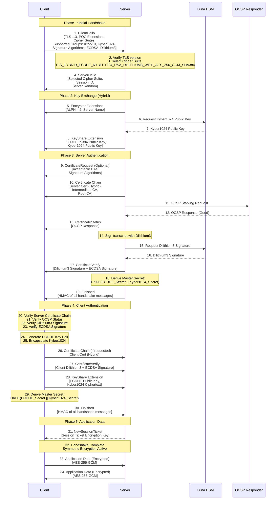
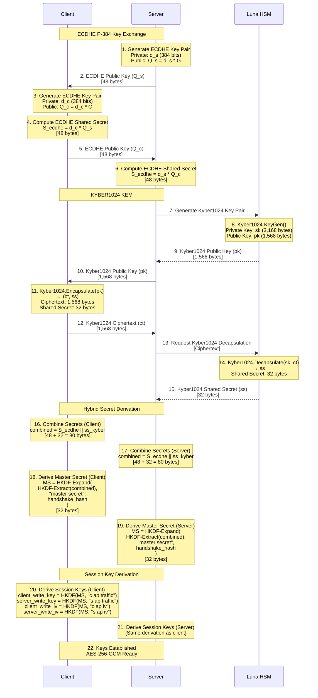
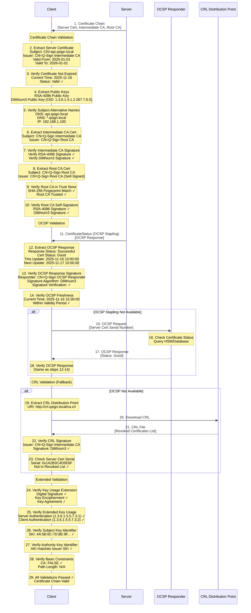
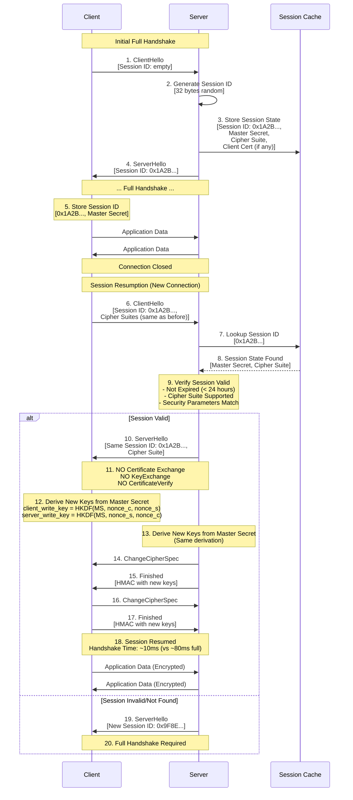
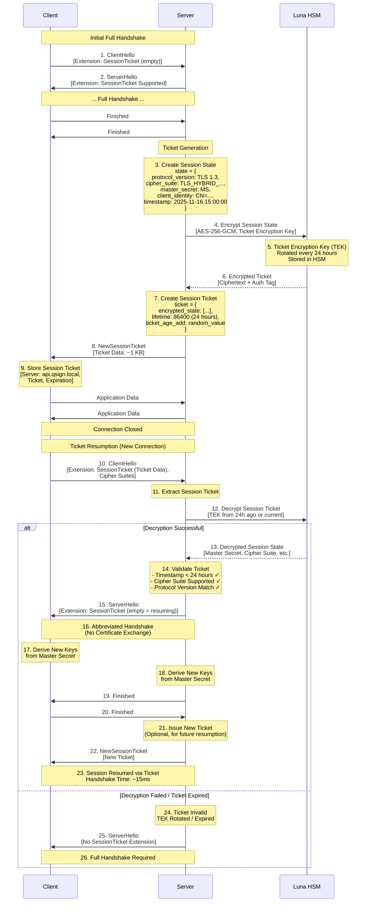
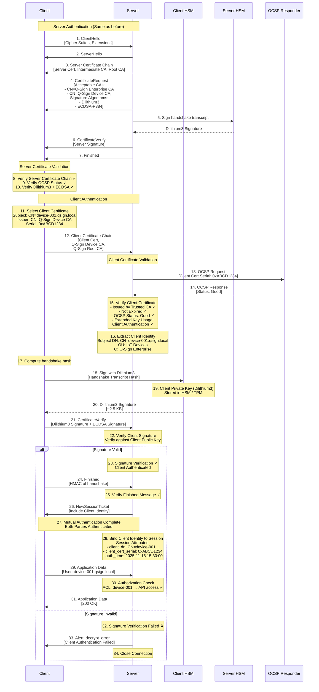
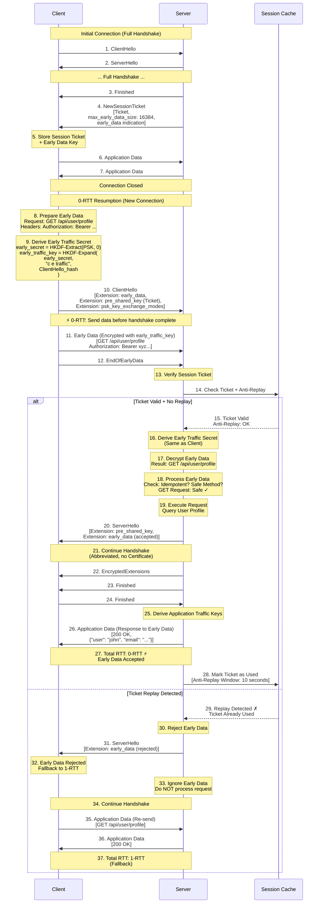
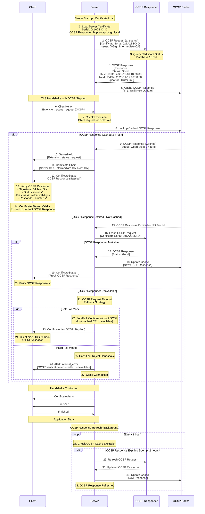

# Q-TLS Sequence Diagrams

Q-TLS (Quantum-resistant Transport Security Layer) 프로토콜의 주요 시퀀스 다이어그램 모음입니다.

## 목차

1. [전체 Q-TLS Hybrid 핸드셰이크](#1-전체-q-tls-hybrid-핸드셰이크)
2. [키 교환 상세 흐름 (KYBER1024 KEM)](#2-키-교환-상세-흐름-kyber1024-kem)
3. [인증서 검증 흐름](#3-인증서-검증-흐름)
4. [Session Resumption (Session ID)](#4-session-resumption-session-id)
5. [Session Ticket 발급 및 재사용](#5-session-ticket-발급-및-재사용)
6. [Mutual TLS 인증 흐름](#6-mutual-tls-인증-흐름)
7. [에러 처리 시나리오](#7-에러-처리-시나리오)
8. [0-RTT 데이터 전송 흐름](#8-0-rtt-데이터-전송-흐름)
9. [OCSP Stapling](#9-ocsp-stapling)
10. [세션 종료 및 재협상](#10-세션-종료-및-재협상)

---

## 1. 전체 Q-TLS Hybrid 핸드셰이크

Q-TLS Hybrid 모드의 전체 핸드셰이크 프로세스 (30+ steps)



### 핸드셰이크 메시지 크기

| 메시지 | 전통 TLS 1.3 | Q-TLS Hybrid | 증가율 |
|--------|-------------|--------------|--------|
| ClientHello | ~200 bytes | ~400 bytes | 2x |
| ServerHello | ~150 bytes | ~300 bytes | 2x |
| Certificate | ~2 KB | ~8 KB | 4x |
| CertificateVerify | ~256 bytes | ~3 KB | 12x |
| KeyShare (Kyber1024) | 32 bytes | 1,568 bytes | 49x |
| **Total Handshake** | **~3 KB** | **~15 KB** | **5x** |

---

## 2. 키 교환 상세 흐름 (KYBER1024 KEM)

KYBER1024 Key Encapsulation Mechanism과 ECDHE의 하이브리드 키 교환



### 키 교환 성능 비교

| 알고리즘 | 키 생성 | Encaps/DH | Decaps/DH | 공개키 크기 | 암호문 크기 |
|---------|---------|-----------|-----------|------------|------------|
| ECDHE P-384 | 0.5ms | 0.5ms | 0.5ms | 48 bytes | 48 bytes |
| Kyber1024 | 0.08ms | 0.12ms | 0.10ms | 1,568 bytes | 1,568 bytes |
| **Hybrid** | **0.58ms** | **0.62ms** | **0.60ms** | **1,616 bytes** | **1,616 bytes** |

---

## 3. 인증서 검증 흐름

X.509v3 하이브리드 인증서 체인 검증 및 OCSP 확인



### 인증서 검증 체크리스트

| 검증 항목 | 설명 | 실패 시 동작 |
|----------|------|------------|
| Expiration | 유효기간 확인 | Alert: certificate_expired |
| Signature | RSA + Dilithium3 서명 검증 | Alert: bad_certificate |
| Chain | 루트 CA까지 체인 검증 | Alert: unknown_ca |
| OCSP/CRL | 폐기 상태 확인 | Alert: certificate_revoked |
| Hostname | SAN/CN 매칭 | Alert: bad_certificate |
| Key Usage | 용도 확장 필드 확인 | Alert: unsupported_certificate |

---

## 4. Session Resumption (Session ID)

Session ID 기반 세션 재개 메커니즘



### Session Resumption 성능 비교

| 메트릭 | Full Handshake | Session Resumption | 개선율 |
|--------|----------------|--------------------|--------|
| Round Trips | 2-RTT | 1-RTT | 50% |
| Handshake Time | ~80ms | ~10ms | 87.5% |
| CPU Usage | 100% | 5% | 95% |
| Network Bandwidth | ~15 KB | ~500 bytes | 97% |
| HSM Operations | 4 ops | 0 ops | 100% |

---

## 5. Session Ticket 발급 및 재사용

RFC 5077 Session Ticket 메커니즘



### Session Ticket vs Session ID

| 특성 | Session ID | Session Ticket |
|------|-----------|----------------|
| 서버 상태 | Stateful (캐시 필요) | Stateless (암호화된 상태) |
| 확장성 | 제한적 (메모리) | 높음 (무제한) |
| 로드 밸런싱 | Sticky Session 필요 | 불필요 (모든 서버 지원) |
| 티켓 크기 | 32 bytes | ~1 KB |
| 보안 | 서버 메모리 | HSM 암호화 |
| 권장 용도 | 단일 서버 | 분산 환경 |

---

## 6. Mutual TLS 인증 흐름

클라이언트 인증서 기반 상호 인증 (mTLS)



### mTLS 사용 사례

| 시나리오 | 클라이언트 인증 | 인증서 발급 | 용도 |
|---------|---------------|-----------|------|
| IoT 디바이스 | 필수 | Device CA | 디바이스 인증 |
| 서비스 간 통신 | 필수 | Service CA | 마이크로서비스 |
| 관리자 접근 | 필수 | User CA | 관리 콘솔 |
| 공개 API | 선택적 | - | 일반 사용자 |

---

## 7. 에러 처리 시나리오

Q-TLS Alert 프로토콜 및 에러 복구

```mermaid
sequenceDiagram
    participant C as Client
    participant S as Server

    Note over C,S: Scenario 1: Unsupported Cipher Suite

    C->>S: 1. ClientHello<br/>[Cipher Suites: TLS_AES_128_GCM_SHA256]

    Note over S: 2. Check Supported Cipher Suites<br/>Required: TLS_HYBRID_ECDHE_KYBER1024_...<br/>Client Offers: TLS_AES_128_GCM_SHA256<br/>Match: None ✗

    S->>C: 3. Alert: handshake_failure<br/>[Alert Level: Fatal,<br/>Alert Description: No shared cipher suite]

    Note over S: 4. Close Connection

    Note over C: 5. Log Error<br/>Retry with Fallback Cipher Suite

    C->>S: 6. ClientHello (Retry)<br/>[Cipher Suites: TLS_HYBRID_..., TLS_AES_256_GCM_SHA384]

    S->>C: 7. ServerHello<br/>[Selected: TLS_HYBRID_...]

    Note over C,S: Scenario 2: Certificate Verification Failure

    C->>S: ClientHello
    S->>C: ServerHello
    S->>C: 8. Certificate Chain<br/>[Server Cert (Expired)]

    Note over C: 9. Verify Certificate<br/>Valid To: 2025-10-01<br/>Current: 2025-11-16<br/>Status: Expired ✗

    C->>S: 10. Alert: certificate_expired<br/>[Alert Level: Fatal]

    Note over C: 11. Close Connection<br/>Log: Server certificate expired

    Note over C,S: Scenario 3: OCSP Revocation

    C->>S: ClientHello
    S->>C: ServerHello
    S->>C: 12. Certificate + OCSP Stapling<br/>[OCSP Status: Revoked]

    Note over C: 13. Verify OCSP Response<br/>Certificate Status: Revoked<br/>Revocation Date: 2025-11-15<br/>Reason: Key Compromise

    C->>S: 14. Alert: certificate_revoked<br/>[Alert Level: Fatal]

    Note over C: 15. Close Connection<br/>Block Server in Local Cache

    Note over C,S: Scenario 4: Signature Verification Failure

    C->>S: ClientHello
    S->>C: ServerHello
    S->>C: Certificate
    S->>C: 16. CertificateVerify<br/>[Dilithium3 Signature (Invalid)]

    Note over C: 17. Verify Signature<br/>Dilithium3.Verify(pk, transcript, sig)<br/>Result: Invalid ✗

    C->>S: 18. Alert: decrypt_error<br/>[Alert Level: Fatal,<br/>Description: Signature verification failed]

    Note over C: 19. Close Connection<br/>Potential MITM Attack Detected

    Note over C,S: Scenario 5: Protocol Version Mismatch

    C->>S: 20. ClientHello<br/>[Supported Versions: TLS 1.2, TLS 1.1]

    Note over S: 21. Check Protocol Version<br/>Required: TLS 1.3 or higher<br/>Client Max: TLS 1.2<br/>Compatible: No ✗

    S->>C: 22. Alert: protocol_version<br/>[Alert Level: Fatal]

    Note over S: 23. Close Connection

    Note over C,S: Scenario 6: Decrypt Error (Bad Finished)

    C->>S: ClientHello
    S->>C: ServerHello
    Note over C,S: ... Handshake ...
    S->>C: Finished
    C->>S: 24. Finished<br/>[HMAC: Invalid]

    Note over S: 25. Verify Finished HMAC<br/>HMAC(master_secret, handshake_hash)<br/>Verification: Failed ✗

    S->>C: 26. Alert: decrypt_error<br/>[Alert Level: Fatal]

    Note over S: 27. Close Connection<br/>Possible Key Derivation Mismatch

    Note over C,S: Scenario 7: Insufficient Security

    C->>S: 28. ClientHello<br/>[Key Share: ECDHE P-256 only,<br/>No Kyber1024]

    Note over S: 29. Security Policy Check<br/>Required: Hybrid PQC (ECDHE + Kyber1024)<br/>Client Offers: ECDHE P-256 only<br/>Policy: Insufficient ✗

    S->>C: 30. Alert: insufficient_security<br/>[Alert Level: Fatal,<br/>Description: PQC required]

    Note over S: 31. Close Connection

    Note over C,S: Scenario 8: Internal Error (HSM Failure)

    C->>S: ClientHello
    S->>C: ServerHello
    S->>C: Certificate

    Note over S: 32. Request HSM Signature<br/>Operation: Dilithium3.Sign

    Note over S: 33. HSM Error<br/>Error: CKR_DEVICE_ERROR<br/>HSM Connection Lost

    S->>C: 34. Alert: internal_error<br/>[Alert Level: Fatal]

    Note over S: 35. Close Connection<br/>Reconnect to Backup HSM
```



### Alert 프로토콜 코드

| Alert Code | 이름 | Level | 설명 | 복구 가능 |
|-----------|------|-------|------|----------|
| 0 | close_notify | Warning | 정상 종료 | N/A |
| 10 | unexpected_message | Fatal | 잘못된 메시지 순서 | No |
| 20 | bad_record_mac | Fatal | MAC 검증 실패 | No |
| 40 | handshake_failure | Fatal | 핸드셰이크 실패 | Yes (Retry) |
| 42 | bad_certificate | Fatal | 인증서 형식 오류 | No |
| 43 | unsupported_certificate | Fatal | 지원되지 않는 인증서 | No |
| 44 | certificate_revoked | Fatal | 인증서 폐기됨 | No |
| 45 | certificate_expired | Fatal | 인증서 만료 | No |
| 46 | certificate_unknown | Fatal | 인증서 검증 실패 | No |
| 47 | illegal_parameter | Fatal | 잘못된 파라미터 | No |
| 48 | unknown_ca | Fatal | 알 수 없는 CA | No |
| 51 | decrypt_error | Fatal | 복호화 실패 | No |
| 70 | protocol_version | Fatal | 프로토콜 버전 불일치 | Yes (Fallback) |
| 71 | insufficient_security | Fatal | 보안 수준 부족 | Yes (Upgrade) |
| 80 | internal_error | Fatal | 내부 오류 | Yes (Retry) |
| 90 | user_canceled | Warning | 사용자 취소 | Yes |

---

## 8. 0-RTT 데이터 전송 흐름

Early Data (0-RTT) 전송 메커니즘



### 0-RTT 보안 고려사항

| 항목 | 위험 | 완화 방법 |
|------|------|----------|
| Replay Attack | 중복 요청 실행 | Anti-replay cache (10초 윈도우) |
| Forward Secrecy | Early data는 PFS 없음 | 민감한 데이터 금지 |
| 안전한 메서드만 허용 | POST/PUT 위험 | GET/HEAD만 허용 또는 멱등성 보장 |
| 데이터 크기 제한 | DoS 공격 | max_early_data_size: 16 KB |

### 0-RTT 허용 조건

```yaml
Early Data 허용 조건:
  메서드:
    - GET (Safe method)
    - HEAD
    - OPTIONS

  금지 메서드:
    - POST (State-changing)
    - PUT
    - DELETE
    - PATCH

  최대 크기:
    - 16 KB (max_early_data_size)

  Anti-Replay:
    - 윈도우: 10초
    - 저장소: Redis / In-Memory Cache
    - Ticket Hash: SHA-256

  권장 사용:
    - Static content
    - Idempotent APIs
    - Public data queries
```

---

## 9. OCSP Stapling

OCSP Stapling을 통한 인증서 상태 확인 최적화



### OCSP Stapling 장점

| 측면 | 기존 OCSP | OCSP Stapling | 개선 |
|------|----------|---------------|------|
| 클라이언트 지연 | ~100ms | 0ms | 100% |
| 프라이버시 | 낮음 (OCSP에 접속 노출) | 높음 (서버만 접속) | ✓ |
| OCSP 서버 부하 | 높음 | 낮음 (캐싱) | 90% 감소 |
| 네트워크 요청 | 클라이언트 → OCSP | 서버 → OCSP (백그라운드) | ✓ |
| 실패 처리 | Soft-fail (취약) | 서버에서 재시도 | ✓ |

### OCSP Stapling 설정

```yaml
# Server Configuration
ocsp_stapling:
  enabled: true

  # OCSP Responder URL (from certificate)
  responder_url: http://ocsp.qsign.local

  # Cache settings
  cache:
    backend: redis  # or memory
    ttl: auto  # Use NextUpdate from OCSP response
    refresh_before_expiry: 2h

  # Timeout settings
  timeout:
    connect: 5s
    read: 10s

  # Failure handling
  on_failure: soft-fail  # or hard-fail

  # Background refresh
  background_refresh:
    enabled: true
    interval: 1h
```

---

## 10. 세션 종료 및 재협상

정상 종료, 재협상, 강제 종료 시나리오

```mermaid
sequenceDiagram
    participant C as Client
    participant S as Server

    Note over C,S: Scenario 1: Normal Session Termination

    Note over C,S: Active Session
    C->>S: Application Data
    S->>C: Application Data

    Note over C: 1. Application Closing<br/>Initiate Graceful Shutdown

    C->>S: 2. Alert: close_notify<br/>[Alert Level: Warning]

    Note over C: 3. Close Write Direction<br/>No more data to send

    S->>C: 4. Application Data (Final)<br/>[Last response]

    Note over S: 5. Acknowledge Close<br/>Finish sending data

    S->>C: 6. Alert: close_notify<br/>[Alert Level: Warning]

    Note over S: 7. Close Write Direction

    Note over C: 8. Receive close_notify<br/>Close Read Direction

    Note over C,S: 9. TCP FIN Handshake

    C->>S: TCP FIN
    S->>C: TCP ACK
    S->>C: TCP FIN
    C->>S: TCP ACK

    Note over C,S: 10. Connection Closed<br/>Session Ended Gracefully

    Note over C,S: Scenario 2: Renegotiation (Key Update)

    Note over C,S: Active Session (Long-lived)

    Note over S: 11. Check Data Volume<br/>Encrypted Data: > 100 GB<br/>Trigger Key Update

    S->>C: 12. KeyUpdate Request<br/>[update_requested: update_requested]

    Note over S: 13. Derive New Application Keys<br/>application_traffic_secret_N+1 = <br/>HKDF-Expand-Label(<br/>  application_traffic_secret_N,<br/>  "traffic upd", "", 32<br/>)

    Note over S: 14. Switch to New Keys<br/>All subsequent messages use new keys

    Note over C: 15. Receive KeyUpdate Request

    Note over C: 16. Derive New Application Keys<br/>(Same derivation as server)

    C->>S: 17. KeyUpdate Response<br/>[update_requested: update_not_requested]

    Note over C: 18. Switch to New Keys

    Note over C,S: 19. Key Update Complete<br/>Continue Application Data

    C->>S: 20. Application Data (New Keys)
    S->>C: 21. Application Data (New Keys)

    Note over C,S: Scenario 3: Post-Handshake Authentication

    Note over C,S: Active Session (Client Not Authenticated)

    Note over S: 22. Require Client Authentication<br/>for Sensitive Operation

    S->>C: 23. CertificateRequest<br/>[Acceptable CAs,<br/>Signature Algorithms]

    Note over C: 24. User Consent<br/>Select Client Certificate

    C->>S: 25. Certificate Chain<br/>[Client Cert]

    C->>S: 26. CertificateVerify<br/>[Dilithium3 + ECDSA Signature]

    C->>S: 27. Finished<br/>[Post-Handshake Auth]

    Note over S: 28. Verify Client Certificate & Signature

    alt Client Authenticated
        Note over S: 29. Client Authentication Success ✓<br/>Upgrade Session Privileges

        S->>C: 30. Finished<br/>[Acknowledgment]

        Note over C,S: 31. Continue with Elevated Privileges

        C->>S: 32. Application Data (Authorized)<br/>[Sensitive Operation]

        S->>C: 33. Application Data<br/>[200 OK]

    else Client Authentication Failed
        Note over S: 34. Client Authentication Failed ✗

        S->>C: 35. Alert: bad_certificate<br/>[Alert Level: Fatal]

        Note over S: 36. Close Connection
    end

    Note over C,S: Scenario 4: Abrupt Connection Close

    Note over C,S: Active Session

    Note over C: 37. Unexpected Error<br/>(Application Crash)

    Note over C: 38. TCP Connection Closed<br/>Without close_notify

    Note over S: 39. Detect Connection Reset<br/>TCP RST or Timeout

    Note over S: 40. Session Cleanup<br/>- Remove from Session Cache<br/>- Free Resources<br/>- Log: Unexpected Close

    Note over S: 41. Security Check<br/>Potential Attack?<br/>Log for Analysis
```



### 세션 종료 비교

| 종료 방식 | close_notify 전송 | TCP FIN | 세션 재개 가능 | 사용 사례 |
|----------|------------------|---------|--------------|----------|
| Normal Close | Yes (양방향) | Yes | Yes | 정상 종료 |
| Half Close | Yes (단방향) | No | Yes | 데이터 수신 대기 |
| Abrupt Close | No | RST | No | 애플리케이션 크래시 |
| Alert Close | Yes (Fatal Alert) | Yes | No | 프로토콜 오류 |

### 재협상 트리거 조건

```yaml
키 업데이트 트리거:
  데이터 볼륨:
    threshold: 100 GB
    action: KeyUpdate Request

  시간 기반:
    threshold: 24 hours
    action: KeyUpdate Request

  세션 업그레이드:
    condition: 민감한 작업 요청
    action: Post-Handshake Authentication

  보안 정책 변경:
    condition: Cipher Suite 변경 필요
    action: Full Renegotiation (New Handshake)
```

---

## 성능 메트릭 요약

### 핸드셰이크 성능 비교

| 시나리오 | RTT | 핸드셰이크 시간 | 네트워크 데이터 | HSM 작업 |
|---------|-----|----------------|----------------|----------|
| Full Handshake | 2-RTT | 80ms | ~15 KB | 4 ops |
| Session ID Resumption | 1-RTT | 10ms | ~500 bytes | 0 ops |
| Session Ticket Resumption | 1-RTT | 15ms | ~1.5 KB | 1 op (decrypt) |
| 0-RTT Early Data | 0-RTT | 5ms | ~2 KB | 1 op (PSK) |

### 보안 레벨 비교

| 프로토콜 | 양자 내성 | Forward Secrecy | 인증 강도 | 권장 용도 |
|---------|----------|-----------------|-----------|----------|
| TLS 1.3 (RSA) | No | No | 중간 | 레거시 호환 |
| TLS 1.3 (ECDHE) | No | Yes | 중간 | 일반 웹 |
| Q-TLS Hybrid | Yes | Yes | 높음 | 엔터프라이즈 |
| Q-TLS PQC Only | Yes | Yes | 최고 | 정부/금융 |

---

## 관련 문서

- [Q-TLS-OVERVIEW.md](./Q-TLS-OVERVIEW.md) - Q-TLS 개요
- [Q-TLS-ARCHITECTURE.md](./Q-TLS-ARCHITECTURE.md) - 아키텍처 설계
- [HANDSHAKE-PROTOCOL.md](./HANDSHAKE-PROTOCOL.md) - 핸드셰이크 프로토콜 상세
- [CIPHER-SUITES.md](./CIPHER-SUITES.md) - 암호화 스위트
- [CERTIFICATE-MANAGEMENT.md](./CERTIFICATE-MANAGEMENT.md) - 인증서 관리
- [IMPLEMENTATION-GUIDE.md](./IMPLEMENTATION-GUIDE.md) - 구현 가이드
- [TESTING-VALIDATION.md](./TESTING-VALIDATION.md) - 테스트 및 검증

---

**Last Updated**: 2025-11-16
**Version**: 1.0.0
**Document Status**: Complete
