# TLS-PQC Hybrid 핸드셰이크 프로토콜

## 📘 개요

Q-TSL의 핵심인 TLS-PQC Hybrid 핸드셰이크 프로토콜에 대한 상세 문서입니다. TLS 1.3을 기반으로 KYBER1024 키 교환 및 DILITHIUM3 서명을 통합한 양자 내성 핸드셰이크를 설명합니다.

## 🔐 TLS 1.3 핸드셰이크 기본

### 표준 TLS 1.3 흐름

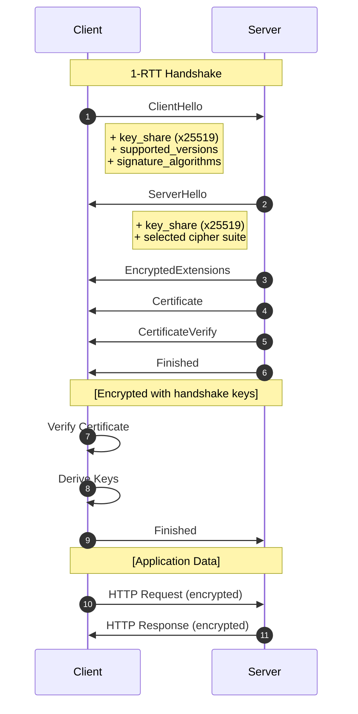

### TLS 1.3 메시지 구조

```yaml
TLS 1.3 Messages:

  ClientHello:
    - Protocol Version: TLS 1.3 (0x0304)
    - Random: 32 bytes
    - Session ID: legacy (compatibility)
    - Cipher Suites: list of supported suites
    - Extensions:
        - supported_versions
        - supported_groups
        - key_share
        - signature_algorithms
        - server_name (SNI)

  ServerHello:
    - Protocol Version: TLS 1.3
    - Random: 32 bytes
    - Cipher Suite: selected suite
    - Extensions:
        - supported_versions
        - key_share

  Certificate:
    - Certificate List
    - Certificate Extensions

  CertificateVerify:
    - Signature Algorithm
    - Signature (over handshake hash)

  Finished:
    - HMAC of handshake transcript
```

## 🚀 Q-TSL Hybrid 핸드셰이크 확장

### Hybrid 핸드셰이크 개요

```yaml
Q-TSL Enhancements:

  Key Exchange:
    Classical: ECDHE P-384
    PQC: KYBER1024
    Combined: KDF(ECDHE_secret || KYBER_secret)

  Authentication:
    Classical: RSA-4096 or ECDSA-P384
    PQC: DILITHIUM3
    Policy: Verify both signatures

  Cipher Suite:
    Key Exchange: Hybrid ECDHE-KYBER1024
    Authentication: Hybrid RSA-DILITHIUM3
    Encryption: AES-256-GCM
    Hash: SHA-384

  Extensions:
    - pqc_supported_groups (new)
    - pqc_signature_algorithms (new)
    - hybrid_mode (new)
```

### 전체 Hybrid 핸드셰이크

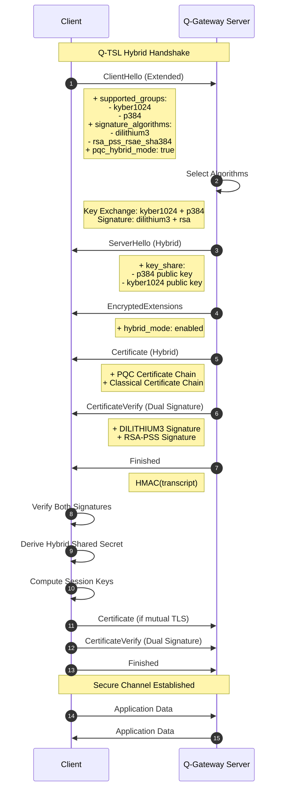

## 📨 ClientHello 메시지

### ClientHello 구조

```yaml
ClientHello (Q-TSL Extended):

  legacy_version: 0x0303 (TLS 1.2 for compatibility)
  random: [32 bytes]
  legacy_session_id: [0-32 bytes]

  cipher_suites:
    # Hybrid Cipher Suites (Preferred)
    - TLS_HYBRID_ECDHE_KYBER1024_RSA_DILITHIUM3_WITH_AES_256_GCM_SHA384 (0xTBD1)
    - TLS_HYBRID_ECDHE_KYBER1024_ECDSA_DILITHIUM3_WITH_AES_256_GCM_SHA384 (0xTBD2)

    # Pure PQC Cipher Suites
    - TLS_KYBER1024_DILITHIUM3_WITH_AES_256_GCM_SHA384 (0xTBD3)

    # Fallback Classical Suites
    - TLS_AES_256_GCM_SHA384 (0x1302)
    - TLS_CHACHA20_POLY1305_SHA256 (0x1303)

  extensions:
    # TLS 1.3 Standard Extensions
    - supported_versions: [0x0304]
    - server_name: "q-gateway.qsign.local"

    # Supported Groups (Classical + PQC)
    - supported_groups:
        # PQC KEMs
        - kyber1024 (0x0512)
        - kyber768 (0x0511)

        # Classical ECDHE
        - x25519 (0x001D)
        - secp384r1 (0x0018)

    # Key Share (Hybrid)
    - key_share:
        client_shares:
          # PQC Key Share
          - group: kyber1024
            key_exchange: [1568 bytes - KYBER1024 public key]

          # Classical Key Share
          - group: secp384r1
            key_exchange: [97 bytes - P-384 public key]

    # Signature Algorithms (Classical + PQC)
    - signature_algorithms:
        # PQC Signatures
        - dilithium3 (0x0B01)
        - dilithium5 (0x0B02)

        # Classical Signatures
        - rsa_pss_rsae_sha384 (0x0805)
        - ecdsa_secp384r1_sha384 (0x0503)

    # PQC Hybrid Mode Extension (Custom)
    - pqc_hybrid_mode:
        enabled: true
        validation_policy: "require_both"
        fallback_allowed: false
```

### ClientHello 생성 예제

```python
def create_client_hello():
    """
    Q-TSL ClientHello 메시지 생성
    """
    client_hello = TLSClientHello()

    # 기본 필드
    client_hello.legacy_version = 0x0303  # TLS 1.2
    client_hello.random = os.urandom(32)
    client_hello.legacy_session_id = b''

    # Cipher Suites (Hybrid 우선)
    client_hello.cipher_suites = [
        CipherSuite.TLS_HYBRID_ECDHE_KYBER1024_RSA_DILITHIUM3_WITH_AES_256_GCM_SHA384,
        CipherSuite.TLS_KYBER1024_DILITHIUM3_WITH_AES_256_GCM_SHA384,
        CipherSuite.TLS_AES_256_GCM_SHA384,  # Fallback
    ]

    # Extensions
    extensions = []

    # 1. Supported Versions
    extensions.append(SupportedVersionsExtension(
        versions=[0x0304]  # TLS 1.3
    ))

    # 2. Server Name Indication
    extensions.append(ServerNameExtension(
        server_name="q-gateway.qsign.local"
    ))

    # 3. Supported Groups (PQC + Classical)
    extensions.append(SupportedGroupsExtension(
        named_group_list=[
            NamedGroup.kyber1024,
            NamedGroup.kyber768,
            NamedGroup.x25519,
            NamedGroup.secp384r1,
        ]
    ))

    # 4. Key Share (Hybrid)
    # KYBER1024 키 생성
    kyber_keypair = kyber1024_keygen()
    # ECDHE P-384 키 생성
    ecdhe_keypair = ecdh_p384_keygen()

    extensions.append(KeyShareExtension(
        client_shares=[
            KeyShareEntry(
                group=NamedGroup.kyber1024,
                key_exchange=kyber_keypair.public_key
            ),
            KeyShareEntry(
                group=NamedGroup.secp384r1,
                key_exchange=ecdhe_keypair.public_key
            ),
        ]
    ))

    # 5. Signature Algorithms (PQC + Classical)
    extensions.append(SignatureAlgorithmsExtension(
        supported_signature_algorithms=[
            SignatureScheme.dilithium3,
            SignatureScheme.dilithium5,
            SignatureScheme.rsa_pss_rsae_sha384,
            SignatureScheme.ecdsa_secp384r1_sha384,
        ]
    ))

    # 6. PQC Hybrid Mode (Custom Extension)
    extensions.append(PQCHybridModeExtension(
        enabled=True,
        validation_policy="require_both",
        fallback_allowed=False
    ))

    client_hello.extensions = extensions

    return client_hello
```

### ClientHello 다이어그램

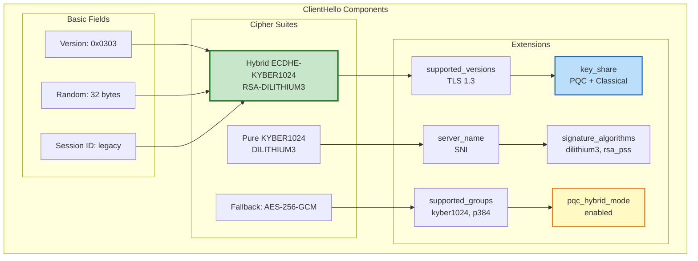

## 📩 ServerHello 및 알고리즘 협상

### ServerHello 구조

```yaml
ServerHello (Q-TSL):

  legacy_version: 0x0303
  random: [32 bytes]
  legacy_session_id_echo: [client session id]

  cipher_suite:
    # Selected Hybrid Suite
    - TLS_HYBRID_ECDHE_KYBER1024_RSA_DILITHIUM3_WITH_AES_256_GCM_SHA384

  extensions:
    # Supported Versions
    - supported_versions: 0x0304

    # Key Share (Server's public keys)
    - key_share:
        server_share:
          # KYBER1024 Server Public Key
          - group: kyber1024
            key_exchange: [1568 bytes]

          # ECDHE P-384 Server Public Key
          - group: secp384r1
            key_exchange: [97 bytes]

    # Hybrid Mode Confirmation
    - pqc_hybrid_mode:
        enabled: true
        selected_pqc_kem: kyber1024
        selected_classical_kem: secp384r1
        selected_pqc_sig: dilithium3
        selected_classical_sig: rsa_pss_rsae_sha384
```

### 알고리즘 협상 로직

```python
def negotiate_algorithms(client_hello, server_config):
    """
    서버의 알고리즘 협상 로직
    """

    # 1. Cipher Suite 선택
    selected_cipher = None
    for suite in client_hello.cipher_suites:
        if suite in server_config.supported_cipher_suites:
            selected_cipher = suite
            break

    if not selected_cipher:
        raise TLSAlert(AlertDescription.handshake_failure)

    # 2. Key Exchange Algorithm 선택
    pqc_kem = None
    classical_kem = None

    for group in client_hello.supported_groups:
        if group in [NamedGroup.kyber1024, NamedGroup.kyber768]:
            if not pqc_kem:
                pqc_kem = group
        elif group in [NamedGroup.secp384r1, NamedGroup.x25519]:
            if not classical_kem:
                classical_kem = group

    if server_config.hybrid_mode_required:
        if not (pqc_kem and classical_kem):
            raise TLSAlert(AlertDescription.insufficient_security)

    # 3. Signature Algorithm 선택
    pqc_sig = None
    classical_sig = None

    for sig in client_hello.signature_algorithms:
        if sig in [SignatureScheme.dilithium3, SignatureScheme.dilithium5]:
            if not pqc_sig:
                pqc_sig = sig
        elif sig in [SignatureScheme.rsa_pss_rsae_sha384, SignatureScheme.ecdsa_secp384r1_sha384]:
            if not classical_sig:
                classical_sig = sig

    if server_config.hybrid_mode_required:
        if not (pqc_sig and classical_sig):
            raise TLSAlert(AlertDescription.insufficient_security)

    return {
        'cipher_suite': selected_cipher,
        'pqc_kem': pqc_kem,
        'classical_kem': classical_kem,
        'pqc_sig': pqc_sig,
        'classical_sig': classical_sig,
    }
```

### 협상 다이어그램

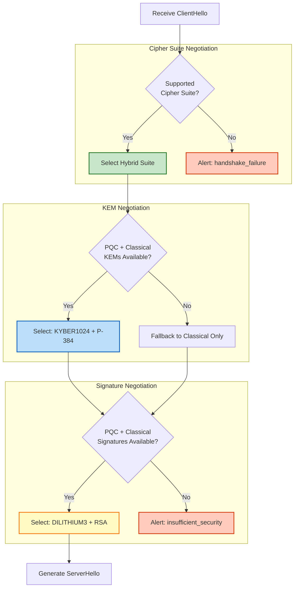

## 🔑 키 교환 (KYBER1024 KEM + ECDHE)

### Hybrid 키 교환 프로세스

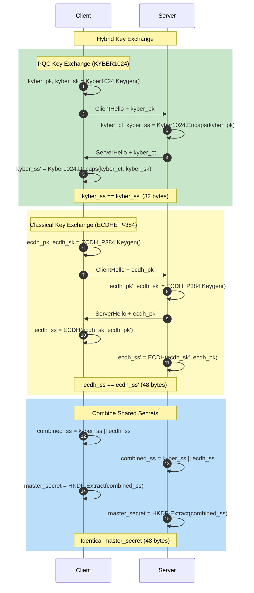

### 키 파생 함수 (KDF)

```python
def derive_hybrid_shared_secret(kyber_ss, ecdh_ss, handshake_context):
    """
    Hybrid 공유 비밀 파생
    """

    # 1. Shared Secret 결합
    combined_ss = kyber_ss + ecdh_ss  # 32 + 48 = 80 bytes

    # 2. HKDF-Extract (Early Secret)
    early_secret = HKDF_Extract(
        salt=b'\x00' * 32,
        ikm=b'\x00' * 32
    )

    # 3. Derive Handshake Secret
    handshake_secret = HKDF_Expand_Label(
        secret=Derive_Secret(early_secret, "derived", ""),
        label="handshake",
        context=combined_ss,
        length=48
    )

    # 4. Derive Handshake Keys
    client_handshake_traffic_secret = HKDF_Expand_Label(
        secret=handshake_secret,
        label="c hs traffic",
        context=handshake_context,
        length=48
    )

    server_handshake_traffic_secret = HKDF_Expand_Label(
        secret=handshake_secret,
        label="s hs traffic",
        context=handshake_context,
        length=48
    )

    # 5. Derive Master Secret
    master_secret = HKDF_Expand_Label(
        secret=Derive_Secret(handshake_secret, "derived", ""),
        label="master",
        context=handshake_context,
        length=48
    )

    # 6. Derive Application Keys
    client_application_traffic_secret = HKDF_Expand_Label(
        secret=master_secret,
        label="c ap traffic",
        context=handshake_context,
        length=48
    )

    server_application_traffic_secret = HKDF_Expand_Label(
        secret=master_secret,
        label="s ap traffic",
        context=handshake_context,
        length=48
    )

    return {
        'handshake_secret': handshake_secret,
        'master_secret': master_secret,
        'client_handshake_key': derive_key(client_handshake_traffic_secret),
        'server_handshake_key': derive_key(server_handshake_traffic_secret),
        'client_application_key': derive_key(client_application_traffic_secret),
        'server_application_key': derive_key(server_application_traffic_secret),
    }
```

### 키 파생 다이어그램

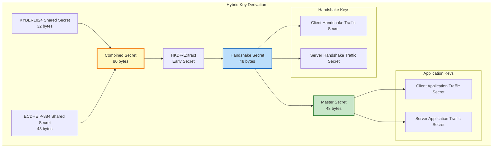

## ✍️ 서버 인증 (DILITHIUM3 + RSA/ECDSA 서명)

### Dual Signature 검증

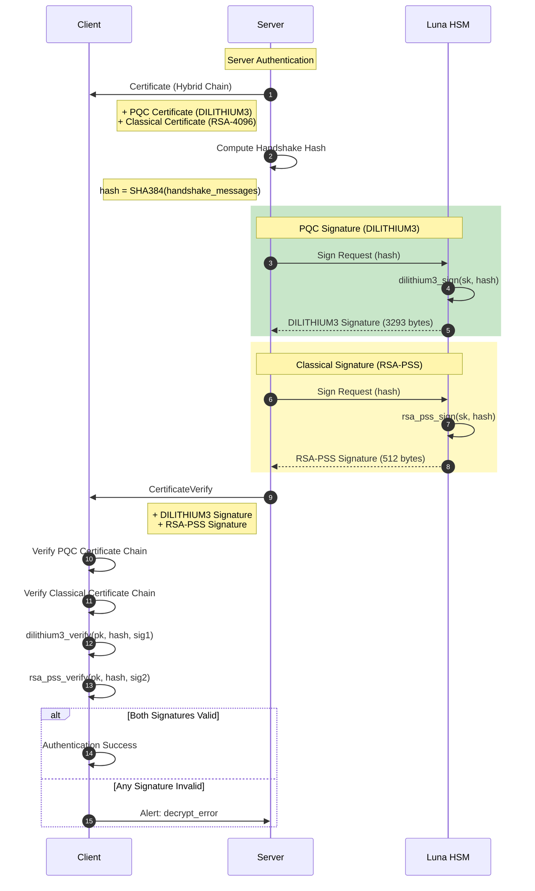

### CertificateVerify 메시지

```yaml
CertificateVerify (Hybrid):

  # PQC Signature
  pqc_signature:
    algorithm: dilithium3
    signature: [3293 bytes]

  # Classical Signature
  classical_signature:
    algorithm: rsa_pss_rsae_sha384
    signature: [512 bytes]

  # Signature Context
  context: "TLS 1.3, server CertificateVerify"

  # Signed Data
  signed_data:
    - context_string: "TLS 1.3, server CertificateVerify"
    - separator: 0x00
    - handshake_hash: SHA384(all handshake messages)
```

### 서명 검증 코드

```python
def verify_server_authentication(certificate_verify, handshake_messages, cert_chain):
    """
    서버 인증 검증 (Dual Signature)
    """

    # 1. Handshake Hash 계산
    handshake_hash = hashlib.sha384(handshake_messages).digest()

    # 2. Signed Data 구성
    context_string = b"TLS 1.3, server CertificateVerify"
    signed_data = context_string + b'\x00' + handshake_hash

    # 3. PQC 인증서 체인 검증
    pqc_cert = cert_chain['pqc']
    if not verify_certificate_chain(pqc_cert):
        raise TLSAlert(AlertDescription.bad_certificate)

    # 4. Classical 인증서 체인 검증
    classical_cert = cert_chain['classical']
    if not verify_certificate_chain(classical_cert):
        raise TLSAlert(AlertDescription.bad_certificate)

    # 5. DILITHIUM3 서명 검증
    pqc_public_key = extract_public_key(pqc_cert)
    pqc_signature = certificate_verify['pqc_signature']

    pqc_valid = dilithium3_verify(
        public_key=pqc_public_key,
        message=signed_data,
        signature=pqc_signature
    )

    # 6. RSA-PSS 서명 검증
    classical_public_key = extract_public_key(classical_cert)
    classical_signature = certificate_verify['classical_signature']

    classical_valid = rsa_pss_verify(
        public_key=classical_public_key,
        message=signed_data,
        signature=classical_signature,
        hash_algorithm='sha384'
    )

    # 7. Hybrid 정책 검증
    if not (pqc_valid and classical_valid):
        raise TLSAlert(AlertDescription.decrypt_error)

    return True
```

## 👤 클라이언트 인증 (Mutual TLS)

### Mutual TLS 흐름

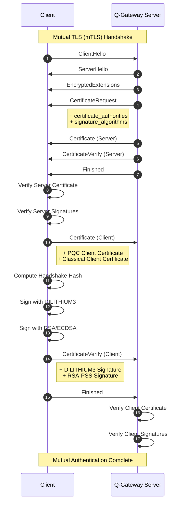

### CertificateRequest 메시지

```yaml
CertificateRequest:

  certificate_request_context: [opaque]

  extensions:
    # Signature Algorithms
    - signature_algorithms:
        - dilithium3
        - rsa_pss_rsae_sha384
        - ecdsa_secp384r1_sha384

    # Signature Algorithms Cert
    - signature_algorithms_cert:
        - dilithium3
        - rsa_pss_rsae_sha384

    # Certificate Authorities
    - certificate_authorities:
        - "CN=QSIGN Client CA, O=Q-Sign"
        - "CN=QSIGN Root CA, O=Q-Sign"

    # PQC Hybrid Mode
    - pqc_hybrid_mode:
        require_pqc: true
        require_classical: true
```

## ✅ Finished 메시지 및 세션 키 파생

### Finished 메시지

```yaml
Finished Message:

  verify_data:
    # HMAC of all handshake messages
    HMAC-SHA384(
      finished_key,
      Transcript-Hash(all handshake messages)
    )

  finished_key:
    # Client Finished Key
    HKDF-Expand-Label(
      client_handshake_traffic_secret,
      "finished",
      "",
      32
    )

    # Server Finished Key
    HKDF-Expand-Label(
      server_handshake_traffic_secret,
      "finished",
      "",
      32
    )
```

### Finished 검증 흐름

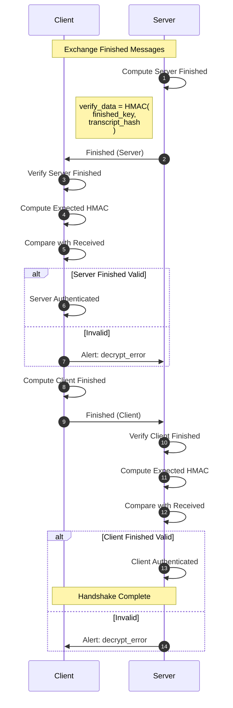

### 세션 키 파생

```python
def derive_session_keys(master_secret, handshake_context):
    """
    애플리케이션 세션 키 파생
    """

    # 1. Application Traffic Secrets
    client_app_secret = HKDF_Expand_Label(
        secret=master_secret,
        label="c ap traffic",
        context=handshake_context,
        length=48
    )

    server_app_secret = HKDF_Expand_Label(
        secret=master_secret,
        label="s ap traffic",
        context=handshake_context,
        length=48
    )

    # 2. Derive AES-256-GCM Keys
    client_write_key = HKDF_Expand_Label(
        secret=client_app_secret,
        label="key",
        context=b"",
        length=32  # AES-256
    )

    server_write_key = HKDF_Expand_Label(
        secret=server_app_secret,
        label="key",
        context=b"",
        length=32
    )

    # 3. Derive IVs
    client_write_iv = HKDF_Expand_Label(
        secret=client_app_secret,
        label="iv",
        context=b"",
        length=12  # GCM nonce
    )

    server_write_iv = HKDF_Expand_Label(
        secret=server_app_secret,
        label="iv",
        context=b"",
        length=12
    )

    # 4. Exporter Master Secret (for Key Export)
    exporter_master_secret = HKDF_Expand_Label(
        secret=master_secret,
        label="exp master",
        context=handshake_context,
        length=48
    )

    # 5. Resumption Master Secret (for Session Resumption)
    resumption_master_secret = HKDF_Expand_Label(
        secret=master_secret,
        label="res master",
        context=handshake_context,
        length=48
    )

    return {
        'client_write_key': client_write_key,
        'server_write_key': server_write_key,
        'client_write_iv': client_write_iv,
        'server_write_iv': server_write_iv,
        'exporter_master_secret': exporter_master_secret,
        'resumption_master_secret': resumption_master_secret,
    }
```

## 🔄 Session Resumption

### Session ID 기반 재개

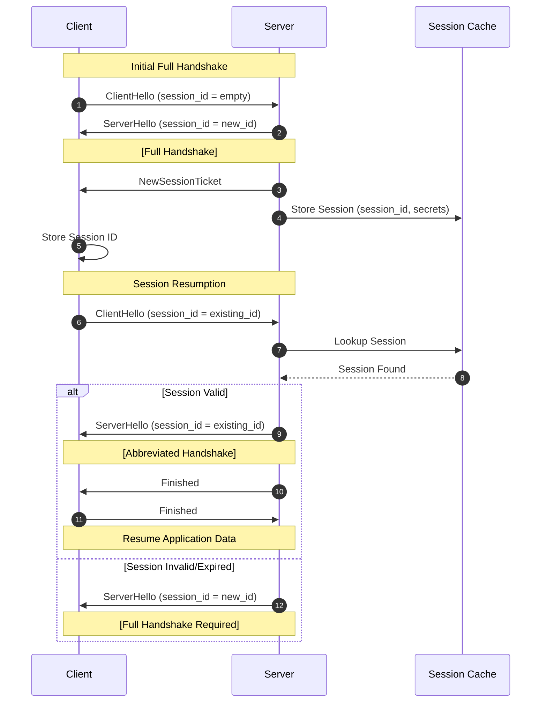

### Session Ticket 기반 재개

```yaml
NewSessionTicket:

  ticket_lifetime: 86400  # 24 hours
  ticket_age_add: [random 32-bit value]
  ticket_nonce: [random value]

  ticket: [encrypted session state]
    # Encrypted with ticket_encryption_key
    encrypted_data:
      - protocol_version: TLS 1.3
      - cipher_suite: TLS_HYBRID_ECDHE_KYBER1024_RSA_DILITHIUM3_WITH_AES_256_GCM_SHA384
      - resumption_master_secret: [48 bytes]
      - client_identity: [cert fingerprint]
      - issue_time: [timestamp]
      - pqc_algorithms: [kyber1024, dilithium3]

  extensions:
    - early_data: max_early_data_size = 16384
```

### Session Resumption 흐름

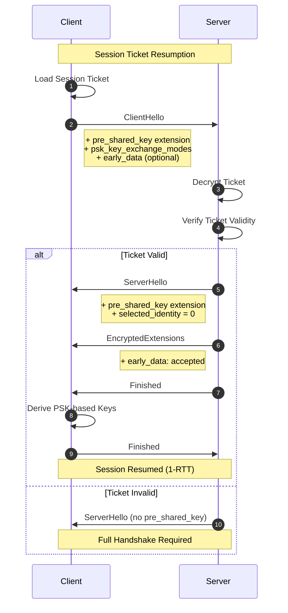

## 🚀 0-RTT 데이터 전송

### 0-RTT 개요

```yaml
0-RTT (Zero Round-Trip Time):

  Benefits:
    - Faster connection establishment
    - Reduced latency for repeated connections
    - Improved user experience

  Security Considerations:
    - No forward secrecy for 0-RTT data
    - Replay attack vulnerability
    - Anti-replay mechanisms required

  Use Cases:
    - HTTP GET requests
    - Idempotent operations only
    - Read-only API calls

  Restrictions:
    - No state-changing operations
    - Limited to max_early_data_size
    - Server can reject early data
```

### 0-RTT 흐름

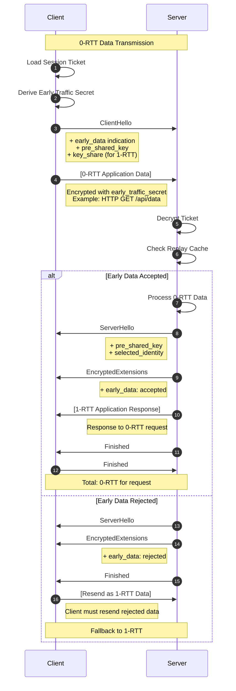

### Anti-Replay 메커니즘

```python
class AntiReplayCache:
    """
    0-RTT Replay Attack 방지
    """

    def __init__(self, window_size=10):
        self.cache = {}
        self.window_size = window_size  # seconds

    def check_and_store(self, ticket_hash, timestamp):
        """
        티켓 해시를 확인하고 저장
        """
        current_time = time.time()

        # 1. 시간 윈도우 확인
        if abs(current_time - timestamp) > self.window_size:
            return False, "Timestamp out of window"

        # 2. Replay 확인
        if ticket_hash in self.cache:
            cached_time = self.cache[ticket_hash]
            if current_time - cached_time < self.window_size:
                return False, "Replay detected"

        # 3. 캐시에 저장
        self.cache[ticket_hash] = current_time

        # 4. 오래된 항목 정리
        self._cleanup_old_entries(current_time)

        return True, "Accepted"

    def _cleanup_old_entries(self, current_time):
        """
        만료된 캐시 항목 제거
        """
        expired = [
            key for key, timestamp in self.cache.items()
            if current_time - timestamp > self.window_size
        ]
        for key in expired:
            del self.cache[key]
```

### 0-RTT 보안 다이어그램

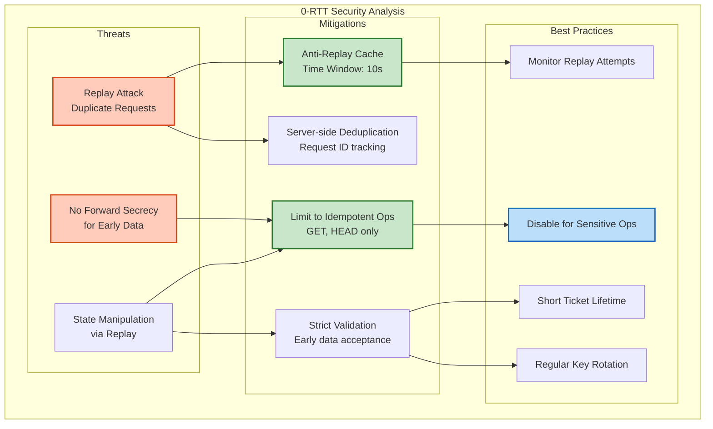

## 🔗 참고 자료

```yaml
Standards:
  TLS 1.3:
    - RFC 8446: The Transport Layer Security (TLS) Protocol Version 1.3
    - RFC 8448: Example Handshake Traces for TLS 1.3

  PQC Extensions:
    - IETF Draft: Hybrid Key Exchange in TLS 1.3
    - NIST FIPS 203: ML-KEM (KYBER)
    - NIST FIPS 204: ML-DSA (DILITHIUM)

  Session Resumption:
    - RFC 5077: TLS Session Resumption without Server-Side State
    - RFC 8446 Section 4.6: Session Tickets

  0-RTT:
    - RFC 8446 Section 2.3: 0-RTT Data
    - RFC 8446 Appendix E.5: Replay Attacks on 0-RTT

Implementation:
  - OpenSSL with OQS Provider
  - BoringSSL with PQC Support
  - liboqs: Open Quantum Safe Library
```

---

**Last Updated**: 2025-11-16
**Version**: 1.0.0
**Protocol**: TLS 1.3 with PQC Extensions
**Security Level**: NIST Level 3-5
