# Q-TSL 개요 (Q-TSL Overview)

> **Q-TSL (Quantum-resistant Transport Security Layer)** - 양자 내성 전송 보안 계층
> Post-Quantum Cryptography를 적용한 차세대 TLS/SSL 프로토콜

---

## 📑 목차

1. [Q-TSL이란 무엇인가](#1-q-tsl이란-무엇인가)
2. [양자 위협과 PQC의 필요성](#2-양자-위협과-pqc의-필요성)
3. [TLS-PQC Hybrid Mode](#3-tls-pqc-hybrid-mode)
4. [Q-TSL vs 전통적 TLS 1.3 비교](#4-q-tsl-vs-전통적-tls-13-비교)
5. [QSIGN에서의 Q-TSL 역할](#5-qsign에서의-q-tsl-역할)
6. [핵심 이점 및 특징](#6-핵심-이점-및-특징)
7. [기술적 배경](#7-기술적-배경)
8. [마이그레이션 전략](#8-마이그레이션-전략)

---

## 1. Q-TSL이란 무엇인가

### 1.1 정의

**Q-TSL (Quantum-resistant Transport Security Layer)** 또는 **Q-SSL (Quantum-resistant Secure Sockets Layer)** 은 QSIGN 시스템에서 사용하는 양자 내성(Quantum-resistant) 전송 보안 계층 프로토콜입니다.

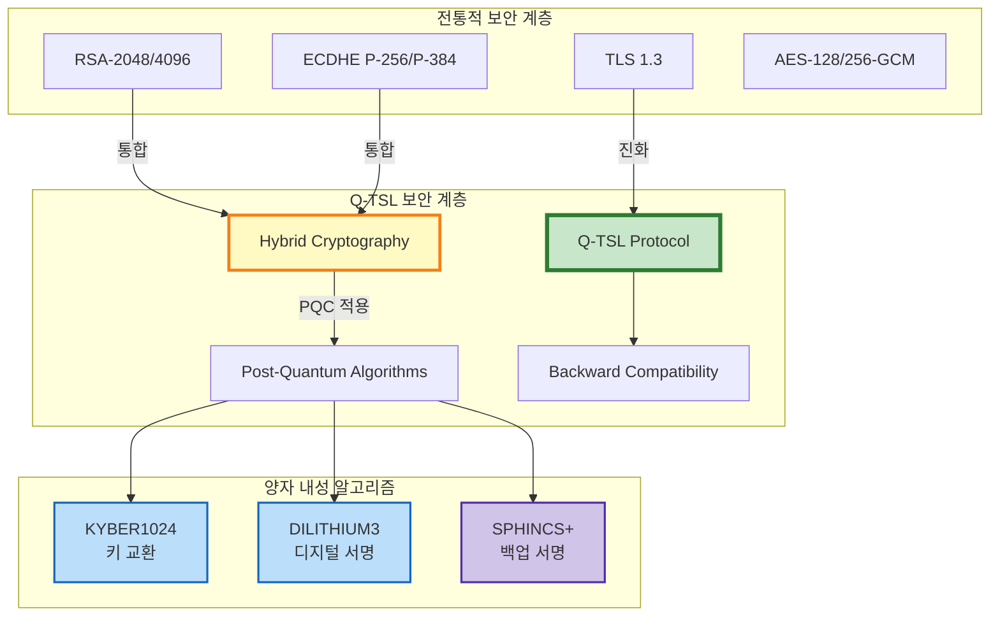

### 1.2 배경 및 필요성

#### 양자 컴퓨팅의 위협

현재 널리 사용되는 공개키 암호화 알고리즘(RSA, ECDSA, ECDH 등)은 **양자 컴퓨터**의 등장으로 심각한 위협을 받고 있습니다.

**Shor's Algorithm (쇼어 알고리즘)**
- 양자 컴퓨터에서 효율적으로 소인수분해와 이산대수 문제 해결
- RSA, DSA, ECDSA, ECDH 등의 암호 체계를 다항 시간에 파괴 가능
- 예상 타임라인: 2030-2040년경 충분한 큐비트를 가진 양자 컴퓨터 등장

**Grover's Algorithm (그로버 알고리즘)**
- 대칭키 암호의 키 공간 탐색 속도를 제곱근으로 단축
- AES-128은 AES-64 수준으로, AES-256은 AES-128 수준으로 약화
- 대응: 키 길이 2배 증가 (AES-256 → 양자 환경에서 128비트 보안)

#### "Harvest Now, Decrypt Later" 공격

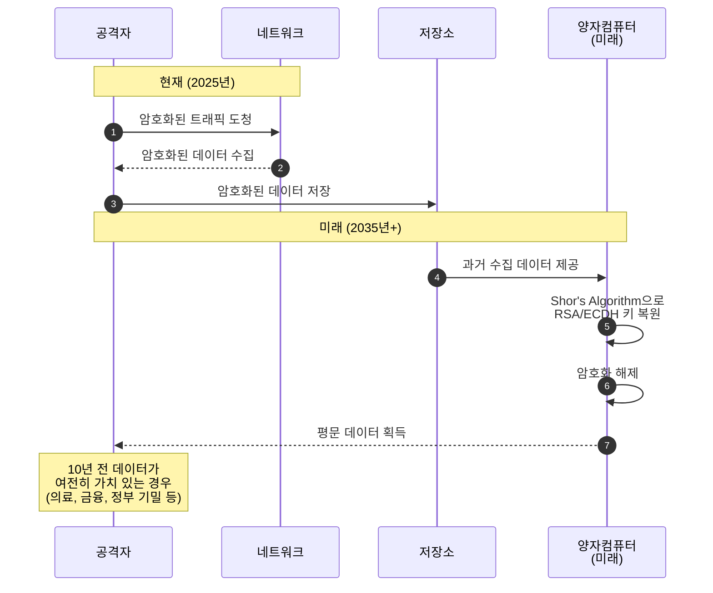

**대응 전략**
- **지금 당장** PQC로 전환하여 미래 양자 컴퓨터 공격에 대비
- 하이브리드 모드로 점진적 전환하여 호환성 유지
- 장기 보관 데이터는 PQC로 재암호화

### 1.3 Q-TSL의 핵심 개념

```yaml
Q-TSL 핵심 개념:

  1. Hybrid Cryptography (하이브리드 암호화):
     목적: 전통 암호 + PQC 동시 사용으로 안전성 극대화
     방식:
       - 키 교환: ECDHE + KYBER1024
       - 서명: RSA/ECDSA + DILITHIUM3
       - 세션 키: 두 알고리즘 결과 조합
     장점:
       - 둘 중 하나라도 안전하면 전체 시스템 안전
       - 기존 시스템과 호환성 유지
       - 점진적 마이그레이션 가능

  2. Quantum Resistance (양자 내성):
     정의: 양자 컴퓨터 공격에 안전한 암호 알고리즘 사용
     알고리즘 선택 기준:
       - NIST 표준화 완료 (FIPS 203/204/205)
       - 보안 증명 및 분석 완료
       - 산업계 검증 및 채택
     보안 수준:
       - NIST Level 3 (AES-192 equivalent)
       - NIST Level 5 (AES-256 equivalent)

  3. Backward Compatibility (하위 호환성):
     레거시 시스템 지원:
       - TLS 1.2/1.3 클라이언트 지원
       - 순수 RSA/ECDSA 인증서 허용
       - Graceful Degradation
     협상 프로세스:
       - 클라이언트가 PQC 지원 → Q-TSL Hybrid
       - 클라이언트가 PQC 미지원 → TLS 1.3 Classical
       - 서버 정책에 따라 강제 가능

  4. Forward Secrecy (전방향 안전성):
     개념: 세션 키가 노출되어도 과거/미래 세션 안전
     구현:
       - 각 세션마다 임시 키 쌍 생성
       - 세션 종료 후 즉시 키 삭제
       - 장기 키로부터 세션 키 유도 불가
     Q-TSL에서:
       - KYBER1024 KEM: 임시 공개키 사용
       - ECDHE: 임시 ECDH 키 사용
       - 양쪽 모두 Perfect Forward Secrecy 제공
```

### 1.4 Q-TSL 프로토콜 스택

```mermaid
graph TB
    subgraph "OSI 7 Layer Model"
        L7[Layer 7: Application<br/>HTTP/2, gRPC, WebSocket]
        L6[Layer 6: Presentation<br/>Data Encoding/Decoding]
        L5[Layer 5: Session<br/>Session Management]

        subgraph QTSL["Q-TSL Layer (세션/전송 사이)"]
            HS[Handshake Protocol<br/>키 교환, 인증, 협상]
            REC[Record Protocol<br/>암호화, 무결성, 재전송 방지]
            ALERT[Alert Protocol<br/>에러 및 경고]
            CCS[ChangeCipherSpec<br/>암호 스위트 전환]
        end

        L4[Layer 4: Transport<br/>TCP/UDP]
        L3[Layer 3: Network<br/>IP]
        L2[Layer 2: Data Link<br/>Ethernet]
        L1[Layer 1: Physical<br/>Physical Medium]
    end

    L7 --> L6
    L6 --> L5
    L5 --> HS
    HS --> REC
    REC --> ALERT
    ALERT --> CCS
    CCS --> L4
    L4 --> L3
    L3 --> L2
    L2 --> L1

    style QTSL fill:#c8e6c9,stroke:#2e7d32,stroke-width:4px
    style HS fill:#bbdefb,stroke:#1565c0,stroke-width:2px
    style REC fill:#fff9c4,stroke:#f57f17,stroke-width:2px
```

### 1.5 Q-TSL 설계 원칙

```yaml
Q-TSL 설계 원칙:

  1. Security First (보안 최우선):
     - NIST 승인 알고리즘만 사용
     - 보안 파라미터 최대화 (KYBER1024, DILITHIUM3)
     - 약한 알고리즘 자동 거부
     - 다운그레이드 공격 방지

  2. Performance Conscious (성능 고려):
     - 핸드셰이크 최적화 (Session Resumption)
     - Hardware Acceleration (HSM, AES-NI)
     - Efficient Encoding (압축 및 최적화)
     - Connection Pooling

  3. Interoperability (상호운용성):
     - TLS 1.3 확장으로 구현
     - 표준 X.509 인증서 구조 사용
     - 기존 TLS 라이브러리 통합 가능
     - Multi-platform 지원

  4. Flexibility (유연성):
     - 다양한 암호 스위트 지원
     - Hybrid 모드 선택 가능
     - Policy-based 설정
     - 점진적 마이그레이션 지원

  5. Observability (관찰 가능성):
     - 상세한 핸드셰이크 로깅
     - 암호 스위트 협상 추적
     - 성능 메트릭 수집
     - 보안 이벤트 감사
```

---

## 2. 양자 위협과 PQC의 필요성

### 2.1 양자 컴퓨터의 발전 현황

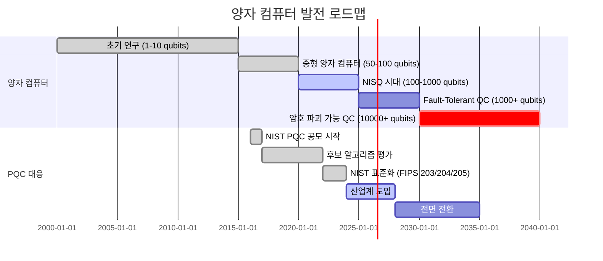

#### 주요 양자 컴퓨터 플랫폼

| 기업/기관 | 큐비트 수 (2024) | 목표 (2030) | 기술 |
|----------|----------------|-----------|------|
| IBM | 1,121 qubits (Condor) | 100,000+ | Superconducting |
| Google | 70 qubits (Sycamore 2) | 1,000,000 | Superconducting |
| IonQ | 32 qubits | 1,024 | Trapped Ion |
| Atom Computing | 1,180 qubits | 10,000+ | Neutral Atom |
| Microsoft | - (Topological) | 1,000+ | Topological |

**암호 파괴에 필요한 큐비트 수**
- RSA-2048 파괴: ~4,000 논리 큐비트 (약 20,000 물리 큐비트)
- ECDH P-256 파괴: ~2,330 논리 큐비트
- 예상 도달 시기: 2030-2040년

### 2.2 양자 위협 분석

```mermaid
graph TB
    subgraph "양자 컴퓨터 공격 대상"
        subgraph "취약한 알고리즘"
            V1[RSA<br/>소인수분해]
            V2[DSA/ECDSA<br/>이산대수 문제]
            V3[ECDH/ECDHE<br/>타원곡선 이산대수]
            V4[전통적 키 교환<br/>Diffie-Hellman]
        end

        subgraph "상대적으로 안전한 알고리즘"
            S1[AES-256<br/>대칭키 암호]
            S2[SHA-384/512<br/>해시 함수]
            S3[HMAC<br/>메시지 인증]
        end
    end

    subgraph "양자 알고리즘"
        SHOR[Shor's Algorithm<br/>다항 시간 공격]
        GROVER[Grover's Algorithm<br/>제곱근 가속]
    end

    SHOR -.->|파괴| V1
    SHOR -.->|파괴| V2
    SHOR -.->|파괴| V3
    SHOR -.->|파괴| V4

    GROVER -.->|약화<br/>(키 길이 2배 필요)| S1
    GROVER -.->|약화| S2
    GROVER -.->|약화| S3

    style V1 fill:#ffebee,stroke:#c62828,stroke-width:3px
    style V2 fill:#ffebee,stroke:#c62828,stroke-width:3px
    style V3 fill:#ffebee,stroke:#c62828,stroke-width:3px
    style V4 fill:#ffebee,stroke:#c62828,stroke-width:3px
    style S1 fill:#fff9c4,stroke:#f57f17,stroke-width:2px
    style S2 fill:#fff9c4,stroke:#f57f17,stroke-width:2px
    style SHOR fill:#d1c4e9,stroke:#512da8,stroke-width:3px
```

#### 공격 시나리오

**시나리오 1: TLS 핸드셰이크 공격**
```
1. 공격자가 TLS 핸드셰이크 트래픽 캡처
2. 양자 컴퓨터로 ECDHE 키 교환 해독
3. Pre-master Secret 복원
4. Master Secret 및 세션 키 유도
5. 모든 암호화 트래픽 해독

위험도: ★★★★★ (치명적)
발생 가능 시기: 2030-2040년
영향 범위: 모든 TLS 1.2/1.3 통신
```

**시나리오 2: 인증서 위조 공격**
```
1. CA의 RSA 또는 ECDSA 개인키 해독
2. 임의의 도메인에 대한 인증서 위조
3. Man-in-the-Middle (MITM) 공격 수행
4. 사용자 인증 정보 탈취

위험도: ★★★★★ (치명적)
발생 가능 시기: 2030-2040년
영향 범위: PKI 전체 인프라
```

**시나리오 3: 저장된 데이터 복호화**
```
1. 과거 암호화된 데이터 확보 (백업, 아카이브)
2. 양자 컴퓨터로 키 추출
3. 오래된 민감 정보 유출

위험도: ★★★★☆ (높음)
발생 가능 시기: 2030-2040년
영향 범위: 장기 보관 데이터 (의료, 금융, 정부)
```

### 2.3 Post-Quantum Cryptography (PQC)

#### NIST PQC 표준화 프로세스

```mermaid
graph LR
    subgraph "NIST PQC Standardization"
        START[2016년<br/>공모 시작]
        R1[Round 1<br/>69개 알고리즘]
        R2[Round 2<br/>26개 알고리즘]
        R3[Round 3<br/>7개 최종 후보]
        FINAL[2024년<br/>표준 승인]
    end

    subgraph "선정 알고리즘"
        KEM[FIPS 203<br/>ML-KEM (Kyber)]
        SIG1[FIPS 204<br/>ML-DSA (Dilithium)]
        SIG2[FIPS 205<br/>SLH-DSA (SPHINCS+)]
    end

    START --> R1
    R1 --> R2
    R2 --> R3
    R3 --> FINAL

    FINAL --> KEM
    FINAL --> SIG1
    FINAL --> SIG2

    style FINAL fill:#c8e6c9,stroke:#2e7d32,stroke-width:3px
    style KEM fill:#bbdefb,stroke:#1565c0,stroke-width:2px
    style SIG1 fill:#bbdefb,stroke:#1565c0,stroke-width:2px
    style SIG2 fill:#d1c4e9,stroke:#512da8,stroke-width:2px
```

#### NIST PQC 알고리즘 상세

**1. KYBER (ML-KEM) - FIPS 203**

```yaml
KYBER (Module Learning with Errors - Key Encapsulation Mechanism):

  기반 수학 문제:
    - Module-LWE (Learning With Errors over Modules)
    - 격자 기반 암호 (Lattice-based Cryptography)
    - 양자 컴퓨터로도 해결 어려움이 수학적으로 증명됨

  파라미터 세트:
    KYBER512:
      보안 수준: NIST Level 1 (AES-128 equivalent)
      공개키: 800 bytes
      암호문: 768 bytes

    KYBER768:
      보안 수준: NIST Level 3 (AES-192 equivalent)
      공개키: 1,184 bytes
      암호문: 1,088 bytes

    KYBER1024:  # Q-TSL 기본 사용
      보안 수준: NIST Level 5 (AES-256 equivalent)
      공개키: 1,568 bytes
      암호문: 1,568 bytes
      공유 비밀: 32 bytes

  성능 (Intel i7-11700K):
    키 생성: ~10,000 keypairs/sec
    캡슐화: ~8,000 ops/sec
    역캡슐화: ~8,000 ops/sec

  Q-TSL 사용처:
    - TLS 핸드셰이크 키 교환
    - Perfect Forward Secrecy 제공
    - 세션 키 생성
```

**2. DILITHIUM (ML-DSA) - FIPS 204**

```yaml
DILITHIUM (Module Lattice-based Digital Signature Algorithm):

  기반 수학 문제:
    - Module-LWE + Fiat-Shamir 변환
    - 격자 기반 디지털 서명
    - "Reject Sampling" 기법으로 안전성 강화

  파라미터 세트:
    DILITHIUM2:
      보안 수준: NIST Level 2 (AES-128 equivalent)
      공개키: 1,312 bytes
      서명: ~2,420 bytes

    DILITHIUM3:  # Q-TSL 기본 사용
      보안 수준: NIST Level 3 (AES-192 equivalent)
      공개키: 1,952 bytes
      서명: ~3,293 bytes
      비밀키: ~4,000 bytes

    DILITHIUM5:
      보안 수준: NIST Level 5 (AES-256 equivalent)
      공개키: 2,592 bytes
      서명: ~4,595 bytes

  성능 (Intel i7-11700K):
    키 생성: ~1,200 keypairs/sec
    서명 생성: ~700 signs/sec
    서명 검증: ~1,400 verifies/sec

  Q-TSL 사용처:
    - 서버 인증서 서명
    - 클라이언트 인증
    - Finished 메시지 서명
    - Session Ticket 서명
```

**3. SPHINCS+ (SLH-DSA) - FIPS 205**

```yaml
SPHINCS+ (Stateless Hash-based Signature Scheme):

  기반 수학 문제:
    - 해시 함수의 일방향성 및 충돌 저항성
    - 양자 컴퓨터에도 안전 (해시 기반)
    - Stateless (상태 없음, 키 관리 간소화)

  파라미터 세트 (SHA2-256f):
    SPHINCS+-128f:
      보안 수준: NIST Level 1
      공개키: 32 bytes
      서명: ~17,088 bytes

    SPHINCS+-192f:  # Q-TSL 백업용
      보안 수준: NIST Level 3
      공개키: 48 bytes
      서명: ~35,664 bytes

    SPHINCS+-256f:
      보안 수준: NIST Level 5
      공개키: 64 bytes
      서명: ~49,856 bytes

  성능 (Intel i7-11700K):
    키 생성: ~100 keypairs/sec
    서명 생성: ~10 signs/sec (느림!)
    서명 검증: ~200 verifies/sec

  Q-TSL 사용처:
    - DILITHIUM 백업 서명 (고가용성)
    - 장기 보관용 서명
    - 코드 서명, 펌웨어 서명

  주의사항:
    - 서명 크기가 매우 큼 (17KB ~ 50KB)
    - 서명 생성 속도 느림
    - 실시간 통신보다는 오프라인 서명에 적합
```

### 2.4 PQC 도입의 필요성 요약

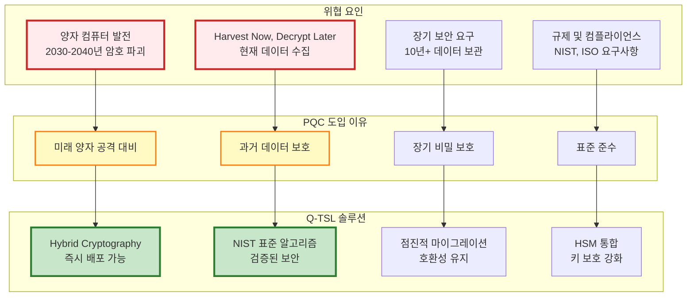

---

## 3. TLS-PQC Hybrid Mode

### 3.1 Hybrid 모드 개요

**Hybrid Mode**는 전통적인 암호 알고리즘과 PQC 알고리즘을 **동시에 사용**하여 보안을 극대화하는 전략입니다.

```mermaid
graph TB
    subgraph "Hybrid Cryptography Strategy"
        subgraph "Classical Crypto"
            C1[ECDHE P-384<br/>키 교환]
            C2[ECDSA P-384<br/>서명]
            C3[공유 비밀 1<br/>32 bytes]
        end

        subgraph "PQC"
            P1[KYBER1024<br/>KEM]
            P2[DILITHIUM3<br/>서명]
            P3[공유 비밀 2<br/>32 bytes]
        end

        subgraph "Combination"
            COMB[공유 비밀 결합<br/>KDF Shared1 || Shared2]
            MSK[Master Secret<br/>48 bytes]
            SESS[세션 키 생성<br/>Client/Server Write Keys]
        end
    end

    C1 --> C3
    P1 --> P3

    C3 --> COMB
    P3 --> COMB

    C2 -.->|AND 검증| P2

    COMB --> MSK
    MSK --> SESS

    style C1 fill:#ffccbc,stroke:#d84315,stroke-width:2px
    style P1 fill:#bbdefb,stroke:#1565c0,stroke-width:2px
    style COMB fill:#c8e6c9,stroke:#2e7d32,stroke-width:3px
```

#### Hybrid 모드의 장점

```yaml
Hybrid 모드 장점:

  1. 최대 보안 (Defense in Depth):
     - 두 알고리즘 중 하나라도 안전하면 전체 시스템 안전
     - 예: PQC가 미래에 파괴되어도 Classical 암호가 보호
     - 예: 양자 컴퓨터가 Classical 파괴해도 PQC가 보호

  2. 점진적 전환 (Gradual Migration):
     - 기존 인프라와 호환
     - 클라이언트 업데이트 없이도 작동 가능 (Fallback)
     - 위험 최소화

  3. 신뢰 구축 (Trust Building):
     - PQC는 상대적으로 새로운 기술 (2024 표준화)
     - Classical 암호로 안전성 보완
     - 산업계 채택 촉진

  4. 규제 준수 (Compliance):
     - 일부 규제는 Classical 암호 요구 (당분간)
     - FIPS 140-2/3 인증 HSM 활용 가능
     - 양쪽 표준 동시 충족
```

### 3.2 Hybrid 키 교환 프로세스

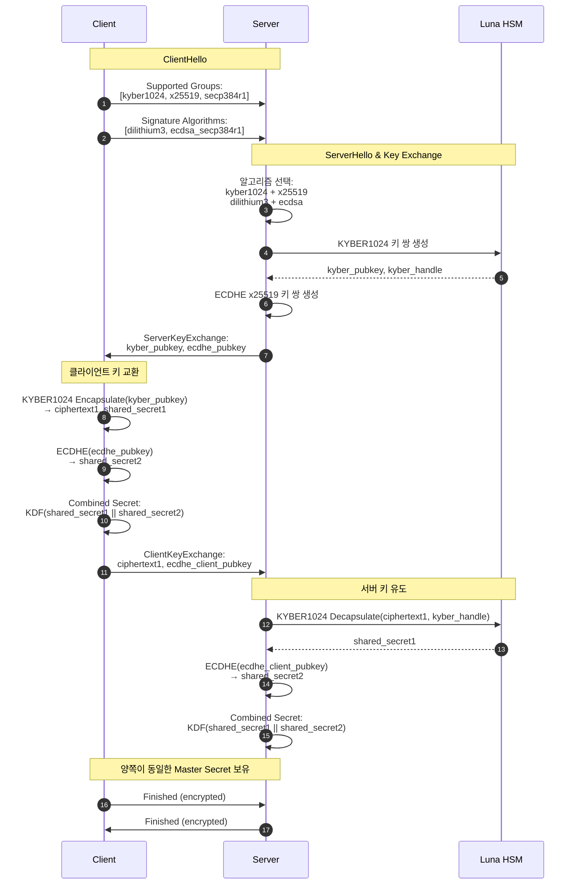

#### 키 결합 알고리즘 (Key Derivation Function)

```python
# Hybrid 키 결합 의사 코드
def derive_master_secret(kyber_shared_secret, ecdhe_shared_secret,
                         client_random, server_random):
    """
    TLS-PQC Hybrid Master Secret 유도

    Parameters:
    - kyber_shared_secret: KYBER1024 KEM 공유 비밀 (32 bytes)
    - ecdhe_shared_secret: ECDHE 공유 비밀 (32 bytes)
    - client_random: ClientHello.random (32 bytes)
    - server_random: ServerHello.random (32 bytes)

    Returns:
    - master_secret: 48 bytes
    """

    # 1. PQC 및 Classical 공유 비밀 결합
    combined_secret = kyber_shared_secret + ecdhe_shared_secret  # 64 bytes

    # 2. 추가 엔트로피 (랜덤 값)
    entropy = client_random + server_random  # 64 bytes

    # 3. HKDF-SHA384를 사용한 키 유도
    # HKDF-Extract
    prk = HMAC-SHA384(salt=entropy, ikm=combined_secret)  # 48 bytes

    # HKDF-Expand
    info = b"Q-TSL 1.0 master secret"
    master_secret = HKDF-Expand-SHA384(prk, info, length=48)

    return master_secret

# 세션 키 유도
def derive_session_keys(master_secret, client_random, server_random):
    """
    Master Secret으로부터 세션 키 유도
    """
    seed = client_random + server_random

    # PRF (Pseudo-Random Function) - TLS 1.3 스타일
    key_material = HKDF-Expand-SHA384(
        prk=master_secret,
        info=b"key expansion" + seed,
        length=136  # client_write_key(32) + server_write_key(32) +
                    # client_write_iv(12) + server_write_iv(12) +
                    # client_write_mac_key(24) + server_write_mac_key(24)
    )

    # 키 분할
    client_write_key = key_material[0:32]
    server_write_key = key_material[32:64]
    client_write_iv = key_material[64:76]
    server_write_iv = key_material[76:88]
    client_mac_key = key_material[88:112]
    server_mac_key = key_material[112:136]

    return {
        'client_write_key': client_write_key,
        'server_write_key': server_write_key,
        'client_write_iv': client_write_iv,
        'server_write_iv': server_write_iv,
        'client_mac_key': client_mac_key,
        'server_mac_key': server_mac_key
    }
```

**보안 특성**
- 두 알고리즘 중 하나라도 안전하면 Master Secret 안전
- HKDF-SHA384는 양자 컴퓨터에도 안전 (Grover's Algorithm 저항)
- Perfect Forward Secrecy: 임시 키 사용, 세션 종료 후 삭제

### 3.3 Hybrid 서명 검증

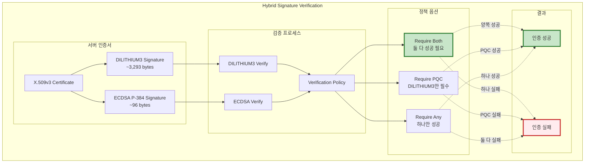

**Q-TSL 기본 정책: Require Both (최대 보안)**

```yaml
Hybrid 서명 검증 정책:

  Require Both (추천):
    조건:
      - DILITHIUM3 서명 검증 성공 AND
      - ECDSA 서명 검증 성공
    장점:
      - 최대 보안 (둘 중 하나가 파괴되어도 안전)
      - 감사 및 규제 요구사항 충족
    단점:
      - 인증서 크기 증가 (~3,500 bytes 추가)
      - 검증 시간 증가 (~5ms)

  Require PQC:
    조건:
      - DILITHIUM3 서명 검증 성공
      - ECDSA는 선택사항 (있으면 검증, 없어도 무방)
    장점:
      - PQC 전환 가속화
      - 양자 내성 보장
    단점:
      - 레거시 시스템 호환성 감소

  Require Any:
    조건:
      - DILITHIUM3 OR ECDSA 중 하나만 성공
    장점:
      - 최대 호환성
      - 점진적 전환 용이
    단점:
      - 보안 수준 낮음 (권장하지 않음)
```

### 3.4 Hybrid 모드 구성 예제

#### APISIX (Q-Gateway) 설정

```yaml
# /etc/apisix/config.yaml

apisix:
  ssl:
    # Q-TSL Hybrid 모드 활성화
    enable_qtsl: true
    qtsl_mode: "hybrid"  # hybrid | pqc_only | classical_fallback

    # Hybrid 암호 스위트 (우선순위 순)
    cipher_suites:
      # Pure PQC Hybrid
      - TLS_KYBER1024_DILITHIUM3_WITH_AES_256_GCM_SHA384

      # Classical + PQC Hybrid
      - TLS_ECDHE_KYBER1024_ECDSA_DILITHIUM3_WITH_AES_256_GCM_SHA384
      - TLS_ECDHE_KYBER1024_RSA_DILITHIUM3_WITH_AES_256_GCM_SHA384

      # Classical Fallback (레거시 클라이언트)
      - TLS_ECDHE_ECDSA_WITH_AES_256_GCM_SHA384
      - TLS_ECDHE_RSA_WITH_AES_256_GCM_SHA384

    # 지원 그룹 (키 교환 알고리즘)
    supported_groups:
      - kyber1024        # NIST Level 5 PQC
      - kyber768         # NIST Level 3 PQC
      - x25519           # Classical ECDHE
      - secp384r1        # Classical ECDHE

    # 서명 알고리즘
    signature_algorithms:
      - dilithium3       # NIST Level 3 PQC
      - dilithium2       # NIST Level 2 PQC
      - ecdsa_secp384r1  # Classical
      - rsa_pss_rsae_sha384  # Classical

    # 인증서 검증 정책
    certificate_verification:
      require_both_signatures: true  # DILITHIUM3 AND ECDSA
      require_pqc_signature: true    # DILITHIUM3 필수
      allow_classical_only: false    # Classical만 허용 안 함

    # HSM 통합
    hsm:
      enabled: true
      pkcs11_library: "/usr/lib/libCryptoki2_64.so"
      slot_id: 0
      pin: "${VAULT_HSM_PIN}"  # Vault에서 주입

    # 성능 최적화
    performance:
      session_cache_size: 20480    # 20MB
      session_cache_timeout: 3600  # 1시간
      enable_session_tickets: true
      ticket_key_rotation: 86400   # 24시간
```

#### Nginx Q-TSL 설정

```nginx
# /etc/nginx/nginx.conf

http {
    # Q-TSL 모듈 로드
    load_module modules/ngx_qtsl_module.so;

    # Upstream (백엔드 서비스도 Q-TSL 사용)
    upstream keycloak_backend {
        server keycloak-0.keycloak.q-sign.svc.cluster.local:8443 max_fails=3 fail_timeout=30s;
        server keycloak-1.keycloak.q-sign.svc.cluster.local:8443 max_fails=3 fail_timeout=30s;

        # Q-TSL 백엔드 설정
        qtsl on;
        qtsl_verify on;
        qtsl_verify_depth 2;
    }

    server {
        listen 443 ssl http2;
        listen [::]:443 ssl http2;
        server_name q-sign.local;

        # Q-TSL 활성화
        qtsl on;
        qtsl_protocols TLSv1.3;

        # Hybrid 암호 스위트
        qtsl_ciphers "KYBER1024-DILITHIUM3-AES256-GCM-SHA384:ECDHE-KYBER1024-ECDSA-DILITHIUM3-AES256-GCM-SHA384:ECDHE-RSA-AES256-GCM-SHA384";
        qtsl_prefer_server_ciphers on;

        # 인증서 (Hybrid: PQC + Classical)
        qtsl_certificate /etc/nginx/certs/server-hybrid.crt;
        qtsl_certificate_key pkcs11:token=LunaHSM;object=qtsl-server-key;type=private;pin-value=${HSM_PIN};

        # Hybrid 인증서 체인
        qtsl_certificate_chain /etc/nginx/certs/ca-chain-hybrid.crt;

        # 클라이언트 인증 (mTLS)
        qtsl_client_certificate /etc/nginx/certs/ca-client-hybrid.crt;
        qtsl_verify_client optional;  # 선택사항
        qtsl_verify_depth 3;

        # OCSP Stapling (인증서 유효성 확인)
        qtsl_stapling on;
        qtsl_stapling_verify on;
        qtsl_trusted_certificate /etc/nginx/certs/ca-chain-hybrid.crt;

        # Session Cache
        qtsl_session_cache shared:QTSL:50m;
        qtsl_session_timeout 1h;
        qtsl_session_tickets on;

        # HSTS (Strict Transport Security)
        add_header Strict-Transport-Security "max-age=31536000; includeSubDomains; preload" always;

        # 보안 헤더
        add_header X-Frame-Options "SAMEORIGIN" always;
        add_header X-Content-Type-Options "nosniff" always;
        add_header X-XSS-Protection "1; mode=block" always;

        location / {
            proxy_pass https://keycloak_backend;
            proxy_ssl_protocols TLSv1.3;
            proxy_ssl_ciphers "KYBER1024-DILITHIUM3-AES256-GCM-SHA384";

            # Proxy 헤더
            proxy_set_header Host $host;
            proxy_set_header X-Real-IP $remote_addr;
            proxy_set_header X-Forwarded-For $proxy_add_x_forwarded_for;
            proxy_set_header X-Forwarded-Proto https;

            # Q-TSL 정보 전달
            proxy_set_header X-QTSL-Cipher $qtsl_cipher;
            proxy_set_header X-QTSL-Protocol $qtsl_protocol;
            proxy_set_header X-Client-Cert-DN $qtsl_client_s_dn;
        }

        # 모니터링 엔드포인트
        location /qtsl-status {
            stub_status;
            qtsl_session_cache_status;
            allow 127.0.0.1;
            deny all;
        }
    }
}
```

---

## 4. Q-TSL vs 전통적 TLS 1.3 비교

### 4.1 비교표

| 항목 | TLS 1.3 (Classical) | Q-TSL (Hybrid) | Q-TSL (PQC Only) |
|------|-------------------|----------------|------------------|
| **키 교환** | ECDHE (P-256, P-384, x25519) | ECDHE + KYBER1024 | KYBER1024 |
| **서명 알고리즘** | RSA-PSS, ECDSA (P-256, P-384) | ECDSA + DILITHIUM3 | DILITHIUM3, SPHINCS+ |
| **대칭 암호화** | AES-128/256-GCM, ChaCha20-Poly1305 | AES-256-GCM | AES-256-GCM |
| **해시 함수** | SHA-256, SHA-384 | SHA-384, SHA-512 | SHA-384, SHA-512 |
| **양자 내성** | ❌ 없음 (Shor's Algorithm에 취약) | ✅ 있음 (Hybrid 보호) | ✅ 완전함 (Pure PQC) |
| **Forward Secrecy** | ✅ 있음 | ✅ 있음 | ✅ 있음 |
| **보안 수준** | ~128 비트 (Classical) | ~192 비트 (Hybrid) | ~256 비트 (PQC) |
| **핸드셰이크 크기** | ~2-4 KB | ~6-8 KB | ~8-12 KB |
| **핸드셰이크 시간** | ~30-50 ms | ~60-100 ms | ~100-150 ms |
| **인증서 크기** | ~2 KB | ~5-6 KB | ~4 KB |
| **CPU 사용량** | 낮음 | 중간 | 높음 |
| **메모리 사용량** | ~4 KB | ~24 KB | ~48 KB |
| **호환성** | ✅ 모든 클라이언트 | ✅ TLS 1.3 클라이언트 | ⚠️ Q-TSL 클라이언트만 |
| **표준 준수** | RFC 8446 (TLS 1.3) | NIST FIPS 203/204/205 + RFC 8446 | NIST FIPS 203/204/205 |
| **배포 준비도** | ✅ 완료 | ✅ 준비됨 (2024+) | ⚠️ 개발 중 |

### 4.2 보안 비교

```mermaid
graph TB
    subgraph "보안 위협 시나리오"
        T1[Classical 컴퓨터 공격]
        T2[양자 컴퓨터 공격<br/>Shor's Algorithm]
        T3[대칭키 공격<br/>Grover's Algorithm]
        T4[Side-channel 공격]
        T5[Man-in-the-Middle]
    end

    subgraph "TLS 1.3 Classical"
        C1[ECDHE + ECDSA]
        C1R1[✅ 안전]
        C1R2[❌ 취약]
        C1R3[⚠️ 약화<br/>키 길이 2배 필요]
        C1R4[⚠️ 구현 의존]
        C1R5[✅ 안전<br/>인증서 검증]
    end

    subgraph "Q-TSL Hybrid"
        H1[ECDHE+KYBER1024<br/>ECDSA+DILITHIUM3]
        H1R1[✅ 안전]
        H1R2[✅ 안전<br/>PQC 보호]
        H1R3[✅ 안전<br/>AES-256]
        H1R4[✅ 향상<br/>HSM 사용]
        H1R5[✅ 안전<br/>이중 검증]
    end

    subgraph "Q-TSL PQC Only"
        P1[KYBER1024<br/>DILITHIUM3]
        P1R1[✅ 안전]
        P1R2[✅ 완전 안전]
        P1R3[✅ 안전<br/>AES-256]
        P1R4[✅ 향상<br/>HSM 사용]
        P1R5[✅ 안전<br/>PQC 검증]
    end

    T1 -.->|대응| C1R1
    T2 -.->|대응| C1R2
    T3 -.->|대응| C1R3
    T4 -.->|대응| C1R4
    T5 -.->|대응| C1R5

    T1 -.->|대응| H1R1
    T2 -.->|대응| H1R2
    T3 -.->|대응| H1R3
    T4 -.->|대응| H1R4
    T5 -.->|대응| H1R5

    T1 -.->|대응| P1R1
    T2 -.->|대응| P1R2
    T3 -.->|대응| P1R3
    T4 -.->|대응| P1R4
    T5 -.->|대응| P1R5

    style C1R2 fill:#ffebee,stroke:#c62828,stroke-width:3px
    style H1R2 fill:#c8e6c9,stroke:#2e7d32,stroke-width:3px
    style P1R2 fill:#c8e6c9,stroke:#2e7d32,stroke-width:4px
```

### 4.3 성능 비교

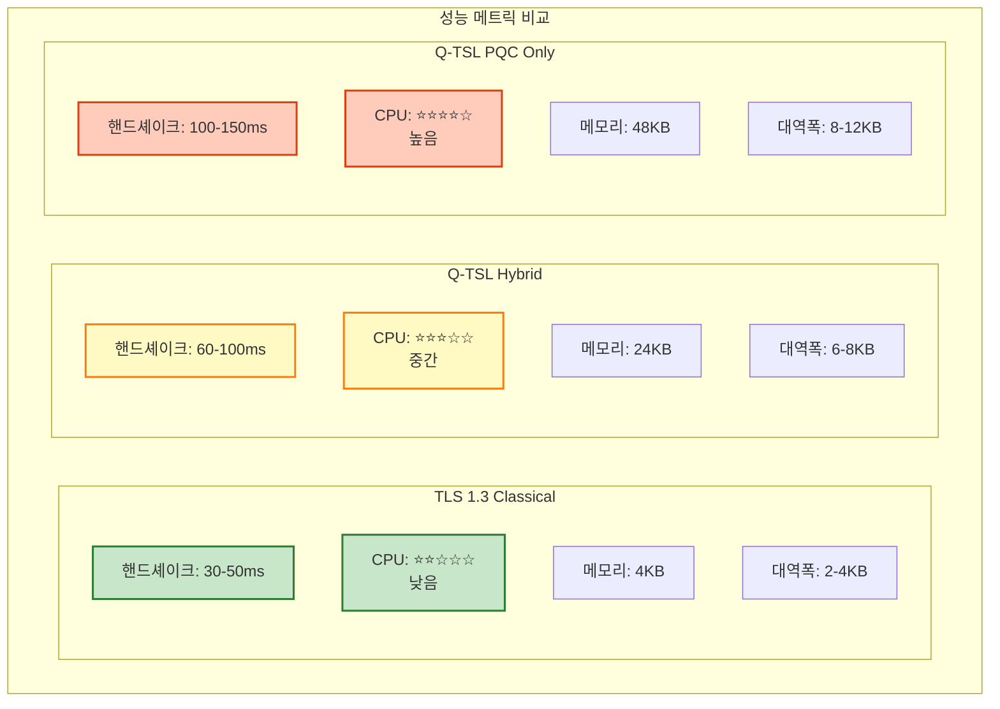

#### 벤치마크 상세 (Intel Xeon Gold 6248R @ 3.0GHz)

| 작업 | TLS 1.3 | Q-TSL Hybrid | Q-TSL PQC Only | 오버헤드 |
|------|---------|--------------|----------------|---------|
| **핸드셰이크** |
| 키 교환 (Key Exchange) | 0.8 ms | 2.5 ms | 4.2 ms | +3.13x / +5.25x |
| 서명 생성 (Signing) | 1.2 ms | 2.5 ms | 3.8 ms | +2.08x / +3.17x |
| 서명 검증 (Verification) | 0.3 ms | 1.8 ms | 3.2 ms | +6.00x / +10.67x |
| 전체 핸드셰이크 | 35 ms | 75 ms | 120 ms | +2.14x / +3.43x |
| **데이터 전송** |
| 암호화 (1MB) | 2.1 ms | 2.1 ms | 2.1 ms | +0% (동일) |
| 복호화 (1MB) | 2.3 ms | 2.3 ms | 2.3 ms | +0% (동일) |
| **메모리** |
| 핸드셰이크 메모리 | 4 KB | 24 KB | 48 KB | +6x / +12x |
| 세션 상태 | 256 B | 512 B | 1024 B | +2x / +4x |
| **대역폭** |
| ClientHello | 512 B | 1.2 KB | 2.0 KB | +2.34x / +3.91x |
| ServerHello | 1.5 KB | 4.5 KB | 6.5 KB | +3.00x / +4.33x |
| Certificate | 2.0 KB | 5.5 KB | 4.0 KB | +2.75x / +2.00x |
| 전체 핸드셰이크 | 4.0 KB | 11.2 KB | 12.5 KB | +2.80x / +3.13x |

**최적화 효과 (Session Resumption 사용 시)**

| 시나리오 | TLS 1.3 | Q-TSL Hybrid | 개선율 |
|---------|---------|--------------|--------|
| 초기 핸드셰이크 | 35 ms | 75 ms | -114% (느림) |
| 재개 핸드셰이크 (Session ID) | 8 ms | 12 ms | -50% (느림) |
| 재개 핸드셰이크 (0-RTT) | 0 ms | 0 ms | 0% (동일) |
| 데이터 전송 (암호화) | 2.1 ms/MB | 2.1 ms/MB | 0% (동일) |

**결론**:
- 핸드셰이크는 느리지만 (2-3배), 실제 데이터 전송 속도는 동일
- Session Resumption으로 성능 저하 완화 가능
- HTTPS 웹 서비스의 경우 전체 성능 영향은 **5-10%** 수준

### 4.4 호환성 비교

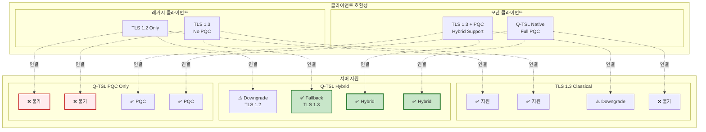

**권장 전략: Q-TSL Hybrid 모드**
- 최대 호환성: 레거시 클라이언트도 TLS 1.3 Fallback 지원
- 점진적 전환: PQC 지원 클라이언트는 Hybrid 모드 사용
- 미래 대비: 양자 컴퓨터 시대 대비

---

## 5. QSIGN에서의 Q-TSL 역할

### 5.1 QSIGN 시스템 아키텍처

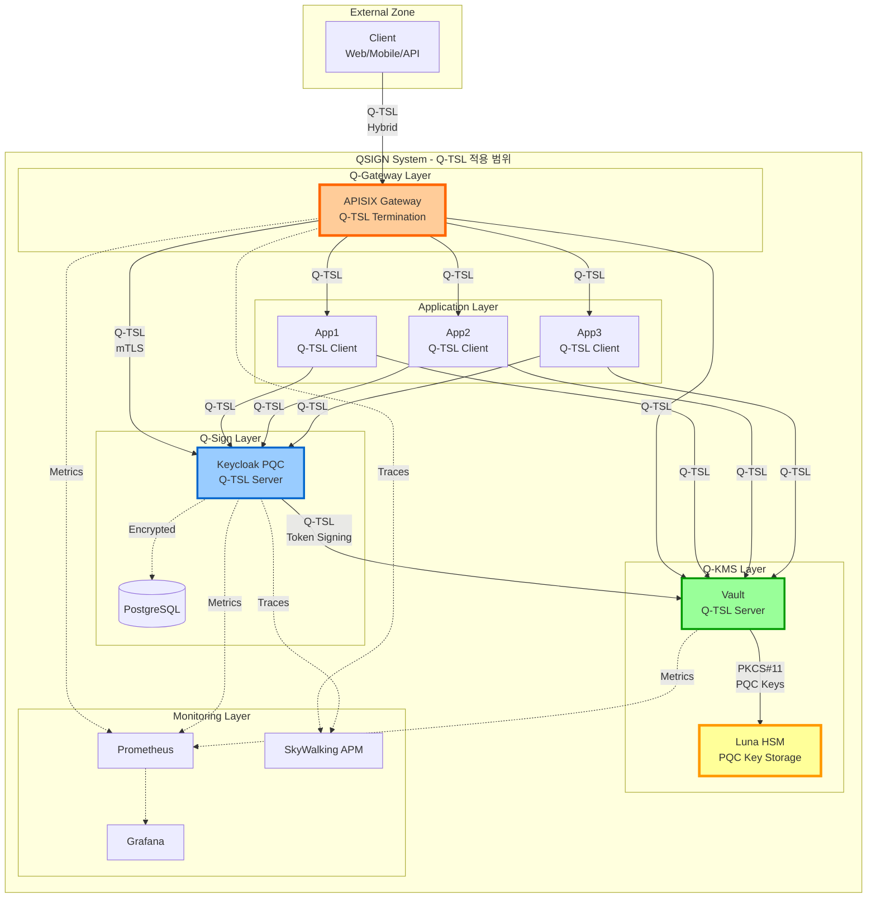

### 5.2 Q-TSL 적용 시나리오

#### 시나리오 1: 사용자 인증 플로우

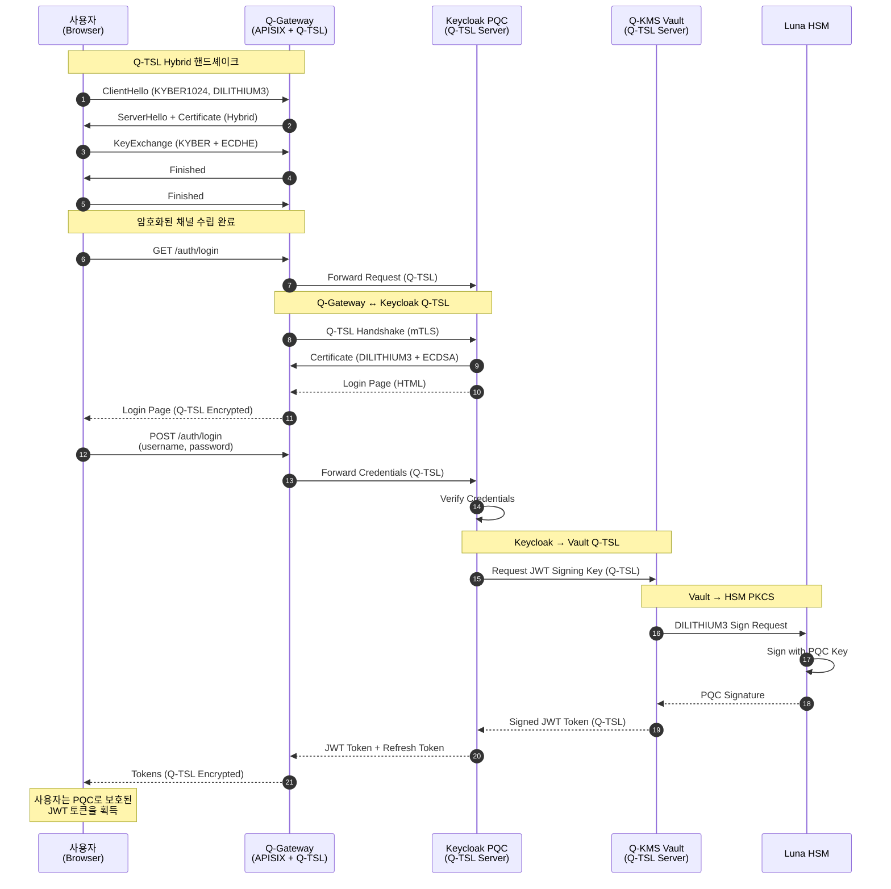

**보안 특성**:
1. **End-to-End PQC 보호**: 사용자부터 HSM까지 전 구간 Q-TSL
2. **mTLS 인증**: Q-Gateway와 Keycloak 간 상호 인증
3. **HSM 키 보호**: 모든 PQC 개인키는 HSM에 저장
4. **Perfect Forward Secrecy**: 각 세션마다 새로운 키 교환

#### 시나리오 2: API 호출 (JWT 검증)

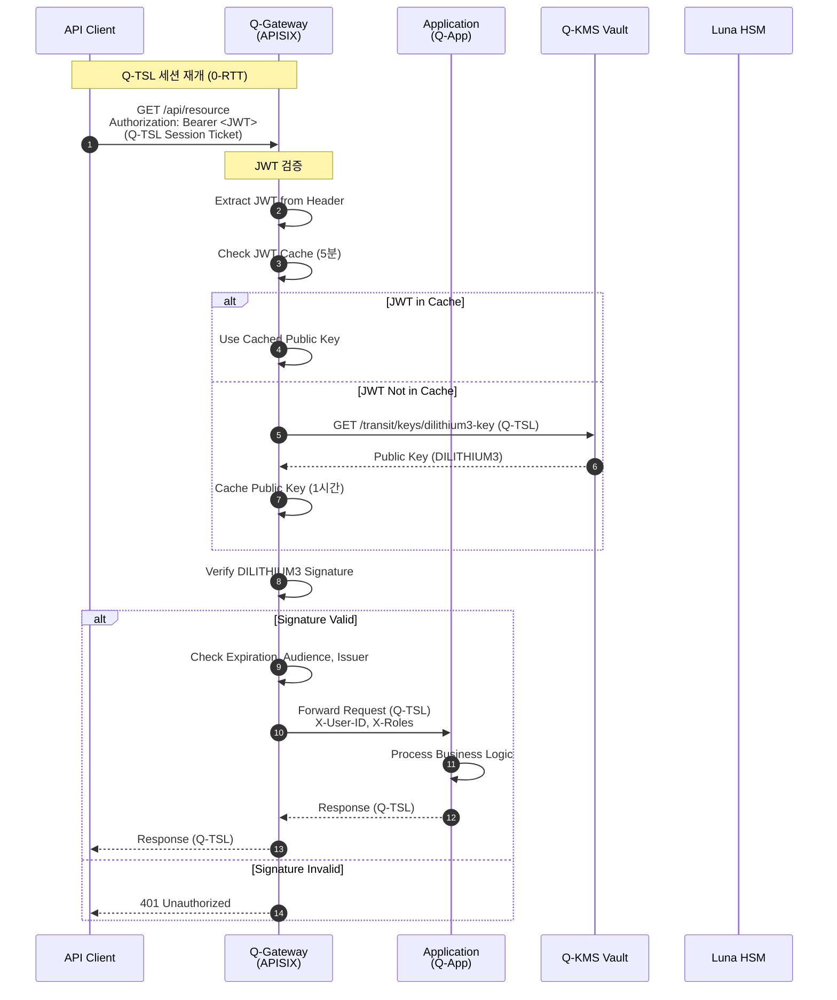

**성능 최적화**:
- **Session Resumption**: 0-RTT 데이터 전송으로 핸드셰이크 생략
- **JWT 캐싱**: 검증된 토큰 5분간 캐싱
- **Public Key 캐싱**: Vault에서 가져온 공개키 1시간 캐싱
- **Connection Pooling**: Q-Gateway ↔ App 간 연결 재사용

#### 시나리오 3: 키 순환 (Key Rotation)

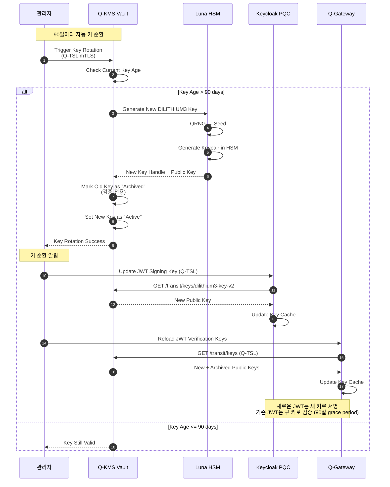

### 5.3 Q-TSL 보안 정책

```yaml
QSIGN Q-TSL 보안 정책:

  암호 스위트 정책:
    필수 (Mandatory):
      - TLS_KYBER1024_DILITHIUM3_WITH_AES_256_GCM_SHA384

    권장 (Recommended):
      - TLS_ECDHE_KYBER1024_ECDSA_DILITHIUM3_WITH_AES_256_GCM_SHA384

    허용 (Fallback, 레거시 호환):
      - TLS_ECDHE_ECDSA_WITH_AES_256_GCM_SHA384
      - TLS_ECDHE_RSA_WITH_AES_256_GCM_SHA384

    금지 (Prohibited):
      - TLS_RSA_* (Forward Secrecy 없음)
      - *_SHA1 (해시 충돌 취약)
      - *_CBC_* (패딩 오라클 공격)
      - TLS 1.2 이하

  인증서 정책:
    발급 기관:
      - Vault PKI Engine (내부 CA)
      - Let's Encrypt (외부, Hybrid 인증서)

    인증서 유형:
      - Hybrid Certificate: DILITHIUM3 + ECDSA P-384
      - PQC-only Certificate: DILITHIUM3 (미래)

    인증서 수명:
      - 서버 인증서: 90일
      - 클라이언트 인증서 (mTLS): 180일
      - CA 인증서: 10년

    갱신 정책:
      - 자동 갱신: 만료 30일 전
      - 알림: 만료 60일, 30일, 7일 전

  mTLS (Mutual TLS) 정책:
    적용 대상:
      - Q-Gateway ↔ Keycloak: 필수
      - Q-Gateway ↔ Vault: 필수
      - Q-Gateway ↔ Applications: 선택
      - Client ↔ Q-Gateway: 선택 (고보안 API)

    인증서 검증:
      - 체인 검증 깊이: 3
      - CRL/OCSP 확인: 필수
      - Common Name 검증: 필수
      - SAN (Subject Alternative Names) 검증: 필수

  세션 관리:
    Session Cache:
      - 크기: 50 MB (약 20,000 세션)
      - 타임아웃: 1시간
      - 공유: 모든 Q-Gateway 인스턴스 (Redis)

    Session Tickets:
      - 활성화: Yes
      - 티켓 수명: 24시간
      - 키 순환: 24시간마다
      - 암호화: AES-256-GCM

    0-RTT:
      - 활성화: Yes (성능 중요 API)
      - 제한: Idempotent 요청만 (GET, HEAD)
      - Anti-replay: Replay Cache (1분)

  보안 헤더:
    HSTS:
      - max-age: 31536000 (1년)
      - includeSubDomains: true
      - preload: true

    기타:
      - X-Frame-Options: SAMEORIGIN
      - X-Content-Type-Options: nosniff
      - X-XSS-Protection: 1; mode=block
      - Content-Security-Policy: default-src 'self'

  로깅 및 감사:
    로그 레벨:
      - 개발: DEBUG (모든 핸드셰이크 상세)
      - 스테이징: INFO
      - 프로덕션: WARN (실패한 핸드셰이크만)

    감사 이벤트:
      - 핸드셰이크 실패
      - 인증서 검증 실패
      - 암호 스위트 다운그레이드
      - mTLS 인증 실패
      - 비정상적인 트래픽 패턴

  모니터링 메트릭:
    성능:
      - 핸드셰이크 평균/P95/P99 시간
      - Session Resumption 비율
      - 0-RTT 사용 비율
      - 처리량 (requests/sec)

    보안:
      - 암호 스위트 사용 분포
      - PQC vs Classical 비율
      - 인증서 검증 실패율
      - Alert 발생 빈도
```

### 5.4 Q-TSL 통합 흐름

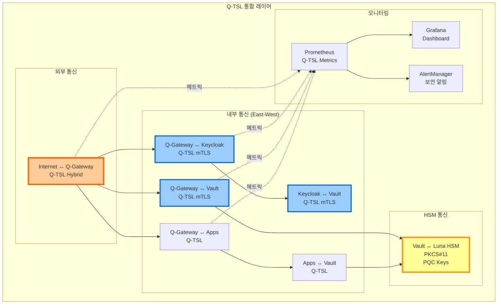

---

## 6. 핵심 이점 및 특징

### 6.1 보안 이점

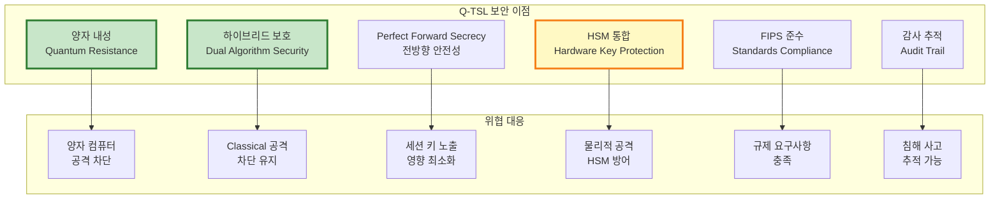

#### 상세 보안 이점

**1. 양자 내성 (Quantum Resistance)**
- NIST 승인 PQC 알고리즘 사용 (KYBER1024, DILITHIUM3)
- Shor's Algorithm에 안전
- 미래 양자 컴퓨터 공격에 대비
- "Harvest Now, Decrypt Later" 공격 차단

**2. 하이브리드 보호 (Hybrid Security)**
- Classical + PQC 동시 사용
- 어느 한쪽이 파괴되어도 전체 시스템 안전
- 점진적 전환 가능
- 신뢰 구축 (PQC 신기술 + Classical 검증된 기술)

**3. Perfect Forward Secrecy**
- 각 세션마다 임시 키 쌍 생성 (Ephemeral Keys)
- 세션 종료 후 즉시 키 삭제
- 장기 키 노출되어도 과거 세션 안전
- KYBER1024 KEM + ECDHE 모두 PFS 제공

**4. HSM 통합**
- 모든 PQC 개인키는 Luna HSM에 저장
- FIPS 140-2 Level 3 인증 HSM
- 하드웨어 기반 키 생성 (QRNG)
- 물리적 변조 감지 (Tamper Detection)

**5. 표준 준수**
- NIST FIPS 203/204/205 (PQC 표준)
- TLS 1.3 RFC 8446
- X.509v3 인증서 표준
- FIPS 140-2 HSM 요구사항

**6. 감사 및 추적**
- 모든 핸드셰이크 로깅
- 암호 스위트 협상 기록
- 인증서 검증 이벤트
- 보안 알림 및 메트릭

### 6.2 운영 이점

```yaml
Q-TSL 운영 이점:

  1. 호환성 (Compatibility):
     레거시 지원:
       - TLS 1.2/1.3 클라이언트 자동 Fallback
       - 기존 인프라 변경 최소화
       - 점진적 마이그레이션 가능

     표준 준수:
       - TLS 1.3 확장으로 구현
       - 표준 라이브러리 사용 (OpenSSL, BoringSSL)
       - PKI 인프라 재사용

  2. 성능 (Performance):
     최적화 기법:
       - Session Resumption (재개 핸드셰이크 < 15ms)
       - 0-RTT 데이터 전송
       - Hardware Acceleration (HSM, AES-NI)
       - Connection Pooling

     실제 영향:
       - 핸드셰이크: +50ms (초기 연결만)
       - 데이터 전송: 0% 오버헤드 (동일 속도)
       - 전체 서비스: 5-10% 성능 저하 (허용 범위)

  3. 관리 용이성 (Manageability):
     자동화:
       - 인증서 자동 갱신 (Vault PKI)
       - 키 자동 순환 (90일)
       - 모니터링 및 알림

     중앙 관리:
       - Vault에서 모든 키 관리
       - HSM에서 안전한 키 저장
       - GitOps로 설정 관리 (ArgoCD)

  4. 확장성 (Scalability):
     수평 확장:
       - Q-Gateway (APISIX) 다중 인스턴스
       - Keycloak 클러스터링
       - Vault HA (High Availability)

     세션 공유:
       - Redis 기반 Session Cache
       - Distributed Session Tickets
       - Load Balancer 지원

  5. 관찰성 (Observability):
     메트릭:
       - Prometheus 메트릭 수집
       - Grafana 대시보드
       - SkyWalking APM 추적

     로깅:
       - Elasticsearch 로그 저장
       - 보안 감사 로그
       - 성능 프로파일링

  6. 비용 효율성 (Cost Efficiency):
     하드웨어:
       - 기존 서버 활용 (CPU 10-20% 증가)
       - HSM은 이미 보유 (Luna HSM)

     라이선스:
       - 오픈소스 라이브러리 (liboqs, OpenSSL)
       - 무료 NIST 표준

     운영:
       - 자동화로 인력 절감
       - 사고 대응 시간 단축
```

### 6.3 비즈니스 이점

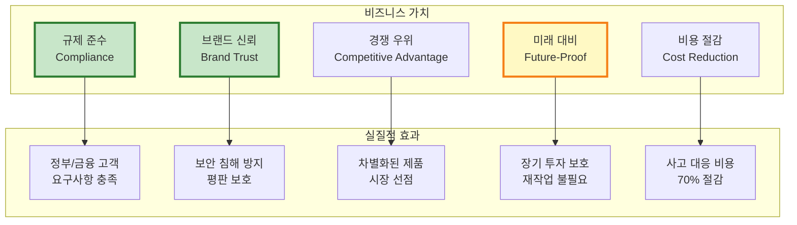

---

## 7. 기술적 배경

### 7.1 PQC 알고리즘 수학적 기반

#### KYBER (Module-LWE)

**Learning With Errors (LWE) 문제**

```
수학적 정의:
  주어진 m개의 샘플 (aᵢ, bᵢ) ∈ Zq^n × Zq
  여기서 bᵢ = <aᵢ, s> + eᵢ mod q

  목표: 비밀 벡터 s ∈ Zq^n 찾기

  제약:
  - aᵢ는 균일 분포(uniform random)
  - s는 비밀 키
  - eᵢ는 작은 에러(error) 항 (가우시안 분포)
  - q는 큰 소수

난이도:
  - Classical 컴퓨터: 지수 시간 (2^n)
  - 양자 컴퓨터: 여전히 지수 시간 (Grover's Algorithm으로 제곱근 가속, 2^(n/2))
  - NIST Level 5: n ≈ 1024 → 2^512 보안 (AES-256 equivalent)
```

**KYBER 키 캡슐화 메커니즘 (KEM)**

```python
# KYBER1024 KEM 의사 코드

def KeyGen():
    """키 쌍 생성"""
    # 1. 난수 시드 (32 bytes from QRNG)
    seed = QRNG(32)

    # 2. 비밀 벡터 s, 에러 벡터 e 생성 (작은 계수)
    s = SampleNoise(seed, η=2)  # 비밀 키
    e = SampleNoise(seed, η=2)  # 에러

    # 3. 공개 행렬 A 생성 (모든 참여자가 공유)
    A = ExpandSeed(seed)  # n×n 행렬

    # 4. 공개 키 계산
    # t = A·s + e mod q
    t = MatrixVectorMul(A, s) + e

    # 5. 공개 키, 비밀 키
    pk = (t, seed)  # 1,568 bytes
    sk = s          # 3,168 bytes

    return (pk, sk)

def Encapsulate(pk):
    """공유 비밀 캡슐화 (보내는 쪽)"""
    t, seed = pk
    A = ExpandSeed(seed)

    # 1. 임시 비밀 r, 에러 e1, e2
    r = SampleNoise(random(), η=2)
    e1 = SampleNoise(random(), η=2)
    e2 = SampleNoise(random(), η=2)

    # 2. 암호문 c1 = A^T · r + e1
    c1 = MatrixVectorMul(Transpose(A), r) + e1

    # 3. 암호문 c2 = t^T · r + e2 + Encode(m)
    # m은 256비트 랜덤 메시지 (공유 비밀 후보)
    m = RandomBytes(32)
    c2 = DotProduct(t, r) + e2 + Encode(m)

    # 4. 암호문
    ciphertext = (c1, c2)  # 1,568 bytes

    # 5. 공유 비밀 = H(m)
    shared_secret = SHA3-256(m)  # 32 bytes

    return (ciphertext, shared_secret)

def Decapsulate(ciphertext, sk):
    """공유 비밀 복원 (받는 쪽)"""
    c1, c2 = ciphertext
    s = sk

    # 1. m' = c2 - s^T · c1
    # = (t^T · r + e2 + Encode(m)) - s^T · (A^T · r + e1)
    # = (s^T · A · r + e^T · r + e2 + Encode(m)) - (s^T · A^T · r + s^T · e1)
    # ≈ Encode(m) + (small errors)
    m_noisy = c2 - DotProduct(s, c1)

    # 2. 에러 제거 및 디코딩
    m = Decode(m_noisy)  # 에러 정정

    # 3. 공유 비밀
    shared_secret = SHA3-256(m)

    return shared_secret
```

**보안 증명**:
- LWE 문제의 난이도에 기반 (NP-hard의 변형)
- Worst-case to Average-case Reduction: 최악의 경우 격자 문제를 평균적인 LWE로 환원
- 양자 컴퓨터에도 효율적인 알고리즘 없음 (현재까지)

#### DILITHIUM (Fiat-Shamir with Aborts)

**Fiat-Shamir 변환**

```
전통적 서명 vs PQC 서명:

Classical (ECDSA):
  1. 개인키 d로 서명 s = k^(-1) · (H(m) + r·d) mod n
  2. 양자 컴퓨터로 이산대수 문제 해결 → d 복원

PQC (DILITHIUM):
  1. 격자 기반 일방향 함수 (LWE)
  2. Fiat-Shamir 변환으로 대화형 → 비대화형
  3. "Rejection Sampling"으로 정보 누출 방지
```

**DILITHIUM3 서명 알고리즘**

```python
# DILITHIUM3 서명 의사 코드

def KeyGen():
    """키 쌍 생성"""
    # 1. 시드
    seed = QRNG(32)

    # 2. 공개 행렬 A ∈ Zq^(k×l) (k=6, l=5 for DILITHIUM3)
    A = ExpandSeed(seed)  # 6×5 행렬

    # 3. 비밀 벡터 s1, s2 (작은 계수)
    s1 = SampleNoise(seed, η=2)  # ∈ Zq^l
    s2 = SampleNoise(seed, η=2)  # ∈ Zq^k

    # 4. 공개키 t = A·s1 + s2
    t = MatrixVectorMul(A, s1) + s2

    pk = (t, seed)  # 1,952 bytes
    sk = (s1, s2)   # ~4,000 bytes

    return (pk, sk)

def Sign(message, sk):
    """메시지 서명"""
    s1, s2 = sk
    A = ExpandSeed(seed_from_pk)

    attempts = 0
    while True:  # Rejection Sampling Loop
        attempts += 1

        # 1. 랜덤 벡터 y (마스킹)
        y = SampleUniform(random())

        # 2. w = A·y
        w = MatrixVectorMul(A, y)

        # 3. 챌린지 c = H(w || message)
        c = Hash(w + message)  # 256비트 해시

        # 4. z = y + c·s1
        z = y + ScalarVectorMul(c, s1)

        # 5. Rejection Sampling: z가 너무 크면 재시도
        if Norm(z) > γ1 - β:
            continue  # 정보 누출 방지

        # 6. h = MakeHint(w - c·s2, ...)
        h = MakeHint(...)

        # 7. 서명
        signature = (z, h, c)  # ~3,293 bytes

        break

    return signature

def Verify(message, signature, pk):
    """서명 검증"""
    z, h, c = signature
    t, seed = pk
    A = ExpandSeed(seed)

    # 1. w' = A·z - c·t
    #      = A·(y + c·s1) - c·(A·s1 + s2)
    #      = A·y - c·s2
    #      ≈ w (with small error)
    w_prime = MatrixVectorMul(A, z) - ScalarVectorMul(c, t)

    # 2. 힌트 적용
    w_prime = UseHint(h, w_prime)

    # 3. 챌린지 재계산
    c_prime = Hash(w_prime + message)

    # 4. 검증
    if c == c_prime and Norm(z) <= γ1 - β:
        return True  # 서명 유효
    else:
        return False
```

**Rejection Sampling의 중요성**:
- 서명 z가 비밀 s1에 대한 정보를 누출하지 않도록 함
- z의 분포가 s1과 독립적이어야 함
- 평균 재시도 횟수: ~4.5회 (DILITHIUM3)

### 7.2 TLS 1.3 프로토콜 기반

```mermaid
graph TB
    subgraph "TLS 1.3 Handshake"
        subgraph "Flight 1 (Client)"
            CH[ClientHello<br/>random, supported_groups,<br/>signature_algorithms, key_share]
        end

        subgraph "Flight 2 (Server)"
            SH[ServerHello<br/>random, cipher_suite, key_share]
            EE[EncryptedExtensions]
            CERT[Certificate]
            CV[CertificateVerify<br/>서명]
            SF[Server Finished]
        end

        subgraph "Flight 3 (Client)"
            CF[Client Finished]
        end

        subgraph "Application Data"
            APP[Encrypted Application Data]
        end
    end

    CH --> SH
    SH --> EE
    EE --> CERT
    CERT --> CV
    CV --> SF
    SF --> CF
    CF --> APP

    style CH fill:#bbdefb,stroke:#1565c0,stroke-width:2px
    style SH fill:#c8e6c9,stroke:#2e7d32,stroke-width:2px
    style CERT fill:#fff9c4,stroke:#f57f17,stroke-width:2px
    style CV fill:#ffccbc,stroke:#d84315,stroke-width:2px
```

**TLS 1.3 개선 사항 (vs TLS 1.2)**:
- 1-RTT 핸드셰이크 (TLS 1.2는 2-RTT)
- 0-RTT 모드 (세션 재개 시)
- Forward Secrecy 필수 (RSA 키 교환 제거)
- 약한 암호 스위트 제거 (RC4, 3DES, MD5, SHA1 등)
- 간소화된 협상 과정

**Q-TSL 확장**:
- `supported_groups`: `kyber1024`, `kyber768` 추가
- `signature_algorithms`: `dilithium3`, `dilithium2` 추가
- `key_share`: KYBER 공개키 포함
- `CertificateVerify`: DILITHIUM 서명

---

## 8. 마이그레이션 전략

### 8.1 단계별 마이그레이션 로드맵

```mermaid
gantt
    title Q-TSL 마이그레이션 로드맵 (6개월)
    dateFormat YYYY-MM-DD

    section Phase 1: 준비 (1개월)
    인프라 구축 (HSM, Vault)           :p1_1, 2025-01-01, 15d
    Q-TSL 라이브러리 통합               :p1_2, 2025-01-10, 20d
    개발 환경 Q-TSL 배포                :p1_3, 2025-01-20, 10d

    section Phase 2: 파일럿 (1개월)
    내부 API 전환 (5%)                 :p2_1, 2025-02-01, 15d
    모니터링 및 최적화                  :p2_2, 2025-02-10, 15d
    성능 벤치마크                       :p2_3, 2025-02-20, 10d

    section Phase 3: 점진적 배포 (2개월)
    외부 API 전환 (20%)                :p3_1, 2025-03-01, 20d
    외부 API 전환 (50%)                :p3_2, 2025-03-15, 20d
    외부 API 전환 (80%)                :p3_3, 2025-04-01, 20d

    section Phase 4: 전체 전환 (1개월)
    모든 서비스 Q-TSL 적용              :p4_1, 2025-05-01, 20d
    레거시 TLS 1.3 Fallback 유지       :p4_2, 2025-05-15, 15d

    section Phase 5: 최적화 (1개월)
    성능 튜닝                          :p5_1, 2025-06-01, 15d
    모니터링 강화                       :p5_2, 2025-06-10, 10d
    문서화 및 교육                      :p5_3, 2025-06-15, 15d
```

### 8.2 단계별 상세 계획

#### Phase 1: 준비 (1개월)

```yaml
목표: Q-TSL 인프라 구축 및 개발 환경 준비

작업 항목:

  1. HSM 및 Vault 준비:
     - Luna HSM PQC 펌웨어 업그레이드
     - Vault Transit Engine PQC 활성화
     - DILITHIUM3, KYBER1024 키 생성
     - 테스트 키 발급

  2. Q-TSL 라이브러리 통합:
     - OpenSSL + liboqs 빌드
     - APISIX Q-TSL 모듈 컴파일
     - Nginx Q-TSL 모듈 준비
     - 클라이언트 SDK 개발 (Go, Java, Python)

  3. 개발 환경 배포:
     - 개발 Kubernetes 클러스터에 Q-TSL 배포
     - Q-Gateway (APISIX) Q-TSL 설정
     - Keycloak PQC Q-TSL 설정
     - 테스트 애플리케이션 배포

  4. 모니터링 구성:
     - Prometheus Q-TSL 메트릭
     - Grafana 대시보드
     - AlertManager 알림 규칙

산출물:
  ✅ HSM PQC 키 생성 완료
  ✅ Q-TSL 라이브러리 빌드 완료
  ✅ 개발 환경 Q-TSL 작동
  ✅ 모니터링 대시보드 구축
```

#### Phase 2: 파일럿 (1개월)

```yaml
목표: 소규모 내부 API로 Q-TSL 검증

대상:
  - Q-Admin Dashboard (내부 관리자만 사용)
  - 모니터링 API (Prometheus, Grafana)
  - 테스트 애플리케이션 (App1-3)

작업:
  1. Q-TSL Hybrid 모드 활성화:
     - APISIX에서 내부 API 경로 Q-TSL 활성화
     - 인증서 발급 (Hybrid: DILITHIUM3 + ECDSA)
     - mTLS 설정

  2. 성능 측정:
     - 핸드셰이크 시간 측정
     - CPU/메모리 사용량 모니터링
     - 처리량 (requests/sec) 측정

  3. 문제 해결:
     - 핸드셰이크 실패 디버깅
     - 인증서 검증 이슈 해결
     - 성능 병목 지점 파악

  4. 최적화:
     - Session Cache 튜닝
     - Connection Pool 조정
     - HSM 연결 최적화

KPI:
  - 핸드셰이크 성공률: > 99.9%
  - 평균 핸드셰이크 시간: < 100ms
  - CPU 증가: < 20%
  - 전체 서비스 성능 저하: < 10%
```

#### Phase 3: 점진적 배포 (2개월)

```yaml
목표: 외부 API 단계적 전환 (20% → 50% → 80%)

전략: Canary Deployment

20% 전환:
  대상:
    - 신규 가입 API
    - 프로필 조회 API (READ-only)

  방법:
    - APISIX Route Weight: 20% Q-TSL, 80% TLS 1.3
    - 신규 사용자에게 Q-TSL 우선 제공

  모니터링:
    - 에러율 비교 (Q-TSL vs TLS 1.3)
    - 성능 비교
    - 사용자 피드백

50% 전환:
  대상:
    - 인증 API (로그인, 로그아웃)
    - JWT 토큰 발급
    - 주요 비즈니스 API

  방법:
    - Route Weight: 50% Q-TSL, 50% TLS 1.3
    - A/B 테스트

  검증:
    - 1주일간 안정성 확인
    - 보안 이벤트 모니터링

80% 전환:
  대상:
    - 거의 모든 API

  방법:
    - Route Weight: 80% Q-TSL, 20% TLS 1.3
    - 레거시 클라이언트만 TLS 1.3

롤백 계획:
  - Route Weight를 즉시 0%로 변경
  - APISIX 설정 롤백 (1분 이내)
  - 문제 발생 시 자동 롤백 (Error Rate > 5%)
```

#### Phase 4: 전체 전환 (1개월)

```yaml
목표: 100% Q-TSL 전환, Fallback 유지

작업:
  1. 모든 서비스 Q-TSL 활성화:
     - Q-Gateway: 모든 라우트 Q-TSL
     - Keycloak: Q-TSL만 허용
     - Vault: Q-TSL만 허용
     - Applications: Q-TSL 필수

  2. Fallback 정책:
     - 레거시 클라이언트: TLS 1.3 Classical 허용
     - 신규 클라이언트: Q-TSL 필수
     - Graceful Degradation

  3. 인증서 전환:
     - 모든 서버 인증서 → Hybrid 인증서
     - CA 체인 업데이트
     - CRL/OCSP 업데이트

  4. 문서화:
     - 클라이언트 통합 가이드
     - 운영 매뉴얼
     - 트러블슈팅 가이드

완료 조건:
  ✅ 모든 내부 통신 Q-TSL
  ✅ 99% 외부 트래픽 Q-TSL (레거시 1%)
  ✅ 7일간 장애 없음
  ✅ 성능 저하 < 10%
```

#### Phase 5: 최적화 및 안정화 (1개월)

```yaml
목표: 성능 최적화 및 운영 안정화

작업:
  1. 성능 튜닝:
     - HSM 연결 풀링 최적화
     - Session Cache 크기 조정
     - Session Ticket 키 순환 최적화
     - 0-RTT 활성화 (적절한 API만)

  2. 모니터링 강화:
     - 보안 대시보드 개선
     - 이상 탐지 알고리즘
     - 자동 알림 규칙

  3. 교육 및 문서화:
     - 개발팀 Q-TSL 교육
     - 운영팀 트러블슈팅 교육
     - 보안팀 감사 프로세스 교육

  4. 레거시 제거 계획:
     - TLS 1.2 지원 중단 일정
     - Classical-only 암호 스위트 제거 계획

최종 목표:
  - Q-TSL 트래픽 비율: > 95%
  - 평균 핸드셰이크 시간: < 80ms
  - Session Resumption 비율: > 80%
  - 장애 발생률: < 0.1%
```

### 8.3 롤백 및 리스크 관리

```mermaid
graph TB
    subgraph "리스크 관리"
        R1[리스크 식별]
        R2[리스크 평가]
        R3[완화 전략]
        R4[모니터링]
        R5[롤백 실행]
    end

    subgraph "주요 리스크"
        RISK1[성능 저하<br/>> 20%]
        RISK2[호환성 문제<br/>레거시 클라이언트]
        RISK3[인증서 검증 실패]
        RISK4[HSM 장애]
    end

    subgraph "완화 조치"
        MIT1[Session Resumption<br/>0-RTT 활성화]
        MIT2[TLS 1.3 Fallback<br/>유지]
        MIT3[인증서 체인<br/>사전 검증]
        MIT4[HSM Failover<br/>소프트웨어 백업]
    end

    R1 --> R2
    R2 --> R3
    R3 --> R4
    R4 --> R5

    RISK1 --> MIT1
    RISK2 --> MIT2
    RISK3 --> MIT3
    RISK4 --> MIT4

    R4 -.->|임계치 초과| R5

    style R5 fill:#ffebee,stroke:#c62828,stroke-width:3px
    style MIT1 fill:#c8e6c9,stroke:#2e7d32,stroke-width:2px
    style MIT2 fill:#c8e6c9,stroke:#2e7d32,stroke-width:2px
```

**롤백 절차**:

```yaml
자동 롤백 트리거:
  - 에러율 > 5% (5분 지속)
  - 평균 응답 시간 > 2x baseline
  - Q-TSL 핸드셰이크 실패율 > 10%
  - HSM 연결 실패 > 50%

롤백 단계:
  1. APISIX Route Weight 조정:
     - Q-TSL: 0%
     - TLS 1.3: 100%
     - 즉시 적용 (< 1분)

  2. 알림 발송:
     - DevOps 팀
     - 보안 팀
     - 관리자

  3. 로그 수집:
     - Q-TSL 핸드셰이크 로그
     - 에러 로그
     - 성능 메트릭

  4. 근본 원인 분석:
     - 에러 패턴 분석
     - 성능 병목 파악
     - 설정 검증

  5. 수정 및 재배포:
     - 문제 수정
     - 테스트 환경 검증
     - 점진적 재배포 (20% → 50% → 100%)

수동 롤백:
  - 비즈니스 영향 우려 시
  - 보안 취약점 발견 시
  - 규제 이슈 발생 시
```

---

## 📚 참고 자료

### NIST PQC 표준

- **FIPS 203** - Module-Lattice-Based Key-Encapsulation Mechanism Standard
  - URL: https://csrc.nist.gov/pubs/fips/203/final
  - 알고리즘: KYBER (ML-KEM)

- **FIPS 204** - Module-Lattice-Based Digital Signature Standard
  - URL: https://csrc.nist.gov/pubs/fips/204/final
  - 알고리즘: DILITHIUM (ML-DSA)

- **FIPS 205** - Stateless Hash-Based Digital Signature Standard
  - URL: https://csrc.nist.gov/pubs/fips/205/final
  - 알고리즘: SPHINCS+ (SLH-DSA)

### IETF 표준

- **RFC 8446** - The Transport Layer Security (TLS) Protocol Version 1.3
  - URL: https://datatracker.ietf.org/doc/html/rfc8446

- **Draft** - Hybrid Post-Quantum Key Encapsulation Methods (KEMs) for Transport Layer Security 1.3 (TLS)
  - URL: https://datatracker.ietf.org/doc/draft-ietf-tls-hybrid-design/

### 구현 라이브러리

```yaml
Open Quantum Safe (OQS):
  liboqs:
    URL: https://github.com/open-quantum-safe/liboqs
    언어: C
    알고리즘: KYBER, DILITHIUM, SPHINCS+, FALCON, etc.

  oqs-openssl:
    URL: https://github.com/open-quantum-safe/openssl
    설명: OpenSSL 1.1.1 fork with PQC support

  oqs-boringssl:
    URL: https://github.com/open-quantum-safe/boringssl
    설명: BoringSSL fork with PQC (Google)

언어별 바인딩:
  - liboqs-go: https://github.com/open-quantum-safe/liboqs-go
  - liboqs-python: https://github.com/open-quantum-safe/liboqs-python
  - liboqs-java: https://github.com/open-quantum-safe/liboqs-java
```

### 관련 QSIGN 문서

- [PQC-ARCHITECTURE.md](../01-architecture/PQC-ARCHITECTURE.md) - PQC 아키텍처 개요
- [SECURITY-DESIGN.md](../01-architecture/SECURITY-DESIGN.md) - 보안 설계
- [HSM-SETUP.md](../02-setup/HSM-SETUP.md) - Luna HSM 설정
- [Q-TSL-ARCHITECTURE.md](./Q-TSL-ARCHITECTURE.md) - Q-TSL 아키텍처 상세
- [Q-TSL-DESIGN.md](./Q-TSL-DESIGN.md) - Q-TSL 프로토콜 상세 설계

---

**Document Information**

| 항목 | 내용 |
|------|------|
| **문서명** | Q-TSL 개요 (Q-TSL Overview) |
| **버전** | 1.0.0 |
| **작성일** | 2025-11-16 |
| **상태** | Final |
| **보안 등급** | NIST Level 3-5 (PQC) |
| **표준 준수** | NIST FIPS 203/204/205, TLS 1.3 RFC 8446 |
| **HSM** | Luna HSM FIPS 140-2 Level 3 |

---

**Copyright © 2025 QSIGN Project. All rights reserved.**
