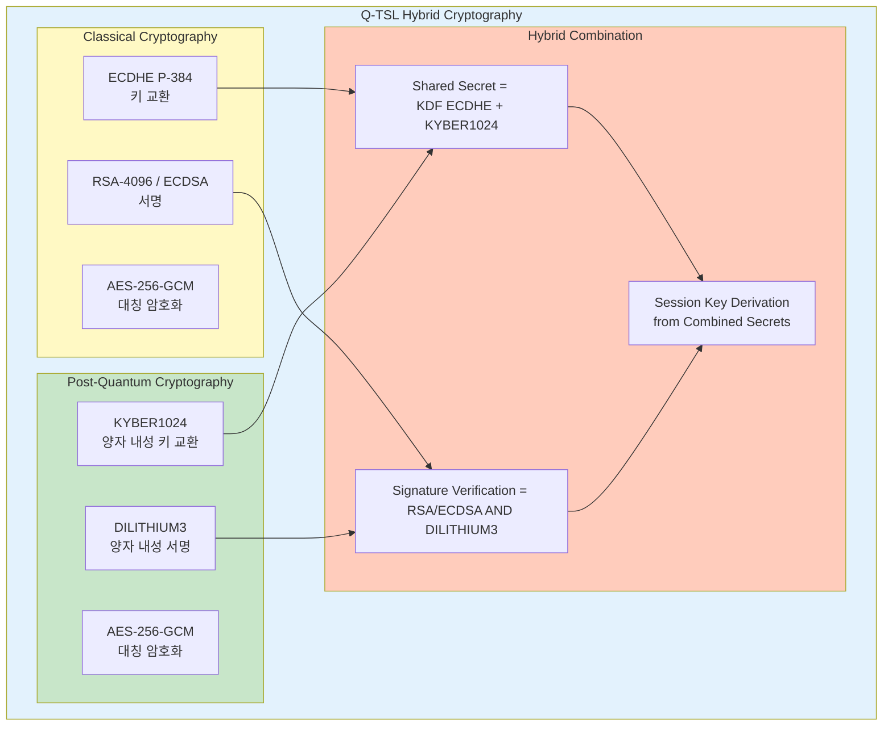
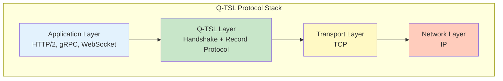
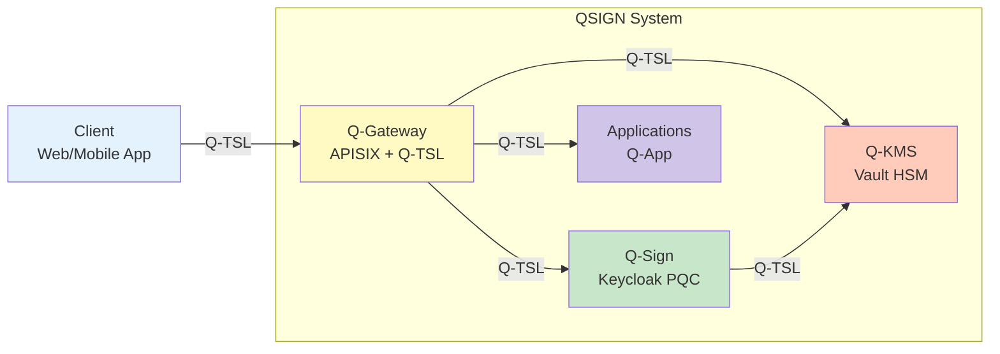

# Q-TSL (Q-SSL) 설계 문서

Q-Sign™ On-Premises Edition의 Q-TSL (Quantum-resistant Transport Security Layer) / Q-SSL 아키텍처 및 설계 문서입니다.

## 📘 개요

Q-TSL은 QSIGN 시스템에서 사용하는 양자 내성 전송 보안 계층으로, 전통적인 TLS/SSL에 Post-Quantum Cryptography (PQC)를 하이브리드 방식으로 통합한 차세대 보안 프로토콜입니다.

### 핵심 특징

- **Hybrid Cryptography**: 전통 암호화 + PQC 알고리즘 조합
- **Quantum Resistance**: 양자 컴퓨터 공격에 대한 내성
- **Backward Compatibility**: 기존 TLS 1.3 호환성 유지
- **FIPS Compliance**: NIST FIPS 203/204/205 표준 준수

## 📖 문서 목록

### 1. [Q-TSL-OVERVIEW.md](./Q-TSL-OVERVIEW.md)
Q-TSL/Q-SSL 개요 및 배경
- Q-TSL이란 무엇인가
- 양자 위협과 PQC의 필요성
- TLS-PQC Hybrid Mode 소개
- Q-TSL vs 전통적 TLS 비교
- QSIGN에서의 Q-TSL 역할

### 2. [Q-TSL-ARCHITECTURE.md](./Q-TSL-ARCHITECTURE.md)
Q-TSL 아키텍처 설계
- 전체 아키텍처 다이어그램
- 계층 구조 (Application → Q-TSL → Transport → Network)
- 하이브리드 암호화 모델
- 키 교환 메커니즘 (Kyber1024 + ECDHE)
- 서명 알고리즘 (Dilithium3 + ECDSA)
- 암호화 스위트 구성

### 3. [Q-TSL-DESIGN.md](./Q-TSL-DESIGN.md)
상세 설계 문서
- 프로토콜 메시지 포맷
- 핸드셰이크 프로토콜 상세
- 레코드 프로토콜 설계
- Alert 프로토콜
- 에러 처리 및 복구
- 성능 최적화 전략

### 4. [CERTIFICATE-MANAGEMENT.md](./CERTIFICATE-MANAGEMENT.md)
인증서 관리
- PQC 인증서 구조 (X.509v3 확장)
- 하이브리드 인증서 체인
- CA (Certificate Authority) 구성
- 인증서 발급 및 갱신
- CRL 및 OCSP
- Luna HSM 기반 키 보호

### 5. [HANDSHAKE-PROTOCOL.md](./HANDSHAKE-PROTOCOL.md)
TLS-PQC Hybrid 핸드셰이크 프로토콜
- ClientHello 확장 (PQC 지원 표시)
- ServerHello 및 알고리즘 협상
- 키 교환 (Kyber1024 KEM)
- 서버 인증 (Dilithium3 서명)
- 클라이언트 인증 (선택사항)
- Finished 메시지 및 세션 설정

### 6. [CIPHER-SUITES.md](./CIPHER-SUITES.md)
암호화 스위트 및 알고리즘
- 지원 Cipher Suites 목록
- PQC 알고리즘 조합
  - TLS_KYBER1024_DILITHIUM3_WITH_AES_256_GCM_SHA384
  - TLS_HYBRID_ECDHE_KYBER1024_RSA_DILITHIUM3_WITH_AES_256_GCM_SHA384
- Cipher Suite 협상 프로세스
- 성능 및 보안 트레이드오프
- 권장 설정

### 7. [SEQUENCE-DIAGRAMS.md](./SEQUENCE-DIAGRAMS.md)
Q-TSL 시퀀스 다이어그램
- 전체 TLS-PQC Hybrid 핸드셰이크
- 키 교환 상세 흐름
- 인증서 검증 흐름
- 세션 재개 (Session Resumption)
- 세션 티켓 (Session Ticket)
- 에러 처리 시나리오

### 8. [IMPLEMENTATION-GUIDE.md](./IMPLEMENTATION-GUIDE.md)
Q-TSL 구현 가이드
- OpenSSL + OQS (Open Quantum Safe) 통합
- APISIX Gateway Q-TSL 설정
- Nginx Q-TSL 모듈 설정
- 클라이언트 라이브러리 구현
- 테스트 및 검증 방법
- 성능 튜닝

### 9. [INTEGRATION.md](./INTEGRATION.md)
기존 시스템 통합
- Q-Gateway (APISIX)와의 통합
- Keycloak PQC 연동
- Vault HSM 통합
- 애플리케이션 레벨 통합
- 레거시 시스템 호환성
- 마이그레이션 전략

### 10. [TESTING-VALIDATION.md](./TESTING-VALIDATION.md)
테스트 및 검증
- 기능 테스트 (Functional Testing)
- 보안 테스트 (Security Testing)
- 성능 벤치마크
- 상호운용성 테스트
- 부하 테스트 (Load Testing)
- 침투 테스트 (Penetration Testing)

## 🔐 Q-TSL 핵심 개념

### Hybrid Cryptography Model



### Q-TSL Protocol Stack



### Security Properties

```yaml
보안 속성:
  기밀성 (Confidentiality):
    - AES-256-GCM 대칭 암호화
    - Perfect Forward Secrecy (PFS)
    - 양자 컴퓨터 공격 내성

  무결성 (Integrity):
    - HMAC-SHA384 메시지 인증
    - GCM 모드 AEAD (Authenticated Encryption)
    - 재전송 공격 방지

  인증 (Authentication):
    - X.509v3 PQC 인증서
    - Dilithium3 디지털 서명
    - 상호 인증 (Mutual Authentication) 지원

  부인 방지 (Non-Repudiation):
    - 서명 기반 트랜잭션 로깅
    - 감사 추적 (Audit Trail)
```

## 🎯 적용 범위

### QSIGN 시스템 내 Q-TSL 적용



### 적용 시나리오

1. **External Communication** (외부 통신)
   - Client ↔ Q-Gateway: 인터넷을 통한 모든 통신
   - 최우선 Q-TSL 적용 대상

2. **Internal Communication** (내부 통신)
   - Q-Gateway ↔ Keycloak: 인증 토큰 발급
   - Q-Gateway ↔ Vault: 암호화 키 요청
   - Keycloak ↔ Vault: HSM 서명 요청

3. **Service Mesh** (서비스 메시)
   - Microservices 간 통신
   - Kubernetes Pod 간 암호화 통신

## 📊 성능 고려사항

### 핸드셰이크 오버헤드

| 프로토콜 | 핸드셰이크 시간 | CPU 사용량 | 메모리 |
|---------|----------------|-----------|--------|
| TLS 1.3 (RSA-2048) | ~50ms | 낮음 | 8KB |
| TLS 1.3 (ECDHE P-256) | ~30ms | 낮음 | 4KB |
| **Q-TSL Hybrid** | **~80ms** | **중간** | **24KB** |
| Q-TSL PQC Only | ~120ms | 높음 | 48KB |

### 최적화 전략

```yaml
성능 최적화:
  Session Resumption:
    - Session ID 기반 재개
    - Session Ticket (RFC 5077)
    - 0-RTT 데이터 전송

  Hardware Acceleration:
    - Luna HSM을 통한 PQC 연산 가속
    - AES-NI 하드웨어 암호화

  Connection Pooling:
    - Keep-Alive 연결 유지
    - HTTP/2 Multiplexing

  Caching:
    - 인증서 체인 캐싱
    - OCSP 응답 캐싱
```

## 🔗 관련 문서

- [01-architecture/PQC-ARCHITECTURE.md](../01-architecture/PQC-ARCHITECTURE.md) - PQC 아키텍처 개요
- [01-architecture/SECURITY-DESIGN.md](../01-architecture/SECURITY-DESIGN.md) - 보안 설계
- [02-setup/HSM-SETUP.md](../02-setup/HSM-SETUP.md) - Luna HSM 설정
- [03-deployment/](../03-deployment/) - 배포 가이드
- [05-api-reference/](../05-api-reference/) - API 레퍼런스

## 📚 참고 표준

```yaml
NIST PQC Standards:
  - FIPS 203: Module-Lattice-Based Key-Encapsulation Mechanism (KYBER)
  - FIPS 204: Module-Lattice-Based Digital Signature Algorithm (DILITHIUM)
  - FIPS 205: Stateless Hash-Based Digital Signature Algorithm (SPHINCS+)

IETF Standards:
  - RFC 8446: TLS 1.3
  - RFC 5280: X.509 Public Key Infrastructure
  - Draft: Hybrid Post-Quantum TLS

Industry Standards:
  - Open Quantum Safe (OQS)
  - ETSI TS 103 744: Quantum-Safe Hybrid Key Exchange
```

---

**Last Updated**: 2025-11-16
**Version**: 1.0.0
**Status**: Design Phase
**Security Level**: FIPS 140-2 Level 3
