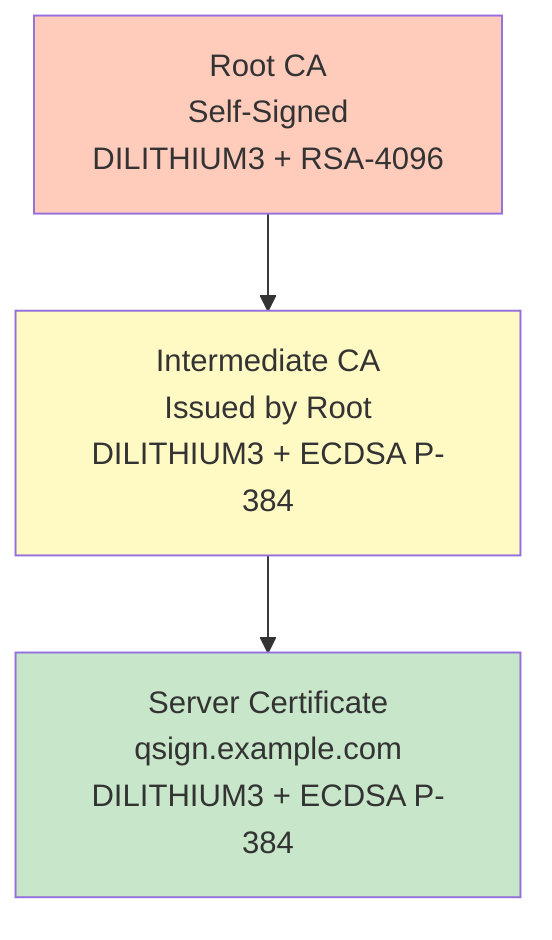
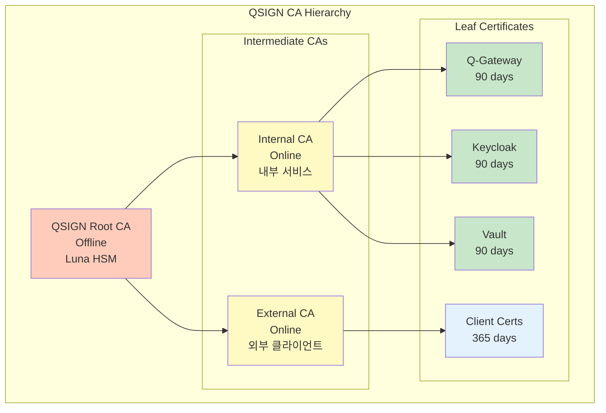
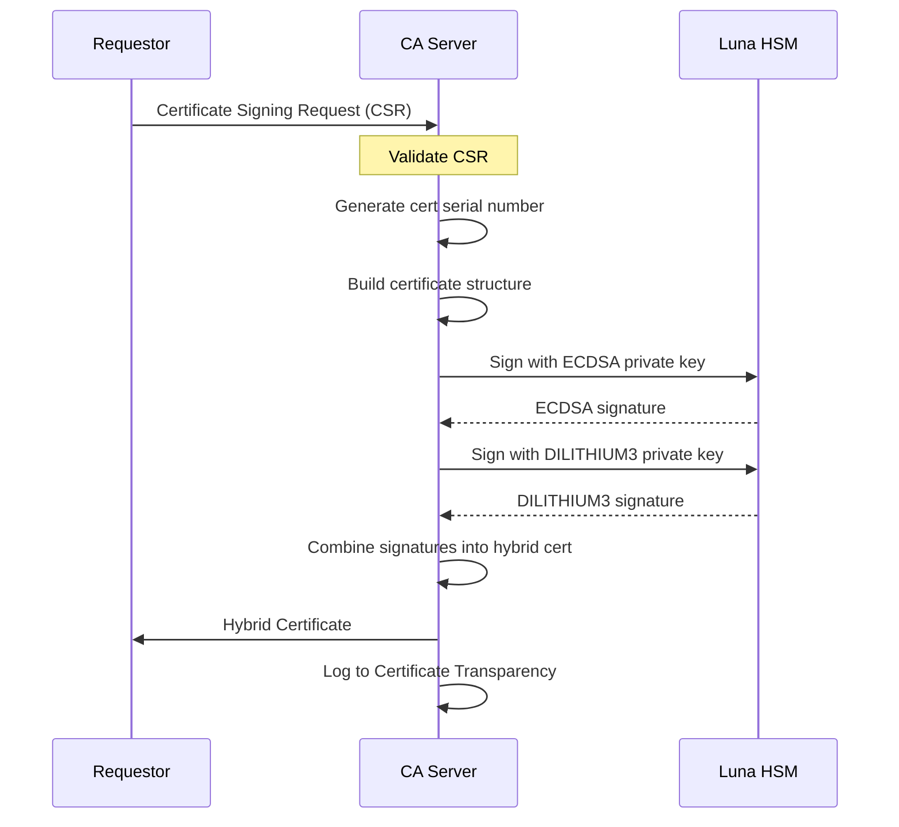
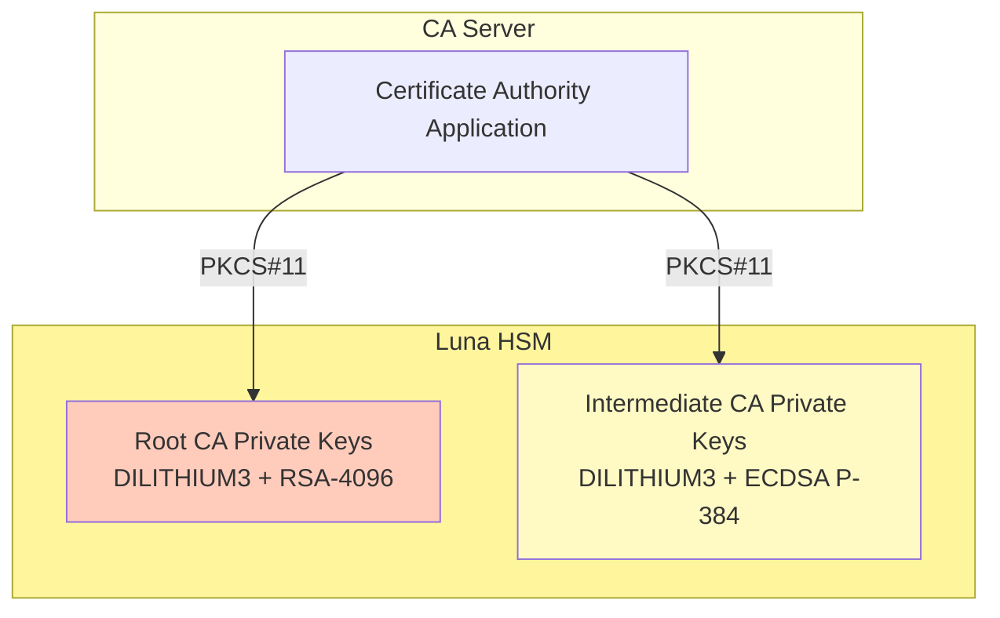

# Q-SSL 인증서 관리

Q-SSL (Quantum-resistant SSL) PQC 인증서 관리 문서입니다.

## 목차
- [PQC 인증서 구조](#pqc-인증서-구조)
- [하이브리드 인증서 체인](#하이브리드-인증서-체인)
- [CA 구성](#ca-구성)
- [인증서 발급 및 갱신](#인증서-발급-및-갱신)
- [CRL 및 OCSP](#crl-및-ocsp)
- [Luna HSM 통합](#luna-hsm-통합)

---

## PQC 인증서 구조

### X.509v3 Hybrid Certificate

```yaml
Certificate:
  Version: 3 (0x2)
  Serial Number: 0x1234567890abcdef
  Signature Algorithms:
    - Algorithm 1: ecdsa-with-SHA384
    - Algorithm 2: dilithium3
  Issuer: CN=QSIGN CA, O=QSIGN, C=KR
  Validity:
    Not Before: 2025-01-01 00:00:00 UTC
    Not After: 2025-04-01 00:00:00 UTC  # 90 days
  Subject: CN=qsign.example.com, O=QSIGN, C=KR
  Subject Public Key Info:
    Public Key Algorithm 1: id-ecPublicKey (P-384)
      Public Key: (384 bit)
        04:xx:xx:...  # 97 bytes
    Public Key Algorithm 2: dilithium3
      Public Key: (1952 bytes)
        xx:xx:xx:...
  X509v3 Extensions:
    X509v3 Subject Alternative Name:
      DNS:qsign.example.com
      DNS:*.qsign.example.com
    X509v3 Key Usage: critical
      Digital Signature, Key Encipherment
    X509v3 Extended Key Usage:
      TLS Web Server Authentication
  Signature Algorithms:
    - ECDSA Signature (64 bytes)
    - DILITHIUM3 Signature (3293 bytes)
```

### 인증서 크기 비교

```yaml
Certificate Sizes:
  Classical RSA-2048:
    Total Size: ~2 KB
    Public Key: 256 bytes
    Signature: 256 bytes

  Classical ECDSA P-384:
    Total Size: ~1 KB
    Public Key: 97 bytes
    Signature: 96 bytes

  PQC DILITHIUM3 Only:
    Total Size: ~6 KB
    Public Key: 1,952 bytes
    Signature: 3,293 bytes

  Hybrid ECDSA P-384 + DILITHIUM3:
    Total Size: ~12 KB
    Public Keys: 97 + 1,952 = 2,049 bytes
    Signatures: 96 + 3,293 = 3,389 bytes
```

---

## 하이브리드 인증서 체인

### Certificate Chain 구조



### Chain Validation

```python
def validate_hybrid_certificate_chain(server_cert, intermediate_cert,
                                      root_cert):
    """하이브리드 인증서 체인 검증"""

    # 1. Validate server certificate
    # Classical ECDSA verification
    ecdsa_valid = verify_ecdsa_signature(
        certificate=server_cert,
        issuer_pubkey=intermediate_cert.ecdsa_pubkey,
        signature=server_cert.ecdsa_signature
    )

    # PQC DILITHIUM3 verification
    dilithium_valid = verify_dilithium_signature(
        certificate=server_cert,
        issuer_pubkey=intermediate_cert.dilithium_pubkey,
        signature=server_cert.dilithium_signature
    )

    server_valid = ecdsa_valid and dilithium_valid

    # 2. Validate intermediate certificate
    ecdsa_valid = verify_ecdsa_signature(
        certificate=intermediate_cert,
        issuer_pubkey=root_cert.rsa_pubkey,  # Hybrid RSA+DILITHIUM
        signature=intermediate_cert.ecdsa_signature
    )

    dilithium_valid = verify_dilithium_signature(
        certificate=intermediate_cert,
        issuer_pubkey=root_cert.dilithium_pubkey,
        signature=intermediate_cert.dilithium_signature
    )

    intermediate_valid = ecdsa_valid and dilithium_valid

    # 3. Verify root is trusted
    root_trusted = is_in_trust_store(root_cert)

    return server_valid and intermediate_valid and root_trusted
```

---

## CA 구성

### QSIGN CA 계층



---

## 인증서 발급 및 갱신

### 인증서 발급 프로세스



### OpenSSL 명령어로 CSR 생성

```bash
#!/bin/bash
# Generate hybrid CSR

# 1. Generate classical ECDSA key
openssl ecparam -name secp384r1 -genkey -out ecdsa_key.pem

# 2. Generate PQC DILITHIUM3 key (using oqs-openssl)
openssl genpkey -algorithm dilithium3 -out dilithium_key.pem

# 3. Create CSR configuration
cat > csr.conf <<EOF
[req]
default_bits = 384
prompt = no
default_md = sha384
distinguished_name = dn
req_extensions = v3_req

[dn]
C = KR
O = QSIGN
CN = qsign.example.com

[v3_req]
subjectAltName = @alt_names

[alt_names]
DNS.1 = qsign.example.com
DNS.2 = *.qsign.example.com
EOF

# 4. Generate CSR with ECDSA
openssl req -new -key ecdsa_key.pem -config csr.conf -out ecdsa_csr.pem

# 5. Generate CSR with DILITHIUM3
openssl req -new -key dilithium_key.pem -config csr.conf -out dilithium_csr.pem

# 6. Combine CSRs (custom script)
./combine_hybrid_csr.py ecdsa_csr.pem dilithium_csr.pem > hybrid_csr.pem
```

### 자동 갱신 (cert-manager)

```yaml
# Kubernetes cert-manager CertificateRequest
apiVersion: cert-manager.io/v1
kind: Certificate
metadata:
  name: qsign-gateway-cert
  namespace: qsign
spec:
  secretName: qsign-gateway-tls
  duration: 2160h  # 90 days
  renewBefore: 360h  # 15 days before expiry
  subject:
    organizations:
      - QSIGN
  commonName: gateway.qsign.svc.cluster.local
  dnsNames:
    - gateway.qsign.svc.cluster.local
    - qsign.example.com
  issuerRef:
    name: qsign-intermediate-ca
    kind: ClusterIssuer
  usages:
    - digital signature
    - key encipherment
    - server auth
  # Hybrid certificate annotations
  annotations:
    cert-manager.io/hybrid-pqc: "true"
    cert-manager.io/classical-algorithm: "ecdsa-p384"
    cert-manager.io/pqc-algorithm: "dilithium3"
```

---

## CRL 및 OCSP

### Certificate Revocation List (CRL)

```yaml
CRL Distribution Points:
  URL: http://crl.qsign.example.com/qsign_intermediate.crl
  Update Frequency: Every 24 hours

CRL Structure:
  Version: 2
  Signature Algorithm: ECDSA-SHA384 + DILITHIUM3
  Issuer: CN=QSIGN Intermediate CA
  This Update: 2025-11-16 00:00:00 UTC
  Next Update: 2025-11-17 00:00:00 UTC
  Revoked Certificates:
    - Serial: 0x1234...
      Revocation Date: 2025-11-15 10:30:00 UTC
      Reason: Key Compromise
```

### OCSP (Online Certificate Status Protocol)

```yaml
OCSP Configuration:
  Responder URL: http://ocsp.qsign.example.com
  Response Type: Hybrid ECDSA + DILITHIUM3
  Cache Duration: 3600 seconds

OCSP Stapling (Nginx):
  ssl_stapling on;
  ssl_stapling_verify on;
  ssl_trusted_certificate /etc/ssl/certs/qsign_chain.pem;
  resolver 8.8.8.8 8.8.4.4 valid=300s;
```

### OCSP 요청 예제

```bash
#!/bin/bash
# Check certificate status via OCSP

# Extract OCSP URL from certificate
OCSP_URL=$(openssl x509 -in server_cert.pem -noout -ocsp_uri)

# Send OCSP request
openssl ocsp \
  -issuer intermediate_ca.pem \
  -cert server_cert.pem \
  -url $OCSP_URL \
  -CAfile root_ca.pem \
  -resp_text

# Output:
# OCSP Response Status: successful (0x0)
# Response Type: Basic OCSP Response
# ...
# Cert Status: good
```

---

## Luna HSM 통합

### HSM 기반 CA 키 보호



### Luna HSM 설정

```bash
#!/bin/bash
# Luna HSM setup for CA keys

# 1. Initialize HSM partition
lunacm

LunaCM> partition init -label QSIGN_CA

# 2. Create crypto user
LunaCM> role createCO -name ca_admin

# 3. Generate Root CA keys in HSM
LunaCM> keypair generate \
  -label "qsign_root_rsa" \
  -algorithm rsa \
  -size 4096 \
  -usage sign

LunaCM> keypair generate \
  -label "qsign_root_dilithium3" \
  -algorithm dilithium3 \
  -usage sign

# 4. Generate Intermediate CA keys
LunaCM> keypair generate \
  -label "qsign_int_ecdsa" \
  -algorithm ecdsa \
  -curve secp384r1 \
  -usage sign

LunaCM> keypair generate \
  -label "qsign_int_dilithium3" \
  -algorithm dilithium3 \
  -usage sign
```

### PKCS#11 인증서 서명

```python
import PyKCS11

def sign_certificate_with_hsm(cert_to_sign, ca_label):
    """Luna HSM을 사용한 인증서 서명"""

    # Load PKCS#11 library
    pkcs11 = PyKCS11.PyKCS11Lib()
    pkcs11.load('/usr/lib/libCryptoki2_64.so')

    # Open session
    slot = pkcs11.getSlotList()[0]
    session = pkcs11.openSession(slot)
    session.login('ca_admin_password')

    # Find signing keys
    ecdsa_key = find_key(session, ca_label + '_ecdsa')
    dilithium_key = find_key(session, ca_label + '_dilithium3')

    # Sign with ECDSA
    ecdsa_signature = session.sign(
        ecdsa_key,
        cert_to_sign,
        mechanism=PyKCS11.CKM_ECDSA_SHA384
    )

    # Sign with DILITHIUM3
    dilithium_signature = session.sign(
        dilithium_key,
        cert_to_sign,
        mechanism=PyKCS11.CKM_DILITHIUM3
    )

    session.logout()
    session.closeSession()

    return ecdsa_signature, dilithium_signature
```

---

## 참고 자료

```yaml
표준:
  - RFC 5280: X.509 PKI
  - RFC 6960: OCSP
  - NIST FIPS 203/204/205
  - PKCS#11: Cryptographic Token Interface
```

---

**Last Updated**: 2025-11-16
**Version**: 1.0.0
