# Q-SSL Cipher Suites

Q-SSL에서 지원하는 암호화 스위트, PQC 알고리즘 조합, 설정 및 최적화 가이드입니다.

## 목차

- [1. Cipher Suite 개요](#1-cipher-suite-개요)
- [2. Q-SSL Cipher Suites](#2-q-ssl-cipher-suites)
- [3. PQC 알고리즘 조합](#3-pqc-알고리즘-조합)
- [4. Cipher Suite 협상](#4-cipher-suite-협상)
- [5. 성능 및 보안 트레이드오프](#5-성능-및-보안-트레이드오프)
- [6. OpenSSL 설정](#6-openssl-설정)
- [7. 권장 설정](#7-권장-설정)

---

## 1. Cipher Suite 개요

### 1.1 Cipher Suite란?

```yaml
Cipher Suite 구성요소:

  1. Key Exchange (키 교환):
     - RSA, DHE, ECDHE, Kyber

  2. Authentication (인증):
     - RSA, ECDSA, Dilithium

  3. Encryption (대칭 암호화):
     - AES-128-GCM, AES-256-GCM, ChaCha20-Poly1305

  4. MAC (Message Authentication Code):
     - HMAC-SHA256, HMAC-SHA384
     - TLS 1.3: AEAD 통합 (별도 MAC 없음)

Cipher Suite 이름 형식:
  TLS_{KeyExchange}_{Authentication}_WITH_{Encryption}_{MAC}

예시:
  TLS_ECDHE_RSA_WITH_AES_256_GCM_SHA384
  ├── TLS: 프로토콜
  ├── ECDHE: 키 교환
  ├── RSA: 인증 (서명)
  ├── AES_256_GCM: 암호화 (AEAD)
  └── SHA384: PRF/HMAC
```

### 1.2 Cipher Suite 코드

```python
# TLS Cipher Suite Codes (16-bit)

class CipherSuite:
    """TLS Cipher Suite Identifiers"""

    # TLS 1.3 Cipher Suites (신규, 간소화)
    TLS_AES_128_GCM_SHA256 = 0x1301
    TLS_AES_256_GCM_SHA384 = 0x1302
    TLS_CHACHA20_POLY1305_SHA256 = 0x1303
    TLS_AES_128_CCM_SHA256 = 0x1304
    TLS_AES_128_CCM_8_SHA256 = 0x1305

    # TLS 1.2 AEAD Cipher Suites (권장)
    TLS_ECDHE_ECDSA_WITH_AES_256_GCM_SHA384 = 0xC02C
    TLS_ECDHE_ECDSA_WITH_AES_128_GCM_SHA256 = 0xC02B
    TLS_ECDHE_RSA_WITH_AES_256_GCM_SHA384 = 0xC030
    TLS_ECDHE_RSA_WITH_AES_128_GCM_SHA256 = 0xC02F
    TLS_ECDHE_RSA_WITH_CHACHA20_POLY1305_SHA256 = 0xCCA8
    TLS_ECDHE_ECDSA_WITH_CHACHA20_POLY1305_SHA256 = 0xCCA9

    # TLS 1.2 CBC Cipher Suites (레거시, 비권장)
    TLS_ECDHE_RSA_WITH_AES_256_CBC_SHA384 = 0xC028
    TLS_ECDHE_RSA_WITH_AES_128_CBC_SHA256 = 0xC027

    # Q-SSL Experimental (Hybrid PQC)
    # 주의: 실제 코드 포인트는 IANA 할당 대기
    TLS_KYBER1024_DILITHIUM3_WITH_AES_256_GCM_SHA384 = 0xFE00
    TLS_HYBRID_ECDHE_KYBER1024_ECDSA_DILITHIUM3_WITH_AES_256_GCM_SHA384 = 0xFE01
    TLS_HYBRID_ECDHE_KYBER768_ECDSA_DILITHIUM2_WITH_AES_128_GCM_SHA256 = 0xFE02

# OpenSSL Cipher Suite 이름 매핑
CIPHER_SUITE_NAMES = {
    0x1301: "TLS_AES_128_GCM_SHA256",
    0x1302: "TLS_AES_256_GCM_SHA384",
    0x1303: "TLS_CHACHA20_POLY1305_SHA256",
    0xC02C: "ECDHE-ECDSA-AES256-GCM-SHA384",
    0xC030: "ECDHE-RSA-AES256-GCM-SHA384",
    0xCCA8: "ECDHE-RSA-CHACHA20-POLY1305",
}
```

---

## 2. Q-SSL Cipher Suites

### 2.1 지원 Cipher Suites 목록

```yaml
Q-SSL 지원 Cipher Suites (우선순위 순):

  # Tier 1: TLS 1.3 + Hybrid PQC (최우선 권장)
  1. TLS_HYBRID_KYBER1024_DILITHIUM3_AES_256_GCM_SHA384:
     - 키 교환: ECDHE P-384 + Kyber1024
     - 서명: ECDSA P-384 + Dilithium3
     - 암호화: AES-256-GCM
     - PRF: SHA-384
     - 보안: 256-bit quantum-safe
     - 성능: ~70ms handshake

  2. TLS_AES_256_GCM_SHA384:
     - TLS 1.3 표준
     - 키 교환: ECDHE (+ Kyber1024 hybrid)
     - 암호화: AES-256-GCM
     - 보안: 128-bit classical, 256-bit quantum (with Kyber)
     - 성능: ~35ms handshake (classical), ~70ms (hybrid)

  3. TLS_CHACHA20_POLY1305_SHA256:
     - TLS 1.3 표준
     - 키 교환: ECDHE (+ Kyber1024 hybrid)
     - 암호화: ChaCha20-Poly1305
     - 보안: 256-bit classical
     - 성능: 모바일 최적화

  # Tier 2: TLS 1.2 + Hybrid PQC (권장)
  4. TLS_ECDHE_ECDSA_WITH_AES_256_GCM_SHA384:
     - 키 교환: ECDHE P-384 (+ Kyber1024 hybrid)
     - 서명: ECDSA P-384 (+ Dilithium3 hybrid)
     - 암호화: AES-256-GCM
     - 보안: 192-bit classical
     - 성능: ~50ms handshake (classical), ~90ms (hybrid)

  5. TLS_ECDHE_RSA_WITH_AES_256_GCM_SHA384:
     - 키 교환: ECDHE P-384 (+ Kyber1024 hybrid)
     - 서명: RSA-4096 (+ Dilithium3 hybrid)
     - 암호화: AES-256-GCM
     - 보안: 128-bit classical (RSA-4096)
     - 성능: ~80ms handshake (hybrid)

  # Tier 3: 레거시 호환성 (제한적 사용)
  6. TLS_ECDHE_RSA_WITH_AES_128_GCM_SHA256:
     - TLS 1.2 표준
     - 보안: 128-bit
     - 용도: 레거시 클라이언트 fallback

  # 비권장 (사용 금지)
  ❌ TLS_RSA_WITH_AES_256_CBC_SHA256:
     - Perfect Forward Secrecy 없음
     - CBC 모드 취약점
     - TLS 1.3에서 제거됨
```

### 2.2 Cipher Suite 비교표

| Cipher Suite | TLS Ver | 키 교환 | 서명 | 암호화 | 양자 내성 | 성능 | 권장 |
|-------------|---------|---------|------|--------|----------|------|------|
| **Hybrid Kyber+Dilithium** | 1.3 | ECDHE+Kyber1024 | ECDSA+Dilithium3 | AES-256-GCM | ✅ 256-bit | ~70ms | ⭐⭐⭐⭐⭐ |
| **TLS 1.3 AES-256-GCM** | 1.3 | ECDHE (hybrid) | ECDSA (hybrid) | AES-256-GCM | ✅ 256-bit | ~70ms | ⭐⭐⭐⭐⭐ |
| **TLS 1.3 ChaCha20** | 1.3 | ECDHE (hybrid) | ECDSA (hybrid) | ChaCha20 | ✅ 256-bit | ~65ms | ⭐⭐⭐⭐ |
| **TLS 1.2 ECDHE-ECDSA** | 1.2 | ECDHE+Kyber | ECDSA+Dilithium | AES-256-GCM | ✅ 192-bit | ~90ms | ⭐⭐⭐⭐ |
| **TLS 1.2 ECDHE-RSA** | 1.2 | ECDHE+Kyber | RSA+Dilithium | AES-256-GCM | ⚠️ 128-bit | ~80ms | ⭐⭐⭐ |
| TLS 1.2 ECDHE-RSA-128 | 1.2 | ECDHE | RSA | AES-128-GCM | ❌ 0-bit | ~50ms | ⭐⭐ |
| ❌ RSA CBC | 1.2 | RSA | RSA | AES-256-CBC | ❌ 0-bit | ~60ms | ❌ |

---

## 3. PQC 알고리즘 조합

### 3.1 키 교환 알고리즘


#### Kyber 알고리즘 파라미터

```yaml
Kyber 파라미터:

  Kyber512 (NIST Level 1):
    보안 수준: AES-128 equivalent
    공개키: 800 bytes
    비밀키: 1,632 bytes
    암호문: 768 bytes
    공유 비밀: 32 bytes
    성능: ~100,000 ops/sec (keygen)

  Kyber768 (NIST Level 3):
    보안 수준: AES-192 equivalent
    공개키: 1,184 bytes
    비밀키: 2,400 bytes
    암호문: 1,088 bytes
    공유 비밀: 32 bytes
    성능: ~70,000 ops/sec (keygen)

  Kyber1024 (NIST Level 5):
    보안 수준: AES-256 equivalent
    공개키: 1,568 bytes
    비밀키: 3,168 bytes
    암호문: 1,568 bytes
    공유 비밀: 32 bytes
    성능: ~50,000 ops/sec (keygen)

  QSIGN 권장: Kyber1024 (최고 보안)
```

### 3.2 서명 알고리즘


#### Dilithium 알고리즘 파라미터

```yaml
Dilithium 파라미터:

  Dilithium2 (NIST Level 2):
    보안 수준: 128-bit quantum
    공개키: 1,312 bytes
    비밀키: 2,528 bytes
    서명: ~2,420 bytes
    성능: ~25,000 sign/sec, ~50,000 verify/sec

  Dilithium3 (NIST Level 3):
    보안 수준: 192-bit quantum
    공개키: 1,952 bytes
    비밀키: 4,000 bytes
    서명: ~3,293 bytes
    성능: ~20,000 sign/sec, ~40,000 verify/sec

  Dilithium5 (NIST Level 5):
    보안 수준: 256-bit quantum
    공개키: 2,592 bytes
    비밀키: 4,864 bytes
    서명: ~4,595 bytes
    성능: ~15,000 sign/sec, ~30,000 verify/sec

  QSIGN 권장: Dilithium3 (균형)
```

### 3.3 대칭 암호화

```yaml
대칭 암호화 알고리즘:

  AES-256-GCM:
    키 크기: 256 bits
    블록 크기: 128 bits
    모드: GCM (Galois/Counter Mode, AEAD)
    IV: 12 bytes (explicit 8 bytes + implicit 4 bytes)
    Tag: 16 bytes
    성능: ~10 GB/s (AES-NI)
    보안: 256-bit classical, 128-bit quantum (Grover's)
    용도: 서버, 데스크톱

  AES-128-GCM:
    키 크기: 128 bits
    성능: ~15 GB/s (AES-NI)
    보안: 128-bit classical, 64-bit quantum
    용도: 경량 환경

  ChaCha20-Poly1305:
    키 크기: 256 bits
    Nonce: 12 bytes
    Tag: 16 bytes (Poly1305 MAC)
    성능: ~5 GB/s (소프트웨어)
    보안: 256-bit classical, 128-bit quantum
    용도: 모바일, 임베디드 (AES-NI 없는 환경)

  QSIGN 권장:
    - 서버: AES-256-GCM (하드웨어 가속)
    - 모바일: ChaCha20-Poly1305 (소프트웨어 최적화)
```

---

## 4. Cipher Suite 협상

### 4.1 협상 프로세스

```mermaid
sequenceDiagram
    participant C as Client
    participant S as Server

    Note over C,S: Cipher Suite 협상

    C->>C: 지원 cipher suites 목록 준비
    C->>S: ClientHello<br/>cipher_suites = [0x1302, 0x1303, 0xC02C, ...]

    S->>S: 클라이언트 목록 수신
    S->>S: 서버 우선순위로 선택<br/>(보안 > 성능)

    alt 공통 Cipher Suite 존재
        S->>S: 최우선 cipher suite 선택<br/>(예: 0x1302 = AES-256-GCM)
        S->>C: ServerHello<br/>cipher_suite = 0x1302
        Note over C,S: ✅ 협상 성공
    else 공통 Cipher Suite 없음
        S->>C: Alert: handshake_failure (40)
        S->>S: 연결 종료
        Note over C,S: ❌ 협상 실패
    end
```



### 4.2 우선순위 정책

```yaml
Cipher Suite 선택 우선순위:

  서버 우선순위 (Server Preference):
    1. 보안 수준 (높을수록 우선)
       - 양자 내성 > 고전 암호
       - AES-256 > AES-128
       - AEAD > CBC

    2. 성능 (동일 보안 수준에서)
       - TLS 1.3 > TLS 1.2
       - GCM > ChaCha20 (서버, AES-NI 있을 때)
       - ChaCha20 > GCM (모바일)

    3. 호환성
       - 최신 표준 우선
       - 레거시는 fallback

  클라이언트 우선순위 (Client Preference):
    - 일부 시스템에서 클라이언트 우선순위 허용
    - 보안상 서버 우선순위 권장

  QSIGN 정책:
    - 서버 우선순위 강제
    - Hybrid PQC 최우선
    - TLS 1.3 > TLS 1.2
```

### 4.3 Downgrade 공격 방지

```python
# Downgrade 공격 방지

def verify_cipher_suite_downgrade(
    selected_cipher,
    client_supported,
    server_supported
):
    """
    Cipher suite downgrade 공격 탐지

    Args:
        selected_cipher: 서버가 선택한 cipher suite
        client_supported: 클라이언트 지원 목록
        server_supported: 서버 지원 목록

    Returns:
        True if no downgrade, False if suspicious
    """
    # 1. 공통 cipher suites 찾기
    common_ciphers = set(client_supported) & set(server_supported)

    if selected_cipher not in common_ciphers:
        # 선택된 cipher가 공통 목록에 없음 -> 에러
        return False

    # 2. 서버 우선순위 목록에서 더 강한 cipher 확인
    for cipher in server_supported:
        if cipher in common_ciphers:
            # 첫 번째 공통 cipher가 선택되어야 함
            if cipher != selected_cipher:
                # Downgrade 의심
                print(f"⚠️ Possible downgrade: expected {cipher:#x}, got {selected_cipher:#x}")
                return False
            break

    return True

# 사용 예시
client_ciphers = [0x1302, 0x1303, 0xC02C, 0xC030]
server_ciphers = [0x1302, 0x1303, 0xC02C]
selected = 0x1302

is_safe = verify_cipher_suite_downgrade(selected, client_ciphers, server_ciphers)
# is_safe = True
```

---

## 5. 성능 및 보안 트레이드오프

### 5.1 핸드셰이크 성능

```yaml
Cipher Suite별 핸드셰이크 성능 (AMD EPYC 7742):

  TLS 1.3 + Hybrid Kyber1024 + Dilithium3:
    키 교환: ~2ms (ECDHE) + ~0.5ms (Kyber encap)
    서명: ~1ms (ECDSA sign) + ~50ms (Dilithium sign)
    검증: ~1ms (ECDSA verify) + ~25ms (Dilithium verify)
    총 핸드셰이크: ~70ms
    대역폭: ~18KB

  TLS 1.3 + Classical ECDHE + ECDSA:
    키 교환: ~2ms (ECDHE)
    서명: ~1ms (ECDSA sign)
    검증: ~1ms (ECDSA verify)
    총 핸드셰이크: ~35ms
    대역폭: ~2KB

  TLS 1.2 + Hybrid:
    총 핸드셰이크: ~90ms (2-RTT)
    대역폭: ~20KB

  성능 오버헤드:
    - Hybrid vs Classical: 2배 느림
    - 대역폭: 9배 증가
    - 하지만 양자 내성 확보!
```

### 5.2 데이터 전송 성능

```yaml
대칭 암호화 성능 (AES-NI 지원 CPU):

  AES-256-GCM:
    암호화: ~10 GB/s
    복호화: ~10 GB/s
    레이턴시: ~1μs (16KB 블록)
    용도: 대용량 데이터, 서버

  AES-128-GCM:
    암호화: ~15 GB/s
    복호화: ~15 GB/s
    레이턴시: ~0.8μs (16KB 블록)
    용도: 고속 전송

  ChaCha20-Poly1305 (소프트웨어):
    암호화: ~5 GB/s
    복호화: ~5 GB/s
    레이턴시: ~2μs (16KB 블록)
    용도: 모바일, ARM

  결론:
    - 핸드셰이크: Hybrid PQC는 느림 (~2배)
    - 데이터 전송: 차이 없음 (대칭키 동일)
    - 전체 성능: Session resumption으로 핸드셰이크 최소화
```

### 5.3 메모리 사용량

```yaml
Cipher Suite별 메모리 사용:

  Classical TLS 1.3 (ECDHE + ECDSA):
    인증서: ~2KB
    키 material: ~1KB
    세션 state: ~4KB
    총: ~7KB per connection

  Hybrid Q-SSL (Kyber1024 + Dilithium3):
    인증서: ~8KB (hybrid cert)
    키 material: ~5KB (Kyber + ECDHE)
    세션 state: ~10KB
    총: ~23KB per connection

  오버헤드:
    - 3.3배 메모리 증가
    - 10,000 연결 시: 230MB vs 70MB
    - 여전히 허용 가능 (서버 기준)
```

---

## 6. OpenSSL 설정

### 6.1 OpenSSL Cipher String

```bash
# OpenSSL Cipher Suite 설정

# Q-SSL 권장 설정 (보안 우선)
SSL_CIPHER_SUITES="TLS_AES_256_GCM_SHA384:TLS_CHACHA20_POLY1305_SHA256"
SSL_CIPHER_LIST="ECDHE-ECDSA-AES256-GCM-SHA384:ECDHE-RSA-AES256-GCM-SHA384:ECDHE-ECDSA-CHACHA20-POLY1305"

# 중간 수준 (호환성 고려)
SSL_CIPHER_SUITES="TLS_AES_256_GCM_SHA384:TLS_AES_128_GCM_SHA256:TLS_CHACHA20_POLY1305_SHA256"
SSL_CIPHER_LIST="ECDHE-ECDSA-AES256-GCM-SHA384:ECDHE-RSA-AES256-GCM-SHA384:ECDHE-ECDSA-AES128-GCM-SHA256:ECDHE-RSA-AES128-GCM-SHA256"

# OpenSSL 명령어
openssl ciphers -v 'TLS_AES_256_GCM_SHA384:TLS_CHACHA20_POLY1305_SHA256'

# 출력 예시:
# TLS_AES_256_GCM_SHA384  TLSv1.3 Kx=any      Au=any  Enc=AESGCM(256) Mac=AEAD
# TLS_CHACHA20_POLY1305_SHA256 TLSv1.3 Kx=any Au=any Enc=CHACHA20/POLY1305(256) Mac=AEAD
```

### 6.2 Nginx Q-SSL 설정

```nginx
# /etc/nginx/nginx.conf

http {
    # Q-SSL 설정
    ssl_protocols TLSv1.3 TLSv1.2;

    # TLS 1.3 Cipher Suites (우선순위 순)
    ssl_conf_command Ciphersuites TLS_AES_256_GCM_SHA384:TLS_CHACHA20_POLY1305_SHA256;

    # TLS 1.2 Cipher Suites (fallback)
    ssl_ciphers 'ECDHE-ECDSA-AES256-GCM-SHA384:ECDHE-RSA-AES256-GCM-SHA384:ECDHE-ECDSA-CHACHA20-POLY1305:ECDHE-RSA-CHACHA20-POLY1305';

    # 서버 우선순위
    ssl_prefer_server_ciphers on;

    # Session resumption
    ssl_session_cache shared:SSL:50m;
    ssl_session_timeout 1d;
    ssl_session_tickets on;

    # OCSP Stapling
    ssl_stapling on;
    ssl_stapling_verify on;
    resolver 8.8.8.8 8.8.4.4 valid=300s;
    resolver_timeout 5s;

    # PQC 그룹 (OQS Provider 필요)
    ssl_conf_command Groups kyber1024:x25519:prime256v1:secp384r1;

    # PQC 서명 알고리즘
    ssl_conf_command SignatureAlgorithms dilithium3:ecdsa_secp384r1_sha384:rsa_pss_rsae_sha384;

    server {
        listen 443 ssl http2;
        server_name qsign.example.com;

        # Hybrid PQC 인증서
        ssl_certificate /etc/nginx/certs/qssl-hybrid.crt;
        ssl_certificate_key /etc/nginx/certs/qssl-hybrid.key;
        ssl_trusted_certificate /etc/nginx/certs/qssl-ca-bundle.crt;

        # mTLS (선택)
        ssl_client_certificate /etc/nginx/certs/qssl-client-ca.crt;
        ssl_verify_client optional;
        ssl_verify_depth 3;

        # HSTS (Strict Transport Security)
        add_header Strict-Transport-Security "max-age=63072000; includeSubDomains; preload" always;

        location / {
            proxy_pass http://backend;
            proxy_ssl_protocols TLSv1.3;
        }
    }
}
```

### 6.3 Apache Q-SSL 설정

```apache
# /etc/httpd/conf.d/qssl.conf

<VirtualHost *:443>
    ServerName qsign.example.com

    # Q-SSL 활성화
    SSLEngine on

    # 프로토콜
    SSLProtocol -all +TLSv1.3 +TLSv1.2

    # Cipher Suites
    SSLCipherSuite TLS_AES_256_GCM_SHA384:TLS_CHACHA20_POLY1305_SHA256
    SSLCipherSuite ECDHE-ECDSA-AES256-GCM-SHA384:ECDHE-RSA-AES256-GCM-SHA384

    # 서버 우선순위
    SSLHonorCipherOrder on

    # Hybrid PQC 인증서
    SSLCertificateFile /etc/httpd/certs/qssl-hybrid.crt
    SSLCertificateKeyFile /etc/httpd/certs/qssl-hybrid.key
    SSLCACertificateFile /etc/httpd/certs/qssl-ca-bundle.crt

    # Session Cache
    SSLSessionCache shmcb:/var/cache/httpd/ssl_scache(512000)
    SSLSessionCacheTimeout 300

    # OCSP Stapling
    SSLUseStapling on
    SSLStaplingCache shmcb:/var/cache/httpd/ssl_stapling(128000)

    # mTLS (선택)
    SSLVerifyClient optional
    SSLVerifyDepth 3

    # HSTS
    Header always set Strict-Transport-Security "max-age=63072000; includeSubDomains; preload"

    <Location />
        Require all granted
    </Location>
</VirtualHost>

# OQS Provider 설정 (OpenSSL 3.0)
SSLOpenSSLConfCmd Ciphersuites TLS_AES_256_GCM_SHA384
SSLOpenSSLConfCmd Groups kyber1024:x25519:prime256v1
SSLOpenSSLConfCmd SignatureAlgorithms dilithium3:ecdsa_secp384r1_sha384
```

### 6.4 APISIX Q-SSL 설정

```yaml
# /opt/apisix/conf/config.yaml

apisix:
  ssl:
    enable: true
    listen:
      - port: 443
        enable_http2: true
        enable_http3: false

    # Q-SSL 프로토콜
    ssl_protocols: "TLSv1.3 TLSv1.2"

    # Cipher Suites
    ssl_ciphers: >
      TLS_AES_256_GCM_SHA384
      TLS_CHACHA20_POLY1305_SHA256
      ECDHE-ECDSA-AES256-GCM-SHA384
      ECDHE-RSA-AES256-GCM-SHA384

    # 서버 우선순위
    ssl_prefer_server_ciphers: true

    # Session Cache
    ssl_session_cache: "shared:SSL:10m"
    ssl_session_timeout: "10m"
    ssl_session_tickets: true

    # Hybrid PQC 인증서
    ssl_certificate: "/etc/apisix/certs/qssl-hybrid.crt"
    ssl_certificate_key: "/etc/apisix/certs/qssl-hybrid.key"
    ssl_trusted_certificate: "/etc/apisix/certs/qssl-ca-bundle.crt"

    # mTLS
    ssl_verify_client: "optional"
    ssl_verify_depth: 3

    # OQS Provider (OpenSSL 3.0)
    ssl_conf_command:
      - "Options KTLS"
      - "Groups kyber1024:x25519:prime256v1:secp384r1"
      - "SignatureAlgorithms dilithium3:ecdsa_secp384r1_sha384:rsa_pss_rsae_sha384"

# SSL/TLS 라우트 설정
routes:
  - uri: "/*"
    upstream:
      type: roundrobin
      nodes:
        "backend:8080": 1
      scheme: https
      ssl:
        verify: true
```

---

## 7. 권장 설정

### 7.1 환경별 권장 설정

```yaml
Q-SSL Cipher Suite 권장 설정:

  # 프로덕션 (최고 보안)
  Production:
    프로토콜: TLS 1.3 only
    Cipher Suites:
      - TLS_AES_256_GCM_SHA384 (Hybrid PQC)
      - TLS_CHACHA20_POLY1305_SHA256 (Hybrid PQC)
    키 교환: ECDHE P-384 + Kyber1024
    서명: ECDSA P-384 + Dilithium3
    세션: Session tickets 활성화
    성능: ~70ms handshake

  # 일반 서비스 (균형)
  General:
    프로토콜: TLS 1.3, TLS 1.2
    Cipher Suites:
      - TLS_AES_256_GCM_SHA384
      - TLS_AES_128_GCM_SHA256
      - ECDHE-ECDSA-AES256-GCM-SHA384
      - ECDHE-RSA-AES256-GCM-SHA384
    키 교환: ECDHE + Kyber (hybrid)
    서명: ECDSA/RSA + Dilithium (hybrid)
    세션: Session cache + tickets
    성능: ~50-70ms handshake

  # 레거시 호환 (최소 보안 유지)
  Legacy:
    프로토콜: TLS 1.3, TLS 1.2, TLS 1.1
    Cipher Suites:
      - TLS_AES_256_GCM_SHA384
      - ECDHE-RSA-AES256-GCM-SHA384
      - ECDHE-RSA-AES128-GCM-SHA256
    경고: PQC hybrid는 선택적
    세션: Session cache
    성능: ~40-60ms handshake

  # 모바일 최적화
  Mobile:
    프로토콜: TLS 1.3
    Cipher Suites:
      - TLS_CHACHA20_POLY1305_SHA256 (우선)
      - TLS_AES_256_GCM_SHA384
    키 교환: X25519 + Kyber768
    서명: ECDSA P-256 + Dilithium2
    세션: 0-RTT 지원
    성능: ~50ms handshake, 소프트웨어 최적화
```

### 7.2 보안 체크리스트

```yaml
Q-SSL 보안 체크리스트:

  ✅ 필수 설정:
    - [ ] TLS 1.3 활성화
    - [ ] Hybrid PQC cipher suites 우선
    - [ ] 서버 우선순위 cipher 선택
    - [ ] 약한 cipher 비활성화 (CBC, RC4, 3DES)
    - [ ] Session resumption 활성화
    - [ ] Perfect Forward Secrecy (PFS) 필수

  ✅ 인증서:
    - [ ] Hybrid PQC 인증서 사용
    - [ ] 인증서 체인 검증
    - [ ] OCSP Stapling 활성화
    - [ ] 인증서 자동 갱신

  ✅ 프로토콜:
    - [ ] SSL 2.0/3.0 비활성화
    - [ ] TLS 1.0/1.1 비활성화 (레거시만 허용)
    - [ ] Compression 비활성화 (CRIME 방지)
    - [ ] Renegotiation 제한

  ✅ 추가 보안:
    - [ ] HSTS 헤더 설정
    - [ ] mTLS 고려 (내부 통신)
    - [ ] Rate limiting
    - [ ] WAF 통합

  ✅ 모니터링:
    - [ ] TLS 버전 분포 모니터링
    - [ ] Cipher suite 사용 통계
    - [ ] 핸드셰이크 실패 로깅
    - [ ] Certificate expiry alerts
```

### 7.3 테스트 및 검증

```bash
#!/bin/bash
# Q-SSL Cipher Suite 테스트

# 1. 지원 Cipher Suites 확인
echo "=== Supported Cipher Suites ==="
openssl ciphers -v | grep -E "(TLS_AES|ECDHE)" | head -10

# 2. Q-SSL 서버 테스트
echo -e "\n=== Q-SSL Server Test ==="
openssl s_client -connect localhost:8443 \
  -CAfile /etc/ssl/certs/qssl-ca-bundle.crt \
  -tls1_3 \
  -ciphersuites "TLS_AES_256_GCM_SHA384" \
  -groups "kyber1024:x25519" \
  -sigalgs "dilithium3:ecdsa_secp384r1_sha384" \
  -showcerts -state -msg < /dev/null 2>&1 | \
  grep -E "(Protocol|Cipher|Verify return code|Server Temp Key)"

# 3. Cipher Suite 협상 테스트
echo -e "\n=== Cipher Suite Negotiation ==="
for cipher in \
  "TLS_AES_256_GCM_SHA384" \
  "TLS_AES_128_GCM_SHA256" \
  "TLS_CHACHA20_POLY1305_SHA256"
do
  echo -n "Testing $cipher: "
  openssl s_client -connect localhost:8443 \
    -CAfile /etc/ssl/certs/qssl-ca-bundle.crt \
    -tls1_3 \
    -ciphersuites "$cipher" \
    < /dev/null 2>&1 | grep -q "Cipher.*$cipher" && \
    echo "✅ OK" || echo "❌ FAIL"
done

# 4. 약한 Cipher 차단 확인
echo -e "\n=== Weak Cipher Block Test ==="
for weak_cipher in \
  "DES-CBC3-SHA" \
  "RC4-SHA" \
  "NULL-SHA256"
do
  echo -n "Testing weak cipher $weak_cipher: "
  openssl s_client -connect localhost:8443 \
    -cipher "$weak_cipher" \
    < /dev/null 2>&1 | grep -q "Cipher.*$weak_cipher" && \
    echo "❌ FAIL (allowed)" || echo "✅ OK (blocked)"
done

# 5. TLS 버전 테스트
echo -e "\n=== TLS Version Test ==="
for version in tls1 tls1_1 tls1_2 tls1_3; do
  echo -n "Testing $version: "
  openssl s_client -connect localhost:8443 \
    -CAfile /etc/ssl/certs/qssl-ca-bundle.crt \
    -$version < /dev/null 2>&1 | grep -q "Protocol.*TLS" && \
    echo "✅ OK" || echo "❌ FAIL"
done

# 6. Performance 테스트
echo -e "\n=== Performance Test ==="
echo "Full handshake (10 connections):"
time for i in {1..10}; do
  openssl s_client -connect localhost:8443 \
    -CAfile /etc/ssl/certs/qssl-ca-bundle.crt \
    -tls1_3 < /dev/null 2>&1 > /dev/null
done

echo "Session resumption (10 connections):"
time for i in {1..10}; do
  openssl s_client -connect localhost:8443 \
    -CAfile /etc/ssl/certs/qssl-ca-bundle.crt \
    -tls1_3 -reconnect < /dev/null 2>&1 > /dev/null
done
```

---

## 요약

### Q-SSL Cipher Suite 핵심 사항

1. **최우선**: TLS 1.3 + Hybrid PQC (Kyber1024 + Dilithium3)
2. **권장**: AES-256-GCM (서버), ChaCha20-Poly1305 (모바일)
3. **보안**: 서버 우선순위, 약한 cipher 비활성화
4. **성능**: Session resumption, 하드웨어 가속
5. **호환성**: TLS 1.2 fallback, 단계적 전환

### 다음 단계

- [SEQUENCE-DIAGRAMS.md](./SEQUENCE-DIAGRAMS.md) - Q-SSL 시퀀스 다이어그램
- [IMPLEMENTATION-GUIDE.md](./IMPLEMENTATION-GUIDE.md) - 구현 가이드
- [TESTING-VALIDATION.md](./TESTING-VALIDATION.md) - 테스트 및 검증

---

**Last Updated**: 2025-11-16
**Version**: 1.0.0
**Security Level**: FIPS 140-2 Level 3
