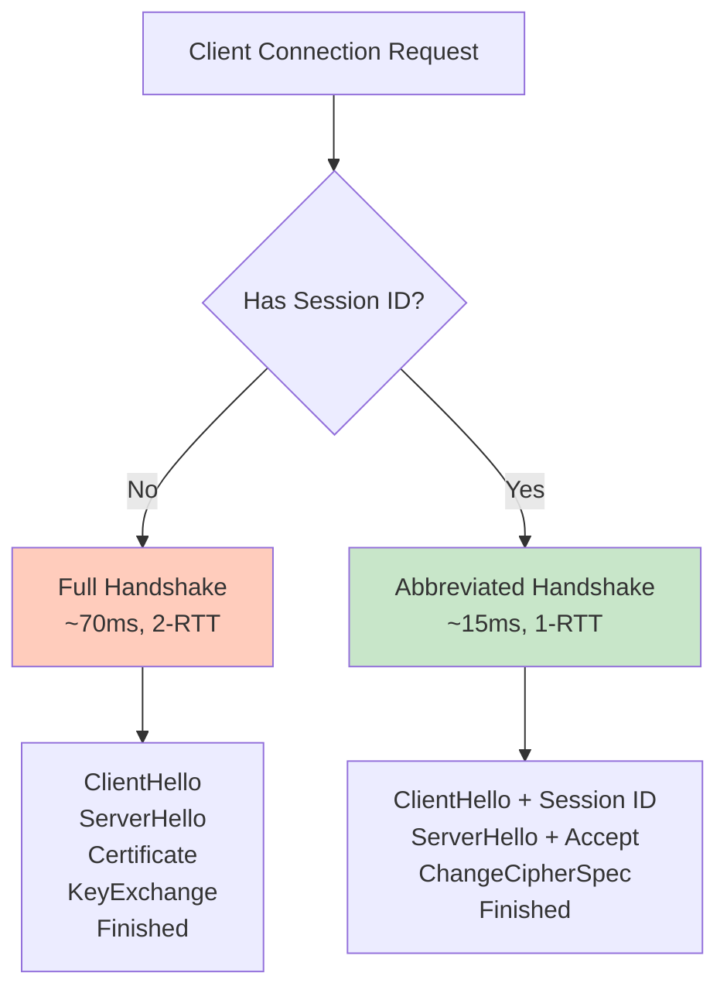
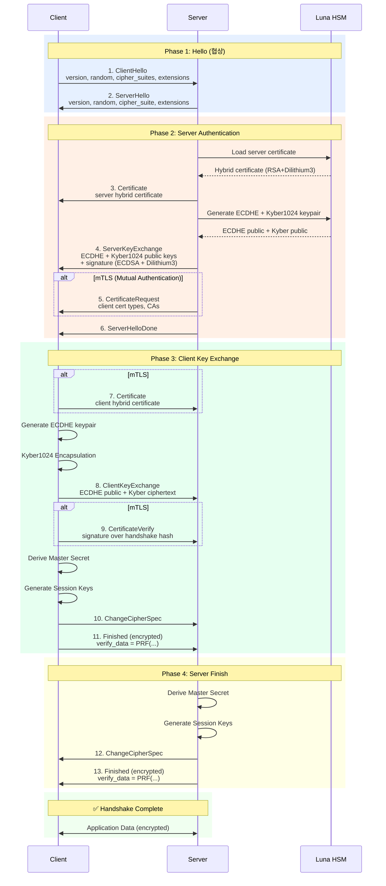
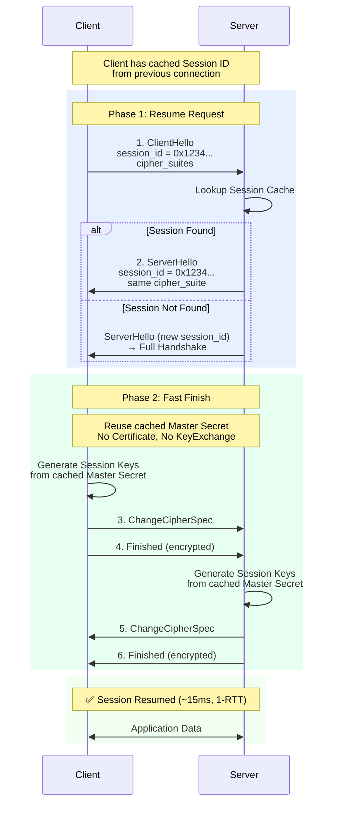
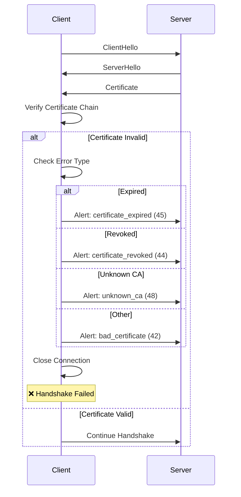

# Q-SSL Handshake Protocol

SSL-PQC Hybrid 핸드셰이크 프로토콜의 상세 설계 및 구현 가이드입니다.

## 목차

- [1. Handshake 개요](#1-handshake-개요)
- [2. Full Handshake](#2-full-handshake)
- [3. Abbreviated Handshake](#3-abbreviated-handshake)
- [4. 메시지별 상세 설명](#4-메시지별-상세-설명)
- [5. 키 유도 과정](#5-키-유도-과정)
- [6. 에러 시나리오](#6-에러-시나리오)
- [7. 구현 예제](#7-구현-예제)

---

## 1. Handshake 개요

### 1.1 Handshake 목적

```yaml
TLS Handshake 목적:

  1. Protocol Version 협상:
     - 클라이언트와 서버가 지원하는 TLS 버전 결정
     - TLS 1.2 또는 TLS 1.3

  2. Cipher Suite 협상:
     - 암호화 알고리즘 선택
     - Q-SSL: Hybrid PQC cipher suites

  3. 인증:
     - 서버 인증 (필수)
     - 클라이언트 인증 (선택)
     - Hybrid 인증서 검증

  4. 키 교환:
     - Pre-Master Secret 생성
     - ECDHE + Kyber1024 hybrid
     - Master Secret 유도

  5. 세션 설정:
     - Session keys 생성
     - 암호화 활성화
```

### 1.2 Handshake 타입



---

## 2. Full Handshake

### 2.1 Full Handshake 흐름



### 2.2 Handshake 메시지 순서

```yaml
Full Handshake Message Flow (TLS 1.2):

  Client → Server:
    1. ClientHello
    7. Certificate (optional, if requested)
    8. ClientKeyExchange
    9. CertificateVerify (optional, if cert sent)
    10. ChangeCipherSpec
    11. Finished

  Server → Client:
    2. ServerHello
    3. Certificate
    4. ServerKeyExchange
    5. CertificateRequest (optional)
    6. ServerHelloDone
    12. ChangeCipherSpec
    13. Finished

  총 메시지 수:
    - 최소 (서버 인증만): 11개 메시지
    - 최대 (상호 인증): 13개 메시지

  RTT (Round-Trip Time):
    - 2-RTT: Full handshake
    - 추가 암호화 연산: ~70ms (PQC hybrid)
```

---

## 3. Abbreviated Handshake

### 3.1 Session Resumption



### 3.2 성능 비교

```yaml
Handshake 성능 비교:

  Full Handshake (Q-SSL Hybrid):
    - RTT: 2-RTT
    - 시간: ~70ms
    - 메시지: 11~13개
    - CPU: 중간 (PQC 연산)
    - 대역폭: ~18KB (Kyber + Dilithium)

  Abbreviated Handshake (Session Resumption):
    - RTT: 1-RTT
    - 시간: ~15ms
    - 메시지: 6개
    - CPU: 낮음 (대칭키만)
    - 대역폭: ~2KB

  성능 향상:
    - 시간: 4.7배 빠름
    - 메시지: 54% 감소
    - 대역폭: 89% 감소
    - CPU: 70% 감소
```

---

## 4. 메시지별 상세 설명

### 4.1 ClientHello

```python
# ClientHello 메시지 구조

import struct
import time
import os

def build_client_hello():
    """
    ClientHello 메시지 생성
    """
    # 1. Client Version (TLS 1.2 = 0x0303)
    client_version = struct.pack('!H', 0x0303)

    # 2. Random (32 bytes)
    #    GMT Unix Time (4 bytes) + Random (28 bytes)
    gmt_unix_time = struct.pack('!I', int(time.time()))
    random_bytes = os.urandom(28)
    client_random = gmt_unix_time + random_bytes

    # 3. Session ID (0~32 bytes)
    #    첫 연결: empty (length=0)
    #    재연결: cached session ID (length=32)
    session_id = b''  # 첫 연결
    session_id_length = struct.pack('!B', len(session_id))

    # 4. Cipher Suites (Q-SSL Hybrid)
    cipher_suites = [
        # TLS 1.3 ciphersuites (recommended first)
        0x1302,  # TLS_AES_256_GCM_SHA384
        0x1303,  # TLS_CHACHA20_POLY1305_SHA256

        # TLS 1.2 ciphersuites
        0xC030,  # TLS_ECDHE_RSA_WITH_AES_256_GCM_SHA384
        0xC02C,  # TLS_ECDHE_ECDSA_WITH_AES_256_GCM_SHA384
        0xC02F,  # TLS_ECDHE_RSA_WITH_AES_128_GCM_SHA256

        # Fallback
        0x009F,  # TLS_DHE_RSA_WITH_AES_256_GCM_SHA384
    ]

    cipher_suites_data = b''.join(
        struct.pack('!H', cs) for cs in cipher_suites
    )
    cipher_suites_length = struct.pack('!H', len(cipher_suites_data))

    # 5. Compression Methods
    #    TLS 1.3: must be null
    #    TLS 1.2: null (compression disabled due to CRIME)
    compression_methods = struct.pack('!BB', 1, 0)  # length=1, null=0

    # 6. Extensions
    extensions = build_client_hello_extensions()
    extensions_length = struct.pack('!H', len(extensions))

    # Assemble ClientHello
    body = (
        client_version +
        client_random +
        session_id_length +
        session_id +
        cipher_suites_length +
        cipher_suites_data +
        compression_methods +
        extensions_length +
        extensions
    )

    # Handshake header
    msg_type = struct.pack('!B', 0x01)  # ClientHello
    msg_length = struct.pack('!I', len(body))[1:]  # 24-bit length

    handshake_msg = msg_type + msg_length + body

    return handshake_msg, client_random

def build_client_hello_extensions():
    """ClientHello Extensions (Q-SSL specific)"""
    extensions = b''

    # Extension: server_name (SNI)
    server_name = b'qsign.example.com'
    sni_ext = struct.pack('!HH', 0, len(server_name) + 5)  # type=0, length
    sni_ext += struct.pack('!H', len(server_name) + 3)  # list_length
    sni_ext += struct.pack('!BH', 0, len(server_name))  # name_type=0, length
    sni_ext += server_name
    extensions += sni_ext

    # Extension: supported_groups (Hybrid: Kyber + ECDHE)
    #   0x0200: kyber1024 (experimental code point)
    #   0x001D: x25519
    #   0x0018: secp384r1
    supported_groups = struct.pack(
        '!HHHHHH',
        10,      # extension type
        8,       # extension length
        6,       # list length
        0x0200,  # kyber1024
        0x001D,  # x25519
        0x0018,  # secp384r1
    )
    extensions += supported_groups

    # Extension: signature_algorithms (Hybrid: Dilithium + ECDSA)
    #   0x0800: dilithium3 (experimental)
    #   0x0503: ecdsa_secp384r1_sha384
    #   0x0804: rsa_pss_rsae_sha384
    signature_algorithms = struct.pack(
        '!HHHHHH',
        13,      # extension type
        8,       # extension length
        6,       # list length
        0x0800,  # dilithium3
        0x0503,  # ecdsa_secp384r1_sha384
        0x0804,  # rsa_pss_rsae_sha384
    )
    extensions += signature_algorithms

    # Extension: supported_versions (TLS 1.3, TLS 1.2)
    supported_versions = struct.pack(
        '!HHBHH',
        43,      # extension type
        5,       # extension length
        4,       # list length
        0x0304,  # TLS 1.3
        0x0303,  # TLS 1.2
    )
    extensions += supported_versions

    # Extension: extended_master_secret (RFC 7627)
    #   Prevents MITM attacks on session resumption
    extended_master_secret = struct.pack('!HH', 23, 0)  # type=23, length=0
    extensions += extended_master_secret

    return extensions

# 사용 예시
client_hello, client_random = build_client_hello()
print(f"ClientHello length: {len(client_hello)} bytes")
print(f"Client Random: {client_random.hex()}")
```

### 4.2 ServerHello

```python
# ServerHello 메시지 구조

def build_server_hello(client_random, session_id_or_new):
    """
    ServerHello 메시지 생성

    Args:
        client_random: ClientHello의 random
        session_id_or_new: 재사용할 session ID 또는 새로 생성
    """
    # 1. Server Version
    server_version = struct.pack('!H', 0x0303)  # TLS 1.2

    # 2. Server Random (32 bytes)
    gmt_unix_time = struct.pack('!I', int(time.time()))
    random_bytes = os.urandom(28)
    server_random = gmt_unix_time + random_bytes

    # 3. Session ID
    if session_id_or_new == b'':
        # 새 세션 생성
        import hashlib
        session_id = hashlib.sha256(
            client_random + server_random
        ).digest()[:32]
    else:
        # 기존 세션 재사용
        session_id = session_id_or_new

    session_id_length = struct.pack('!B', len(session_id))

    # 4. Selected Cipher Suite (서버가 선택)
    #    우선순위: TLS 1.3 > TLS 1.2, GCM > CBC, AES-256 > AES-128
    selected_cipher = 0x1302  # TLS_AES_256_GCM_SHA384
    cipher_suite = struct.pack('!H', selected_cipher)

    # 5. Compression Method (null)
    compression_method = struct.pack('!B', 0)

    # 6. Extensions (optional)
    extensions = build_server_hello_extensions()
    if extensions:
        extensions_length = struct.pack('!H', len(extensions))
        extensions_data = extensions_length + extensions
    else:
        extensions_data = b''

    # Assemble ServerHello
    body = (
        server_version +
        server_random +
        session_id_length +
        session_id +
        cipher_suite +
        compression_method +
        extensions_data
    )

    # Handshake header
    msg_type = struct.pack('!B', 0x02)  # ServerHello
    msg_length = struct.pack('!I', len(body))[1:]  # 24-bit

    handshake_msg = msg_type + msg_length + body

    return handshake_msg, server_random, session_id

def build_server_hello_extensions():
    """ServerHello Extensions"""
    extensions = b''

    # Extension: supported_versions (TLS 1.3 only)
    # supported_versions = struct.pack('!HHH', 43, 2, 0x0304)
    # extensions += supported_versions

    # Extension: key_share (TLS 1.3)
    # 서버가 선택한 그룹의 키 공유
    # (여기서는 TLS 1.2 예제이므로 생략)

    return extensions

# 사용 예시
server_hello, server_random, session_id = build_server_hello(
    client_random,
    session_id_or_new=b''  # 새 세션
)
print(f"ServerHello length: {len(server_hello)} bytes")
print(f"Server Random: {server_random.hex()}")
print(f"Session ID: {session_id.hex()}")
```

### 4.3 Certificate

```python
# Certificate 메시지 (Hybrid PQC)

def build_certificate_message(cert_chain):
    """
    Certificate 메시지 생성

    Args:
        cert_chain: 인증서 체인 (리스트, PEM 또는 DER)
                   [leaf_cert, intermediate_cert, root_cert]

    Returns:
        Certificate 메시지
    """
    # Certificates 인코딩
    certificates_data = b''

    for cert in cert_chain:
        # 각 인증서: length (3 bytes) + certificate data
        cert_length = struct.pack('!I', len(cert))[1:]  # 24-bit
        certificates_data += cert_length + cert

    # Total certificates length
    certificates_length = struct.pack('!I', len(certificates_data))[1:]  # 24-bit

    # Certificate message body
    body = certificates_length + certificates_data

    # Handshake header
    msg_type = struct.pack('!B', 0x0B)  # Certificate
    msg_length = struct.pack('!I', len(body))[1:]

    handshake_msg = msg_type + msg_length + body

    return handshake_msg

# 사용 예시 (가정: hybrid 인증서)
# Hybrid Certificate = Classical Cert + PQC Signature Extension
leaf_cert = b'\x30\x82...'  # DER-encoded X.509 certificate (with Dilithium3)
intermediate_cert = b'\x30\x82...'
cert_chain = [leaf_cert, intermediate_cert]

# certificate_msg = build_certificate_message(cert_chain)
```

### 4.4 ServerKeyExchange (Hybrid)

```python
# ServerKeyExchange (ECDHE + Kyber1024 Hybrid)

def build_server_key_exchange(
    ecdhe_public_key,
    kyber_public_key,
    signature,
    client_random,
    server_random
):
    """
    ServerKeyExchange 메시지 (Hybrid)

    Args:
        ecdhe_public_key: ECDHE 공개키 (65 bytes for P-384 uncompressed)
        kyber_public_key: Kyber1024 공개키 (1568 bytes)
        signature: Hybrid 서명 (ECDSA + Dilithium3)
        client_random: 32 bytes
        server_random: 32 bytes

    Returns:
        ServerKeyExchange 메시지
    """
    # 1. ECDHE Parameters
    #    Curve Type: named_curve (3)
    #    Named Curve: secp384r1 (24 = 0x0018)
    #    Public Key Length: 65 bytes (uncompressed)
    ecdhe_params = struct.pack(
        '!BBHB',
        3,       # curve_type = named_curve
        0, 24,   # named_curve = secp384r1 (0x0018)
        len(ecdhe_public_key)
    ) + ecdhe_public_key

    # 2. Kyber1024 Public Key (custom extension)
    #    Extension Type: 0x0200 (experimental)
    #    Length: 1568 bytes
    kyber_params = struct.pack('!HH', 0x0200, len(kyber_public_key))
    kyber_params += kyber_public_key

    # 3. 서명할 데이터
    #    client_random + server_random + ecdhe_params + kyber_params
    signed_data = client_random + server_random + ecdhe_params + kyber_params

    # 4. Signature (Hybrid: ECDSA + Dilithium3)
    #    Signature Algorithm: 0x0800 (dilithium3_ecdsa_hybrid)
    #    Signature Length
    #    Signature Data
    sig_algorithm = struct.pack('!H', 0x0800)  # hybrid signature
    sig_length = struct.pack('!H', len(signature))
    sig_data = signature

    # Assemble ServerKeyExchange body
    body = ecdhe_params + kyber_params + sig_algorithm + sig_length + sig_data

    # Handshake header
    msg_type = struct.pack('!B', 0x0C)  # ServerKeyExchange
    msg_length = struct.pack('!I', len(body))[1:]

    handshake_msg = msg_type + msg_length + body

    return handshake_msg

# 서명 생성 (pseudo-code)
def create_hybrid_signature(private_keys, data):
    """
    Hybrid 서명 생성 (ECDSA + Dilithium3)

    Args:
        private_keys: {'ecdsa': ecdsa_key, 'dilithium': dilithium_key}
        data: 서명할 데이터

    Returns:
        Hybrid signature (ECDSA sig || Dilithium sig)
    """
    # ECDSA signature (96 bytes for P-384)
    # ecdsa_sig = sign_ecdsa(private_keys['ecdsa'], data)

    # Dilithium3 signature (~3293 bytes)
    # dilithium_sig = sign_dilithium(private_keys['dilithium'], data)

    # Combine signatures
    # hybrid_sig = ecdsa_sig + dilithium_sig

    # return hybrid_sig
    pass
```

### 4.5 ClientKeyExchange (Hybrid)

```python
# ClientKeyExchange (ECDHE + Kyber1024 Hybrid)

def build_client_key_exchange(
    ecdhe_public_key,
    kyber_ciphertext
):
    """
    ClientKeyExchange 메시지 (Hybrid)

    Args:
        ecdhe_public_key: 클라이언트 ECDHE 공개키 (65 bytes)
        kyber_ciphertext: Kyber1024 암호문 (1568 bytes)

    Returns:
        ClientKeyExchange 메시지
    """
    # 1. ECDHE Public Key
    #    Length (1 byte) + Public Key
    ecdhe_data = struct.pack('!B', len(ecdhe_public_key)) + ecdhe_public_key

    # 2. Kyber Ciphertext (custom extension)
    #    Extension Type: 0x0200
    #    Length: 1568 bytes
    kyber_data = struct.pack('!HH', 0x0200, len(kyber_ciphertext))
    kyber_data += kyber_ciphertext

    # Assemble ClientKeyExchange body
    body = ecdhe_data + kyber_data

    # Handshake header
    msg_type = struct.pack('!B', 0x10)  # ClientKeyExchange
    msg_length = struct.pack('!I', len(body))[1:]

    handshake_msg = msg_type + msg_length + body

    return handshake_msg

# Kyber1024 Encapsulation (pseudo-code)
def kyber_encapsulation(kyber_public_key):
    """
    Kyber1024 KEM Encapsulation

    Args:
        kyber_public_key: 서버의 Kyber 공개키 (1568 bytes)

    Returns:
        (ciphertext, shared_secret)
        ciphertext: 1568 bytes
        shared_secret: 32 bytes
    """
    # import oqs
    # kem = oqs.KeyEncapsulation("Kyber1024")
    # ciphertext, shared_secret = kem.encap_secret(kyber_public_key)
    # return ciphertext, shared_secret
    pass
```

### 4.6 Finished

```python
# Finished 메시지

import hmac
import hashlib

def PRF_SHA384(secret, label, seed, length):
    """TLS 1.2 PRF with SHA-384"""
    def P_hash(secret, seed, length):
        result = b''
        A = seed
        while len(result) < length:
            A = hmac.new(secret, A, hashlib.sha384).digest()
            result += hmac.new(secret, A + seed, hashlib.sha384).digest()
        return result[:length]

    return P_hash(secret, label + seed, length)

def build_finished_message(
    master_secret,
    handshake_messages,
    is_client=True
):
    """
    Finished 메시지 생성

    verify_data = PRF(master_secret, finished_label,
                      Hash(handshake_messages))[0..11]

    Args:
        master_secret: 48 bytes
        handshake_messages: 모든 handshake 메시지 (Finished 제외)
        is_client: Client Finished인지 Server Finished인지

    Returns:
        Finished 메시지
    """
    # 1. Label
    if is_client:
        label = b"client finished"
    else:
        label = b"server finished"

    # 2. Handshake Hash (SHA-384)
    handshake_hash = hashlib.sha384(handshake_messages).digest()

    # 3. PRF
    verify_data = PRF_SHA384(master_secret, label, handshake_hash, 12)

    # 4. Finished message body
    body = verify_data

    # Handshake header
    msg_type = struct.pack('!B', 0x14)  # Finished
    msg_length = struct.pack('!I', len(body))[1:]

    handshake_msg = msg_type + msg_length + body

    return handshake_msg

# 사용 예시
master_secret = b'\x00' * 48
handshake_msgs = b'...'  # ClientHello + ... + ClientKeyExchange

client_finished = build_finished_message(
    master_secret,
    handshake_msgs,
    is_client=True
)

print(f"Client Finished verify_data: {client_finished[4:].hex()}")
```

---

## 5. 키 유도 과정

### 5.1 Pre-Master Secret

```python
# Hybrid Pre-Master Secret 생성

def compute_hybrid_pre_master_secret(
    ecdhe_shared_secret,
    kyber_shared_secret
):
    """
    Hybrid Pre-Master Secret 계산

    Args:
        ecdhe_shared_secret: ECDHE 공유 비밀 (48 bytes for P-384)
        kyber_shared_secret: Kyber1024 공유 비밀 (32 bytes)

    Returns:
        pre_master_secret: 48 bytes
    """
    # Concatenate secrets
    combined = ecdhe_shared_secret + kyber_shared_secret

    # Hash to fixed 48 bytes (TLS 1.2 standard)
    import hashlib
    pre_master = hashlib.sha384(combined).digest()[:48]

    return pre_master

# 예시
ecdhe_secret = b'\x01' * 48
kyber_secret = b'\x02' * 32

pms = compute_hybrid_pre_master_secret(ecdhe_secret, kyber_secret)
print(f"Pre-Master Secret: {pms.hex()}")
```

### 5.2 Master Secret

```python
# Master Secret 생성

def compute_master_secret(
    pre_master_secret,
    client_random,
    server_random
):
    """
    Master Secret 계산

    master_secret = PRF(pre_master_secret, "master secret",
                        ClientHello.random + ServerHello.random)[0..47]

    Args:
        pre_master_secret: 48 bytes
        client_random: 32 bytes
        server_random: 32 bytes

    Returns:
        master_secret: 48 bytes
    """
    label = b"master secret"
    seed = client_random + server_random

    master_secret = PRF_SHA384(pre_master_secret, label, seed, 48)

    return master_secret

# 예시
ms = compute_master_secret(pms, client_random, server_random)
print(f"Master Secret: {ms.hex()}")
```

### 5.3 Session Keys

```python
# Session Keys 생성

def compute_session_keys(
    master_secret,
    client_random,
    server_random,
    cipher_suite
):
    """
    Session Keys 계산

    key_block = PRF(master_secret, "key expansion",
                    ServerHello.random + ClientHello.random)

    Args:
        master_secret: 48 bytes
        client_random: 32 bytes
        server_random: 32 bytes
        cipher_suite: 선택된 cipher suite

    Returns:
        Dictionary of session keys
    """
    label = b"key expansion"
    seed = server_random + client_random  # 주의: server가 먼저

    # Cipher suite에 따른 키 길이 결정
    # 예: TLS_AES_256_GCM_SHA384
    if cipher_suite in [0x1302, 0xC030, 0xC02C]:  # AES-256-GCM
        mac_key_length = 0   # GCM은 AEAD, MAC key 불필요
        enc_key_length = 32  # AES-256
        iv_length = 4        # GCM implicit nonce
    elif cipher_suite in [0x1301, 0xC02F]:  # AES-128-GCM
        mac_key_length = 0
        enc_key_length = 16  # AES-128
        iv_length = 4
    else:
        raise ValueError(f"Unsupported cipher suite: {cipher_suite}")

    # 필요한 키 material 길이
    key_material_length = 2 * (mac_key_length + enc_key_length + iv_length)

    # PRF로 key block 생성
    key_block = PRF_SHA384(master_secret, label, seed, key_material_length)

    # Key block 분할
    offset = 0
    keys = {}

    # TLS 1.2 with AEAD (GCM): MAC key 없음
    keys['client_write_enc_key'] = key_block[offset:offset + enc_key_length]
    offset += enc_key_length

    keys['server_write_enc_key'] = key_block[offset:offset + enc_key_length]
    offset += enc_key_length

    keys['client_write_iv'] = key_block[offset:offset + iv_length]
    offset += iv_length

    keys['server_write_iv'] = key_block[offset:offset + iv_length]

    return keys

# 예시
keys = compute_session_keys(ms, client_random, server_random, 0x1302)
print(f"Client Write Key: {keys['client_write_enc_key'].hex()}")
print(f"Server Write Key: {keys['server_write_enc_key'].hex()}")
```

---

## 6. 에러 시나리오

### 6.1 인증서 검증 실패



### 6.2 Cipher Suite 협상 실패

```yaml
Cipher Suite 협상 실패 시나리오:

  문제:
    - 클라이언트와 서버의 cipher suite 목록이 겹치지 않음
    - 서버가 클라이언트의 모든 cipher suite를 거부

  서버 동작:
    1. ClientHello 수신
    2. Cipher suite 목록 확인
    3. 지원하는 cipher suite 없음
    4. Alert 전송: handshake_failure (40)
    5. 연결 종료

  클라이언트 대응:
    - Alert 수신: handshake_failure
    - 로그 기록
    - 사용자에게 에러 표시
    - (옵션) Fallback cipher 시도 (주의: downgrade 공격)
```

### 6.3 Finished 검증 실패

```python
# Finished 메시지 검증

def verify_finished_message(
    received_finished,
    expected_verify_data
):
    """
    Finished 메시지 검증

    Args:
        received_finished: 수신한 Finished 메시지
        expected_verify_data: 계산된 verify_data (12 bytes)

    Returns:
        True if valid, False otherwise
    """
    # Finished 메시지 파싱
    if len(received_finished) < 4:
        return False

    msg_type = received_finished[0]
    if msg_type != 0x14:  # Finished
        return False

    msg_length = int.from_bytes(received_finished[1:4], 'big')
    verify_data = received_finished[4:4 + msg_length]

    # Constant-time comparison (timing attack 방지)
    if len(verify_data) != len(expected_verify_data):
        return False

    result = 0
    for a, b in zip(verify_data, expected_verify_data):
        result |= a ^ b

    if result != 0:
        # Verification failed
        # Send Alert: decrypt_error (51)
        return False

    return True

# 사용 예시
# is_valid = verify_finished_message(received_msg, expected_verify)
# if not is_valid:
#     send_alert(AlertLevel.FATAL, AlertDescription.DECRYPT_ERROR)
#     close_connection()
```

---

## 7. 구현 예제

### 7.1 OpenSSL 기반 Q-SSL 서버

```bash
#!/bin/bash
# Q-SSL Server (OpenSSL + OQS)

# OpenSSL 설정
export OPENSSL_CONF=/etc/ssl/openssl-qssl.cnf

# OQS Provider 로드 확인
openssl list -providers

# Q-SSL 서버 실행
openssl s_server \
  -accept 8443 \
  -cert /etc/ssl/certs/qssl-server-hybrid.crt \
  -key /etc/ssl/private/qssl-server-hybrid.key \
  -CAfile /etc/ssl/certs/qssl-ca-bundle.crt \
  -tls1_3 \
  -ciphersuites "TLS_AES_256_GCM_SHA384:TLS_CHACHA20_POLY1305_SHA256" \
  -groups "kyber1024:x25519:prime256v1" \
  -sigalgs "dilithium3:ecdsa_secp384r1_sha384:rsa_pss_rsae_sha384" \
  -verify 1 \
  -Verify 1 \
  -state \
  -msg \
  -debug

# 옵션 설명:
# -accept 8443: 포트 8443 리스닝
# -cert: 하이브리드 PQC 인증서
# -key: 하이브리드 개인키
# -CAfile: CA 인증서 번들
# -tls1_3: TLS 1.3 사용
# -ciphersuites: TLS 1.3 cipher suites
# -groups: 키 교환 그룹 (Kyber1024 우선)
# -sigalgs: 서명 알고리즘 (Dilithium3 우선)
# -verify 1: 클라이언트 인증 요청 (optional)
# -state: 핸드셰이크 상태 출력
# -msg: 프로토콜 메시지 출력
# -debug: 디버그 정보 출력
```

### 7.2 Q-SSL 클라이언트

```bash
#!/bin/bash
# Q-SSL Client (OpenSSL + OQS)

# Q-SSL 연결
openssl s_client \
  -connect localhost:8443 \
  -CAfile /etc/ssl/certs/qssl-ca-bundle.crt \
  -cert /etc/ssl/certs/qssl-client-hybrid.crt \
  -key /etc/ssl/private/qssl-client-hybrid.key \
  -tls1_3 \
  -ciphersuites "TLS_AES_256_GCM_SHA384" \
  -groups "kyber1024:x25519" \
  -sigalgs "dilithium3:ecdsa_secp384r1_sha384" \
  -state \
  -msg \
  -showcerts

# 연결 후 HTTP 요청
echo -e "GET / HTTP/1.1\r\nHost: localhost\r\n\r\n"

# Handshake 정보 확인
openssl s_client -connect localhost:8443 \
  -CAfile /etc/ssl/certs/qssl-ca-bundle.crt \
  2>&1 | grep -E "(Protocol|Cipher|Peer signature|Server Temp Key)"

# 출력 예시:
# Protocol  : TLSv1.3
# Cipher    : TLS_AES_256_GCM_SHA384
# Server Temp Key: ECDHE, kyber1024, 1568 bits
# Peer signature type: dilithium3
```

### 7.3 Python Q-SSL 클라이언트

```python
# Python Q-SSL Client (OpenSSL + OQS)

import ssl
import socket

def create_qssl_context():
    """Q-SSL Context 생성"""
    context = ssl.SSLContext(ssl.PROTOCOL_TLS_CLIENT)

    # 인증서 검증
    context.check_hostname = True
    context.verify_mode = ssl.CERT_REQUIRED
    context.load_verify_locations('/etc/ssl/certs/qssl-ca-bundle.crt')

    # 클라이언트 인증서 (mTLS)
    context.load_cert_chain(
        '/etc/ssl/certs/qssl-client-hybrid.crt',
        '/etc/ssl/private/qssl-client-hybrid.key'
    )

    # Cipher suites (OpenSSL 문자열)
    context.set_ciphers('TLS_AES_256_GCM_SHA384:TLS_CHACHA20_POLY1305_SHA256')

    # TLS 1.3 최소 버전
    context.minimum_version = ssl.TLSVersion.TLSv1_3

    # ALPN (Application-Layer Protocol Negotiation)
    context.set_alpn_protocols(['http/1.1', 'h2'])

    return context

def qssl_connect(host, port=8443):
    """Q-SSL 연결"""
    context = create_qssl_context()

    # 소켓 생성
    sock = socket.socket(socket.AF_INET, socket.SOCK_STREAM)

    # Q-SSL 래핑
    with context.wrap_socket(sock, server_hostname=host) as ssock:
        ssock.connect((host, port))

        print(f"✅ Connected to {host}:{port}")
        print(f"Protocol: {ssock.version()}")
        print(f"Cipher: {ssock.cipher()}")

        # Peer 인증서 정보
        cert = ssock.getpeercert()
        print(f"Peer Certificate Subject: {cert['subject']}")

        # HTTP 요청
        request = f"GET / HTTP/1.1\r\nHost: {host}\r\n\r\n"
        ssock.sendall(request.encode())

        # 응답 수신
        response = ssock.recv(4096)
        print(f"\nResponse:\n{response.decode()}")

# 사용 예시
# qssl_connect('localhost', 8443)
```

---

## 요약

### Q-SSL Handshake 핵심 사항

1. **Full Handshake**: 2-RTT, 11~13 메시지, ~70ms (Hybrid PQC)
2. **Abbreviated Handshake**: 1-RTT, 6 메시지, ~15ms (Session Resumption)
3. **Hybrid 키 교환**: ECDHE P-384 + Kyber1024 → Pre-Master Secret
4. **Hybrid 서명**: ECDSA P-384 + Dilithium3 → 인증서 검증
5. **키 유도**: Pre-Master → Master Secret → Session Keys (PRF-SHA384)

### 다음 단계

- [CIPHER-SUITES.md](./CIPHER-SUITES.md) - Cipher Suite 설정 및 최적화
- [SEQUENCE-DIAGRAMS.md](./SEQUENCE-DIAGRAMS.md) - 상세 시퀀스 다이어그램
- [IMPLEMENTATION-GUIDE.md](./IMPLEMENTATION-GUIDE.md) - 구현 가이드

---

**Last Updated**: 2025-11-16
**Version**: 1.0.0
**Security Level**: FIPS 140-2 Level 3
