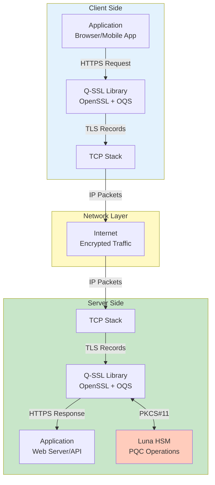
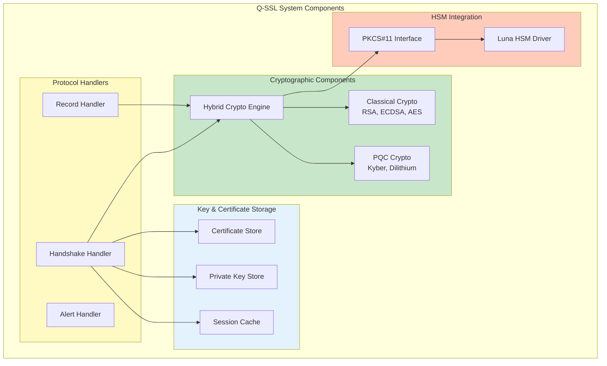
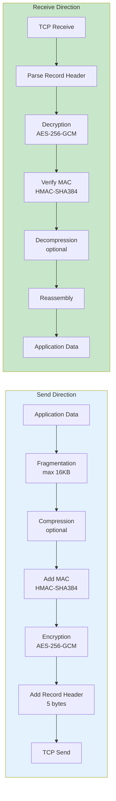
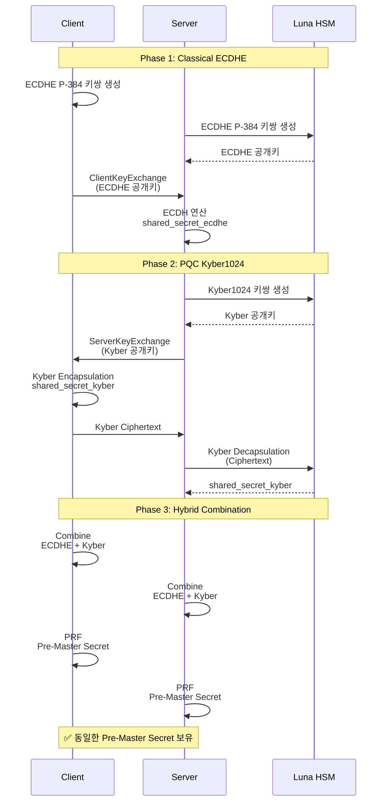
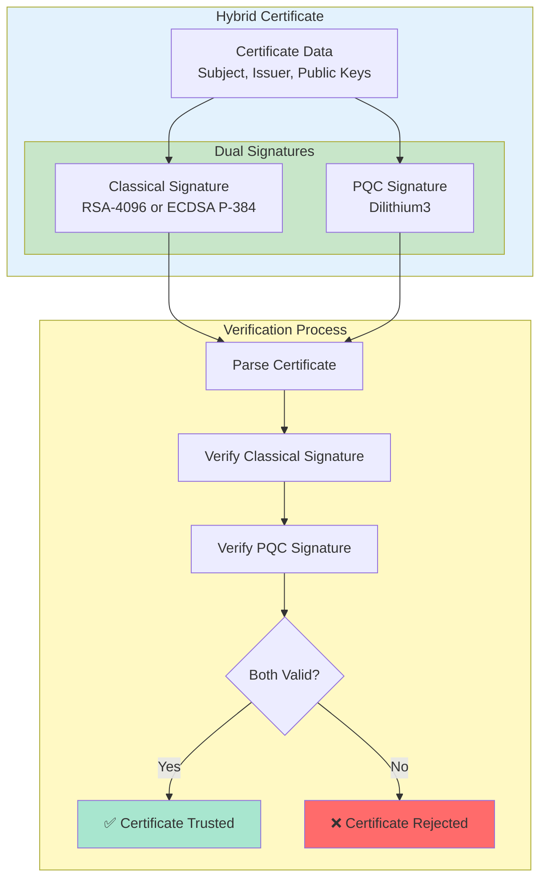
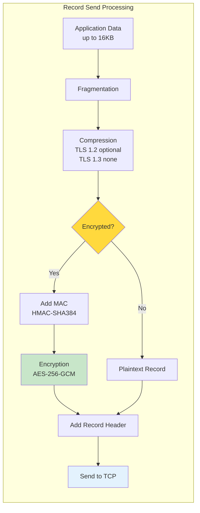
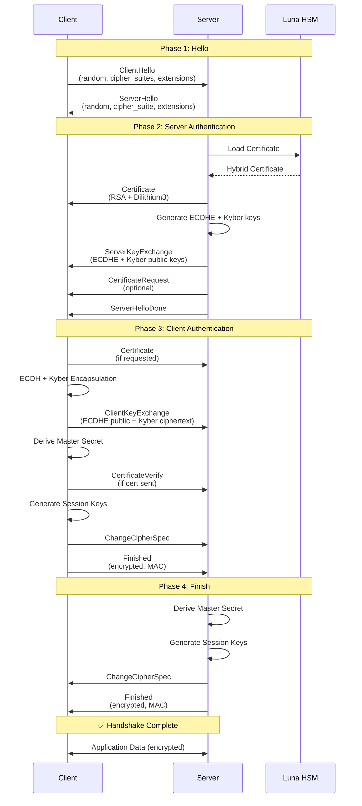
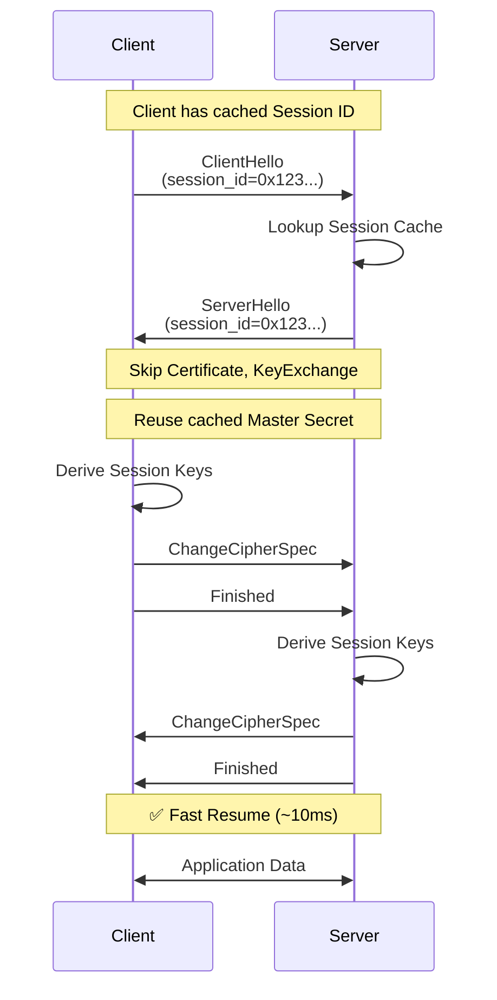

# Q-SSL 아키텍처 (Q-SSL Architecture)

Q-SSL의 전체 아키텍처, 프로토콜 스택, 하이브리드 암호화 설계에 대한 상세 문서입니다.

## 목차

- [1. 전체 아키텍처 개요](#1-전체-아키텍처-개요)
- [2. SSL/TLS 프로토콜 스택](#2-ssltls-프로토콜-스택)
- [3. 하이브리드 암호화 모델](#3-하이브리드-암호화-모델)
- [4. 키 교환 메커니즘](#4-키-교환-메커니즘)
- [5. 서명 알고리즘](#5-서명-알고리즘)
- [6. Record Layer 구조](#6-record-layer-구조)
- [7. Handshake Layer 구조](#7-handshake-layer-구조)

---

## 1. 전체 아키텍처 개요

### 1.1 Q-SSL 시스템 아키텍처



### 1.2 레이어별 책임

```yaml
Q-SSL 아키텍처 레이어:

  Application Layer:
    - HTTP/HTTPS, gRPC, WebSocket 등
    - 애플리케이션 프로토콜
    - 비즈니스 로직
    - Q-SSL API 호출

  Q-SSL Layer:
    - Handshake Protocol: 연결 설정, 알고리즘 협상
    - Record Protocol: 데이터 암호화, MAC
    - ChangeCipherSpec: 암호화 전환
    - Alert Protocol: 에러 및 경고

  Transport Layer:
    - TCP: 신뢰성 있는 스트림 전송
    - Flow control, Congestion control
    - Retransmission

  Network Layer:
    - IP: 라우팅 및 패킷 전송
    - IPv4/IPv6 지원
```

### 1.3 컴포넌트 다이어그램



---

## 2. SSL/TLS 프로토콜 스택

### 2.1 프로토콜 스택 구조

```mermaid
graph TB
    subgraph STACK["Q-SSL Protocol Stack"]
        direction TB

        APP[Application Data<br/>HTTP, SMTP, FTP, etc.]

        subgraph SSL_LAYER["SSL/TLS Layer"]
            direction LR
            HAND[Handshake<br/>Protocol]
            CHANGE[ChangeCipherSpec<br/>Protocol]
            ALERT[Alert<br/>Protocol]
            APP_PROTO[Application Data<br/>Protocol]
        end

        RECORD[Record Layer<br/>Fragmentation, Compression, Encryption, MAC]

        TCP[TCP Layer<br/>Port 443 (HTTPS)]

        IP[IP Layer<br/>IPv4/IPv6]
    end

    APP --> HAND
    APP --> CHANGE
    APP --> ALERT
    APP --> APP_PROTO

    HAND --> RECORD
    CHANGE --> RECORD
    ALERT --> RECORD
    APP_PROTO --> RECORD

    RECORD --> TCP
    TCP --> IP

    style APP fill:#e3f2fd
    style SSL_LAYER fill:#c8e6c9
    style RECORD fill:#fff9c4
    style TCP fill:#ffccbc
    style IP fill:#d1c4e9
```

### 2.2 각 프로토콜의 역할

#### 2.2.1 Handshake Protocol

```yaml
Handshake Protocol:
  목적:
    - 클라이언트와 서버 간 암호화 파라미터 협상
    - 상호 인증 (서버 필수, 클라이언트 선택)
    - Pre-master secret 교환
    - Session key 생성

  메시지 타입:
    - ClientHello (0x01)
    - ServerHello (0x02)
    - Certificate (0x0B)
    - ServerKeyExchange (0x0C)
    - CertificateRequest (0x0D)
    - ServerHelloDone (0x0E)
    - CertificateVerify (0x0F)
    - ClientKeyExchange (0x10)
    - Finished (0x14)

  프로토콜 번호: 0x16 (22)
```

#### 2.2.2 Record Protocol

```yaml
Record Protocol:
  목적:
    - 상위 계층 데이터 전송
    - Fragmentation (최대 16KB)
    - Compression (선택, 보통 비활성화)
    - MAC (Message Authentication Code)
    - Encryption (대칭 암호화)

  Record 구조:
    - Content Type (1 byte)
    - Protocol Version (2 bytes): 0x0303 (TLS 1.2), 0x0304 (TLS 1.3)
    - Length (2 bytes): 0~16384
    - Payload (variable)
    - MAC (variable): HMAC-SHA256/384

  프로토콜 번호: varies by content type
```

#### 2.2.3 ChangeCipherSpec Protocol

```yaml
ChangeCipherSpec Protocol:
  목적:
    - 암호화 상태 전환 신호
    - Pending state → Current state

  메시지:
    - ChangeCipherSpec (0x01)
    - 1 byte 메시지

  프로토콜 번호: 0x14 (20)

  참고:
    - TLS 1.3에서는 deprecated
    - TLS 1.2 이하에서만 사용
```

#### 2.2.4 Alert Protocol

```yaml
Alert Protocol:
  목적:
    - 에러 및 경고 메시지 전송
    - 연결 종료 신호

  Alert 레벨:
    - Warning (0x01): 경고
    - Fatal (0x02): 치명적 에러, 연결 즉시 종료

  주요 Alert 타입:
    - close_notify (0): 정상 종료
    - unexpected_message (10): 예기치 않은 메시지
    - bad_record_mac (20): MAC 검증 실패
    - handshake_failure (40): 핸드셰이크 실패
    - certificate_unknown (46): 인증서 문제
    - decrypt_error (51): 복호화 실패

  프로토콜 번호: 0x15 (21)
```

### 2.3 Record Layer 처리 흐름



---

## 3. 하이브리드 암호화 모델

### 3.1 Hybrid Cryptography 개념

```mermaid
graph TB
    subgraph HYBRID["Hybrid Cryptography Model"]
        direction LR

        subgraph INPUT["Input"]
            I1[Client Random]
            I2[Server Random]
            I3[ECDHE Shared Secret]
            I4[Kyber Shared Secret]
        end

        subgraph PROCESS["Key Derivation"]
            P1[Combine Secrets<br/>ECDHE || Kyber]
            P2[PRF-SHA384<br/>Pre-Master Secret]
            P3[PRF-SHA384<br/>Master Secret]
            P4[Key Expansion<br/>Session Keys]
        end

        subgraph OUTPUT["Output"]
            O1[Client Write MAC Key]
            O2[Server Write MAC Key]
            O3[Client Write Encryption Key]
            O4[Server Write Encryption Key]
            O5[Client Write IV]
            O6[Server Write IV]
        end
    end

    I3 --> P1
    I4 --> P1
    P1 --> P2
    I1 --> P3
    I2 --> P3
    P2 --> P3
    P3 --> P4
    P4 --> O1
    P4 --> O2
    P4 --> O3
    P4 --> O4
    P4 --> O5
    P4 --> O6

    style INPUT fill:#e3f2fd
    style PROCESS fill:#fff9c4
    style OUTPUT fill:#c8e6c9
```

### 3.2 Pre-Master Secret 생성

```python
# Hybrid Pre-Master Secret 생성 (Python pseudo-code)

from cryptography.hazmat.primitives import hashes
from cryptography.hazmat.primitives.kdf.pbkdf2 import PBKDF2HMAC
import hashlib

def hybrid_pre_master_secret(ecdhe_secret, kyber_secret):
    """
    Hybrid Pre-Master Secret 생성

    Args:
        ecdhe_secret: ECDHE 공유 비밀 (48 bytes for P-384)
        kyber_secret: Kyber1024 공유 비밀 (32 bytes)

    Returns:
        pre_master_secret: 48 bytes
    """
    # 1. Concatenate ECDHE and Kyber secrets
    combined = ecdhe_secret + kyber_secret

    # 2. Hash to fixed 48 bytes (TLS 1.2 standard)
    pre_master = hashlib.sha384(combined).digest()[:48]

    return pre_master

# 예시
ecdhe_secret = b'\x01' * 48  # ECDHE P-384 shared secret
kyber_secret = b'\x02' * 32  # Kyber1024 shared secret

pms = hybrid_pre_master_secret(ecdhe_secret, kyber_secret)
print(f"Pre-Master Secret: {pms.hex()}")
```

### 3.3 Master Secret 생성 (TLS 1.2 PRF)

```python
import hmac
import hashlib

def PRF_TLS12(secret, label, seed, output_length):
    """
    TLS 1.2 Pseudo-Random Function (PRF)

    PRF(secret, label, seed) = P_SHA256(secret, label + seed)
    """
    def P_hash(secret, seed, output_length, hash_func=hashlib.sha384):
        result = b''
        A = seed  # A(0) = seed

        while len(result) < output_length:
            A = hmac.new(secret, A, hash_func).digest()  # A(i) = HMAC(secret, A(i-1))
            result += hmac.new(secret, A + seed, hash_func).digest()

        return result[:output_length]

    return P_hash(secret, label + seed, output_length)

def master_secret(pre_master_secret, client_random, server_random):
    """
    Master Secret 생성

    master_secret = PRF(pre_master_secret,
                        "master secret",
                        client_random + server_random)[0..47]
    """
    label = b"master secret"
    seed = client_random + server_random

    return PRF_TLS12(pre_master_secret, label, seed, 48)

# 예시
pre_master = b'\x00' * 48
client_rand = b'\x01' * 32
server_rand = b'\x02' * 32

ms = master_secret(pre_master, client_rand, server_rand)
print(f"Master Secret: {ms.hex()}")
```

### 3.4 Session Key 생성

```python
def key_expansion(master_secret, client_random, server_random, cipher_suite):
    """
    Session Keys 생성

    key_block = PRF(master_secret,
                    "key expansion",
                    server_random + client_random)
    """
    label = b"key expansion"
    seed = server_random + client_random

    # Cipher suite에 따라 필요한 키 길이 계산
    # 예: AES-256-GCM-SHA384
    mac_key_length = 0  # GCM은 AEAD, MAC key 불필요
    enc_key_length = 32  # AES-256
    iv_length = 4  # GCM implicit nonce

    key_material_length = 2 * (mac_key_length + enc_key_length + iv_length)

    key_block = PRF_TLS12(master_secret, label, seed, key_material_length)

    # Key block 분할
    offset = 0

    # TLS 1.2 with AEAD (GCM)
    client_write_key = key_block[offset:offset + enc_key_length]
    offset += enc_key_length

    server_write_key = key_block[offset:offset + enc_key_length]
    offset += enc_key_length

    client_write_iv = key_block[offset:offset + iv_length]
    offset += iv_length

    server_write_iv = key_block[offset:offset + iv_length]

    return {
        'client_write_key': client_write_key,
        'server_write_key': server_write_key,
        'client_write_iv': client_write_iv,
        'server_write_iv': server_write_iv
    }

# 예시
keys = key_expansion(ms, client_rand, server_rand, 'AES-256-GCM-SHA384')
print(f"Client Write Key: {keys['client_write_key'].hex()}")
print(f"Server Write Key: {keys['server_write_key'].hex()}")
```

---

## 4. 키 교환 메커니즘

### 4.1 Hybrid Key Exchange 아키텍처



### 4.2 ECDHE 키 교환 (Classical)

```python
# ECDHE P-384 키 교환

from cryptography.hazmat.primitives.asymmetric import ec
from cryptography.hazmat.backends import default_backend

# Client side
client_private_key = ec.generate_private_key(ec.SECP384R1(), default_backend())
client_public_key = client_private_key.public_key()

# Server side
server_private_key = ec.generate_private_key(ec.SECP384R1(), default_backend())
server_public_key = server_private_key.public_key()

# Key exchange
# Client computes shared secret
from cryptography.hazmat.primitives.asymmetric import ec
client_shared_secret = client_private_key.exchange(ec.ECDH(), server_public_key)

# Server computes shared secret
server_shared_secret = server_private_key.exchange(ec.ECDH(), client_public_key)

# Verify
assert client_shared_secret == server_shared_secret

print(f"ECDHE Shared Secret: {client_shared_secret.hex()}")
print(f"Length: {len(client_shared_secret)} bytes")  # 48 bytes for P-384
```

### 4.3 Kyber1024 KEM (Post-Quantum)

```python
# Kyber1024 Key Encapsulation Mechanism (KEM)
# Using liboqs (Open Quantum Safe)

try:
    import oqs
except ImportError:
    print("liboqs not available, using pseudo-code")
    oqs = None

if oqs:
    # Server side: Key generation
    kem_server = oqs.KeyEncapsulation("Kyber1024")
    server_public_key = kem_server.generate_keypair()

    # Server sends public key to client
    # ...

    # Client side: Encapsulation
    kem_client = oqs.KeyEncapsulation("Kyber1024")
    ciphertext, client_shared_secret = kem_client.encap_secret(server_public_key)

    # Client sends ciphertext to server
    # ...

    # Server side: Decapsulation
    server_shared_secret = kem_server.decap_secret(ciphertext)

    # Verify
    assert client_shared_secret == server_shared_secret

    print(f"Kyber1024 Shared Secret: {client_shared_secret.hex()}")
    print(f"Ciphertext length: {len(ciphertext)} bytes")  # ~1568 bytes
    print(f"Shared secret length: {len(client_shared_secret)} bytes")  # 32 bytes
```

### 4.4 Kyber1024 알고리즘 파라미터

```yaml
Kyber1024 Parameters:
  보안 수준: NIST Level 5 (AES-256 equivalent)

  키 크기:
    공개키 (Public Key): 1,568 bytes
    비밀키 (Private Key): 3,168 bytes
    암호문 (Ciphertext): 1,568 bytes
    공유 비밀 (Shared Secret): 32 bytes

  성능 (AMD EPYC 7742):
    키 생성: ~50,000 ops/sec
    Encapsulation: ~40,000 ops/sec
    Decapsulation: ~30,000 ops/sec

  보안 가정:
    - Module-LWE (Learning With Errors) 문제
    - 격자 기반 암호 (Lattice-based)
    - 양자 알고리즘에 안전
```

---

## 5. 서명 알고리즘

### 5.1 Hybrid Signature 아키텍처



### 5.2 ECDSA P-384 서명 (Classical)

```python
# ECDSA P-384 서명 및 검증

from cryptography.hazmat.primitives.asymmetric import ec
from cryptography.hazmat.primitives import hashes
from cryptography.hazmat.backends import default_backend

# 키 생성
private_key = ec.generate_private_key(ec.SECP384R1(), default_backend())
public_key = private_key.public_key()

# 서명 생성
message = b"Certificate data to be signed"
signature = private_key.sign(
    message,
    ec.ECDSA(hashes.SHA384())
)

print(f"ECDSA P-384 Signature: {signature.hex()}")
print(f"Signature length: {len(signature)} bytes")  # ~96 bytes

# 서명 검증
try:
    public_key.verify(
        signature,
        message,
        ec.ECDSA(hashes.SHA384())
    )
    print("✅ ECDSA signature verified")
except Exception as e:
    print(f"❌ ECDSA signature verification failed: {e}")
```

### 5.3 Dilithium3 서명 (Post-Quantum)

```python
# Dilithium3 서명 및 검증
# Using liboqs

try:
    import oqs
except ImportError:
    print("liboqs not available, using pseudo-code")
    oqs = None

if oqs:
    # 키 생성
    sig = oqs.Signature("Dilithium3")
    public_key = sig.generate_keypair()

    # 서명 생성
    message = b"Certificate data to be signed"
    signature = sig.sign(message)

    print(f"Dilithium3 Signature: {signature.hex()[:100]}...")
    print(f"Signature length: {len(signature)} bytes")  # ~3,293 bytes

    # 서명 검증
    sig_verify = oqs.Signature("Dilithium3", public_key)
    is_valid = sig_verify.verify(message, signature, public_key)

    if is_valid:
        print("✅ Dilithium3 signature verified")
    else:
        print("❌ Dilithium3 signature verification failed")
```

### 5.4 Dilithium3 알고리즘 파라미터

```yaml
Dilithium3 Parameters:
  보안 수준: NIST Level 3 (AES-192 equivalent)

  키 크기:
    공개키 (Public Key): 1,952 bytes
    비밀키 (Private Key): 4,000 bytes
    서명 (Signature): ~3,293 bytes (평균)

  성능 (AMD EPYC 7742):
    키 생성: ~20,000 ops/sec
    서명: ~10,000 ops/sec
    검증: ~25,000 ops/sec

  보안 가정:
    - Module-LWE (Learning With Errors) 문제
    - Fiat-Shamir with aborts
    - 격자 기반 서명
    - 양자 알고리즘에 안전

  장점:
    - 상대적으로 작은 키 크기
    - 빠른 검증 속도
    - 결정적(deterministic) 서명 가능
```

### 5.5 Hybrid Signature 구현

```python
# Hybrid Signature 생성 및 검증

class HybridSignature:
    def __init__(self):
        # Classical ECDSA
        self.ecdsa_private = ec.generate_private_key(ec.SECP384R1())
        self.ecdsa_public = self.ecdsa_private.public_key()

        # PQC Dilithium3
        if oqs:
            self.dilithium = oqs.Signature("Dilithium3")
            self.dilithium_public = self.dilithium.generate_keypair()

    def sign(self, message):
        """Hybrid 서명 생성"""
        # 1. ECDSA 서명
        ecdsa_sig = self.ecdsa_private.sign(
            message,
            ec.ECDSA(hashes.SHA384())
        )

        # 2. Dilithium3 서명
        dilithium_sig = b''
        if oqs:
            dilithium_sig = self.dilithium.sign(message)

        # 3. 서명 결합 (간단한 concatenation)
        # 실제로는 ASN.1 구조 사용
        hybrid_sig = {
            'ecdsa': ecdsa_sig,
            'dilithium': dilithium_sig
        }

        return hybrid_sig

    def verify(self, message, hybrid_sig, ecdsa_pub, dilithium_pub):
        """Hybrid 서명 검증"""
        try:
            # 1. ECDSA 검증
            ecdsa_pub.verify(
                hybrid_sig['ecdsa'],
                message,
                ec.ECDSA(hashes.SHA384())
            )
            ecdsa_valid = True
        except:
            ecdsa_valid = False

        # 2. Dilithium3 검증
        dilithium_valid = False
        if oqs and dilithium_pub:
            verifier = oqs.Signature("Dilithium3", dilithium_pub)
            dilithium_valid = verifier.verify(
                message,
                hybrid_sig['dilithium'],
                dilithium_pub
            )

        # 3. 둘 다 유효해야 함 (AND 조건)
        return ecdsa_valid and dilithium_valid

# 사용 예시
signer = HybridSignature()
message = b"Certificate data"
signature = signer.sign(message)

is_valid = signer.verify(
    message,
    signature,
    signer.ecdsa_public,
    signer.dilithium_public if oqs else None
)

print(f"Hybrid signature valid: {is_valid}")
```

---

## 6. Record Layer 구조

### 6.1 Record 포맷

```yaml
TLS Record Structure:

  Record Header (5 bytes):
    - Content Type (1 byte):
        0x14 (20): ChangeCipherSpec
        0x15 (21): Alert
        0x16 (22): Handshake
        0x17 (23): Application Data

    - Protocol Version (2 bytes):
        0x0301: TLS 1.0
        0x0302: TLS 1.1
        0x0303: TLS 1.2
        0x0304: TLS 1.3

    - Length (2 bytes):
        0x0000 ~ 0x4000 (0 ~ 16384 bytes)

  Record Payload (variable):
    - Plaintext: 최대 16384 bytes
    - Ciphertext: Plaintext + MAC + Padding
```

### 6.2 Record 처리 흐름



### 6.3 AES-256-GCM 암호화

```python
# AES-256-GCM 암호화 (AEAD)

from cryptography.hazmat.primitives.ciphers.aead import AESGCM
import os

class RecordEncryption:
    def __init__(self, key):
        """
        Args:
            key: 32 bytes AES-256 key
        """
        self.cipher = AESGCM(key)
        self.sequence_number = 0

    def encrypt_record(self, plaintext, content_type, version):
        """
        TLS Record 암호화

        Args:
            plaintext: 평문 데이터
            content_type: Record content type (0x17 for app data)
            version: Protocol version (0x0303 for TLS 1.2)

        Returns:
            ciphertext: 암호문 + authentication tag
        """
        # Nonce 생성 (TLS 1.2 GCM)
        # IV (4 bytes) + explicit nonce (8 bytes)
        explicit_nonce = self.sequence_number.to_bytes(8, 'big')
        nonce = self.implicit_iv + explicit_nonce

        # Additional Authenticated Data (AAD)
        # sequence_number + content_type + version + length
        aad = (
            self.sequence_number.to_bytes(8, 'big') +
            content_type.to_bytes(1, 'big') +
            version.to_bytes(2, 'big') +
            len(plaintext).to_bytes(2, 'big')
        )

        # GCM 암호화 (plaintext → ciphertext + tag)
        ciphertext = self.cipher.encrypt(nonce, plaintext, aad)

        # Sequence number 증가 (재전송 공격 방지)
        self.sequence_number += 1

        # Return: explicit_nonce + ciphertext + tag
        return explicit_nonce + ciphertext

    def decrypt_record(self, ciphertext, content_type, version):
        """TLS Record 복호화"""
        # Extract explicit nonce
        explicit_nonce = ciphertext[:8]
        actual_ciphertext = ciphertext[8:]

        # Reconstruct nonce
        nonce = self.implicit_iv + explicit_nonce

        # AAD reconstruction
        aad = (
            self.sequence_number.to_bytes(8, 'big') +
            content_type.to_bytes(1, 'big') +
            version.to_bytes(2, 'big') +
            (len(actual_ciphertext) - 16).to_bytes(2, 'big')  # -16 for tag
        )

        # GCM 복호화 및 검증
        plaintext = self.cipher.decrypt(nonce, actual_ciphertext, aad)

        self.sequence_number += 1

        return plaintext

# 사용 예시
key = os.urandom(32)  # AES-256 key
implicit_iv = os.urandom(4)

enc = RecordEncryption(key)
enc.implicit_iv = implicit_iv

# Encrypt
plaintext = b"GET / HTTP/1.1\r\nHost: example.com\r\n\r\n"
ciphertext = enc.encrypt_record(plaintext, 0x17, 0x0303)

# Decrypt
enc2 = RecordEncryption(key)
enc2.implicit_iv = implicit_iv
decrypted = enc2.decrypt_record(ciphertext, 0x17, 0x0303)

assert plaintext == decrypted
print("✅ Record encryption/decryption successful")
```

---

## 7. Handshake Layer 구조

### 7.1 Full Handshake 흐름



### 7.2 Abbreviated Handshake (세션 재개)



### 7.3 Session Cache 구조

```python
# Session Cache 구현

import time
import hashlib
from typing import Dict, Optional

class SessionCache:
    def __init__(self, max_size=10000, timeout=3600):
        """
        Args:
            max_size: 최대 세션 수
            timeout: 세션 타임아웃 (초)
        """
        self.cache: Dict[bytes, dict] = {}
        self.max_size = max_size
        self.timeout = timeout

    def generate_session_id(self, client_random, server_random):
        """세션 ID 생성 (32 bytes)"""
        data = client_random + server_random + str(time.time()).encode()
        return hashlib.sha256(data).digest()

    def store_session(self, session_id, master_secret, cipher_suite, peer_cert):
        """세션 저장"""
        # LRU eviction (간단한 구현)
        if len(self.cache) >= self.max_size:
            oldest_key = min(self.cache.keys(),
                           key=lambda k: self.cache[k]['timestamp'])
            del self.cache[oldest_key]

        self.cache[session_id] = {
            'master_secret': master_secret,
            'cipher_suite': cipher_suite,
            'peer_certificate': peer_cert,
            'timestamp': time.time()
        }

    def get_session(self, session_id) -> Optional[dict]:
        """세션 조회"""
        if session_id not in self.cache:
            return None

        session = self.cache[session_id]

        # 타임아웃 체크
        if time.time() - session['timestamp'] > self.timeout:
            del self.cache[session_id]
            return None

        # 타임스탬프 갱신 (LRU)
        session['timestamp'] = time.time()
        return session

    def delete_session(self, session_id):
        """세션 삭제"""
        if session_id in self.cache:
            del self.cache[session_id]

# 사용 예시
cache = SessionCache(max_size=10000, timeout=3600)

# Full handshake 후 세션 저장
session_id = cache.generate_session_id(client_random, server_random)
cache.store_session(
    session_id,
    master_secret,
    'TLS_AES_256_GCM_SHA384',
    server_cert
)

# Abbreviated handshake - 세션 재개
session = cache.get_session(session_id)
if session:
    print("✅ Session resumed")
    reused_master_secret = session['master_secret']
else:
    print("❌ Session not found, full handshake required")
```

---

## 요약

### Q-SSL 아키텍처 핵심 사항

1. **프로토콜 스택**: Application → Q-SSL (Handshake/Record/Alert) → TCP → IP
2. **Hybrid 암호화**: Classical (ECDHE, ECDSA) + PQC (Kyber, Dilithium)
3. **키 유도**: ECDHE + Kyber → Pre-Master → Master → Session Keys
4. **Record Layer**: Fragmentation → MAC → Encryption (AES-GCM)
5. **Handshake**: Full (최초) vs Abbreviated (세션 재개)

### 다음 단계

- [Q-SSL-DESIGN.md](./Q-SSL-DESIGN.md) - 상세 프로토콜 설계
- [HANDSHAKE-PROTOCOL.md](./HANDSHAKE-PROTOCOL.md) - 핸드셰이크 프로토콜 상세
- [CIPHER-SUITES.md](./CIPHER-SUITES.md) - Cipher Suite 설정

---

**Last Updated**: 2025-11-16
**Version**: 1.0.0
**Security Level**: FIPS 140-2 Level 3
