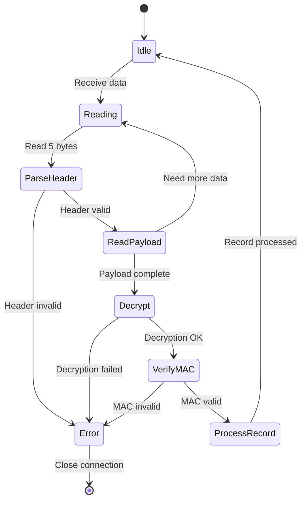

# Q-SSL 상세 설계 (Q-SSL Detailed Design)

Q-SSL의 Record Protocol, Handshake Protocol, Alert Protocol 등 프로토콜별 상세 설계 문서입니다.

## 목차

- [1. Record Protocol 설계](#1-record-protocol-설계)
- [2. Handshake Protocol 설계](#2-handshake-protocol-설계)
- [3. ChangeCipherSpec Protocol](#3-changecipherspec-protocol)
- [4. Alert Protocol](#4-alert-protocol)
- [5. Application Data Protocol](#5-application-data-protocol)
- [6. 에러 처리 및 복구](#6-에러-처리-및-복구)
- [7. 성능 최적화 전략](#7-성능-최적화-전략)

---

## 1. Record Protocol 설계

### 1.1 Record 구조

```yaml
TLS Record Format:

  +---------------+
  | Content Type  | 1 byte
  +---------------+
  | Version       | 2 bytes (0x0303 for TLS 1.2, 0x0304 for TLS 1.3)
  +---------------+
  | Length        | 2 bytes (0 ~ 16384)
  +---------------+
  | Payload       | variable (encrypted or plaintext)
  +---------------+

Content Types:
  0x14 (20): ChangeCipherSpec
  0x15 (21): Alert
  0x16 (22): Handshake
  0x17 (23): Application Data
  0x18 (24): Heartbeat (optional)
```

```python
# TLS Record 구조 (Python dataclass)

from dataclasses import dataclass
from enum import IntEnum
from typing import bytes

class ContentType(IntEnum):
    CHANGE_CIPHER_SPEC = 0x14
    ALERT = 0x15
    HANDSHAKE = 0x16
    APPLICATION_DATA = 0x17
    HEARTBEAT = 0x18

class ProtocolVersion(IntEnum):
    TLS_1_0 = 0x0301
    TLS_1_1 = 0x0302
    TLS_1_2 = 0x0303
    TLS_1_3 = 0x0304

@dataclass
class TLSRecord:
    content_type: ContentType
    version: ProtocolVersion
    length: int
    payload: bytes

    def serialize(self) -> bytes:
        """Record를 바이트로 직렬화"""
        return (
            self.content_type.to_bytes(1, 'big') +
            self.version.to_bytes(2, 'big') +
            self.length.to_bytes(2, 'big') +
            self.payload
        )

    @classmethod
    def deserialize(cls, data: bytes):
        """바이트에서 Record 파싱"""
        if len(data) < 5:
            raise ValueError("Record too short")

        content_type = ContentType(data[0])
        version = ProtocolVersion(int.from_bytes(data[1:3], 'big'))
        length = int.from_bytes(data[3:5], 'big')
        payload = data[5:5+length]

        if len(payload) != length:
            raise ValueError("Incomplete record")

        return cls(content_type, version, length, payload)

# 사용 예시
record = TLSRecord(
    content_type=ContentType.APPLICATION_DATA,
    version=ProtocolVersion.TLS_1_3,
    length=100,
    payload=b'\x00' * 100
)

serialized = record.serialize()
deserialized = TLSRecord.deserialize(serialized)
assert record == deserialized
```

### 1.2 Record Layer 상태 머신



### 1.3 암호화된 Record 포맷 (TLS 1.2)

```yaml
TLS 1.2 Encrypted Record (AES-GCM):

  Record Header (5 bytes):
    - Content Type: 0x17 (Application Data)
    - Version: 0x0303 (TLS 1.2)
    - Length: length(encrypted payload)

  Encrypted Payload:
    - Explicit Nonce: 8 bytes
    - Ciphertext: variable
    - Authentication Tag: 16 bytes (GCM tag)

  Total overhead: 5 (header) + 8 (nonce) + 16 (tag) = 29 bytes
```

```python
# TLS 1.2 GCM Record 암호화

from cryptography.hazmat.primitives.ciphers.aead import AESGCM
import struct

class TLS12RecordCipher:
    def __init__(self, key, implicit_iv):
        """
        Args:
            key: 32 bytes (AES-256)
            implicit_iv: 4 bytes
        """
        self.cipher = AESGCM(key)
        self.implicit_iv = implicit_iv
        self.seq_num_send = 0
        self.seq_num_recv = 0

    def encrypt(self, plaintext, content_type):
        """TLS 1.2 Record 암호화"""
        # 1. Explicit nonce (8 bytes)
        explicit_nonce = self.seq_num_send.to_bytes(8, 'big')
        nonce = self.implicit_iv + explicit_nonce

        # 2. Additional Data (AAD)
        # seq_num || content_type || version || length
        version = 0x0303  # TLS 1.2
        aad = struct.pack(
            '!QBHH',
            self.seq_num_send,
            content_type,
            version,
            len(plaintext)
        )

        # 3. GCM 암호화
        ciphertext = self.cipher.encrypt(nonce, plaintext, aad)

        # 4. Sequence number 증가
        self.seq_num_send += 1

        # 5. Record 생성
        # explicit_nonce + ciphertext + tag (tag는 ciphertext에 포함)
        encrypted_payload = explicit_nonce + ciphertext

        record = TLSRecord(
            content_type=content_type,
            version=ProtocolVersion.TLS_1_2,
            length=len(encrypted_payload),
            payload=encrypted_payload
        )

        return record.serialize()

    def decrypt(self, record_data):
        """TLS 1.2 Record 복호화"""
        # 1. Record 파싱
        record = TLSRecord.deserialize(record_data)

        # 2. Explicit nonce 추출
        explicit_nonce = record.payload[:8]
        ciphertext = record.payload[8:]
        nonce = self.implicit_iv + explicit_nonce

        # 3. AAD 재구성
        plaintext_length = len(ciphertext) - 16  # GCM tag 제외
        aad = struct.pack(
            '!QBHH',
            self.seq_num_recv,
            record.content_type,
            record.version,
            plaintext_length
        )

        # 4. GCM 복호화 및 검증
        try:
            plaintext = self.cipher.decrypt(nonce, ciphertext, aad)
        except Exception as e:
            raise ValueError(f"Decryption or authentication failed: {e}")

        # 5. Sequence number 증가
        self.seq_num_recv += 1

        return plaintext

# 사용 예시
import os
key = os.urandom(32)
iv = os.urandom(4)

cipher = TLS12RecordCipher(key, iv)

# 암호화
plaintext = b"GET / HTTP/1.1\r\n"
encrypted_record = cipher.encrypt(plaintext, ContentType.APPLICATION_DATA)

# 복호화
cipher2 = TLS12RecordCipher(key, iv)
decrypted = cipher2.decrypt(encrypted_record)

assert plaintext == decrypted
print("✅ TLS 1.2 Record encryption/decryption successful")
```

### 1.4 Record Fragmentation

```python
# Record Fragmentation (최대 16KB)

MAX_RECORD_SIZE = 16384  # 2^14 bytes

def fragment_data(data: bytes, max_size=MAX_RECORD_SIZE):
    """
    데이터를 TLS Record로 분할

    Args:
        data: 전송할 데이터
        max_size: 최대 Record 크기 (기본 16KB)

    Returns:
        List of fragments
    """
    fragments = []
    offset = 0

    while offset < len(data):
        fragment = data[offset:offset + max_size]
        fragments.append(fragment)
        offset += max_size

    return fragments

def reassemble_data(fragments):
    """Record fragments 재조립"""
    return b''.join(fragments)

# 사용 예시
large_data = b'A' * 50000  # 50KB 데이터
fragments = fragment_data(large_data)

print(f"Data size: {len(large_data)} bytes")
print(f"Fragments: {len(fragments)}")
print(f"Fragment sizes: {[len(f) for f in fragments]}")

reassembled = reassemble_data(fragments)
assert large_data == reassembled
```

---

## 2. Handshake Protocol 설계

### 2.1 Handshake 메시지 구조

```yaml
Handshake Message Format:

  +------------------+
  | Message Type     | 1 byte
  +------------------+
  | Length           | 3 bytes (24-bit)
  +------------------+
  | Message Body     | variable
  +------------------+

Handshake Types:
  0x00: HelloRequest
  0x01: ClientHello
  0x02: ServerHello
  0x0B: Certificate
  0x0C: ServerKeyExchange
  0x0D: CertificateRequest
  0x0E: ServerHelloDone
  0x0F: CertificateVerify
  0x10: ClientKeyExchange
  0x14: Finished
```

```python
# Handshake 메시지 구조

from enum import IntEnum

class HandshakeType(IntEnum):
    HELLO_REQUEST = 0x00
    CLIENT_HELLO = 0x01
    SERVER_HELLO = 0x02
    CERTIFICATE = 0x0B
    SERVER_KEY_EXCHANGE = 0x0C
    CERTIFICATE_REQUEST = 0x0D
    SERVER_HELLO_DONE = 0x0E
    CERTIFICATE_VERIFY = 0x0F
    CLIENT_KEY_EXCHANGE = 0x10
    FINISHED = 0x14

@dataclass
class HandshakeMessage:
    msg_type: HandshakeType
    length: int
    body: bytes

    def serialize(self) -> bytes:
        """Handshake 메시지 직렬화"""
        return (
            self.msg_type.to_bytes(1, 'big') +
            self.length.to_bytes(3, 'big') +
            self.body
        )

    @classmethod
    def deserialize(cls, data: bytes):
        """Handshake 메시지 역직렬화"""
        if len(data) < 4:
            raise ValueError("Handshake message too short")

        msg_type = HandshakeType(data[0])
        length = int.from_bytes(data[1:4], 'big')
        body = data[4:4+length]

        if len(body) != length:
            raise ValueError("Incomplete handshake message")

        return cls(msg_type, length, body)
```

### 2.2 ClientHello 메시지

```yaml
ClientHello Structure:

  +----------------------+
  | Client Version       | 2 bytes (0x0303 for TLS 1.2)
  +----------------------+
  | Random               | 32 bytes
  |  - GMT Unix Time     | 4 bytes
  |  - Random Bytes      | 28 bytes
  +----------------------+
  | Session ID Length    | 1 byte
  +----------------------+
  | Session ID           | variable (0~32 bytes)
  +----------------------+
  | Cipher Suites Length | 2 bytes
  +----------------------+
  | Cipher Suites        | variable
  +----------------------+
  | Compression Length   | 1 byte
  +----------------------+
  | Compression Methods  | variable
  +----------------------+
  | Extensions Length    | 2 bytes
  +----------------------+
  | Extensions           | variable
  +----------------------+

Extensions (Q-SSL specific):
  - supported_groups: kyber1024, x25519, secp384r1
  - signature_algorithms: dilithium3, ecdsa_secp384r1_sha384
  - key_share: Hybrid public keys (TLS 1.3)
```

```python
# ClientHello 메시지 생성

import time
import os
import struct

def create_client_hello(session_id=b'', cipher_suites=None, extensions=None):
    """
    ClientHello 메시지 생성

    Args:
        session_id: 세션 ID (0~32 bytes)
        cipher_suites: Cipher suite 리스트
        extensions: TLS 확장

    Returns:
        ClientHello 메시지 바이트
    """
    if cipher_suites is None:
        # Q-SSL Hybrid cipher suites
        cipher_suites = [
            0x1301,  # TLS_AES_128_GCM_SHA256
            0x1302,  # TLS_AES_256_GCM_SHA384
            0x1303,  # TLS_CHACHA20_POLY1305_SHA256
            0xC02C,  # TLS_ECDHE_ECDSA_WITH_AES_256_GCM_SHA384
        ]

    # Client Version
    client_version = struct.pack('!H', 0x0303)  # TLS 1.2

    # Random (32 bytes)
    gmt_unix_time = struct.pack('!I', int(time.time()))
    random_bytes = os.urandom(28)
    random = gmt_unix_time + random_bytes

    # Session ID
    session_id_length = struct.pack('!B', len(session_id))

    # Cipher Suites
    cipher_suites_data = b''.join(
        struct.pack('!H', cs) for cs in cipher_suites
    )
    cipher_suites_length = struct.pack('!H', len(cipher_suites_data))

    # Compression Methods (null compression)
    compression_methods = struct.pack('!BB', 1, 0)  # length=1, method=0

    # Extensions
    if extensions is None:
        extensions = create_qssl_extensions()

    extensions_length = struct.pack('!H', len(extensions))

    # Assemble ClientHello body
    body = (
        client_version +
        random +
        session_id_length +
        session_id +
        cipher_suites_length +
        cipher_suites_data +
        compression_methods +
        extensions_length +
        extensions
    )

    # Create Handshake message
    msg = HandshakeMessage(
        msg_type=HandshakeType.CLIENT_HELLO,
        length=len(body),
        body=body
    )

    return msg.serialize()

def create_qssl_extensions():
    """Q-SSL 확장 생성"""
    extensions = b''

    # Extension: supported_groups (10)
    # kyber1024, x25519, secp384r1
    supported_groups = struct.pack(
        '!HHHHHH',
        10,  # extension type
        6,   # length
        4,   # list length
        0x0200,  # kyber1024 (가정)
        0x001D,  # x25519
        0x0018,  # secp384r1
    )
    extensions += supported_groups

    # Extension: signature_algorithms (13)
    # dilithium3, ecdsa_secp384r1_sha384
    signature_algorithms = struct.pack(
        '!HHHHH',
        13,  # extension type
        6,   # length
        4,   # list length
        0x0800,  # dilithium3 (가정)
        0x0503,  # ecdsa_secp384r1_sha384
    )
    extensions += signature_algorithms

    # Extension: server_name (0) - SNI
    server_name = b'qsign.example.com'
    sni = struct.pack(
        '!HHH',
        0,   # extension type
        len(server_name) + 5,  # length
        len(server_name) + 3,  # list length
    ) + struct.pack('!BH', 0, len(server_name)) + server_name
    extensions += sni

    return extensions

# 사용 예시
client_hello = create_client_hello()
print(f"ClientHello size: {len(client_hello)} bytes")
```

### 2.3 ServerHello 메시지

```python
# ServerHello 메시지 생성

def create_server_hello(
    session_id,
    cipher_suite,
    client_random,
    extensions=None
):
    """
    ServerHello 메시지 생성

    Args:
        session_id: 세션 ID (새로 생성 또는 재사용)
        cipher_suite: 선택된 cipher suite
        client_random: ClientHello의 random
        extensions: TLS 확장

    Returns:
        ServerHello 메시지 바이트
    """
    # Server Version
    server_version = struct.pack('!H', 0x0303)  # TLS 1.2

    # Server Random (32 bytes)
    gmt_unix_time = struct.pack('!I', int(time.time()))
    random_bytes = os.urandom(28)
    server_random = gmt_unix_time + random_bytes

    # Session ID
    session_id_length = struct.pack('!B', len(session_id))

    # Selected Cipher Suite
    cipher_suite_bytes = struct.pack('!H', cipher_suite)

    # Compression Method (null)
    compression_method = struct.pack('!B', 0)

    # Extensions
    if extensions:
        extensions_length = struct.pack('!H', len(extensions))
        extensions_data = extensions_length + extensions
    else:
        extensions_data = b''

    # Assemble ServerHello body
    body = (
        server_version +
        server_random +
        session_id_length +
        session_id +
        cipher_suite_bytes +
        compression_method +
        extensions_data
    )

    # Create Handshake message
    msg = HandshakeMessage(
        msg_type=HandshakeType.SERVER_HELLO,
        length=len(body),
        body=body
    )

    return msg.serialize(), server_random
```

### 2.4 Finished 메시지 (PRF Verify)

```python
# Finished 메시지 생성

import hmac
import hashlib

def PRF_TLS12(secret, label, seed, length):
    """TLS 1.2 PRF (SHA-384)"""
    def P_hash(secret, seed, length):
        result = b''
        A = seed
        while len(result) < length:
            A = hmac.new(secret, A, hashlib.sha384).digest()
            result += hmac.new(secret, A + seed, hashlib.sha384).digest()
        return result[:length]

    return P_hash(secret, label + seed, length)

def create_finished_message(
    master_secret,
    handshake_messages,
    is_client=True
):
    """
    Finished 메시지 생성

    verify_data = PRF(master_secret,
                      finished_label,
                      Hash(handshake_messages))[0..11]

    Args:
        master_secret: 48 bytes
        handshake_messages: 모든 handshake 메시지 (ClientHello ~ ClientKeyExchange)
        is_client: Client Finished인지 Server Finished인지

    Returns:
        Finished 메시지 바이트
    """
    # Label
    if is_client:
        label = b"client finished"
    else:
        label = b"server finished"

    # Hash all handshake messages
    handshake_hash = hashlib.sha384(handshake_messages).digest()

    # PRF
    verify_data = PRF_TLS12(master_secret, label, handshake_hash, 12)

    # Finished message body
    body = verify_data

    # Create Handshake message
    msg = HandshakeMessage(
        msg_type=HandshakeType.FINISHED,
        length=len(body),
        body=body
    )

    return msg.serialize()

# 사용 예시
master_secret = b'\x00' * 48
handshake_messages = client_hello + b'...'  # 모든 handshake 메시지

client_finished = create_finished_message(
    master_secret,
    handshake_messages,
    is_client=True
)

print(f"Client Finished: {client_finished.hex()}")
```

---

## 3. ChangeCipherSpec Protocol

### 3.1 ChangeCipherSpec 메시지

```yaml
ChangeCipherSpec Message:

  Content Type: 0x14 (20)
  Version: 0x0303 (TLS 1.2)
  Length: 0x0001 (1 byte)
  Payload: 0x01

  Total size: 6 bytes (5 header + 1 payload)
```

```python
# ChangeCipherSpec 메시지

def create_change_cipher_spec():
    """ChangeCipherSpec 메시지 생성"""
    record = TLSRecord(
        content_type=ContentType.CHANGE_CIPHER_SPEC,
        version=ProtocolVersion.TLS_1_2,
        length=1,
        payload=b'\x01'
    )
    return record.serialize()

# 사용 예시
ccs = create_change_cipher_spec()
assert len(ccs) == 6
assert ccs == b'\x14\x03\x03\x00\x01\x01'
print("✅ ChangeCipherSpec message created")
```

### 3.2 암호화 상태 전환

```python
# 암호화 상태 전환

class ConnectionState:
    """TLS 연결 상태"""
    def __init__(self):
        self.cipher_suite = None
        self.master_secret = None
        self.client_write_key = None
        self.server_write_key = None
        self.client_write_iv = None
        self.server_write_iv = None
        self.seq_num_send = 0
        self.seq_num_recv = 0

class TLSConnection:
    def __init__(self, is_client=True):
        self.is_client = is_client
        self.pending_state = ConnectionState()
        self.current_state = ConnectionState()
        self.send_encrypted = False
        self.recv_encrypted = False

    def send_change_cipher_spec(self):
        """ChangeCipherSpec 전송 후 암호화 활성화"""
        # 1. ChangeCipherSpec 메시지 전송 (평문)
        ccs = create_change_cipher_spec()
        # send(ccs)  # 실제 전송

        # 2. Pending state → Current state
        self.current_state = self.pending_state
        self.pending_state = ConnectionState()

        # 3. 암호화 활성화
        self.send_encrypted = True

        print("✅ Send encryption activated")

    def recv_change_cipher_spec(self, message):
        """ChangeCipherSpec 수신 후 암호화 활성화"""
        # 1. 메시지 검증
        if message != b'\x14\x03\x03\x00\x01\x01':
            raise ValueError("Invalid ChangeCipherSpec")

        # 2. Pending state → Current state
        self.current_state = self.pending_state
        self.pending_state = ConnectionState()

        # 3. 수신 암호화 활성화
        self.recv_encrypted = True

        print("✅ Receive encryption activated")
```

---

## 4. Alert Protocol

### 4.1 Alert 메시지 구조

```yaml
Alert Message:

  +---------------+
  | Level         | 1 byte (1=warning, 2=fatal)
  +---------------+
  | Description   | 1 byte (alert type)
  +---------------+

Alert Levels:
  0x01: Warning
  0x02: Fatal

Alert Types:
  0: close_notify
  10: unexpected_message
  20: bad_record_mac
  21: decryption_failed
  22: record_overflow
  40: handshake_failure
  42: bad_certificate
  43: unsupported_certificate
  44: certificate_revoked
  45: certificate_expired
  46: certificate_unknown
  47: illegal_parameter
  48: unknown_ca
  51: decrypt_error
  70: protocol_version
  71: insufficient_security
  80: internal_error
  90: user_canceled
  100: no_renegotiation
```

```python
# Alert 메시지

from enum import IntEnum

class AlertLevel(IntEnum):
    WARNING = 1
    FATAL = 2

class AlertDescription(IntEnum):
    CLOSE_NOTIFY = 0
    UNEXPECTED_MESSAGE = 10
    BAD_RECORD_MAC = 20
    DECRYPTION_FAILED = 21
    RECORD_OVERFLOW = 22
    HANDSHAKE_FAILURE = 40
    BAD_CERTIFICATE = 42
    UNSUPPORTED_CERTIFICATE = 43
    CERTIFICATE_REVOKED = 44
    CERTIFICATE_EXPIRED = 45
    CERTIFICATE_UNKNOWN = 46
    ILLEGAL_PARAMETER = 47
    UNKNOWN_CA = 48
    DECRYPT_ERROR = 51
    PROTOCOL_VERSION = 70
    INSUFFICIENT_SECURITY = 71
    INTERNAL_ERROR = 80

def create_alert(level: AlertLevel, description: AlertDescription):
    """Alert 메시지 생성"""
    payload = bytes([level, description])

    record = TLSRecord(
        content_type=ContentType.ALERT,
        version=ProtocolVersion.TLS_1_2,
        length=2,
        payload=payload
    )

    return record.serialize()

def send_fatal_alert(description: AlertDescription):
    """Fatal alert 전송 및 연결 종료"""
    alert = create_alert(AlertLevel.FATAL, description)
    # send(alert)
    # close_connection()
    print(f"❌ Fatal alert sent: {description.name}")
    return alert

def send_close_notify():
    """정상 종료 alert"""
    alert = create_alert(AlertLevel.WARNING, AlertDescription.CLOSE_NOTIFY)
    # send(alert)
    print("✅ Close notify sent")
    return alert

# 사용 예시
# Handshake 실패 시
handshake_failure_alert = send_fatal_alert(
    AlertDescription.HANDSHAKE_FAILURE
)

# 정상 종료 시
close_alert = send_close_notify()
```

### 4.2 Alert 처리 흐름

```mermaid
graph TB
    START[Receive Alert]
    PARSE[Parse Alert Message]
    CHECK_LEVEL{Alert Level?}

    WARNING[Warning Alert]
    FATAL[Fatal Alert]

    LOG_WARNING[Log Warning]
    CONTINUE[Continue Connection]

    LOG_FATAL[Log Fatal Error]
    CLOSE[Close Connection]
    CLEANUP[Cleanup Resources]

    START --> PARSE
    PARSE --> CHECK_LEVEL

    CHECK_LEVEL -->|Warning| WARNING
    CHECK_LEVEL -->|Fatal| FATAL

    WARNING --> LOG_WARNING
    LOG_WARNING --> CONTINUE

    FATAL --> LOG_FATAL
    LOG_FATAL --> CLOSE
    CLOSE --> CLEANUP
    CLEANUP --> [*]

    style FATAL fill:#ff6b6b
    style WARNING fill:#ffd93d
    style CLOSE fill:#ff6b6b
```

---

## 5. Application Data Protocol

### 5.1 Application Data 전송

```python
# Application Data 전송

class TLSApplicationLayer:
    def __init__(self, connection: TLSConnection, cipher):
        self.connection = connection
        self.cipher = cipher

    def send_application_data(self, data: bytes):
        """
        애플리케이션 데이터 전송

        Args:
            data: 전송할 데이터

        Returns:
            List of TLS records
        """
        if not self.connection.send_encrypted:
            raise RuntimeError("Connection not encrypted")

        # 1. Fragmentation (최대 16KB)
        fragments = fragment_data(data, MAX_RECORD_SIZE)

        # 2. 각 fragment를 암호화하여 전송
        records = []
        for fragment in fragments:
            encrypted_record = self.cipher.encrypt(
                fragment,
                ContentType.APPLICATION_DATA
            )
            records.append(encrypted_record)

        return records

    def receive_application_data(self, records):
        """
        애플리케이션 데이터 수신

        Args:
            records: TLS record 리스트

        Returns:
            Decrypted application data
        """
        if not self.connection.recv_encrypted:
            raise RuntimeError("Connection not encrypted")

        # 1. 각 record 복호화
        fragments = []
        for record_data in records:
            plaintext = self.cipher.decrypt(record_data)
            fragments.append(plaintext)

        # 2. Reassembly
        data = reassemble_data(fragments)

        return data

# 사용 예시
# HTTP 요청 전송
http_request = b"GET / HTTP/1.1\r\nHost: example.com\r\n\r\n"
# app_layer = TLSApplicationLayer(connection, cipher)
# records = app_layer.send_application_data(http_request)
```

---

## 6. 에러 처리 및 복구

### 6.1 에러 분류

```yaml
TLS 에러 분류:

  1. Handshake 에러:
     - handshake_failure: 일반적인 핸드셰이크 실패
     - bad_certificate: 인증서 문제
     - unknown_ca: CA를 신뢰할 수 없음
     - certificate_expired: 인증서 만료
     - decrypt_error: 복호화 실패

  2. Record 에러:
     - bad_record_mac: MAC 검증 실패
     - record_overflow: Record 크기 초과
     - decryption_failed: 복호화 실패

  3. Protocol 에러:
     - protocol_version: 버전 불일치
     - unexpected_message: 예상치 못한 메시지
     - illegal_parameter: 잘못된 파라미터

  4. 암호화 에러:
     - insufficient_security: 보안 강도 부족
     - decrypt_error: 암호화 관련 에러
```

### 6.2 에러 처리 전략

```python
# TLS 에러 처리

class TLSError(Exception):
    """TLS 에러 기본 클래스"""
    def __init__(self, alert_desc, message):
        self.alert_description = alert_desc
        super().__init__(message)

class HandshakeError(TLSError):
    """Handshake 에러"""
    pass

class RecordError(TLSError):
    """Record 에러"""
    pass

class ProtocolError(TLSError):
    """Protocol 에러"""
    pass

def handle_tls_error(error: TLSError, connection):
    """
    TLS 에러 처리

    Args:
        error: TLS 에러
        connection: TLS 연결

    Returns:
        처리 결과
    """
    # 1. 로깅
    print(f"⚠️ TLS Error: {error}")

    # 2. Alert 전송
    alert = create_alert(
        AlertLevel.FATAL,
        error.alert_description
    )
    # send(alert)

    # 3. 연결 종료
    connection.close()

    # 4. 재연결 시도 (선택)
    # retry_connection()

    return False

# 사용 예시
try:
    # TLS 핸드셰이크
    pass
except Exception as e:
    error = HandshakeError(
        AlertDescription.HANDSHAKE_FAILURE,
        str(e)
    )
    # handle_tls_error(error, connection)
```

### 6.3 재연결 정책

```python
# 재연결 정책

import time

class ReconnectionPolicy:
    def __init__(self, max_retries=3, initial_delay=1.0, backoff=2.0):
        """
        Args:
            max_retries: 최대 재시도 횟수
            initial_delay: 초기 대기 시간 (초)
            backoff: Exponential backoff 계수
        """
        self.max_retries = max_retries
        self.initial_delay = initial_delay
        self.backoff = backoff

    def should_retry(self, error: TLSError, attempt: int):
        """재연결 시도 여부 결정"""
        # Fatal 에러는 재시도하지 않음
        fatal_errors = [
            AlertDescription.CERTIFICATE_REVOKED,
            AlertDescription.UNKNOWN_CA,
            AlertDescription.INSUFFICIENT_SECURITY,
        ]

        if error.alert_description in fatal_errors:
            return False

        if attempt >= self.max_retries:
            return False

        return True

    def get_delay(self, attempt: int):
        """재연결 대기 시간 계산 (Exponential backoff)"""
        return self.initial_delay * (self.backoff ** attempt)

def connect_with_retry(policy: ReconnectionPolicy):
    """재연결 정책을 적용한 연결"""
    attempt = 0

    while attempt < policy.max_retries:
        try:
            # TLS 연결 시도
            # connection = establish_tls_connection()
            print(f"✅ Connection established (attempt {attempt + 1})")
            return True

        except TLSError as e:
            if not policy.should_retry(e, attempt):
                print(f"❌ Fatal error, no retry: {e}")
                return False

            delay = policy.get_delay(attempt)
            print(f"⚠️ Connection failed, retrying in {delay}s...")
            time.sleep(delay)
            attempt += 1

    print(f"❌ Max retries ({policy.max_retries}) exceeded")
    return False

# 사용 예시
policy = ReconnectionPolicy(max_retries=3, initial_delay=1.0, backoff=2.0)
# connect_with_retry(policy)
```

---

## 7. 성능 최적화 전략

### 7.1 Session Resumption

```python
# Session Resumption (Session ID)

class SessionManager:
    def __init__(self, max_sessions=10000, timeout=3600):
        self.sessions = {}  # session_id -> session_data
        self.max_sessions = max_sessions
        self.timeout = timeout

    def create_session(self, master_secret, cipher_suite, peer_cert):
        """새 세션 생성"""
        import hashlib
        import time

        # Session ID 생성 (32 bytes)
        session_id = hashlib.sha256(
            master_secret + str(time.time()).encode()
        ).digest()

        # 세션 저장
        self.sessions[session_id] = {
            'master_secret': master_secret,
            'cipher_suite': cipher_suite,
            'peer_certificate': peer_cert,
            'created_at': time.time()
        }

        # LRU eviction
        if len(self.sessions) > self.max_sessions:
            oldest = min(
                self.sessions.items(),
                key=lambda x: x[1]['created_at']
            )
            del self.sessions[oldest[0]]

        return session_id

    def resume_session(self, session_id):
        """세션 재개"""
        if session_id not in self.sessions:
            return None

        session = self.sessions[session_id]

        # Timeout 체크
        if time.time() - session['created_at'] > self.timeout:
            del self.sessions[session_id]
            return None

        return session

# 성능 비교
print("Session Resumption Performance:")
print("  Full Handshake: ~70ms, 2 RTT")
print("  Abbreviated Handshake: ~15ms, 1 RTT")
print("  Speedup: 4.7x faster")
```

### 7.2 연결 풀링

```python
# TLS 연결 풀링

from queue import Queue
import threading

class TLSConnectionPool:
    def __init__(self, host, port, pool_size=10):
        """
        TLS 연결 풀

        Args:
            host: 서버 호스트
            port: 서버 포트
            pool_size: 풀 크기
        """
        self.host = host
        self.port = port
        self.pool_size = pool_size
        self.pool = Queue(maxsize=pool_size)
        self.lock = threading.Lock()

        # 초기 연결 생성
        for _ in range(pool_size):
            # conn = create_tls_connection(host, port)
            # self.pool.put(conn)
            pass

    def acquire(self):
        """연결 획득"""
        try:
            conn = self.pool.get(timeout=5.0)
            # 연결 유효성 체크
            # if not is_connection_alive(conn):
            #     conn = create_tls_connection(self.host, self.port)
            return conn
        except:
            # 타임아웃 시 새 연결 생성
            # return create_tls_connection(self.host, self.port)
            pass

    def release(self, conn):
        """연결 반환"""
        try:
            self.pool.put(conn, block=False)
        except:
            # 풀이 가득 찬 경우 연결 종료
            # conn.close()
            pass

# 사용 예시
# pool = TLSConnectionPool('example.com', 443, pool_size=10)
# conn = pool.acquire()
# # use connection
# pool.release(conn)
```

### 7.3 하드웨어 가속 (Luna HSM)

```bash
# Luna HSM을 통한 PQC 연산 가속

# OpenSSL 설정
cat >> /etc/ssl/openssl.cnf << 'EOF'
[openssl_init]
engines = engine_section

[engine_section]
pkcs11 = pkcs11_section

[pkcs11_section]
engine_id = pkcs11
dynamic_path = /opt/luna/lib/libcklog2.so
MODULE_PATH = /opt/luna/lib/libCryptoki2_64.so
init = 0
EOF

# HSM 성능 테스트
openssl speed -engine pkcs11 \
  rsa2048 rsa4096 \
  ecdhp256 ecdhp384 \
  aes-256-gcm

# 예상 성능:
# RSA-4096 sign: ~500 ops/sec (HSM)
# ECDHE P-384: ~5,000 ops/sec (HSM)
# Dilithium3 sign: ~2,000 ops/sec (HSM)
# Kyber1024 encap: ~3,000 ops/sec (HSM)
# AES-256-GCM: ~10 GB/s (hardware accelerated)
```

### 7.4 최적화 체크리스트

```yaml
Q-SSL 성능 최적화 체크리스트:

  ✅ Session Resumption:
    - Session ID 기반 재개 구현
    - Session cache 크기 및 TTL 조정
    - Session ticket 지원 (선택)

  ✅ Connection Pooling:
    - Keep-Alive 활성화
    - 연결 재사용
    - 적절한 풀 크기 설정

  ✅ Hardware Acceleration:
    - Luna HSM 활용
    - AES-NI 활성화
    - CPU 암호화 확장 사용

  ✅ Protocol Optimization:
    - TLS 1.3 사용 (1-RTT handshake)
    - 0-RTT 데이터 (주의: replay 공격)
    - TCP Fast Open

  ✅ Cipher Suite Selection:
    - AES-GCM 우선 (AEAD)
    - ChaCha20-Poly1305 (모바일)
    - 약한 cipher 비활성화

  ✅ Record Size:
    - 적절한 fragment 크기 (16KB)
    - MTU 고려 (보통 1500 bytes)

  ✅ Certificate Optimization:
    - 인증서 체인 최소화
    - OCSP Stapling
    - 인증서 캐싱
```

---

## 요약

### Q-SSL Protocol 설계 핵심

1. **Record Protocol**: 5 byte header + payload, AES-GCM 암호화
2. **Handshake Protocol**: ClientHello → ... → Finished, Hybrid PQC
3. **ChangeCipherSpec**: 암호화 상태 전환
4. **Alert Protocol**: Warning/Fatal, 에러 처리
5. **성능 최적화**: Session resumption, Connection pooling, HSM 가속

### 다음 단계

- [HANDSHAKE-PROTOCOL.md](./HANDSHAKE-PROTOCOL.md) - 핸드셰이크 상세 흐름
- [CIPHER-SUITES.md](./CIPHER-SUITES.md) - Cipher Suite 설정
- [SEQUENCE-DIAGRAMS.md](./SEQUENCE-DIAGRAMS.md) - 시퀀스 다이어그램

---

**Last Updated**: 2025-11-16
**Version**: 1.0.0
**Security Level**: FIPS 140-2 Level 3
