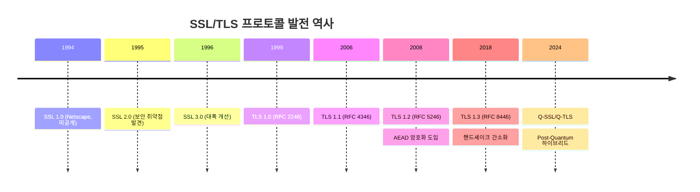
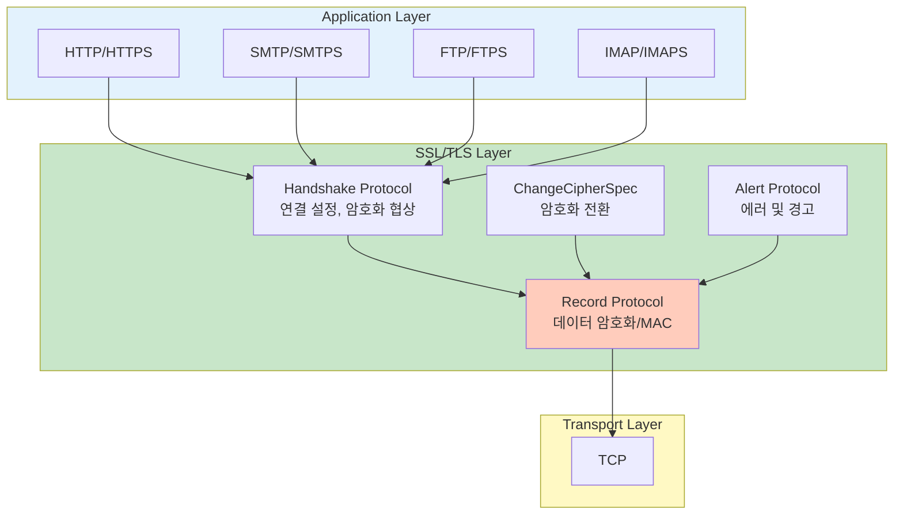
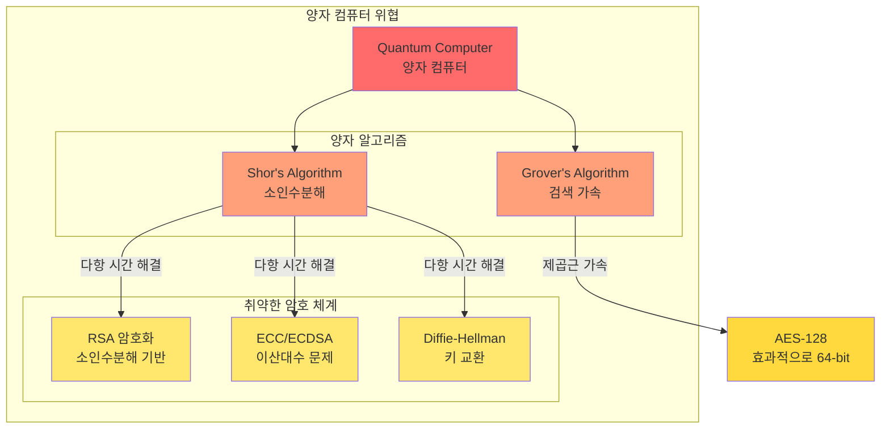
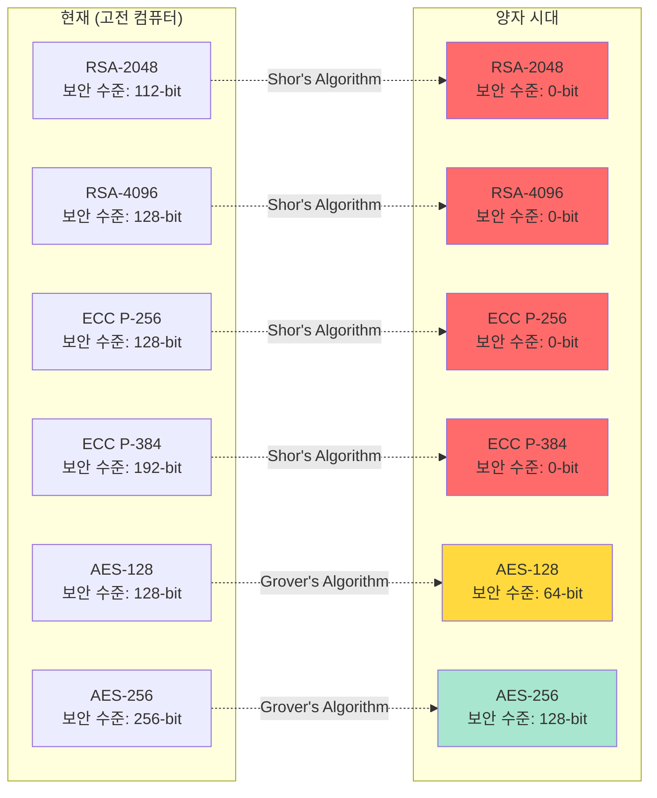
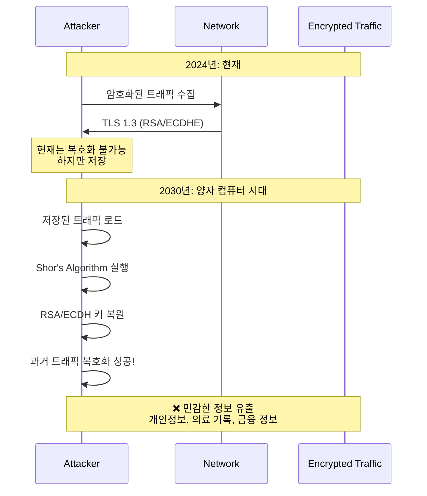
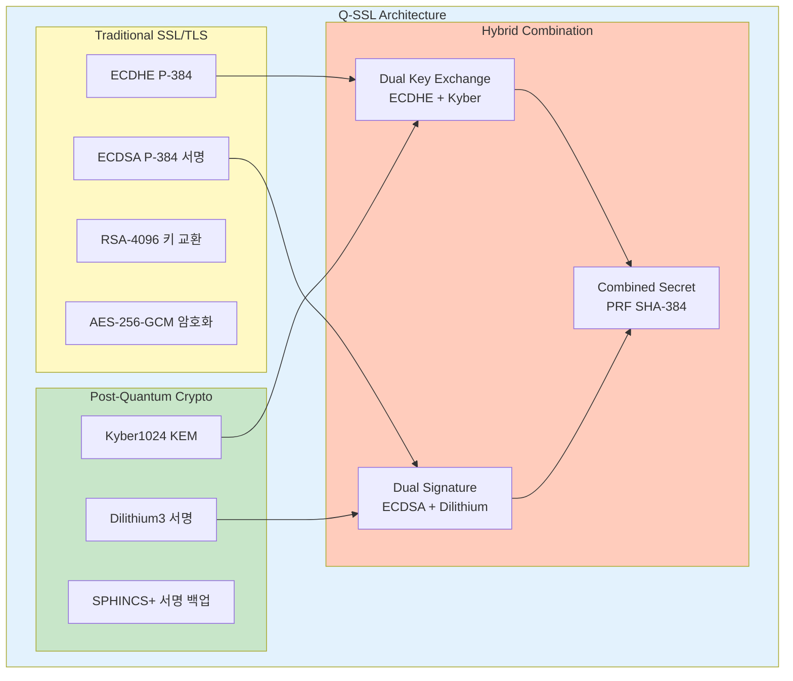
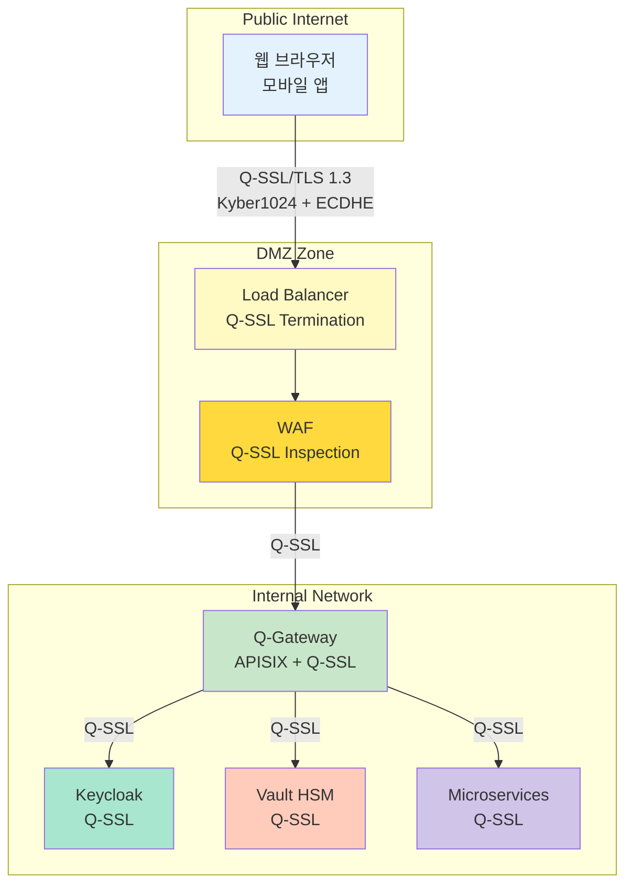
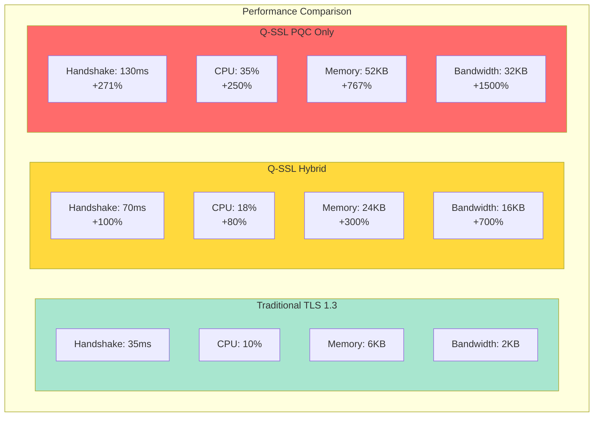
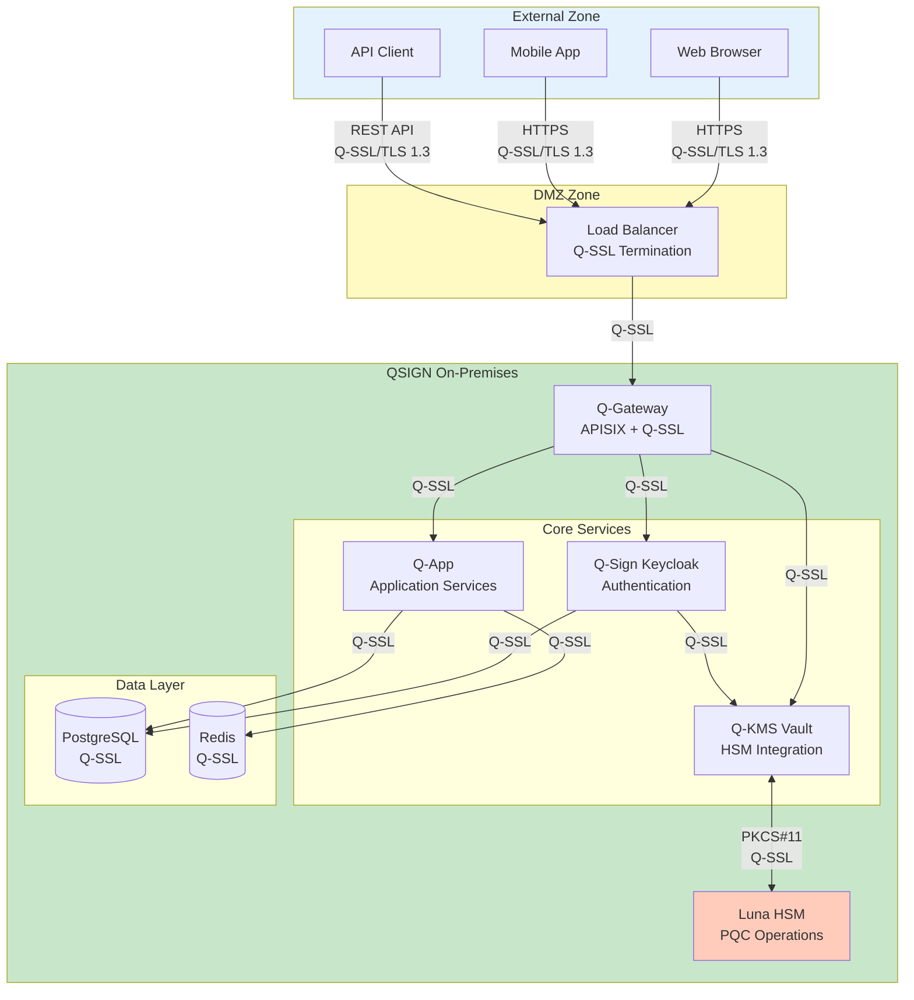
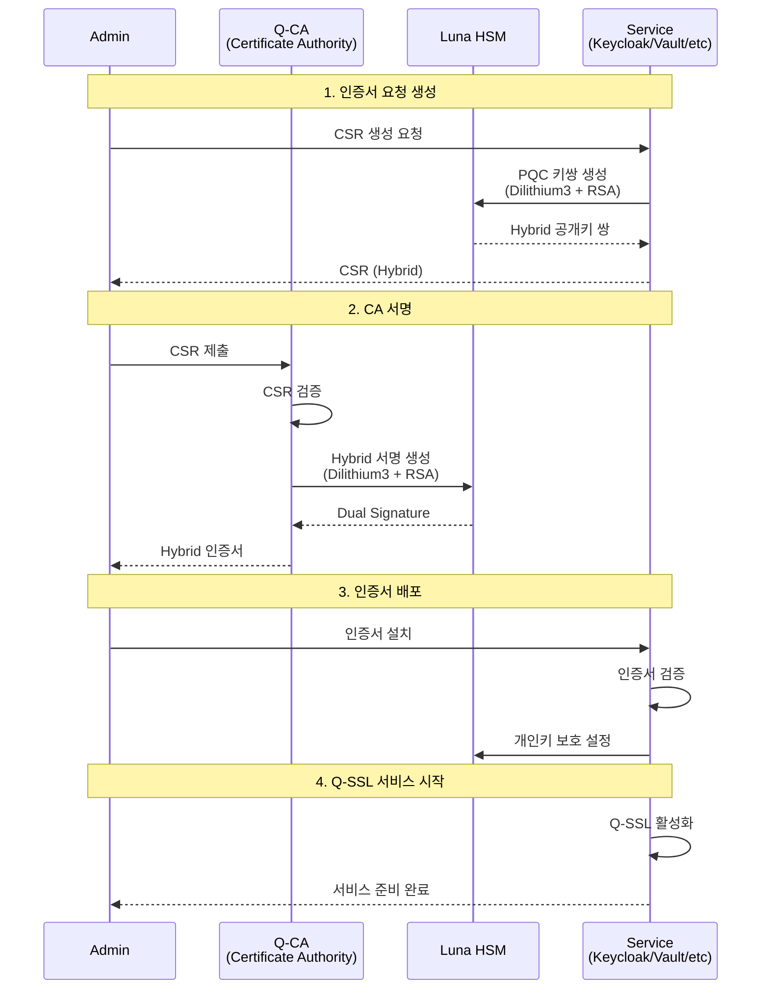

# Q-SSL 개요 (Q-SSL Overview)

Q-SSL (Quantum-resistant Secure Sockets Layer)은 양자 컴퓨터 공격에 대비한 차세대 보안 프로토콜입니다.

## 목차

- [1. SSL/TLS 프로토콜의 역사](#1-ssltls-프로토콜의-역사)
- [2. 양자 위협과 PQC의 필요성](#2-양자-위협과-pqc의-필요성)
- [3. Q-SSL이란 무엇인가](#3-q-ssl이란-무엇인가)
- [4. SSL-PQC Hybrid Mode](#4-ssl-pqc-hybrid-mode)
- [5. Q-SSL vs 전통적 SSL/TLS](#5-q-ssl-vs-전통적-ssltls)
- [6. QSIGN에서의 Q-SSL 역할](#6-qsign에서의-q-ssl-역할)

---

## 1. SSL/TLS 프로토콜의 역사

### 1.1 SSL/TLS 타임라인



### 1.2 각 버전의 주요 특징

| 버전 | 출시 연도 | 주요 특징 | 보안 상태 |
|-----|---------|---------|----------|
| **SSL 1.0** | 1994 | Netscape 내부 프로토타입 | 미공개 |
| **SSL 2.0** | 1995 | 최초 공개 SSL | ❌ 취약 (deprecated) |
| **SSL 3.0** | 1996 | HMAC 도입, 보안 강화 | ❌ POODLE 취약점 |
| **TLS 1.0** | 1999 | SSL 3.0 기반, IETF 표준화 | ⚠️ 제한적 사용 |
| **TLS 1.1** | 2006 | CBC 공격 방어 개선 | ⚠️ 제한적 사용 |
| **TLS 1.2** | 2008 | SHA-256, AEAD 지원 | ✅ 권장 |
| **TLS 1.3** | 2018 | 핸드셰이크 최적화, PFS 필수 | ✅ 최우선 권장 |
| **Q-SSL** | 2024+ | PQC Hybrid 모드 | ✅ 양자 내성 |

### 1.3 SSL/TLS 프로토콜 구조



### 1.4 주요 보안 취약점 역사

```yaml
SSL/TLS 역사적 취약점:
  BEAST (2011):
    - 영향: SSL 3.0, TLS 1.0
    - 공격: CBC 모드 암호화 예측
    - 대응: TLS 1.1+ (명시적 IV)

  CRIME (2012):
    - 영향: TLS 압축
    - 공격: 압축률을 통한 정보 유출
    - 대응: TLS 압축 비활성화

  Lucky13 (2013):
    - 영향: CBC 모드
    - 공격: Timing attack
    - 대응: AEAD 암호화 (GCM, CCM)

  Heartbleed (2014):
    - 영향: OpenSSL 구현 버그
    - 공격: 메모리 유출
    - 대응: OpenSSL 패치

  POODLE (2014):
    - 영향: SSL 3.0
    - 공격: Padding oracle
    - 대응: SSL 3.0 완전 폐기

  FREAK (2015):
    - 영향: Export-grade 암호화
    - 공격: Downgrade attack
    - 대응: Export cipher 제거

  Logjam (2015):
    - 영향: DHE 키 교환
    - 공격: 약한 DH 파라미터
    - 대응: 2048-bit DH 필수

  DROWN (2016):
    - 영향: SSLv2
    - 공격: Cross-protocol attack
    - 대응: SSLv2 완전 비활성화
```

---

## 2. 양자 위협과 PQC의 필요성

### 2.1 양자 컴퓨터의 위협



### 2.2 Shor's Algorithm의 영향

**Shor's Algorithm** (1994, Peter Shor):
- 양자 컴퓨터에서 소인수분해를 **다항 시간**에 해결
- RSA, DSA, ECDSA, ECDH 등 **모든 공개키 암호** 취약

```python
# Shor's Algorithm 복잡도 비교
# 고전 컴퓨터: O(exp(n^(1/3)))
# 양자 컴퓨터: O(n^3)

# RSA-2048 소인수분해 예상 시간
classical_computer = "수백만 년"
quantum_computer_50qubit = "수 시간"
quantum_computer_4000qubit = "수 초"

# 예시: RSA 키 깨기 (단순화된 개념)
def classical_factorization(n):
    # 고전: 지수 시간 복잡도
    time = "exponential"
    return time

def shor_factorization(n):
    # 양자: 다항 시간 복잡도
    time = "polynomial"
    return time
```

### 2.3 암호학적 보안 수준 하락



### 2.4 "Store Now, Decrypt Later" 위협



**대응 전략**:
- **지금 당장** PQC로 전환 필요
- 장기 보관 데이터는 즉시 PQC로 재암호화
- 모든 새로운 시스템은 PQC 적용

### 2.5 NIST PQC 표준화

```yaml
NIST PQC 표준화 타임라인:
  2016년:
    - NIST PQC 표준화 프로젝트 시작
    - 82개 후보 알고리즘 제출

  2020년:
    - Round 3 Finalists 발표
    - 7개 최종 후보 선정

  2022년:
    - 최종 표준 알고리즘 선정
    - CRYSTALS-Kyber (KEM)
    - CRYSTALS-Dilithium (서명)
    - SPHINCS+ (서명)
    - Falcon (서명)

  2024년:
    - FIPS 203: ML-KEM (Kyber)
    - FIPS 204: ML-DSA (Dilithium)
    - FIPS 205: SLH-DSA (SPHINCS+)

  2025년~:
    - 산업계 채택 및 전환
    - Q-SSL/Q-TLS 상용화
```

---

## 3. Q-SSL이란 무엇인가

### 3.1 Q-SSL 정의

**Q-SSL (Quantum-resistant SSL/TLS)**은 전통적인 SSL/TLS 프로토콜에 **Post-Quantum Cryptography (PQC)** 알고리즘을 통합한 하이브리드 보안 프로토콜입니다.



### 3.2 Q-SSL 핵심 원칙

```yaml
Q-SSL 설계 원칙:

  1. Hybrid Cryptography (하이브리드 암호화):
     - 전통 + PQC 알고리즘 동시 사용
     - 둘 중 하나만 안전해도 전체 보안 유지
     - 점진적 전환 가능

  2. Backward Compatibility (하위 호환성):
     - 기존 TLS 1.2/1.3 클라이언트 지원
     - Graceful degradation
     - 단계적 마이그레이션

  3. Performance Optimization (성능 최적화):
     - Session resumption 활용
     - Hardware acceleration (Luna HSM)
     - 효율적인 PQC 알고리즘 선택

  4. Standards Compliance (표준 준수):
     - NIST FIPS 203/204/205
     - IETF TLS 1.3 (RFC 8446)
     - ETSI Quantum-Safe Hybrid

  5. Security First (보안 우선):
     - Perfect Forward Secrecy (PFS)
     - AEAD 암호화 (GCM, Poly1305)
     - Constant-time 구현
```

### 3.3 Q-SSL 적용 시나리오



---

## 4. SSL-PQC Hybrid Mode

### 4.1 Hybrid 키 교환

**Hybrid Key Exchange** = Classical KE + PQC KEM

```python
# Hybrid Key Exchange 개념 (Python pseudo-code)

from cryptography.hazmat.primitives.asymmetric import ec, x25519
from oqs import KeyEncapsulation  # liboqs

# === Client Side ===
def hybrid_client_key_exchange():
    # 1. Classical ECDHE
    client_ecdh_private = ec.generate_private_key(ec.SECP384R1())
    client_ecdh_public = client_ecdh_private.public_key()

    # 2. PQC Kyber1024
    kem_client = KeyEncapsulation("Kyber1024")
    # Server's Kyber public key를 받아서 encapsulation
    kyber_ciphertext, kyber_shared_secret = kem_client.encap_secret(
        server_kyber_public_key
    )

    # 3. Classical ECDH shared secret 계산
    ecdh_shared_secret = client_ecdh_private.exchange(
        ec.ECDH(), server_ecdh_public_key
    )

    # 4. Hybrid combination (PRF)
    pre_master_secret = PRF_SHA384(
        ecdh_shared_secret + kyber_shared_secret
    )

    # 5. Master secret derivation (TLS 1.2 style)
    master_secret = PRF_SHA384(
        pre_master_secret,
        "master secret",
        client_random + server_random
    )

    return {
        'client_ecdh_public': client_ecdh_public,
        'kyber_ciphertext': kyber_ciphertext,
        'master_secret': master_secret
    }

# === Server Side ===
def hybrid_server_key_exchange(client_ecdh_public, kyber_ciphertext):
    # 1. Classical ECDH shared secret
    ecdh_shared_secret = server_ecdh_private.exchange(
        ec.ECDH(), client_ecdh_public
    )

    # 2. PQC Kyber decapsulation
    kem_server = KeyEncapsulation("Kyber1024")
    kyber_shared_secret = kem_server.decap_secret(kyber_ciphertext)

    # 3. Hybrid combination
    pre_master_secret = PRF_SHA384(
        ecdh_shared_secret + kyber_shared_secret
    )

    # 4. Master secret derivation
    master_secret = PRF_SHA384(
        pre_master_secret,
        "master secret",
        client_random + server_random
    )

    return master_secret

# === Security Property ===
# 보안 강도 = max(ECDHE 보안, Kyber1024 보안)
# ECDHE P-384: 192-bit classical security
# Kyber1024: 256-bit quantum security
# => Hybrid: 192-bit classical + 256-bit quantum
```

### 4.2 Hybrid 서명

**Hybrid Signature** = Classical Signature + PQC Signature

```yaml
Hybrid 서명 검증 프로세스:

  서버 인증서:
    - Classical Signature: RSA-4096 또는 ECDSA P-384
    - PQC Signature: Dilithium3
    - 인증서 확장: X.509v3 PQC Extension

  검증 단계:
    1. Classical 서명 검증 (RSA/ECDSA)
       - 기존 PKI 호환성
       - 검증 실패 시: ❌ 연결 거부

    2. PQC 서명 검증 (Dilithium3)
       - 양자 내성 보장
       - 검증 실패 시: ❌ 연결 거부

    3. 둘 다 성공 시:
       - ✅ 인증 완료
       - 세션 설정 진행

  보안 속성:
    - AND 조건: 두 서명 모두 유효해야 함
    - 양자 공격에도 안전
    - Classical PKI 신뢰 체인 유지
```

### 4.3 Hybrid Cipher Suite 예시

```bash
# OpenSSL Cipher Suite 설정
# /etc/ssl/openssl.cnf 또는 애플리케이션 설정

# Q-SSL Hybrid Cipher Suites (우선순위 순)
SSL_CIPHER_SUITES="
  # TLS 1.3 Hybrid (최우선)
  TLS_AES_256_GCM_SHA384:kyber1024:dilithium3
  TLS_CHACHA20_POLY1305_SHA256:kyber1024:dilithium3

  # TLS 1.2 Hybrid
  ECDHE-ECDSA-AES256-GCM-SHA384:kyber1024:dilithium3
  ECDHE-RSA-AES256-GCM-SHA384:kyber1024:dilithium3

  # Fallback (PQC 미지원 클라이언트)
  TLS_AES_256_GCM_SHA384
  ECDHE-ECDSA-AES256-GCM-SHA384
"

# 사용 예시 (Nginx)
ssl_ciphers 'TLS_AES_256_GCM_SHA384:kyber1024:dilithium3:TLS_CHACHA20_POLY1305_SHA256';
ssl_prefer_server_ciphers on;
ssl_protocols TLSv1.3 TLSv1.2;

# OQS Provider 활성화
ssl_conf_command Options KTLS;
ssl_conf_command Groups kyber1024:x25519:prime256v1;
```

---

## 5. Q-SSL vs 전통적 SSL/TLS

### 5.1 기술적 비교

| 항목 | 전통 TLS 1.3 | Q-SSL Hybrid | Q-SSL PQC Only |
|-----|------------|--------------|---------------|
| **키 교환** | ECDHE P-256 | ECDHE + Kyber1024 | Kyber1024 |
| **서명** | ECDSA P-256 | ECDSA + Dilithium3 | Dilithium3 |
| **대칭 암호화** | AES-256-GCM | AES-256-GCM | AES-256-GCM |
| **핸드셰이크 크기** | ~2KB | ~16KB | ~32KB |
| **핸드셰이크 시간** | ~35ms | ~70ms | ~130ms |
| **CPU 사용량** | 낮음 | 중간 | 높음 |
| **양자 내성** | ❌ 취약 | ✅ 안전 | ✅ 안전 |
| **하위 호환성** | ✅ 우수 | ✅ 우수 | ❌ 제한적 |
| **PKI 호환성** | ✅ 완전 | ✅ 완전 | ⚠️ 부분 |

### 5.2 성능 비교



### 5.3 보안 강도 비교

```python
# 보안 수준 비교 (bit security)

security_levels = {
    "Traditional TLS 1.3": {
        "RSA-2048": {
            "classical_security": 112,
            "quantum_security": 0  # Shor's algorithm
        },
        "ECDHE P-256": {
            "classical_security": 128,
            "quantum_security": 0  # Shor's algorithm
        },
        "AES-128": {
            "classical_security": 128,
            "quantum_security": 64  # Grover's algorithm
        }
    },

    "Q-SSL Hybrid": {
        "ECDHE + Kyber1024": {
            "classical_security": 192,  # max(ECDHE P-384, Kyber1024)
            "quantum_security": 256     # Kyber1024
        },
        "ECDSA + Dilithium3": {
            "classical_security": 192,  # ECDSA P-384
            "quantum_security": 192     # Dilithium3
        },
        "AES-256": {
            "classical_security": 256,
            "quantum_security": 128     # Grover's algorithm
        }
    }
}

# 결론:
# Traditional TLS: 양자 컴퓨터에 완전히 취약
# Q-SSL Hybrid: 양자 컴퓨터에 안전, 기존 시스템과 호환
```

---

## 6. QSIGN에서의 Q-SSL 역할

### 6.1 QSIGN 아키텍처 내 Q-SSL 위치



### 6.2 Q-SSL 적용 영역

```yaml
QSIGN 내 Q-SSL 적용:

  1. External Communication (외부 통신):
     경로: Client → Load Balancer → Q-Gateway
     프로토콜: HTTPS (Q-SSL/TLS 1.3)
     인증서: Hybrid PQC 인증서 (Dilithium3 + ECDSA)
     우선순위: ⭐⭐⭐⭐⭐ (최고)

  2. API Gateway to Services:
     경로: Q-Gateway → Keycloak/Vault/Q-App
     프로토콜: Internal Q-SSL/TLS 1.3
     인증서: 내부 CA 발급 Hybrid 인증서
     mTLS: 상호 인증 (Mutual TLS)
     우선순위: ⭐⭐⭐⭐⭐ (최고)

  3. Service-to-Service:
     경로: Keycloak ↔ Vault, Q-App ↔ Vault
     프로토콜: Q-SSL/TLS 1.3
     인증서: Service mesh 인증서
     우선순위: ⭐⭐⭐⭐ (높음)

  4. Database Connections:
     경로: Services → PostgreSQL/Redis
     프로토콜: PostgreSQL Q-SSL, Redis TLS
     인증서: 데이터베이스 인증서
     우선순위: ⭐⭐⭐ (중간)

  5. HSM Communication:
     경로: Vault → Luna HSM
     프로토콜: PKCS#11 over Q-SSL
     인증서: HSM 전용 인증서
     우선순위: ⭐⭐⭐⭐⭐ (최고)
```

### 6.3 QSIGN Q-SSL 설정 예시

#### APISIX Gateway 설정

```yaml
# /opt/apisix/conf/config.yaml
apisix:
  ssl:
    enable: true
    listen:
      - port: 443
        enable_http3: false

    # Q-SSL 설정
    ssl_protocols: "TLSv1.3 TLSv1.2"
    ssl_ciphers: >
      TLS_AES_256_GCM_SHA384:kyber1024:dilithium3
      TLS_CHACHA20_POLY1305_SHA256:kyber1024:dilithium3
      ECDHE-RSA-AES256-GCM-SHA384

    ssl_prefer_server_ciphers: true
    ssl_session_cache: "shared:SSL:10m"
    ssl_session_timeout: "10m"

    # PQC 인증서
    ssl_certificate: "/etc/apisix/certs/qssl-hybrid.crt"
    ssl_certificate_key: "/etc/apisix/certs/qssl-hybrid.key"
    ssl_trusted_certificate: "/etc/apisix/certs/qssl-ca-bundle.crt"

    # Client 인증 (mTLS)
    ssl_verify_client: "optional"
    ssl_verify_depth: 3

    # OQS Provider
    ssl_conf_command:
      - "Options KTLS"
      - "Groups kyber1024:x25519:prime256v1"
```

#### Keycloak Q-SSL 설정

```bash
# /opt/keycloak/conf/keycloak.conf

# HTTPS 설정
https-port=8443
https-certificate-file=/etc/keycloak/certs/qssl-keycloak-dilithium3.crt
https-certificate-key-file=/etc/keycloak/certs/qssl-keycloak-dilithium3.key

# Q-SSL 프로토콜
https-protocols=TLSv1.3,TLSv1.2
https-cipher-suites=TLS_AES_256_GCM_SHA384,TLS_CHACHA20_POLY1305_SHA256

# PQC Provider
https-provider=OQS
https-key-store-type=PKCS11
https-key-store=/opt/luna/lib/libCryptoki2_64.so

# Client 인증
https-client-auth=request
https-trust-store=/etc/keycloak/certs/qssl-truststore.p12
https-trust-store-password=<password>
```

#### Vault HSM Q-SSL 설정

```hcl
# /etc/vault/vault.hcl

listener "tcp" {
  address       = "0.0.0.0:8200"
  tls_disable   = false

  # Q-SSL 인증서 (Hybrid PQC)
  tls_cert_file = "/etc/vault/certs/qssl-vault-dilithium3.crt"
  tls_key_file  = "/etc/vault/certs/qssl-vault-dilithium3.key"
  tls_client_ca_file = "/etc/vault/certs/qssl-ca-bundle.crt"

  # Q-SSL 설정
  tls_min_version = "tls13"
  tls_max_version = "tls13"
  tls_cipher_suites = "TLS_AES_256_GCM_SHA384,TLS_CHACHA20_POLY1305_SHA256"
  tls_prefer_server_cipher_suites = true

  # mTLS (Mutual Authentication)
  tls_require_and_verify_client_cert = true
}

# Luna HSM 설정 (PKCS#11)
seal "pkcs11" {
  lib            = "/opt/luna/lib/libCryptoki2_64.so"
  slot           = "0"
  pin            = "vault-hsm-pin"
  key_label      = "vault-master-key"
  hmac_key_label = "vault-hmac-key"

  # Q-SSL for HSM connection
  mechanism      = "0x00000009"  # CKM_RSA_PKCS_OAEP
}
```

### 6.4 Q-SSL 인증서 발급 프로세스



---

## 요약

### Q-SSL 핵심 포인트

1. **양자 내성**: Shor's Algorithm에 안전한 PQC 알고리즘 사용
2. **하이브리드 접근**: 전통 + PQC 조합으로 점진적 전환
3. **표준 준수**: NIST FIPS 203/204/205, IETF TLS 1.3
4. **QSIGN 통합**: 모든 통신 계층에 Q-SSL 적용
5. **성능 최적화**: Session resumption, HSM 가속, 효율적 알고리즘

### 다음 단계

- [Q-SSL-ARCHITECTURE.md](./Q-SSL-ARCHITECTURE.md) - 상세 아키텍처
- [HANDSHAKE-PROTOCOL.md](./HANDSHAKE-PROTOCOL.md) - 핸드셰이크 프로토콜
- [CIPHER-SUITES.md](./CIPHER-SUITES.md) - 암호화 스위트 설정

---

**Last Updated**: 2025-11-16
**Version**: 1.0.0
**Security Level**: FIPS 140-2 Level 3
