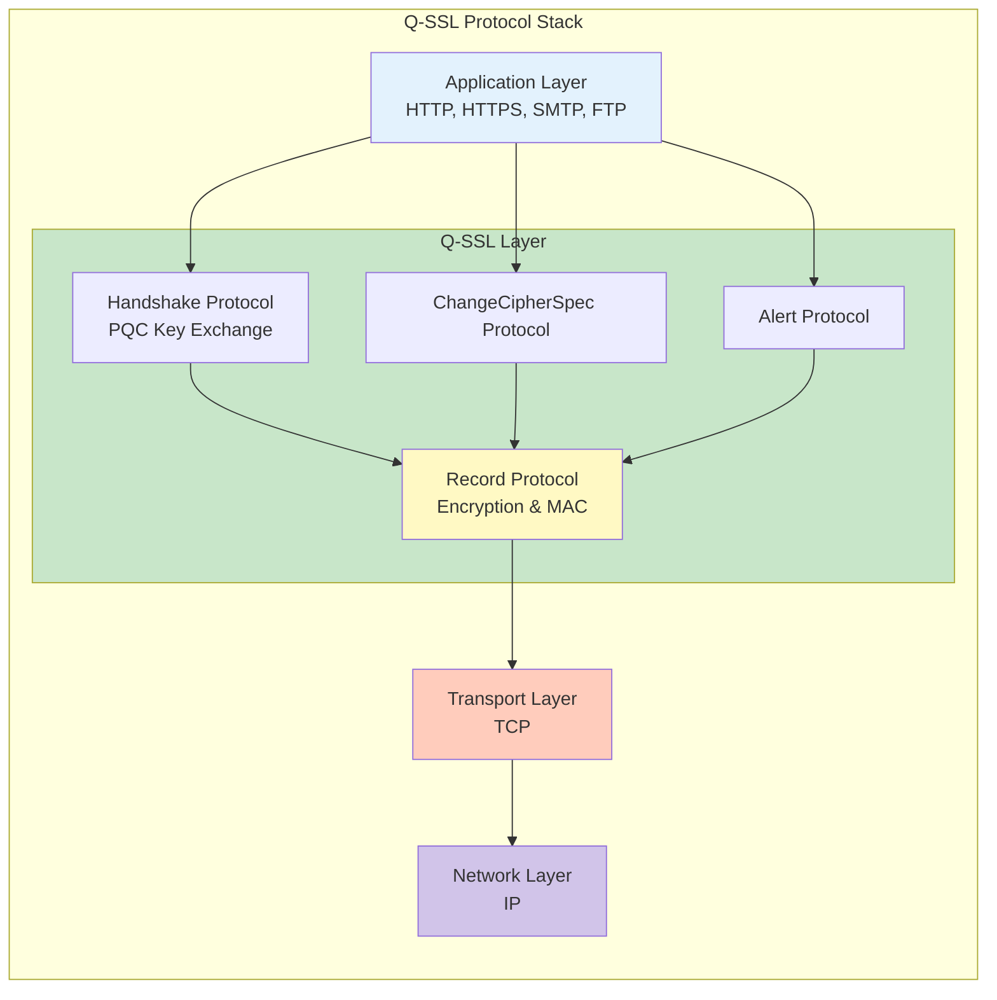
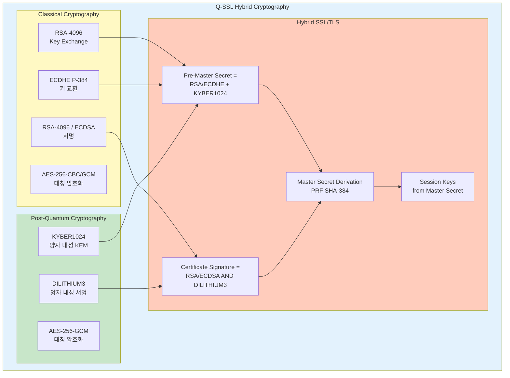
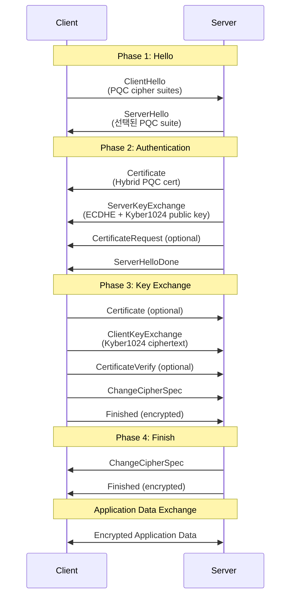
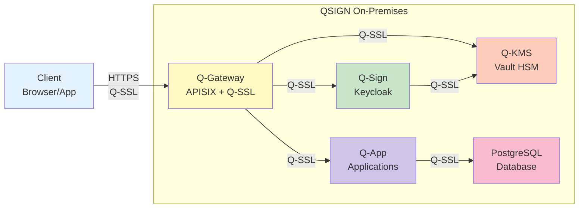

# Q-SSL 설계 문서

Q-Sign™ On-Premises Edition의 Q-SSL (Quantum-resistant Secure Sockets Layer) 아키텍처 및 설계 문서입니다.

## 📘 개요

Q-SSL은 QSIGN 시스템에서 사용하는 양자 내성 보안 소켓 계층으로, 전통적인 SSL/TLS 프로토콜에 Post-Quantum Cryptography (PQC)를 하이브리드 방식으로 통합한 차세대 보안 프로토콜입니다.

### 핵심 특징

- **Hybrid Cryptography**: 전통 암호화 + PQC 알고리즘 조합
- **Quantum Resistance**: 양자 컴퓨터 공격에 대한 내성
- **SSL/TLS Compatibility**: SSL 3.0, TLS 1.2, TLS 1.3 호환성
- **FIPS Compliance**: NIST FIPS 203/204/205 표준 준수
- **OpenSSL Integration**: OpenSSL + OQS 기반 구현

## 📖 문서 목록

### 1. [Q-SSL-OVERVIEW.md](./Q-SSL-OVERVIEW.md)
Q-SSL 개요 및 배경
- SSL/TLS 프로토콜의 역사
- 양자 위협과 PQC의 필요성
- Q-SSL이란 무엇인가
- SSL-PQC Hybrid Mode 소개
- Q-SSL vs 전통적 SSL/TLS 비교
- QSIGN에서의 Q-SSL 역할

### 2. [Q-SSL-ARCHITECTURE.md](./Q-SSL-ARCHITECTURE.md)
Q-SSL 아키텍처 설계
- 전체 아키텍처 다이어그램
- SSL/TLS 프로토콜 스택 구조
- 하이브리드 암호화 모델
- 키 교환 메커니즘 (Kyber1024 + ECDHE)
- 서명 알고리즘 (Dilithium3 + RSA/ECDSA)
- Record Layer와 Handshake Layer 구조

### 3. [Q-SSL-DESIGN.md](./Q-SSL-DESIGN.md)
상세 설계 문서
- SSL Record Protocol 설계
- SSL Handshake Protocol 상세
- ChangeCipherSpec Protocol
- Alert Protocol
- Application Data Protocol
- 에러 처리 및 복구
- 성능 최적화 전략

### 4. [HANDSHAKE-PROTOCOL.md](./HANDSHAKE-PROTOCOL.md)
SSL-PQC Hybrid 핸드셰이크 프로토콜
- ClientHello 메시지 (PQC 확장)
- ServerHello 및 알고리즘 협상
- Certificate 교환
- ServerKeyExchange (Kyber1024 KEM)
- CertificateRequest (선택사항)
- ServerHelloDone
- ClientKeyExchange
- CertificateVerify
- Finished 메시지 및 세션 설정

### 5. [CIPHER-SUITES.md](./CIPHER-SUITES.md)
암호화 스위트 및 알고리즘
- 지원 Cipher Suites 목록
- PQC 알고리즘 조합
  - TLS_KYBER1024_DILITHIUM3_WITH_AES_256_GCM_SHA384
  - TLS_HYBRID_ECDHE_KYBER1024_RSA_DILITHIUM3_WITH_AES_256_GCM_SHA384
  - TLS_HYBRID_ECDHE_KYBER768_ECDSA_DILITHIUM2_WITH_AES_128_GCM_SHA256
- Cipher Suite 협상 프로세스
- 성능 및 보안 트레이드오프
- OpenSSL Cipher Suite 설정

### 6. [SEQUENCE-DIAGRAMS.md](./SEQUENCE-DIAGRAMS.md)
Q-SSL 시퀀스 다이어그램
- 전체 SSL-PQC Hybrid 핸드셰이크
- Full Handshake (최초 연결)
- Abbreviated Handshake (세션 재개)
- 키 교환 상세 흐름
- 인증서 검증 흐름
- Session Resumption with Session ID
- Session Ticket (RFC 5077)
- 에러 처리 시나리오

### 7. [CERTIFICATE-MANAGEMENT.md](./CERTIFICATE-MANAGEMENT.md)
인증서 관리
- PQC 인증서 구조 (X.509v3 확장)
- 하이브리드 인증서 체인
- CA (Certificate Authority) 구성
- 인증서 발급 및 갱신
- CRL 및 OCSP
- Luna HSM 기반 키 보호

### 8. [IMPLEMENTATION-GUIDE.md](./IMPLEMENTATION-GUIDE.md)
Q-SSL 구현 가이드
- OpenSSL + OQS (Open Quantum Safe) 통합
- APISIX Gateway Q-SSL 설정
- Nginx Q-SSL 모듈 설정
- Apache Q-SSL 모듈 설정
- 클라이언트 라이브러리 구현
- 테스트 및 검증 방법

### 9. [INTEGRATION.md](./INTEGRATION.md)
기존 시스템 통합
- Q-Gateway (APISIX)와의 통합
- Keycloak PQC 연동
- Vault HSM 통합
- 애플리케이션 레벨 통합
- 레거시 SSL/TLS 시스템 호환성
- 마이그레이션 전략

### 10. [TESTING-VALIDATION.md](./TESTING-VALIDATION.md)
테스트 및 검증
- 기능 테스트 (Functional Testing)
- OpenSSL s_client/s_server 테스트
- 보안 테스트 (Security Testing)
- 성능 벤치마크
- 상호운용성 테스트
- 부하 테스트 (Load Testing)

## 🔐 Q-SSL 핵심 개념

### SSL/TLS Protocol Stack



### Hybrid Cryptography Model



### Q-SSL Handshake Overview



## 🎯 적용 범위

### QSIGN 시스템 내 Q-SSL 적용



## 📊 지원 프로토콜 버전

### SSL/TLS 버전 지원

| 프로토콜 | 지원 여부 | PQC 하이브리드 | 권장 사용 |
|---------|----------|---------------|----------|
| SSL 2.0 | ❌ 미지원 | - | 사용 금지 (deprecated) |
| SSL 3.0 | ❌ 미지원 | - | 사용 금지 (POODLE 취약점) |
| TLS 1.0 | ❌ 미지원 | - | 사용 금지 (deprecated) |
| TLS 1.1 | ⚠️ 제한 지원 | ❌ | 레거시 호환성만 |
| **TLS 1.2** | **✅ 완전 지원** | **✅ 하이브리드 모드** | **권장** |
| **TLS 1.3** | **✅ 완전 지원** | **✅ 하이브리드 모드** | **최우선 권장** |

### OpenSSL 버전 요구사항

```yaml
OpenSSL 버전:
  최소 요구사항: OpenSSL 1.1.1 이상
  권장 버전: OpenSSL 3.0.0 이상
  OQS-Provider: liboqs 0.9.0 이상

  설치 확인:
    - openssl version
    - openssl ciphers -v | grep -i kyber
    - openssl list -providers
```

## 🔧 빠른 시작

### Q-SSL 서버 설정 (OpenSSL)

```bash
# OpenSSL 설정 파일 (openssl.cnf)
cat > /etc/ssl/openssl-qssl.cnf << 'EOF'
openssl_conf = openssl_init

[openssl_init]
providers = provider_sect

[provider_sect]
default = default_sect
oqsprovider = oqsprovider_sect

[default_sect]
activate = 1

[oqsprovider_sect]
activate = 1
EOF

# Q-SSL 서버 실행 (TLS 1.3 + PQC)
openssl s_server \
  -accept 8443 \
  -cert /etc/ssl/certs/qssl-server-dilithium3.crt \
  -key /etc/ssl/private/qssl-server-dilithium3.key \
  -CAfile /etc/ssl/certs/qssl-ca-bundle.crt \
  -tls1_3 \
  -ciphersuites "TLS_AES_256_GCM_SHA384:TLS_CHACHA20_POLY1305_SHA256" \
  -groups "kyber1024:x25519:prime256v1" \
  -verify_return_error \
  -Verify 1
```

### Q-SSL 클라이언트 테스트

```bash
# Q-SSL 연결 테스트
openssl s_client \
  -connect localhost:8443 \
  -CAfile /etc/ssl/certs/qssl-ca-bundle.crt \
  -cert /etc/ssl/certs/qssl-client-dilithium3.crt \
  -key /etc/ssl/private/qssl-client-dilithium3.key \
  -tls1_3 \
  -ciphersuites "TLS_AES_256_GCM_SHA384" \
  -groups "kyber1024:x25519" \
  -showcerts \
  -state \
  -msg

# 연결 확인 (PQC 알고리즘 사용 여부)
echo | openssl s_client -connect localhost:8443 2>&1 | \
  grep -E "(Protocol|Cipher|Peer signature|Server Temp Key)"
```

## 📈 성능 특성

### 핸드셰이크 성능 비교

| 프로토콜 모드 | 핸드셰이크 시간 | CPU 사용량 | 메모리 | 대역폭 |
|-------------|----------------|-----------|--------|--------|
| TLS 1.2 (RSA-2048) | ~60ms | 낮음 | 10KB | 4KB |
| TLS 1.3 (ECDHE P-256) | ~35ms | 낮음 | 6KB | 2KB |
| **Q-SSL 1.2 Hybrid** | **~90ms** | **중간** | **28KB** | **18KB** |
| **Q-SSL 1.3 Hybrid** | **~70ms** | **중간** | **24KB** | **16KB** |
| Q-SSL 1.3 PQC Only | ~130ms | 높음 | 52KB | 32KB |

### 세션 재개 성능

```yaml
세션 재개 메커니즘:
  Session ID 재개:
    - 핸드셰이크 시간: ~10ms (TLS 1.2)
    - 메모리: 서버 측 세션 캐시 필요
    - 확장성: 제한적 (서버 메모리 의존)

  Session Ticket:
    - 핸드셰이크 시간: ~15ms (TLS 1.2/1.3)
    - 메모리: 클라이언트 측 티켓 저장
    - 확장성: 우수 (무상태 서버)

  TLS 1.3 0-RTT:
    - 핸드셰이크 시간: ~0ms (데이터 즉시 전송)
    - 보안: Replay 공격 주의 필요
    - 적용: 멱등성 요청만 허용
```

## 🛡️ 보안 속성

### 암호학적 보증

```yaml
보안 속성:
  기밀성 (Confidentiality):
    - 대칭 암호화: AES-256-GCM, ChaCha20-Poly1305
    - 키 교환: ECDHE P-384 + Kyber1024 hybrid
    - Perfect Forward Secrecy (PFS) 보장
    - 양자 컴퓨터 공격 내성

  무결성 (Integrity):
    - HMAC-SHA384 메시지 인증 (TLS 1.2)
    - AEAD (Authenticated Encryption) (TLS 1.3)
    - GCM/CCM 모드 인증 태그
    - 재전송 공격 방지 (sequence number)

  인증 (Authentication):
    - X.509v3 PQC 하이브리드 인증서
    - RSA-4096 + Dilithium3 dual 서명
    - ECDSA P-384 + Dilithium3 dual 서명
    - 상호 인증 (Mutual TLS) 지원

  부인 방지 (Non-Repudiation):
    - Dilithium3 디지털 서명
    - 트랜잭션 로깅 및 감사 추적
    - Luna HSM 서명 증명
```

## 📚 참고 표준

### NIST PQC Standards

```yaml
NIST FIPS:
  FIPS 203:
    - 알고리즘: ML-KEM (Kyber)
    - 용도: Key Encapsulation Mechanism
    - 보안 수준: Kyber512 (Level 1), Kyber768 (Level 3), Kyber1024 (Level 5)

  FIPS 204:
    - 알고리즘: ML-DSA (Dilithium)
    - 용도: Digital Signature Algorithm
    - 보안 수준: Dilithium2 (Level 2), Dilithium3 (Level 3), Dilithium5 (Level 5)

  FIPS 205:
    - 알고리즘: SLH-DSA (SPHINCS+)
    - 용도: Stateless Hash-Based Signature
    - 보안 수준: SPHINCS+-128s, SPHINCS+-192s, SPHINCS+-256s
```

### IETF/RFC Standards

```yaml
TLS/SSL Standards:
  RFC 6101: SSL 3.0 (deprecated)
  RFC 5246: TLS 1.2
  RFC 8446: TLS 1.3
  RFC 5280: X.509 Public Key Infrastructure
  RFC 5077: TLS Session Resumption without Server-Side State
  RFC 6066: TLS Extensions

PQC Standards:
  Draft IETF: Hybrid Post-Quantum Key Exchange in TLS 1.3
  ETSI TS 103 744: Quantum-Safe Hybrid Key Exchange
  ISO/IEC 23837-2: Post-Quantum Cryptography
```

### Industry Projects

```yaml
Open Quantum Safe (OQS):
  - liboqs: PQC 알고리즘 라이브러리
  - oqs-provider: OpenSSL 3.0 Provider
  - oqs-openssl: OpenSSL 1.1.1 fork

  GitHub: https://github.com/open-quantum-safe
  Website: https://openquantumsafe.org
```

## 🔗 관련 문서

- [01-architecture/PQC-ARCHITECTURE.md](../01-architecture/PQC-ARCHITECTURE.md) - PQC 아키텍처 개요
- [01-architecture/SECURITY-DESIGN.md](../01-architecture/SECURITY-DESIGN.md) - 보안 설계
- [02-setup/HSM-SETUP.md](../02-setup/HSM-SETUP.md) - Luna HSM 설정
- [08-q-tls/](../08-q-tls/) - Q-TLS 설계 문서
- [03-deployment/](../03-deployment/) - 배포 가이드

## 📝 문서 기여

문서 개선 및 피드백:
- 이슈 등록: GitHub Issues
- 문서 수정: Pull Request
- 질문: Discussions

---

**Last Updated**: 2025-11-16
**Version**: 1.0.0
**Status**: Design Phase
**Security Level**: FIPS 140-2 Level 3
**Compliance**: NIST FIPS 203/204/205, IETF RFC 8446
