# Q-SSL Sequence Diagrams

Q-SSL 핸드셰이크, 세션 재개, 에러 처리 등의 상세 시퀀스 다이어그램 모음입니다.

## 목차

- [1. Full Handshake (TLS 1.2)](#1-full-handshake-tls-12)
- [2. Full Handshake (TLS 1.3)](#2-full-handshake-tls-13)
- [3. Abbreviated Handshake (Session Resumption)](#3-abbreviated-handshake-session-resumption)
- [4. Session Ticket](#4-session-ticket)
- [5. Mutual TLS (mTLS)](#5-mutual-tls-mtls)
- [6. 에러 시나리오](#6-에러-시나리오)
- [7. 키 교환 상세](#7-키-교환-상세)

---

## 1. Full Handshake (TLS 1.2)

### 1.1 전체 흐름 (Hybrid PQC)

```mermaid
sequenceDiagram
    autonumber
    participant C as Client
    participant S as Server
    participant HSM as Luna HSM

    rect rgb(230, 240, 255)
        Note over C,HSM: Phase 1: Hello (협상)
        C->>S: ClientHello
        Note right of C: • TLS 1.2<br/>• Random (32B)<br/>• Cipher suites<br/>• Extensions (PQC)

        S->>C: ServerHello
        Note left of S: • Selected cipher<br/>• Random (32B)<br/>• Session ID
    end

    rect rgb(255, 240, 230)
        Note over C,HSM: Phase 2: Server Auth & Key Exchange

        S->>HSM: Load certificate
        HSM-->>S: Hybrid cert
        S->>C: Certificate
        Note left of S: • Server cert<br/>• Intermediate certs<br/>• (RSA + Dilithium3)

        S->>HSM: Generate ECDHE + Kyber keys
        HSM-->>S: Public keys
        S->>HSM: Sign params (ECDSA + Dilithium3)
        HSM-->>S: Hybrid signature

        S->>C: ServerKeyExchange
        Note left of S: • ECDHE P-384 pubkey (65B)<br/>• Kyber1024 pubkey (1568B)<br/>• Hybrid signature (~3400B)

        alt Mutual TLS
            S->>C: CertificateRequest
            Note left of S: • Client cert types<br/>• Accepted CAs
        end

        S->>C: ServerHelloDone
    end

    rect rgb(230, 255, 240)
        Note over C,HSM: Phase 3: Client Key Exchange

        alt Mutual TLS
            C->>C: Load client cert
            C->>S: Certificate
            Note right of C: • Client cert<br/>• (RSA/ECDSA + Dilithium3)
        end

        C->>C: Generate ECDHE keypair
        C->>C: ECDH compute (server pubkey)
        Note right of C: ECDHE shared secret (48B)

        C->>C: Kyber1024 Encapsulation
        Note right of C: • Kyber shared secret (32B)<br/>• Kyber ciphertext (1568B)

        C->>S: ClientKeyExchange
        Note right of C: • ECDHE pubkey (65B)<br/>• Kyber ciphertext (1568B)

        S->>HSM: ECDH compute
        HSM-->>S: ECDHE shared secret (48B)
        S->>HSM: Kyber Decapsulation
        HSM-->>S: Kyber shared secret (32B)

        alt Mutual TLS
            C->>C: Sign handshake hash
            C->>S: CertificateVerify
            Note right of C: Hybrid signature
        end

        C->>C: Hybrid Pre-Master Secret
        Note right of C: PMS = Hash(ECDHE || Kyber)

        C->>C: Master Secret Derivation
        Note right of C: MS = PRF(PMS, "master secret",<br/>ClientRandom + ServerRandom)

        C->>C: Session Keys Derivation
        Note right of C: Keys = PRF(MS, "key expansion",<br/>ServerRandom + ClientRandom)

        C->>S: ChangeCipherSpec
        C->>S: Finished (encrypted)
        Note right of C: verify_data = PRF(MS,<br/>"client finished", Hash(msgs))
    end

    rect rgb(255, 255, 230)
        Note over C,HSM: Phase 4: Server Finish

        S->>S: Hybrid Pre-Master Secret
        S->>S: Master Secret Derivation
        S->>S: Session Keys Derivation

        S->>S: Verify Client Finished
        S->>C: ChangeCipherSpec
        S->>C: Finished (encrypted)
        Note left of S: verify_data = PRF(MS,<br/>"server finished", Hash(msgs))

        C->>C: Verify Server Finished
    end

    rect rgb(240, 255, 240)
        Note over C,S: ✅ Handshake Complete (~90ms)
        C<<->>S: Application Data (encrypted)
    end
```

### 1.2 메시지 타이밍 분석

```yaml
TLS 1.2 Full Handshake 타이밍 (Hybrid PQC):

  RTT 1 (Client → Server → Client):
    - ClientHello: 0ms
    - ServerHello: +5ms (네트워크)
    - Certificate: +5ms
    - ServerKeyExchange: +5ms (ECDHE + Kyber + Sign)
    - ServerHelloDone: +5ms
    총: ~20ms

  Client Processing:
    - ECDH compute: +2ms
    - Kyber Encapsulation: +0.5ms
    - Key derivation: +1ms
    총: ~3.5ms

  RTT 2 (Client → Server):
    - ClientKeyExchange: +5ms (네트워크)
    - ChangeCipherSpec + Finished: +5ms
    총: ~10ms

  Server Processing:
    - ECDH compute: +2ms (HSM)
    - Kyber Decapsulation: +1ms (HSM)
    - Key derivation: +1ms
    - Verify Finished: +0.5ms
    총: ~4.5ms

  RTT 3 (Server → Client):
    - ChangeCipherSpec + Finished: +5ms
    총: ~5ms

  전체 핸드셰이크: ~43ms (네트워크) + ~50ms (PQC 연산) = ~93ms
```

---

## 2. Full Handshake (TLS 1.3)

### 2.1 TLS 1.3 Handshake (1-RTT)

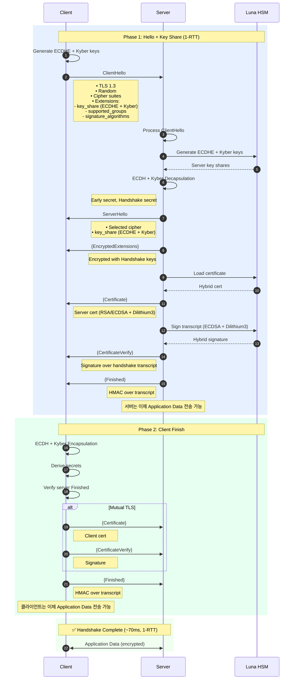

### 2.2 TLS 1.3 vs TLS 1.2 비교

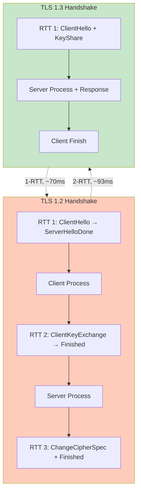

---

## 3. Abbreviated Handshake (Session Resumption)

### 3.1 Session ID 기반 재개

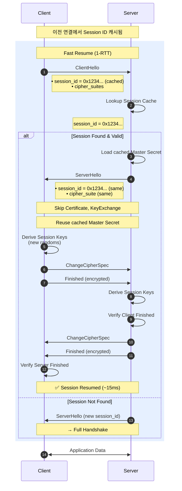

### 3.2 Session Cache 관리

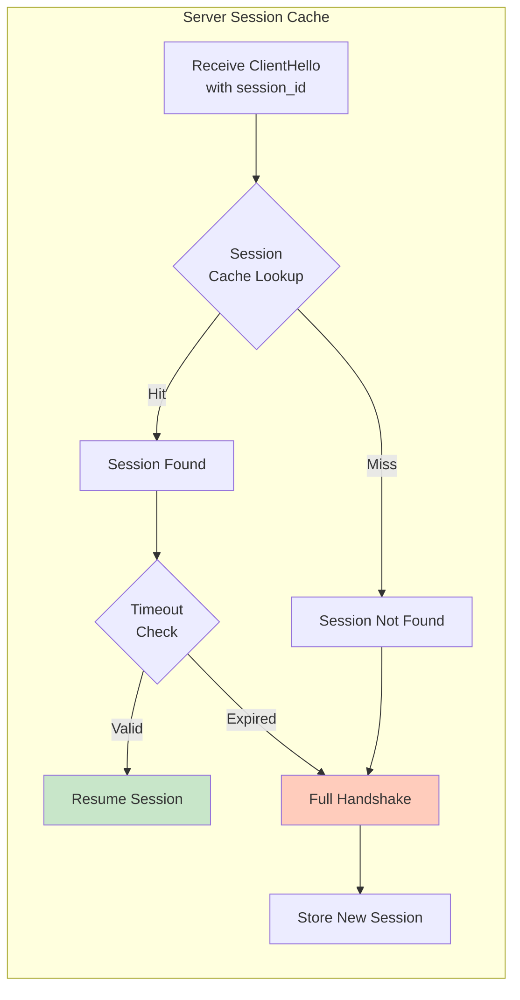

---

## 4. Session Ticket

### 4.1 Session Ticket 발급

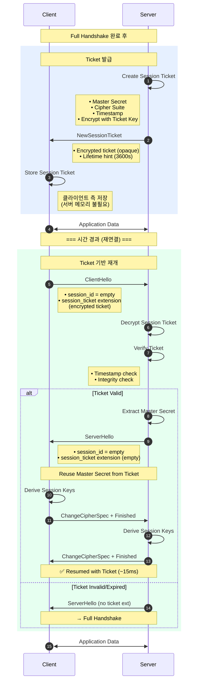

### 4.2 Session Ticket vs Session Cache

```yaml
Session Resumption 방식 비교:

  Session Cache (Session ID):
    저장 위치: 서버 메모리
    확장성: 제한적 (서버당 캐시 크기)
    로드밸런싱: 어려움 (세션 affinity 필요)
    장점:
      - 구현 간단
      - 빠른 lookup
    단점:
      - 서버 메모리 사용
      - 클러스터 환경에서 복잡

  Session Ticket (RFC 5077):
    저장 위치: 클라이언트 (encrypted)
    확장성: 무제한 (stateless 서버)
    로드밸런싱: 쉬움 (모든 서버가 ticket 복호화 가능)
    장점:
      - 서버 메모리 절약
      - 클러스터 친화적
      - 수평 확장 용이
    단점:
      - Ticket 암호화/복호화 오버헤드
      - Ticket key 관리 필요
      - Forward secrecy 약화 (ticket key 노출 시)

  QSIGN 권장: Session Ticket (확장성 우선)
```

---

## 5. Mutual TLS (mTLS)

### 5.1 mTLS 전체 흐름

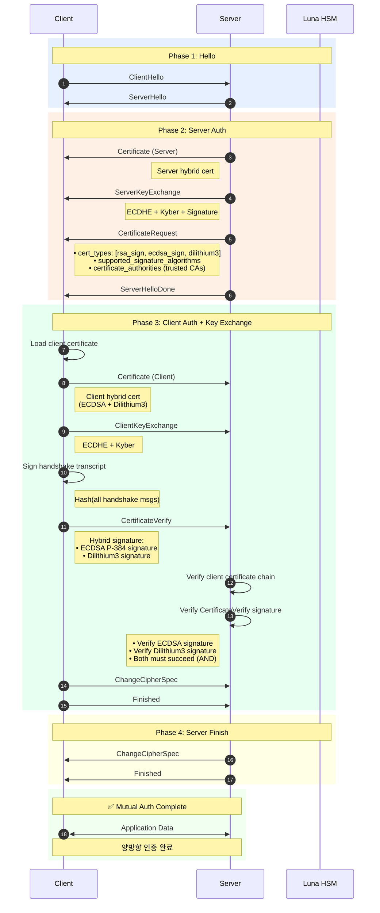

### 5.2 CertificateRequest 메시지

```yaml
CertificateRequest Message:

  구조:
    - certificate_types (1+ bytes):
        1: rsa_sign
        64: ecdsa_sign
        128: dilithium3 (experimental)

    - supported_signature_algorithms (TLS 1.2+):
        - ecdsa_secp384r1_sha384 (0x0503)
        - rsa_pss_rsae_sha384 (0x0804)
        - dilithium3 (0x0800)

    - certificate_authorities (0+ bytes):
        - DN (Distinguished Name) 리스트
        - 예: "CN=QSIGN Root CA, O=QSIGN, C=KR"

  클라이언트 동작:
    1. 요청된 cert_types 확인
    2. 신뢰할 수 있는 CA 확인
    3. 적합한 클라이언트 인증서 선택
    4. 인증서 전송
    5. CertificateVerify로 소유 증명
```

### 5.3 CertificateVerify 검증

```python
# CertificateVerify 검증 (Hybrid)

def verify_certificate_verify(
    handshake_messages,
    certificate_verify_msg,
    client_public_keys
):
    """
    CertificateVerify 메시지 검증 (Hybrid)

    Args:
        handshake_messages: ClientHello ~ ClientKeyExchange (Finished 제외)
        certificate_verify_msg: CertificateVerify 메시지
        client_public_keys: {
            'ecdsa': client_ecdsa_public_key,
            'dilithium': client_dilithium_public_key
        }

    Returns:
        True if both signatures valid
    """
    import hashlib
    from cryptography.hazmat.primitives.asymmetric import ec
    from cryptography.hazmat.primitives import hashes

    # 1. Handshake transcript hash
    transcript_hash = hashlib.sha384(handshake_messages).digest()

    # 2. Parse CertificateVerify
    #    signature_algorithm (2 bytes) + signature_length (2 bytes) + signature
    sig_algorithm = int.from_bytes(certificate_verify_msg[0:2], 'big')
    sig_length = int.from_bytes(certificate_verify_msg[2:4], 'big')
    signature_data = certificate_verify_msg[4:4+sig_length]

    # 3. Hybrid signature parsing
    #    ECDSA signature (96 bytes for P-384) + Dilithium3 signature (~3293 bytes)
    ecdsa_sig = signature_data[:96]
    dilithium_sig = signature_data[96:]

    # 4. Verify ECDSA signature
    try:
        client_public_keys['ecdsa'].verify(
            ecdsa_sig,
            transcript_hash,
            ec.ECDSA(hashes.SHA384())
        )
        ecdsa_valid = True
    except:
        ecdsa_valid = False

    # 5. Verify Dilithium3 signature
    try:
        # import oqs
        # verifier = oqs.Signature("Dilithium3", client_public_keys['dilithium'])
        # dilithium_valid = verifier.verify(transcript_hash, dilithium_sig, ...)
        dilithium_valid = True  # pseudo-code
    except:
        dilithium_valid = False

    # 6. Both signatures must be valid (AND condition)
    return ecdsa_valid and dilithium_valid

# 사용 예시
# is_valid = verify_certificate_verify(handshake_msgs, cert_verify, client_keys)
# if not is_valid:
#     send_alert(AlertLevel.FATAL, AlertDescription.DECRYPT_ERROR)
#     close_connection()
```

---

## 6. 에러 시나리오

### 6.1 인증서 검증 실패

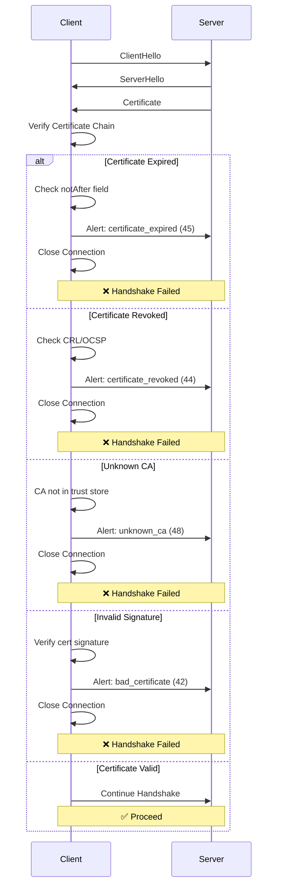

### 6.2 Cipher Suite 협상 실패

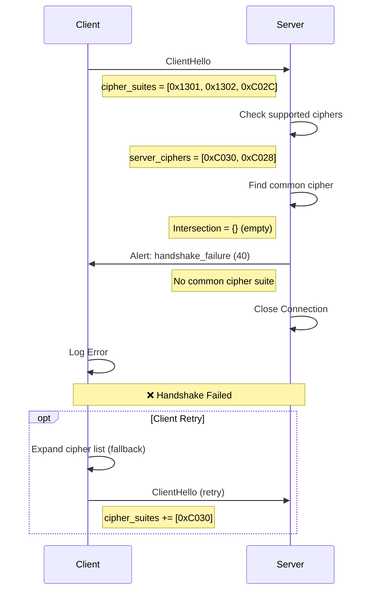

### 6.3 Finished 검증 실패

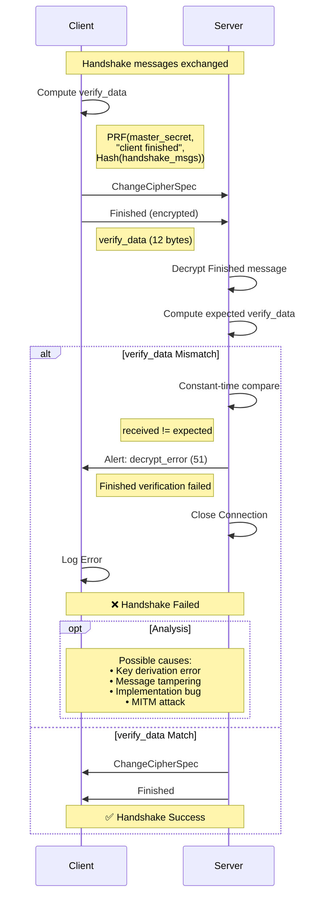

---

## 7. 키 교환 상세

### 7.1 Hybrid 키 교환 세부 흐름

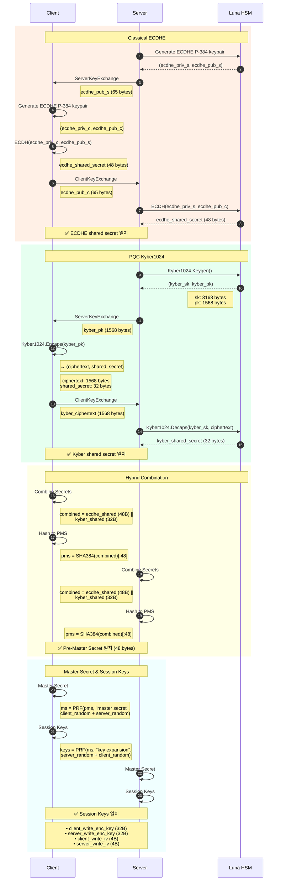

### 7.2 키 유도 트리

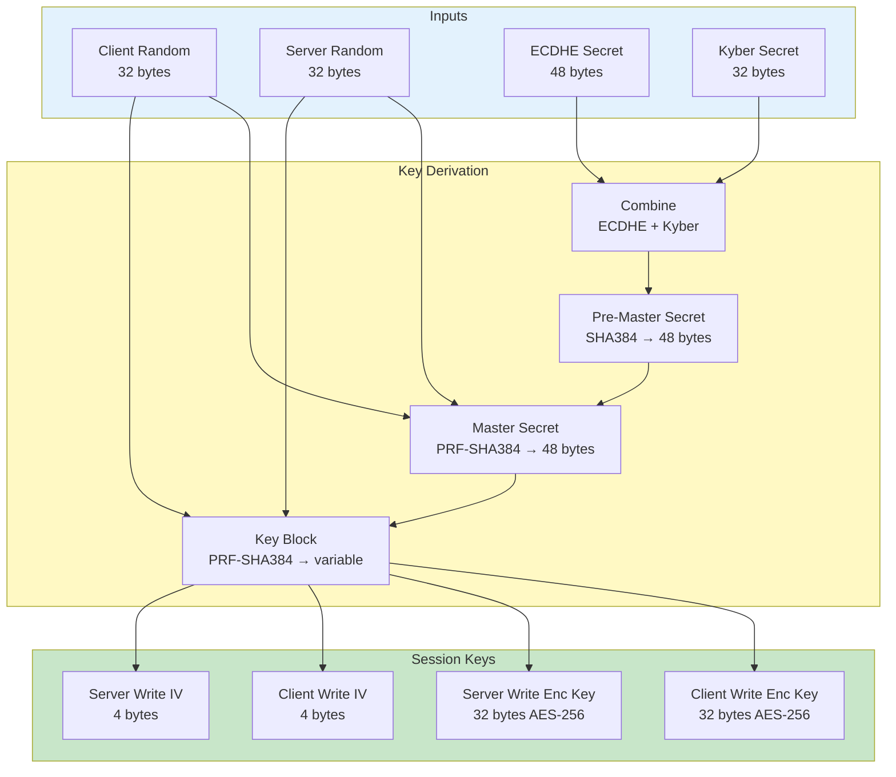

### 7.3 보안 속성

```yaml
Hybrid 키 교환 보안 속성:

  1. Perfect Forward Secrecy (PFS):
     - ECDHE: 세션별 임시 키 생성
     - Kyber: KEM 세션별 독립적 캡슐화
     - 개인키 노출되어도 과거 세션 안전

  2. Quantum Resistance:
     - ECDHE: 양자 컴퓨터에 취약 (Shor's algorithm)
     - Kyber1024: 양자 안전 (256-bit security)
     - Hybrid: min(ECDHE, Kyber) = Quantum-safe

  3. Security Level:
     - Classical: min(ECDHE P-384, Kyber1024) = 192-bit
     - Quantum: Kyber1024 = 256-bit equivalent
     - 전체: 256-bit quantum-resistant

  4. Attack Resistance:
     - MITM: 서명으로 방지
     - Replay: Nonce (random) 사용
     - Downgrade: TLS version in Finished verify_data
     - Key Compromise: PFS로 과거 세션 보호

  5. Hybrid 보안 원칙:
     - 둘 중 하나만 안전해도 전체 안전
     - Classical 깨져도 Kyber로 보호
     - Kyber 깨져도 Classical로 보호 (현재)
```

---

## 요약

### Q-SSL Sequence 핵심

1. **Full Handshake**: TLS 1.2 (2-RTT, ~90ms), TLS 1.3 (1-RTT, ~70ms)
2. **Session Resumption**: Session ID 또는 Session Ticket (~15ms)
3. **mTLS**: 양방향 인증, CertificateVerify로 소유 증명
4. **Hybrid 키 교환**: ECDHE + Kyber → Quantum-safe PMS
5. **에러 처리**: Certificate, Cipher, Finished 검증 실패 시나리오

### 성능 최적화

- Session resumption으로 핸드셰이크 시간 80% 감소
- TLS 1.3으로 1-RTT 달성
- Session ticket으로 서버 확장성 향상

### 다음 단계

- [IMPLEMENTATION-GUIDE.md](./IMPLEMENTATION-GUIDE.md) - Q-SSL 구현 가이드
- [TESTING-VALIDATION.md](./TESTING-VALIDATION.md) - 테스트 및 검증
- [INTEGRATION.md](./INTEGRATION.md) - 시스템 통합

---

**Last Updated**: 2025-11-16
**Version**: 1.0.0
**Security Level**: FIPS 140-2 Level 3
