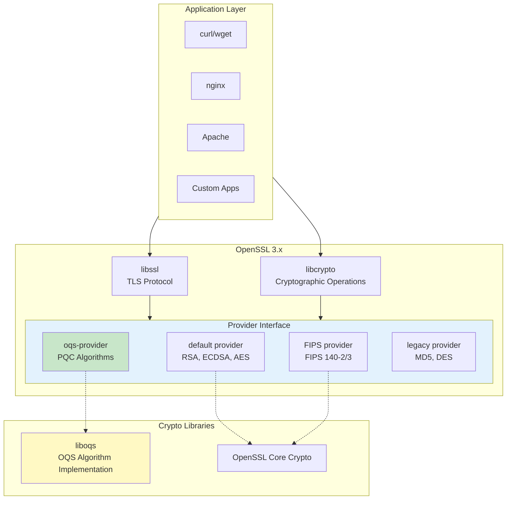
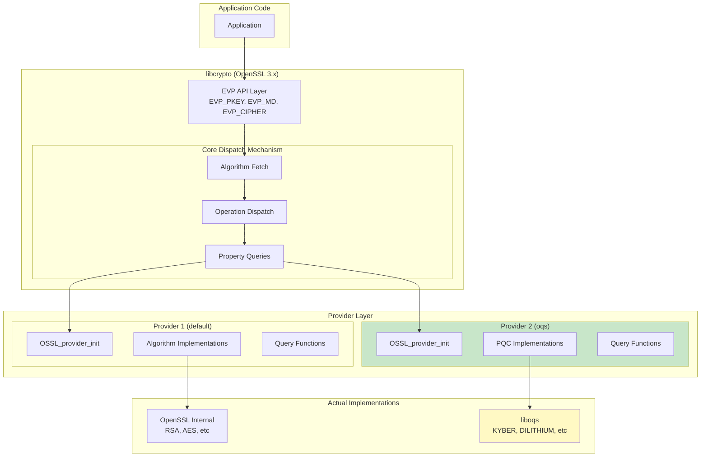
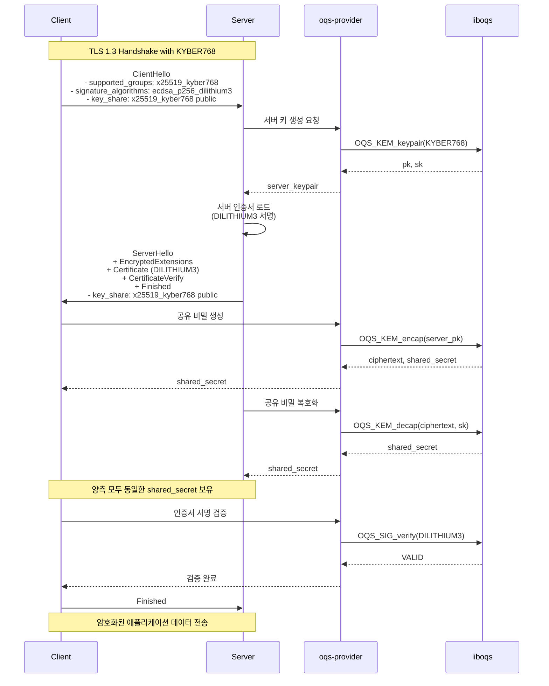
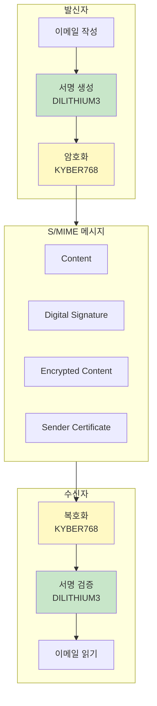
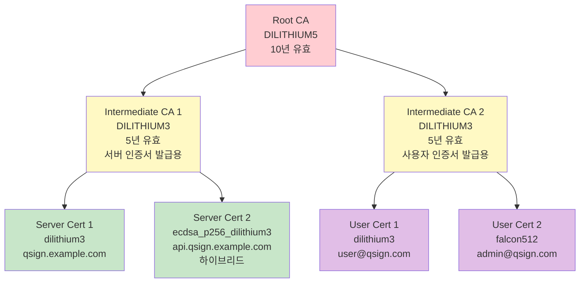

# OpenSSL OQS Provider

OpenSSL 3.x용 양자 내성 암호화(PQC) Provider 구현 가이드입니다.

## 목차

- [1. oqs-provider 개요](#1-oqs-provider-개요)
- [2. OpenSSL 3.x Provider 인터페이스](#2-openssl-3x-provider-인터페이스)
- [3. 설치 및 설정](#3-설치-및-설정)
- [4. TLS 1.3 with PQC](#4-tls-13-with-pqc)
- [5. S/MIME with PQC](#5-smime-with-pqc)
- [6. X.509 인증서 with PQC](#6-x509-인증서-with-pqc)
- [7. PKCS#12, PKCS#7 지원](#7-pkcs12-pkcs7-지원)
- [8. 설정 예제 (openssl.cnf)](#8-설정-예제-opensslcnf)
- [9. 코드 예제](#9-코드-예제)
- [10. 성능 최적화](#10-성능-최적화)
- [11. 트러블슈팅](#11-트러블슈팅)

---

## 1. oqs-provider 개요

### 1.1 oqs-provider란?



### 1.2 주요 특징

```yaml
oqs-provider 특징:
  OpenSSL 통합:
    - OpenSSL 3.0+ 완전 호환
    - 기존 OpenSSL API 유지
    - 플러그인 방식 (동적 로딩)
    - 멀티 프로바이더 동시 사용 가능

  지원 알고리즘:
    KEM (Key Encapsulation):
      - KYBER512, KYBER768, KYBER1024
      - NTRU-HPS-2048-509, NTRU-HRSS-701
      - Classic McEliece
      - BIKE, HQC, SABER

    서명 (Digital Signature):
      - DILITHIUM2, DILITHIUM3, DILITHIUM5
      - FALCON512, FALCON1024
      - SPHINCS+-SHA256, SPHINCS+-SHAKE256

    하이브리드 모드:
      - X25519-KYBER768
      - ECDSA-P256-DILITHIUM3
      - RSA3072-FALCON512

  기능:
    - TLS 1.3 핸드셰이크 (PQC KEM)
    - X.509 인증서 (PQC 서명)
    - S/MIME 암호화/서명
    - CMS (Cryptographic Message Syntax)
    - PKCS#12 (인증서 번들)
    - PKCS#7 (서명/암호화 메시지)
```

### 1.3 아키텍처

```mermaid
graph LR
    subgraph APPS["Applications"]
        direction TB
        A1[OpenSSL CLI]
        A2[Apache/nginx]
        A3[Custom C/C++ Apps]
    end

    subgraph OPENSSL3["OpenSSL 3.x Core"]
        direction TB
        EVP[EVP API<br/>High-level Interface]

        subgraph CORE["Core Dispatcher"]
            KEYGEN[Key Generation]
            SIGN[Sign/Verify]
            ENCAP[Encapsulate/Decapsulate]
            CIPHER[Encrypt/Decrypt]
        end
    end

    subgraph PROVIDERS["Providers"]
        direction TB

        subgraph OQS_PROV["oqs-provider"]
            OQS_KEYMGMT[Key Management<br/>PQC Keys]
            OQS_SIG[Signature Ops<br/>DILITHIUM, FALCON]
            OQS_KEM[KEM Ops<br/>KYBER, etc]
            OQS_ENCODER[Encoder/Decoder<br/>PEM, DER]
        end

        subgraph DEF_PROV["default provider"]
            DEF_RSA[RSA]
            DEF_EC[ECDSA]
            DEF_AES[AES-GCM]
        end
    end

    subgraph IMPL["Implementation"]
        LIBOQS[liboqs<br/>PQC Algorithms]
        OPENSSL_IMPL[OpenSSL Crypto]
    end

    APPS --> EVP
    EVP --> CORE
    CORE --> OQS_PROV
    CORE --> DEF_PROV

    OQS_PROV --> LIBOQS
    DEF_PROV --> OPENSSL_IMPL

    style OQS_PROV fill:#c8e6c9
    style LIBOQS fill:#fff9c4
```



### 1.4 버전 호환성

| 구성 요소 | 최소 버전 | 권장 버전 | 비고 |
|---------|---------|---------|-----|
| **OpenSSL** | 3.0.0 | 3.2.0+ | Provider 인터페이스 필수 |
| **liboqs** | 0.8.0 | 0.10.0+ | NIST Round 3 알고리즘 |
| **oqs-provider** | 0.5.0 | 0.6.0+ | 최신 OpenSSL 호환 |
| **GCC/Clang** | 7.0 | 11.0+ | C99 지원 |
| **CMake** | 3.15 | 3.25+ | 빌드 시스템 |

---

## 2. OpenSSL 3.x Provider 인터페이스

### 2.1 Provider 아키텍처



### 2.2 Provider 초기화

```c
// oqs-provider 초기화 구조
#include <openssl/provider.h>
#include <openssl/core.h>
#include <openssl/core_dispatch.h>

/* Provider entry point - OpenSSL이 자동 호출 */
OSSL_provider_init_fn OSSL_provider_init;

int OSSL_provider_init(const OSSL_CORE_HANDLE *handle,
                       const OSSL_DISPATCH *in,
                       const OSSL_DISPATCH **out,
                       void **provctx)
{
    /* 1. Provider context 생성 */
    PROV_OQS_CTX *ctx = OPENSSL_zalloc(sizeof(*ctx));
    if (ctx == NULL)
        return 0;

    ctx->handle = handle;

    /* 2. Core functions 가져오기 */
    for (; in->function_id != 0; in++) {
        switch (in->function_id) {
        case OSSL_FUNC_CORE_GET_LIBCTX:
            ctx->get_libctx = OSSL_FUNC_core_get_libctx(in);
            break;
        case OSSL_FUNC_CORE_GET_PARAMS:
            ctx->get_params = OSSL_FUNC_core_get_params(in);
            break;
        /* ... 기타 core functions */
        }
    }

    /* 3. liboqs 초기화 */
    OQS_init();

    /* 4. Dispatch table 반환 */
    *out = oqs_provider_dispatch_table;
    *provctx = ctx;

    return 1;
}

/* Provider의 dispatch table */
static const OSSL_DISPATCH oqs_provider_dispatch_table[] = {
    /* Provider 기본 정보 */
    { OSSL_FUNC_PROVIDER_QUERY_OPERATION,
      (void (*)(void))oqs_query_operation },
    { OSSL_FUNC_PROVIDER_GET_PARAMS,
      (void (*)(void))oqs_get_params },
    { OSSL_FUNC_PROVIDER_GET_REASON_STRINGS,
      (void (*)(void))oqs_get_reason_strings },
    { OSSL_FUNC_PROVIDER_TEARDOWN,
      (void (*)(void))oqs_teardown },

    { 0, NULL }
};
```

### 2.3 알고리즘 제공

```c
/* 알고리즘 query 함수 */
static const OSSL_ALGORITHM *oqs_query_operation(void *provctx,
                                                  int operation_id,
                                                  int *no_cache)
{
    *no_cache = 0;

    switch (operation_id) {
    case OSSL_OP_KEYMGMT:
        return oqs_keymgmt_algorithms;  // 키 관리
    case OSSL_OP_SIGNATURE:
        return oqs_signature_algorithms; // 서명
    case OSSL_OP_KEM:
        return oqs_kem_algorithms;       // KEM
    case OSSL_OP_ENCODER:
        return oqs_encoder_algorithms;   // 인코더
    case OSSL_OP_DECODER:
        return oqs_decoder_algorithms;   // 디코더
    }

    return NULL;
}

/* 키 관리 알고리즘 테이블 */
static const OSSL_ALGORITHM oqs_keymgmt_algorithms[] = {
    /* DILITHIUM */
    { "dilithium2", "provider=oqs", oqs_dilithium2_keymgmt_functions },
    { "dilithium3", "provider=oqs", oqs_dilithium3_keymgmt_functions },
    { "dilithium5", "provider=oqs", oqs_dilithium5_keymgmt_functions },

    /* FALCON */
    { "falcon512", "provider=oqs", oqs_falcon512_keymgmt_functions },
    { "falcon1024", "provider=oqs", oqs_falcon1024_keymgmt_functions },

    /* KYBER (KEM) */
    { "kyber512", "provider=oqs", oqs_kyber512_keymgmt_functions },
    { "kyber768", "provider=oqs", oqs_kyber768_keymgmt_functions },
    { "kyber1024", "provider=oqs", oqs_kyber1024_keymgmt_functions },

    /* Hybrid */
    { "p256_dilithium3", "provider=oqs", oqs_p256_dilithium3_keymgmt_functions },
    { "x25519_kyber768", "provider=oqs", oqs_x25519_kyber768_keymgmt_functions },

    { NULL, NULL, NULL }
};

/* 서명 알고리즘 테이블 */
static const OSSL_ALGORITHM oqs_signature_algorithms[] = {
    { "dilithium2", "provider=oqs", oqs_dilithium2_signature_functions },
    { "dilithium3", "provider=oqs", oqs_dilithium3_signature_functions },
    { "dilithium5", "provider=oqs", oqs_dilithium5_signature_functions },
    { "falcon512", "provider=oqs", oqs_falcon512_signature_functions },
    { "falcon1024", "provider=oqs", oqs_falcon1024_signature_functions },

    /* Hybrid signature */
    { "p256_dilithium3", "provider=oqs", oqs_p256_dilithium3_signature_functions },
    { "rsa3072_falcon512", "provider=oqs", oqs_rsa3072_falcon512_signature_functions },

    { NULL, NULL, NULL }
};
```

### 2.4 Key Management 구현

```c
/* DILITHIUM3 키 관리 함수 */
static const OSSL_DISPATCH oqs_dilithium3_keymgmt_functions[] = {
    { OSSL_FUNC_KEYMGMT_NEW, (void (*)(void))dilithium3_new },
    { OSSL_FUNC_KEYMGMT_FREE, (void (*)(void))dilithium3_free },
    { OSSL_FUNC_KEYMGMT_GEN_INIT, (void (*)(void))dilithium3_gen_init },
    { OSSL_FUNC_KEYMGMT_GEN, (void (*)(void))dilithium3_gen },
    { OSSL_FUNC_KEYMGMT_GEN_CLEANUP, (void (*)(void))dilithium3_gen_cleanup },
    { OSSL_FUNC_KEYMGMT_LOAD, (void (*)(void))dilithium3_load },
    { OSSL_FUNC_KEYMGMT_GET_PARAMS, (void (*)(void))dilithium3_get_params },
    { OSSL_FUNC_KEYMGMT_GETTABLE_PARAMS, (void (*)(void))dilithium3_gettable_params },
    { OSSL_FUNC_KEYMGMT_HAS, (void (*)(void))dilithium3_has },
    { OSSL_FUNC_KEYMGMT_MATCH, (void (*)(void))dilithium3_match },
    { OSSL_FUNC_KEYMGMT_IMPORT, (void (*)(void))dilithium3_import },
    { OSSL_FUNC_KEYMGMT_IMPORT_TYPES, (void (*)(void))dilithium3_import_types },
    { OSSL_FUNC_KEYMGMT_EXPORT, (void (*)(void))dilithium3_export },
    { OSSL_FUNC_KEYMGMT_EXPORT_TYPES, (void (*)(void))dilithium3_export_types },
    { 0, NULL }
};

/* 키 생성 구현 */
static void *dilithium3_gen(void *genctx, OSSL_CALLBACK *osslcb, void *cbarg)
{
    struct dilithium3_gen_ctx *gctx = genctx;
    struct dilithium3_key *key;
    OQS_SIG *oqs_sig;

    if (gctx == NULL)
        return NULL;

    key = OPENSSL_zalloc(sizeof(*key));
    if (key == NULL)
        return NULL;

    /* liboqs DILITHIUM3 객체 생성 */
    oqs_sig = OQS_SIG_new(OQS_SIG_alg_dilithium_3);
    if (oqs_sig == NULL) {
        OPENSSL_free(key);
        return NULL;
    }

    /* 키 버퍼 할당 */
    key->pubkey = OPENSSL_malloc(oqs_sig->length_public_key);
    key->privkey = OPENSSL_secure_malloc(oqs_sig->length_secret_key);

    if (key->pubkey == NULL || key->privkey == NULL) {
        dilithium3_free(key);
        OQS_SIG_free(oqs_sig);
        return NULL;
    }

    /* 키 생성 */
    if (OQS_SIG_keypair(oqs_sig, key->pubkey, key->privkey) != OQS_SUCCESS) {
        dilithium3_free(key);
        OQS_SIG_free(oqs_sig);
        return NULL;
    }

    key->pubkey_len = oqs_sig->length_public_key;
    key->privkey_len = oqs_sig->length_secret_key;

    OQS_SIG_free(oqs_sig);

    return key;
}
```

### 2.5 Signature 구현

```c
/* DILITHIUM3 서명 함수 */
static const OSSL_DISPATCH oqs_dilithium3_signature_functions[] = {
    { OSSL_FUNC_SIGNATURE_NEWCTX, (void (*)(void))dilithium3_sig_newctx },
    { OSSL_FUNC_SIGNATURE_FREECTX, (void (*)(void))dilithium3_sig_freectx },
    { OSSL_FUNC_SIGNATURE_SIGN_INIT, (void (*)(void))dilithium3_sign_init },
    { OSSL_FUNC_SIGNATURE_SIGN, (void (*)(void))dilithium3_sign },
    { OSSL_FUNC_SIGNATURE_VERIFY_INIT, (void (*)(void))dilithium3_verify_init },
    { OSSL_FUNC_SIGNATURE_VERIFY, (void (*)(void))dilithium3_verify },
    { OSSL_FUNC_SIGNATURE_DIGEST_SIGN_INIT, (void (*)(void))dilithium3_digest_sign_init },
    { OSSL_FUNC_SIGNATURE_DIGEST_SIGN_UPDATE, (void (*)(void))dilithium3_digest_sign_update },
    { OSSL_FUNC_SIGNATURE_DIGEST_SIGN_FINAL, (void (*)(void))dilithium3_digest_sign_final },
    { OSSL_FUNC_SIGNATURE_DIGEST_VERIFY_INIT, (void (*)(void))dilithium3_digest_verify_init },
    { OSSL_FUNC_SIGNATURE_DIGEST_VERIFY_UPDATE, (void (*)(void))dilithium3_digest_verify_update },
    { OSSL_FUNC_SIGNATURE_DIGEST_VERIFY_FINAL, (void (*)(void))dilithium3_digest_verify_final },
    { 0, NULL }
};

/* 서명 생성 */
static int dilithium3_sign(void *ctx, unsigned char *sig, size_t *siglen,
                           size_t sigsize, const unsigned char *tbs, size_t tbslen)
{
    struct dilithium3_sig_ctx *sctx = ctx;
    OQS_SIG *oqs_sig;
    size_t actual_siglen;

    if (sctx == NULL || sctx->key == NULL || sctx->key->privkey == NULL)
        return 0;

    oqs_sig = OQS_SIG_new(OQS_SIG_alg_dilithium_3);
    if (oqs_sig == NULL)
        return 0;

    /* 서명 크기만 반환 (sig == NULL인 경우) */
    if (sig == NULL) {
        *siglen = oqs_sig->length_signature;
        OQS_SIG_free(oqs_sig);
        return 1;
    }

    /* 버퍼 크기 확인 */
    if (sigsize < oqs_sig->length_signature) {
        OQS_SIG_free(oqs_sig);
        return 0;
    }

    /* 서명 생성 */
    if (OQS_SIG_sign(oqs_sig, sig, &actual_siglen, tbs, tbslen,
                     sctx->key->privkey) != OQS_SUCCESS) {
        OQS_SIG_free(oqs_sig);
        return 0;
    }

    *siglen = actual_siglen;
    OQS_SIG_free(oqs_sig);

    return 1;
}

/* 서명 검증 */
static int dilithium3_verify(void *ctx, const unsigned char *sig, size_t siglen,
                             const unsigned char *tbs, size_t tbslen)
{
    struct dilithium3_sig_ctx *sctx = ctx;
    OQS_SIG *oqs_sig;
    int ret;

    if (sctx == NULL || sctx->key == NULL || sctx->key->pubkey == NULL)
        return 0;

    oqs_sig = OQS_SIG_new(OQS_SIG_alg_dilithium_3);
    if (oqs_sig == NULL)
        return 0;

    /* 서명 검증 */
    ret = OQS_SIG_verify(oqs_sig, tbs, tbslen, sig, siglen,
                         sctx->key->pubkey);

    OQS_SIG_free(oqs_sig);

    return (ret == OQS_SUCCESS) ? 1 : 0;
}
```

---

## 3. 설치 및 설정

### 3.1 사전 요구사항

```bash
# Ubuntu/Debian
sudo apt-get update
sudo apt-get install -y \
    build-essential \
    cmake \
    git \
    libssl-dev \
    ninja-build \
    astyle \
    doxygen \
    graphviz \
    python3-pytest \
    python3-pytest-xdist \
    unzip \
    xsltproc

# RHEL/CentOS/Rocky Linux
sudo dnf install -y \
    gcc \
    gcc-c++ \
    cmake \
    git \
    openssl-devel \
    ninja-build \
    astyle \
    doxygen \
    graphviz \
    python3-pytest \
    unzip

# macOS
brew install cmake ninja openssl@3 astyle doxygen graphviz
```

### 3.2 liboqs 빌드 및 설치

```bash
#!/bin/bash
# install-liboqs.sh

set -e

# 변수 설정
LIBOQS_VERSION="0.10.0"
INSTALL_PREFIX="/usr/local"
BUILD_TYPE="Release"

echo "==> liboqs ${LIBOQS_VERSION} 설치 시작..."

# 소스 다운로드
cd /tmp
wget https://github.com/open-quantum-safe/liboqs/archive/refs/tags/${LIBOQS_VERSION}.tar.gz
tar xzf ${LIBOQS_VERSION}.tar.gz
cd liboqs-${LIBOQS_VERSION}

# 빌드 디렉토리 생성
mkdir -p build
cd build

# CMake 설정
cmake -G Ninja \
    -DCMAKE_INSTALL_PREFIX=${INSTALL_PREFIX} \
    -DCMAKE_BUILD_TYPE=${BUILD_TYPE} \
    -DBUILD_SHARED_LIBS=ON \
    -DOQS_BUILD_ONLY_LIB=OFF \
    -DOQS_DIST_BUILD=ON \
    -DOQS_USE_OPENSSL=ON \
    ..

# 빌드
ninja

# 테스트 (선택사항)
ninja run_tests

# 설치
sudo ninja install

# 라이브러리 경로 업데이트
sudo ldconfig

echo "==> liboqs 설치 완료!"
liboqs_version=$(pkg-config --modversion liboqs)
echo "    설치된 버전: ${liboqs_version}"
```

### 3.3 OpenSSL 3.x 빌드 (선택사항)

```bash
#!/bin/bash
# install-openssl3.sh - 시스템에 OpenSSL 3.x가 없는 경우

set -e

OPENSSL_VERSION="3.2.1"
INSTALL_PREFIX="/usr/local/openssl3"

echo "==> OpenSSL ${OPENSSL_VERSION} 설치 시작..."

cd /tmp
wget https://www.openssl.org/source/openssl-${OPENSSL_VERSION}.tar.gz
tar xzf openssl-${OPENSSL_VERSION}.tar.gz
cd openssl-${OPENSSL_VERSION}

# Configure
./Configure \
    --prefix=${INSTALL_PREFIX} \
    --openssldir=${INSTALL_PREFIX} \
    shared \
    enable-fips

# Build
make -j$(nproc)

# Test (선택사항)
make test

# Install
sudo make install

# 환경 변수 설정
cat << EOF | sudo tee /etc/profile.d/openssl3.sh
export PATH="${INSTALL_PREFIX}/bin:\$PATH"
export LD_LIBRARY_PATH="${INSTALL_PREFIX}/lib64:\$LD_LIBRARY_PATH"
export PKG_CONFIG_PATH="${INSTALL_PREFIX}/lib64/pkgconfig:\$PKG_CONFIG_PATH"
EOF

source /etc/profile.d/openssl3.sh

echo "==> OpenSSL 설치 완료!"
openssl version
```

### 3.4 oqs-provider 빌드 및 설치

```bash
#!/bin/bash
# install-oqs-provider.sh

set -e

OQS_PROVIDER_VERSION="0.6.0"
OPENSSL_ROOT="/usr/local/openssl3"  # OpenSSL 3.x 설치 경로
LIBOQS_ROOT="/usr/local"            # liboqs 설치 경로

echo "==> oqs-provider ${OQS_PROVIDER_VERSION} 설치 시작..."

cd /tmp
git clone --depth 1 --branch ${OQS_PROVIDER_VERSION} \
    https://github.com/open-quantum-safe/oqs-provider.git
cd oqs-provider

# 빌드 디렉토리 생성
mkdir -p _build
cd _build

# CMake 설정
cmake -G Ninja \
    -DCMAKE_BUILD_TYPE=Release \
    -DOPENSSL_ROOT_DIR=${OPENSSL_ROOT} \
    -Dliboqs_DIR=${LIBOQS_ROOT} \
    -DCMAKE_PREFIX_PATH=${LIBOQS_ROOT} \
    ..

# 빌드
ninja

# 테스트
ctest --output-on-failure

# 설치
sudo ninja install

echo "==> oqs-provider 설치 완료!"

# Provider 위치 확인
PROVIDER_PATH=$(find ${OPENSSL_ROOT} -name "oqsprovider.so" 2>/dev/null | head -1)
echo "    Provider 경로: ${PROVIDER_PATH}"
```

### 3.5 설치 검증

```bash
#!/bin/bash
# verify-oqs-installation.sh

set -e

echo "==> OQS 설치 검증..."

# 1. liboqs 확인
echo ""
echo "1. liboqs 버전:"
pkg-config --modversion liboqs

# 2. OpenSSL 버전
echo ""
echo "2. OpenSSL 버전:"
openssl version

# 3. Provider 목록
echo ""
echo "3. 사용 가능한 Provider:"
openssl list -providers

# 4. OQS 알고리즘 목록
echo ""
echo "4. OQS 서명 알고리즘:"
openssl list -signature-algorithms -provider oqsprovider | grep -i "dilithium\|falcon\|sphincs"

echo ""
echo "5. OQS KEM 알고리즘:"
openssl list -kem-algorithms -provider oqsprovider 2>/dev/null | grep -i "kyber\|ntru" || \
    openssl list -keyexch-algorithms -provider oqsprovider | grep -i "kyber"

# 6. 간단한 키 생성 테스트
echo ""
echo "6. DILITHIUM3 키 생성 테스트:"
openssl genpkey -algorithm dilithium3 -out /tmp/test_dilithium3.pem -provider oqsprovider
if [ -f /tmp/test_dilithium3.pem ]; then
    echo "   ✓ 키 생성 성공!"
    rm -f /tmp/test_dilithium3.pem
else
    echo "   ✗ 키 생성 실패!"
    exit 1
fi

echo ""
echo "==> 모든 검증 완료!"
```

---

## 4. TLS 1.3 with PQC

### 4.1 TLS 핸드셰이크 흐름



### 4.2 서버 설정 (nginx)

```nginx
# /etc/nginx/nginx.conf

user nginx;
worker_processes auto;
error_log /var/log/nginx/error.log notice;
pid /run/nginx.pid;

# OpenSSL 3.x 및 OQS provider 로드
env OPENSSL_CONF=/etc/nginx/openssl.cnf;

events {
    worker_connections 1024;
}

http {
    include /etc/nginx/mime.types;
    default_type application/octet-stream;

    # 로그 포맷
    log_format main '$remote_addr - $remote_user [$time_local] "$request" '
                    '$status $body_bytes_sent "$http_referer" '
                    '"$http_user_agent" "$ssl_protocol" "$ssl_cipher"';

    access_log /var/log/nginx/access.log main;

    sendfile on;
    keepalive_timeout 65;

    # HTTPS 서버 (PQC 지원)
    server {
        listen 443 ssl;
        server_name qsign.example.com;

        # PQC 인증서 및 키
        ssl_certificate /etc/nginx/certs/server-dilithium3.crt;
        ssl_certificate_key /etc/nginx/certs/server-dilithium3.key;

        # 하이브리드 인증서 (호환성)
        ssl_certificate /etc/nginx/certs/server-ecdsa-dilithium3.crt;
        ssl_certificate_key /etc/nginx/certs/server-ecdsa-dilithium3.key;

        # TLS 프로토콜
        ssl_protocols TLSv1.3;

        # PQC 그룹 (KEM)
        ssl_ecdh_curve x25519_kyber768:kyber768:X25519:prime256v1;

        # 세션 설정
        ssl_session_timeout 1d;
        ssl_session_cache shared:SSL:50m;
        ssl_session_tickets off;

        # HSTS
        add_header Strict-Transport-Security "max-age=63072000; includeSubDomains; preload" always;

        location / {
            root /usr/share/nginx/html;
            index index.html;
        }

        # 프록시 (백엔드)
        location /api/ {
            proxy_pass http://backend:8080/;
            proxy_set_header Host $host;
            proxy_set_header X-Real-IP $remote_addr;
            proxy_set_header X-Forwarded-For $proxy_add_x_forwarded_for;
            proxy_set_header X-Forwarded-Proto $scheme;
        }
    }

    # HTTP -> HTTPS 리다이렉트
    server {
        listen 80;
        server_name qsign.example.com;
        return 301 https://$server_name$request_uri;
    }
}
```

### 4.3 OpenSSL 설정 (nginx용)

```ini
# /etc/nginx/openssl.cnf

openssl_conf = openssl_init

[openssl_init]
providers = provider_sect
ssl_conf = ssl_sect

[provider_sect]
default = default_sect
oqsprovider = oqsprovider_sect

[default_sect]
activate = 1

[oqsprovider_sect]
activate = 1
# Provider 모듈 경로 (시스템에 따라 다를 수 있음)
module = /usr/local/lib64/ossl-modules/oqsprovider.so

[ssl_sect]
system_default = system_default_sect

[system_default_sect]
# TLS 최소 버전
MinProtocol = TLSv1.3
MaxProtocol = TLSv1.3

# PQC 그룹 설정
Groups = x25519_kyber768:kyber768:X25519:prime256v1

# PQC 서명 알고리즘
SignatureAlgorithms = ecdsa_p256_dilithium3:dilithium3:ECDSA+SHA256:RSA+SHA256
```

### 4.4 서버 인증서 생성

```bash
#!/bin/bash
# generate-pqc-server-cert.sh

set -e

DOMAIN="qsign.example.com"
CERT_DIR="/etc/nginx/certs"
DAYS=365

mkdir -p ${CERT_DIR}
cd ${CERT_DIR}

echo "==> PQC 서버 인증서 생성..."

# 1. DILITHIUM3 CA 키 생성 (이미 있다고 가정)
if [ ! -f ca-dilithium3.key ]; then
    echo "CA 키 생성..."
    openssl genpkey -algorithm dilithium3 -out ca-dilithium3.key -provider oqsprovider

    # CA 인증서 생성
    openssl req -new -x509 -key ca-dilithium3.key -out ca-dilithium3.crt -days 3650 \
        -provider oqsprovider \
        -subj "/C=KR/ST=Seoul/O=QSIGN/CN=QSIGN Root CA (DILITHIUM3)"
fi

# 2. 서버 개인키 생성 (DILITHIUM3)
echo "서버 개인키 생성 (DILITHIUM3)..."
openssl genpkey -algorithm dilithium3 -out server-dilithium3.key -provider oqsprovider

# 3. CSR 생성
echo "CSR 생성..."
openssl req -new -key server-dilithium3.key -out server-dilithium3.csr \
    -provider oqsprovider \
    -subj "/C=KR/ST=Seoul/O=QSIGN/CN=${DOMAIN}"

# 4. 서버 인증서 서명
echo "서버 인증서 서명..."
cat > server_cert_ext.cnf << EOF
basicConstraints = CA:FALSE
keyUsage = digitalSignature, keyEncipherment
extendedKeyUsage = serverAuth
subjectAltName = @alt_names

[alt_names]
DNS.1 = ${DOMAIN}
DNS.2 = *.${DOMAIN}
EOF

openssl x509 -req -in server-dilithium3.csr \
    -CA ca-dilithium3.crt -CAkey ca-dilithium3.key -CAcreateserial \
    -out server-dilithium3.crt -days ${DAYS} \
    -extfile server_cert_ext.cnf \
    -provider oqsprovider

# 5. 하이브리드 인증서 생성 (ECDSA P-256 + DILITHIUM3)
echo "하이브리드 서버 인증서 생성..."
openssl genpkey -algorithm ecdsa_p256_dilithium3 -out server-ecdsa-dilithium3.key -provider oqsprovider

openssl req -new -key server-ecdsa-dilithium3.key -out server-ecdsa-dilithium3.csr \
    -provider oqsprovider \
    -subj "/C=KR/ST=Seoul/O=QSIGN/CN=${DOMAIN} (Hybrid)"

openssl x509 -req -in server-ecdsa-dilithium3.csr \
    -CA ca-dilithium3.crt -CAkey ca-dilithium3.key -CAcreateserial \
    -out server-ecdsa-dilithium3.crt -days ${DAYS} \
    -extfile server_cert_ext.cnf \
    -provider oqsprovider

# 정리
rm -f *.csr *.cnf

# 권한 설정
chmod 600 *.key
chmod 644 *.crt

echo "==> 인증서 생성 완료!"
echo ""
echo "생성된 파일:"
ls -lh *.crt *.key

# 인증서 정보 출력
echo ""
echo "DILITHIUM3 서버 인증서 정보:"
openssl x509 -in server-dilithium3.crt -noout -text -provider oqsprovider | head -20
```

### 4.5 클라이언트 설정 (curl)

```bash
#!/bin/bash
# test-pqc-tls-client.sh

set -e

SERVER="https://qsign.example.com"
CA_CERT="/etc/nginx/certs/ca-dilithium3.crt"

echo "==> PQC TLS 연결 테스트..."

# 1. 기본 연결 테스트
echo ""
echo "1. 기본 HTTPS 요청:"
curl -v --cacert ${CA_CERT} ${SERVER} 2>&1 | grep -E "SSL|TLS|Server certificate"

# 2. TLS 정보 확인
echo ""
echo "2. TLS 핸드셰이크 상세:"
openssl s_client -connect qsign.example.com:443 \
    -CAfile ${CA_CERT} \
    -provider oqsprovider \
    -groups x25519_kyber768 \
    -showcerts </dev/null 2>&1 | grep -E "Protocol|Cipher|Verify return code|subject=|issuer="

# 3. 특정 PQC 그룹으로 연결
echo ""
echo "3. KYBER768 전용 연결:"
openssl s_client -connect qsign.example.com:443 \
    -CAfile ${CA_CERT} \
    -provider oqsprovider \
    -groups kyber768 \
    </dev/null 2>&1 | head -30

echo ""
echo "==> 테스트 완료!"
```

### 4.6 성능 벤치마크

```bash
#!/bin/bash
# benchmark-pqc-tls.sh

set -e

SERVER="qsign.example.com:443"
CA_CERT="/etc/nginx/certs/ca-dilithium3.crt"
NUM_CONNECTIONS=1000

echo "==> TLS 성능 벤치마크..."

# 1. 핸드셰이크 시간 측정
echo ""
echo "1. TLS 핸드셰이크 시간 (100회 평균):"

for GROUP in "X25519" "kyber768" "x25519_kyber768"; do
    echo ""
    echo "   그룹: ${GROUP}"

    TOTAL=0
    for i in {1..100}; do
        START=$(date +%s%N)
        openssl s_client -connect ${SERVER} \
            -CAfile ${CA_CERT} \
            -provider oqsprovider \
            -groups ${GROUP} \
            </dev/null >/dev/null 2>&1
        END=$(date +%s%N)

        DURATION=$(( (END - START) / 1000000 ))  # ms
        TOTAL=$((TOTAL + DURATION))
    done

    AVG=$((TOTAL / 100))
    echo "   평균 시간: ${AVG} ms"
done

# 2. 처리량 테스트 (Apache Bench)
echo ""
echo "2. HTTPS 처리량 테스트:"

ab -n ${NUM_CONNECTIONS} -c 10 -f TLS1.3 https://${SERVER}/ 2>&1 | \
    grep -E "Requests per second|Time per request|Transfer rate"

echo ""
echo "==> 벤치마크 완료!"
```

---

## 5. S/MIME with PQC

### 5.1 S/MIME 개요



### 5.2 S/MIME 인증서 생성

```bash
#!/bin/bash
# generate-smime-cert.sh

set -e

EMAIL="user@qsign.example.com"
NAME="QSIGN User"
CERT_DIR="/home/user/.smime"

mkdir -p ${CERT_DIR}
cd ${CERT_DIR}

echo "==> S/MIME 인증서 생성 (${EMAIL})..."

# 1. 사용자 개인키 생성 (DILITHIUM3)
echo "개인키 생성..."
openssl genpkey -algorithm dilithium3 -out ${EMAIL}.key -provider oqsprovider

# 2. CSR 생성
echo "CSR 생성..."
openssl req -new -key ${EMAIL}.key -out ${EMAIL}.csr \
    -provider oqsprovider \
    -subj "/C=KR/ST=Seoul/O=QSIGN/CN=${NAME}/emailAddress=${EMAIL}"

# 3. S/MIME 확장 설정
cat > smime_ext.cnf << EOF
basicConstraints = CA:FALSE
keyUsage = digitalSignature, keyEncipherment, dataEncipherment
extendedKeyUsage = emailProtection
subjectAltName = email:${EMAIL}
EOF

# 4. CA로 서명 (CA 인증서가 있다고 가정)
echo "인증서 서명..."
openssl x509 -req -in ${EMAIL}.csr \
    -CA /etc/pki/qsign/ca-dilithium3.crt \
    -CAkey /etc/pki/qsign/ca-dilithium3.key \
    -CAcreateserial \
    -out ${EMAIL}.crt \
    -days 365 \
    -extfile smime_ext.cnf \
    -provider oqsprovider

# 5. PKCS#12 형식으로 변환 (이메일 클라이언트용)
echo "PKCS#12 번들 생성..."
openssl pkcs12 -export \
    -in ${EMAIL}.crt \
    -inkey ${EMAIL}.key \
    -out ${EMAIL}.p12 \
    -name "${NAME}" \
    -passout pass:changeme \
    -provider oqsprovider

# 정리
rm -f *.csr *.cnf *.srl

chmod 600 *.key *.p12
chmod 644 *.crt

echo "==> S/MIME 인증서 생성 완료!"
ls -lh ${EMAIL}.*
```

### 5.3 이메일 서명

```bash
#!/bin/bash
# sign-email.sh

set -e

EMAIL_FILE="message.txt"
SIGNED_FILE="message-signed.eml"
CERT="/home/user/.smime/user@qsign.example.com.crt"
KEY="/home/user/.smime/user@qsign.example.com.key"

echo "==> 이메일 서명..."

# 이메일 내용 작성
cat > ${EMAIL_FILE} << EOF
From: user@qsign.example.com
To: recipient@example.com
Subject: PQC S/MIME Test

This is a test email signed with DILITHIUM3.

Best regards,
QSIGN User
EOF

# S/MIME 서명
openssl cms -sign \
    -in ${EMAIL_FILE} \
    -out ${SIGNED_FILE} \
    -signer ${CERT} \
    -inkey ${KEY} \
    -provider oqsprovider \
    -text

echo "==> 서명 완료: ${SIGNED_FILE}"

# 서명 검증
echo ""
echo "서명 검증:"
openssl cms -verify \
    -in ${SIGNED_FILE} \
    -CAfile /etc/pki/qsign/ca-dilithium3.crt \
    -provider oqsprovider \
    -out /dev/null
```

### 5.4 이메일 암호화

```bash
#!/bin/bash
# encrypt-email.sh

set -e

EMAIL_FILE="message.txt"
ENCRYPTED_FILE="message-encrypted.eml"
RECIPIENT_CERT="/etc/smime/recipient@example.com.crt"

echo "==> 이메일 암호화..."

# 이메일 내용
cat > ${EMAIL_FILE} << EOF
From: user@qsign.example.com
To: recipient@example.com
Subject: Encrypted Message

This is a confidential message encrypted with KYBER768.

Confidential Data:
- Password: SecretP@ss123
- API Key: sk_live_abc123xyz

EOF

# S/MIME 암호화 (수신자 인증서로)
openssl cms -encrypt \
    -in ${EMAIL_FILE} \
    -out ${ENCRYPTED_FILE} \
    -recip ${RECIPIENT_CERT} \
    -provider oqsprovider \
    -aes-256-cbc

echo "==> 암호화 완료: ${ENCRYPTED_FILE}"

# 복호화 (수신자만 가능)
echo ""
echo "복호화:"
openssl cms -decrypt \
    -in ${ENCRYPTED_FILE} \
    -recip ${RECIPIENT_CERT} \
    -inkey /home/recipient/.smime/recipient@example.com.key \
    -provider oqsprovider
```

### 5.5 서명 + 암호화

```bash
#!/bin/bash
# sign-and-encrypt-email.sh

set -e

EMAIL_FILE="message.txt"
SIGNED_FILE="message-signed.tmp"
FINAL_FILE="message-signed-encrypted.eml"

SENDER_CERT="/home/user/.smime/user@qsign.example.com.crt"
SENDER_KEY="/home/user/.smime/user@qsign.example.com.key"
RECIPIENT_CERT="/etc/smime/recipient@example.com.crt"

echo "==> 이메일 서명 및 암호화..."

# 이메일 내용
cat > ${EMAIL_FILE} << EOF
From: user@qsign.example.com
To: recipient@example.com
Subject: Signed and Encrypted Message

This message is both signed (DILITHIUM3) and encrypted (KYBER768).

Confidential information here.
EOF

# 1단계: 서명
echo "1. 서명 생성..."
openssl cms -sign \
    -in ${EMAIL_FILE} \
    -out ${SIGNED_FILE} \
    -signer ${SENDER_CERT} \
    -inkey ${SENDER_KEY} \
    -provider oqsprovider

# 2단계: 암호화
echo "2. 암호화..."
openssl cms -encrypt \
    -in ${SIGNED_FILE} \
    -out ${FINAL_FILE} \
    -recip ${RECIPIENT_CERT} \
    -provider oqsprovider \
    -aes-256-cbc

rm -f ${SIGNED_FILE}

echo "==> 완료: ${FINAL_FILE}"

# 수신자 측 복호화 및 검증
echo ""
echo "수신자 측 처리:"

RECIPIENT_KEY="/home/recipient/.smime/recipient@example.com.key"
DECRYPTED_FILE="message-decrypted.tmp"

# 복호화
echo "1. 복호화..."
openssl cms -decrypt \
    -in ${FINAL_FILE} \
    -recip ${RECIPIENT_CERT} \
    -inkey ${RECIPIENT_KEY} \
    -out ${DECRYPTED_FILE} \
    -provider oqsprovider

# 서명 검증
echo "2. 서명 검증..."
openssl cms -verify \
    -in ${DECRYPTED_FILE} \
    -CAfile /etc/pki/qsign/ca-dilithium3.crt \
    -provider oqsprovider

rm -f ${DECRYPTED_FILE}
```

---

## 6. X.509 인증서 with PQC

### 6.1 인증서 계층 구조



### 6.2 Root CA 생성

```bash
#!/bin/bash
# create-root-ca.sh

set -e

CA_DIR="/etc/pki/qsign"
DAYS=3650  # 10년

mkdir -p ${CA_DIR}/{certs,crl,newcerts,private}
chmod 700 ${CA_DIR}/private
cd ${CA_DIR}

# 인덱스 파일 초기화
touch index.txt
echo 1000 > serial
echo 1000 > crlnumber

echo "==> Root CA 생성 (DILITHIUM5)..."

# 1. Root CA 개인키 생성
echo "Root CA 개인키 생성..."
openssl genpkey -algorithm dilithium5 \
    -out private/ca-root.key \
    -provider oqsprovider

chmod 400 private/ca-root.key

# 2. Root CA 인증서 생성
echo "Root CA 인증서 생성..."
openssl req -new -x509 \
    -key private/ca-root.key \
    -out certs/ca-root.crt \
    -days ${DAYS} \
    -provider oqsprovider \
    -config <(cat <<EOF
[req]
distinguished_name = req_distinguished_name
x509_extensions = v3_ca
prompt = no

[req_distinguished_name]
C = KR
ST = Seoul
L = Seoul
O = QSIGN
OU = PKI
CN = QSIGN Root CA (DILITHIUM5)

[v3_ca]
basicConstraints = critical,CA:TRUE
keyUsage = critical,keyCertSign,cRLSign
subjectKeyIdentifier = hash
authorityKeyIdentifier = keyid:always
EOF
)

chmod 444 certs/ca-root.crt

echo "==> Root CA 생성 완료!"

# Root CA 정보 출력
echo ""
openssl x509 -in certs/ca-root.crt -noout -text -provider oqsprovider | head -30
```

### 6.3 Intermediate CA 생성

```bash
#!/bin/bash
# create-intermediate-ca.sh

set -e

CA_DIR="/etc/pki/qsign"
INT_DIR="${CA_DIR}/intermediate"
DAYS=1825  # 5년

mkdir -p ${INT_DIR}/{certs,crl,newcerts,private,csr}
chmod 700 ${INT_DIR}/private
cd ${INT_DIR}

# 인덱스 파일 초기화
touch index.txt
echo 1000 > serial
echo 1000 > crlnumber

echo "==> Intermediate CA 생성 (DILITHIUM3)..."

# 1. Intermediate CA 개인키 생성
echo "Intermediate CA 개인키 생성..."
openssl genpkey -algorithm dilithium3 \
    -out private/ca-intermediate.key \
    -provider oqsprovider

chmod 400 private/ca-intermediate.key

# 2. CSR 생성
echo "CSR 생성..."
openssl req -new \
    -key private/ca-intermediate.key \
    -out csr/ca-intermediate.csr \
    -provider oqsprovider \
    -config <(cat <<EOF
[req]
distinguished_name = req_distinguished_name
prompt = no

[req_distinguished_name]
C = KR
ST = Seoul
L = Seoul
O = QSIGN
OU = PKI
CN = QSIGN Intermediate CA (DILITHIUM3)
EOF
)

# 3. Root CA로 서명
echo "Root CA로 서명..."
cd ${CA_DIR}

openssl ca \
    -in ${INT_DIR}/csr/ca-intermediate.csr \
    -out ${INT_DIR}/certs/ca-intermediate.crt \
    -keyfile private/ca-root.key \
    -cert certs/ca-root.crt \
    -days ${DAYS} \
    -provider oqsprovider \
    -extensions v3_intermediate_ca \
    -config <(cat <<EOF
[ca]
default_ca = CA_default

[CA_default]
dir = ${CA_DIR}
database = \$dir/index.txt
serial = \$dir/serial
RANDFILE = \$dir/private/.rand
private_key = \$dir/private/ca-root.key
certificate = \$dir/certs/ca-root.crt
new_certs_dir = \$dir/newcerts
default_md = sha256
policy = policy_loose
x509_extensions = v3_intermediate_ca

[policy_loose]
countryName = optional
stateOrProvinceName = optional
localityName = optional
organizationName = optional
organizationalUnitName = optional
commonName = supplied
emailAddress = optional

[v3_intermediate_ca]
basicConstraints = critical,CA:TRUE,pathlen:0
keyUsage = critical,keyCertSign,cRLSign
subjectKeyIdentifier = hash
authorityKeyIdentifier = keyid:always,issuer
EOF
)

chmod 444 ${INT_DIR}/certs/ca-intermediate.crt

# 4. 인증서 체인 생성
cat ${INT_DIR}/certs/ca-intermediate.crt \
    ${CA_DIR}/certs/ca-root.crt \
    > ${INT_DIR}/certs/ca-chain.crt

echo "==> Intermediate CA 생성 완료!"

# 인증서 정보 출력
echo ""
openssl x509 -in ${INT_DIR}/certs/ca-intermediate.crt -noout -text -provider oqsprovider | head -30
```

### 6.4 서버 인증서 발급

```bash
#!/bin/bash
# issue-server-cert.sh

set -e

DOMAIN="$1"
if [ -z "${DOMAIN}" ]; then
    echo "Usage: $0 <domain>"
    exit 1
fi

CA_DIR="/etc/pki/qsign"
INT_DIR="${CA_DIR}/intermediate"
CERT_DIR="${INT_DIR}/certs/servers"
DAYS=365

mkdir -p ${CERT_DIR}

echo "==> 서버 인증서 발급: ${DOMAIN}..."

# 1. 서버 개인키 생성 (DILITHIUM3)
echo "서버 개인키 생성..."
openssl genpkey -algorithm dilithium3 \
    -out ${CERT_DIR}/${DOMAIN}.key \
    -provider oqsprovider

chmod 400 ${CERT_DIR}/${DOMAIN}.key

# 2. CSR 생성
echo "CSR 생성..."
openssl req -new \
    -key ${CERT_DIR}/${DOMAIN}.key \
    -out ${CERT_DIR}/${DOMAIN}.csr \
    -provider oqsprovider \
    -config <(cat <<EOF
[req]
distinguished_name = req_distinguished_name
req_extensions = v3_req
prompt = no

[req_distinguished_name]
C = KR
ST = Seoul
O = QSIGN
CN = ${DOMAIN}

[v3_req]
subjectAltName = @alt_names

[alt_names]
DNS.1 = ${DOMAIN}
DNS.2 = *.${DOMAIN}
EOF
)

# 3. Intermediate CA로 서명
echo "인증서 서명..."
cd ${INT_DIR}

openssl ca \
    -in ${CERT_DIR}/${DOMAIN}.csr \
    -out ${CERT_DIR}/${DOMAIN}.crt \
    -keyfile private/ca-intermediate.key \
    -cert certs/ca-intermediate.crt \
    -days ${DAYS} \
    -provider oqsprovider \
    -extensions server_cert \
    -config <(cat <<EOF
[ca]
default_ca = CA_default

[CA_default]
dir = ${INT_DIR}
database = \$dir/index.txt
serial = \$dir/serial
RANDFILE = \$dir/private/.rand
private_key = \$dir/private/ca-intermediate.key
certificate = \$dir/certs/ca-intermediate.crt
new_certs_dir = \$dir/newcerts
default_md = sha256
policy = policy_loose
x509_extensions = server_cert

[policy_loose]
countryName = optional
stateOrProvinceName = optional
localityName = optional
organizationName = optional
organizationalUnitName = optional
commonName = supplied
emailAddress = optional

[server_cert]
basicConstraints = CA:FALSE
keyUsage = critical,digitalSignature,keyEncipherment
extendedKeyUsage = serverAuth
subjectKeyIdentifier = hash
authorityKeyIdentifier = keyid,issuer:always
subjectAltName = DNS:${DOMAIN},DNS:*.${DOMAIN}
EOF
)

chmod 444 ${CERT_DIR}/${DOMAIN}.crt

# 4. 전체 체인 생성
cat ${CERT_DIR}/${DOMAIN}.crt \
    ${INT_DIR}/certs/ca-chain.crt \
    > ${CERT_DIR}/${DOMAIN}-fullchain.crt

echo "==> 서버 인증서 발급 완료!"
echo ""
echo "생성된 파일:"
ls -lh ${CERT_DIR}/${DOMAIN}.*

# 인증서 검증
echo ""
echo "인증서 검증:"
openssl verify \
    -CAfile ${INT_DIR}/certs/ca-chain.crt \
    -provider oqsprovider \
    ${CERT_DIR}/${DOMAIN}.crt
```

### 6.5 클라이언트 인증서 발급

```bash
#!/bin/bash
# issue-client-cert.sh

set -e

USER_EMAIL="$1"
USER_NAME="$2"

if [ -z "${USER_EMAIL}" ] || [ -z "${USER_NAME}" ]; then
    echo "Usage: $0 <email> <name>"
    exit 1
fi

CA_DIR="/etc/pki/qsign"
INT_DIR="${CA_DIR}/intermediate"
CERT_DIR="${INT_DIR}/certs/users"
DAYS=365

mkdir -p ${CERT_DIR}

echo "==> 클라이언트 인증서 발급: ${USER_EMAIL}..."

# 1. 클라이언트 개인키 생성 (DILITHIUM3)
echo "클라이언트 개인키 생성..."
openssl genpkey -algorithm dilithium3 \
    -out ${CERT_DIR}/${USER_EMAIL}.key \
    -provider oqsprovider

chmod 400 ${CERT_DIR}/${USER_EMAIL}.key

# 2. CSR 생성
echo "CSR 생성..."
openssl req -new \
    -key ${CERT_DIR}/${USER_EMAIL}.key \
    -out ${CERT_DIR}/${USER_EMAIL}.csr \
    -provider oqsprovider \
    -subj "/C=KR/ST=Seoul/O=QSIGN/CN=${USER_NAME}/emailAddress=${USER_EMAIL}"

# 3. Intermediate CA로 서명
echo "인증서 서명..."
cd ${INT_DIR}

openssl ca \
    -in ${CERT_DIR}/${USER_EMAIL}.csr \
    -out ${CERT_DIR}/${USER_EMAIL}.crt \
    -keyfile private/ca-intermediate.key \
    -cert certs/ca-intermediate.crt \
    -days ${DAYS} \
    -provider oqsprovider \
    -extensions client_cert \
    -config <(cat <<EOF
[ca]
default_ca = CA_default

[CA_default]
dir = ${INT_DIR}
database = \$dir/index.txt
serial = \$dir/serial
RANDFILE = \$dir/private/.rand
private_key = \$dir/private/ca-intermediate.key
certificate = \$dir/certs/ca-intermediate.crt
new_certs_dir = \$dir/newcerts
default_md = sha256
policy = policy_loose
x509_extensions = client_cert

[policy_loose]
countryName = optional
stateOrProvinceName = optional
localityName = optional
organizationName = optional
organizationalUnitName = optional
commonName = supplied
emailAddress = optional

[client_cert]
basicConstraints = CA:FALSE
keyUsage = critical,digitalSignature,keyEncipherment
extendedKeyUsage = clientAuth,emailProtection
subjectKeyIdentifier = hash
authorityKeyIdentifier = keyid,issuer
subjectAltName = email:${USER_EMAIL}
EOF
)

chmod 444 ${CERT_DIR}/${USER_EMAIL}.crt

# 4. PKCS#12 번들 생성
echo "PKCS#12 번들 생성..."
openssl pkcs12 -export \
    -in ${CERT_DIR}/${USER_EMAIL}.crt \
    -inkey ${CERT_DIR}/${USER_EMAIL}.key \
    -certfile ${INT_DIR}/certs/ca-chain.crt \
    -out ${CERT_DIR}/${USER_EMAIL}.p12 \
    -name "${USER_NAME}" \
    -passout pass:changeme \
    -provider oqsprovider

chmod 400 ${CERT_DIR}/${USER_EMAIL}.p12

echo "==> 클라이언트 인증서 발급 완료!"
echo ""
echo "생성된 파일:"
ls -lh ${CERT_DIR}/${USER_EMAIL}.*

# 인증서 검증
echo ""
echo "인증서 검증:"
openssl verify \
    -CAfile ${INT_DIR}/certs/ca-chain.crt \
    -provider oqsprovider \
    ${CERT_DIR}/${USER_EMAIL}.crt
```

---

## 7. PKCS#12, PKCS#7 지원

### 7.1 PKCS#12 (PFX) 생성

```bash
#!/bin/bash
# create-pkcs12.sh

set -e

CERT_FILE="$1"
KEY_FILE="$2"
CA_FILE="$3"
OUTPUT_FILE="$4"
FRIENDLY_NAME="$5"

if [ $# -lt 5 ]; then
    echo "Usage: $0 <cert> <key> <ca> <output.p12> <friendly_name>"
    exit 1
fi

echo "==> PKCS#12 번들 생성..."

# PKCS#12 생성
openssl pkcs12 -export \
    -in "${CERT_FILE}" \
    -inkey "${KEY_FILE}" \
    -certfile "${CA_FILE}" \
    -out "${OUTPUT_FILE}" \
    -name "${FRIENDLY_NAME}" \
    -provider oqsprovider \
    -passout pass:changeme

echo "==> PKCS#12 파일 생성 완료: ${OUTPUT_FILE}"

# PKCS#12 내용 확인
echo ""
echo "PKCS#12 내용:"
openssl pkcs12 -in "${OUTPUT_FILE}" -info -noout -passin pass:changeme -provider oqsprovider

# 인증서 추출
echo ""
echo "포함된 인증서:"
openssl pkcs12 -in "${OUTPUT_FILE}" -clcerts -nokeys -passin pass:changeme -provider oqsprovider | \
    openssl x509 -noout -subject -issuer -dates -provider oqsprovider
```

### 7.2 PKCS#12에서 인증서/키 추출

```bash
#!/bin/bash
# extract-from-pkcs12.sh

set -e

P12_FILE="$1"
PASSWORD="${2:-changeme}"

if [ -z "${P12_FILE}" ]; then
    echo "Usage: $0 <file.p12> [password]"
    exit 1
fi

BASENAME=$(basename "${P12_FILE}" .p12)

echo "==> PKCS#12에서 인증서 및 키 추출..."

# 1. 클라이언트 인증서 추출
echo "1. 클라이언트 인증서 추출..."
openssl pkcs12 -in "${P12_FILE}" \
    -clcerts -nokeys \
    -out "${BASENAME}.crt" \
    -passin pass:${PASSWORD} \
    -provider oqsprovider

# 2. 개인키 추출
echo "2. 개인키 추출..."
openssl pkcs12 -in "${P12_FILE}" \
    -nocerts -nodes \
    -out "${BASENAME}.key" \
    -passin pass:${PASSWORD} \
    -provider oqsprovider

chmod 600 "${BASENAME}.key"

# 3. CA 인증서 추출
echo "3. CA 인증서 추출..."
openssl pkcs12 -in "${P12_FILE}" \
    -cacerts -nokeys \
    -out "${BASENAME}-ca.crt" \
    -passin pass:${PASSWORD} \
    -provider oqsprovider

echo "==> 추출 완료!"
ls -lh ${BASENAME}.*
```

### 7.3 PKCS#7 서명된 데이터

```bash
#!/bin/bash
# create-pkcs7-signed.sh

set -e

INPUT_FILE="$1"
OUTPUT_FILE="$2"
CERT_FILE="$3"
KEY_FILE="$4"

if [ $# -lt 4 ]; then
    echo "Usage: $0 <input> <output.p7s> <cert> <key>"
    exit 1
fi

echo "==> PKCS#7 서명된 데이터 생성..."

# PKCS#7 서명 (DER 형식)
openssl cms -sign \
    -in "${INPUT_FILE}" \
    -out "${OUTPUT_FILE}" \
    -signer "${CERT_FILE}" \
    -inkey "${KEY_FILE}" \
    -binary \
    -outform DER \
    -provider oqsprovider

echo "==> PKCS#7 서명 완료: ${OUTPUT_FILE}"

# 서명 정보 확인
echo ""
echo "PKCS#7 서명 정보:"
openssl cms -in "${OUTPUT_FILE}" -inform DER -cmsout -print -provider oqsprovider

# 서명 검증
echo ""
echo "서명 검증:"
openssl cms -verify \
    -in "${OUTPUT_FILE}" \
    -inform DER \
    -CAfile /etc/pki/qsign/intermediate/certs/ca-chain.crt \
    -out /dev/null \
    -provider oqsprovider
```

### 7.4 PKCS#7 암호화된 데이터

```bash
#!/bin/bash
# create-pkcs7-encrypted.sh

set -e

INPUT_FILE="$1"
OUTPUT_FILE="$2"
RECIPIENT_CERT="$3"

if [ $# -lt 3 ]; then
    echo "Usage: $0 <input> <output.p7e> <recipient_cert>"
    exit 1
fi

echo "==> PKCS#7 암호화된 데이터 생성..."

# PKCS#7 암호화
openssl cms -encrypt \
    -in "${INPUT_FILE}" \
    -out "${OUTPUT_FILE}" \
    -recip "${RECIPIENT_CERT}" \
    -aes-256-cbc \
    -binary \
    -outform DER \
    -provider oqsprovider

echo "==> PKCS#7 암호화 완료: ${OUTPUT_FILE}"

# 암호화 정보 확인
echo ""
echo "PKCS#7 암호화 정보:"
openssl cms -in "${OUTPUT_FILE}" -inform DER -cmsout -print -provider oqsprovider
```

### 7.5 PKCS#7 서명 + 암호화

```bash
#!/bin/bash
# create-pkcs7-signed-encrypted.sh

set -e

INPUT_FILE="$1"
OUTPUT_FILE="$2"
SIGNER_CERT="$3"
SIGNER_KEY="$4"
RECIPIENT_CERT="$5"

if [ $# -lt 5 ]; then
    echo "Usage: $0 <input> <output.p7> <signer_cert> <signer_key> <recipient_cert>"
    exit 1
fi

TEMP_SIGNED="/tmp/temp_signed.p7s"

echo "==> PKCS#7 서명 + 암호화..."

# 1. 서명
echo "1. 서명..."
openssl cms -sign \
    -in "${INPUT_FILE}" \
    -out "${TEMP_SIGNED}" \
    -signer "${SIGNER_CERT}" \
    -inkey "${SIGNER_KEY}" \
    -binary \
    -outform DER \
    -provider oqsprovider

# 2. 암호화
echo "2. 암호화..."
openssl cms -encrypt \
    -in "${TEMP_SIGNED}" \
    -out "${OUTPUT_FILE}" \
    -recip "${RECIPIENT_CERT}" \
    -aes-256-cbc \
    -binary \
    -outform DER \
    -provider oqsprovider

rm -f "${TEMP_SIGNED}"

echo "==> PKCS#7 서명 + 암호화 완료: ${OUTPUT_FILE}"

# 수신자 측 복호화 + 검증
echo ""
echo "수신자 측 처리 예제:"
cat <<'EOF'
# 복호화
openssl cms -decrypt \
    -in encrypted.p7 \
    -inform DER \
    -recip recipient.crt \
    -inkey recipient.key \
    -out signed.p7s \
    -provider oqsprovider

# 서명 검증
openssl cms -verify \
    -in signed.p7s \
    -inform DER \
    -CAfile ca-chain.crt \
    -out original_file \
    -provider oqsprovider
EOF
```

---

## 8. 설정 예제 (openssl.cnf)

### 8.1 전역 설정

```ini
# /etc/ssl/openssl-oqs.cnf
# OpenSSL configuration with OQS provider

# OpenSSL 초기화
openssl_conf = openssl_init

# ============================================================
# OpenSSL 초기화 섹션
# ============================================================
[openssl_init]
providers = provider_sect
ssl_conf = ssl_sect
oid_section = new_oids

# ============================================================
# Provider 설정
# ============================================================
[provider_sect]
default = default_sect
oqsprovider = oqsprovider_sect
# FIPS provider (필요시)
# fips = fips_sect

[default_sect]
activate = 1

[oqsprovider_sect]
activate = 1
# Provider 모듈 경로 (시스템에 따라 조정)
module = /usr/local/lib64/ossl-modules/oqsprovider.so

# FIPS provider (선택사항)
# [fips_sect]
# activate = 1
# module = /usr/local/lib64/ossl-modules/fips.so

# ============================================================
# SSL/TLS 설정
# ============================================================
[ssl_sect]
system_default = system_default_sect

[system_default_sect]
# TLS 프로토콜 버전
MinProtocol = TLSv1.2
MaxProtocol = TLSv1.3

# PQC 그룹 (KEM)
# 우선순위: 하이브리드 > PQC > 전통적
Groups = x25519_kyber768:kyber768:kyber1024:X25519:prime256v1

# PQC 서명 알고리즘
SignatureAlgorithms = ecdsa_p256_dilithium3:dilithium3:dilithium5:falcon512:ECDSA+SHA256:RSA-PSS+SHA256

# Cipher suites (TLS 1.3)
Ciphersuites = TLS_AES_256_GCM_SHA384:TLS_CHACHA20_POLY1305_SHA256:TLS_AES_128_GCM_SHA256

# Cipher suites (TLS 1.2 이하)
CipherString = ECDHE-ECDSA-AES256-GCM-SHA384:ECDHE-RSA-AES256-GCM-SHA384:ECDHE-ECDSA-CHACHA20-POLY1305:ECDHE-RSA-CHACHA20-POLY1305:ECDHE-ECDSA-AES128-GCM-SHA256:ECDHE-RSA-AES128-GCM-SHA256

# 옵션
Options = ServerPreference,NoRenegotiation,PrioritizeChaCha

# ============================================================
# 커스텀 OID
# ============================================================
[new_oids]
# DILITHIUM OIDs
dilithium2 = 1.3.6.1.4.1.2.267.7.4.4
dilithium3 = 1.3.6.1.4.1.2.267.7.6.5
dilithium5 = 1.3.6.1.4.1.2.267.7.8.7

# FALCON OIDs
falcon512 = 1.3.9999.3.1
falcon1024 = 1.3.9999.3.4

# KYBER OIDs
kyber512 = 1.3.6.1.4.1.22554.5.6.1
kyber768 = 1.3.6.1.4.1.22554.5.6.2
kyber1024 = 1.3.6.1.4.1.22554.5.6.3

# ============================================================
# CA 기본 설정
# ============================================================
[ca]
default_ca = CA_default

[CA_default]
# CA 디렉토리
dir = /etc/pki/qsign
certs = $dir/certs
crl_dir = $dir/crl
new_certs_dir = $dir/newcerts
database = $dir/index.txt
serial = $dir/serial
RANDFILE = $dir/private/.rand

# CA 키 및 인증서
private_key = $dir/private/ca-root.key
certificate = $dir/certs/ca-root.crt

# CRL
crlnumber = $dir/crlnumber
crl = $dir/crl/ca.crl
crl_extensions = crl_ext
default_crl_days = 30

# 기본 정책
default_md = sha256
preserve = no
policy = policy_strict
email_in_dn = no
name_opt = ca_default
cert_opt = ca_default
default_days = 375
x509_extensions = usr_cert

# ============================================================
# 정책
# ============================================================
[policy_strict]
countryName = match
stateOrProvinceName = match
organizationName = match
organizationalUnitName = optional
commonName = supplied
emailAddress = optional

[policy_loose]
countryName = optional
stateOrProvinceName = optional
localityName = optional
organizationName = optional
organizationalUnitName = optional
commonName = supplied
emailAddress = optional

# ============================================================
# 인증서 확장
# ============================================================
[v3_ca]
# Root CA
subjectKeyIdentifier = hash
authorityKeyIdentifier = keyid:always,issuer
basicConstraints = critical,CA:true
keyUsage = critical,keyCertSign,cRLSign

[v3_intermediate_ca]
# Intermediate CA
subjectKeyIdentifier = hash
authorityKeyIdentifier = keyid:always,issuer
basicConstraints = critical,CA:true,pathlen:0
keyUsage = critical,keyCertSign,cRLSign
crlDistributionPoints = @crl_info
authorityInfoAccess = @ocsp_info

[usr_cert]
# 일반 사용자 인증서
basicConstraints = CA:FALSE
subjectKeyIdentifier = hash
authorityKeyIdentifier = keyid,issuer
keyUsage = critical,nonRepudiation,digitalSignature,keyEncipherment
extendedKeyUsage = clientAuth,emailProtection
crlDistributionPoints = @crl_info
authorityInfoAccess = @ocsp_info

[server_cert]
# 서버 인증서
basicConstraints = CA:FALSE
subjectKeyIdentifier = hash
authorityKeyIdentifier = keyid,issuer:always
keyUsage = critical,digitalSignature,keyEncipherment
extendedKeyUsage = serverAuth
crlDistributionPoints = @crl_info
authorityInfoAccess = @ocsp_info

[crl_ext]
# CRL 확장
authorityKeyIdentifier = keyid:always

[ocsp]
# OCSP 서명 인증서
basicConstraints = CA:FALSE
subjectKeyIdentifier = hash
authorityKeyIdentifier = keyid,issuer
keyUsage = critical,digitalSignature
extendedKeyUsage = critical,OCSPSigning

# ============================================================
# 추가 정보
# ============================================================
[crl_info]
URI.0 = http://crl.qsign.example.com/ca.crl

[ocsp_info]
caIssuers;URI.0 = http://ca.qsign.example.com/ca.crt
OCSP;URI.0 = http://ocsp.qsign.example.com

# ============================================================
# 요청 섹션
# ============================================================
[req]
default_bits = 2048
distinguished_name = req_distinguished_name
string_mask = utf8only
default_md = sha256
x509_extensions = v3_ca

[req_distinguished_name]
countryName = Country Name (2 letter code)
stateOrProvinceName = State or Province Name
localityName = Locality Name
0.organizationName = Organization Name
organizationalUnitName = Organizational Unit Name
commonName = Common Name
emailAddress = Email Address

# 기본값
countryName_default = KR
stateOrProvinceName_default = Seoul
0.organizationName_default = QSIGN
```

### 8.2 애플리케이션별 설정

**Apache HTTP Server:**

```apache
# /etc/httpd/conf.d/ssl-oqs.conf

# 환경 변수
SetEnv OPENSSL_CONF /etc/ssl/openssl-oqs.cnf

<VirtualHost *:443>
    ServerName qsign.example.com

    # TLS/SSL Engine
    SSLEngine on

    # PQC 인증서
    SSLCertificateFile /etc/pki/qsign/certs/server-dilithium3.crt
    SSLCertificateKeyFile /etc/pki/qsign/private/server-dilithium3.key
    SSLCertificateChainFile /etc/pki/qsign/certs/ca-chain.crt

    # TLS 프로토콜
    SSLProtocol -all +TLSv1.3

    # Cipher suites
    SSLCipherSuite TLS_AES_256_GCM_SHA384:TLS_CHACHA20_POLY1305_SHA256

    # 클라이언트 인증 (mTLS)
    SSLVerifyClient optional
    SSLVerifyDepth 3
    SSLCACertificateFile /etc/pki/qsign/certs/ca-chain.crt

    # OCSP Stapling
    SSLUseStapling on
    SSLStaplingCache "shmcb:logs/ssl_stapling(32768)"

    # 로깅
    CustomLog logs/ssl_request_log "%t %h %{SSL_PROTOCOL}x %{SSL_CIPHER}x \"%r\" %b"

    DocumentRoot /var/www/html
</VirtualHost>
```

**Python (with pyOpenSSL):**

```python
# python-oqs-config.py

import os
import ssl
from OpenSSL import SSL, crypto

# OpenSSL 설정 파일 지정
os.environ['OPENSSL_CONF'] = '/etc/ssl/openssl-oqs.cnf'

# SSL 컨텍스트 생성
ctx = SSL.Context(SSL.TLSv1_3_METHOD)

# PQC 인증서 로드
ctx.use_certificate_file('/etc/pki/qsign/certs/client-dilithium3.crt')
ctx.use_privatekey_file('/etc/pki/qsign/private/client-dilithium3.key')

# CA 인증서 로드
ctx.load_verify_locations('/etc/pki/qsign/certs/ca-chain.crt')

# TLS 1.3 전용
ctx.set_min_proto_version(SSL.TLS1_3_VERSION)

# PQC 그룹 설정
ctx.set1_groups_list(b'x25519_kyber768:kyber768')

# 서버 연결
conn = SSL.Connection(ctx, socket.socket(socket.AF_INET, socket.SOCK_STREAM))
conn.connect(('qsign.example.com', 443))
conn.do_handshake()

print(f"Connected with: {conn.get_cipher_name()}")
print(f"Protocol: {conn.get_protocol_version_name()}")
```

---

## 9. 코드 예제

### 9.1 C 언어 예제

**키 생성:**

```c
// keygen.c - DILITHIUM3 키 생성

#include <stdio.h>
#include <stdlib.h>
#include <openssl/evp.h>
#include <openssl/pem.h>
#include <openssl/provider.h>
#include <openssl/err.h>

int main(void) {
    OSSL_PROVIDER *oqs_prov = NULL;
    OSSL_PROVIDER *default_prov = NULL;
    EVP_PKEY *pkey = NULL;
    EVP_PKEY_CTX *ctx = NULL;
    FILE *fp = NULL;
    int ret = 1;

    // Provider 로드
    oqs_prov = OSSL_PROVIDER_load(NULL, "oqsprovider");
    default_prov = OSSL_PROVIDER_load(NULL, "default");

    if (!oqs_prov || !default_prov) {
        fprintf(stderr, "Failed to load providers\n");
        ERR_print_errors_fp(stderr);
        goto cleanup;
    }

    printf("Providers loaded successfully\n");

    // 키 생성 컨텍스트 생성
    ctx = EVP_PKEY_CTX_new_from_name(NULL, "dilithium3", "provider=oqsprovider");
    if (!ctx) {
        fprintf(stderr, "Failed to create context\n");
        ERR_print_errors_fp(stderr);
        goto cleanup;
    }

    // 키 생성 초기화
    if (EVP_PKEY_keygen_init(ctx) <= 0) {
        fprintf(stderr, "Failed to init keygen\n");
        ERR_print_errors_fp(stderr);
        goto cleanup;
    }

    // 키 생성
    printf("Generating DILITHIUM3 keypair...\n");
    if (EVP_PKEY_keygen(ctx, &pkey) <= 0) {
        fprintf(stderr, "Failed to generate key\n");
        ERR_print_errors_fp(stderr);
        goto cleanup;
    }

    printf("Keypair generated successfully\n");

    // 개인키 저장
    fp = fopen("dilithium3_private.pem", "wb");
    if (!fp) {
        perror("fopen");
        goto cleanup;
    }

    if (!PEM_write_PrivateKey(fp, pkey, NULL, NULL, 0, NULL, NULL)) {
        fprintf(stderr, "Failed to write private key\n");
        ERR_print_errors_fp(stderr);
        fclose(fp);
        goto cleanup;
    }

    fclose(fp);
    printf("Private key saved to dilithium3_private.pem\n");

    // 공개키 저장
    fp = fopen("dilithium3_public.pem", "wb");
    if (!fp) {
        perror("fopen");
        goto cleanup;
    }

    if (!PEM_write_PUBKEY(fp, pkey)) {
        fprintf(stderr, "Failed to write public key\n");
        ERR_print_errors_fp(stderr);
        fclose(fp);
        goto cleanup;
    }

    fclose(fp);
    printf("Public key saved to dilithium3_public.pem\n");

    ret = 0;

cleanup:
    EVP_PKEY_free(pkey);
    EVP_PKEY_CTX_free(ctx);
    OSSL_PROVIDER_unload(oqs_prov);
    OSSL_PROVIDER_unload(default_prov);

    return ret;
}
```

**컴파일 및 실행:**

```bash
# 컴파일
gcc -o keygen keygen.c \
    -I/usr/local/include \
    -L/usr/local/lib64 \
    -lssl -lcrypto

# 실행
export LD_LIBRARY_PATH=/usr/local/lib64:$LD_LIBRARY_PATH
export OPENSSL_CONF=/etc/ssl/openssl-oqs.cnf
./keygen
```

**서명 및 검증:**

```c
// sign_verify.c - DILITHIUM3 서명 및 검증

#include <stdio.h>
#include <stdlib.h>
#include <string.h>
#include <openssl/evp.h>
#include <openssl/pem.h>
#include <openssl/provider.h>
#include <openssl/err.h>

// 서명 생성
int sign_message(EVP_PKEY *pkey, const unsigned char *msg, size_t msg_len,
                 unsigned char **sig, size_t *sig_len) {
    EVP_MD_CTX *md_ctx = NULL;
    int ret = 0;

    md_ctx = EVP_MD_CTX_new();
    if (!md_ctx)
        goto cleanup;

    // 서명 초기화
    if (EVP_DigestSignInit(md_ctx, NULL, NULL, NULL, pkey) <= 0) {
        fprintf(stderr, "EVP_DigestSignInit failed\n");
        ERR_print_errors_fp(stderr);
        goto cleanup;
    }

    // 서명 크기 확인
    if (EVP_DigestSign(md_ctx, NULL, sig_len, msg, msg_len) <= 0) {
        fprintf(stderr, "EVP_DigestSign (size) failed\n");
        ERR_print_errors_fp(stderr);
        goto cleanup;
    }

    // 서명 버퍼 할당
    *sig = OPENSSL_malloc(*sig_len);
    if (!*sig)
        goto cleanup;

    // 서명 생성
    if (EVP_DigestSign(md_ctx, *sig, sig_len, msg, msg_len) <= 0) {
        fprintf(stderr, "EVP_DigestSign failed\n");
        ERR_print_errors_fp(stderr);
        OPENSSL_free(*sig);
        *sig = NULL;
        goto cleanup;
    }

    ret = 1;

cleanup:
    EVP_MD_CTX_free(md_ctx);
    return ret;
}

// 서명 검증
int verify_signature(EVP_PKEY *pkey, const unsigned char *msg, size_t msg_len,
                     const unsigned char *sig, size_t sig_len) {
    EVP_MD_CTX *md_ctx = NULL;
    int ret = 0;

    md_ctx = EVP_MD_CTX_new();
    if (!md_ctx)
        goto cleanup;

    // 검증 초기화
    if (EVP_DigestVerifyInit(md_ctx, NULL, NULL, NULL, pkey) <= 0) {
        fprintf(stderr, "EVP_DigestVerifyInit failed\n");
        ERR_print_errors_fp(stderr);
        goto cleanup;
    }

    // 서명 검증
    ret = EVP_DigestVerify(md_ctx, sig, sig_len, msg, msg_len);
    if (ret <= 0) {
        fprintf(stderr, "Signature verification failed\n");
        ERR_print_errors_fp(stderr);
        ret = 0;
    }

cleanup:
    EVP_MD_CTX_free(md_ctx);
    return ret;
}

int main(void) {
    OSSL_PROVIDER *oqs_prov = NULL;
    OSSL_PROVIDER *default_prov = NULL;
    EVP_PKEY *privkey = NULL;
    EVP_PKEY *pubkey = NULL;
    FILE *fp = NULL;
    unsigned char *sig = NULL;
    size_t sig_len = 0;
    const unsigned char msg[] = "Hello, Post-Quantum World!";
    int ret = 1;

    // Provider 로드
    oqs_prov = OSSL_PROVIDER_load(NULL, "oqsprovider");
    default_prov = OSSL_PROVIDER_load(NULL, "default");

    if (!oqs_prov || !default_prov) {
        fprintf(stderr, "Failed to load providers\n");
        goto cleanup;
    }

    // 개인키 로드
    fp = fopen("dilithium3_private.pem", "rb");
    if (!fp) {
        perror("fopen (private key)");
        goto cleanup;
    }

    privkey = PEM_read_PrivateKey(fp, NULL, NULL, NULL);
    fclose(fp);

    if (!privkey) {
        fprintf(stderr, "Failed to read private key\n");
        ERR_print_errors_fp(stderr);
        goto cleanup;
    }

    // 공개키 로드
    fp = fopen("dilithium3_public.pem", "rb");
    if (!fp) {
        perror("fopen (public key)");
        goto cleanup;
    }

    pubkey = PEM_read_PUBKEY(fp, NULL, NULL, NULL);
    fclose(fp);

    if (!pubkey) {
        fprintf(stderr, "Failed to read public key\n");
        ERR_print_errors_fp(stderr);
        goto cleanup;
    }

    printf("Message: %s\n", msg);

    // 서명 생성
    printf("\nSigning message...\n");
    if (!sign_message(privkey, msg, strlen((char*)msg), &sig, &sig_len)) {
        fprintf(stderr, "Signing failed\n");
        goto cleanup;
    }

    printf("Signature length: %zu bytes\n", sig_len);

    // 서명 검증
    printf("\nVerifying signature...\n");
    if (verify_signature(pubkey, msg, strlen((char*)msg), sig, sig_len)) {
        printf("Signature is VALID\n");
        ret = 0;
    } else {
        printf("Signature is INVALID\n");
    }

cleanup:
    OPENSSL_free(sig);
    EVP_PKEY_free(privkey);
    EVP_PKEY_free(pubkey);
    OSSL_PROVIDER_unload(oqs_prov);
    OSSL_PROVIDER_unload(default_prov);

    return ret;
}
```

### 9.2 Command-line 예제

**TLS 서버:**

```bash
#!/bin/bash
# oqs-tls-server.sh

set -e

PORT=4433
CERT="/etc/pki/qsign/certs/server-dilithium3.crt"
KEY="/etc/pki/qsign/private/server-dilithium3.key"
CA="/etc/pki/qsign/certs/ca-chain.crt"

export OPENSSL_CONF=/etc/ssl/openssl-oqs.cnf

echo "Starting OQS TLS server on port ${PORT}..."

openssl s_server \
    -port ${PORT} \
    -cert ${CERT} \
    -key ${KEY} \
    -CAfile ${CA} \
    -provider oqsprovider \
    -tls1_3 \
    -groups x25519_kyber768:kyber768 \
    -www
```

**TLS 클라이언트:**

```bash
#!/bin/bash
# oqs-tls-client.sh

set -e

SERVER="localhost:4433"
CA="/etc/pki/qsign/certs/ca-chain.crt"

export OPENSSL_CONF=/etc/ssl/openssl-oqs.cnf

echo "Connecting to ${SERVER} with OQS..."

openssl s_client \
    -connect ${SERVER} \
    -CAfile ${CA} \
    -provider oqsprovider \
    -groups x25519_kyber768 \
    -showcerts
```

---

## 10. 성능 최적화

### 10.1 알고리즘 성능 비교

```yaml
PQC 알고리즘 성능 (AMD EPYC 7763, 단일 코어):

서명 알고리즘:
  DILITHIUM2:
    키 생성: 0.15 ms
    서명: 0.35 ms
    검증: 0.18 ms
    공개키: 1,312 bytes
    서명: 2,420 bytes

  DILITHIUM3:
    키 생성: 0.22 ms
    서명: 0.48 ms
    검증: 0.25 ms
    공개키: 1,952 bytes
    서명: 3,293 bytes

  DILITHIUM5:
    키 생성: 0.35 ms
    서명: 0.72 ms
    검증: 0.38 ms
    공개키: 2,592 bytes
    서명: 4,595 bytes

  FALCON512:
    키 생성: 8.5 ms
    서명: 2.1 ms
    검증: 0.08 ms
    공개키: 897 bytes
    서명: 666 bytes

  FALCON1024:
    키 생성: 18.2 ms
    서명: 4.5 ms
    검증: 0.15 ms
    공개키: 1,793 bytes
    서명: 1,280 bytes

KEM 알고리즘:
  KYBER512:
    키 생성: 0.012 ms
    캡슐화: 0.015 ms
    역캡슐화: 0.018 ms
    공개키: 800 bytes
    암호문: 768 bytes

  KYBER768:
    키 생성: 0.018 ms
    캡슐화: 0.022 ms
    역캡슐화: 0.026 ms
    공개키: 1,184 bytes
    암호문: 1,088 bytes

  KYBER1024:
    키 생성: 0.025 ms
    캡슐화: 0.030 ms
    역캡슐화: 0.035 ms
    공개키: 1,568 bytes
    암호문: 1,568 bytes

전통적 알고리즘 (비교):
  RSA-3072:
    키 생성: 180 ms
    서명: 12 ms
    검증: 0.4 ms
    공개키: 451 bytes
    서명: 384 bytes

  ECDSA-P256:
    키 생성: 0.25 ms
    서명: 0.28 ms
    검증: 0.50 ms
    공개키: 91 bytes
    서명: 72 bytes
```

### 10.2 최적화 기법

**liboqs 컴파일 옵션:**

```bash
#!/bin/bash
# optimize-liboqs-build.sh

set -e

cd /tmp/liboqs

mkdir -p build-optimized
cd build-optimized

# CPU 최적화 플래그
CFLAGS="-O3 -march=native -mtune=native -flto"
CXXFLAGS="${CFLAGS}"

cmake -G Ninja \
    -DCMAKE_BUILD_TYPE=Release \
    -DCMAKE_C_FLAGS="${CFLAGS}" \
    -DCMAKE_CXX_FLAGS="${CXXFLAGS}" \
    -DCMAKE_INSTALL_PREFIX=/usr/local \
    -DBUILD_SHARED_LIBS=ON \
    -DOQS_DIST_BUILD=OFF \
    -DOQS_USE_OPENSSL=ON \
    -DOQS_ENABLE_KEM_kyber_512=ON \
    -DOQS_ENABLE_KEM_kyber_768=ON \
    -DOQS_ENABLE_KEM_kyber_1024=ON \
    -DOQS_ENABLE_SIG_dilithium_2=ON \
    -DOQS_ENABLE_SIG_dilithium_3=ON \
    -DOQS_ENABLE_SIG_dilithium_5=ON \
    -DOQS_ENABLE_SIG_falcon_512=ON \
    -DOQS_ENABLE_SIG_falcon_1024=ON \
    ..

ninja
sudo ninja install
sudo ldconfig
```

**멀티스레딩:**

```c
// parallel_keygen.c - 병렬 키 생성

#include <stdio.h>
#include <stdlib.h>
#include <pthread.h>
#include <openssl/evp.h>
#include <openssl/provider.h>

#define NUM_THREADS 4
#define KEYS_PER_THREAD 100

typedef struct {
    int thread_id;
    int num_keys;
    double total_time;
} thread_data_t;

void *generate_keys(void *arg) {
    thread_data_t *data = (thread_data_t *)arg;
    EVP_PKEY_CTX *ctx = NULL;
    EVP_PKEY *pkey = NULL;
    struct timespec start, end;
    double elapsed = 0.0;

    // Provider는 thread-safe

    for (int i = 0; i < data->num_keys; i++) {
        clock_gettime(CLOCK_MONOTONIC, &start);

        ctx = EVP_PKEY_CTX_new_from_name(NULL, "dilithium3", "provider=oqsprovider");
        EVP_PKEY_keygen_init(ctx);
        EVP_PKEY_keygen(ctx, &pkey);

        clock_gettime(CLOCK_MONOTONIC, &end);

        elapsed += (end.tv_sec - start.tv_sec) +
                   (end.tv_nsec - start.tv_nsec) / 1e9;

        EVP_PKEY_free(pkey);
        EVP_PKEY_CTX_free(ctx);
    }

    data->total_time = elapsed;

    printf("Thread %d: Generated %d keys in %.3f seconds (%.3f ms/key)\n",
           data->thread_id, data->num_keys, elapsed,
           (elapsed / data->num_keys) * 1000);

    return NULL;
}

int main(void) {
    pthread_t threads[NUM_THREADS];
    thread_data_t thread_data[NUM_THREADS];
    OSSL_PROVIDER *oqs_prov, *default_prov;
    double total_time = 0.0;
    int total_keys = 0;

    // Provider 로드
    oqs_prov = OSSL_PROVIDER_load(NULL, "oqsprovider");
    default_prov = OSSL_PROVIDER_load(NULL, "default");

    printf("Generating keys with %d threads...\n\n", NUM_THREADS);

    // 스레드 시작
    for (int i = 0; i < NUM_THREADS; i++) {
        thread_data[i].thread_id = i;
        thread_data[i].num_keys = KEYS_PER_THREAD;
        thread_data[i].total_time = 0.0;

        pthread_create(&threads[i], NULL, generate_keys, &thread_data[i]);
    }

    // 스레드 종료 대기
    for (int i = 0; i < NUM_THREADS; i++) {
        pthread_join(threads[i], NULL);
        total_time += thread_data[i].total_time;
        total_keys += thread_data[i].num_keys;
    }

    printf("\nTotal: %d keys in %.3f seconds\n", total_keys, total_time);
    printf("Throughput: %.1f keys/second\n", total_keys / total_time);

    OSSL_PROVIDER_unload(oqs_prov);
    OSSL_PROVIDER_unload(default_prov);

    return 0;
}
```

---

## 11. 트러블슈팅

### 11.1 일반적인 문제

```yaml
문제 1: Provider를 찾을 수 없음
증상:
  - "provider oqsprovider not found"
  - "error loading provider"

해결 방법:
  1. Provider 경로 확인:
     $ find /usr/local -name "oqsprovider.so" 2>/dev/null

  2. openssl.cnf에서 경로 수정:
     module = /usr/local/lib64/ossl-modules/oqsprovider.so

  3. OPENSSL_MODULES 환경 변수:
     export OPENSSL_MODULES=/usr/local/lib64/ossl-modules

문제 2: 알고리즘을 사용할 수 없음
증상:
  - "unknown algorithm: dilithium3"
  - "unsupported algorithm"

해결 방법:
  1. Provider 활성화 확인:
     $ openssl list -providers
     $ openssl list -signature-algorithms -provider oqsprovider

  2. 명령줄에서 명시적 지정:
     -provider oqsprovider

  3. openssl.cnf 확인:
     [provider_sect]
     oqsprovider = oqsprovider_sect
     [oqsprovider_sect]
     activate = 1

문제 3: liboqs를 찾을 수 없음
증상:
  - "error while loading shared libraries: liboqs.so.5"

해결 방법:
  1. LD_LIBRARY_PATH 설정:
     export LD_LIBRARY_PATH=/usr/local/lib:/usr/local/lib64:$LD_LIBRARY_PATH

  2. ldconfig 실행:
     sudo ldconfig

  3. /etc/ld.so.conf에 추가:
     echo "/usr/local/lib64" | sudo tee -a /etc/ld.so.conf
     sudo ldconfig

문제 4: TLS 핸드셰이크 실패
증상:
  - "no shared cipher"
  - "handshake failure"

해결 방법:
  1. 그룹 설정 확인:
     클라이언트: -groups x25519_kyber768
     서버: ssl_ecdh_curve x25519_kyber768

  2. 호환 가능한 알고리즘:
     - 하이브리드 모드 사용 (x25519_kyber768)
     - 서버/클라이언트 모두 PQC 지원 필요

  3. 디버그 모드:
     openssl s_client -connect server:443 -debug -msg

문제 5: 인증서 검증 실패
증상:
  - "certificate verify failed"
  - "unable to get local issuer certificate"

해결 방법:
  1. CA 인증서 확인:
     -CAfile /path/to/ca-chain.crt

  2. Provider 지정:
     -provider oqsprovider

  3. 인증서 체인 확인:
     openssl verify -CAfile ca-chain.crt server.crt -provider oqsprovider
```

### 11.2 디버깅 도구

```bash
#!/bin/bash
# debug-oqs.sh

set -e

echo "=== OQS 디버깅 정보 ==="

# 1. OpenSSL 버전
echo ""
echo "1. OpenSSL 버전:"
openssl version -a

# 2. Provider 목록
echo ""
echo "2. Provider 목록:"
openssl list -providers -verbose

# 3. OQS 알고리즘
echo ""
echo "3. OQS 서명 알고리즘:"
openssl list -signature-algorithms -provider oqsprovider 2>/dev/null | grep -i "dilithium\|falcon" || echo "없음"

echo ""
echo "4. OQS KEM 알고리즘:"
openssl list -kem-algorithms -provider oqsprovider 2>/dev/null | grep -i "kyber" || \
    openssl list -keyexch-algorithms -provider oqsprovider 2>/dev/null | grep -i "kyber" || echo "없음"

# 5. 라이브러리 경로
echo ""
echo "5. 라이브러리 경로:"
ldd $(which openssl) | grep -E "ssl|crypto|oqs"

# 6. Provider 모듈 파일
echo ""
echo "6. Provider 모듈 파일:"
find /usr/local -name "oqsprovider.so" -o -name "liboqs.so*" 2>/dev/null

# 7. 환경 변수
echo ""
echo "7. 환경 변수:"
echo "OPENSSL_CONF=${OPENSSL_CONF:-<not set>}"
echo "OPENSSL_MODULES=${OPENSSL_MODULES:-<not set>}"
echo "LD_LIBRARY_PATH=${LD_LIBRARY_PATH:-<not set>}"

# 8. 간단한 테스트
echo ""
echo "8. 키 생성 테스트:"
if openssl genpkey -algorithm dilithium3 -out /tmp/test_key.pem -provider oqsprovider 2>/dev/null; then
    echo "✓ DILITHIUM3 키 생성 성공"
    rm -f /tmp/test_key.pem
else
    echo "✗ DILITHIUM3 키 생성 실패"
fi

echo ""
echo "=== 디버깅 완료 ==="
```

---

## 참고 자료

```yaml
공식 문서:
  - Open Quantum Safe: https://openquantumsafe.org/
  - liboqs: https://github.com/open-quantum-safe/liboqs
  - oqs-provider: https://github.com/open-quantum-safe/oqs-provider
  - OpenSSL 3.0 Provider: https://www.openssl.org/docs/man3.0/man7/provider.html

NIST 표준:
  - FIPS 203 (ML-KEM / KYBER): https://csrc.nist.gov/pubs/fips/203/final
  - FIPS 204 (ML-DSA / DILITHIUM): https://csrc.nist.gov/pubs/fips/204/final
  - FIPS 205 (SLH-DSA / SPHINCS+): https://csrc.nist.gov/pubs/fips/205/final

관련 문서:
  - Q-Docs/10-OQS/LIBOQS.md
  - Q-Docs/10-OQS/OQS-OVERVIEW.md
  - Q-Docs/09-q-ssl/Q-SSL-OVERVIEW.md
```

---

**문서 버전:** 1.0
**최종 수정일:** 2025-01-16
**작성자:** QSIGN Documentation Team
