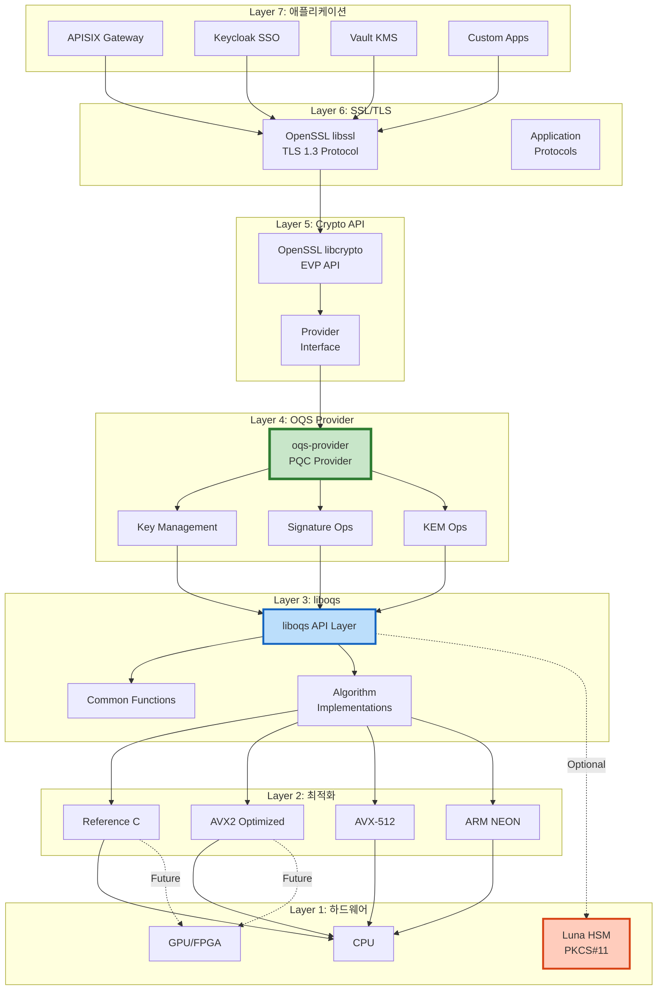
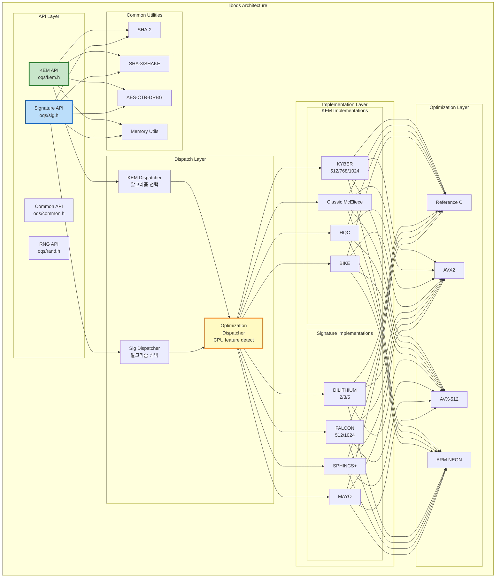
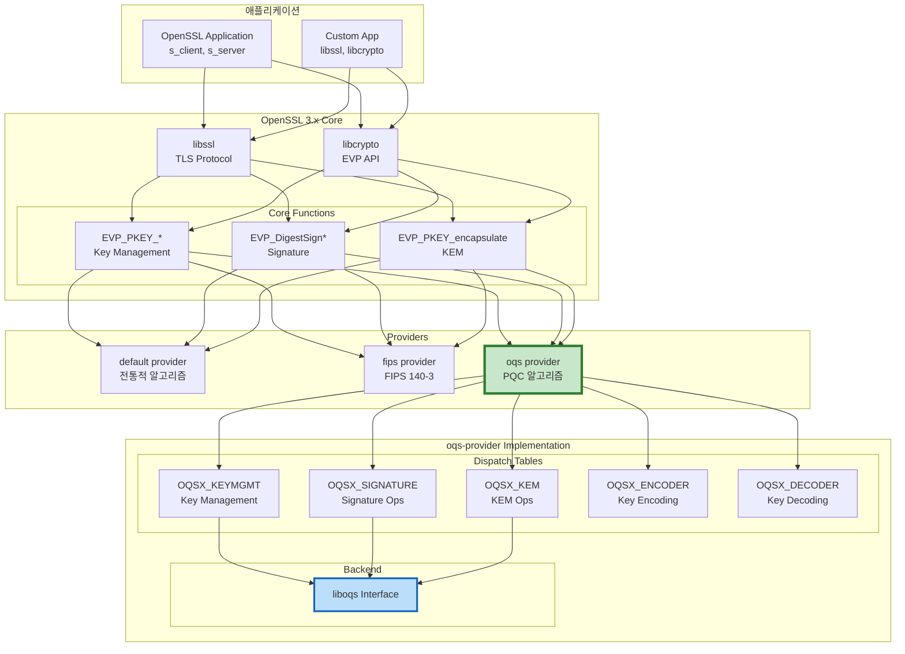
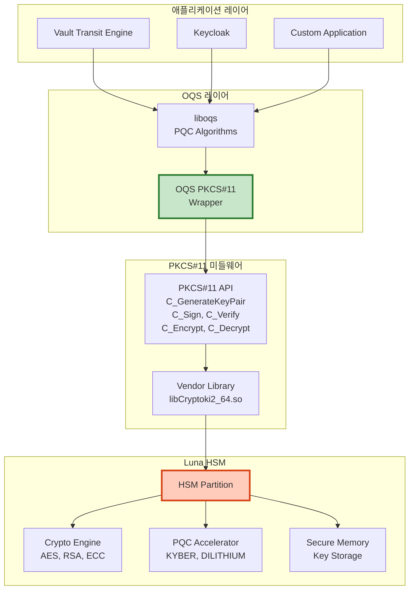
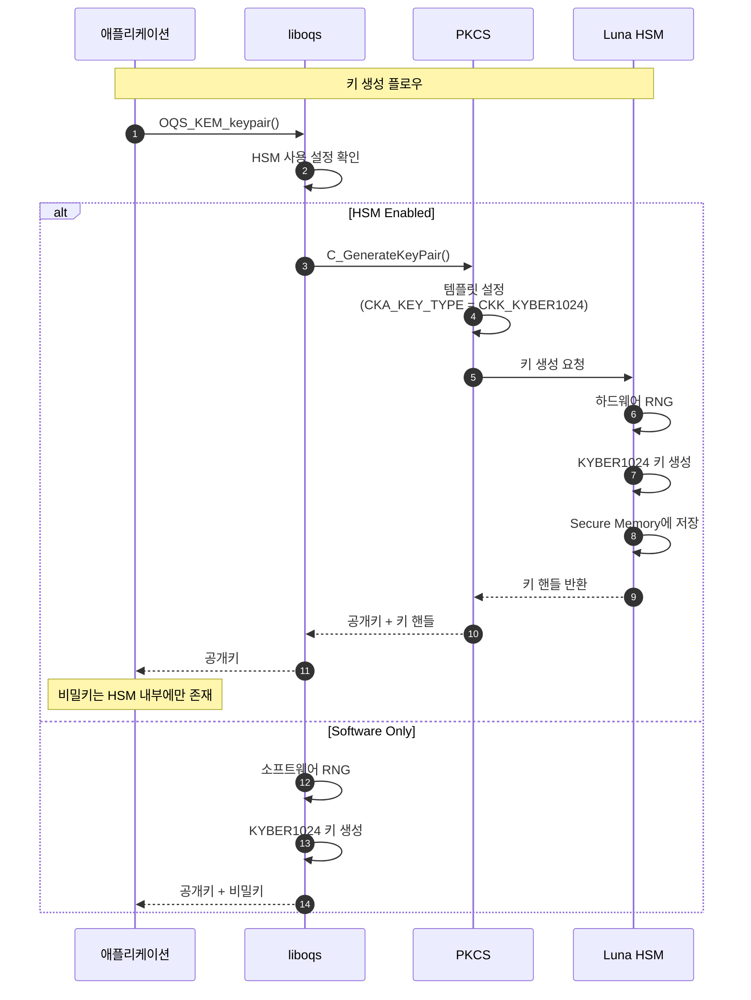

# OQS 아키텍처 (OQS Architecture)

> **OQS 아키텍처 설계** - liboqs 및 oqs-provider의 내부 구조와 설계 원칙
> Post-Quantum Cryptography 통합을 위한 계층형 아키텍처

---

## 📑 목차

1. [아키텍처 개요](#1-아키텍처-개요)
2. [liboqs 아키텍처](#2-liboqs-아키텍처)
3. [oqs-provider 아키텍처](#3-oqs-provider-아키텍처)
4. [Algorithm API 설계](#4-algorithm-api-설계)
5. [메모리 관리 및 보안](#5-메모리-관리-및-보안)
6. [HSM 통합 아키텍처](#6-hsm-통합-아키텍처)
7. [QSIGN 컴포넌트별 통합](#7-qsign-컴포넌트별-통합)
8. [성능 최적화 아키텍처](#8-성능-최적화-아키텍처)

---

## 1. 아키텍처 개요

### 1.1 전체 계층 구조



### 1.2 설계 원칙

```yaml
1. 모듈성 (Modularity):
   - 알고리즘별 독립 모듈
   - 플러그인 아키텍처
   - 선택적 빌드 (CMake options)

2. 성능 (Performance):
   - 다중 최적화 구현 (C, AVX2, AVX-512, NEON)
   - CPU feature detection (runtime)
   - 하드웨어 가속 (HSM, GPU)

3. 보안 (Security):
   - Constant-time operations
   - Secure memory wiping
   - Side-channel attack 방어
   - FIPS 140-3 준비

4. 확장성 (Extensibility):
   - 새로운 알고리즘 추가 용이
   - Provider 인터페이스 표준화
   - Language bindings 지원

5. 호환성 (Compatibility):
   - OpenSSL 3.x 완벽 통합
   - 기존 애플리케이션 투명성
   - Hybrid mode 지원
```

---

## 2. liboqs 아키텍처

### 2.1 디렉토리 구조

```
liboqs/
├── CMakeLists.txt                 # 빌드 설정
├── README.md
├── LICENSE
│
├── include/oqs/                   # 공개 헤더
│   ├── oqs.h                      # 메인 헤더
│   ├── kem.h                      # KEM API
│   ├── sig.h                      # Signature API
│   ├── common.h                   # 공통 함수
│   └── rand.h                     # RNG
│
├── src/
│   ├── common/                    # 공통 유틸리티
│   │   ├── common.c
│   │   ├── rand/                  # 난수 생성
│   │   │   ├── rand.c
│   │   │   ├── rand_nist.c
│   │   │   └── rand_openssl.c
│   │   ├── sha2/                  # SHA-2 해시
│   │   ├── sha3/                  # SHA-3/SHAKE
│   │   └── aes/                   # AES (for DRBG)
│   │
│   ├── kem/                       # KEM 알고리즘
│   │   ├── kem.c                  # KEM API 구현
│   │   ├── kyber/
│   │   │   ├── kem_kyber_512.c
│   │   │   ├── kem_kyber_768.c
│   │   │   ├── kem_kyber_1024.c
│   │   │   ├── pqcrystals-kyber_kyber512_ref/  # Reference C
│   │   │   ├── pqcrystals-kyber_kyber768_avx2/ # AVX2 optimized
│   │   │   └── pqcrystals-kyber_kyber1024_avx2/
│   │   ├── classic_mceliece/
│   │   ├── hqc/
│   │   └── bike/
│   │
│   └── sig/                       # Signature 알고리즘
│       ├── sig.c                  # Signature API 구현
│       ├── dilithium/
│       │   ├── sig_dilithium_2.c
│       │   ├── sig_dilithium_3.c
│       │   ├── sig_dilithium_5.c
│       │   ├── pqcrystals-dilithium_dilithium2_ref/
│       │   └── pqcrystals-dilithium_dilithium3_avx2/
│       ├── falcon/
│       ├── sphincs/
│       └── mayo/
│
├── tests/                         # 테스트 코드
│   ├── test_kem.c
│   ├── test_sig.c
│   └── test_speed.c
│
└── scripts/                       # 빌드 스크립트
    ├── copy_from_upstream.py      # 업스트림 알고리즘 복사
    └── generate_visualizations.py # 성능 그래프 생성
```

### 2.2 레이어 아키텍처



### 2.3 알고리즘 등록 메커니즘

```c
// src/kem/kem.c - KEM 알고리즘 등록

typedef struct OQS_KEM {
    const char *method_name;
    const char *alg_version;

    // 키 크기
    size_t length_public_key;
    size_t length_secret_key;
    size_t length_ciphertext;
    size_t length_shared_secret;

    // 함수 포인터
    OQS_STATUS (*keypair)(uint8_t *public_key, uint8_t *secret_key);
    OQS_STATUS (*encaps)(uint8_t *ciphertext, uint8_t *shared_secret,
                         const uint8_t *public_key);
    OQS_STATUS (*decaps)(uint8_t *shared_secret, const uint8_t *ciphertext,
                         const uint8_t *secret_key);
} OQS_KEM;

// KEM 알고리즘 등록 배열
static const OQS_KEM *supported_kems[] = {
    // KYBER
    &OQS_KEM_kyber_512,
    &OQS_KEM_kyber_768,
    &OQS_KEM_kyber_1024,

    // Classic McEliece
    &OQS_KEM_classic_mceliece_348864,
    &OQS_KEM_classic_mceliece_460896,

    // HQC
    &OQS_KEM_hqc_128,
    &OQS_KEM_hqc_192,
    &OQS_KEM_hqc_256,

    // BIKE
    &OQS_KEM_bike_l1,
    &OQS_KEM_bike_l3,
    &OQS_KEM_bike_l5,

    NULL  // 종료 마커
};

// 알고리즘 조회
OQS_KEM *OQS_KEM_new(const char *method_name) {
    for (size_t i = 0; supported_kems[i] != NULL; i++) {
        if (strcmp(method_name, supported_kems[i]->method_name) == 0) {
            OQS_KEM *kem = malloc(sizeof(OQS_KEM));
            if (kem == NULL) {
                return NULL;
            }
            memcpy(kem, supported_kems[i], sizeof(OQS_KEM));
            return kem;
        }
    }
    return NULL;  // 알고리즘을 찾을 수 없음
}

// 사용 예제
void example_kem_usage() {
    OQS_KEM *kem = OQS_KEM_new("Kyber1024");
    if (kem == NULL) {
        fprintf(stderr, "알고리즘을 찾을 수 없습니다.\n");
        return;
    }

    // 키 생성
    uint8_t *public_key = malloc(kem->length_public_key);
    uint8_t *secret_key = malloc(kem->length_secret_key);
    OQS_STATUS rc = kem->keypair(public_key, secret_key);

    // ... 사용 ...

    // 정리
    OQS_MEM_secure_free(secret_key, kem->length_secret_key);
    free(public_key);
    OQS_KEM_free(kem);
}
```

### 2.4 CPU Feature Detection

```c
// src/common/common.c - CPU 기능 감지

#include <cpuid.h>  // x86/x64
#include <sys/auxv.h>  // ARM

typedef struct {
    int has_avx;
    int has_avx2;
    int has_avx512;
    int has_bmi2;
    int has_aes_ni;
    int has_neon;  // ARM
} OQS_CPU_FEATURES;

static OQS_CPU_FEATURES cpu_features = {0};
static int cpu_features_initialized = 0;

void OQS_CPU_init(void) {
    if (cpu_features_initialized) {
        return;
    }

#if defined(__x86_64__) || defined(_M_X64)
    // x86-64 CPU 기능 감지
    unsigned int eax, ebx, ecx, edx;

    // CPUID leaf 1
    __cpuid(1, eax, ebx, ecx, edx);
    cpu_features.has_aes_ni = (ecx >> 25) & 1;

    // CPUID leaf 7
    __cpuid_count(7, 0, eax, ebx, ecx, edx);
    cpu_features.has_avx2 = (ebx >> 5) & 1;
    cpu_features.has_bmi2 = (ebx >> 8) & 1;
    cpu_features.has_avx512 = (ebx >> 16) & 1;

#elif defined(__aarch64__) || defined(_M_ARM64)
    // ARM64 NEON 감지
    unsigned long hwcaps = getauxval(AT_HWCAP);
    cpu_features.has_neon = (hwcaps & HWCAP_ASIMD) != 0;
#endif

    cpu_features_initialized = 1;
}

int OQS_CPU_has_extension(OQS_CPU_EXT ext) {
    if (!cpu_features_initialized) {
        OQS_CPU_init();
    }

    switch (ext) {
        case OQS_CPU_EXT_AVX:
            return cpu_features.has_avx;
        case OQS_CPU_EXT_AVX2:
            return cpu_features.has_avx2;
        case OQS_CPU_EXT_AVX512:
            return cpu_features.has_avx512;
        case OQS_CPU_EXT_BMI2:
            return cpu_features.has_bmi2;
        case OQS_CPU_EXT_AES_NI:
            return cpu_features.has_aes_ni;
        case OQS_CPU_EXT_NEON:
            return cpu_features.has_neon;
        default:
            return 0;
    }
}

// 최적화 구현 선택
void *select_kyber1024_implementation(void) {
    if (OQS_CPU_has_extension(OQS_CPU_EXT_AVX2)) {
        return &kyber1024_avx2;  // AVX2 최적화
    } else {
        return &kyber1024_ref;   // Reference C
    }
}
```

---

## 3. oqs-provider 아키텍처

### 3.1 OpenSSL Provider 인터페이스



### 3.2 Provider 초기화

```c
// oqsprovider/oqsprov.c - Provider 진입점

#include <openssl/core.h>
#include <openssl/core_dispatch.h>
#include <oqs/oqs.h>

// Provider 함수 테이블
static const OSSL_DISPATCH oqs_dispatch_table[] = {
    { OSSL_FUNC_PROVIDER_TEARDOWN, (void (*)(void))oqsprovider_teardown },
    { OSSL_FUNC_PROVIDER_GETTABLE_PARAMS, (void (*)(void))oqsprovider_gettable_params },
    { OSSL_FUNC_PROVIDER_GET_PARAMS, (void (*)(void))oqsprovider_get_params },
    { OSSL_FUNC_PROVIDER_QUERY_OPERATION, (void (*)(void))oqsprovider_query },
    { 0, NULL }
};

// Provider 초기화
int OSSL_provider_init(const OSSL_CORE_HANDLE *handle,
                       const OSSL_DISPATCH *in,
                       const OSSL_DISPATCH **out,
                       void **provctx) {
    OSSL_FUNC_core_get_libctx_fn *c_get_libctx = NULL;

    // OpenSSL core 함수 가져오기
    for (; in->function_id != 0; in++) {
        switch (in->function_id) {
            case OSSL_FUNC_CORE_GET_LIBCTX:
                c_get_libctx = OSSL_FUNC_core_get_libctx(in);
                break;
            // ... 기타 core 함수 ...
        }
    }

    // Provider context 생성
    PROV_OQS_CTX *ctx = OPENSSL_zalloc(sizeof(*ctx));
    if (ctx == NULL) {
        return 0;
    }

    ctx->handle = handle;
    ctx->libctx = (OSSL_LIB_CTX*)c_get_libctx(handle);

    // liboqs 초기화
    OQS_init();

    *provctx = ctx;
    *out = oqs_dispatch_table;

    return 1;
}

// Operation 쿼리 (알고리즘 제공)
static const OSSL_ALGORITHM *oqsprovider_query(void *provctx,
                                                int operation_id,
                                                int *no_cache) {
    *no_cache = 0;

    switch (operation_id) {
        case OSSL_OP_SIGNATURE:
            return oqs_signature_algorithms;  // Dilithium, Falcon, SPHINCS+

        case OSSL_OP_KEM:
            return oqs_kem_algorithms;  // Kyber, HQC, BIKE

        case OSSL_OP_KEYMGMT:
            return oqs_keymgmt_algorithms;

        case OSSL_OP_ENCODER:
            return oqs_encoder_algorithms;

        case OSSL_OP_DECODER:
            return oqs_decoder_algorithms;

        default:
            return NULL;
    }
}
```

### 3.3 KEM Operation 구현

```c
// oqsprovider/oqs_kem.c - KEM operation

typedef struct {
    PROV_OQS_CTX *provctx;
    OQS_KEM *kem;
    char *tls_name;  // TLS extension name
} OQS_KEM_CTX;

// KEM 캡슐화
static int oqs_kem_encapsulate(void *vpkeymctx,
                               unsigned char *out, size_t *outlen,
                               unsigned char *secret, size_t *secretlen) {
    OQS_KEM_CTX *pkeymctx = (OQS_KEM_CTX *)vpkeymctx;

    if (out == NULL) {
        // 크기 쿼리
        *outlen = pkeymctx->kem->length_ciphertext;
        *secretlen = pkeymctx->kem->length_shared_secret;
        return 1;
    }

    // liboqs KEM 캡슐화 호출
    if (OQS_KEM_encaps(pkeymctx->kem, out, secret,
                       pkeymctx->public_key) != OQS_SUCCESS) {
        return 0;
    }

    *outlen = pkeymctx->kem->length_ciphertext;
    *secretlen = pkeymctx->kem->length_shared_secret;

    return 1;
}

// KEM 디캡슐화
static int oqs_kem_decapsulate(void *vpkeymctx,
                               unsigned char *out, size_t *outlen,
                               const unsigned char *in, size_t inlen) {
    OQS_KEM_CTX *pkeymctx = (OQS_KEM_CTX *)vpkeymctx;

    if (out == NULL) {
        *outlen = pkeymctx->kem->length_shared_secret;
        return 1;
    }

    // liboqs KEM 디캡슐화 호출
    if (OQS_KEM_decaps(pkeymctx->kem, out, in,
                       pkeymctx->secret_key) != OQS_SUCCESS) {
        return 0;
    }

    *outlen = pkeymctx->kem->length_shared_secret;
    return 1;
}

// KEM operation dispatch table
const OSSL_DISPATCH oqs_kyber1024_kem_functions[] = {
    { OSSL_FUNC_KEM_NEWCTX, (void (*)(void))oqs_kem_newctx },
    { OSSL_FUNC_KEM_FREECTX, (void (*)(void))oqs_kem_freectx },
    { OSSL_FUNC_KEM_ENCAPSULATE_INIT, (void (*)(void))oqs_kem_encapsulate_init },
    { OSSL_FUNC_KEM_ENCAPSULATE, (void (*)(void))oqs_kem_encapsulate },
    { OSSL_FUNC_KEM_DECAPSULATE_INIT, (void (*)(void))oqs_kem_decapsulate_init },
    { OSSL_FUNC_KEM_DECAPSULATE, (void (*)(void))oqs_kem_decapsulate },
    { 0, NULL }
};
```

### 3.4 Signature Operation 구현

```c
// oqsprovider/oqs_sig.c - Signature operation

typedef struct {
    PROV_OQS_CTX *provctx;
    OQS_SIG *sig;
    EVP_MD *md;  // Message digest (for hybrid)
} OQS_SIG_CTX;

// 서명 생성
static int oqs_signature_sign(void *vpsigctx,
                              unsigned char *sig, size_t *siglen,
                              size_t sigsize,
                              const unsigned char *tbs, size_t tbslen) {
    OQS_SIG_CTX *psigctx = (OQS_SIG_CTX *)vpsigctx;

    if (sig == NULL) {
        // 크기 쿼리
        *siglen = psigctx->sig->length_signature;
        return 1;
    }

    // liboqs Signature 서명 호출
    if (OQS_SIG_sign(psigctx->sig, sig, siglen, tbs, tbslen,
                     psigctx->secret_key) != OQS_SUCCESS) {
        return 0;
    }

    return 1;
}

// 서명 검증
static int oqs_signature_verify(void *vpsigctx,
                                const unsigned char *sig, size_t siglen,
                                const unsigned char *tbs, size_t tbslen) {
    OQS_SIG_CTX *psigctx = (OQS_SIG_CTX *)vpsigctx;

    // liboqs Signature 검증 호출
    if (OQS_SIG_verify(psigctx->sig, tbs, tbslen, sig, siglen,
                       psigctx->public_key) != OQS_SUCCESS) {
        return 0;
    }

    return 1;
}

// Hybrid Signature (RSA + Dilithium)
static int oqs_hybrid_sign(void *vpsigctx,
                          unsigned char *sig, size_t *siglen,
                          size_t sigsize,
                          const unsigned char *tbs, size_t tbslen) {
    OQS_SIG_CTX *psigctx = (OQS_SIG_CTX *)vpsigctx;

    // 1. 전통적 서명 (RSA-PSS)
    size_t classical_siglen;
    EVP_PKEY_CTX *classical_ctx = psigctx->classical_ctx;
    if (!EVP_PKEY_sign(classical_ctx, sig, &classical_siglen,
                       tbs, tbslen)) {
        return 0;
    }

    // 2. PQC 서명 (Dilithium)
    size_t pqc_siglen;
    if (OQS_SIG_sign(psigctx->sig,
                     sig + classical_siglen, &pqc_siglen,
                     tbs, tbslen,
                     psigctx->secret_key) != OQS_SUCCESS) {
        return 0;
    }

    *siglen = classical_siglen + pqc_siglen;
    return 1;
}
```

---

## 4. Algorithm API 설계

### 4.1 KEM API

```c
// include/oqs/kem.h

typedef struct OQS_KEM {
    /** 알고리즘 이름 (예: "Kyber1024") */
    const char *method_name;

    /** 알고리즘 버전 */
    const char *alg_version;

    /** NIST 보안 레벨 (1-5) */
    uint8_t claimed_nist_level;

    /** IND-CCA 보안 여부 */
    bool ind_cca;

    /** 공개키 길이 (bytes) */
    size_t length_public_key;

    /** 비밀키 길이 (bytes) */
    size_t length_secret_key;

    /** 암호문 길이 (bytes) */
    size_t length_ciphertext;

    /** 공유 비밀 길이 (bytes) */
    size_t length_shared_secret;

    /**
     * 키쌍 생성
     * @param[out] public_key  공개키 버퍼
     * @param[out] secret_key  비밀키 버퍼
     * @return OQS_SUCCESS 또는 OQS_ERROR
     */
    OQS_STATUS (*keypair)(uint8_t *public_key, uint8_t *secret_key);

    /**
     * 캡슐화 (암호화)
     * @param[out] ciphertext     암호문 버퍼
     * @param[out] shared_secret  공유 비밀 버퍼
     * @param[in]  public_key     공개키
     * @return OQS_SUCCESS 또는 OQS_ERROR
     */
    OQS_STATUS (*encaps)(uint8_t *ciphertext,
                         uint8_t *shared_secret,
                         const uint8_t *public_key);

    /**
     * 디캡슐화 (복호화)
     * @param[out] shared_secret  공유 비밀 버퍼
     * @param[in]  ciphertext     암호문
     * @param[in]  secret_key     비밀키
     * @return OQS_SUCCESS 또는 OQS_ERROR
     */
    OQS_STATUS (*decaps)(uint8_t *shared_secret,
                         const uint8_t *ciphertext,
                         const uint8_t *secret_key);
} OQS_KEM;

// KEM 생성 및 해제
OQS_KEM *OQS_KEM_new(const char *method_name);
void OQS_KEM_free(OQS_KEM *kem);

// 알고리즘 조회
int OQS_KEM_alg_count(void);
const char *OQS_KEM_alg_identifier(size_t i);
int OQS_KEM_alg_is_enabled(const char *method_name);
```

**사용 예제:**

```c
#include <oqs/oqs.h>

void kem_example() {
    // 1. KEM 생성
    OQS_KEM *kem = OQS_KEM_new("Kyber1024");
    if (kem == NULL) {
        fprintf(stderr, "Kyber1024를 지원하지 않습니다.\n");
        return;
    }

    printf("알고리즘: %s\n", kem->method_name);
    printf("보안 레벨: NIST Level %d\n", kem->claimed_nist_level);
    printf("공개키 크기: %zu bytes\n", kem->length_public_key);
    printf("암호문 크기: %zu bytes\n", kem->length_ciphertext);

    // 2. 메모리 할당
    uint8_t *public_key = malloc(kem->length_public_key);
    uint8_t *secret_key = malloc(kem->length_secret_key);
    uint8_t *ciphertext = malloc(kem->length_ciphertext);
    uint8_t *shared_secret_client = malloc(kem->length_shared_secret);
    uint8_t *shared_secret_server = malloc(kem->length_shared_secret);

    // 3. 서버: 키쌍 생성
    if (kem->keypair(public_key, secret_key) != OQS_SUCCESS) {
        fprintf(stderr, "키 생성 실패\n");
        goto cleanup;
    }

    // 4. 클라이언트: 캡슐화 (암호화)
    if (kem->encaps(ciphertext, shared_secret_client, public_key) != OQS_SUCCESS) {
        fprintf(stderr, "캡슐화 실패\n");
        goto cleanup;
    }

    // 5. 서버: 디캡슐화 (복호화)
    if (kem->decaps(shared_secret_server, ciphertext, secret_key) != OQS_SUCCESS) {
        fprintf(stderr, "디캡슐화 실패\n");
        goto cleanup;
    }

    // 6. 검증
    if (memcmp(shared_secret_client, shared_secret_server,
               kem->length_shared_secret) == 0) {
        printf("공유 비밀 일치! ✓\n");
    } else {
        printf("공유 비밀 불일치! ✗\n");
    }

cleanup:
    // 7. 안전한 메모리 해제
    OQS_MEM_secure_free(secret_key, kem->length_secret_key);
    OQS_MEM_secure_free(shared_secret_client, kem->length_shared_secret);
    OQS_MEM_secure_free(shared_secret_server, kem->length_shared_secret);
    free(public_key);
    free(ciphertext);
    OQS_KEM_free(kem);
}
```

### 4.2 Signature API

```c
// include/oqs/sig.h

typedef struct OQS_SIG {
    /** 알고리즘 이름 (예: "Dilithium3") */
    const char *method_name;

    /** 알고리즘 버전 */
    const char *alg_version;

    /** NIST 보안 레벨 (1-5) */
    uint8_t claimed_nist_level;

    /** EUF-CMA 보안 여부 */
    bool euf_cma;

    /** 공개키 길이 (bytes) */
    size_t length_public_key;

    /** 비밀키 길이 (bytes) */
    size_t length_secret_key;

    /** 최대 서명 길이 (bytes) */
    size_t length_signature;

    /**
     * 키쌍 생성
     * @param[out] public_key  공개키 버퍼
     * @param[out] secret_key  비밀키 버퍼
     * @return OQS_SUCCESS 또는 OQS_ERROR
     */
    OQS_STATUS (*keypair)(uint8_t *public_key, uint8_t *secret_key);

    /**
     * 서명 생성
     * @param[out] signature        서명 버퍼
     * @param[out] signature_len    실제 서명 길이
     * @param[in]  message          서명할 메시지
     * @param[in]  message_len      메시지 길이
     * @param[in]  secret_key       비밀키
     * @return OQS_SUCCESS 또는 OQS_ERROR
     */
    OQS_STATUS (*sign)(uint8_t *signature,
                       size_t *signature_len,
                       const uint8_t *message,
                       size_t message_len,
                       const uint8_t *secret_key);

    /**
     * 서명 검증
     * @param[in] message       원본 메시지
     * @param[in] message_len   메시지 길이
     * @param[in] signature     서명
     * @param[in] signature_len 서명 길이
     * @param[in] public_key    공개키
     * @return OQS_SUCCESS (검증 성공) 또는 OQS_ERROR (검증 실패)
     */
    OQS_STATUS (*verify)(const uint8_t *message,
                         size_t message_len,
                         const uint8_t *signature,
                         size_t signature_len,
                         const uint8_t *public_key);
} OQS_SIG;

// Signature 생성 및 해제
OQS_SIG *OQS_SIG_new(const char *method_name);
void OQS_SIG_free(OQS_SIG *sig);

// 알고리즘 조회
int OQS_SIG_alg_count(void);
const char *OQS_SIG_alg_identifier(size_t i);
int OQS_SIG_alg_is_enabled(const char *method_name);
```

**사용 예제:**

```c
#include <oqs/oqs.h>

void signature_example() {
    // 1. Signature 생성
    OQS_SIG *sig = OQS_SIG_new("Dilithium3");
    if (sig == NULL) {
        fprintf(stderr, "Dilithium3를 지원하지 않습니다.\n");
        return;
    }

    printf("알고리즘: %s\n", sig->method_name);
    printf("보안 레벨: NIST Level %d\n", sig->claimed_nist_level);
    printf("공개키 크기: %zu bytes\n", sig->length_public_key);
    printf("서명 크기: %zu bytes\n", sig->length_signature);

    // 2. 메모리 할당
    uint8_t *public_key = malloc(sig->length_public_key);
    uint8_t *secret_key = malloc(sig->length_secret_key);
    uint8_t *signature = malloc(sig->length_signature);
    size_t signature_len;

    // 3. 키쌍 생성
    if (sig->keypair(public_key, secret_key) != OQS_SUCCESS) {
        fprintf(stderr, "키 생성 실패\n");
        goto cleanup;
    }

    // 4. 서명할 메시지
    const char *message = "QSIGN - Quantum-resistant Signature";
    size_t message_len = strlen(message);

    // 5. 서명 생성
    if (sig->sign(signature, &signature_len,
                  (uint8_t*)message, message_len,
                  secret_key) != OQS_SUCCESS) {
        fprintf(stderr, "서명 생성 실패\n");
        goto cleanup;
    }

    printf("서명 생성 완료 (%zu bytes)\n", signature_len);

    // 6. 서명 검증
    if (sig->verify((uint8_t*)message, message_len,
                    signature, signature_len,
                    public_key) == OQS_SUCCESS) {
        printf("서명 검증 성공! ✓\n");
    } else {
        printf("서명 검증 실패! ✗\n");
    }

    // 7. 잘못된 서명 테스트
    signature[0] ^= 0x01;  // 1 bit 변조
    if (sig->verify((uint8_t*)message, message_len,
                    signature, signature_len,
                    public_key) == OQS_SUCCESS) {
        printf("변조된 서명 검증 성공 (문제!)\n");
    } else {
        printf("변조된 서명 검증 실패 (정상) ✓\n");
    }

cleanup:
    // 8. 안전한 메모리 해제
    OQS_MEM_secure_free(secret_key, sig->length_secret_key);
    OQS_MEM_secure_free(signature, sig->length_signature);
    free(public_key);
    OQS_SIG_free(sig);
}
```

---

## 5. 메모리 관리 및 보안

### 5.1 Secure Memory Management

```c
// src/common/common.c - 안전한 메모리 관리

#include <string.h>
#include <stdlib.h>

/**
 * 안전한 메모리 해제 (메모리 덮어쓰기 후 해제)
 * @param ptr   해제할 메모리 포인터
 * @param len   메모리 크기
 */
void OQS_MEM_secure_free(void *ptr, size_t len) {
    if (ptr == NULL) {
        return;
    }

    // 메모리를 0으로 덮어쓰기 (컴파일러 최적화 방지)
    volatile uint8_t *p = (volatile uint8_t *)ptr;
    for (size_t i = 0; i < len; i++) {
        p[i] = 0;
    }

    // 추가 보안: memset_s (C11) 또는 explicit_bzero (POSIX)
#if defined(__STDC_LIB_EXT1__)
    memset_s(ptr, len, 0, len);
#elif defined(__linux__) || defined(__APPLE__)
    explicit_bzero(ptr, len);
#else
    // Fallback: volatile memset
    volatile unsigned char *vptr = (volatile unsigned char *)ptr;
    size_t i = len;
    while (i--) {
        *vptr++ = 0;
    }
#endif

    free(ptr);
}

/**
 * 안전한 메모리 초기화 (0으로 설정)
 * @param ptr   메모리 포인터
 * @param len   메모리 크기
 */
void OQS_MEM_cleanse(void *ptr, size_t len) {
    if (ptr == NULL) {
        return;
    }

#if defined(__STDC_LIB_EXT1__)
    memset_s(ptr, len, 0, len);
#elif defined(__linux__) || defined(__APPLE__)
    explicit_bzero(ptr, len);
#else
    volatile unsigned char *vptr = (volatile unsigned char *)ptr;
    size_t i = len;
    while (i--) {
        *vptr++ = 0;
    }
#endif
}

/**
 * Constant-time 메모리 비교
 * @param a     첫 번째 메모리
 * @param b     두 번째 메모리
 * @param len   비교 길이
 * @return 0 (동일) 또는 1 (다름)
 */
int OQS_MEM_secure_bcmp(const void *a, const void *b, size_t len) {
    const unsigned char *ua = (const unsigned char *)a;
    const unsigned char *ub = (const unsigned char *)b;
    unsigned char diff = 0;

    for (size_t i = 0; i < len; i++) {
        diff |= ua[i] ^ ub[i];
    }

    return (diff != 0);
}
```

### 5.2 Side-Channel Attack 방어

```yaml
Constant-Time 연산:
  목적:
    - Timing attack 방어
    - Cache-timing attack 방어
    - Power analysis attack 방어

  구현 전략:
    1. 조건 분기 제거:
       - if/else → bitwise operations
       - 예: if (a > b) → mask = -(a > b)

    2. Table lookup 최소화:
       - Cache-timing attack 방지
       - 메모리 접근 패턴 일정하게 유지

    3. 비밀 의존 인덱싱 금지:
       - array[secret] → constant-time scatter/gather

    4. 컴파일러 최적화 제어:
       - volatile 키워드 사용
       - 메모리 barrier

예제:
  # 일반적인 코드 (취약)
  if (secret_key[i] == 0) {
      result = 0;
  } else {
      result = 1;
  }

  # Constant-time 코드 (안전)
  unsigned char mask = -(secret_key[i] != 0);
  result = mask & 1;
```

### 5.3 Random Number Generation

```c
// src/common/rand/rand.c - 난수 생성

typedef enum {
    OQS_RAND_alg_system,     // 시스템 RNG (/dev/urandom, BCryptGenRandom)
    OQS_RAND_alg_nist_kat,   // NIST KAT 테스트용 결정적 RNG
    OQS_RAND_alg_openssl     // OpenSSL RNG
} OQS_RAND_alg;

// 현재 RNG 알고리즘
static OQS_RAND_alg current_rand_alg = OQS_RAND_alg_system;

/**
 * 난수 생성
 * @param[out] buf   난수 버퍼
 * @param[in]  len   생성할 난수 길이
 * @return OQS_SUCCESS 또는 OQS_ERROR
 */
OQS_STATUS OQS_randombytes(uint8_t *buf, size_t len) {
    switch (current_rand_alg) {
        case OQS_RAND_alg_system:
            return OQS_randombytes_system(buf, len);
        case OQS_RAND_alg_nist_kat:
            return OQS_randombytes_nist_kat(buf, len);
        case OQS_RAND_alg_openssl:
            return OQS_randombytes_openssl(buf, len);
        default:
            return OQS_ERROR;
    }
}

// 시스템 RNG (Linux: /dev/urandom, Windows: BCryptGenRandom)
static OQS_STATUS OQS_randombytes_system(uint8_t *buf, size_t len) {
#if defined(__linux__) || defined(__APPLE__)
    int fd = open("/dev/urandom", O_RDONLY);
    if (fd == -1) {
        return OQS_ERROR;
    }

    ssize_t bytes_read = 0;
    while (bytes_read < len) {
        ssize_t n = read(fd, buf + bytes_read, len - bytes_read);
        if (n <= 0) {
            close(fd);
            return OQS_ERROR;
        }
        bytes_read += n;
    }

    close(fd);
    return OQS_SUCCESS;

#elif defined(_WIN32)
    // Windows BCryptGenRandom
    if (!BCRYPT_SUCCESS(BCryptGenRandom(NULL, buf, (ULONG)len,
                                        BCRYPT_USE_SYSTEM_PREFERRED_RNG))) {
        return OQS_ERROR;
    }
    return OQS_SUCCESS;
#else
    #error "Unsupported platform for system RNG"
#endif
}

// OpenSSL RNG
static OQS_STATUS OQS_randombytes_openssl(uint8_t *buf, size_t len) {
    if (RAND_bytes(buf, (int)len) != 1) {
        return OQS_ERROR;
    }
    return OQS_SUCCESS;
}
```

---

## 6. HSM 통합 아키텍처

### 6.1 PKCS#11 통합



### 6.2 HSM 키 생성 플로우



### 6.3 HSM 암호화 작업

```c
// HSM을 사용한 KYBER1024 디캡슐화

#include <cryptoki.h>  // PKCS#11
#include <oqs/oqs.h>

typedef struct {
    CK_SESSION_HANDLE session;
    CK_OBJECT_HANDLE private_key_handle;
    OQS_KEM *kem;
} OQS_HSM_KEM_CTX;

OQS_STATUS oqs_hsm_kem_decaps(OQS_HSM_KEM_CTX *ctx,
                              uint8_t *shared_secret,
                              const uint8_t *ciphertext) {
    CK_MECHANISM mechanism = {
        .mechanism = CKM_KYBER1024_KEM_DECAPSULATE,
        .pParameter = NULL,
        .ulParameterLen = 0
    };

    // PKCS#11 Decrypt 초기화
    CK_RV rv = C_DecryptInit(ctx->session, &mechanism,
                             ctx->private_key_handle);
    if (rv != CKR_OK) {
        return OQS_ERROR;
    }

    // 디캡슐화 (HSM 내부에서 실행)
    CK_ULONG shared_secret_len = ctx->kem->length_shared_secret;
    rv = C_Decrypt(ctx->session,
                   (CK_BYTE_PTR)ciphertext,
                   ctx->kem->length_ciphertext,
                   shared_secret,
                   &shared_secret_len);

    if (rv != CKR_OK) {
        return OQS_ERROR;
    }

    return OQS_SUCCESS;
}

// HSM을 사용한 DILITHIUM3 서명
OQS_STATUS oqs_hsm_sig_sign(OQS_HSM_SIG_CTX *ctx,
                            uint8_t *signature,
                            size_t *signature_len,
                            const uint8_t *message,
                            size_t message_len) {
    CK_MECHANISM mechanism = {
        .mechanism = CKM_DILITHIUM3,
        .pParameter = NULL,
        .ulParameterLen = 0
    };

    // PKCS#11 Sign 초기화
    CK_RV rv = C_SignInit(ctx->session, &mechanism,
                         ctx->private_key_handle);
    if (rv != CKR_OK) {
        return OQS_ERROR;
    }

    // 서명 생성 (HSM 내부에서 실행)
    CK_ULONG sig_len = ctx->sig->length_signature;
    rv = C_Sign(ctx->session,
                (CK_BYTE_PTR)message,
                message_len,
                signature,
                &sig_len);

    if (rv != CKR_OK) {
        return OQS_ERROR;
    }

    *signature_len = sig_len;
    return OQS_SUCCESS;
}
```

---

## 7. QSIGN 컴포넌트별 통합

### 7.1 Vault 통합

```yaml
Vault Transit Engine + OQS:
  아키텍처:
    ┌──────────────┐
    │ Vault API    │
    │ (REST/gRPC)  │
    └──────┬───────┘
           │
    ┌──────▼───────┐
    │ Transit      │
    │ Engine       │
    │ (Go Plugin)  │
    └──────┬───────┘
           │
    ┌──────▼───────┐
    │ liboqs-go    │
    │ (CGo binding)│
    └──────┬───────┘
           │
    ┌──────▼───────┐
    │ liboqs       │
    │ (C library)  │
    └──────┬───────┘
           │
    ┌──────▼───────┐
    │ Luna HSM     │
    │ (PKCS#11)    │
    └──────────────┘

  구현 예제 (Go):
    package oqstransit

    import (
        "github.com/open-quantum-safe/liboqs-go/oqs"
        "github.com/hashicorp/vault/sdk/framework"
    )

    type OQSTransitBackend struct {
        kem *oqs.KeyEncapsulation
        sig *oqs.Signature
    }

    func (b *OQSTransitBackend) pathEncrypt() *framework.Path {
        return &framework.Path{
            Pattern: "encrypt/" + framework.GenericNameRegex("name"),
            Fields: map[string]*framework.FieldSchema{
                "plaintext": {
                    Type:        framework.TypeString,
                    Description: "Base64 encoded plaintext",
                },
            },
            Callbacks: map[logical.Operation]framework.OperationFunc{
                logical.UpdateOperation: b.handleEncrypt,
            },
        }
    }

    func (b *OQSTransitBackend) handleEncrypt(
        ctx context.Context,
        req *logical.Request,
        data *framework.FieldData) (*logical.Response, error) {

        // KEM 캡슐화를 사용한 암호화
        plaintext := data.Get("plaintext").(string)

        // 1. Kyber1024로 공유 비밀 생성
        publicKey := b.getPublicKey(req.Path)
        ciphertext, sharedSecret, err := b.kem.EncapSecret(publicKey)
        if err != nil {
            return nil, err
        }

        // 2. 공유 비밀로 데이터 암호화 (AES-256-GCM)
        encrypted, err := b.aesGCMEncrypt(plaintext, sharedSecret)
        if err != nil {
            return nil, err
        }

        // 3. 응답 반환
        return &logical.Response{
            Data: map[string]interface{}{
                "ciphertext": base64.StdEncoding.EncodeToString(ciphertext),
                "encrypted_data": base64.StdEncoding.EncodeToString(encrypted),
            },
        }, nil
    }
```

### 7.2 Keycloak 통합

```yaml
Keycloak PQC JWT + OQS:
  아키텍처:
    ┌──────────────┐
    │ Keycloak     │
    │ Core         │
    └──────┬───────┘
           │
    ┌──────▼───────┐
    │ Token SPI    │
    │ (JWT)        │
    └──────┬───────┘
           │
    ┌──────▼───────┐
    │ PQC Provider │
    │ (Java)       │
    └──────┬───────┘
           │
    ┌──────▼───────┐
    │ liboqs-java  │
    │ (JNI)        │
    └──────┬───────┘
           │
    ┌──────▼───────┐
    │ liboqs       │
    │ (C library)  │
    └──────────────┘

  구현 예제 (Java):
    package com.qsign.keycloak.pqc;

    import org.openquantumsafe.*;
    import org.keycloak.jose.jws.JWSInput;

    public class PQCTokenManager implements TokenManager {
        private Signature dilithium;

        public PQCTokenManager() {
            dilithium = new Signature("Dilithium3");
            dilithium.generate_keypair();
        }

        @Override
        public String signToken(String payload) {
            try {
                byte[] signature = dilithium.sign(payload.getBytes());
                return Base64.getEncoder().encodeToString(signature);
            } catch (Exception e) {
                throw new RuntimeException("서명 생성 실패", e);
            }
        }

        @Override
        public boolean verifyToken(String payload, String signature) {
            try {
                byte[] sigBytes = Base64.getDecoder().decode(signature);
                return dilithium.verify(payload.getBytes(), sigBytes,
                                       dilithium.export_public_key());
            } catch (Exception e) {
                return false;
            }
        }

        // Hybrid JWT (RSA + Dilithium)
        public String signHybridToken(String payload) {
            // 1. RSA-PSS 서명
            String rsaSignature = rsaSigner.sign(payload);

            // 2. Dilithium3 서명
            String pqcSignature = signToken(payload);

            // 3. 조합
            return rsaSignature + "." + pqcSignature;
        }
    }
```

### 7.3 APISIX 통합

```yaml
APISIX TLS + OQS:
  아키텍처:
    ┌──────────────┐
    │ APISIX       │
    │ (OpenResty)  │
    └──────┬───────┘
           │
    ┌──────▼───────┐
    │ Nginx/       │
    │ OpenSSL      │
    └──────┬───────┘
           │
    ┌──────▼───────┐
    │ oqs-provider │
    │ (OpenSSL 3.x)│
    └──────┬───────┘
           │
    ┌──────▼───────┐
    │ liboqs       │
    │ (C library)  │
    └──────────────┘

  설정 예제 (nginx.conf):
    # OpenSSL Provider 설정
    ssl_conf_command Providers oqs;

    server {
        listen 443 ssl http2;
        server_name api.qsign.local;

        # PQC 인증서
        ssl_certificate /etc/nginx/certs/dilithium3_cert.pem;
        ssl_certificate_key /etc/nginx/certs/dilithium3_key.pem;

        # Hybrid TLS 설정
        ssl_protocols TLSv1.3;
        ssl_ecdh_curve p384_kyber1024:X25519;  # Hybrid KEM

        # Cipher suites
        ssl_ciphers TLS_AES_256_GCM_SHA384:TLS_CHACHA20_POLY1305_SHA256;

        ssl_prefer_server_ciphers on;
        ssl_session_timeout 10m;
        ssl_session_cache shared:SSL:10m;

        location / {
            proxy_pass http://backend;
            proxy_ssl_verify on;
            proxy_ssl_protocols TLSv1.3;
        }
    }
```

---

## 8. 성능 최적화 아키텍처

### 8.1 Multi-threading

```c
// 병렬 키 생성

#include <pthread.h>
#include <oqs/oqs.h>

typedef struct {
    OQS_KEM *kem;
    uint8_t *public_key;
    uint8_t *secret_key;
    int result;
} KeygenTask;

void *keygen_worker(void *arg) {
    KeygenTask *task = (KeygenTask *)arg;

    task->result = task->kem->keypair(task->public_key,
                                      task->secret_key);
    return NULL;
}

// 여러 키를 병렬로 생성
void parallel_keygen(int num_keys) {
    pthread_t threads[num_keys];
    KeygenTask tasks[num_keys];

    OQS_KEM *kem = OQS_KEM_new("Kyber1024");

    // 스레드 생성
    for (int i = 0; i < num_keys; i++) {
        tasks[i].kem = kem;
        tasks[i].public_key = malloc(kem->length_public_key);
        tasks[i].secret_key = malloc(kem->length_secret_key);

        pthread_create(&threads[i], NULL, keygen_worker, &tasks[i]);
    }

    // 스레드 종료 대기
    for (int i = 0; i < num_keys; i++) {
        pthread_join(threads[i], NULL);
    }

    // 정리
    for (int i = 0; i < num_keys; i++) {
        free(tasks[i].public_key);
        OQS_MEM_secure_free(tasks[i].secret_key,
                           kem->length_secret_key);
    }
    OQS_KEM_free(kem);
}
```

### 8.2 Batching

```c
// 배치 서명 검증

typedef struct {
    const uint8_t *message;
    size_t message_len;
    const uint8_t *signature;
    size_t signature_len;
    const uint8_t *public_key;
    int result;  // 검증 결과
} BatchVerifyTask;

int batch_verify_signatures(OQS_SIG *sig,
                            BatchVerifyTask *tasks,
                            int num_tasks) {
    int all_valid = 1;

    #pragma omp parallel for
    for (int i = 0; i < num_tasks; i++) {
        tasks[i].result = (sig->verify(
            tasks[i].message, tasks[i].message_len,
            tasks[i].signature, tasks[i].signature_len,
            tasks[i].public_key
        ) == OQS_SUCCESS) ? 1 : 0;

        if (!tasks[i].result) {
            all_valid = 0;
        }
    }

    return all_valid;
}
```

---

**문서 정보**

```yaml
문서명: OQS-ARCHITECTURE.md
작성일: 2025-11-16
버전: 1.0.0
상태: 최종
작성자: QSIGN Documentation Team
관련 문서:
  - OQS-OVERVIEW.md - OQS 프로젝트 개요
  - OQS-DESIGN.md - 상세 API 설계
  - LIBOQS-INTEGRATION.md - liboqs 통합 가이드
  - OQS-QSIGN-INTEGRATION.md - QSIGN 통합 상세
```

---

**다음 단계**

1. **API 설계 심화**: [OQS-DESIGN.md](./OQS-DESIGN.md)에서 상세 API 명세를 학습하세요.
2. **실전 통합**: [LIBOQS-INTEGRATION.md](./LIBOQS-INTEGRATION.md)에서 빌드 및 통합 방법을 확인하세요.
3. **QSIGN 적용**: [OQS-QSIGN-INTEGRATION.md](./OQS-QSIGN-INTEGRATION.md)에서 실제 시스템 통합을 학습하세요.
