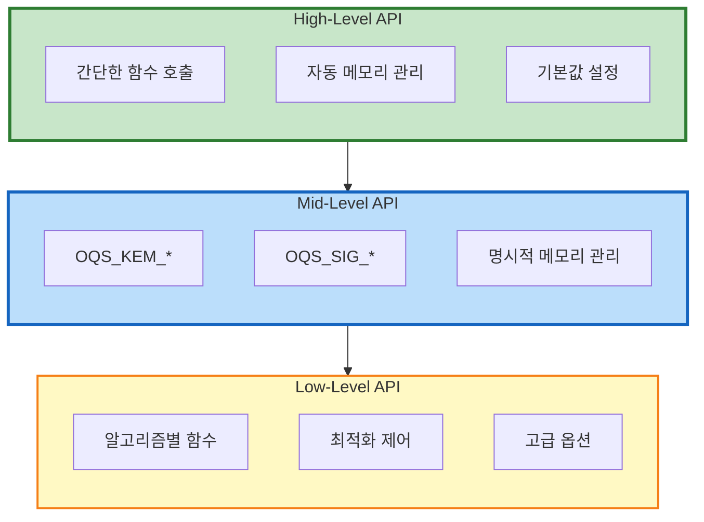
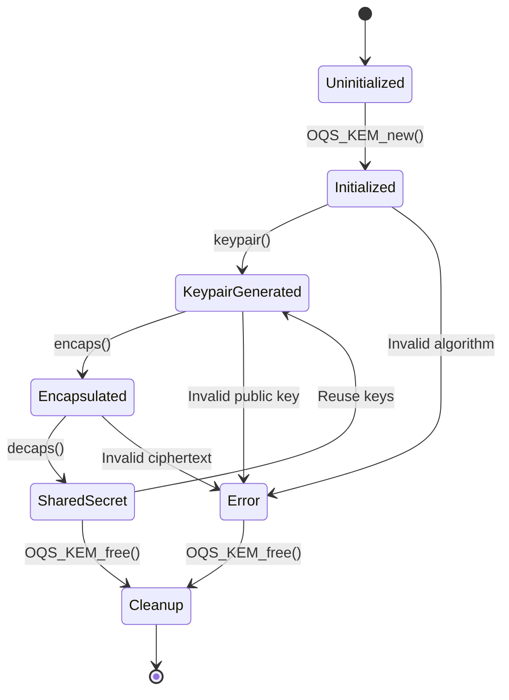
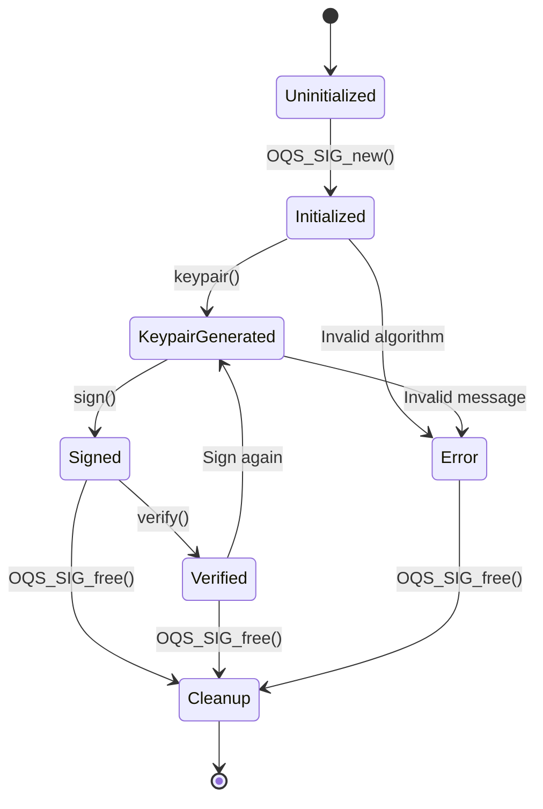

# OQS 상세 설계 (OQS Detailed Design)

> **OQS API 상세 설계** - liboqs API 명세 및 알고리즘 구현 상세
> KEM, Signature, RNG API의 완전한 설계 문서

---

## 📑 목차

1. [설계 개요](#1-설계-개요)
2. [KEM API 상세](#2-kem-api-상세)
3. [Digital Signature API 상세](#3-digital-signature-api-상세)
4. [RNG (Random Number Generation)](#4-rng-random-number-generation)
5. [알고리즘 전환 메커니즘](#5-알고리즘-전환-메커니즘)
6. [에러 처리](#6-에러-처리)
7. [스레드 안전성 및 동시성](#7-스레드-안전성-및-동시성)
8. [최적화 및 성능](#8-최적화-및-성능)

---

## 1. 설계 개요

### 1.1 설계 철학

```yaml
핵심 원칙:
  1. 단순성 (Simplicity):
     - 직관적인 API
     - 최소한의 boilerplate
     - 명확한 함수 이름

  2. 안전성 (Safety):
     - 자동 메모리 관리 옵션
     - Type-safe 인터페이스
     - 에러 처리 명확화

  3. 성능 (Performance):
     - Zero-copy 설계
     - Minimal allocations
     - 하드웨어 가속 지원

  4. 이식성 (Portability):
     - C99 표준 준수
     - 크로스 플랫폼
     - 최소 의존성

  5. 확장성 (Extensibility):
     - 플러그인 아키텍처
     - 새로운 알고리즘 추가 용이
     - 백엔드 교체 가능
```

### 1.2 API 계층 구조



---

## 2. KEM API 상세

### 2.1 데이터 구조

```c
// include/oqs/kem.h

/**
 * KEM 알고리즘 구조체
 */
typedef struct OQS_KEM {
    /** 알고리즘 이름 (예: "Kyber1024") */
    const char *method_name;

    /** 알고리즘 버전 문자열 */
    const char *alg_version;

    /** NIST 보안 레벨 (1-5) */
    uint8_t claimed_nist_level;

    /** IND-CCA 보안 여부 */
    bool ind_cca;

    /** 공개키 길이 (bytes) */
    size_t length_public_key;

    /** 비밀키 길이 (bytes) */
    size_t length_secret_key;

    /** 암호문 길이 (bytes) */
    size_t length_ciphertext;

    /** 공유 비밀 길이 (bytes) */
    size_t length_shared_secret;

    /** 키쌍 생성 함수 포인터 */
    OQS_STATUS (*keypair)(uint8_t *public_key, uint8_t *secret_key);

    /** 캡슐화 함수 포인터 */
    OQS_STATUS (*encaps)(uint8_t *ciphertext,
                         uint8_t *shared_secret,
                         const uint8_t *public_key);

    /** 디캡슐화 함수 포인터 */
    OQS_STATUS (*decaps)(uint8_t *shared_secret,
                         const uint8_t *ciphertext,
                         const uint8_t *secret_key);
} OQS_KEM;

/**
 * 상태 코드
 */
typedef enum {
    OQS_SUCCESS = 0,    /** 성공 */
    OQS_ERROR = -1,     /** 일반 오류 */
    OQS_EXTERNAL_LIB_ERROR_OPENSSL = 50  /** OpenSSL 오류 */
} OQS_STATUS;
```

### 2.2 KEM 생명주기



### 2.3 KEM API 함수

#### OQS_KEM_new

```c
/**
 * KEM 알고리즘 객체 생성
 *
 * @param[in] method_name 알고리즘 이름 (예: "Kyber1024")
 * @return KEM 객체 포인터, 실패 시 NULL
 *
 * @note 반환된 객체는 OQS_KEM_free()로 해제해야 함
 *
 * 사용 예:
 *   OQS_KEM *kem = OQS_KEM_new("Kyber1024");
 *   if (kem == NULL) {
 *       // 알고리즘을 지원하지 않거나 메모리 부족
 *   }
 */
OQS_API OQS_KEM *OQS_KEM_new(const char *method_name);

// 구현
OQS_KEM *OQS_KEM_new(const char *method_name) {
    if (method_name == NULL) {
        return NULL;
    }

    // 알고리즘 검색
    for (size_t i = 0; supported_kems[i] != NULL; i++) {
        if (strcmp(method_name, supported_kems[i]->method_name) == 0) {
            // 메모리 할당
            OQS_KEM *kem = malloc(sizeof(OQS_KEM));
            if (kem == NULL) {
                return NULL;
            }

            // 구조체 복사
            memcpy(kem, supported_kems[i], sizeof(OQS_KEM));

            return kem;
        }
    }

    // 알고리즘을 찾을 수 없음
    return NULL;
}
```

#### OQS_KEM_keypair

```c
/**
 * KEM 키쌍 생성
 *
 * @param[in]  kem          KEM 객체
 * @param[out] public_key   공개키 버퍼 (length_public_key bytes)
 * @param[out] secret_key   비밀키 버퍼 (length_secret_key bytes)
 * @return OQS_SUCCESS 또는 OQS_ERROR
 *
 * @note 버퍼는 호출자가 할당해야 함
 * @note 비밀키는 사용 후 OQS_MEM_secure_free()로 안전하게 해제 필요
 *
 * 사용 예:
 *   uint8_t *pk = malloc(kem->length_public_key);
 *   uint8_t *sk = malloc(kem->length_secret_key);
 *   if (kem->keypair(pk, sk) != OQS_SUCCESS) {
 *       // 키 생성 실패
 *   }
 */
OQS_API OQS_STATUS OQS_KEM_keypair(const OQS_KEM *kem,
                                   uint8_t *public_key,
                                   uint8_t *secret_key);

// 사용 예제
void example_keypair() {
    OQS_KEM *kem = OQS_KEM_new("Kyber1024");

    // 메모리 할당
    uint8_t *public_key = malloc(kem->length_public_key);
    uint8_t *secret_key = malloc(kem->length_secret_key);

    // 키 생성
    if (kem->keypair(public_key, secret_key) != OQS_SUCCESS) {
        fprintf(stderr, "키 생성 실패\n");
        goto cleanup;
    }

    printf("키 생성 성공:\n");
    printf("  공개키: %zu bytes\n", kem->length_public_key);
    printf("  비밀키: %zu bytes\n", kem->length_secret_key);

    // 공개키 출력 (첫 32 bytes)
    printf("  공개키 (hex): ");
    for (size_t i = 0; i < 32 && i < kem->length_public_key; i++) {
        printf("%02x", public_key[i]);
    }
    printf("...\n");

cleanup:
    OQS_MEM_secure_free(secret_key, kem->length_secret_key);
    free(public_key);
    OQS_KEM_free(kem);
}
```

#### OQS_KEM_encaps

```c
/**
 * KEM 캡슐화 (키 생성 및 암호화)
 *
 * @param[in]  kem             KEM 객체
 * @param[out] ciphertext      암호문 버퍼 (length_ciphertext bytes)
 * @param[out] shared_secret   공유 비밀 버퍼 (length_shared_secret bytes)
 * @param[in]  public_key      공개키
 * @return OQS_SUCCESS 또는 OQS_ERROR
 *
 * @note 생성된 공유 비밀은 decaps()로 복구 가능
 * @note 공유 비밀은 사용 후 안전하게 해제 필요
 *
 * 사용 예:
 *   uint8_t *ct = malloc(kem->length_ciphertext);
 *   uint8_t *ss = malloc(kem->length_shared_secret);
 *   if (kem->encaps(ct, ss, public_key) != OQS_SUCCESS) {
 *       // 캡슐화 실패
 *   }
 */
OQS_API OQS_STATUS OQS_KEM_encaps(const OQS_KEM *kem,
                                  uint8_t *ciphertext,
                                  uint8_t *shared_secret,
                                  const uint8_t *public_key);

// 사용 예제
void example_encaps() {
    OQS_KEM *kem = OQS_KEM_new("Kyber1024");

    // 키 생성 (서버)
    uint8_t *server_pk = malloc(kem->length_public_key);
    uint8_t *server_sk = malloc(kem->length_secret_key);
    kem->keypair(server_pk, server_sk);

    // 캡슐화 (클라이언트)
    uint8_t *ciphertext = malloc(kem->length_ciphertext);
    uint8_t *client_ss = malloc(kem->length_shared_secret);

    if (kem->encaps(ciphertext, client_ss, server_pk) != OQS_SUCCESS) {
        fprintf(stderr, "캡슐화 실패\n");
        goto cleanup;
    }

    printf("캡슐화 성공:\n");
    printf("  암호문: %zu bytes\n", kem->length_ciphertext);
    printf("  공유 비밀: %zu bytes\n", kem->length_shared_secret);

    // 공유 비밀 출력 (hex)
    printf("  공유 비밀 (hex): ");
    for (size_t i = 0; i < kem->length_shared_secret; i++) {
        printf("%02x", client_ss[i]);
    }
    printf("\n");

cleanup:
    OQS_MEM_secure_free(server_sk, kem->length_secret_key);
    OQS_MEM_secure_free(client_ss, kem->length_shared_secret);
    free(server_pk);
    free(ciphertext);
    OQS_KEM_free(kem);
}
```

#### OQS_KEM_decaps

```c
/**
 * KEM 디캡슐화 (암호문 복호화 및 공유 비밀 복구)
 *
 * @param[in]  kem             KEM 객체
 * @param[out] shared_secret   공유 비밀 버퍼 (length_shared_secret bytes)
 * @param[in]  ciphertext      암호문
 * @param[in]  secret_key      비밀키
 * @return OQS_SUCCESS 또는 OQS_ERROR
 *
 * @note encaps()로 생성된 공유 비밀과 동일한 값 생성
 * @note 잘못된 암호문은 랜덤 비밀을 반환 (IND-CCA 보안)
 *
 * 사용 예:
 *   uint8_t *ss = malloc(kem->length_shared_secret);
 *   if (kem->decaps(ss, ciphertext, secret_key) != OQS_SUCCESS) {
 *       // 디캡슐화 실패
 *   }
 */
OQS_API OQS_STATUS OQS_KEM_decaps(const OQS_KEM *kem,
                                  uint8_t *shared_secret,
                                  const uint8_t *ciphertext,
                                  const uint8_t *secret_key);

// 완전한 KEM 예제
void complete_kem_example() {
    OQS_KEM *kem = OQS_KEM_new("Kyber1024");
    if (kem == NULL) {
        fprintf(stderr, "Kyber1024를 지원하지 않습니다.\n");
        return;
    }

    // 메모리 할당
    uint8_t *public_key = malloc(kem->length_public_key);
    uint8_t *secret_key = malloc(kem->length_secret_key);
    uint8_t *ciphertext = malloc(kem->length_ciphertext);
    uint8_t *shared_secret_client = malloc(kem->length_shared_secret);
    uint8_t *shared_secret_server = malloc(kem->length_shared_secret);

    // 1. 서버: 키쌍 생성
    printf("[서버] 키쌍 생성...\n");
    if (kem->keypair(public_key, secret_key) != OQS_SUCCESS) {
        fprintf(stderr, "키 생성 실패\n");
        goto cleanup;
    }
    printf("[서버] 키쌍 생성 완료 (pk: %zu bytes, sk: %zu bytes)\n",
           kem->length_public_key, kem->length_secret_key);

    // 2. 클라이언트: 캡슐화
    printf("[클라이언트] 캡슐화...\n");
    if (kem->encaps(ciphertext, shared_secret_client, public_key) != OQS_SUCCESS) {
        fprintf(stderr, "캡슐화 실패\n");
        goto cleanup;
    }
    printf("[클라이언트] 캡슐화 완료 (ct: %zu bytes, ss: %zu bytes)\n",
           kem->length_ciphertext, kem->length_shared_secret);

    // 3. 서버: 디캡슐화
    printf("[서버] 디캡슐화...\n");
    if (kem->decaps(shared_secret_server, ciphertext, secret_key) != OQS_SUCCESS) {
        fprintf(stderr, "디캡슐화 실패\n");
        goto cleanup;
    }
    printf("[서버] 디캡슐화 완료\n");

    // 4. 공유 비밀 비교
    if (memcmp(shared_secret_client, shared_secret_server,
               kem->length_shared_secret) == 0) {
        printf("✓ 공유 비밀 일치!\n");

        // 공유 비밀 출력
        printf("공유 비밀 (hex): ");
        for (size_t i = 0; i < kem->length_shared_secret; i++) {
            printf("%02x", shared_secret_client[i]);
        }
        printf("\n");
    } else {
        printf("✗ 공유 비밀 불일치!\n");
    }

cleanup:
    // 안전한 메모리 해제
    OQS_MEM_secure_free(secret_key, kem->length_secret_key);
    OQS_MEM_secure_free(shared_secret_client, kem->length_shared_secret);
    OQS_MEM_secure_free(shared_secret_server, kem->length_shared_secret);
    free(public_key);
    free(ciphertext);
    OQS_KEM_free(kem);
}
```

### 2.4 KEM 알고리즘 조회

```c
/**
 * 지원하는 KEM 알고리즘 개수 조회
 * @return 알고리즘 개수
 */
OQS_API int OQS_KEM_alg_count(void);

/**
 * KEM 알고리즘 이름 조회
 * @param[in] i 인덱스 (0 ~ OQS_KEM_alg_count()-1)
 * @return 알고리즘 이름, 범위 밖이면 NULL
 */
OQS_API const char *OQS_KEM_alg_identifier(size_t i);

/**
 * KEM 알고리즘 활성화 여부 확인
 * @param[in] method_name 알고리즘 이름
 * @return 1 (활성화), 0 (비활성화)
 */
OQS_API int OQS_KEM_alg_is_enabled(const char *method_name);

// 사용 예제
void list_all_kems() {
    printf("지원하는 KEM 알고리즘:\n");

    int count = OQS_KEM_alg_count();
    for (int i = 0; i < count; i++) {
        const char *name = OQS_KEM_alg_identifier(i);

        if (OQS_KEM_alg_is_enabled(name)) {
            OQS_KEM *kem = OQS_KEM_new(name);
            if (kem != NULL) {
                printf("  [%2d] %-25s (Level %d, pk=%5zu, ct=%5zu, ss=%3zu)\n",
                       i + 1, kem->method_name,
                       kem->claimed_nist_level,
                       kem->length_public_key,
                       kem->length_ciphertext,
                       kem->length_shared_secret);
                OQS_KEM_free(kem);
            }
        } else {
            printf("  [%2d] %-25s (비활성화)\n", i + 1, name);
        }
    }
}

// 출력 예:
//   [1] Kyber512                  (Level 1, pk=  800, ct=  768, ss= 32)
//   [2] Kyber768                  (Level 3, pk= 1184, ct= 1088, ss= 32)
//   [3] Kyber1024                 (Level 5, pk= 1568, ct= 1568, ss= 32)
//   [4] Classic-McEliece-348864   (Level 1, pk=261120, ct=  128, ss= 32)
//   ...
```

---

## 3. Digital Signature API 상세

### 3.1 데이터 구조

```c
// include/oqs/sig.h

/**
 * Signature 알고리즘 구조체
 */
typedef struct OQS_SIG {
    /** 알고리즘 이름 (예: "Dilithium3") */
    const char *method_name;

    /** 알고리즘 버전 문자열 */
    const char *alg_version;

    /** NIST 보안 레벨 (1-5) */
    uint8_t claimed_nist_level;

    /** EUF-CMA 보안 여부 */
    bool euf_cma;

    /** 공개키 길이 (bytes) */
    size_t length_public_key;

    /** 비밀키 길이 (bytes) */
    size_t length_secret_key;

    /** 최대 서명 길이 (bytes) */
    size_t length_signature;

    /** 키쌍 생성 함수 포인터 */
    OQS_STATUS (*keypair)(uint8_t *public_key, uint8_t *secret_key);

    /** 서명 생성 함수 포인터 */
    OQS_STATUS (*sign)(uint8_t *signature,
                       size_t *signature_len,
                       const uint8_t *message,
                       size_t message_len,
                       const uint8_t *secret_key);

    /** 서명 검증 함수 포인터 */
    OQS_STATUS (*verify)(const uint8_t *message,
                         size_t message_len,
                         const uint8_t *signature,
                         size_t signature_len,
                         const uint8_t *public_key);
} OQS_SIG;
```

### 3.2 Signature 생명주기



### 3.3 Signature API 함수

#### OQS_SIG_new

```c
/**
 * Signature 알고리즘 객체 생성
 *
 * @param[in] method_name 알고리즘 이름 (예: "Dilithium3")
 * @return Signature 객체 포인터, 실패 시 NULL
 */
OQS_API OQS_SIG *OQS_SIG_new(const char *method_name);

// 사용 예
OQS_SIG *sig = OQS_SIG_new("Dilithium3");
if (sig == NULL) {
    fprintf(stderr, "Dilithium3를 지원하지 않습니다.\n");
}
```

#### OQS_SIG_keypair

```c
/**
 * Signature 키쌍 생성
 *
 * @param[in]  sig          Signature 객체
 * @param[out] public_key   공개키 버퍼 (length_public_key bytes)
 * @param[out] secret_key   비밀키 버퍼 (length_secret_key bytes)
 * @return OQS_SUCCESS 또는 OQS_ERROR
 */
OQS_API OQS_STATUS OQS_SIG_keypair(const OQS_SIG *sig,
                                   uint8_t *public_key,
                                   uint8_t *secret_key);

// 사용 예
void example_sig_keypair() {
    OQS_SIG *sig = OQS_SIG_new("Dilithium3");

    uint8_t *pk = malloc(sig->length_public_key);
    uint8_t *sk = malloc(sig->length_secret_key);

    if (sig->keypair(pk, sk) != OQS_SUCCESS) {
        fprintf(stderr, "키 생성 실패\n");
        goto cleanup;
    }

    printf("서명 키쌍 생성:\n");
    printf("  공개키: %zu bytes\n", sig->length_public_key);
    printf("  비밀키: %zu bytes\n", sig->length_secret_key);

cleanup:
    OQS_MEM_secure_free(sk, sig->length_secret_key);
    free(pk);
    OQS_SIG_free(sig);
}
```

#### OQS_SIG_sign

```c
/**
 * 디지털 서명 생성
 *
 * @param[in]  sig             Signature 객체
 * @param[out] signature       서명 버퍼 (length_signature bytes)
 * @param[out] signature_len   실제 서명 길이
 * @param[in]  message         서명할 메시지
 * @param[in]  message_len     메시지 길이
 * @param[in]  secret_key      비밀키
 * @return OQS_SUCCESS 또는 OQS_ERROR
 *
 * @note signature_len은 length_signature 이하
 */
OQS_API OQS_STATUS OQS_SIG_sign(const OQS_SIG *sig,
                                uint8_t *signature,
                                size_t *signature_len,
                                const uint8_t *message,
                                size_t message_len,
                                const uint8_t *secret_key);

// 사용 예
void example_sign() {
    OQS_SIG *sig = OQS_SIG_new("Dilithium3");

    // 키 생성
    uint8_t *pk = malloc(sig->length_public_key);
    uint8_t *sk = malloc(sig->length_secret_key);
    sig->keypair(pk, sk);

    // 메시지
    const char *msg = "QSIGN Document Signature";
    size_t msg_len = strlen(msg);

    // 서명 생성
    uint8_t *signature = malloc(sig->length_signature);
    size_t sig_len;

    if (sig->sign(signature, &sig_len,
                  (uint8_t*)msg, msg_len,
                  sk) != OQS_SUCCESS) {
        fprintf(stderr, "서명 생성 실패\n");
        goto cleanup;
    }

    printf("서명 생성 성공:\n");
    printf("  메시지: \"%s\"\n", msg);
    printf("  서명 길이: %zu bytes (최대 %zu bytes)\n",
           sig_len, sig->length_signature);

    // 서명 출력 (첫 64 bytes)
    printf("  서명 (hex): ");
    for (size_t i = 0; i < 64 && i < sig_len; i++) {
        printf("%02x", signature[i]);
    }
    printf("...\n");

cleanup:
    OQS_MEM_secure_free(sk, sig->length_secret_key);
    OQS_MEM_secure_free(signature, sig->length_signature);
    free(pk);
    OQS_SIG_free(sig);
}
```

#### OQS_SIG_verify

```c
/**
 * 디지털 서명 검증
 *
 * @param[in] sig             Signature 객체
 * @param[in] message         원본 메시지
 * @param[in] message_len     메시지 길이
 * @param[in] signature       서명
 * @param[in] signature_len   서명 길이
 * @param[in] public_key      공개키
 * @return OQS_SUCCESS (검증 성공) 또는 OQS_ERROR (검증 실패)
 */
OQS_API OQS_STATUS OQS_SIG_verify(const OQS_SIG *sig,
                                  const uint8_t *message,
                                  size_t message_len,
                                  const uint8_t *signature,
                                  size_t signature_len,
                                  const uint8_t *public_key);

// 완전한 Signature 예제
void complete_signature_example() {
    OQS_SIG *sig = OQS_SIG_new("Dilithium3");
    if (sig == NULL) {
        fprintf(stderr, "Dilithium3를 지원하지 않습니다.\n");
        return;
    }

    // 메모리 할당
    uint8_t *public_key = malloc(sig->length_public_key);
    uint8_t *secret_key = malloc(sig->length_secret_key);
    uint8_t *signature = malloc(sig->length_signature);
    size_t signature_len;

    // 1. 키쌍 생성
    printf("[1] 키쌍 생성...\n");
    if (sig->keypair(public_key, secret_key) != OQS_SUCCESS) {
        fprintf(stderr, "키 생성 실패\n");
        goto cleanup;
    }
    printf("    키쌍 생성 완료 (pk: %zu bytes, sk: %zu bytes)\n",
           sig->length_public_key, sig->length_secret_key);

    // 2. 서명할 메시지
    const char *message = "QSIGN - Quantum-resistant Digital Signature";
    size_t message_len = strlen(message);
    printf("[2] 메시지: \"%s\" (%zu bytes)\n", message, message_len);

    // 3. 서명 생성
    printf("[3] 서명 생성...\n");
    if (sig->sign(signature, &signature_len,
                  (uint8_t*)message, message_len,
                  secret_key) != OQS_SUCCESS) {
        fprintf(stderr, "서명 생성 실패\n");
        goto cleanup;
    }
    printf("    서명 생성 완료 (%zu bytes)\n", signature_len);

    // 4. 서명 검증 (정상)
    printf("[4] 서명 검증 (정상 서명)...\n");
    if (sig->verify((uint8_t*)message, message_len,
                    signature, signature_len,
                    public_key) == OQS_SUCCESS) {
        printf("    ✓ 서명 검증 성공!\n");
    } else {
        printf("    ✗ 서명 검증 실패!\n");
    }

    // 5. 서명 검증 (변조된 메시지)
    printf("[5] 서명 검증 (변조된 메시지)...\n");
    char tampered_message[] = "QSIGN - Tampered Message";
    if (sig->verify((uint8_t*)tampered_message, strlen(tampered_message),
                    signature, signature_len,
                    public_key) == OQS_SUCCESS) {
        printf("    ✗ 변조된 메시지 검증 성공 (문제!)\n");
    } else {
        printf("    ✓ 변조된 메시지 검증 실패 (정상)\n");
    }

    // 6. 서명 검증 (변조된 서명)
    printf("[6] 서명 검증 (변조된 서명)...\n");
    signature[0] ^= 0x01;  // 1 bit 변조
    if (sig->verify((uint8_t*)message, message_len,
                    signature, signature_len,
                    public_key) == OQS_SUCCESS) {
        printf("    ✗ 변조된 서명 검증 성공 (문제!)\n");
    } else {
        printf("    ✓ 변조된 서명 검증 실패 (정상)\n");
    }

cleanup:
    // 안전한 메모리 해제
    OQS_MEM_secure_free(secret_key, sig->length_secret_key);
    OQS_MEM_secure_free(signature, sig->length_signature);
    free(public_key);
    OQS_SIG_free(sig);
}
```

### 3.4 Signature 알고리즘 조회

```c
/**
 * 지원하는 Signature 알고리즘 개수 조회
 */
OQS_API int OQS_SIG_alg_count(void);

/**
 * Signature 알고리즘 이름 조회
 */
OQS_API const char *OQS_SIG_alg_identifier(size_t i);

/**
 * Signature 알고리즘 활성화 여부 확인
 */
OQS_API int OQS_SIG_alg_is_enabled(const char *method_name);

// 사용 예제
void list_all_signatures() {
    printf("지원하는 Signature 알고리즘:\n");

    int count = OQS_SIG_alg_count();
    for (int i = 0; i < count; i++) {
        const char *name = OQS_SIG_alg_identifier(i);

        if (OQS_SIG_alg_is_enabled(name)) {
            OQS_SIG *sig = OQS_SIG_new(name);
            if (sig != NULL) {
                printf("  [%2d] %-25s (Level %d, pk=%5zu, sig=%6zu)\n",
                       i + 1, sig->method_name,
                       sig->claimed_nist_level,
                       sig->length_public_key,
                       sig->length_signature);
                OQS_SIG_free(sig);
            }
        } else {
            printf("  [%2d] %-25s (비활성화)\n", i + 1, name);
        }
    }
}

// 출력 예:
//   [1] Dilithium2                (Level 2, pk= 1312, sig=  2420)
//   [2] Dilithium3                (Level 3, pk= 1952, sig=  3293)
//   [3] Dilithium5                (Level 5, pk= 2592, sig=  4595)
//   [4] Falcon-512                (Level 1, pk=  897, sig=   666)
//   [5] Falcon-1024               (Level 5, pk= 1793, sig=  1280)
//   [6] SPHINCS+-SHA2-128s        (Level 1, pk=   32, sig=  7856)
//   ...
```

---

## 4. RNG (Random Number Generation)

### 4.1 RNG API

```c
// include/oqs/rand.h

/**
 * RNG 알고리즘 타입
 */
typedef enum {
    OQS_RAND_alg_system,     /** 시스템 RNG (/dev/urandom, BCryptGenRandom) */
    OQS_RAND_alg_nist_kat,   /** NIST KAT 테스트용 결정적 RNG */
    OQS_RAND_alg_openssl     /** OpenSSL RAND_bytes */
} OQS_RAND_alg;

/**
 * 난수 생성 함수 타입
 */
typedef void (*randombytes_function)(uint8_t *random_array, size_t bytes_to_read);

/**
 * 난수 생성 (현재 설정된 RNG 사용)
 *
 * @param[out] random_array     난수 버퍼
 * @param[in]  bytes_to_read    생성할 난수 길이
 */
OQS_API void OQS_randombytes(uint8_t *random_array, size_t bytes_to_read);

/**
 * RNG 알고리즘 전환
 *
 * @param[in] algorithm RNG 알고리즘
 */
OQS_API void OQS_randombytes_switch_algorithm(OQS_RAND_alg algorithm);

/**
 * 커스텀 RNG 함수 설정
 *
 * @param[in] algorithm_ptr 난수 생성 함수 포인터
 */
OQS_API void OQS_randombytes_custom_algorithm(randombytes_function algorithm_ptr);
```

### 4.2 RNG 사용 예제

```c
#include <oqs/oqs.h>

// 시스템 RNG 사용 (기본)
void example_system_rng() {
    uint8_t random_bytes[32];

    // 기본 RNG (시스템 RNG)
    OQS_randombytes(random_bytes, sizeof(random_bytes));

    printf("Random bytes (hex): ");
    for (size_t i = 0; i < sizeof(random_bytes); i++) {
        printf("%02x", random_bytes[i]);
    }
    printf("\n");
}

// OpenSSL RNG 사용
void example_openssl_rng() {
    uint8_t random_bytes[32];

    // OpenSSL RNG로 전환
    OQS_randombytes_switch_algorithm(OQS_RAND_alg_openssl);

    OQS_randombytes(random_bytes, sizeof(random_bytes));

    printf("Random bytes (OpenSSL, hex): ");
    for (size_t i = 0; i < sizeof(random_bytes); i++) {
        printf("%02x", random_bytes[i]);
    }
    printf("\n");

    // 시스템 RNG로 복원
    OQS_randombytes_switch_algorithm(OQS_RAND_alg_system);
}

// NIST KAT 테스트용 RNG
void example_nist_kat_rng() {
    uint8_t random_bytes[32];

    // NIST KAT 결정적 RNG (테스트용)
    OQS_randombytes_switch_algorithm(OQS_RAND_alg_nist_kat);

    // 동일한 시드 → 동일한 난수
    uint8_t entropy_input[48] = {0};  // 시드
    OQS_randombytes_nist_kat_init(entropy_input, NULL, 256);

    OQS_randombytes(random_bytes, sizeof(random_bytes));

    printf("NIST KAT Random (hex): ");
    for (size_t i = 0; i < sizeof(random_bytes); i++) {
        printf("%02x", random_bytes[i]);
    }
    printf("\n");

    // 시스템 RNG로 복원
    OQS_randombytes_switch_algorithm(OQS_RAND_alg_system);
}

// 커스텀 RNG
void my_custom_rng(uint8_t *random_array, size_t bytes_to_read) {
    // 예: Hardware RNG, Luna HSM RNG 등
    // 여기서는 예시로 /dev/urandom 사용
    FILE *fp = fopen("/dev/urandom", "rb");
    if (fp != NULL) {
        fread(random_array, 1, bytes_to_read, fp);
        fclose(fp);
    }
}

void example_custom_rng() {
    uint8_t random_bytes[32];

    // 커스텀 RNG 설정
    OQS_randombytes_custom_algorithm(&my_custom_rng);

    OQS_randombytes(random_bytes, sizeof(random_bytes));

    printf("Custom RNG (hex): ");
    for (size_t i = 0; i < sizeof(random_bytes); i++) {
        printf("%02x", random_bytes[i]);
    }
    printf("\n");

    // 시스템 RNG로 복원
    OQS_randombytes_switch_algorithm(OQS_RAND_alg_system);
}
```

### 4.3 Luna HSM RNG 통합

```c
// Luna HSM을 RNG로 사용

#include <cryptoki.h>
#include <oqs/oqs.h>

static CK_SESSION_HANDLE hsm_session = CK_INVALID_HANDLE;

void luna_hsm_rng(uint8_t *random_array, size_t bytes_to_read) {
    if (hsm_session == CK_INVALID_HANDLE) {
        fprintf(stderr, "HSM session이 초기화되지 않았습니다.\n");
        return;
    }

    // Luna HSM에서 난수 생성
    CK_RV rv = C_GenerateRandom(hsm_session,
                                random_array,
                                (CK_ULONG)bytes_to_read);

    if (rv != CKR_OK) {
        fprintf(stderr, "HSM 난수 생성 실패: 0x%lx\n", rv);
    }
}

int setup_luna_hsm_rng() {
    // 1. PKCS#11 초기화
    CK_RV rv = C_Initialize(NULL);
    if (rv != CKR_OK && rv != CKR_CRYPTOKI_ALREADY_INITIALIZED) {
        return -1;
    }

    // 2. 슬롯 찾기
    CK_SLOT_ID slot_id;
    CK_ULONG slot_count = 1;
    rv = C_GetSlotList(CK_TRUE, &slot_id, &slot_count);
    if (rv != CKR_OK || slot_count == 0) {
        return -1;
    }

    // 3. 세션 열기
    rv = C_OpenSession(slot_id,
                       CKF_SERIAL_SESSION | CKF_RW_SESSION,
                       NULL, NULL,
                       &hsm_session);
    if (rv != CKR_OK) {
        return -1;
    }

    // 4. 로그인 (필요 시)
    // C_Login(hsm_session, CKU_USER, pin, pin_len);

    // 5. OQS RNG를 HSM RNG로 설정
    OQS_randombytes_custom_algorithm(&luna_hsm_rng);

    printf("Luna HSM RNG 초기화 완료\n");
    return 0;
}

void cleanup_luna_hsm_rng() {
    if (hsm_session != CK_INVALID_HANDLE) {
        C_CloseSession(hsm_session);
        hsm_session = CK_INVALID_HANDLE;
    }

    // 시스템 RNG로 복원
    OQS_randombytes_switch_algorithm(OQS_RAND_alg_system);

    C_Finalize(NULL);
}
```

---

## 5. 알고리즘 전환 메커니즘

### 5.1 Runtime Algorithm Selection

```c
// 런타임에 알고리즘 선택

#include <oqs/oqs.h>

typedef struct {
    const char *kem_algorithm;
    const char *sig_algorithm;
    int nist_level;
} CryptoPolicy;

// 보안 정책별 알고리즘 선택
CryptoPolicy get_crypto_policy(const char *security_level) {
    CryptoPolicy policy = {NULL, NULL, 0};

    if (strcmp(security_level, "high") == 0) {
        policy.kem_algorithm = "Kyber1024";
        policy.sig_algorithm = "Dilithium5";
        policy.nist_level = 5;
    } else if (strcmp(security_level, "medium") == 0) {
        policy.kem_algorithm = "Kyber768";
        policy.sig_algorithm = "Dilithium3";
        policy.nist_level = 3;
    } else if (strcmp(security_level, "low") == 0) {
        policy.kem_algorithm = "Kyber512";
        policy.sig_algorithm = "Dilithium2";
        policy.nist_level = 2;
    }

    return policy;
}

// 알고리즘 전환 예제
void algorithm_agility_example() {
    // 1. 보안 정책 읽기 (예: 환경 변수, 설정 파일)
    const char *security_level = getenv("QSIGN_SECURITY_LEVEL");
    if (security_level == NULL) {
        security_level = "medium";  // 기본값
    }

    CryptoPolicy policy = get_crypto_policy(security_level);

    printf("보안 정책: %s (NIST Level %d)\n",
           security_level, policy.nist_level);
    printf("  KEM: %s\n", policy.kem_algorithm);
    printf("  Signature: %s\n", policy.sig_algorithm);

    // 2. 알고리즘 초기화
    OQS_KEM *kem = OQS_KEM_new(policy.kem_algorithm);
    OQS_SIG *sig = OQS_SIG_new(policy.sig_algorithm);

    if (kem == NULL || sig == NULL) {
        fprintf(stderr, "알고리즘을 지원하지 않습니다.\n");
        return;
    }

    // 3. 암호화 작업 수행
    // ... (KEM 및 Signature 사용) ...

    // 4. 정리
    OQS_KEM_free(kem);
    OQS_SIG_free(sig);
}
```

### 5.2 Hybrid Mode Selector

```c
// Hybrid vs Pure PQC 선택

typedef enum {
    CRYPTO_MODE_PURE_PQC,     // 순수 PQC
    CRYPTO_MODE_HYBRID,        // Hybrid (PQC + 전통적)
    CRYPTO_MODE_CLASSICAL      // 전통적 알고리즘만
} CryptoMode;

typedef struct {
    CryptoMode mode;

    // PQC 알고리즘
    const char *pqc_kem;
    const char *pqc_sig;

    // 전통적 알고리즘 (Hybrid 모드용)
    const char *classical_kem;    // 예: "ECDH-P384"
    const char *classical_sig;    // 예: "RSA-PSS-3072"
} HybridConfig;

HybridConfig get_hybrid_config(CryptoMode mode) {
    HybridConfig config = {mode, NULL, NULL, NULL, NULL};

    switch (mode) {
        case CRYPTO_MODE_PURE_PQC:
            config.pqc_kem = "Kyber1024";
            config.pqc_sig = "Dilithium3";
            break;

        case CRYPTO_MODE_HYBRID:
            config.pqc_kem = "Kyber1024";
            config.pqc_sig = "Dilithium3";
            config.classical_kem = "ECDH-P384";
            config.classical_sig = "RSA-PSS-3072";
            break;

        case CRYPTO_MODE_CLASSICAL:
            config.classical_kem = "ECDH-P384";
            config.classical_sig = "RSA-PSS-3072";
            break;
    }

    return config;
}

void hybrid_mode_example() {
    // 환경에 따라 모드 선택
    CryptoMode mode = CRYPTO_MODE_HYBRID;  // 기본: Hybrid

    // Legacy 시스템 감지
    if (getenv("LEGACY_SYSTEM") != NULL) {
        printf("레거시 시스템 감지: 전통적 알고리즘 사용\n");
        mode = CRYPTO_MODE_CLASSICAL;
    }
    // 완전한 PQC 전환
    else if (getenv("PURE_PQC") != NULL) {
        printf("순수 PQC 모드\n");
        mode = CRYPTO_MODE_PURE_PQC;
    }

    HybridConfig config = get_hybrid_config(mode);

    printf("암호화 모드: ");
    switch (config.mode) {
        case CRYPTO_MODE_PURE_PQC:
            printf("Pure PQC\n");
            printf("  KEM: %s\n", config.pqc_kem);
            printf("  Signature: %s\n", config.pqc_sig);
            break;

        case CRYPTO_MODE_HYBRID:
            printf("Hybrid\n");
            printf("  PQC KEM: %s + Classical KEM: %s\n",
                   config.pqc_kem, config.classical_kem);
            printf("  PQC Sig: %s + Classical Sig: %s\n",
                   config.pqc_sig, config.classical_sig);
            break;

        case CRYPTO_MODE_CLASSICAL:
            printf("Classical\n");
            printf("  KEM: %s\n", config.classical_kem);
            printf("  Signature: %s\n", config.classical_sig);
            break;
    }
}
```

---

## 6. 에러 처리

### 6.1 에러 코드

```c
// include/oqs/common.h

typedef enum {
    OQS_SUCCESS = 0,                        /** 성공 */
    OQS_ERROR = -1,                         /** 일반 오류 */
    OQS_EXTERNAL_LIB_ERROR_OPENSSL = 50,   /** OpenSSL 오류 */
    OQS_EXTERNAL_LIB_ERROR_PKCS11 = 51,    /** PKCS#11 오류 */
    OQS_EXTERNAL_LIB_ERROR_UNKNOWN = 99     /** 알 수 없는 외부 라이브러리 오류 */
} OQS_STATUS;

// 에러 메시지 매핑
const char *OQS_strerror(OQS_STATUS status) {
    switch (status) {
        case OQS_SUCCESS:
            return "성공";
        case OQS_ERROR:
            return "일반 오류";
        case OQS_EXTERNAL_LIB_ERROR_OPENSSL:
            return "OpenSSL 오류";
        case OQS_EXTERNAL_LIB_ERROR_PKCS11:
            return "PKCS#11 (HSM) 오류";
        case OQS_EXTERNAL_LIB_ERROR_UNKNOWN:
            return "알 수 없는 외부 라이브러리 오류";
        default:
            return "정의되지 않은 오류";
    }
}
```

### 6.2 에러 처리 패턴

```c
// 권장되는 에러 처리 패턴

#include <oqs/oqs.h>

int secure_kem_operation() {
    OQS_KEM *kem = NULL;
    uint8_t *pk = NULL, *sk = NULL, *ct = NULL, *ss = NULL;
    int result = -1;

    // 1. KEM 생성
    kem = OQS_KEM_new("Kyber1024");
    if (kem == NULL) {
        fprintf(stderr, "ERROR: KEM 생성 실패 (알고리즘 미지원)\n");
        goto cleanup;
    }

    // 2. 메모리 할당
    pk = malloc(kem->length_public_key);
    sk = malloc(kem->length_secret_key);
    ct = malloc(kem->length_ciphertext);
    ss = malloc(kem->length_shared_secret);

    if (pk == NULL || sk == NULL || ct == NULL || ss == NULL) {
        fprintf(stderr, "ERROR: 메모리 할당 실패\n");
        goto cleanup;
    }

    // 3. 키 생성
    OQS_STATUS status = kem->keypair(pk, sk);
    if (status != OQS_SUCCESS) {
        fprintf(stderr, "ERROR: 키 생성 실패 (%s)\n", OQS_strerror(status));
        goto cleanup;
    }

    // 4. 캡슐화
    status = kem->encaps(ct, ss, pk);
    if (status != OQS_SUCCESS) {
        fprintf(stderr, "ERROR: 캡슐화 실패 (%s)\n", OQS_strerror(status));
        goto cleanup;
    }

    // 5. 성공
    printf("KEM 작업 성공\n");
    result = 0;

cleanup:
    // 6. 안전한 정리 (에러 발생 여부와 무관하게 실행)
    if (kem != NULL) {
        if (sk != NULL) {
            OQS_MEM_secure_free(sk, kem->length_secret_key);
        }
        if (ss != NULL) {
            OQS_MEM_secure_free(ss, kem->length_shared_secret);
        }
    }

    free(pk);
    free(ct);
    OQS_KEM_free(kem);

    return result;
}
```

### 6.3 로깅 및 디버깅

```c
// OQS 디버그 로깅

#include <stdarg.h>
#include <time.h>

typedef enum {
    OQS_LOG_LEVEL_ERROR,
    OQS_LOG_LEVEL_WARN,
    OQS_LOG_LEVEL_INFO,
    OQS_LOG_LEVEL_DEBUG
} OQS_LOG_LEVEL;

static OQS_LOG_LEVEL current_log_level = OQS_LOG_LEVEL_INFO;

void oqs_log(OQS_LOG_LEVEL level, const char *format, ...) {
    if (level > current_log_level) {
        return;  // 로그 레벨 필터링
    }

    // 타임스탬프
    time_t now = time(NULL);
    struct tm *tm_info = localtime(&now);
    char timestamp[32];
    strftime(timestamp, sizeof(timestamp), "%Y-%m-%d %H:%M:%S", tm_info);

    // 로그 레벨 문자열
    const char *level_str;
    switch (level) {
        case OQS_LOG_LEVEL_ERROR: level_str = "ERROR"; break;
        case OQS_LOG_LEVEL_WARN:  level_str = "WARN "; break;
        case OQS_LOG_LEVEL_INFO:  level_str = "INFO "; break;
        case OQS_LOG_LEVEL_DEBUG: level_str = "DEBUG"; break;
        default: level_str = "?????"; break;
    }

    // 로그 출력
    fprintf(stderr, "[%s] [%s] ", timestamp, level_str);

    va_list args;
    va_start(args, format);
    vfprintf(stderr, format, args);
    va_end(args);

    fprintf(stderr, "\n");
}

// 사용 예
void kem_with_logging() {
    oqs_log(OQS_LOG_LEVEL_INFO, "KEM 작업 시작");

    OQS_KEM *kem = OQS_KEM_new("Kyber1024");
    if (kem == NULL) {
        oqs_log(OQS_LOG_LEVEL_ERROR, "KEM 생성 실패: 알고리즘=%s", "Kyber1024");
        return;
    }

    oqs_log(OQS_LOG_LEVEL_DEBUG, "KEM 생성 성공: algorithm=%s, nist_level=%d",
            kem->method_name, kem->claimed_nist_level);

    uint8_t *pk = malloc(kem->length_public_key);
    uint8_t *sk = malloc(kem->length_secret_key);

    if (kem->keypair(pk, sk) != OQS_SUCCESS) {
        oqs_log(OQS_LOG_LEVEL_ERROR, "키 생성 실패");
        goto cleanup;
    }

    oqs_log(OQS_LOG_LEVEL_INFO, "키 생성 성공: pk_len=%zu, sk_len=%zu",
            kem->length_public_key, kem->length_secret_key);

cleanup:
    OQS_MEM_secure_free(sk, kem->length_secret_key);
    free(pk);
    OQS_KEM_free(kem);

    oqs_log(OQS_LOG_LEVEL_INFO, "KEM 작업 완료");
}

// 출력 예:
// [2025-11-16 19:30:15] [INFO ] KEM 작업 시작
// [2025-11-16 19:30:15] [DEBUG] KEM 생성 성공: algorithm=Kyber1024, nist_level=5
// [2025-11-16 19:30:15] [INFO ] 키 생성 성공: pk_len=1568, sk_len=3168
// [2025-11-16 19:30:15] [INFO ] KEM 작업 완료
```

---

## 7. 스레드 안전성 및 동시성

### 7.1 스레드 안전성

```yaml
OQS API 스레드 안전성:
  Read-Only 함수 (스레드 안전):
    - OQS_KEM_alg_count()
    - OQS_KEM_alg_identifier()
    - OQS_KEM_alg_is_enabled()
    - OQS_SIG_alg_count()
    - OQS_SIG_alg_identifier()
    - OQS_SIG_alg_is_enabled()

  객체 생성/해제 (스레드 안전):
    - OQS_KEM_new()
    - OQS_KEM_free()
    - OQS_SIG_new()
    - OQS_SIG_free()

  암호화 작업 (객체별 독립):
    - kem->keypair()
    - kem->encaps()
    - kem->decaps()
    - sig->keypair()
    - sig->sign()
    - sig->verify()
    주의: 동일 객체를 여러 스레드에서 공유하면 안전하지 않음

  전역 상태 변경 (스레드 안전하지 않음):
    - OQS_randombytes_switch_algorithm()
    - OQS_randombytes_custom_algorithm()
    주의: 멀티스레드 환경에서 mutex 보호 필요
```

### 7.2 멀티스레드 예제

```c
// 멀티스레드 KEM 키 생성

#include <pthread.h>
#include <oqs/oqs.h>

#define NUM_THREADS 4

typedef struct {
    int thread_id;
    OQS_KEM *kem;
    uint8_t *public_key;
    uint8_t *secret_key;
    OQS_STATUS result;
} ThreadData;

void *thread_keygen(void *arg) {
    ThreadData *data = (ThreadData *)arg;

    printf("[Thread %d] 키 생성 시작...\n", data->thread_id);

    // 각 스레드는 독립적인 KEM 객체 사용
    data->result = data->kem->keypair(data->public_key, data->secret_key);

    if (data->result == OQS_SUCCESS) {
        printf("[Thread %d] 키 생성 성공\n", data->thread_id);
    } else {
        printf("[Thread %d] 키 생성 실패\n", data->thread_id);
    }

    return NULL;
}

void multithread_keygen_example() {
    pthread_t threads[NUM_THREADS];
    ThreadData thread_data[NUM_THREADS];

    // 스레드별 KEM 객체 생성
    for (int i = 0; i < NUM_THREADS; i++) {
        thread_data[i].thread_id = i;
        thread_data[i].kem = OQS_KEM_new("Kyber1024");

        if (thread_data[i].kem == NULL) {
            fprintf(stderr, "KEM 생성 실패\n");
            return;
        }

        thread_data[i].public_key = malloc(thread_data[i].kem->length_public_key);
        thread_data[i].secret_key = malloc(thread_data[i].kem->length_secret_key);
    }

    // 스레드 생성 및 실행
    printf("멀티스레드 키 생성 시작 (%d threads)...\n", NUM_THREADS);

    for (int i = 0; i < NUM_THREADS; i++) {
        pthread_create(&threads[i], NULL, thread_keygen, &thread_data[i]);
    }

    // 스레드 종료 대기
    for (int i = 0; i < NUM_THREADS; i++) {
        pthread_join(threads[i], NULL);
    }

    printf("모든 스레드 완료\n");

    // 정리
    for (int i = 0; i < NUM_THREADS; i++) {
        OQS_MEM_secure_free(thread_data[i].secret_key,
                           thread_data[i].kem->length_secret_key);
        free(thread_data[i].public_key);
        OQS_KEM_free(thread_data[i].kem);
    }
}
```

### 7.3 RNG Mutex 보호

```c
// RNG 전환을 위한 Mutex

#include <pthread.h>
#include <oqs/oqs.h>

static pthread_mutex_t rng_mutex = PTHREAD_MUTEX_INITIALIZER;

void thread_safe_switch_rng(OQS_RAND_alg algorithm) {
    pthread_mutex_lock(&rng_mutex);
    OQS_randombytes_switch_algorithm(algorithm);
    pthread_mutex_unlock(&rng_mutex);
}

void thread_safe_custom_rng(randombytes_function func) {
    pthread_mutex_lock(&rng_mutex);
    OQS_randombytes_custom_algorithm(func);
    pthread_mutex_unlock(&rng_mutex);
}

void thread_safe_randombytes(uint8_t *buf, size_t len) {
    pthread_mutex_lock(&rng_mutex);
    OQS_randombytes(buf, len);
    pthread_mutex_unlock(&rng_mutex);
}
```

---

## 8. 최적화 및 성능

### 8.1 성능 측정

```c
// 성능 벤치마크

#include <time.h>
#include <oqs/oqs.h>

typedef struct {
    double keygen_ms;
    double encaps_ms;
    double decaps_ms;
} KEMBenchmark;

KEMBenchmark benchmark_kem(const char *algorithm, int iterations) {
    KEMBenchmark result = {0, 0, 0};

    OQS_KEM *kem = OQS_KEM_new(algorithm);
    if (kem == NULL) {
        return result;
    }

    uint8_t *pk = malloc(kem->length_public_key);
    uint8_t *sk = malloc(kem->length_secret_key);
    uint8_t *ct = malloc(kem->length_ciphertext);
    uint8_t *ss = malloc(kem->length_shared_secret);

    struct timespec start, end;

    // 키 생성 벤치마크
    clock_gettime(CLOCK_MONOTONIC, &start);
    for (int i = 0; i < iterations; i++) {
        kem->keypair(pk, sk);
    }
    clock_gettime(CLOCK_MONOTONIC, &end);
    result.keygen_ms = ((end.tv_sec - start.tv_sec) * 1000.0 +
                        (end.tv_nsec - start.tv_nsec) / 1000000.0) / iterations;

    // 캡슐화 벤치마크
    clock_gettime(CLOCK_MONOTONIC, &start);
    for (int i = 0; i < iterations; i++) {
        kem->encaps(ct, ss, pk);
    }
    clock_gettime(CLOCK_MONOTONIC, &end);
    result.encaps_ms = ((end.tv_sec - start.tv_sec) * 1000.0 +
                        (end.tv_nsec - start.tv_nsec) / 1000000.0) / iterations;

    // 디캡슐화 벤치마크
    clock_gettime(CLOCK_MONOTONIC, &start);
    for (int i = 0; i < iterations; i++) {
        kem->decaps(ss, ct, sk);
    }
    clock_gettime(CLOCK_MONOTONIC, &end);
    result.decaps_ms = ((end.tv_sec - start.tv_sec) * 1000.0 +
                        (end.tv_nsec - start.tv_nsec) / 1000000.0) / iterations;

    // 정리
    OQS_MEM_secure_free(sk, kem->length_secret_key);
    OQS_MEM_secure_free(ss, kem->length_shared_secret);
    free(pk);
    free(ct);
    OQS_KEM_free(kem);

    return result;
}

void performance_comparison() {
    const char *algorithms[] = {"Kyber512", "Kyber768", "Kyber1024", NULL};
    int iterations = 1000;

    printf("KEM 성능 벤치마크 (%d iterations):\n\n", iterations);
    printf("%-20s %12s %12s %12s\n",
           "알고리즘", "키생성(ms)", "캡슐화(ms)", "디캡슐화(ms)");
    printf("%-20s %12s %12s %12s\n",
           "--------------------", "------------", "------------", "------------");

    for (int i = 0; algorithms[i] != NULL; i++) {
        KEMBenchmark bench = benchmark_kem(algorithms[i], iterations);

        printf("%-20s %12.4f %12.4f %12.4f\n",
               algorithms[i],
               bench.keygen_ms,
               bench.encaps_ms,
               bench.decaps_ms);
    }
}

// 출력 예:
// KEM 성능 벤치마크 (1000 iterations):
//
// 알고리즘                 키생성(ms)   캡슐화(ms) 디캡슐화(ms)
// -------------------- ------------ ------------ ------------
// Kyber512                   0.0425       0.0498       0.0412
// Kyber768                   0.0532       0.0611       0.0524
// Kyber1024                  0.0645       0.0731       0.0638
```

---

**문서 정보**

```yaml
문서명: OQS-DESIGN.md
작성일: 2025-11-16
버전: 1.0.0
상태: 최종
작성자: QSIGN Documentation Team
관련 문서:
  - OQS-OVERVIEW.md - OQS 프로젝트 개요
  - OQS-ARCHITECTURE.md - OQS 아키텍처
  - LIBOQS-INTEGRATION.md - liboqs 통합 가이드
  - OQS-QSIGN-INTEGRATION.md - QSIGN 통합 상세
```

---

**다음 단계**

1. **실전 통합**: [LIBOQS-INTEGRATION.md](./LIBOQS-INTEGRATION.md)에서 빌드 및 통합 방법을 학습하세요.
2. **QSIGN 적용**: [OQS-QSIGN-INTEGRATION.md](./OQS-QSIGN-INTEGRATION.md)에서 실제 시스템 통합을 확인하세요.
3. **OpenSSL 통합**: [OPENSSL-OQS.md](./OPENSSL-OQS.md)에서 oqs-provider 사용법을 학습하세요.
