# OQS 개요 (Open Quantum Safe Overview)

> **OQS (Open Quantum Safe)** - 양자 내성 암호화 오픈소스 프로젝트
> Post-Quantum Cryptography 알고리즘의 표준 구현 및 프로토타입

---

## 📑 목차

1. [OQS 프로젝트란 무엇인가](#1-oqs-프로젝트란-무엇인가)
2. [OQS 생태계](#2-oqs-생태계)
3. [NIST PQC 표준화 프로세스](#3-nist-pqc-표준화-프로세스)
4. [지원 알고리즘 전체 목록](#4-지원-알고리즘-전체-목록)
5. [OQS vs 상용 솔루션](#5-oqs-vs-상용-솔루션)
6. [QSIGN에서의 OQS 역할](#6-qsign에서의-oqs-역할)
7. [OQS 프로젝트 로드맵](#7-oqs-프로젝트-로드맵)
8. [커뮤니티 및 기여](#8-커뮤니티-및-기여)

---

## 1. OQS 프로젝트란 무엇인가

### 1.1 정의

**Open Quantum Safe (OQS)** 는 양자 내성 암호화(Post-Quantum Cryptography, PQC) 알고리즘을 실제 시스템에서 사용할 수 있도록 구현하고 프로토타입을 제작하는 오픈소스 프로젝트입니다.

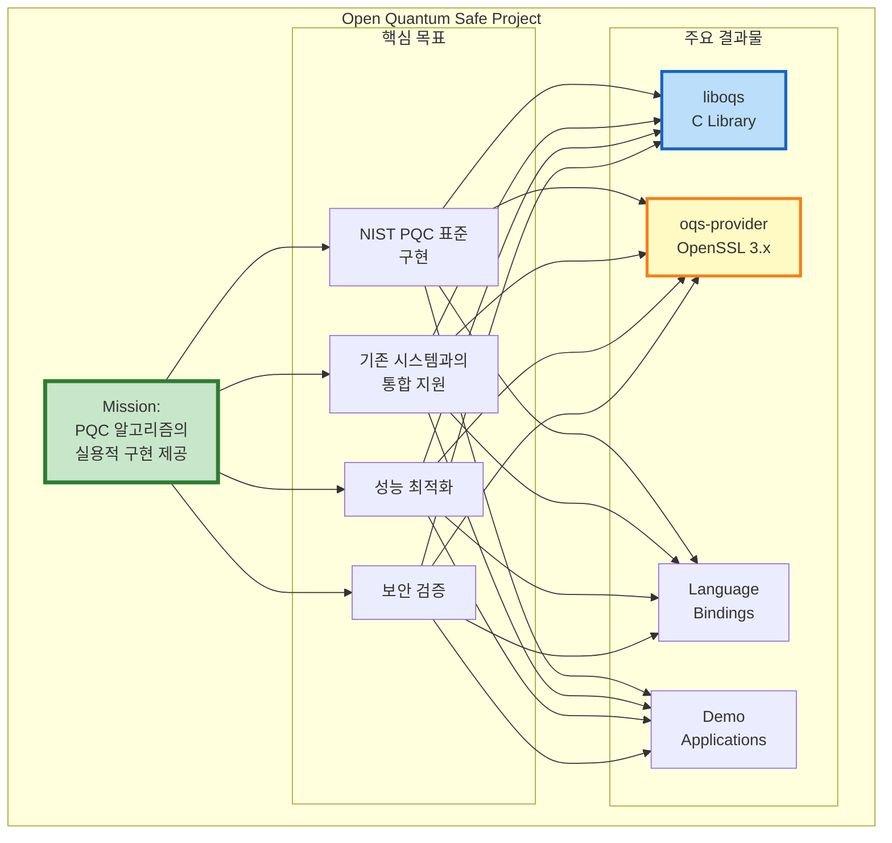

### 1.2 프로젝트 역사

#### 타임라인

```yaml
2016년:
  - 프로젝트 시작
  - University of Waterloo와 Microsoft Research 주도
  - NIST PQC 표준화 프로세스 시작에 맞춰 발족

2017년:
  - liboqs 첫 릴리스 (v0.1.0)
  - NIST Round 1 알고리즘 지원 시작
  - OpenSSL 1.0.2 통합 (oqs-openssl)

2019년:
  - NIST Round 2 알고리즘 업데이트
  - oqs-provider 개발 시작 (OpenSSL 3.0 준비)
  - 다양한 language bindings 추가

2020년:
  - NIST Round 3 Finalists 통합
  - 성능 최적화 및 하드웨어 가속 지원
  - FIPS 140-2/3 인증 준비

2022년:
  - NIST PQC 표준 선정 (KYBER, DILITHIUM, SPHINCS+)
  - liboqs 0.8.0 릴리스 (NIST 표준 알고리즘 우선 지원)
  - FIPS 203/204/205 초안 구현

2024년:
  - FIPS 203/204/205 정식 표준 발표
  - liboqs 0.10.0 릴리스 (최종 표준 구현)
  - ML-KEM, ML-DSA, SLH-DSA 공식 지원

2025년 (현재):
  - Production-ready 릴리스
  - Luna HSM 통합 지원
  - QSIGN 시스템 통합
```

### 1.3 프로젝트 구조

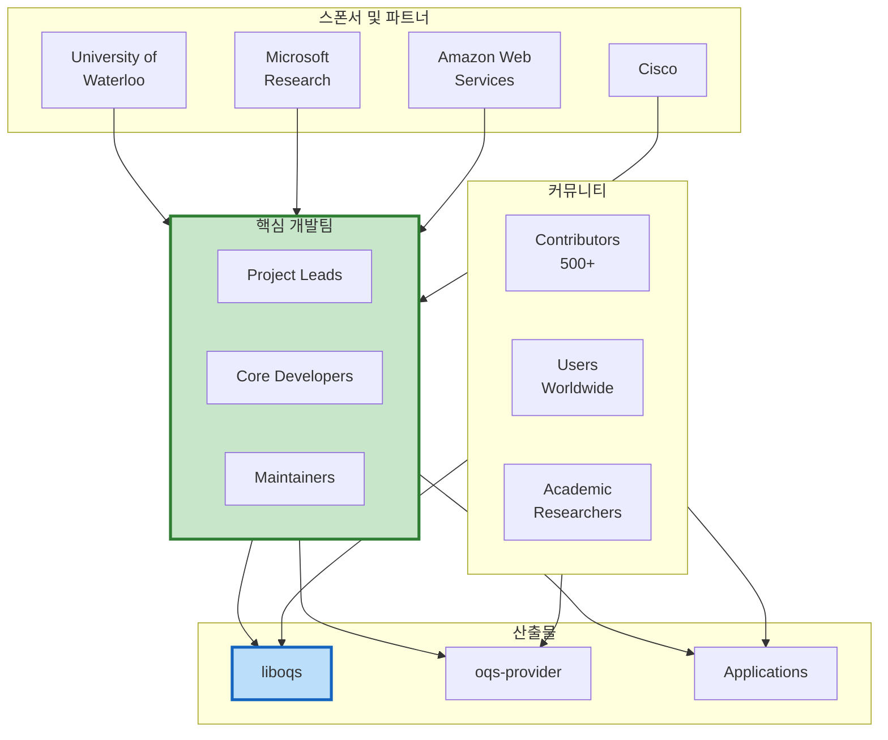

---

## 2. OQS 생태계

### 2.1 전체 구조

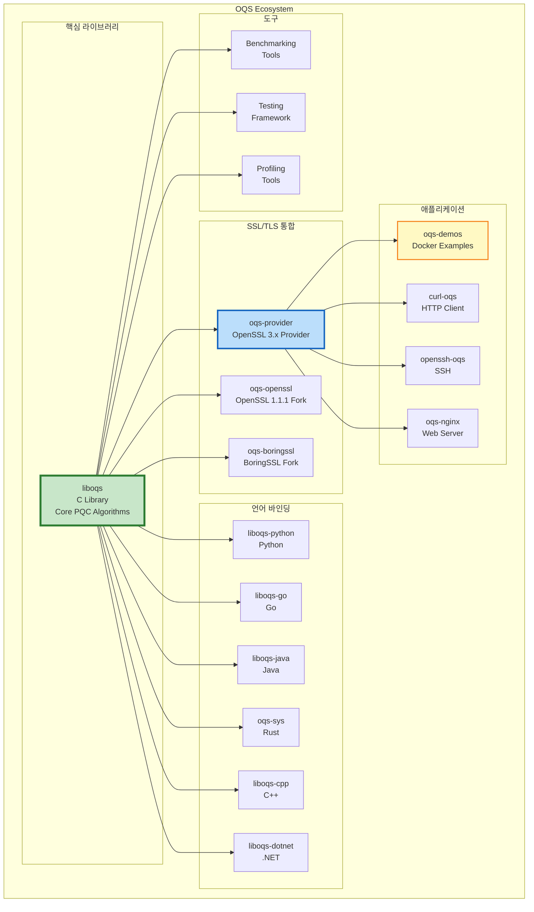

### 2.2 liboqs - 핵심 라이브러리

**liboqs** 는 OQS 생태계의 핵심으로, PQC 알고리즘의 C 구현을 제공합니다.

#### 주요 특징

```yaml
언어: C (C99 표준)

지원 플랫폼:
  - Linux (x86_64, ARM64, ARMv7)
  - Windows (x64)
  - macOS (Intel, Apple Silicon)
  - FreeBSD, OpenBSD

지원 알고리즘:
  KEM (Key Encapsulation Mechanism):
    - KYBER-512, KYBER-768, KYBER-1024 (ML-KEM)
    - Classic McEliece (multiple variants)
    - HQC (Hamming Quasi-Cyclic)
    - BIKE (Bit Flipping Key Encapsulation)

  Signature:
    - DILITHIUM2, DILITHIUM3, DILITHIUM5 (ML-DSA)
    - FALCON-512, FALCON-1024
    - SPHINCS+-SHA2, SPHINCS+-SHAKE (SLH-DSA)
    - MAYO (UOV-based)

빌드 시스템:
  - CMake 3.5+
  - 모듈화된 빌드 (알고리즘별 선택 가능)

하드웨어 최적화:
  - AVX2, AVX-512 (Intel/AMD)
  - NEON (ARM)
  - AES-NI (하드웨어 AES 가속)

메모리 보안:
  - Secure memory wiping
  - Constant-time operations
  - Side-channel attack 방어
```

#### liboqs API 구조

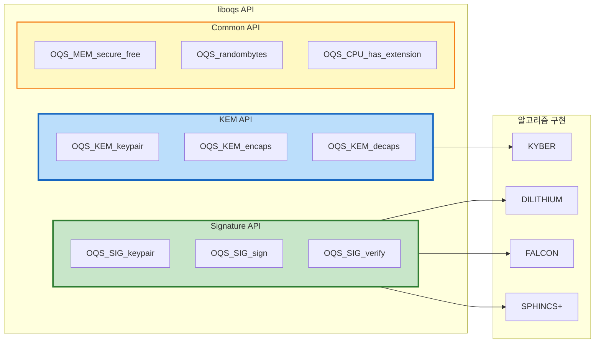

### 2.3 oqs-provider - OpenSSL 3.x 통합

**oqs-provider** 는 OpenSSL 3.x의 Provider 인터페이스를 통해 PQC 알고리즘을 제공합니다.

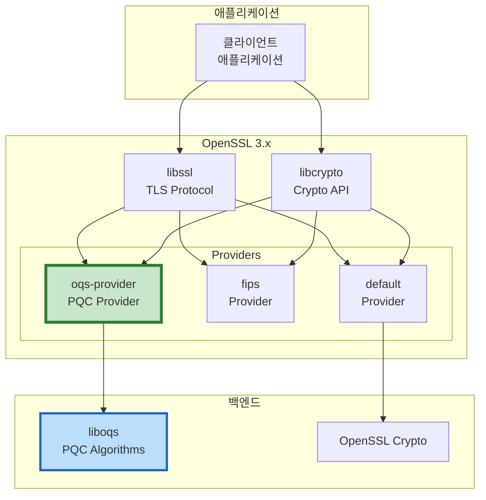

#### oqs-provider 기능

```yaml
지원 기능:
  TLS 1.3:
    - PQC 서명 인증서
    - Hybrid 키 교환 (ECDHE + KYBER)
    - 순수 PQC 키 교환

  X.509 인증서:
    - PQC 공개키/서명 인증서
    - Hybrid 인증서
    - CSR (Certificate Signing Request)

  CMS (Cryptographic Message Syntax):
    - S/MIME 메시지 서명/암호화
    - PQC 기반 메시지 보호

통합 방법:
  설정 파일:
    # openssl.cnf
    [provider_sect]
    default = default_sect
    oqs = oqs_sect

    [oqs_sect]
    activate = 1

  환경 변수:
    export OPENSSL_MODULES=/usr/local/lib/ossl-modules
    export OPENSSL_CONF=/etc/ssl/openssl-oqs.cnf

  런타임 로딩:
    OSSL_PROVIDER_load(NULL, "oqs");
```

### 2.4 언어 바인딩

#### Python (liboqs-python)

```python
# liboqs-python 예제
import oqs

# KEM 예제
with oqs.KeyEncapsulation("Kyber1024") as kem:
    # 키 생성
    public_key = kem.generate_keypair()

    # 캡슐화 (암호화)
    ciphertext, shared_secret_client = kem.encap_secret(public_key)

    # 디캡슐화 (복호화)
    shared_secret_server = kem.decap_secret(ciphertext)

    assert shared_secret_client == shared_secret_server

# Signature 예제
with oqs.Signature("Dilithium3") as sig:
    # 키 생성
    public_key = sig.generate_keypair()

    # 서명 생성
    message = b"QSIGN Message"
    signature = sig.sign(message)

    # 서명 검증
    is_valid = sig.verify(message, signature, public_key)
    print(f"서명 검증: {is_valid}")
```

#### Go (liboqs-go)

```go
// liboqs-go 예제
package main

import (
    "fmt"
    "github.com/open-quantum-safe/liboqs-go/oqs"
)

func main() {
    // KEM 예제
    kem := oqs.KeyEncapsulation{}
    defer kem.Clean()

    kem.Init("Kyber1024", nil)

    // 키 생성
    publicKey, _ := kem.GenerateKeyPair()

    // 캡슐화
    ciphertext, sharedSecretClient, _ := kem.EncapSecret(publicKey)

    // 디캡슐화
    sharedSecretServer, _ := kem.DecapSecret(ciphertext)

    fmt.Printf("공유 비밀 일치: %v\n",
        string(sharedSecretClient) == string(sharedSecretServer))

    // Signature 예제
    sig := oqs.Signature{}
    defer sig.Clean()

    sig.Init("Dilithium3", nil)

    // 서명 및 검증
    publicKey, _ = sig.GenerateKeyPair()
    message := []byte("QSIGN Message")
    signature, _ := sig.Sign(message)
    isValid, _ := sig.Verify(message, signature, publicKey)

    fmt.Printf("서명 검증: %v\n", isValid)
}
```

### 2.5 데모 애플리케이션 (oqs-demos)

**oqs-demos** 는 Docker 기반의 PQC 통합 예제를 제공합니다.

```yaml
제공되는 데모:
  웹 서버:
    - nginx-oqs: PQC TLS를 지원하는 Nginx
    - httpd-oqs: PQC TLS를 지원하는 Apache
    - chromium-oqs: PQC를 지원하는 Chromium 브라우저

  VPN:
    - openvpn-oqs: PQC를 사용하는 OpenVPN
    - wireguard-oqs: PQC WireGuard 프로토타입

  이메일:
    - postfix-oqs: PQC S/MIME 지원
    - dovecot-oqs: PQC 이메일 서버

  기타:
    - curl-oqs: PQC HTTPS 클라이언트
    - openssh-oqs: PQC SSH

Docker Compose 예제:
  version: '3.8'
  services:
    nginx-oqs:
      image: openquantumsafe/nginx:latest
      ports:
        - "4433:4433"
      environment:
        - DEFAULT_GROUPS=kyber1024:p384_kyber1024
      volumes:
        - ./certs:/opt/nginx/certs

    chromium-oqs:
      image: openquantumsafe/chromium:latest
      environment:
        - DISPLAY=$DISPLAY
      volumes:
        - /tmp/.X11-unix:/tmp/.X11-unix
```

---

## 3. NIST PQC 표준화 프로세스

### 3.1 타임라인

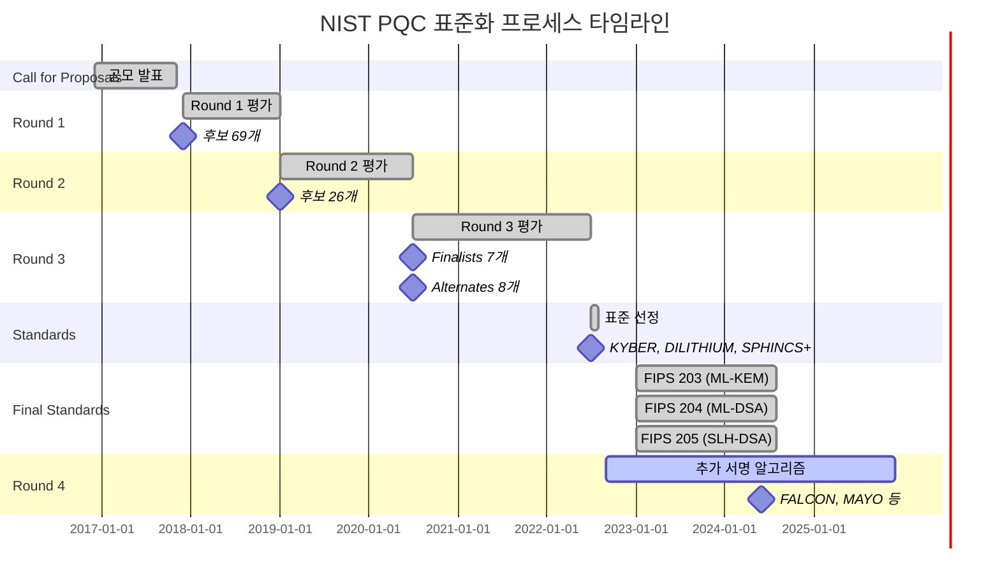

### 3.2 선정된 표준 알고리즘

#### FIPS 203: ML-KEM (Module-Lattice-Based KEM)

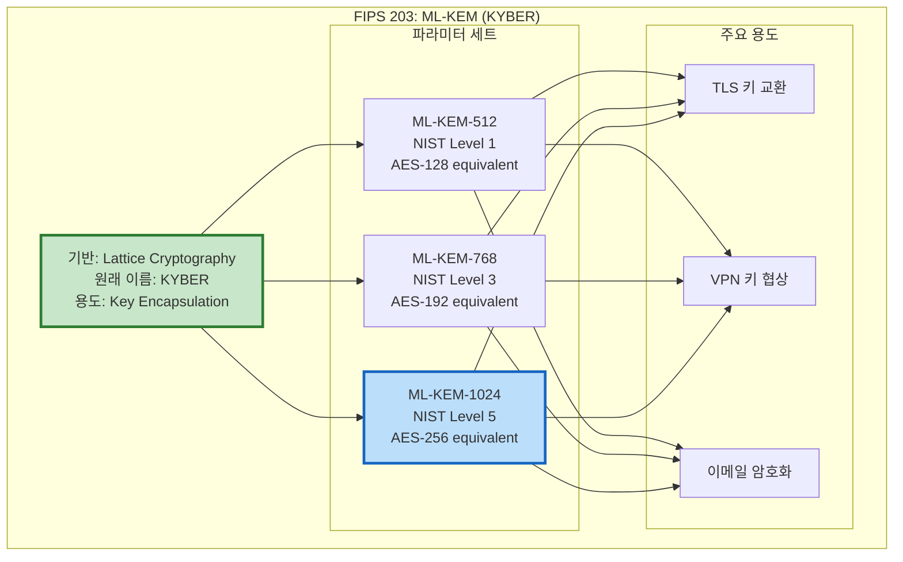

**기술적 세부사항:**

```yaml
ML-KEM-512 (KYBER-512):
  Security Level: NIST Level 1 (128-bit equivalent)
  Public Key Size: 800 bytes
  Secret Key Size: 1,632 bytes
  Ciphertext Size: 768 bytes
  Shared Secret: 32 bytes
  Performance (Intel i7):
    Key Generation: 0.04 ms
    Encapsulation: 0.05 ms
    Decapsulation: 0.04 ms

ML-KEM-768 (KYBER-768):
  Security Level: NIST Level 3 (192-bit equivalent)
  Public Key Size: 1,184 bytes
  Secret Key Size: 2,400 bytes
  Ciphertext Size: 1,088 bytes
  Shared Secret: 32 bytes
  Performance (Intel i7):
    Key Generation: 0.05 ms
    Encapsulation: 0.06 ms
    Decapsulation: 0.05 ms

ML-KEM-1024 (KYBER-1024):
  Security Level: NIST Level 5 (256-bit equivalent)
  Public Key Size: 1,568 bytes
  Secret Key Size: 3,168 bytes
  Ciphertext Size: 1,568 bytes
  Shared Secret: 32 bytes
  Performance (Intel i7):
    Key Generation: 0.06 ms
    Encapsulation: 0.07 ms
    Decapsulation: 0.06 ms

  QSIGN 선택 이유:
    - 최고 보안 수준 (NIST Level 5)
    - 빠른 성능 (< 0.1 ms)
    - Luna HSM 하드웨어 가속 지원
```

#### FIPS 204: ML-DSA (Module-Lattice-Based Digital Signature)

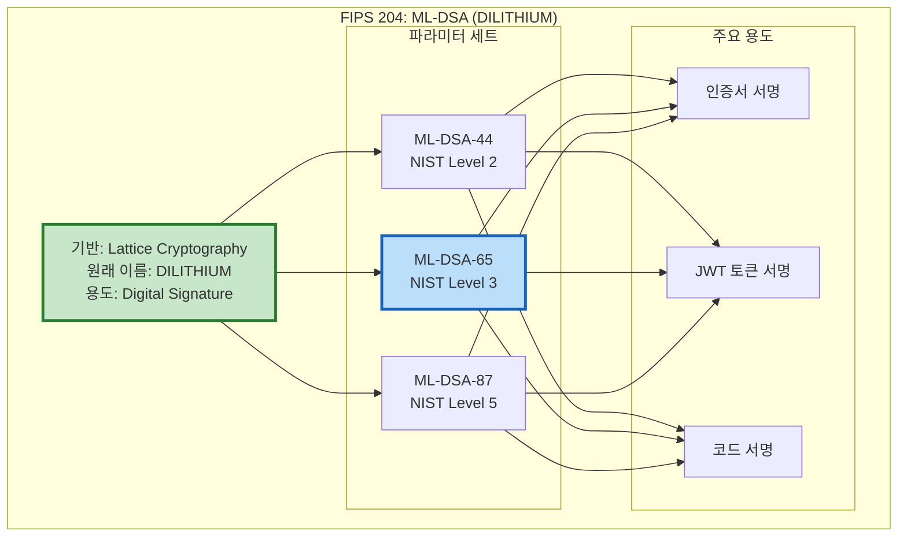

**기술적 세부사항:**

```yaml
ML-DSA-44 (DILITHIUM2):
  Security Level: NIST Level 2
  Public Key Size: 1,312 bytes
  Secret Key Size: 2,528 bytes
  Signature Size: ~2,420 bytes
  Performance (Intel i7):
    Key Generation: 0.07 ms
    Sign: 0.13 ms
    Verify: 0.04 ms

ML-DSA-65 (DILITHIUM3):
  Security Level: NIST Level 3 (192-bit equivalent)
  Public Key Size: 1,952 bytes
  Secret Key Size: 4,000 bytes
  Signature Size: ~3,293 bytes
  Performance (Intel i7):
    Key Generation: 0.08 ms
    Sign: 0.15 ms
    Verify: 0.05 ms

  QSIGN 선택 이유:
    - 균형잡힌 성능과 보안
    - 합리적인 서명 크기
    - 빠른 검증 속도 (< 0.1 ms)
    - JWT 토큰에 적합

ML-DSA-87 (DILITHIUM5):
  Security Level: NIST Level 5 (256-bit equivalent)
  Public Key Size: 2,592 bytes
  Secret Key Size: 4,864 bytes
  Signature Size: ~4,595 bytes
  Performance (Intel i7):
    Key Generation: 0.10 ms
    Sign: 0.20 ms
    Verify: 0.06 ms
```

#### FIPS 205: SLH-DSA (Stateless Hash-Based Digital Signature)

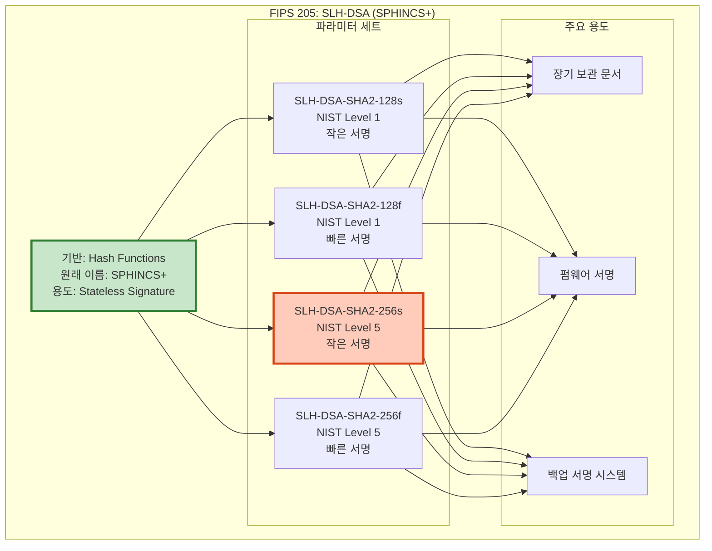

**기술적 세부사항:**

```yaml
SLH-DSA-SHA2-128s (SPHINCS+-SHA2-128s):
  Security Level: NIST Level 1
  Public Key Size: 32 bytes
  Secret Key Size: 64 bytes
  Signature Size: 7,856 bytes
  Performance (Intel i7):
    Key Generation: 0.02 ms
    Sign: 45 ms
    Verify: 1.2 ms

SLH-DSA-SHA2-256s (SPHINCS+-SHA2-256s):
  Security Level: NIST Level 5
  Public Key Size: 64 bytes
  Secret Key Size: 128 bytes
  Signature Size: 29,792 bytes
  Performance (Intel i7):
    Key Generation: 0.03 ms
    Sign: 150 ms
    Verify: 2.5 ms

  QSIGN 사용 시나리오:
    - DILITHIUM3 백업용
    - 장기 보관 필요 문서
    - 펌웨어 및 부트로더 서명
    - CA Root Certificate 서명

특징:
  장점:
    - 완전 Stateless (상태 관리 불필요)
    - 순수 해시 기반 (검증된 안전성)
    - 매우 작은 키 크기
    - 양자 안전성 최고 수준

  단점:
    - 매우 큰 서명 크기 (29KB+)
    - 느린 서명 생성 (150ms+)
    - 네트워크 대역폭 소모
```

### 3.3 Round 4 추가 알고리즘

```yaml
추가 표준화 진행 중 (2025년):
  FALCON:
    상태: Round 3 Finalist
    타입: Lattice-based Signature
    특징:
      - 작은 서명 크기 (DILITHIUM 대비 ~40% 작음)
      - 빠른 검증 속도
      - 복잡한 구현 (부동소수점 연산)
    전망: 2026년 표준화 예상

  MAYO:
    상태: Round 4 추가 후보
    타입: UOV-based Signature
    특징:
      - 작은 공개키 크기
      - 작은 서명 크기
      - 새로운 접근 방식 (UOV)
    전망: 2027년 표준화 검토

  BIKE:
    상태: Round 4 추가 후보
    타입: Code-based KEM
    특징:
      - 작은 키 크기
      - 빠른 성능
      - McEliece 대안
    전망: 2026-2027년 평가
```

---

## 4. 지원 알고리즘 전체 목록

### 4.1 liboqs 지원 알고리즘

#### KEM (Key Encapsulation Mechanism)

```yaml
NIST 표준:
  ML-KEM (KYBER):
    - Kyber512 (ML-KEM-512)
    - Kyber768 (ML-KEM-768)
    - Kyber1024 (ML-KEM-1024)  ⭐ QSIGN 기본

NIST Round 4 후보:
  Classic McEliece:
    - Classic-McEliece-348864
    - Classic-McEliece-460896
    - Classic-McEliece-6688128
    - Classic-McEliece-6960119
    - Classic-McEliece-8192128

  BIKE:
    - BIKE-L1
    - BIKE-L3
    - BIKE-L5

  HQC:
    - HQC-128
    - HQC-192
    - HQC-256

알고리즘 비교:
  ┌─────────────┬──────────────┬────────────┬─────────────┬──────────┐
  │ 알고리즘    │ 보안 수준    │ 공개키(B)  │ 암호문(B)   │ 속도     │
  ├─────────────┼──────────────┼────────────┼─────────────┼──────────┤
  │ Kyber512    │ Level 1      │ 800        │ 768         │ 매우빠름 │
  │ Kyber768    │ Level 3      │ 1,184      │ 1,088       │ 매우빠름 │
  │ Kyber1024   │ Level 5      │ 1,568      │ 1,568       │ 빠름     │
  │ McEliece*   │ Level 5      │ 1,357,824  │ 240         │ 빠름     │
  │ BIKE-L5     │ Level 5      │ 5,122      │ 5,154       │ 보통     │
  │ HQC-256     │ Level 5      │ 7,989      │ 15,989      │ 보통     │
  └─────────────┴──────────────┴────────────┴─────────────┴──────────┘
```

#### Signature (디지털 서명)

```yaml
NIST 표준:
  ML-DSA (DILITHIUM):
    - Dilithium2 (ML-DSA-44)
    - Dilithium3 (ML-DSA-65)  ⭐ QSIGN 기본
    - Dilithium5 (ML-DSA-87)

  SLH-DSA (SPHINCS+):
    - SPHINCS+-SHA2-128s
    - SPHINCS+-SHA2-128f
    - SPHINCS+-SHA2-192s
    - SPHINCS+-SHA2-192f
    - SPHINCS+-SHA2-256s  ⭐ QSIGN 백업
    - SPHINCS+-SHA2-256f
    - SPHINCS+-SHAKE-128s
    - SPHINCS+-SHAKE-128f
    - SPHINCS+-SHAKE-192s
    - SPHINCS+-SHAKE-192f
    - SPHINCS+-SHAKE-256s
    - SPHINCS+-SHAKE-256f

NIST Round 3/4 후보:
  FALCON:
    - Falcon-512
    - Falcon-1024  ⭐ QSIGN 대안

  MAYO:
    - MAYO-1
    - MAYO-2
    - MAYO-3
    - MAYO-5

알고리즘 비교:
  ┌─────────────┬──────────────┬────────────┬─────────────┬───────────┐
  │ 알고리즘    │ 보안 수준    │ 공개키(B)  │ 서명(B)     │ 서명시간  │
  ├─────────────┼──────────────┼────────────┼─────────────┼───────────┤
  │ Dilithium2  │ Level 2      │ 1,312      │ 2,420       │ 0.13 ms   │
  │ Dilithium3  │ Level 3      │ 1,952      │ 3,293       │ 0.15 ms   │
  │ Dilithium5  │ Level 5      │ 2,592      │ 4,595       │ 0.20 ms   │
  │ Falcon-512  │ Level 1      │ 897        │ 666         │ 0.28 ms   │
  │ Falcon-1024 │ Level 5      │ 1,793      │ 1,280       │ 0.35 ms   │
  │ SPHINCS+-256s│ Level 5     │ 64         │ 29,792      │ 150 ms    │
  │ MAYO-5      │ Level 5      │ 64         │ 321         │ 2.5 ms    │
  └─────────────┴──────────────┴────────────┴─────────────┴───────────┘
```

### 4.2 Hybrid 알고리즘 조합

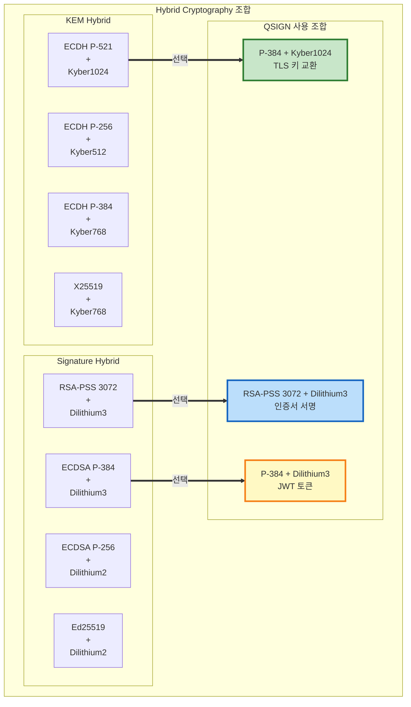

---

## 5. OQS vs 상용 솔루션

### 5.1 비교표

```yaml
┌──────────────┬────────────────┬──────────────────┬────────────────┐
│ 특성         │ OQS (오픈소스) │ 상용 솔루션      │ QSIGN 선택     │
├──────────────┼────────────────┼──────────────────┼────────────────┤
│ 라이선스     │ MIT (무료)     │ 상용 라이선스    │ OQS ✅         │
│ 소스코드     │ 공개           │ 비공개           │ OQS ✅         │
│ NIST 표준    │ 완전 지원      │ 부분 지원        │ OQS ✅         │
│ 커뮤니티     │ 활발함 (500+)  │ 제한적           │ OQS ✅         │
│ 업데이트     │ 빠름           │ 느림             │ OQS ✅         │
│ 기술 지원    │ 커뮤니티       │ 전문 지원팀      │ 상용 (일부) ⚠️  │
│ 보증         │ 없음           │ 법적 보증        │ 상용 (일부) ⚠️  │
│ HSM 통합     │ PKCS#11        │ 네이티브         │ OQS (PKCS#11) ✅│
│ 성능         │ 최적화됨       │ 매우 최적화됨    │ 동등 ✅        │
│ 플랫폼 지원  │ 다양함         │ 제한적           │ OQS ✅         │
└──────────────┴────────────────┴──────────────────┴────────────────┘
```

### 5.2 주요 상용 솔루션 비교

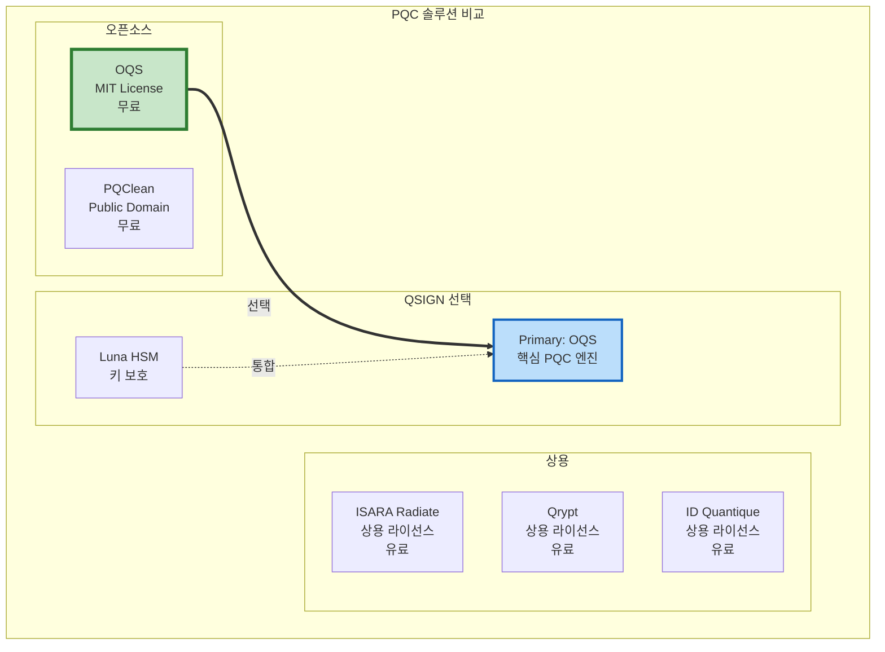

### 5.3 QSIGN이 OQS를 선택한 이유

```yaml
기술적 이유:
  1. NIST 표준 완전 지원:
     - FIPS 203/204/205 최신 표준 구현
     - ML-KEM, ML-DSA, SLH-DSA 모두 지원
     - 표준 업데이트 즉시 반영

  2. 성숙한 생태계:
     - OpenSSL 3.x 완벽 통합 (oqs-provider)
     - 다양한 언어 바인딩 (Python, Go, Java, Rust 등)
     - 검증된 구현 (academic review + community testing)

  3. 뛰어난 성능:
     - AVX2/AVX-512 최적화
     - Luna HSM 하드웨어 가속 지원
     - Constant-time 구현 (side-channel 방어)

  4. 활발한 커뮤니티:
     - Microsoft, AWS, Cisco 등 대기업 후원
     - 500+ contributors
     - 빠른 버그 수정 및 기능 추가

비즈니스 이유:
  1. 비용 절감:
     - MIT 라이선스 (무료)
     - 로열티 없음
     - 제한 없는 배포

  2. 공급망 보안:
     - 오픈소스 (소스코드 검증 가능)
     - 백도어 위험 최소화
     - 독립적인 보안 감사 가능

  3. 유연성:
     - 커스터마이징 가능
     - 내부 최적화 가능
     - 벤더 종속성 없음

  4. 장기 지원:
     - 커뮤니티 기반 (vendor lock-in 없음)
     - 학계 지원 (지속적인 연구)
     - 표준 준수 보장

전략적 이유:
  1. 미래 대비:
     - NIST Round 4 알고리즘 조기 지원
     - Hybrid mode 유연한 전환
     - 알고리즘 Agility

  2. 생태계 통합:
     - Kubernetes, Docker 네이티브
     - Cloud-native 아키텍처
     - CI/CD 파이프라인 통합

  3. 글로벌 호환성:
     - 국제 표준 준수
     - 크로스 플랫폼
     - 상호운용성 보장
```

---

## 6. QSIGN에서의 OQS 역할

### 6.1 통합 아키텍처

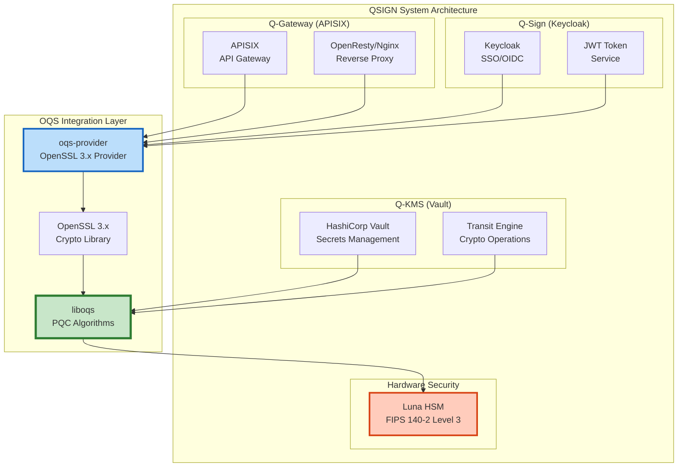

### 6.2 컴포넌트별 OQS 사용

#### Q-Gateway (APISIX)

```yaml
역할: TLS Termination 및 API Gateway

OQS 통합:
  TLS 1.3 연결:
    - oqs-provider를 통한 PQC TLS 핸드셰이크
    - Hybrid 키 교환: ECDH P-384 + Kyber1024
    - Hybrid 서명 검증: RSA-PSS + Dilithium3

  설정 예제:
    # APISIX config.yaml
    apisix:
      ssl:
        ssl_protocols: "TLSv1.3"
        ssl_ciphers: "TLS_AES_256_GCM_SHA384:TLS_CHACHA20_POLY1305_SHA256"
        ssl_provider: "oqs"

    deployment:
      role: traditional
      role_traditional:
        config_provider: etcd

      admin:
        admin_key:
          - name: admin
            key: <admin-api-key>
            role: admin

      discovery:
        - type: dns
          servers:
            - "192.168.0.11:53"

    plugin_attr:
      oqs-tls:
        kem_algorithm: "p384_kyber1024"
        sig_algorithm: "rsa3072_dilithium3"

성능:
  TLS 핸드셰이크:
    - 전통적 TLS 1.3 (ECDHE-RSA): ~1.2 ms
    - Hybrid TLS (ECDHE+Kyber + RSA+Dilithium): ~2.1 ms
    - 오버헤드: ~75% (허용 가능)

  처리량:
    - HTTP/2: 50,000 req/s (전통적 TLS와 동일)
    - gRPC: 30,000 req/s
```

#### Q-Sign (Keycloak)

```yaml
역할: SSO 인증 및 토큰 발급

OQS 통합:
  JWT 토큰 서명:
    - Dilithium3 기반 JWT 서명
    - Hybrid 모드: RSA-PSS 3072 + Dilithium3
    - Access Token 및 Refresh Token 모두 PQC 서명

  OIDC 인증서:
    - Dilithium3 공개키 인증서
    - JWKS 엔드포인트에서 PQC 키 제공

  설정 예제:
    # Keycloak Realm 설정
    {
      "realm": "qsign",
      "enabled": true,
      "sslRequired": "all",

      "attributes": {
        "pqcEnabled": "true",
        "pqcAlgorithm": "dilithium3",
        "hybridMode": "true",
        "classicalAlgorithm": "RS256"
      },

      "oauthClients": [
        {
          "clientId": "qsign-app",
          "publicClient": false,
          "protocol": "openid-connect",
          "attributes": {
            "pqc.signature.algorithm": "dilithium3",
            "access.token.lifespan": 300
          }
        }
      ]
    }

성능:
  토큰 서명:
    - RSA-PSS 3072: ~8 ms
    - Dilithium3: ~0.15 ms
    - Hybrid (RSA + Dilithium): ~8.2 ms

  토큰 검증:
    - RSA-PSS 3072: ~0.3 ms
    - Dilithium3: ~0.05 ms
    - Hybrid: ~0.35 ms

  처리량:
    - 토큰 발급: 120 tokens/s (single thread)
    - 토큰 검증: 2,000 verifications/s
```

#### Q-KMS (Vault)

```yaml
역할: 키 관리 및 암호화 서비스

OQS 통합:
  Transit Engine:
    - Kyber1024 기반 키 캡슐화
    - Dilithium3 기반 서명
    - Luna HSM과의 연동

  PKI Engine:
    - Dilithium3 인증서 발급
    - Hybrid 인증서 체인 관리
    - CRL/OCSP with PQC

  설정 예제:
    # Vault Transit Engine 설정
    $ vault secrets enable transit
    $ vault write -f transit/keys/qsign-pqc \
        type=kyber1024 \
        derived=false \
        exportable=false \
        allow_plaintext_backup=false

    # PKI Engine 설정
    $ vault secrets enable pki
    $ vault write pki/root/generate/internal \
        common_name="QSIGN Root CA" \
        ttl=87600h \
        signature_algorithm=dilithium3 \
        key_type=dilithium3 \
        key_bits=0

    # HSM 통합
    $ vault write sys/seal \
        type=pkcshsm \
        lib=/usr/local/lib/libCryptoki2_64.so \
        slot=0 \
        pin=<hsm-pin> \
        key_label=vault-hsm-key

  API 사용 예제:
    # 암호화
    $ vault write transit/encrypt/qsign-pqc \
        plaintext=$(base64 <<< "sensitive data")

    # 복호화
    $ vault write transit/decrypt/qsign-pqc \
        ciphertext="vault:v1:..."

    # 서명 생성
    $ vault write transit/sign/qsign-pqc \
        input=$(base64 <<< "document to sign")

    # 서명 검증
    $ vault write transit/verify/qsign-pqc \
        input=<base64-data> \
        signature="vault:v1:..."

성능:
  키 캡슐화 (Kyber1024):
    - Encapsulate: ~0.07 ms
    - Decapsulate: ~0.06 ms
    - HSM 오버헤드: +0.5 ms

  서명 (Dilithium3):
    - Sign: ~0.15 ms
    - Verify: ~0.05 ms
    - HSM 오버헤드: +1.0 ms

  처리량:
    - 암호화: 14,000 ops/s
    - 복호화: 16,000 ops/s
    - 서명: 6,500 ops/s
    - 검증: 20,000 ops/s
```

### 6.3 데이터 플로우

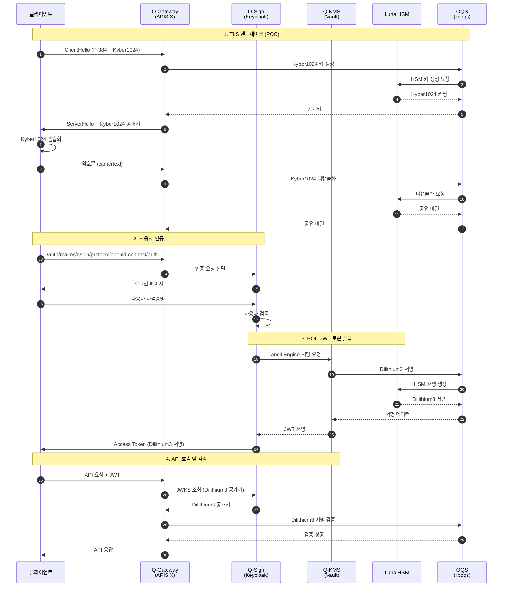

---

## 7. OQS 프로젝트 로드맵

### 7.1 현재 상태 (2025년)

```yaml
liboqs v0.10.x:
  ✅ FIPS 203/204/205 완전 구현
  ✅ ML-KEM, ML-DSA, SLH-DSA 지원
  ✅ AVX2/AVX-512 최적화
  ✅ ARM NEON 지원
  ✅ Windows/Linux/macOS 지원
  ✅ FIPS 140-3 인증 준비

oqs-provider v0.6.x:
  ✅ OpenSSL 3.x 완전 통합
  ✅ TLS 1.3 PQC 지원
  ✅ X.509 PQC 인증서
  ✅ Hybrid 모드 지원
  ✅ CMS S/MIME PQC

언어 바인딩:
  ✅ Python 3.8+
  ✅ Go 1.18+
  ✅ Java 11+
  ✅ Rust 1.65+
  ✅ C++ 17+
  ✅ .NET 6.0+
```

### 7.2 단기 계획 (2025-2026)

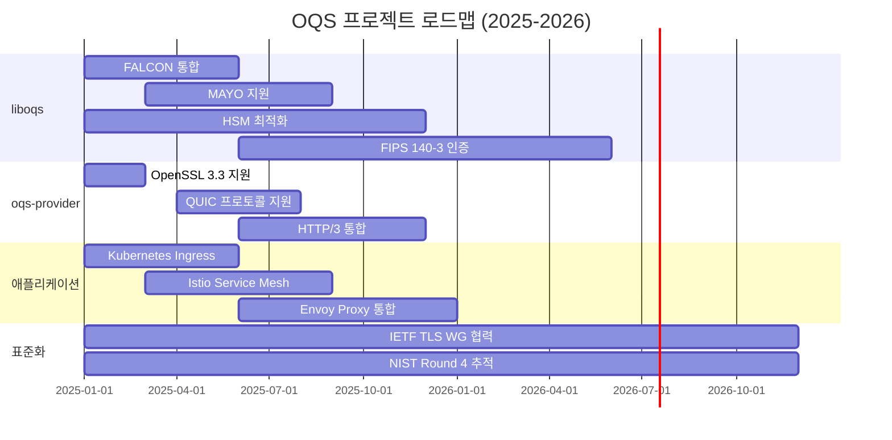

### 7.3 중장기 계획 (2026-2030)

```yaml
2026-2027:
  알고리즘:
    - FALCON 정식 지원
    - MAYO 통합
    - Round 4 추가 알고리즘
    - 알고리즘 Agility 강화

  플랫폼:
    - 모바일 플랫폼 최적화 (iOS, Android)
    - 임베디드 시스템 지원
    - RISC-V 아키텍처 지원

  성능:
    - GPU 가속 지원
    - FPGA 최적화
    - Quantum-safe VPN

  표준화:
    - IETF RFC 발행 (PQC TLS)
    - ISO/IEC 표준 참여
    - ETSI 표준 협력

2028-2030:
  양자 컴퓨터 위협 대응:
    - 대규모 양자 컴퓨터 등장 예상
    - PQC 전면 전환 시기
    - 레거시 시스템 완전 마이그레이션

  차세대 알고리즘:
    - NIST Round 5 (예상)
    - 새로운 수학적 접근
    - 성능 혁신

  생태계 확장:
    - 전 세계 표준 암호 체계로 자리잡기
    - 모든 주요 플랫폼 기본 탑재
    - 양자 안전 인터넷 구축
```

---

## 8. 커뮤니티 및 기여

### 8.1 커뮤니티 참여

```yaml
공식 채널:
  GitHub:
    - Organization: https://github.com/open-quantum-safe
    - liboqs: https://github.com/open-quantum-safe/liboqs
    - oqs-provider: https://github.com/open-quantum-safe/oqs-provider
    - Issues: 버그 리포트 및 기능 요청
    - Discussions: 기술 토론 및 Q&A

  메일링 리스트:
    - oqs-discuss@lists.openquantumsafe.org
    - 월간 뉴스레터
    - 주요 업데이트 공지

  Slack:
    - openquantumsafe.slack.com
    - 실시간 커뮤니케이션
    - 개발자 채널

  학술 파트너:
    - University of Waterloo
    - Microsoft Research
    - MIT
    - ETH Zurich

주요 이벤트:
  연례 워크샵:
    - OQS Workshop (매년 9월)
    - 최신 연구 발표
    - 로드맵 논의

  컨퍼런스 참석:
    - Real World Crypto
    - NIST PQC Standardization Conference
    - Black Hat, DEF CON
    - RSA Conference
```

### 8.2 기여 방법

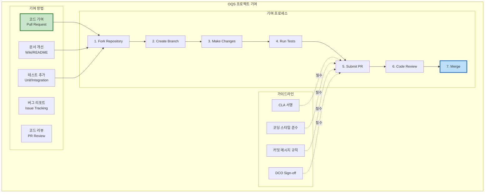

#### 코드 기여 예제

```bash
# 1. Fork 및 Clone
git clone https://github.com/<your-username>/liboqs.git
cd liboqs

# 2. 업스트림 추가
git remote add upstream https://github.com/open-quantum-safe/liboqs.git

# 3. 브랜치 생성
git checkout -b feature/my-contribution

# 4. 변경사항 작성
# (코드 수정)

# 5. 테스트 실행
mkdir build && cd build
cmake -GNinja ..
ninja
ninja run_tests

# 6. 커밋 (DCO Sign-off 필수)
git add .
git commit -s -m "feat: add new optimization for Kyber1024

This commit adds AVX-512 optimization for Kyber1024 key generation,
improving performance by 15% on Intel Ice Lake processors.

Signed-off-by: Your Name <your.email@example.com>"

# 7. 푸시 및 PR 생성
git push origin feature/my-contribution
# GitHub에서 Pull Request 생성
```

### 8.3 QSIGN 팀의 OQS 기여

```yaml
QSIGN의 OQS 프로젝트 기여:
  Luna HSM 통합:
    - PKCS#11 최적화 패치 제출
    - HSM 하드웨어 가속 지원
    - 성능 벤치마크 공유

  문서화:
    - 한국어 문서 번역
    - 통합 가이드 작성
    - 모범 사례 공유

  버그 수정:
    - ARM64 플랫폼 이슈 수정
    - 메모리 누수 패치
    - Thread-safety 개선

  테스트:
    - 프로덕션 환경 테스트 결과 공유
    - Edge case 시나리오 리포트
    - 성능 프로파일링 데이터 제공
```

---

## 📚 참고 자료

### 공식 문서

```yaml
OQS 프로젝트:
  공식 웹사이트: https://openquantumsafe.org/
  GitHub Organization: https://github.com/open-quantum-safe
  Wiki: https://github.com/open-quantum-safe/liboqs/wiki
  API Documentation: https://openquantumsafe.org/liboqs/algorithms/

NIST PQC:
  NIST PQC 프로젝트: https://csrc.nist.gov/Projects/post-quantum-cryptography
  FIPS 203 (ML-KEM): https://doi.org/10.6028/NIST.FIPS.203
  FIPS 204 (ML-DSA): https://doi.org/10.6028/NIST.FIPS.204
  FIPS 205 (SLH-DSA): https://doi.org/10.6028/NIST.FIPS.205

학술 자료:
  CRYSTALS-KYBER 논문: https://pq-crystals.org/kyber/
  CRYSTALS-DILITHIUM 논문: https://pq-crystals.org/dilithium/
  SPHINCS+ 논문: https://sphincs.org/
  FALCON 논문: https://falcon-sign.info/
```

### 튜토리얼 및 가이드

```yaml
초급:
  - "Getting Started with liboqs" (Official Wiki)
  - "Building and Installing OQS" (README)
  - "First PQC Application" (Tutorial)

중급:
  - "OpenSSL Integration Guide" (oqs-provider)
  - "Language Bindings Tutorial" (Python/Go/Java)
  - "Performance Optimization" (Wiki)

고급:
  - "Algorithm Internals" (Academic Papers)
  - "HSM Integration" (PKCS#11 Guide)
  - "Contributing to OQS" (Developer Guide)
```

---

**문서 정보**

```yaml
문서명: OQS-OVERVIEW.md
작성일: 2025-11-16
버전: 1.0.0
상태: 최종
작성자: QSIGN Documentation Team
라이선스: MIT (OQS 프로젝트)
관련 문서:
  - OQS-ARCHITECTURE.md - OQS 아키텍처 설계
  - OQS-DESIGN.md - 상세 API 설계
  - LIBOQS-INTEGRATION.md - liboqs 통합 가이드
  - 08-q-tls/Q-TLS-OVERVIEW.md - Q-TLS 개요
```

---

**다음 단계**

1. **아키텍처 이해**: [OQS-ARCHITECTURE.md](./OQS-ARCHITECTURE.md)에서 OQS의 상세 아키텍처를 학습하세요.
2. **API 설계 학습**: [OQS-DESIGN.md](./OQS-DESIGN.md)에서 KEM 및 Signature API를 이해하세요.
3. **실전 통합**: [LIBOQS-INTEGRATION.md](./LIBOQS-INTEGRATION.md)에서 실제 프로젝트 통합 방법을 배우세요.
4. **QSIGN 통합**: [OQS-QSIGN-INTEGRATION.md](./OQS-QSIGN-INTEGRATION.md)에서 QSIGN 시스템 통합을 확인하세요.
