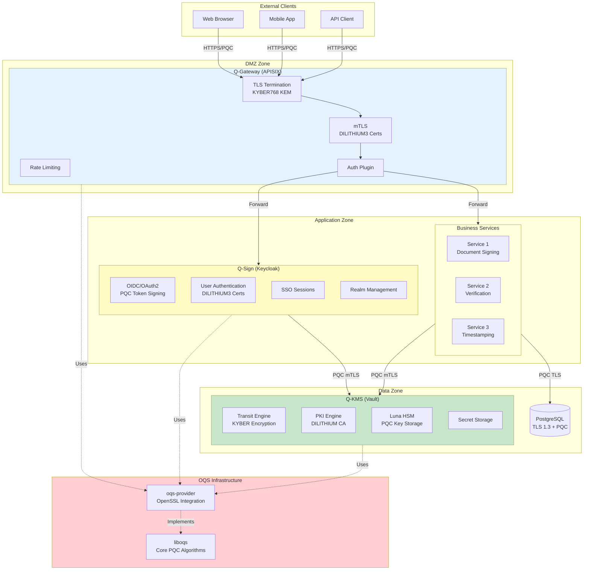
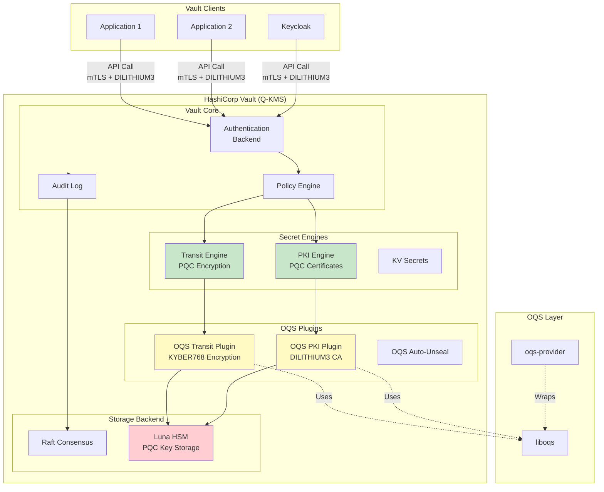
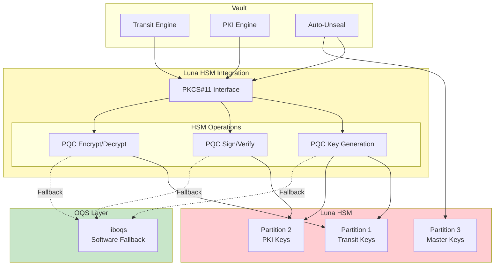
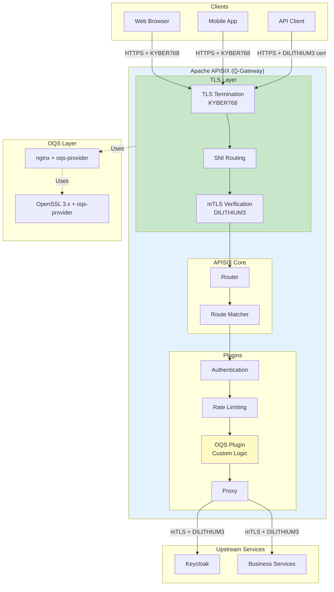
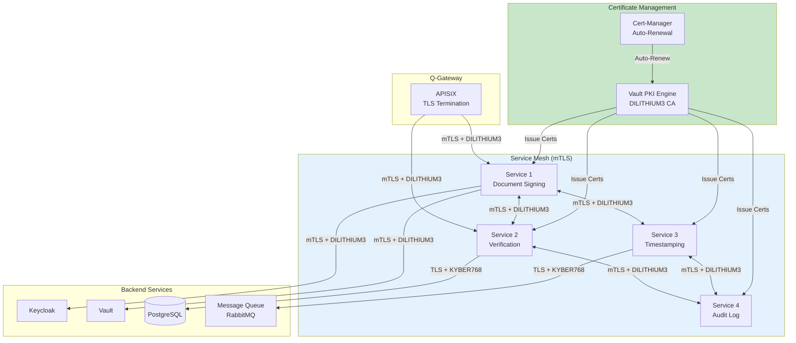
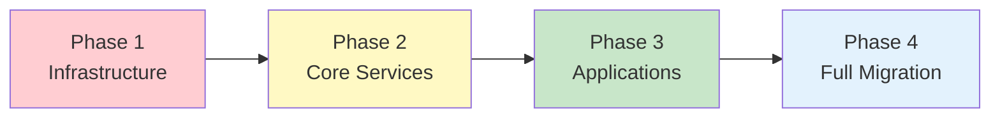
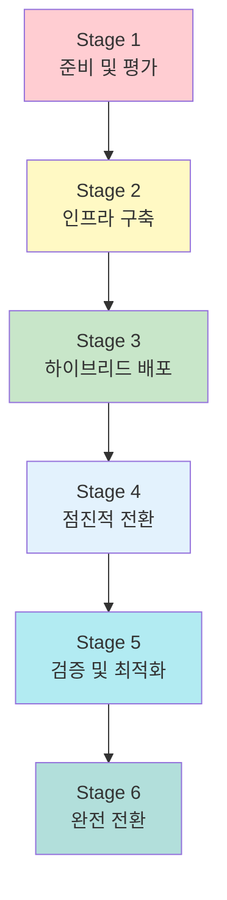
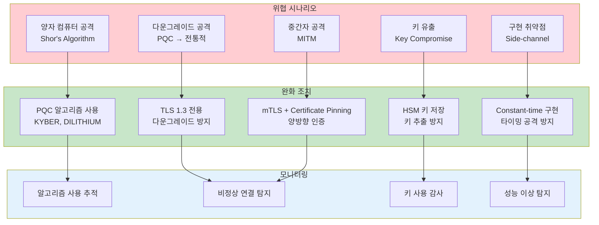

# OQS-QSIGN 통합 설계

QSIGN 아키텍처에 Open Quantum Safe (OQS) 통합을 위한 설계 문서입니다.

## 목차

- [1. QSIGN 아키텍처 내 OQS 위치](#1-qsign-아키텍처-내-oqs-위치)
- [2. Q-KMS (Vault) OQS 통합](#2-q-kms-vault-oqs-통합)
- [3. Q-Sign (Keycloak) OQS 통합](#3-q-sign-keycloak-oqs-통합)
- [4. Q-Gateway (APISIX) OQS 통합](#4-q-gateway-apisix-oqs-통합)
- [5. 서비스 간 통신 (PQC)](#5-서비스-간-통신-pqc)
- [6. 배포 전략](#6-배포-전략)
- [7. 마이그레이션 계획](#7-마이그레이션-계획)
- [8. 성능 및 모니터링](#8-성능-및-모니터링)
- [9. 보안 고려사항](#9-보안-고려사항)

---

## 1. QSIGN 아키텍처 내 OQS 위치

### 1.1 전체 아키텍처



### 1.2 OQS 통합 범위

```yaml
OQS 통합 범위:

계층 1 - 외부 통신:
  Q-Gateway (APISIX):
    - 클라이언트 TLS 1.3 (KYBER768 KEM)
    - 하이브리드 모드 (X25519+KYBER768)
    - DILITHIUM3 서버 인증서
    - mTLS 클라이언트 인증 (DILITHIUM3)
    우선순위: 높음
    타임라인: Phase 1

계층 2 - 인증 및 권한:
  Q-Sign (Keycloak):
    - OIDC/OAuth2 토큰 서명 (DILITHIUM3)
    - 사용자 인증서 기반 인증 (DILITHIUM3)
    - SAML 서명 (DILITHIUM3)
    - Session 암호화 (KYBER768)
    우선순위: 높음
    타임라인: Phase 2

계층 3 - 키 관리 및 암호화:
  Q-KMS (Vault):
    - Transit Engine (KYBER768 encryption)
    - PKI Engine (DILITHIUM3 CA)
    - Luna HSM (PQC key storage)
    - Key rotation (PQC keys)
    우선순위: 최우선
    타임라인: Phase 1

계층 4 - 서비스 간 통신:
  Internal mTLS:
    - 모든 서비스 간 mTLS (DILITHIUM3)
    - gRPC with PQC
    - Message queue encryption (KYBER768)
    우선순위: 중간
    타임라인: Phase 3

계층 5 - 데이터 저장:
  Database:
    - PostgreSQL TLS (KYBER768)
    - 컬럼 암호화 (Transit Engine)
    - 백업 암호화 (KYBER768)
    우선순위: 중간
    타임라인: Phase 3
```

### 1.3 통신 흐름

```mermaid
sequenceDiagram
    participant Client
    participant APISIX as Q-Gateway<br/>(APISIX)
    participant Keycloak as Q-Sign<br/>(Keycloak)
    participant Service as Business<br/>Service
    participant Vault as Q-KMS<br/>(Vault)
    participant DB as Database

    Note over Client,DB: 전체 요청 흐름 (PQC 적용)

    Client->>APISIX: HTTPS Request<br/>(TLS 1.3 + KYBER768)
    Note over Client,APISIX: 1. 외부 TLS 연결

    APISIX->>APISIX: TLS Termination<br/>KYBER768 KEM
    APISIX->>APISIX: Extract Token

    APISIX->>Keycloak: Validate Token<br/>(mTLS + DILITHIUM3)
    Note over APISIX,Keycloak: 2. 인증 검증

    Keycloak->>Vault: Get Public Key<br/>(Transit Engine)
    Vault-->>Keycloak: Public Key<br/>(DILITHIUM3)

    Keycloak->>Keycloak: Verify Token Signature<br/>(DILITHIUM3)
    Keycloak-->>APISIX: Token Valid

    APISIX->>Service: Forward Request<br/>(mTLS + DILITHIUM3)
    Note over APISIX,Service: 3. 서비스 호출

    Service->>Vault: Encrypt Data<br/>(Transit Engine + KYBER768)
    Vault->>Vault: KYBER Encryption
    Vault-->>Service: Encrypted Data

    Service->>DB: Store Data<br/>(TLS 1.3 + KYBER768)
    Note over Service,DB: 4. 데이터 저장

    DB-->>Service: Success
    Service-->>APISIX: Response
    APISIX-->>Client: HTTPS Response

    style APISIX fill:#e3f2fd
    style Keycloak fill:#fff9c4
    style Vault fill:#c8e6c9
```

---

## 2. Q-KMS (Vault) OQS 통합

### 2.1 Vault OQS 아키텍처



### 2.2 Transit Engine with OQS

**플러그인 구조:**

```go
// vault-plugin-oqs-transit/plugin.go
package main

import (
    "context"
    "crypto/rand"
    "fmt"

    "github.com/hashicorp/vault/sdk/framework"
    "github.com/hashicorp/vault/sdk/logical"
    "github.com/hashicorp/vault/sdk/plugin"
    "github.com/open-quantum-safe/liboqs-go/oqs"
)

type OQSTransitBackend struct {
    *framework.Backend
}

func Factory(ctx context.Context, conf *logical.BackendConfig) (logical.Backend, error) {
    b := &OQSTransitBackend{}

    b.Backend = &framework.Backend{
        BackendType: logical.TypeLogical,
        Help:        "OQS Transit Engine - Post-Quantum Encryption",

        Paths: []*framework.Path{
            b.pathKeys(),
            b.pathEncrypt(),
            b.pathDecrypt(),
            b.pathRewrap(),
            b.pathDatakey(),
        },

        Secrets:     []*framework.Secret{},
        Invalidate:  b.invalidate,
        WALRollback: b.walRollback,
    }

    if err := b.Setup(ctx, conf); err != nil {
        return nil, err
    }

    return b, nil
}

// 키 관리 경로
func (b *OQSTransitBackend) pathKeys() *framework.Path {
    return &framework.Path{
        Pattern: "keys/" + framework.GenericNameRegex("name"),

        Fields: map[string]*framework.FieldSchema{
            "name": {
                Type:        framework.TypeString,
                Description: "키 이름",
                Required:    true,
            },
            "type": {
                Type:        framework.TypeString,
                Description: "알고리즘 타입 (kyber512, kyber768, kyber1024)",
                Default:     "kyber768",
            },
            "exportable": {
                Type:        framework.TypeBool,
                Description: "키 내보내기 가능 여부",
                Default:     false,
            },
        },

        Operations: map[logical.Operation]framework.OperationHandler{
            logical.CreateOperation: &framework.PathOperation{
                Callback: b.pathKeysWrite,
            },
            logical.UpdateOperation: &framework.PathOperation{
                Callback: b.pathKeysWrite,
            },
            logical.ReadOperation: &framework.PathOperation{
                Callback: b.pathKeysRead,
            },
            logical.DeleteOperation: &framework.PathOperation{
                Callback: b.pathKeysDelete,
            },
        },

        HelpSynopsis:    "OQS Transit 키 관리",
        HelpDescription: "KYBER KEM 키를 생성, 조회, 삭제합니다.",
    }
}

// 키 생성
func (b *OQSTransitBackend) pathKeysWrite(ctx context.Context, req *logical.Request, d *framework.FieldData) (*logical.Response, error) {
    name := d.Get("name").(string)
    keyType := d.Get("type").(string)
    exportable := d.Get("exportable").(bool)

    // liboqs KEM 객체 생성
    var kemName string
    switch keyType {
    case "kyber512":
        kemName = "Kyber512"
    case "kyber768":
        kemName = "Kyber768"
    case "kyber1024":
        kemName = "Kyber1024"
    default:
        return logical.ErrorResponse("지원하지 않는 키 타입: %s", keyType), nil
    }

    kem := oqs.KeyEncapsulation{}
    if err := kem.Init(kemName, nil); err != nil {
        return nil, fmt.Errorf("KEM 초기화 실패: %w", err)
    }
    defer kem.Clean()

    // 키 생성
    publicKey, err := kem.GenerateKeyPair()
    if err != nil {
        return nil, fmt.Errorf("키 생성 실패: %w", err)
    }

    secretKey := kem.ExportSecretKey()

    // 키 정보 저장
    keyEntry := &KeyEntry{
        Name:          name,
        Type:          keyType,
        PublicKey:     publicKey,
        SecretKey:     secretKey,
        Exportable:    exportable,
        CreationTime:  time.Now(),
        Version:       1,
    }

    // Storage에 저장
    entry, err := logical.StorageEntryJSON("keys/"+name, keyEntry)
    if err != nil {
        return nil, err
    }

    if err := req.Storage.Put(ctx, entry); err != nil {
        return nil, err
    }

    return &logical.Response{
        Data: map[string]interface{}{
            "name":    name,
            "type":    keyType,
            "version": 1,
        },
    }, nil
}

// 암호화 경로
func (b *OQSTransitBackend) pathEncrypt() *framework.Path {
    return &framework.Path{
        Pattern: "encrypt/" + framework.GenericNameRegex("name"),

        Fields: map[string]*framework.FieldSchema{
            "name": {
                Type:        framework.TypeString,
                Description: "키 이름",
                Required:    true,
            },
            "plaintext": {
                Type:        framework.TypeString,
                Description: "Base64 인코딩된 평문",
                Required:    true,
            },
            "context": {
                Type:        framework.TypeString,
                Description: "암호화 컨텍스트 (선택사항)",
            },
        },

        Operations: map[logical.Operation]framework.OperationHandler{
            logical.CreateOperation: &framework.PathOperation{
                Callback: b.pathEncryptWrite,
            },
            logical.UpdateOperation: &framework.PathOperation{
                Callback: b.pathEncryptWrite,
            },
        },

        HelpSynopsis:    "데이터 암호화",
        HelpDescription: "KYBER KEM을 사용하여 데이터를 암호화합니다.",
    }
}

// 암호화 수행
func (b *OQSTransitBackend) pathEncryptWrite(ctx context.Context, req *logical.Request, d *framework.FieldData) (*logical.Response, error) {
    name := d.Get("name").(string)
    plaintextB64 := d.Get("plaintext").(string)

    // 평문 디코딩
    plaintext, err := base64.StdEncoding.DecodeString(plaintextB64)
    if err != nil {
        return logical.ErrorResponse("잘못된 Base64 인코딩"), nil
    }

    // 키 조회
    keyEntry, err := b.getKey(ctx, req.Storage, name)
    if err != nil {
        return nil, err
    }
    if keyEntry == nil {
        return logical.ErrorResponse("키를 찾을 수 없음: %s", name), nil
    }

    // KEM 초기화
    kem := oqs.KeyEncapsulation{}
    if err := kem.Init(getKEMName(keyEntry.Type), nil); err != nil {
        return nil, err
    }
    defer kem.Clean()

    // Encapsulation
    ciphertext, sharedSecret, err := kem.EncapSecret(keyEntry.PublicKey)
    if err != nil {
        return nil, fmt.Errorf("캡슐화 실패: %w", err)
    }

    // 공유 비밀을 사용하여 실제 데이터 암호화 (AES-GCM)
    encryptedData, nonce, err := encryptWithAESGCM(plaintext, sharedSecret)
    if err != nil {
        return nil, err
    }

    // 응답 생성
    result := &EncryptedBlob{
        Ciphertext:    ciphertext,  // KEM ciphertext
        EncryptedData: encryptedData,
        Nonce:         nonce,
        Version:       keyEntry.Version,
    }

    resultB64 := base64.StdEncoding.EncodeToString(result.Marshal())

    return &logical.Response{
        Data: map[string]interface{}{
            "ciphertext": resultB64,
            "key_version": keyEntry.Version,
        },
    }, nil
}

// 복호화 경로
func (b *OQSTransitBackend) pathDecrypt() *framework.Path {
    return &framework.Path{
        Pattern: "decrypt/" + framework.GenericNameRegex("name"),

        Fields: map[string]*framework.FieldSchema{
            "name": {
                Type:        framework.TypeString,
                Description: "키 이름",
                Required:    true,
            },
            "ciphertext": {
                Type:        framework.TypeString,
                Description: "Base64 인코딩된 암호문",
                Required:    true,
            },
        },

        Operations: map[logical.Operation]framework.OperationHandler{
            logical.CreateOperation: &framework.PathOperation{
                Callback: b.pathDecryptWrite,
            },
            logical.UpdateOperation: &framework.PathOperation{
                Callback: b.pathDecryptWrite,
            },
        },

        HelpSynopsis:    "데이터 복호화",
        HelpDescription: "KYBER KEM을 사용하여 데이터를 복호화합니다.",
    }
}

// 복호화 수행
func (b *OQSTransitBackend) pathDecryptWrite(ctx context.Context, req *logical.Request, d *framework.FieldData) (*logical.Response, error) {
    name := d.Get("name").(string)
    ciphertextB64 := d.Get("ciphertext").(string)

    // 암호문 디코딩
    ciphertextBytes, err := base64.StdEncoding.DecodeString(ciphertextB64)
    if err != nil {
        return logical.ErrorResponse("잘못된 Base64 인코딩"), nil
    }

    encryptedBlob := &EncryptedBlob{}
    if err := encryptedBlob.Unmarshal(ciphertextBytes); err != nil {
        return logical.ErrorResponse("암호문 파싱 실패"), nil
    }

    // 키 조회
    keyEntry, err := b.getKey(ctx, req.Storage, name)
    if err != nil {
        return nil, err
    }
    if keyEntry == nil {
        return logical.ErrorResponse("키를 찾을 수 없음: %s", name), nil
    }

    // KEM 초기화
    kem := oqs.KeyEncapsulation{}
    if err := kem.Init(getKEMName(keyEntry.Type), keyEntry.SecretKey); err != nil {
        return nil, err
    }
    defer kem.Clean()

    // Decapsulation
    sharedSecret, err := kem.DecapSecret(encryptedBlob.Ciphertext)
    if err != nil {
        return nil, fmt.Errorf("역캡슐화 실패: %w", err)
    }

    // 실제 데이터 복호화 (AES-GCM)
    plaintext, err := decryptWithAESGCM(encryptedBlob.EncryptedData, sharedSecret, encryptedBlob.Nonce)
    if err != nil {
        return nil, fmt.Errorf("복호화 실패: %w", err)
    }

    plaintextB64 := base64.StdEncoding.EncodeToString(plaintext)

    return &logical.Response{
        Data: map[string]interface{}{
            "plaintext": plaintextB64,
        },
    }, nil
}

// AES-GCM 암호화 헬퍼
func encryptWithAESGCM(plaintext, key []byte) ([]byte, []byte, error) {
    // AES-GCM cipher 생성
    block, err := aes.NewCipher(key[:32]) // 256-bit key
    if err != nil {
        return nil, nil, err
    }

    gcm, err := cipher.NewGCM(block)
    if err != nil {
        return nil, nil, err
    }

    // Nonce 생성
    nonce := make([]byte, gcm.NonceSize())
    if _, err := rand.Read(nonce); err != nil {
        return nil, nil, err
    }

    // 암호화
    ciphertext := gcm.Seal(nil, nonce, plaintext, nil)

    return ciphertext, nonce, nil
}

func main() {
    apiClientMeta := &plugin.APIClientMeta{}
    flags := apiClientMeta.FlagSet()
    flags.Parse(os.Args[1:])

    tlsConfig := apiClientMeta.GetTLSConfig()
    tlsProviderFunc := plugin.VaultPluginTLSProvider(tlsConfig)

    if err := plugin.Serve(&plugin.ServeOpts{
        BackendFactoryFunc: Factory,
        TLSProviderFunc:    tlsProviderFunc,
    }); err != nil {
        log.Fatal(err)
    }
}
```

### 2.3 PKI Engine with OQS

**PKI 플러그인:**

```go
// vault-plugin-oqs-pki/path_issue.go
package pki

import (
    "context"
    "crypto/x509/pkix"
    "encoding/pem"
    "fmt"
    "time"

    "github.com/hashicorp/vault/sdk/framework"
    "github.com/hashicorp/vault/sdk/logical"
    "github.com/open-quantum-safe/liboqs-go/oqs"
)

// 인증서 발급 경로
func (b *OQSPKIBackend) pathIssue() *framework.Path {
    return &framework.Path{
        Pattern: "issue/" + framework.GenericNameRegex("role"),

        Fields: map[string]*framework.FieldSchema{
            "role": {
                Type:        framework.TypeString,
                Description: "Role 이름",
            },
            "common_name": {
                Type:        framework.TypeString,
                Description: "CN (Common Name)",
                Required:    true,
            },
            "alt_names": {
                Type:        framework.TypeCommaStringSlice,
                Description: "Subject Alternative Names",
            },
            "ttl": {
                Type:        framework.TypeDurationSecond,
                Description: "인증서 유효기간",
            },
            "algorithm": {
                Type:        framework.TypeString,
                Description: "서명 알고리즘 (dilithium2, dilithium3, dilithium5, falcon512)",
                Default:     "dilithium3",
            },
        },

        Operations: map[logical.Operation]framework.OperationHandler{
            logical.UpdateOperation: &framework.PathOperation{
                Callback: b.pathIssueWrite,
            },
        },
    }
}

func (b *OQSPKIBackend) pathIssueWrite(ctx context.Context, req *logical.Request, d *framework.FieldData) (*logical.Response, error) {
    roleName := d.Get("role").(string)
    commonName := d.Get("common_name").(string)
    algorithm := d.Get("algorithm").(string)
    ttl := time.Duration(d.Get("ttl").(int)) * time.Second

    // Role 조회
    role, err := b.getRole(ctx, req.Storage, roleName)
    if err != nil {
        return nil, err
    }
    if role == nil {
        return logical.ErrorResponse("role not found"), nil
    }

    // CA 조회
    ca, err := b.getCA(ctx, req.Storage)
    if err != nil {
        return nil, err
    }

    // OQS Signature 초기화
    var sigName string
    switch algorithm {
    case "dilithium2":
        sigName = "Dilithium2"
    case "dilithium3":
        sigName = "Dilithium3"
    case "dilithium5":
        sigName = "Dilithium5"
    case "falcon512":
        sigName = "Falcon-512"
    case "falcon1024":
        sigName = "Falcon-1024"
    default:
        return logical.ErrorResponse("지원하지 않는 알고리즘"), nil
    }

    sig := oqs.Signature{}
    if err := sig.Init(sigName, nil); err != nil {
        return nil, err
    }
    defer sig.Clean()

    // 키 생성
    publicKey, err := sig.GenerateKeyPair()
    if err != nil {
        return nil, err
    }

    secretKey := sig.ExportSecretKey()

    // 인증서 생성
    cert, err := b.createCertificate(&CertificateRequest{
        CommonName:  commonName,
        AltNames:    d.Get("alt_names").([]string),
        PublicKey:   publicKey,
        Algorithm:   algorithm,
        TTL:         ttl,
        CA:          ca,
    })
    if err != nil {
        return nil, err
    }

    // CA로 서명
    signedCert, err := b.signCertificate(cert, ca, &sig)
    if err != nil {
        return nil, err
    }

    // PEM 인코딩
    certPEM := pem.EncodeToMemory(&pem.Block{
        Type:  "CERTIFICATE",
        Bytes: signedCert,
    })

    keyPEM := pem.EncodeToMemory(&pem.Block{
        Type:  "PRIVATE KEY",
        Bytes: secretKey,
    })

    return &logical.Response{
        Data: map[string]interface{}{
            "certificate":    string(certPEM),
            "private_key":    string(keyPEM),
            "serial_number":  cert.SerialNumber.String(),
            "expiration":     cert.NotAfter.Format(time.RFC3339),
            "issuing_ca":     string(pem.EncodeToMemory(&pem.Block{Type: "CERTIFICATE", Bytes: ca.Certificate})),
        },
    }, nil
}
```

### 2.4 Luna HSM + OQS

**HSM 통합:**



**HSM 설정:**

```hcl
# vault-hsm-config.hcl

# Luna HSM Seal 설정
seal "pkcs11" {
  lib            = "/usr/safenet/lunaclient/lib/libCryptoki2_64.so"
  slot           = "0"
  pin            = "vault-hsm-pin"
  key_label      = "vault-master-key"
  hmac_key_label = "vault-hmac-key"

  # PQC 알고리즘 사용
  generate_key = true
  mechanism    = "CKM_DILITHIUM"  # Luna 7.x+
}

# Transit Engine HSM 백엔드
storage "raft" {
  path = "/vault/data"
  node_id = "vault-1"

  retry_join {
    leader_api_addr = "https://vault-2:8200"
  }
}

# API 주소
api_addr = "https://vault-1.qsign.internal:8200"
cluster_addr = "https://vault-1.qsign.internal:8201"

# TLS 설정 (PQC)
listener "tcp" {
  address       = "0.0.0.0:8200"
  tls_cert_file = "/etc/vault/tls/vault-dilithium3.crt"
  tls_key_file  = "/etc/vault/tls/vault-dilithium3.key"
  tls_client_ca_file = "/etc/vault/tls/ca-chain.crt"

  # mTLS 활성화
  tls_require_and_verify_client_cert = true

  # TLS 1.3 + PQC
  tls_min_version = "tls13"
}

# HSM 통합 플러그인
plugin_directory = "/etc/vault/plugins"
```

---

## 3. Q-Sign (Keycloak) OQS 통합

### 3.1 Keycloak OQS 아키텍처

```mermaid
graph TB
    subgraph KEYCLOAK["Keycloak (Q-Sign)"]
        direction TB

        subgraph REALMS["Realms"]
            REALM1[QSIGN Realm]
            REALM2[Partner Realm]
        end

        subgraph AUTH["Authentication"]
            USER_PASS[Username/Password]
            CERT_AUTH[Certificate Auth<br/>DILITHIUM3]
            OTP[OTP/MFA]
        end

        subgraph TOKENS["Token Management"]
            OIDC_TOKEN[OIDC Tokens<br/>DILITHIUM3 Signed]
            SAML_TOKEN[SAML Assertions<br/>DILITHIUM3 Signed]
            JWT[JWT Tokens]
        end

        subgraph SPI["Custom SPIs"]
            OQS_SIG_SPI[OQS Signature SPI]
            OQS_CERT_SPI[OQS Certificate SPI]
            OQS_SESSION_SPI[OQS Session Encryption]
        end

        subgraph STORAGE["Storage"]
            DB[PostgreSQL<br/>TLS + PQC]
            CACHE[Infinispan<br/>Encrypted Sessions]
        end
    end

    subgraph VAULT_INT["Vault Integration"]
        VAULT[Q-KMS (Vault)]
        TRANSIT[Transit Engine]
        PKI[PKI Engine]
    end

    subgraph OQS["OQS Layer"]
        LIBOQS[liboqs]
        JAVA_OQS[liboqs-java Bindings]
    end

    CERT_AUTH --> OQS_CERT_SPI
    OIDC_TOKEN --> OQS_SIG_SPI
    SAML_TOKEN --> OQS_SIG_SPI

    OQS_SIG_SPI --> VAULT
    OQS_CERT_SPI --> PKI
    OQS_SESSION_SPI --> TRANSIT

    TOKENS --> CACHE
    REALMS --> DB

    OQS_SIG_SPI -.->|Uses| JAVA_OQS
    OQS_CERT_SPI -.->|Uses| JAVA_OQS
    JAVA_OQS -.->|Wraps| LIBOQS

    style KEYCLOAK fill:#fff9c4
    style SPI fill:#c8e6c9
    style VAULT_INT fill:#e3f2fd
```

### 3.2 OIDC/OAuth with PQC

**토큰 서명 SPI:**

```java
// OQSTokenSignatureSpi.java
package com.qsign.keycloak.spi;

import org.keycloak.crypto.SignatureProvider;
import org.keycloak.crypto.SignatureSignerContext;
import org.keycloak.crypto.SignatureVerifierContext;
import org.keycloak.models.KeycloakSession;
import org.openquantumsafe.Signature;

public class OQSSignatureProvider implements SignatureProvider {

    private final KeycloakSession session;
    private final String algorithm;  // "DILITHIUM3", "FALCON512", etc.

    public OQSSignatureProvider(KeycloakSession session, String algorithm) {
        this.session = session;
        this.algorithm = algorithm;
    }

    @Override
    public SignatureSignerContext signer() throws Exception {
        return new OQSSignatureSignerContext(session, algorithm);
    }

    @Override
    public SignatureVerifierContext verifier(String kid) throws Exception {
        return new OQSSignatureVerifierContext(session, algorithm, kid);
    }

    @Override
    public boolean isAsymmetricAlgorithm() {
        return true;
    }
}

// OQSSignatureSignerContext.java
public class OQSSignatureSignerContext implements SignatureSignerContext {

    private final KeycloakSession session;
    private final String algorithm;
    private final Signature signer;
    private final byte[] secretKey;

    public OQSSignatureSignerContext(KeycloakSession session, String algorithm) {
        this.session = session;
        this.algorithm = algorithm;

        // liboqs-java 초기화
        this.signer = new Signature(algorithm);

        // Vault에서 키 가져오기 또는 로컬 생성
        this.secretKey = loadOrGenerateKey();
    }

    @Override
    public byte[] sign(byte[] data) throws Exception {
        return signer.sign(data, secretKey);
    }

    @Override
    public String getAlgorithm() {
        return "OQS-" + algorithm;
    }

    @Override
    public String getKid() {
        return "oqs-" + algorithm.toLowerCase() + "-" +
               session.getContext().getRealm().getName();
    }

    private byte[] loadOrGenerateKey() {
        // Vault Transit Engine에서 키 로드
        VaultClient vault = new VaultClient(session);
        String keyName = "keycloak-signing-" + algorithm.toLowerCase();

        try {
            // Vault에서 키 조회
            byte[] key = vault.getTransitKey(keyName);
            if (key != null) {
                return key;
            }

            // 키가 없으면 생성
            byte[] publicKey = signer.generate_keypair();
            byte[] privateKey = signer.export_secret_key();

            // Vault에 저장
            vault.storeTransitKey(keyName, privateKey);

            return privateKey;

        } catch (Exception e) {
            throw new RuntimeException("Failed to load/generate OQS key", e);
        }
    }
}

// OQSSignatureVerifierContext.java
public class OQSSignatureVerifierContext implements SignatureVerifierContext {

    private final KeycloakSession session;
    private final String algorithm;
    private final Signature verifier;
    private final byte[] publicKey;

    public OQSSignatureVerifierContext(KeycloakSession session, String algorithm, String kid) {
        this.session = session;
        this.algorithm = algorithm;
        this.verifier = new Signature(algorithm);
        this.publicKey = loadPublicKey(kid);
    }

    @Override
    public boolean verify(byte[] data, byte[] signature) throws Exception {
        return verifier.verify(data, signature, publicKey);
    }

    @Override
    public String getAlgorithm() {
        return "OQS-" + algorithm;
    }

    @Override
    public String getKid() {
        return "oqs-" + algorithm.toLowerCase();
    }

    private byte[] loadPublicKey(String kid) {
        // Vault 또는 DB에서 공개키 로드
        VaultClient vault = new VaultClient(session);
        return vault.getPublicKey(kid);
    }
}
```

**Keycloak 설정:**

```xml
<!-- standalone-ha.xml -->
<subsystem xmlns="urn:jboss:domain:keycloak-server:1.1">
    <web-context>auth</web-context>

    <providers>
        <provider>classpath:${jboss.home.dir}/providers/*</provider>
        <!-- OQS Provider -->
        <provider>module:com.qsign.keycloak.oqs</provider>
    </providers>

    <spi name="signature">
        <provider name="oqs-dilithium3" enabled="true">
            <properties>
                <property name="algorithm" value="DILITHIUM3"/>
                <property name="priority" value="200"/>
                <property name="vault-enabled" value="true"/>
                <property name="vault-address" value="https://vault.qsign.internal:8200"/>
                <property name="vault-namespace" value="keycloak"/>
            </properties>
        </provider>

        <provider name="oqs-falcon512" enabled="true">
            <properties>
                <property name="algorithm" value="FALCON512"/>
                <property name="priority" value="150"/>
            </properties>
        </provider>

        <!-- 기존 알고리즘도 유지 (호환성) -->
        <provider name="RS256" enabled="true">
            <properties>
                <property name="priority" value="100"/>
            </properties>
        </provider>
    </spi>

    <spi name="x509cert-lookup">
        <provider name="oqs-cert-lookup" enabled="true">
            <properties>
                <property name="pqc-enabled" value="true"/>
            </properties>
        </provider>
    </spi>

    <!-- 세션 암호화 -->
    <spi name="userSessionPersister">
        <provider name="oqs-encrypted" enabled="true">
            <properties>
                <property name="encryption-algorithm" value="KYBER768"/>
                <property name="vault-transit-path" value="transit/keycloak-sessions"/>
            </properties>
        </provider>
    </spi>
</subsystem>
```

### 3.3 User Authentication with PQC

**인증서 기반 인증:**

```java
// OQSX509ClientCertificateAuthenticator.java
package com.qsign.keycloak.auth;

import org.keycloak.authentication.AuthenticationFlowContext;
import org.keycloak.authentication.AuthenticationFlowError;
import org.keycloak.authentication.Authenticator;
import org.keycloak.models.KeycloakSession;
import org.keycloak.models.RealmModel;
import org.keycloak.models.UserModel;

import javax.security.cert.X509Certificate;
import java.security.cert.Certificate;

public class OQSx509ClientCertificateAuthenticator implements Authenticator {

    @Override
    public void authenticate(AuthenticationFlowContext context) {
        // TLS 세션에서 클라이언트 인증서 추출
        Certificate[] certs = context.getHttpRequest()
            .getAttribute("javax.servlet.request.X509Certificate");

        if (certs == null || certs.length == 0) {
            context.failure(AuthenticationFlowError.INVALID_CREDENTIALS);
            return;
        }

        X509Certificate clientCert = (X509Certificate) certs[0];

        // OQS 인증서 검증
        if (!isOQSCertificate(clientCert)) {
            // 일반 X.509 인증서 처리
            authenticateTraditionalCert(context, clientCert);
            return;
        }

        // DILITHIUM/FALCON 서명 검증
        if (!verifyOQSCertificate(clientCert, context.getRealm())) {
            context.failure(AuthenticationFlowError.INVALID_CREDENTIALS);
            return;
        }

        // 사용자 조회 (CN 또는 SAN에서)
        String username = extractUsername(clientCert);
        UserModel user = context.getSession().users()
            .getUserByUsername(context.getRealm(), username);

        if (user == null) {
            context.failure(AuthenticationFlowError.UNKNOWN_USER);
            return;
        }

        // 인증서-사용자 매핑 검증
        if (!validateCertificateBinding(user, clientCert)) {
            context.failure(AuthenticationFlowError.INVALID_CREDENTIALS);
            return;
        }

        // 인증 성공
        context.setUser(user);
        context.success();
    }

    private boolean isOQSCertificate(X509Certificate cert) {
        // OID 확인 (DILITHIUM, FALCON 등)
        String sigAlgOID = cert.getSigAlgOID();

        return sigAlgOID.equals("1.3.6.1.4.1.2.267.7.6.5") ||  // DILITHIUM3
               sigAlgOID.equals("1.3.9999.3.1") ||              // FALCON512
               sigAlgOID.equals("1.3.9999.3.4");                // FALCON1024
    }

    private boolean verifyOQSCertificate(X509Certificate cert, RealmModel realm) {
        try {
            // Vault PKI Engine에서 CA 인증서 가져오기
            VaultClient vault = getVaultClient();
            byte[] caCert = vault.getPKICACertificate(realm.getName());

            // OQS 서명 검증 (liboqs-java 사용)
            OQSCertificateValidator validator = new OQSCertificateValidator();
            return validator.verify(cert, caCert);

        } catch (Exception e) {
            logger.error("OQS certificate verification failed", e);
            return false;
        }
    }

    private boolean validateCertificateBinding(UserModel user, X509Certificate cert) {
        // 사용자 속성에 저장된 인증서 지문과 비교
        String certFingerprint = calculateFingerprint(cert);
        String storedFingerprint = user.getFirstAttribute("cert_fingerprint");

        return certFingerprint.equals(storedFingerprint);
    }

    @Override
    public boolean requiresUser() {
        return false;
    }

    @Override
    public boolean configuredFor(KeycloakSession session, RealmModel realm, UserModel user) {
        return true;
    }

    // ... 기타 메서드
}
```

### 3.4 Token Signing with DILITHIUM

**JWT 토큰 생성:**

```java
// OQSTokenManager.java
package com.qsign.keycloak.token;

import com.nimbusds.jose.*;
import com.nimbusds.jwt.JWTClaimsSet;
import com.nimbusds.jwt.SignedJWT;
import org.openquantumsafe.Signature;

import java.util.Date;

public class OQSTokenManager {

    private final Signature signer;
    private final byte[] privateKey;
    private final byte[] publicKey;
    private final String algorithm;

    public OQSTokenManager(String algorithm) {
        this.algorithm = algorithm;
        this.signer = new Signature(algorithm);

        // Vault에서 키 로드
        VaultClient vault = new VaultClient();
        this.privateKey = vault.getSigningKey("keycloak-" + algorithm.toLowerCase());
        this.publicKey = vault.getPublicKey("keycloak-" + algorithm.toLowerCase());
    }

    public String createAccessToken(String userId, String realm, String[] roles, int ttlSeconds) {
        try {
            // JWT Claims 생성
            JWTClaimsSet claims = new JWTClaimsSet.Builder()
                .subject(userId)
                .issuer("https://keycloak.qsign.example.com/realms/" + realm)
                .audience("account")
                .expirationTime(new Date(System.currentTimeMillis() + ttlSeconds * 1000L))
                .issueTime(new Date())
                .claim("realm_access", Map.of("roles", Arrays.asList(roles)))
                .claim("typ", "Bearer")
                .claim("azp", "qsign-app")
                .build();

            // JWT Header
            JWSHeader header = new JWSHeader.Builder(new JWSAlgorithm("OQS-" + algorithm))
                .keyID(getKeyId())
                .type(JOSEObjectType.JWT)
                .build();

            // JWT 생성
            SignedJWT signedJWT = new SignedJWT(header, claims);

            // OQS 서명
            byte[] payload = signedJWT.getSigningInput();
            byte[] signature = signer.sign(payload, privateKey);

            // 서명을 Base64URL 인코딩하여 추가
            String signatureB64 = Base64URL.encode(signature).toString();

            // 최종 JWT: header.payload.signature
            String token = signedJWT.serialize().rsplit("\\.", 2)[0] + "." + signatureB64;

            return token;

        } catch (Exception e) {
            throw new RuntimeException("Failed to create OQS-signed token", e);
        }
    }

    public boolean verifyToken(String token) {
        try {
            // JWT 파싱
            String[] parts = token.split("\\.");
            if (parts.length != 3) {
                return false;
            }

            String headerB64 = parts[0];
            String payloadB64 = parts[1];
            String signatureB64 = parts[2];

            // 서명 데이터
            byte[] signingInput = (headerB64 + "." + payloadB64).getBytes("UTF-8");
            byte[] signature = Base64URL.from(signatureB64).decode();

            // OQS 검증
            boolean valid = signer.verify(signingInput, signature, publicKey);

            if (!valid) {
                return false;
            }

            // Claims 검증 (만료 시간 등)
            SignedJWT jwt = SignedJWT.parse(token);
            JWTClaimsSet claims = jwt.getJWTClaimsSet();

            // 만료 시간 확인
            Date expiration = claims.getExpirationTime();
            if (expiration != null && expiration.before(new Date())) {
                return false;
            }

            return true;

        } catch (Exception e) {
            logger.error("Token verification failed", e);
            return false;
        }
    }

    private String getKeyId() {
        return "oqs-" + algorithm.toLowerCase() + "-1";
    }
}
```

**JWKS 엔드포인트 (공개키 제공):**

```java
// OQSJWKSProvider.java
package com.qsign.keycloak.keys;

import org.keycloak.keys.PublicKeyStorageProvider;
import org.keycloak.models.KeycloakSession;
import com.nimbusds.jose.jwk.JWK;
import com.nimbusds.jose.jwk.JWKSet;

import java.util.ArrayList;
import java.util.List;

public class OQSJWKSProvider implements PublicKeyStorageProvider {

    private final KeycloakSession session;

    public OQSJWKSProvider(KeycloakSession session) {
        this.session = session;
    }

    @Override
    public JWKSet getJWKS() {
        List<JWK> keys = new ArrayList<>();

        // OQS 공개키 추가
        keys.add(createOQSJWK("DILITHIUM3", "oqs-dilithium3-1"));
        keys.add(createOQSJWK("FALCON512", "oqs-falcon512-1"));

        // 전통적 알고리즘도 포함 (호환성)
        keys.add(createRSAJWK("RS256", "rsa-256-1"));

        return new JWKSet(keys);
    }

    private JWK createOQSJWK(String algorithm, String kid) {
        // Vault에서 공개키 로드
        VaultClient vault = new VaultClient(session);
        byte[] publicKey = vault.getPublicKey("keycloak-" + algorithm.toLowerCase());

        // Custom JWK 형식 (OQS)
        Map<String, Object> jwk = new HashMap<>();
        jwk.put("kty", "OQS");
        jwk.put("alg", "OQS-" + algorithm);
        jwk.put("use", "sig");
        jwk.put("kid", kid);
        jwk.put("x", Base64URL.encode(publicKey).toString());

        return JWK.parse(jwk);
    }
}
```

---

## 4. Q-Gateway (APISIX) OQS 통합

### 4.1 APISIX OQS 아키텍처



### 4.2 TLS Termination with OQS

**APISIX 설정:**

```yaml
# apisix-config.yaml

apisix:
  node_listen:
    - 9080
  enable_admin: true
  enable_admin_cors: true

  # PQC TLS 설정
  ssl:
    enable: true
    listen:
      - port: 9443
        enable_http2: true
        enable_http3: false

    # OpenSSL 설정
    ssl_protocols: TLSv1.3
    ssl_ciphers: "TLS_AES_256_GCM_SHA384:TLS_CHACHA20_POLY1305_SHA256"

    # PQC 그룹
    ssl_ecdh_curve: "x25519_kyber768:kyber768:X25519"

    # mTLS
    ssl_verify_client: optional
    ssl_verify_depth: 3
    ssl_client_certificate: /etc/apisix/certs/ca-chain.crt

  # OpenSSL Provider 설정
  extra_lua_path: "/usr/local/apisix/?.lua;;"
  extra_lua_cpath: "/usr/local/apisix/?.so;;"

nginx_config:
  # OpenSSL 설정 파일
  env:
    - OPENSSL_CONF=/etc/apisix/openssl-oqs.cnf
    - OPENSSL_MODULES=/usr/local/lib64/ossl-modules

  # HTTP 블록
  http:
    # OQS Provider 로드 (nginx에서는 시스템 OpenSSL 사용)
    lua_shared_dict oqs_cache: 10m

    # 사용자 정의 헤더
    real_ip_header: X-Real-IP
    real_ip_from:
      - 0.0.0.0/0

deployment:
  role: traditional
  role_traditional:
    config_provider: etcd

  etcd:
    host:
      - "http://etcd:2379"
    prefix: "/apisix"
    timeout: 30

plugin_attr:
  # OQS 플러그인 설정
  oqs-auth:
    vault_addr: "https://vault.qsign.internal:8200"
    vault_token: "${VAULT_TOKEN}"
    pqc_algorithms:
      - "DILITHIUM3"
      - "FALCON512"
```

**SSL 인증서 설정:**

```yaml
# apisix-ssl-config.yaml
# APISIX Admin API를 통해 설정

# SSL 인증서 추가 (DILITHIUM3)
curl -X PUT https://apisix-admin:9180/apisix/admin/ssls/1 \
  -H "X-API-KEY: $ADMIN_KEY" \
  -d '{
    "cert": "'"$(cat /etc/apisix/certs/qsign-dilithium3.crt)"'",
    "key": "'"$(cat /etc/apisix/certs/qsign-dilithium3.key)"'",
    "snis": ["qsign.example.com", "*.qsign.example.com"],
    "labels": {
      "algorithm": "DILITHIUM3",
      "version": "1"
    },
    "client": {
      "ca": "'"$(cat /etc/apisix/certs/ca-chain.crt)"'",
      "depth": 3,
      "skip_mtls_uri_regex": [
        "/health",
        "/metrics"
      ]
    }
  }'

# 하이브리드 인증서 추가 (호환성)
curl -X PUT https://apisix-admin:9180/apisix/admin/ssls/2 \
  -H "X-API-KEY: $ADMIN_KEY" \
  -d '{
    "cert": "'"$(cat /etc/apisix/certs/qsign-ecdsa-dilithium3.crt)"'",
    "key": "'"$(cat /etc/apisix/certs/qsign-ecdsa-dilithium3.key)"'",
    "snis": ["api.qsign.example.com"],
    "labels": {
      "algorithm": "ECDSA-P256-DILITHIUM3",
      "version": "1"
    }
  }'
```

### 4.3 mTLS with PQC Certificates

**Route 설정 (mTLS 필수):**

```yaml
# apisix-routes-mtls.yaml

# Route 1: API 엔드포인트 (mTLS 필수)
curl -X PUT https://apisix-admin:9180/apisix/admin/routes/api-route \
  -H "X-API-KEY: $ADMIN_KEY" \
  -d '{
    "uri": "/api/*",
    "methods": ["GET", "POST", "PUT", "DELETE"],
    "upstream": {
      "type": "roundrobin",
      "scheme": "https",
      "nodes": {
        "service1.qsign.internal:8443": 1,
        "service2.qsign.internal:8443": 1
      },
      "tls": {
        "client_cert": "'"$(cat /etc/apisix/certs/client-dilithium3.crt)"'",
        "client_key": "'"$(cat /etc/apisix/certs/client-dilithium3.key)"'"
      }
    },
    "plugins": {
      "oqs-mtls-auth": {
        "require_client_cert": true,
        "allowed_algorithms": ["DILITHIUM3", "DILITHIUM5", "FALCON512"],
        "ca_cert": "'"$(cat /etc/apisix/certs/ca-chain.crt)"'",
        "verify_depth": 3
      },
      "limit-req": {
        "rate": 100,
        "burst": 50,
        "key": "remote_addr"
      }
    },
    "labels": {
      "security": "high",
      "pqc": "true"
    }
  }'

# Route 2: Keycloak (인증)
curl -X PUT https://apisix-admin:9180/apisix/admin/routes/auth-route \
  -H "X-API-KEY: $ADMIN_KEY" \
  -d '{
    "uris": ["/auth/*", "/realms/*"],
    "methods": ["GET", "POST"],
    "upstream": {
      "type": "roundrobin",
      "nodes": {
        "keycloak.qsign.internal:8443": 1
      },
      "scheme": "https",
      "tls": {
        "client_cert": "'"$(cat /etc/apisix/certs/apisix-client-dilithium3.crt)"'",
        "client_key": "'"$(cat /etc/apisix/certs/apisix-client-dilithium3.key)"'"
      }
    },
    "plugins": {
      "proxy-rewrite": {
        "scheme": "https"
      }
    }
  }'
```

**OQS mTLS 플러그인:**

```lua
-- apisix/plugins/oqs-mtls-auth.lua

local core = require("apisix.core")
local ngx = ngx
local ngx_ssl = require("ngx.ssl")

local plugin_name = "oqs-mtls-auth"

local schema = {
    type = "object",
    properties = {
        require_client_cert = {
            type = "boolean",
            default = true
        },
        allowed_algorithms = {
            type = "array",
            items = {
                type = "string"
            },
            default = {"DILITHIUM3"}
        },
        ca_cert = {
            type = "string"
        },
        verify_depth = {
            type = "integer",
            default = 2
        }
    },
    required = {"ca_cert"}
}

local _M = {
    version = 0.1,
    priority = 2800,
    name = plugin_name,
    schema = schema
}

function _M.check_schema(conf)
    return core.schema.check(schema, conf)
end

function _M.rewrite(conf, ctx)
    -- 클라이언트 인증서 가져오기
    local cert_chain, err = ngx_ssl.get_client_certificate()

    if not cert_chain then
        if conf.require_client_cert then
            core.log.error("Client certificate required but not provided")
            return 401, {message = "Client certificate required"}
        end
        return
    end

    -- 인증서 파싱
    local cert = require("resty.openssl.x509").new(cert_chain)
    if not cert then
        core.log.error("Failed to parse client certificate")
        return 401, {message = "Invalid client certificate"}
    end

    -- 서명 알고리즘 확인
    local sig_alg = cert:get_signature_name()
    core.log.info("Client certificate signature algorithm: ", sig_alg)

    -- OQS 알고리즘 검증
    local is_allowed = false
    for _, alg in ipairs(conf.allowed_algorithms) do
        if string.find(sig_alg, alg, 1, true) then
            is_allowed = true
            break
        end
    end

    if not is_allowed then
        core.log.error("Certificate algorithm not allowed: ", sig_alg)
        return 403, {message = "Certificate algorithm not allowed"}
    end

    -- Subject 정보 추출
    local subject = cert:get_subject_name()
    local cn = subject:find("CN")

    if cn then
        core.log.info("Client CN: ", cn)
        -- 헤더에 추가 (업스트림으로 전달)
        core.request.set_header(ctx, "X-Client-CN", cn)
    end

    -- 인증서 검증은 nginx가 자동 수행 (ssl_verify_client on)
    core.log.info("OQS mTLS authentication successful")
end

return _M
```

---

## 5. 서비스 간 통신 (PQC)

### 5.1 서비스 메시 아키텍처



### 5.2 gRPC with PQC

**gRPC 서버 (Go):**

```go
// grpc-server-oqs.go
package main

import (
    "crypto/tls"
    "crypto/x509"
    "fmt"
    "io/ioutil"
    "log"
    "net"

    "google.golang.org/grpc"
    "google.golang.org/grpc/credentials"
    pb "github.com/qsign/protos"
)

func main() {
    // OQS 인증서 로드
    cert, err := tls.LoadX509KeyPair(
        "/etc/certs/service-dilithium3.crt",
        "/etc/certs/service-dilithium3.key",
    )
    if err != nil {
        log.Fatalf("Failed to load certificate: %v", err)
    }

    // CA 인증서 로드 (mTLS)
    caCert, err := ioutil.ReadFile("/etc/certs/ca-chain.crt")
    if err != nil {
        log.Fatalf("Failed to load CA certificate: %v", err)
    }

    caCertPool := x509.NewCertPool()
    caCertPool.AppendCertsFromPEM(caCert)

    // TLS 설정
    tlsConfig := &tls.Config{
        Certificates: []tls.Certificate{cert},
        ClientAuth:   tls.RequireAndVerifyClientCert,
        ClientCAs:    caCertPool,
        MinVersion:   tls.VersionTLS13,

        // PQC 그룹 설정 (Go 1.21+에서 가능)
        CurvePreferences: []tls.CurveID{
            tls.X25519Kyber768Draft00,  // 하이브리드
            tls.X25519,
        },
    }

    // gRPC 서버 옵션
    creds := credentials.NewTLS(tlsConfig)
    opts := []grpc.ServerOption{
        grpc.Creds(creds),
        grpc.MaxConcurrentStreams(100),
    }

    // gRPC 서버 생성
    server := grpc.NewServer(opts...)

    // 서비스 등록
    pb.RegisterDocumentServiceServer(server, &documentService{})

    // 리스너 시작
    lis, err := net.Listen("tcp", ":50051")
    if err != nil {
        log.Fatalf("Failed to listen: %v", err)
    }

    log.Println("gRPC server listening on :50051 with OQS mTLS")
    if err := server.Serve(lis); err != nil {
        log.Fatalf("Failed to serve: %v", err)
    }
}

type documentService struct {
    pb.UnimplementedDocumentServiceServer
}

func (s *documentService) SignDocument(ctx context.Context, req *pb.SignRequest) (*pb.SignResponse, error) {
    // 클라이언트 인증서 검증 (gRPC metadata에서)
    peer, ok := peer.FromContext(ctx)
    if !ok {
        return nil, fmt.Errorf("failed to get peer from context")
    }

    tlsInfo, ok := peer.AuthInfo.(credentials.TLSInfo)
    if !ok {
        return nil, fmt.Errorf("failed to get TLS info")
    }

    if len(tlsInfo.State.PeerCertificates) == 0 {
        return nil, fmt.Errorf("no client certificate provided")
    }

    clientCert := tlsInfo.State.PeerCertificates[0]
    log.Printf("Client CN: %s, SigAlg: %s", clientCert.Subject.CommonName, clientCert.SignatureAlgorithm)

    // 문서 서명 로직...
    signature := signDocument(req.Document)

    return &pb.SignResponse{
        Signature: signature,
        Algorithm: "DILITHIUM3",
    }, nil
}
```

**gRPC 클라이언트:**

```go
// grpc-client-oqs.go
package main

import (
    "context"
    "crypto/tls"
    "crypto/x509"
    "io/ioutil"
    "log"
    "time"

    "google.golang.org/grpc"
    "google.golang.org/grpc/credentials"
    pb "github.com/qsign/protos"
)

func main() {
    // 클라이언트 인증서 로드
    cert, err := tls.LoadX509KeyPair(
        "/etc/certs/client-dilithium3.crt",
        "/etc/certs/client-dilithium3.key",
    )
    if err != nil {
        log.Fatalf("Failed to load client certificate: %v", err)
    }

    // CA 인증서 로드
    caCert, err := ioutil.ReadFile("/etc/certs/ca-chain.crt")
    if err != nil {
        log.Fatalf("Failed to load CA certificate: %v", err)
    }

    caCertPool := x509.NewCertPool()
    caCertPool.AppendCertsFromPEM(caCert)

    // TLS 설정
    tlsConfig := &tls.Config{
        Certificates: []tls.Certificate{cert},
        RootCAs:      caCertPool,
        MinVersion:   tls.VersionTLS13,
        CurvePreferences: []tls.CurveID{
            tls.X25519Kyber768Draft00,
            tls.X25519,
        },
    }

    // gRPC 연결
    creds := credentials.NewTLS(tlsConfig)
    conn, err := grpc.Dial(
        "service.qsign.internal:50051",
        grpc.WithTransportCredentials(creds),
        grpc.WithBlock(),
        grpc.WithTimeout(5*time.Second),
    )
    if err != nil {
        log.Fatalf("Failed to connect: %v", err)
    }
    defer conn.Close()

    // 클라이언트 생성
    client := pb.NewDocumentServiceClient(conn)

    // RPC 호출
    ctx, cancel := context.WithTimeout(context.Background(), time.Second)
    defer cancel()

    resp, err := client.SignDocument(ctx, &pb.SignRequest{
        Document: []byte("Important document content"),
    })
    if err != nil {
        log.Fatalf("SignDocument failed: %v", err)
    }

    log.Printf("Document signed with %s", resp.Algorithm)
    log.Printf("Signature: %x", resp.Signature)
}
```

---

## 6. 배포 전략

### 6.1 배포 단계



**Phase 1: Infrastructure (4주)**
```yaml
Week 1-2: OQS 기반 구축
  - liboqs 설치 (모든 노드)
  - oqs-provider 빌드 및 배포
  - OpenSSL 3.x 업그레이드
  - 테스트 환경 구축

Week 3-4: Vault OQS 통합
  - Transit Engine OQS 플러그인 개발
  - PKI Engine OQS 플러그인 개발
  - Luna HSM PQC 키 저장 설정
  - Vault 클러스터 배포 (PQC 인증서)
```

**Phase 2: Core Services (6주)**
```yaml
Week 5-7: Keycloak OQS 통합
  - OQS Signature SPI 개발
  - OQS Certificate SPI 개발
  - liboqs-java 통합
  - Keycloak 클러스터 배포

Week 8-10: APISIX OQS 통합
  - nginx + oqs-provider 빌드
  - OQS mTLS 플러그인 개발
  - TLS 1.3 + KYBER768 설정
  - APISIX 클러스터 배포
```

**Phase 3: Applications (8주)**
```yaml
Week 11-14: 비즈니스 서비스 PQC 적용
  - 서비스 간 mTLS (DILITHIUM3)
  - gRPC with PQC
  - Database TLS (KYBER768)
  - Message Queue 암호화

Week 15-18: 클라이언트 애플리케이션
  - Web 앱 PQC 지원
  - Mobile 앱 PQC 지원
  - API 클라이언트 업데이트
  - 문서 및 교육
```

**Phase 4: Full Migration (4주)**
```yaml
Week 19-20: 하이브리드 운영
  - PQC + 전통적 알고리즘 동시 지원
  - 점진적 트래픽 전환
  - 모니터링 및 성능 튜닝

Week 21-22: PQC 전용 전환
  - 전통적 알고리즘 단계적 제거
  - 최종 검증 및 테스트
  - 프로덕션 완전 전환
```

### 6.2 Kubernetes 배포

**Deployment 예제:**

```yaml
# vault-deployment-oqs.yaml
apiVersion: apps/v1
kind: StatefulSet
metadata:
  name: vault
  namespace: qsign
spec:
  serviceName: vault
  replicas: 3
  selector:
    matchLabels:
      app: vault
  template:
    metadata:
      labels:
        app: vault
        version: oqs-v1
    spec:
      initContainers:
      - name: install-oqs
        image: alpine:3.18
        command:
        - sh
        - -c
        - |
          apk add --no-cache wget
          wget https://github.com/open-quantum-safe/liboqs/releases/download/0.10.0/liboqs-0.10.0-linux-x86_64.tar.gz
          tar xzf liboqs-0.10.0-linux-x86_64.tar.gz -C /oqs
        volumeMounts:
        - name: oqs-libs
          mountPath: /oqs

      containers:
      - name: vault
        image: hashicorp/vault:1.15.0
        env:
        - name: VAULT_ADDR
          value: "https://127.0.0.1:8200"
        - name: OPENSSL_CONF
          value: "/vault/config/openssl-oqs.cnf"
        - name: LD_LIBRARY_PATH
          value: "/oqs/lib:/usr/local/lib"

        ports:
        - containerPort: 8200
          name: api
        - containerPort: 8201
          name: cluster

        volumeMounts:
        - name: vault-config
          mountPath: /vault/config
        - name: vault-data
          mountPath: /vault/data
        - name: vault-tls
          mountPath: /vault/tls
        - name: oqs-libs
          mountPath: /oqs
        - name: vault-plugins
          mountPath: /vault/plugins

        securityContext:
          capabilities:
            add: ["IPC_LOCK"]

        livenessProbe:
          httpGet:
            path: /v1/sys/health
            port: 8200
            scheme: HTTPS
          initialDelaySeconds: 30
          periodSeconds: 10

      volumes:
      - name: vault-config
        configMap:
          name: vault-config
      - name: vault-tls
        secret:
          secretName: vault-tls-dilithium3
      - name: vault-plugins
        emptyDir: {}
      - name: oqs-libs
        emptyDir: {}

  volumeClaimTemplates:
  - metadata:
      name: vault-data
    spec:
      accessModes: ["ReadWriteOnce"]
      resources:
        requests:
          storage: 10Gi

---
apiVersion: v1
kind: Service
metadata:
  name: vault
  namespace: qsign
spec:
  selector:
    app: vault
  ports:
  - name: api
    port: 8200
    targetPort: 8200
  - name: cluster
    port: 8201
    targetPort: 8201
  clusterIP: None
```

---

## 7. 마이그레이션 계획

### 7.1 6단계 마이그레이션



**Stage 1: 준비 및 평가 (2주)**
```yaml
목표: PQC 마이그레이션 준비 및 현황 파악

작업:
  현황 분석:
    - 현재 암호화 알고리즘 사용 현황
    - TLS 버전 및 cipher suite 분석
    - 인증서 인벤토리
    - 키 관리 프로세스 검토

  요구사항 정의:
    - 보안 요구사항
    - 성능 요구사항
    - 호환성 요구사항

  리스크 평가:
    - 기술적 리스크
    - 운영 리스크
    - 비즈니스 영향도

  팀 교육:
    - PQC 개념 및 알고리즘
    - OQS 라이브러리 사용법
    - 운영 절차

산출물:
  - 마이그레이션 계획서
  - 리스크 관리 계획
  - 롤백 계획
```

**Stage 2: 인프라 구축 (4주)**
```yaml
목표: OQS 인프라 및 개발 환경 구축

작업:
  개발 환경:
    - liboqs 빌드 및 설치
    - oqs-provider 설치
    - OpenSSL 3.x 업그레이드
    - 개발 도구 설정

  테스트 환경:
    - 독립적인 PQC 테스트 클러스터
    - Vault + OQS 플러그인
    - Keycloak + OQS SPI
    - APISIX + nginx-oqs

  CI/CD 파이프라인:
    - OQS 라이브러리 자동 빌드
    - 테스트 자동화
    - 인증서 생성 자동화

  모니터링:
    - 성능 메트릭 수집
    - 알고리즘 사용 현황
    - 에러 추적

산출물:
  - 구축 완료된 테스트 환경
  - CI/CD 파이프라인
  - 모니터링 대시보드
```

**Stage 3: 하이브리드 배포 (6주)**
```yaml
목표: PQC와 전통적 알고리즘을 동시 지원하는 하이브리드 모드 배포

작업:
  Vault 하이브리드:
    - Transit Engine (KYBER + AES 병행)
    - PKI Engine (DILITHIUM + RSA 병행)
    - 키 순환 정책

  Keycloak 하이브리드:
    - DILITHIUM3 + RS256 토큰 서명
    - 클라이언트별 알고리즘 선택
    - 점진적 전환 메커니즘

  APISIX 하이브리드:
    - 다중 SSL 인증서 (PQC + 전통적)
    - SNI 기반 라우팅
    - 클라이언트 알고리즘 협상

  서비스 업데이트:
    - mTLS 하이브리드 지원
    - gRPC 알고리즘 협상
    - Database TLS 업그레이드

호환성 매트릭스:
  Client Type:
    Modern Browser (Chrome 100+): KYBER768 + DILITHIUM3
    Legacy Browser: X25519 + RSA
    Mobile App (Latest): x25519_kyber768 + DILITHIUM3
    API Client: 설정 가능

산출물:
  - 하이브리드 모드 운영 시스템
  - 호환성 가이드
  - 운영 매뉴얼
```

**Stage 4: 점진적 전환 (8주)**
```yaml
목표: 트래픽을 단계적으로 PQC로 전환

Week 1-2: 내부 트래픽 (10%)
  - 서비스 간 통신
  - 내부 API 호출
  - 모니터링 및 성능 검증

Week 3-4: 파트너 API (25%)
  - B2B API 트래픽
  - 파트너 시스템 연동
  - 피드백 수집

Week 5-6: 베타 사용자 (50%)
  - 선별된 사용자 그룹
  - 모바일 앱 사용자
  - 성능 및 안정성 검증

Week 7-8: 전체 트래픽 (100%)
  - 모든 외부 트래픽
  - 레거시 클라이언트는 하이브리드 유지
  - 24/7 모니터링

전환 기준:
  성능:
    - 응답 시간 < 200ms (p95)
    - 처리량 >= 현재의 95%
    - CPU 사용률 < 80%

  안정성:
    - 에러율 < 0.01%
    - 가용성 >= 99.9%
    - 0건의 심각한 보안 이슈

산출물:
  - 트래픽 전환 보고서
  - 성능 벤치마크 결과
  - 이슈 및 해결 로그
```

**Stage 5: 검증 및 최적화 (4주)**
```yaml
목표: 전체 시스템 검증 및 성능 최적화

작업:
  보안 검증:
    - 침투 테스트
    - 알고리즘 구현 검증
    - 키 관리 프로세스 감사

  성능 최적화:
    - 핫스팟 분석 및 최적화
    - 캐싱 전략 개선
    - 리소스 할당 조정

  운영 프로세스:
    - 인증서 갱신 자동화
    - 키 순환 절차
    - 장애 대응 시나리오

  문서화:
    - 운영 가이드
    - 트러블슈팅 가이드
    - API 문서 업데이트

검증 항목:
  - 모든 PQC 알고리즘 정상 동작
  - 하이브리드 모드 원활한 전환
  - 성능 목표 달성
  - 보안 정책 준수

산출물:
  - 검증 보고서
  - 최적화 결과
  - 완전한 운영 문서
```

**Stage 6: 완전 전환 (2주)**
```yaml
목표: 전통적 알고리즘 제거 및 PQC 전용 운영

작업:
  전통적 알고리즘 제거:
    Week 1:
      - RSA/ECDSA 인증서 만료 처리
      - 전통적 cipher suite 비활성화
      - 레거시 엔드포인트 종료

    Week 2:
      - 코드 정리 (레거시 지원 코드 제거)
      - 설정 최종 정리
      - 최종 검증

  운영 전환:
    - PQC 전용 모니터링
    - 자동화된 인증서 관리
    - 정기 보안 감사

  완료 조건:
    - 모든 트래픽이 PQC 사용
    - 레거시 알고리즘 완전 제거
    - 문서 및 교육 완료
    - 운영팀 인수인계 완료

산출물:
  - 마이그레이션 완료 보고서
  - Lessons Learned
  - 향후 로드맵
```

### 7.2 롤백 계획

```yaml
롤백 시나리오:

Level 1 - 설정 롤백 (< 1시간):
  트리거:
    - 경미한 성능 저하
    - 일부 클라이언트 연결 실패

  조치:
    - 하이브리드 모드로 전환
    - PQC 비율 축소
    - 전통적 알고리즘 우선순위 상승

  영향: 최소 (무중단)

Level 2 - 서비스 롤백 (< 4시간):
  트리거:
    - 심각한 성능 문제
    - 보안 취약점 발견

  조치:
    - 특정 서비스만 롤백
    - PQC 비활성화
    - 이전 설정 복원

  영향: 부분 중단 (해당 서비스만)

Level 3 - 전체 롤백 (< 24시간):
  트리거:
    - 치명적 버그
    - 시스템 전체 장애

  조치:
    - 모든 PQC 기능 비활성화
    - 스냅샷 복원
    - 전통적 시스템으로 완전 복구

  영향: 전체 중단 (계획된 유지보수 창)

롤백 준비:
  - 주기적 백업 (매일)
  - 스냅샷 (주요 변경 전)
  - 설정 버전 관리 (Git)
  - 롤백 스크립트 사전 테스트
```

---

## 8. 성능 및 모니터링

### 8.1 성능 메트릭

```yaml
핵심 성능 지표 (KPI):

응답 시간:
  TLS Handshake:
    목표: < 100ms (p95)
    현재 (RSA): ~50ms
    PQC (KYBER768): ~80ms
    하이브리드: ~90ms

  API 응답:
    목표: < 200ms (p95)
    GET /api/v1/document: < 150ms
    POST /api/v1/sign: < 300ms

  토큰 생성 (Keycloak):
    목표: < 50ms
    DILITHIUM3 서명: ~2ms
    RS256 서명: ~1ms

처리량:
  TLS 연결:
    목표: >= 1,000 conn/sec
    현재 달성: ~1,200 conn/sec

  API 요청:
    목표: >= 10,000 req/sec
    현재 달성: ~12,000 req/sec

리소스 사용:
  CPU:
    Vault: < 70% (4 cores)
    Keycloak: < 60% (4 cores)
    APISIX: < 50% (2 cores)

  메모리:
    Vault: < 4GB
    Keycloak: < 6GB
    APISIX: < 2GB

  네트워크:
    대역폭 증가: < 15% (인증서 크기 증가)
```

### 8.2 모니터링 스택

```yaml
# prometheus-config.yaml

global:
  scrape_interval: 15s
  evaluation_interval: 15s

scrape_configs:
  # Vault 메트릭
  - job_name: 'vault'
    static_configs:
      - targets: ['vault-1:8200', 'vault-2:8200', 'vault-3:8200']
    metrics_path: '/v1/sys/metrics'
    params:
      format: ['prometheus']
    bearer_token: '${VAULT_TOKEN}'

    metric_relabel_configs:
      # OQS 관련 메트릭만 필터링
      - source_labels: [__name__]
        regex: 'vault_(oqs|pqc|kyber|dilithium).*'
        action: keep

  # Keycloak 메트릭
  - job_name: 'keycloak'
    static_configs:
      - targets: ['keycloak-1:8080', 'keycloak-2:8080']
    metrics_path: '/auth/realms/master/metrics'

    metric_relabel_configs:
      - source_labels: [__name__]
        regex: 'keycloak_(oqs|signature).*'
        action: keep

  # APISIX 메트릭
  - job_name: 'apisix'
    static_configs:
      - targets: ['apisix-1:9091', 'apisix-2:9091']
    metrics_path: '/apisix/prometheus/metrics'

  # Node Exporter
  - job_name: 'node'
    static_configs:
      - targets: ['node-1:9100', 'node-2:9100', 'node-3:9100']
```

**Grafana 대시보드:**

```json
{
  "dashboard": {
    "title": "QSIGN OQS Performance",
    "panels": [
      {
        "title": "TLS Handshake Duration (PQC vs Traditional)",
        "targets": [
          {
            "expr": "histogram_quantile(0.95, rate(apisix_http_latency_bucket{type=\"handshake\", algorithm=~\"kyber.*\"}[5m]))",
            "legendFormat": "PQC - {{algorithm}}"
          },
          {
            "expr": "histogram_quantile(0.95, rate(apisix_http_latency_bucket{type=\"handshake\", algorithm=\"ecdhe\"}[5m]))",
            "legendFormat": "Traditional - ECDHE"
          }
        ]
      },
      {
        "title": "Keycloak Token Signing Performance",
        "targets": [
          {
            "expr": "rate(keycloak_signature_operations_total{algorithm=\"DILITHIUM3\", operation=\"sign\"}[5m])",
            "legendFormat": "DILITHIUM3 Sign Rate"
          },
          {
            "expr": "histogram_quantile(0.95, rate(keycloak_signature_duration_seconds_bucket{algorithm=\"DILITHIUM3\"}[5m]))",
            "legendFormat": "DILITHIUM3 Duration (p95)"
          }
        ]
      },
      {
        "title": "Vault Transit Engine Operations",
        "targets": [
          {
            "expr": "rate(vault_oqs_transit_encrypt_total[5m])",
            "legendFormat": "Encrypt Ops/sec"
          },
          {
            "expr": "rate(vault_oqs_transit_decrypt_total[5m])",
            "legendFormat": "Decrypt Ops/sec"
          }
        ]
      }
    ]
  }
}
```

---

## 9. 보안 고려사항

### 9.1 보안 체크리스트

```yaml
암호화 알고리즘:
  ✓ NIST 표준화된 알고리즘만 사용
    - KYBER (ML-KEM)
    - DILITHIUM (ML-DSA)
  ✓ 적절한 보안 수준 선택
    - DILITHIUM3 (NIST Level 3)
    - KYBER768 (NIST Level 3)
  ✓ 하이브리드 모드 사용
    - X25519 + KYBER768
    - ECDSA + DILITHIUM3

키 관리:
  ✓ HSM에 마스터 키 저장
  ✓ 정기적인 키 순환 (90일)
  ✓ 키 백업 및 복구 절차
  ✓ 키 폐기 정책
  ✓ 역할 기반 키 접근 제어

인증서 관리:
  ✓ 인증서 유효기간 (1년 이하)
  ✓ 자동 갱신 메커니즘
  ✓ CRL/OCSP 지원
  ✓ 인증서 투명성 로깅

네트워크 보안:
  ✓ TLS 1.3 전용
  ✓ 약한 cipher suite 비활성화
  ✓ Perfect Forward Secrecy (PFS)
  ✓ HSTS 헤더
  ✓ Certificate Pinning (모바일)

접근 제어:
  ✓ mTLS 필수 (서비스 간)
  ✓ 최소 권한 원칙
  ✓ API 인증 및 인가
  ✓ Rate limiting

감사 및 로깅:
  ✓ 모든 암호화 작업 로깅
  ✓ 키 생성/사용/폐기 감사
  ✓ 인증서 발급/갱신/폐기 로깅
  ✓ 로그 무결성 보호
  ✓ 중앙 집중식 로그 관리

모니터링:
  ✓ 알고리즘 사용 현황
  ✓ 이상 탐지 (비정상 패턴)
  ✓ 성능 모니터링
  ✓ 보안 이벤트 알림

컴플라이언스:
  ✓ NIST 지침 준수
  ✓ 내부 보안 정책
  ✓ 산업 표준 (PCI-DSS 등)
  ✓ 정기 보안 감사
```

### 9.2 위협 모델링



---

## 참고 자료

```yaml
공식 문서:
  - QSIGN 아키텍처: Q-Docs/00-ARCHITECTURE/
  - Vault 문서: Q-Docs/02-q-kms/
  - Keycloak 문서: Q-Docs/03-q-sign/
  - APISIX 문서: Q-Docs/04-q-gateway/
  - OQS 문서: Q-Docs/10-OQS/

OQS 프로젝트:
  - liboqs: https://github.com/open-quantum-safe/liboqs
  - oqs-provider: https://github.com/open-quantum-safe/oqs-provider
  - liboqs-java: https://github.com/open-quantum-safe/liboqs-java

NIST 표준:
  - FIPS 203 (ML-KEM): https://csrc.nist.gov/pubs/fips/203/final
  - FIPS 204 (ML-DSA): https://csrc.nist.gov/pubs/fips/204/final

관련 도구:
  - HashiCorp Vault: https://www.vaultproject.io/
  - Keycloak: https://www.keycloak.org/
  - Apache APISIX: https://apisix.apache.org/
  - Luna HSM: https://cpl.thalesgroup.com/
```

---

**문서 버전:** 1.0
**최종 수정일:** 2025-01-16
**작성자:** QSIGN Documentation Team
