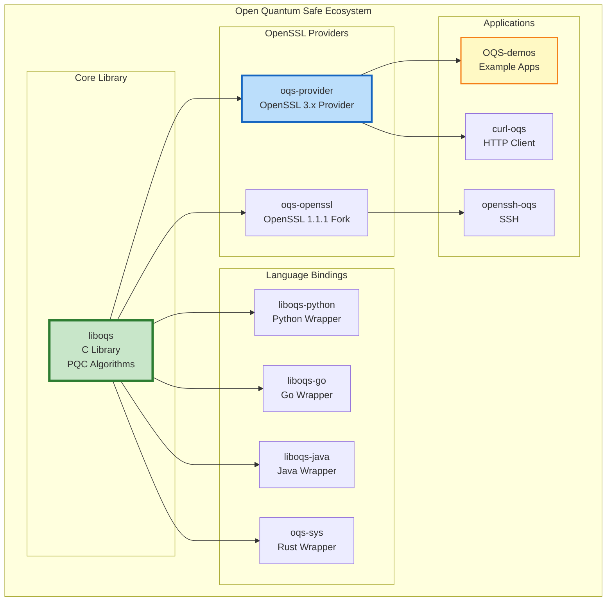
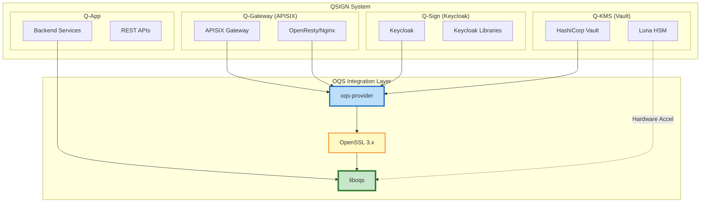
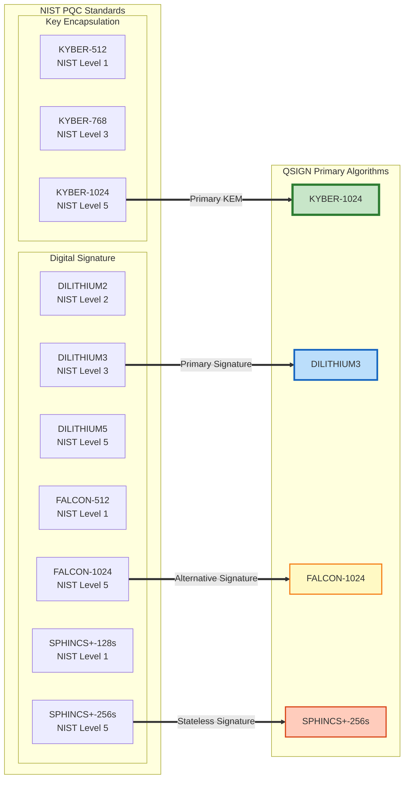
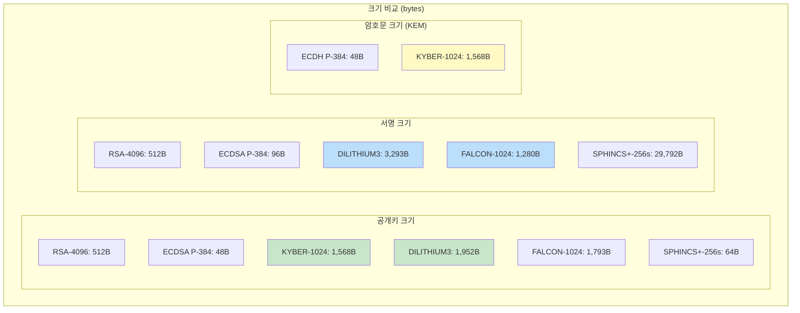

# OQS (Open Quantum Safe) 설계 문서

Q-Sign™ On-Premises Edition의 OQS (Open Quantum Safe) 통합 아키텍처 및 설계 문서입니다.

## 📘 개요

OQS (Open Quantum Safe)는 양자 내성 암호화(Post-Quantum Cryptography) 알고리즘의 오픈소스 구현 및 프로토타입 제작을 목적으로 하는 프로젝트입니다. QSIGN 시스템은 OQS 라이브러리를 핵심 PQC 엔진으로 사용하여 양자 컴퓨터 공격에 대비합니다.

### 핵심 특징

- **NIST Standardized Algorithms**: FIPS 203/204/205 표준 알고리즘 구현
- **OpenSSL Integration**: oqs-provider를 통한 OpenSSL 3.x 완전 통합
- **Production Ready**: 산업 환경에서 검증된 안정적인 구현
- **Cross-Platform**: Linux, Windows, macOS 지원

## 📖 문서 목록

### 1. [OQS-OVERVIEW.md](./OQS-OVERVIEW.md)
Open Quantum Safe 프로젝트 개요
- OQS 프로젝트 소개 및 역사
- OQS 생태계 (liboqs, oqs-provider, oqs-openssl)
- NIST PQC 표준화 프로세스
- 지원 알고리즘 전체 목록
- OQS vs 상용 솔루션 비교
- QSIGN에서의 OQS 역할

### 2. [OQS-ARCHITECTURE.md](./OQS-ARCHITECTURE.md)
OQS 아키텍처 설계
- liboqs 아키텍처 및 레이어 구조
- oqs-provider 아키텍처 (OpenSSL 3.x Provider API)
- Algorithm API 설계
- 메모리 관리 및 보안
- HSM 통합 아키텍처
- QSIGN 컴포넌트별 OQS 통합 방식

### 3. [OQS-DESIGN.md](./OQS-DESIGN.md)
상세 설계 문서
- liboqs API 상세 (KEM, Signature, RNG)
- KEM (Key Encapsulation Mechanism) API
- Digital Signature API
- RNG (Random Number Generation)
- 알고리즘 전환 메커니즘
- 에러 처리 및 스레드 안전성

### 4. [LIBOQS-INTEGRATION.md](./LIBOQS-INTEGRATION.md)
liboqs 통합 가이드
- liboqs 빌드 및 설치
- CMake 통합
- C/C++ API 사용법
- Python/Go 바인딩
- 알고리즘 선택 가이드
- 성능 튜닝

### 5. [OPENSSL-OQS.md](./OPENSSL-OQS.md)
OpenSSL 3.x 통합 (oqs-provider)
- oqs-provider 아키텍처 및 설치
- OpenSSL 3.x Provider interface
- TLS 1.3 with PQC examples
- X.509 PQC 인증서 생성
- Hybrid 모드 설정

## 🔐 OQS 핵심 개념

### OQS 생태계



### QSIGN에서의 OQS 통합



### 지원 알고리즘 개요



## 🎯 주요 알고리즘

### KYBER (Key Encapsulation Mechanism)

**FIPS 203 - Module-Lattice-Based KEM**

```yaml
KYBER 알고리즘 패밀리:
  KYBER-512:
    Security Level: NIST Level 1 (AES-128 equivalent)
    Public Key: 800 bytes
    Ciphertext: 768 bytes
    Shared Secret: 32 bytes
    용도: IoT, 리소스 제약 환경

  KYBER-768:
    Security Level: NIST Level 3 (AES-192 equivalent)
    Public Key: 1,184 bytes
    Ciphertext: 1,088 bytes
    Shared Secret: 32 bytes
    용도: 일반적인 TLS 연결

  KYBER-1024 (QSIGN 기본):
    Security Level: NIST Level 5 (AES-256 equivalent)
    Public Key: 1,568 bytes
    Ciphertext: 1,568 bytes
    Shared Secret: 32 bytes
    용도: 최고 보안 요구사항
```

### DILITHIUM (Digital Signature)

**FIPS 204 - Module-Lattice-Based Signature**

```yaml
DILITHIUM 알고리즘 패밀리:
  DILITHIUM2:
    Security Level: NIST Level 2
    Public Key: 1,312 bytes
    Signature: ~2,420 bytes
    용도: 일반 서명

  DILITHIUM3 (QSIGN 기본):
    Security Level: NIST Level 3 (192-bit security)
    Public Key: 1,952 bytes
    Signature: ~3,293 bytes
    용도: 표준 보안 요구사항

  DILITHIUM5:
    Security Level: NIST Level 5 (256-bit security)
    Public Key: 2,592 bytes
    Signature: ~4,595 bytes
    용도: 최고 보안 요구사항
```

### SPHINCS+ (Stateless Hash-Based Signature)

**FIPS 205 - Stateless Hash-Based Signature**

```yaml
SPHINCS+ 알고리즘 패밀리:
  SPHINCS+-SHA2-128s:
    Security Level: NIST Level 1
    Public Key: 32 bytes
    Signature: 7,856 bytes
    특징: 작은 키, 큰 서명

  SPHINCS+-SHA2-256s (QSIGN 백업):
    Security Level: NIST Level 5
    Public Key: 64 bytes
    Signature: 29,792 bytes
    특징: 순수 해시 기반, 양자 안전성 최고

  장점:
    - 완전 Stateless (상태 관리 불필요)
    - 순수 해시 기반 (검증된 안전성)
    - 작은 공개키/비밀키

  단점:
    - 매우 큰 서명 크기
    - 서명 생성 시간 느림
```

### FALCON (Fast Fourier Lattice-Based Signature)

**NIST Round 3 Finalist**

```yaml
FALCON 알고리즘 패밀리:
  FALCON-512:
    Security Level: NIST Level 1
    Public Key: 897 bytes
    Signature: ~666 bytes
    용도: 빠른 서명 검증

  FALCON-1024 (QSIGN 대안):
    Security Level: NIST Level 5
    Public Key: 1,793 bytes
    Signature: ~1,280 bytes
    용도: 작은 서명 크기 필요 시

  장점:
    - 작은 서명 크기 (Dilithium 대비)
    - 빠른 서명 검증

  단점:
    - 복잡한 구현
    - 부동소수점 연산 필요
```

## 📊 성능 비교

### 알고리즘 성능 벤치마크 (Luna HSM S790)

| 알고리즘 | 키 생성 | 서명/암호화 | 검증/복호화 | 주요 특징 |
|---------|--------|-----------|-----------|---------|
| **KYBER-1024** | 0.05ms | 0.06ms | 0.05ms | 빠른 KEM |
| **DILITHIUM3** | 0.08ms | 0.15ms | 0.05ms | 균형잡힌 서명 |
| **FALCON-1024** | 2.5ms | 0.35ms | 0.03ms | 작은 서명 |
| **SPHINCS+-256s** | 0.02ms | 150ms | 2.5ms | 느린 서명 |
| RSA-4096 (비교) | 250ms | 8ms | 0.3ms | 전통 알고리즘 |
| ECDSA P-384 (비교) | 0.8ms | 0.4ms | 0.9ms | 전통 알고리즘 |

### 데이터 크기 비교



## 🔗 관련 문서

- [01-architecture/PQC-ARCHITECTURE.md](../01-architecture/PQC-ARCHITECTURE.md) - PQC 아키텍처 개요
- [08-q-tls/](../08-q-tls/) - Q-TLS 설계 문서
- [02-setup/HSM-SETUP.md](../02-setup/HSM-SETUP.md) - Luna HSM 설정
- [05-api-reference/](../05-api-reference/) - API 레퍼런스

## 📚 참고 자료

```yaml
OQS 공식 리소스:
  공식 사이트: https://openquantumsafe.org/
  GitHub: https://github.com/open-quantum-safe
  Documentation: https://github.com/open-quantum-safe/liboqs/wiki

주요 저장소:
  liboqs: https://github.com/open-quantum-safe/liboqs
  oqs-provider: https://github.com/open-quantum-safe/oqs-provider
  oqs-openssl: https://github.com/open-quantum-safe/openssl

NIST PQC Standards:
  FIPS 203: ML-KEM (KYBER)
  FIPS 204: ML-DSA (DILITHIUM)
  FIPS 205: SLH-DSA (SPHINCS+)

라이선스:
  liboqs: MIT License
  oqs-provider: MIT License

커뮤니티:
  Mailing List: oqs-discuss@lists.openquantumsafe.org
  Slack: openquantumsafe.slack.com
```

## 🎓 학습 리소스

### 초보자를 위한 학습 경로

1. **OQS 개요** ([OQS-OVERVIEW.md](./OQS-OVERVIEW.md))
   - OQS 프로젝트 이해
   - PQC 알고리즘 기초

2. **아키텍처 학습** ([OQS-ARCHITECTURE.md](./OQS-ARCHITECTURE.md))
   - liboqs 구조 이해
   - oqs-provider 통합 방식

3. **API 설계** ([OQS-DESIGN.md](./OQS-DESIGN.md))
   - KEM API 사용법
   - Signature API 사용법

4. **실전 통합** ([LIBOQS-INTEGRATION.md](./LIBOQS-INTEGRATION.md))
   - 빌드 및 설치
   - 코드 예제 실습

5. **고급 설정** ([OPENSSL-OQS.md](./OPENSSL-OQS.md))
   - OpenSSL 통합
   - 프로덕션 배포

---

**Last Updated**: 2025-11-16
**Version**: 1.0.0
**Status**: Design Phase
**License**: MIT (OQS Project)
