# OQS 시퀀스 다이어그램

Open Quantum Safe (OQS) 주요 프로세스의 시퀀스 다이어그램 모음입니다.

## 목차

- [1. OQS 초기화 및 설정](#1-oqs-초기화-및-설정)
- [2. KYBER 키 교환](#2-kyber-키-교환)
- [3. DILITHIUM 서명/검증](#3-dilithium-서명검증)
- [4. Vault OQS Transit Engine 흐름](#4-vault-oqs-transit-engine-흐름)
- [5. Keycloak PQC 인증 흐름](#5-keycloak-pqc-인증-흐름)
- [6. APISIX TLS-PQC 핸드셰이크](#6-apisix-tls-pqc-핸드셰이크)
- [7. 인증서 발급 (OQS CA)](#7-인증서-발급-oqs-ca)
- [8. 키 순환 (Key Rotation)](#8-키-순환-key-rotation)
- [9. 에러 처리 시나리오](#9-에러-처리-시나리오)
- [10. 전체 시스템 통합 흐름](#10-전체-시스템-통합-흐름)

---

## 1. OQS 초기화 및 설정

### 1.1 시스템 부팅 시 OQS 초기화

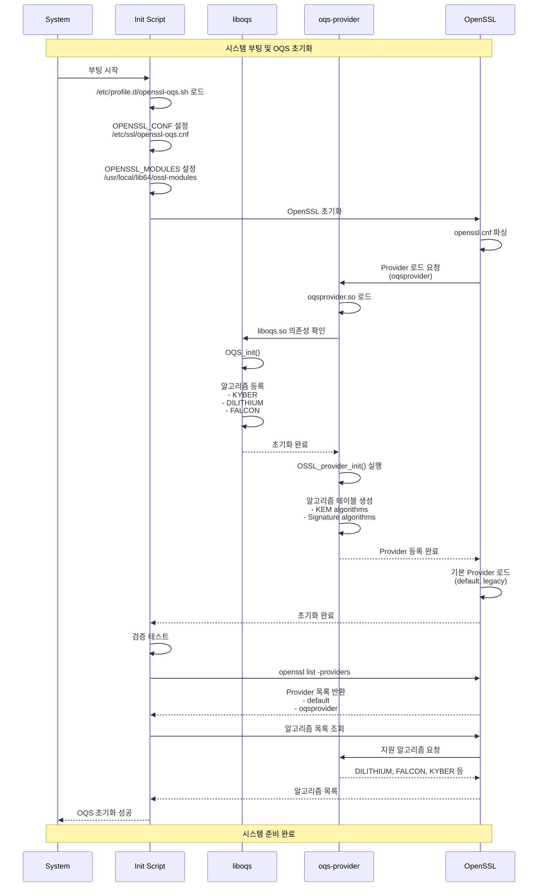

### 1.2 애플리케이션 OQS 설정

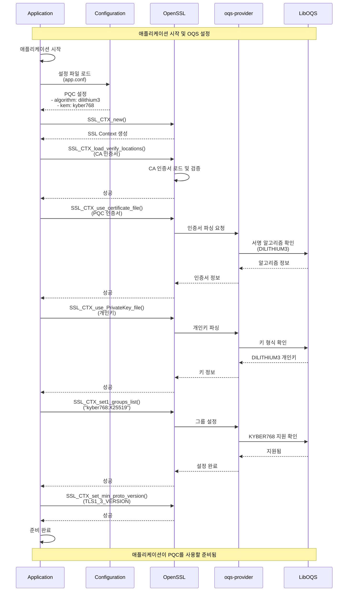

---

## 2. KYBER 키 교환

### 2.1 KYBER768 KEM 프로세스

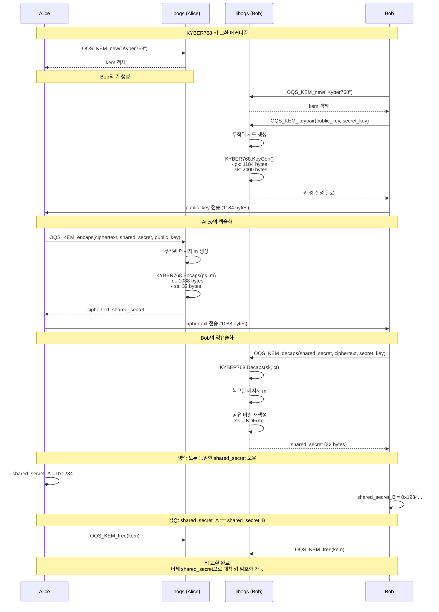

### 2.2 하이브리드 KEM (X25519 + KYBER768)

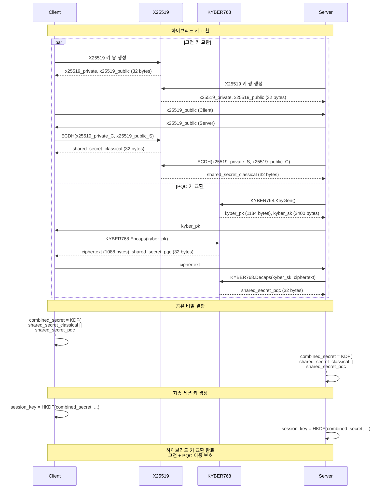

---

## 3. DILITHIUM 서명/검증

### 3.1 DILITHIUM3 서명 생성 및 검증

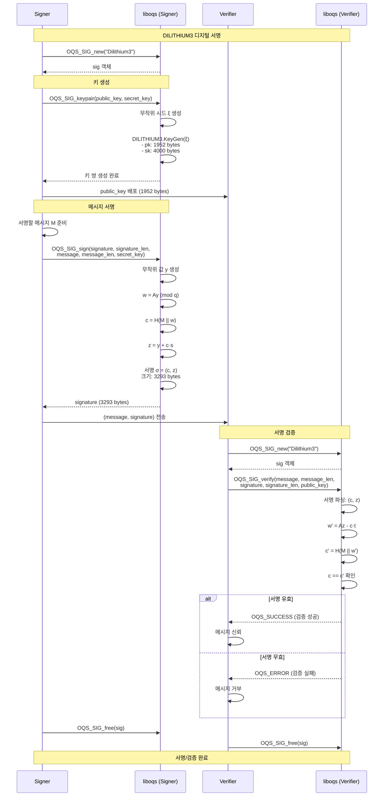

### 3.2 OpenSSL을 통한 DILITHIUM 서명

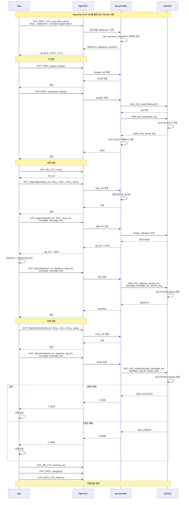

---

## 4. Vault OQS Transit Engine 흐름

### 4.1 Transit Engine 암호화/복호화

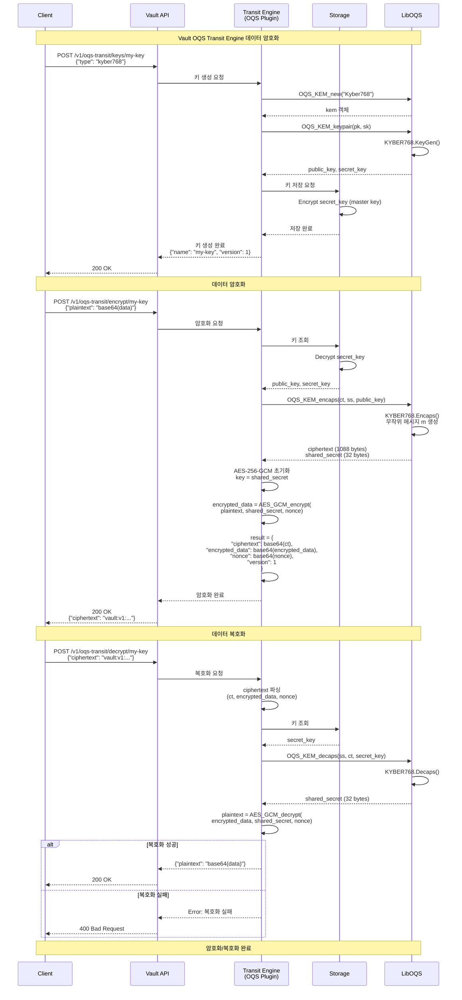

### 4.2 Vault PKI Engine 인증서 발급

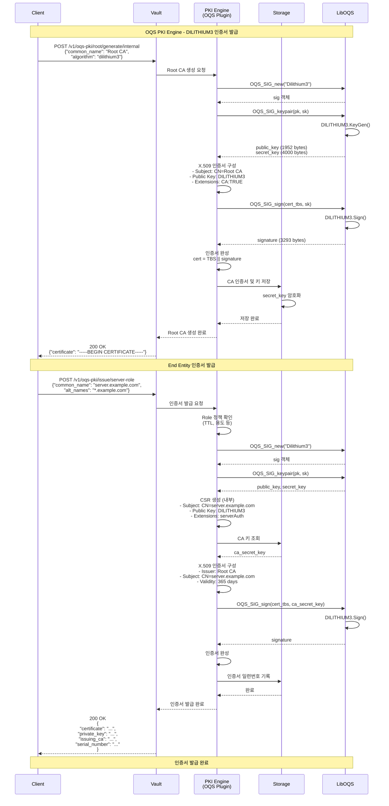

---

## 5. Keycloak PQC 인증 흐름

### 5.1 OIDC 토큰 발급 (DILITHIUM 서명)

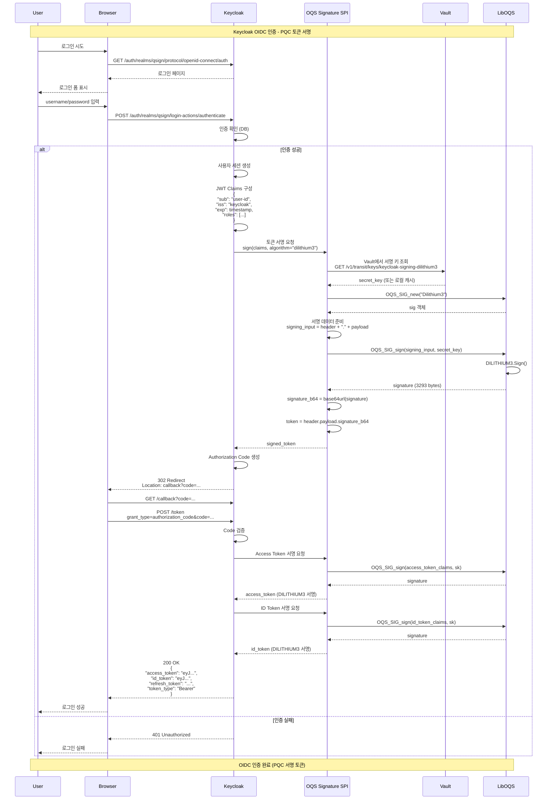

### 5.2 토큰 검증

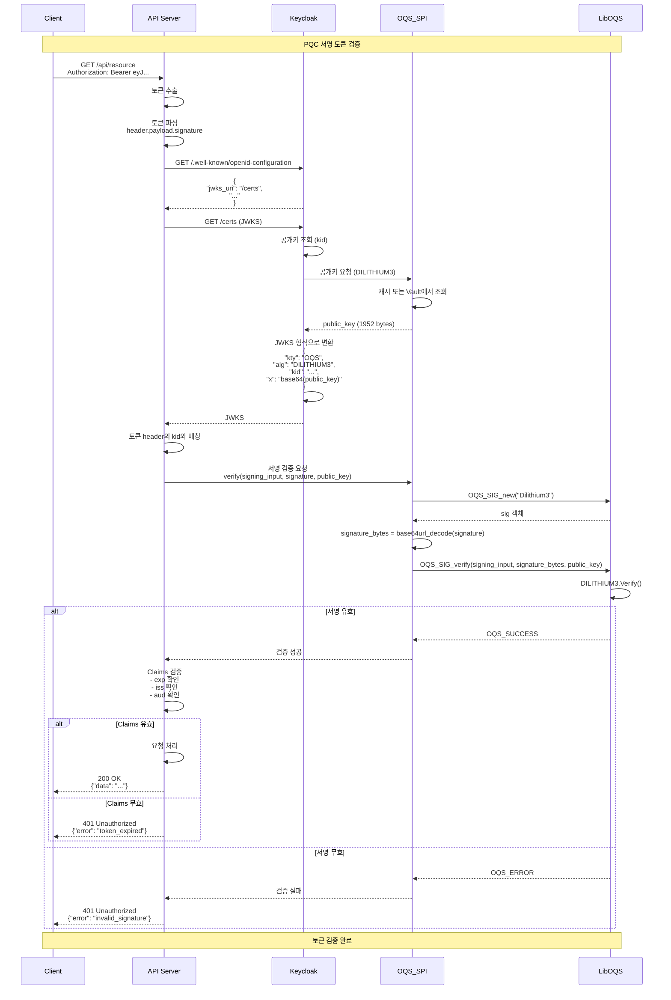

---

## 6. APISIX TLS-PQC 핸드셰이크

### 6.1 TLS 1.3 with KYBER768

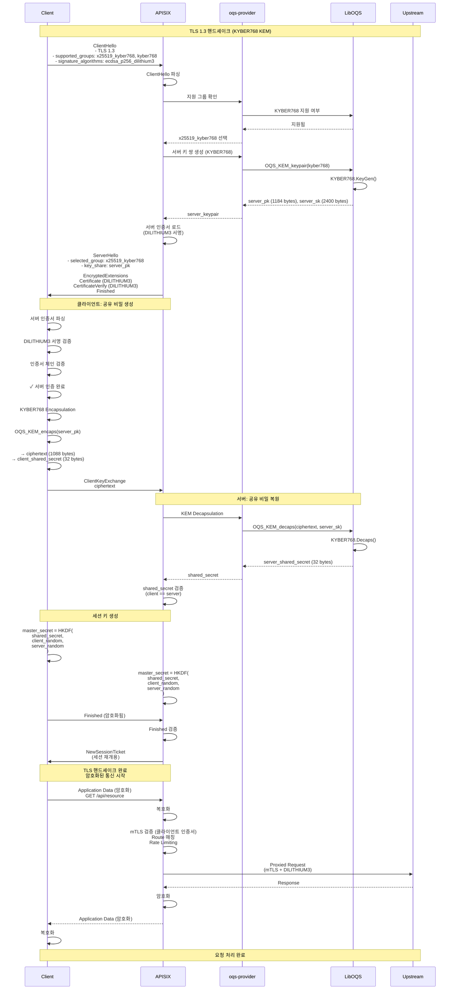

---

## 7. 인증서 발급 (OQS CA)

### 7.1 계층적 CA 구조

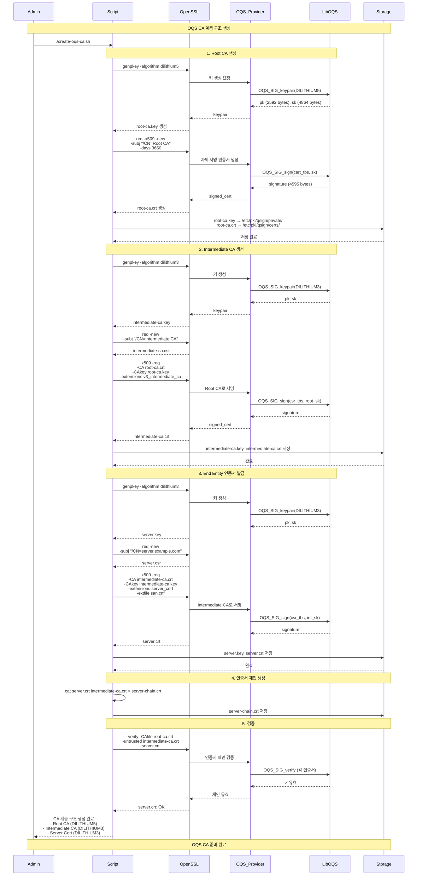

---

## 8. 키 순환 (Key Rotation)

### 8.1 Vault Transit Key Rotation

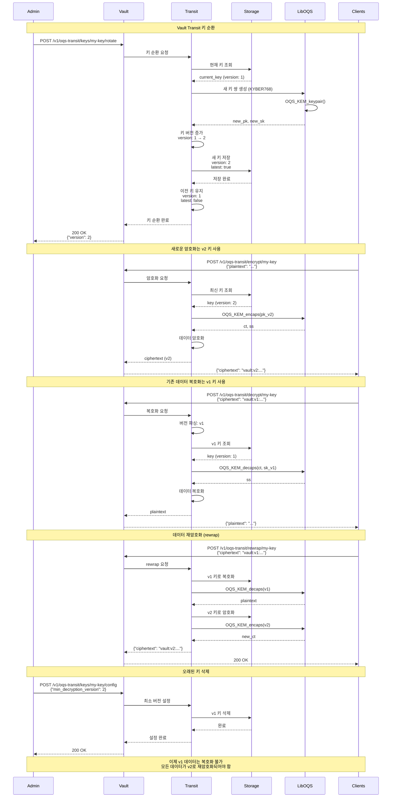

### 8.2 Keycloak 서명 키 순환

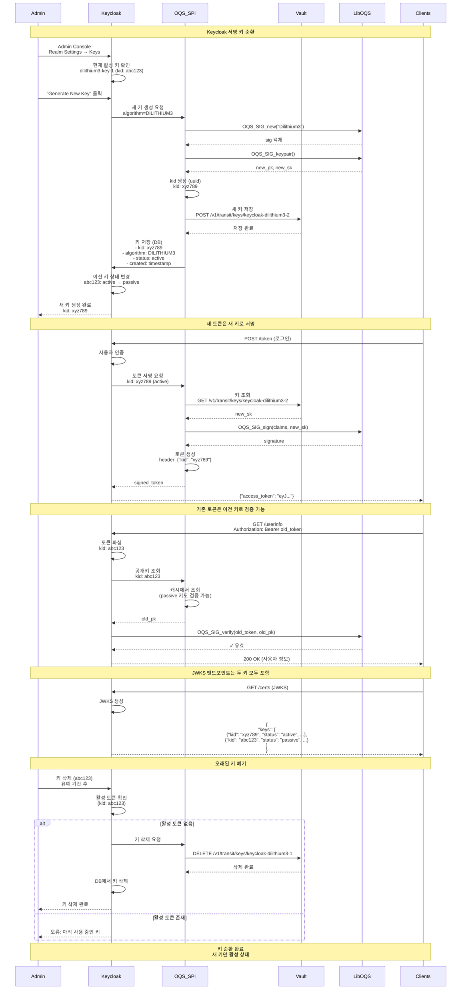

---

## 9. 에러 처리 시나리오

### 9.1 TLS 핸드셰이크 실패

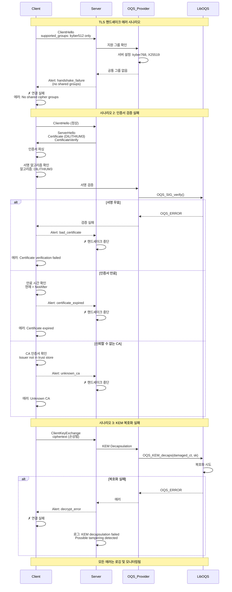

### 9.2 Vault Transit 에러

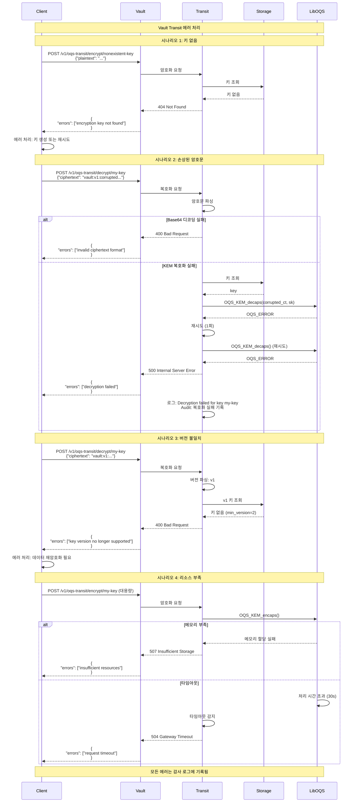

---

## 10. 전체 시스템 통합 흐름

### 10.1 End-to-End 요청 처리

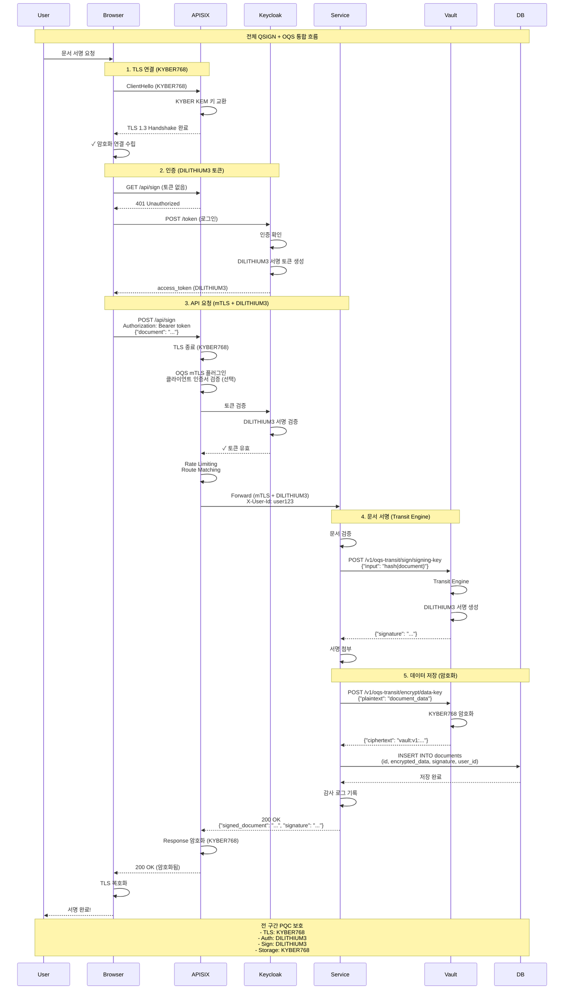

---

## 참고 자료

```yaml
시퀀스 다이어그램 도구:
  - Mermaid: https://mermaid.js.org/
  - PlantUML: https://plantuml.com/
  - Draw.io: https://app.diagrams.net/

관련 문서:
  - Q-Docs/10-OQS/LIBOQS.md
  - Q-Docs/10-OQS/OPENSSL-OQS.md
  - Q-Docs/10-OQS/OQS-QSIGN-INTEGRATION.md
  - Q-Docs/10-OQS/IMPLEMENTATION-GUIDE.md

프로토콜 명세:
  - TLS 1.3: RFC 8446
  - KYBER: NIST FIPS 203
  - DILITHIUM: NIST FIPS 204
```

---

**문서 버전:** 1.0
**최종 수정일:** 2025-01-16
**작성자:** QSIGN Documentation Team
