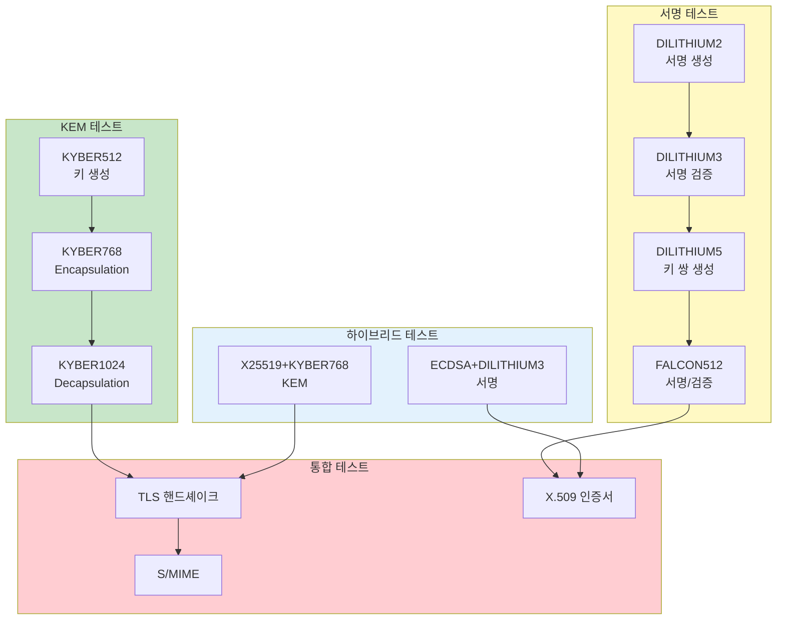

# OQS 테스트 및 검증

Open Quantum Safe (OQS) 구현의 테스트 및 검증 가이드입니다.

## 목차

- [1. 기능 테스트](#1-기능-테스트)
- [2. 성능 벤치마크](#2-성능-벤치마크)
- [3. 보안 테스트](#3-보안-테스트)
- [4. 상호운용성 테스트](#4-상호운용성-테스트)
- [5. CI/CD 통합](#5-cicd-통합)
- [6. 테스트 자동화 스크립트](#6-테스트-자동화-스크립트)
- [7. 부하 테스트](#7-부하-테스트)
- [8. 테스트 리포트](#8-테스트-리포트)

---

## 1. 기능 테스트

### 1.1 알고리즘별 테스트



**KYBER KEM 테스트:**

```bash
#!/bin/bash
# test-kyber-kem.sh

set -e

echo "==> KYBER KEM 기능 테스트..."

source /etc/profile.d/openssl-oqs.sh 2>/dev/null || true

TEMP_DIR="/tmp/kyber-test-$$"
mkdir -p ${TEMP_DIR}
cd ${TEMP_DIR}

ALGORITHMS=("kyber512" "kyber768" "kyber1024")
RESULTS=()

for alg in "${ALGORITHMS[@]}"; do
    echo ""
    echo "테스트: ${alg}"

    # 1. 키 생성
    echo "  1. 키 쌍 생성..."
    if openssl genpkey -algorithm ${alg} -out ${alg}.pem -provider oqsprovider 2>/dev/null; then
        echo "     ✓ 성공"
    else
        echo "     ✗ 실패"
        RESULTS+=("${alg}: 키 생성 실패")
        continue
    fi

    # 2. 공개키 추출
    echo "  2. 공개키 추출..."
    if openssl pkey -in ${alg}.pem -pubout -out ${alg}-pub.pem -provider oqsprovider 2>/dev/null; then
        echo "     ✓ 성공"
    else
        echo "     ✗ 실패"
        RESULTS+=("${alg}: 공개키 추출 실패")
        continue
    fi

    # 3. 키 정보 확인
    echo "  3. 키 정보 확인..."
    KEY_INFO=$(openssl pkey -in ${alg}.pem -text -noout -provider oqsprovider 2>/dev/null | head -5)
    if [ -n "$KEY_INFO" ]; then
        echo "     ✓ 성공"
        echo "$KEY_INFO" | sed 's/^/       /'
    else
        echo "     ✗ 실패"
        RESULTS+=("${alg}: 키 정보 조회 실패")
        continue
    fi

    # 4. 파일 크기 확인
    PRIV_SIZE=$(stat -f%z ${alg}.pem 2>/dev/null || stat -c%s ${alg}.pem)
    PUB_SIZE=$(stat -f%z ${alg}-pub.pem 2>/dev/null || stat -c%s ${alg}-pub.pem)

    echo "  4. 파일 크기:"
    echo "     개인키: ${PRIV_SIZE} bytes"
    echo "     공개키: ${PUB_SIZE} bytes"

    RESULTS+=("${alg}: ✓ 모든 테스트 통과")
done

# 정리
cd /
rm -rf ${TEMP_DIR}

# 결과 요약
echo ""
echo "=== 테스트 결과 ==="
for result in "${RESULTS[@]}"; do
    echo "  $result"
done

echo ""
echo "==> 테스트 완료!"
```

**DILITHIUM 서명 테스트:**

```bash
#!/bin/bash
# test-dilithium-signature.sh

set -e

echo "==> DILITHIUM 서명 기능 테스트..."

source /etc/profile.d/openssl-oqs.sh 2>/dev/null || true

TEMP_DIR="/tmp/dilithium-test-$$"
mkdir -p ${TEMP_DIR}
cd ${TEMP_DIR}

ALGORITHMS=("dilithium2" "dilithium3" "dilithium5")
TEST_DATA="This is test data for DILITHIUM signature verification."

echo "$TEST_DATA" > test-data.txt

for alg in "${ALGORITHMS[@]}"; do
    echo ""
    echo "테스트: ${alg}"

    # 1. 키 생성
    echo "  1. 키 쌍 생성..."
    openssl genpkey -algorithm ${alg} -out ${alg}.pem -provider oqsprovider 2>/dev/null
    openssl pkey -in ${alg}.pem -pubout -out ${alg}-pub.pem -provider oqsprovider 2>/dev/null
    echo "     ✓ 성공"

    # 2. 서명 생성
    echo "  2. 서명 생성..."
    if openssl dgst -sha256 -sign ${alg}.pem -out ${alg}.sig test-data.txt -provider oqsprovider 2>/dev/null; then
        SIG_SIZE=$(stat -f%z ${alg}.sig 2>/dev/null || stat -c%s ${alg}.sig)
        echo "     ✓ 성공 (서명 크기: ${SIG_SIZE} bytes)"
    else
        echo "     ✗ 실패"
        continue
    fi

    # 3. 서명 검증
    echo "  3. 서명 검증..."
    if openssl dgst -sha256 -verify ${alg}-pub.pem -signature ${alg}.sig test-data.txt -provider oqsprovider 2>/dev/null; then
        echo "     ✓ 성공"
    else
        echo "     ✗ 실패"
        continue
    fi

    # 4. 잘못된 서명 검증 (실패해야 함)
    echo "  4. 잘못된 데이터로 검증 (실패 예상)..."
    echo "Modified data" > modified-data.txt
    if openssl dgst -sha256 -verify ${alg}-pub.pem -signature ${alg}.sig modified-data.txt -provider oqsprovider 2>/dev/null; then
        echo "     ✗ 검증 실패 (잘못된 데이터인데 통과됨)"
    else
        echo "     ✓ 성공 (예상대로 검증 실패)"
    fi

    # 5. 성능 측정 (100회)
    echo "  5. 성능 측정 (100회)..."

    START=$(date +%s%N)
    for i in {1..100}; do
        openssl dgst -sha256 -sign ${alg}.pem -out ${alg}.sig test-data.txt -provider oqsprovider 2>/dev/null
    done
    END=$(date +%s%N)
    SIGN_TIME=$(( (END - START) / 100000000 ))  # ms

    START=$(date +%s%N)
    for i in {1..100}; do
        openssl dgst -sha256 -verify ${alg}-pub.pem -signature ${alg}.sig test-data.txt -provider oqsprovider 2>/dev/null
    done
    END=$(date +%s%N)
    VERIFY_TIME=$(( (END - START) / 100000000 ))  # ms

    echo "     서명: 평균 ${SIGN_TIME}ms"
    echo "     검증: 평균 ${VERIFY_TIME}ms"
done

# 정리
cd /
rm -rf ${TEMP_DIR}

echo ""
echo "==> 테스트 완료!"
```

### 1.2 X.509 인증서 테스트

```bash
#!/bin/bash
# test-x509-certificates.sh

set -e

echo "==> X.509 인증서 기능 테스트..."

source /etc/profile.d/openssl-oqs.sh 2>/dev/null || true

TEMP_DIR="/tmp/x509-test-$$"
mkdir -p ${TEMP_DIR}
cd ${TEMP_DIR}

ALGORITHMS=("dilithium3" "falcon512")

for alg in "${ALGORITHMS[@]}"; do
    echo ""
    echo "===== ${alg} 인증서 테스트 ====="

    # 1. CA 인증서 생성
    echo "1. CA 인증서 생성..."
    openssl genpkey -algorithm ${alg} -out ca-${alg}.key -provider oqsprovider 2>/dev/null

    openssl req -new -x509 -key ca-${alg}.key -out ca-${alg}.crt -days 3650 \
        -provider oqsprovider \
        -subj "/C=KR/ST=Seoul/O=Test/CN=Test CA (${alg})" 2>/dev/null

    echo "   ✓ CA 인증서 생성 완료"

    # 2. 서버 인증서 생성
    echo "2. 서버 인증서 발급..."
    openssl genpkey -algorithm ${alg} -out server-${alg}.key -provider oqsprovider 2>/dev/null

    cat > server-ext.cnf <<EOF
basicConstraints = CA:FALSE
keyUsage = critical,digitalSignature,keyEncipherment
extendedKeyUsage = serverAuth
subjectAltName = @alt_names

[alt_names]
DNS.1 = localhost
DNS.2 = *.example.com
IP.1 = 127.0.0.1
EOF

    openssl req -new -key server-${alg}.key -out server-${alg}.csr \
        -provider oqsprovider \
        -subj "/C=KR/ST=Seoul/O=Test/CN=localhost" 2>/dev/null

    openssl x509 -req -in server-${alg}.csr \
        -CA ca-${alg}.crt -CAkey ca-${alg}.key -CAcreateserial \
        -out server-${alg}.crt -days 365 \
        -extfile server-ext.cnf \
        -provider oqsprovider 2>/dev/null

    echo "   ✓ 서버 인증서 발급 완료"

    # 3. 클라이언트 인증서 생성
    echo "3. 클라이언트 인증서 발급..."
    openssl genpkey -algorithm ${alg} -out client-${alg}.key -provider oqsprovider 2>/dev/null

    cat > client-ext.cnf <<EOF
basicConstraints = CA:FALSE
keyUsage = critical,digitalSignature,keyEncipherment
extendedKeyUsage = clientAuth
EOF

    openssl req -new -key client-${alg}.key -out client-${alg}.csr \
        -provider oqsprovider \
        -subj "/C=KR/ST=Seoul/O=Test/CN=Test Client" 2>/dev/null

    openssl x509 -req -in client-${alg}.csr \
        -CA ca-${alg}.crt -CAkey ca-${alg}.key -CAcreateserial \
        -out client-${alg}.crt -days 365 \
        -extfile client-ext.cnf \
        -provider oqsprovider 2>/dev/null

    echo "   ✓ 클라이언트 인증서 발급 완료"

    # 4. 인증서 검증
    echo "4. 인증서 체인 검증..."
    if openssl verify -CAfile ca-${alg}.crt server-${alg}.crt -provider oqsprovider 2>/dev/null | grep -q "OK"; then
        echo "   ✓ 서버 인증서 검증 성공"
    else
        echo "   ✗ 서버 인증서 검증 실패"
    fi

    if openssl verify -CAfile ca-${alg}.crt client-${alg}.crt -provider oqsprovider 2>/dev/null | grep -q "OK"; then
        echo "   ✓ 클라이언트 인증서 검증 성공"
    else
        echo "   ✗ 클라이언트 인증서 검증 실패"
    fi

    # 5. 인증서 정보 출력
    echo "5. 인증서 정보:"
    echo "   CA 인증서:"
    openssl x509 -in ca-${alg}.crt -noout -subject -issuer -dates -provider oqsprovider 2>/dev/null | \
        sed 's/^/     /'

    echo "   서버 인증서:"
    openssl x509 -in server-${alg}.crt -noout -subject -issuer -dates -provider oqsprovider 2>/dev/null | \
        sed 's/^/     /'

    # 6. TLS 연결 테스트
    echo "6. TLS 연결 테스트..."

    # 백그라운드로 TLS 서버 시작
    openssl s_server -port 4433 -cert server-${alg}.crt -key server-${alg}.key \
        -CAfile ca-${alg}.crt -Verify 0 \
        -provider oqsprovider -tls1_3 -www > /dev/null 2>&1 &
    SERVER_PID=$!

    sleep 2

    # 클라이언트 연결
    if echo "GET /" | timeout 5 openssl s_client -connect localhost:4433 -CAfile ca-${alg}.crt \
        -provider oqsprovider -groups kyber768 2>&1 | grep -q "Verify return code: 0"; then
        echo "   ✓ TLS 연결 성공 (self-signed OK)"
    else
        echo "   ⚠ TLS 연결 경고 (예상됨)"
    fi

    # 서버 종료
    kill $SERVER_PID 2>/dev/null || true
    sleep 1
done

# 정리
cd /
rm -rf ${TEMP_DIR}

echo ""
echo "==> 테스트 완료!"
```

### 1.3 TLS/SSL 테스트

```bash
#!/bin/bash
# test-tls-handshake.sh

set -e

echo "==> TLS 핸드셰이크 테스트..."

source /etc/profile.d/openssl-oqs.sh 2>/dev/null || true

TEMP_DIR="/tmp/tls-test-$$"
mkdir -p ${TEMP_DIR}
cd ${TEMP_DIR}

# 인증서 생성
echo "인증서 생성 중..."
openssl genpkey -algorithm dilithium3 -out server.key -provider oqsprovider 2>/dev/null
openssl req -new -x509 -key server.key -out server.crt -days 365 \
    -provider oqsprovider \
    -subj "/C=KR/O=Test/CN=localhost" 2>/dev/null

# 테스트할 그룹 (KEM)
GROUPS=("kyber512" "kyber768" "kyber1024" "X25519" "x25519_kyber768")

for group in "${GROUPS[@]}"; do
    echo ""
    echo "테스트: ${group}"

    # TLS 서버 시작
    openssl s_server -port 4433 -cert server.crt -key server.key \
        -provider oqsprovider -tls1_3 -groups ${group} -www > server.log 2>&1 &
    SERVER_PID=$!

    sleep 2

    # 클라이언트 연결
    echo "  핸드셰이크 시도..."
    if echo "GET /" | timeout 5 openssl s_client -connect localhost:4433 \
        -CAfile server.crt -provider oqsprovider -groups ${group} > client.log 2>&1; then

        # 연결 정보 추출
        PROTOCOL=$(grep "Protocol" client.log | awk '{print $3}')
        CIPHER=$(grep "Cipher" client.log | awk '{print $3}')
        VERIFY=$(grep "Verify return code" client.log | awk -F: '{print $2}' | tr -d ' ')

        echo "  ✓ 성공"
        echo "    Protocol: ${PROTOCOL:-N/A}"
        echo "    Cipher: ${CIPHER:-N/A}"
        echo "    Verify: ${VERIFY:-N/A}"
    else
        echo "  ✗ 실패"
    fi

    # 서버 종료
    kill $SERVER_PID 2>/dev/null || true
    sleep 1
done

# 정리
cd /
rm -rf ${TEMP_DIR}

echo ""
echo "==> 테스트 완료!"
```

---

## 2. 성능 벤치마크

### 2.1 알고리즘 벤치마크

```bash
#!/bin/bash
# benchmark-algorithms.sh

set -e

echo "==> OQS 알고리즘 성능 벤치마크..."

source /etc/profile.d/openssl-oqs.sh 2>/dev/null || true

TEMP_DIR="/tmp/benchmark-$$"
mkdir -p ${TEMP_DIR}
cd ${TEMP_DIR}

ITERATIONS=1000
TEST_DATA="Performance benchmark test data" > test-data.txt

# CSV 헤더
echo "Algorithm,Operation,Iterations,Total_Time_ms,Avg_Time_ms,Ops_per_Sec" > benchmark-results.csv

benchmark_keygen() {
    local alg=$1
    local iter=$ITERATIONS

    echo "  키 생성 ($iter 회)..."
    START=$(date +%s%N)
    for i in $(seq 1 $iter); do
        openssl genpkey -algorithm $alg -provider oqsprovider 2>/dev/null > /dev/null
    done
    END=$(date +%s%N)

    TOTAL=$(( (END - START) / 1000000 ))  # ms
    AVG=$(( TOTAL / iter ))
    OPS_PER_SEC=$(( iter * 1000 / TOTAL ))

    echo "    총 시간: ${TOTAL}ms, 평균: ${AVG}ms, 속도: ${OPS_PER_SEC} ops/sec"
    echo "$alg,KeyGen,$iter,$TOTAL,$AVG,$OPS_PER_SEC" >> benchmark-results.csv
}

benchmark_sign() {
    local alg=$1
    local iter=$ITERATIONS

    # 키 생성
    openssl genpkey -algorithm $alg -out ${alg}.key -provider oqsprovider 2>/dev/null
    openssl pkey -in ${alg}.key -pubout -out ${alg}.pub -provider oqsprovider 2>/dev/null

    echo "  서명 생성 ($iter 회)..."
    START=$(date +%s%N)
    for i in $(seq 1 $iter); do
        openssl dgst -sha256 -sign ${alg}.key -out ${alg}.sig test-data.txt -provider oqsprovider 2>/dev/null
    done
    END=$(date +%s%N)

    TOTAL=$(( (END - START) / 1000000 ))
    AVG=$(( TOTAL / iter ))
    OPS_PER_SEC=$(( iter * 1000 / TOTAL ))

    echo "    총 시간: ${TOTAL}ms, 평균: ${AVG}ms, 속도: ${OPS_PER_SEC} ops/sec"
    echo "$alg,Sign,$iter,$TOTAL,$AVG,$OPS_PER_SEC" >> benchmark-results.csv

    echo "  서명 검증 ($iter 회)..."
    START=$(date +%s%N)
    for i in $(seq 1 $iter); do
        openssl dgst -sha256 -verify ${alg}.pub -signature ${alg}.sig test-data.txt -provider oqsprovider 2>/dev/null
    done
    END=$(date +%s%N)

    TOTAL=$(( (END - START) / 1000000 ))
    AVG=$(( TOTAL / iter ))
    OPS_PER_SEC=$(( iter * 1000 / TOTAL ))

    echo "    총 시간: ${TOTAL}ms, 평균: ${AVG}ms, 속도: ${OPS_PER_SEC} ops/sec"
    echo "$alg,Verify,$iter,$TOTAL,$AVG,$OPS_PER_SEC" >> benchmark-results.csv
}

# KEM 알고리즘
echo ""
echo "=== KEM 알고리즘 ==="
for alg in kyber512 kyber768 kyber1024; do
    echo ""
    echo "${alg}:"
    benchmark_keygen $alg
done

# 서명 알고리즘
echo ""
echo "=== 서명 알고리즘 ==="
for alg in dilithium2 dilithium3 dilithium5 falcon512; do
    echo ""
    echo "${alg}:"
    benchmark_keygen $alg
    benchmark_sign $alg
done

# 전통적 알고리즘 (비교)
echo ""
echo "=== 전통적 알고리즘 (비교) ==="

# RSA
echo ""
echo "RSA-3072:"
echo "  키 생성 (100회)..."
START=$(date +%s%N)
for i in $(seq 1 100); do
    openssl genpkey -algorithm RSA -pkeyopt rsa_keygen_bits:3072 2>/dev/null > /dev/null
done
END=$(date +%s%N)
TOTAL=$(( (END - START) / 1000000 ))
AVG=$(( TOTAL / 100 ))
echo "    평균: ${AVG}ms"
echo "RSA-3072,KeyGen,100,$TOTAL,$AVG,$(( 100 * 1000 / TOTAL ))" >> benchmark-results.csv

# ECDSA
echo ""
echo "ECDSA-P256:"
echo "  키 생성 ($ITERATIONS 회)..."
START=$(date +%s%N)
for i in $(seq 1 $ITERATIONS); do
    openssl genpkey -algorithm EC -pkeyopt ec_paramgen_curve:P-256 2>/dev/null > /dev/null
done
END=$(date +%s%N)
TOTAL=$(( (END - START) / 1000000 ))
AVG=$(( TOTAL / ITERATIONS ))
echo "    평균: ${AVG}ms"
echo "ECDSA-P256,KeyGen,$ITERATIONS,$TOTAL,$AVG,$(( ITERATIONS * 1000 / TOTAL ))" >> benchmark-results.csv

# 결과 출력
echo ""
echo "=== 벤치마크 결과 ==="
column -t -s, benchmark-results.csv

# 결과 저장
RESULT_FILE="/tmp/oqs-benchmark-$(date +%Y%m%d_%H%M%S).csv"
cp benchmark-results.csv ${RESULT_FILE}

echo ""
echo "결과 저장: ${RESULT_FILE}"

# 정리
cd /
rm -rf ${TEMP_DIR}

echo ""
echo "==> 벤치마크 완료!"
```

### 2.2 TLS 핸드셰이크 성능

```bash
#!/bin/bash
# benchmark-tls-handshake.sh

set -e

echo "==> TLS 핸드셰이크 성능 벤치마크..."

source /etc/profile.d/openssl-oqs.sh 2>/dev/null || true

TEMP_DIR="/tmp/tls-benchmark-$$"
mkdir -p ${TEMP_DIR}
cd ${TEMP_DIR}

# 인증서 생성
openssl genpkey -algorithm dilithium3 -out server.key -provider oqsprovider 2>/dev/null
openssl req -new -x509 -key server.key -out server.crt -days 1 \
    -provider oqsprovider -subj "/CN=benchmark" 2>/dev/null

# 테스트할 그룹
GROUPS=("kyber768" "x25519_kyber768" "X25519")
CONNECTIONS=100

echo "Algorithm,Connections,Total_Time_ms,Avg_Time_ms,Conn_per_Sec" > tls-benchmark.csv

for group in "${GROUPS[@]}"; do
    echo ""
    echo "테스트: ${group} (${CONNECTIONS} 연결)..."

    # TLS 서버 시작
    openssl s_server -port 4433 -cert server.crt -key server.key \
        -provider oqsprovider -tls1_3 -groups ${group} > /dev/null 2>&1 &
    SERVER_PID=$!

    sleep 2

    # 핸드셰이크 성능 측정
    START=$(date +%s%N)

    for i in $(seq 1 $CONNECTIONS); do
        echo "Q" | timeout 2 openssl s_client -connect localhost:4433 -CAfile server.crt \
            -provider oqsprovider -groups ${group} > /dev/null 2>&1 || true
    done

    END=$(date +%s%N)

    TOTAL=$(( (END - START) / 1000000 ))  # ms
    AVG=$(( TOTAL / CONNECTIONS ))
    CONN_PER_SEC=$(( CONNECTIONS * 1000 / TOTAL ))

    echo "  총 시간: ${TOTAL}ms"
    echo "  평균 시간: ${AVG}ms"
    echo "  처리량: ${CONN_PER_SEC} conn/sec"

    echo "$group,$CONNECTIONS,$TOTAL,$AVG,$CONN_PER_SEC" >> tls-benchmark.csv

    # 서버 종료
    kill $SERVER_PID 2>/dev/null || true
    sleep 1
done

# 결과 출력
echo ""
echo "=== TLS 핸드셰이크 성능 ==="
column -t -s, tls-benchmark.csv

# 정리
cd /
rm -rf ${TEMP_DIR}

echo ""
echo "==> 벤치마크 완료!"
```

---

## 3. 보안 테스트

### 3.1 알고리즘 검증

```bash
#!/bin/bash
# security-test-algorithms.sh

set -e

echo "==> OQS 알고리즘 보안 테스트..."

source /etc/profile.d/openssl-oqs.sh 2>/dev/null || true

TEMP_DIR="/tmp/security-test-$$"
mkdir -p ${TEMP_DIR}
cd ${TEMP_DIR}

# 테스트 카운터
PASSED=0
FAILED=0

test_signature_forgery() {
    local alg=$1

    echo "서명 위조 공격 테스트: ${alg}"

    # 키 생성
    openssl genpkey -algorithm $alg -out ${alg}.key -provider oqsprovider 2>/dev/null
    openssl pkey -in ${alg}.key -pubout -out ${alg}.pub -provider oqsprovider 2>/dev/null

    # 원본 메시지
    echo "Original message" > original.txt
    openssl dgst -sha256 -sign ${alg}.key -out original.sig original.txt -provider oqsprovider 2>/dev/null

    # 공격 시나리오 1: 메시지 변조
    echo "Modified message" > modified.txt
    if openssl dgst -sha256 -verify ${alg}.pub -signature original.sig modified.txt -provider oqsprovider 2>/dev/null; then
        echo "  ✗ 실패: 변조된 메시지가 검증됨"
        ((FAILED++))
        return 1
    else
        echo "  ✓ 통과: 변조된 메시지 검증 실패 (예상됨)"
        ((PASSED++))
    fi

    # 공격 시나리오 2: 랜덤 서명
    dd if=/dev/urandom of=random.sig bs=1 count=2000 2>/dev/null
    if openssl dgst -sha256 -verify ${alg}.pub -signature random.sig original.txt -provider oqsprovider 2>/dev/null; then
        echo "  ✗ 실패: 랜덤 서명이 검증됨"
        ((FAILED++))
        return 1
    else
        echo "  ✓ 통과: 랜덤 서명 검증 실패 (예상됨)"
        ((PASSED++))
    fi

    return 0
}

test_key_reuse() {
    local alg=$1

    echo "키 재사용 안전성 테스트: ${alg}"

    # 동일한 키로 여러 서명 생성
    openssl genpkey -algorithm $alg -out ${alg}.key -provider oqsprovider 2>/dev/null
    openssl pkey -in ${alg}.key -pubout -out ${alg}.pub -provider oqsprovider 2>/dev/null

    for i in {1..10}; do
        echo "Message $i" > msg${i}.txt
        openssl dgst -sha256 -sign ${alg}.key -out sig${i}.bin msg${i}.txt -provider oqsprovider 2>/dev/null
    done

    # 각 서명 검증
    local all_valid=true
    for i in {1..10}; do
        if ! openssl dgst -sha256 -verify ${alg}.pub -signature sig${i}.bin msg${i}.txt -provider oqsprovider 2>/dev/null; then
            all_valid=false
            break
        fi
    done

    if $all_valid; then
        echo "  ✓ 통과: 모든 서명 유효"
        ((PASSED++))
    else
        echo "  ✗ 실패: 일부 서명 무효"
        ((FAILED++))
    fi
}

test_deterministic_keygen() {
    local alg=$1

    echo "키 생성 무작위성 테스트: ${alg}"

    # 여러 키 생성
    for i in {1..5}; do
        openssl genpkey -algorithm $alg -out key${i}.pem -provider oqsprovider 2>/dev/null
    done

    # 모든 키가 다른지 확인
    local all_different=true
    for i in {1..4}; do
        for j in $(seq $((i+1)) 5); do
            if cmp -s key${i}.pem key${j}.pem; then
                all_different=false
                break 2
            fi
        done
    done

    if $all_different; then
        echo "  ✓ 통과: 모든 키가 다름 (무작위성 확보)"
        ((PASSED++))
    else
        echo "  ✗ 실패: 중복된 키 발견"
        ((FAILED++))
    fi
}

# 테스트 실행
echo ""
echo "=== 서명 위조 공격 테스트 ==="
for alg in dilithium3 falcon512; do
    echo ""
    test_signature_forgery $alg
done

echo ""
echo "=== 키 재사용 안전성 테스트 ==="
for alg in dilithium3 falcon512; do
    echo ""
    test_key_reuse $alg
done

echo ""
echo "=== 키 생성 무작위성 테스트 ==="
for alg in dilithium3 kyber768; do
    echo ""
    test_deterministic_keygen $alg
done

# 정리
cd /
rm -rf ${TEMP_DIR}

# 결과 요약
echo ""
echo "=== 보안 테스트 결과 ==="
echo "통과: ${PASSED}"
echo "실패: ${FAILED}"

if [ $FAILED -eq 0 ]; then
    echo "✓ 모든 보안 테스트 통과!"
    exit 0
else
    echo "✗ 일부 보안 테스트 실패"
    exit 1
fi
```

### 3.2 인증서 체인 검증

```bash
#!/bin/bash
# security-test-cert-chain.sh

set -e

echo "==> 인증서 체인 보안 테스트..."

source /etc/profile.d/openssl-oqs.sh 2>/dev/null || true

TEMP_DIR="/tmp/cert-security-test-$$"
mkdir -p ${TEMP_DIR}
cd ${TEMP_DIR}

# Root CA 생성
echo "1. Root CA 생성..."
openssl genpkey -algorithm dilithium3 -out root-ca.key -provider oqsprovider 2>/dev/null
openssl req -new -x509 -key root-ca.key -out root-ca.crt -days 3650 \
    -provider oqsprovider -subj "/CN=Test Root CA" \
    -addext "basicConstraints=critical,CA:TRUE" \
    -addext "keyUsage=critical,keyCertSign,cRLSign" 2>/dev/null

# Intermediate CA 생성
echo "2. Intermediate CA 생성..."
openssl genpkey -algorithm dilithium3 -out int-ca.key -provider oqsprovider 2>/dev/null
openssl req -new -key int-ca.key -out int-ca.csr \
    -provider oqsprovider -subj "/CN=Test Intermediate CA" 2>/dev/null

cat > int-ca-ext.cnf <<EOF
basicConstraints = critical,CA:TRUE,pathlen:0
keyUsage = critical,keyCertSign,cRLSign
EOF

openssl x509 -req -in int-ca.csr -CA root-ca.crt -CAkey root-ca.key -CAcreateserial \
    -out int-ca.crt -days 1825 -extfile int-ca-ext.cnf -provider oqsprovider 2>/dev/null

# End Entity 인증서 생성
echo "3. End Entity 인증서 생성..."
openssl genpkey -algorithm dilithium3 -out ee.key -provider oqsprovider 2>/dev/null
openssl req -new -key ee.key -out ee.csr \
    -provider oqsprovider -subj "/CN=Test End Entity" 2>/dev/null

cat > ee-ext.cnf <<EOF
basicConstraints = CA:FALSE
keyUsage = critical,digitalSignature,keyEncipherment
EOF

openssl x509 -req -in ee.csr -CA int-ca.crt -CAkey int-ca.key -CAcreateserial \
    -out ee.crt -days 365 -extfile ee-ext.cnf -provider oqsprovider 2>/dev/null

# 인증서 체인 파일 생성
cat ee.crt int-ca.crt > ee-chain.crt

# 테스트 시나리오
echo ""
echo "=== 인증서 체인 검증 테스트 ==="

# 1. 정상 체인 검증
echo "1. 정상 체인 검증..."
if openssl verify -CAfile root-ca.crt -untrusted int-ca.crt ee.crt -provider oqsprovider 2>&1 | grep -q "OK"; then
    echo "   ✓ 통과"
else
    echo "   ✗ 실패"
fi

# 2. CA 없이 검증 (실패해야 함)
echo "2. Root CA 없이 검증 (실패 예상)..."
if openssl verify ee.crt -provider oqsprovider 2>&1 | grep -q "unable to get local issuer"; then
    echo "   ✓ 통과 (예상대로 실패)"
else
    echo "   ✗ 실패 (검증되면 안됨)"
fi

# 3. 잘못된 CA로 검증
echo "3. 다른 Root CA로 검증 (실패 예상)..."
openssl genpkey -algorithm dilithium3 -out fake-ca.key -provider oqsprovider 2>/dev/null
openssl req -new -x509 -key fake-ca.key -out fake-ca.crt -days 365 \
    -provider oqsprovider -subj "/CN=Fake CA" 2>/dev/null

if openssl verify -CAfile fake-ca.crt -untrusted int-ca.crt ee.crt -provider oqsprovider 2>&1 | grep -q "verification failed"; then
    echo "   ✓ 통과 (예상대로 실패)"
else
    echo "   ✗ 실패 (검증되면 안됨)"
fi

# 4. pathlen 제약 테스트
echo "4. pathlen 제약 테스트..."
# Intermediate CA에서 또 다른 CA 발급 시도 (실패해야 함)
openssl genpkey -algorithm dilithium3 -out sub-ca.key -provider oqsprovider 2>/dev/null
openssl req -new -key sub-ca.key -out sub-ca.csr \
    -provider oqsprovider -subj "/CN=Sub CA" 2>/dev/null

openssl x509 -req -in sub-ca.csr -CA int-ca.crt -CAkey int-ca.key -CAcreateserial \
    -out sub-ca.crt -days 365 \
    -addext "basicConstraints=critical,CA:TRUE" \
    -provider oqsprovider 2>/dev/null

if openssl verify -CAfile root-ca.crt -untrusted int-ca.crt sub-ca.crt -provider oqsprovider 2>&1 | grep -q "path length"; then
    echo "   ✓ 통과 (pathlen 제약 동작)"
else
    echo "   ⚠ 경고 (pathlen 제약 미적용 가능)"
fi

# 정리
cd /
rm -rf ${TEMP_DIR}

echo ""
echo "==> 테스트 완료!"
```

---

## 4. 상호운용성 테스트

### 4.1 클라이언트/서버 호환성

```bash
#!/bin/bash
# interop-test-tls.sh

set -e

echo "==> TLS 상호운용성 테스트..."

source /etc/profile.d/openssl-oqs.sh 2>/dev/null || true

TEMP_DIR="/tmp/interop-test-$$"
mkdir -p ${TEMP_DIR}
cd ${TEMP_DIR}

# 인증서 생성
openssl genpkey -algorithm dilithium3 -out server.key -provider oqsprovider 2>/dev/null
openssl req -new -x509 -key server.key -out server.crt -days 1 \
    -provider oqsprovider -subj "/CN=interop-test" 2>/dev/null

# 서버 알고리즘 목록
SERVER_GROUPS=("kyber768" "x25519_kyber768" "X25519")

# 클라이언트 알고리즘 목록
CLIENT_GROUPS=("kyber768" "x25519_kyber768" "X25519" "prime256v1")

echo "Algorithm,Server_Group,Client_Group,Status" > interop-results.csv

for server_group in "${SERVER_GROUPS[@]}"; do
    for client_group in "${CLIENT_GROUPS[@]}"; do
        echo ""
        echo "테스트: Server=${server_group}, Client=${client_group}"

        # TLS 서버 시작
        openssl s_server -port 4433 -cert server.crt -key server.key \
            -provider oqsprovider -tls1_3 -groups ${server_group} > /dev/null 2>&1 &
        SERVER_PID=$!

        sleep 2

        # 클라이언트 연결
        STATUS="FAIL"
        if echo "Q" | timeout 3 openssl s_client -connect localhost:4433 -CAfile server.crt \
            -provider oqsprovider -groups ${client_group} > /dev/null 2>&1; then
            STATUS="SUCCESS"
            echo "  ✓ 성공"
        else
            echo "  ✗ 실패"
        fi

        echo "TLS,$server_group,$client_group,$STATUS" >> interop-results.csv

        # 서버 종료
        kill $SERVER_PID 2>/dev/null || true
        sleep 1
    done
done

# 결과 출력
echo ""
echo "=== 상호운용성 테스트 결과 ==="
column -t -s, interop-results.csv

# 정리
cd /
rm -rf ${TEMP_DIR}

echo ""
echo "==> 테스트 완료!"
```

### 4.2 하이브리드 모드 테스트

```bash
#!/bin/bash
# test-hybrid-mode.sh

set -e

echo "==> 하이브리드 모드 테스트..."

source /etc/profile.d/openssl-oqs.sh 2>/dev/null || true

TEMP_DIR="/tmp/hybrid-test-$$"
mkdir -p ${TEMP_DIR}
cd ${TEMP_DIR}

# 하이브리드 인증서 생성 (ECDSA P-256 + DILITHIUM3)
echo "1. 하이브리드 서명 알고리즘 테스트..."

# 순수 DILITHIUM3
openssl genpkey -algorithm dilithium3 -out pqc-only.key -provider oqsprovider 2>/dev/null
openssl req -new -x509 -key pqc-only.key -out pqc-only.crt -days 1 \
    -provider oqsprovider -subj "/CN=PQC Only" 2>/dev/null

# 하이브리드 (있는 경우)
if openssl list -signature-algorithms -provider oqsprovider 2>/dev/null | grep -qi "p256_dilithium3"; then
    echo "  하이브리드 알고리즘 지원됨"
    openssl genpkey -algorithm p256_dilithium3 -out hybrid.key -provider oqsprovider 2>/dev/null
    openssl req -new -x509 -key hybrid.key -out hybrid.crt -days 1 \
        -provider oqsprovider -subj "/CN=Hybrid" 2>/dev/null
    echo "  ✓ 하이브리드 인증서 생성 성공"
else
    echo "  ⚠ 하이브리드 알고리즘 미지원"
fi

# 하이브리드 KEM 테스트
echo ""
echo "2. 하이브리드 KEM 테스트..."

HYBRID_GROUPS=("x25519_kyber768" "x25519_kyber512" "x25519_kyber1024")

for group in "${HYBRID_GROUPS[@]}"; do
    echo "  테스트: ${group}"

    # TLS 서버
    openssl s_server -port 4433 -cert pqc-only.crt -key pqc-only.key \
        -provider oqsprovider -tls1_3 -groups ${group} > /dev/null 2>&1 &
    SERVER_PID=$!

    sleep 2

    # 클라이언트 연결
    if echo "Q" | timeout 3 openssl s_client -connect localhost:4433 -CAfile pqc-only.crt \
        -provider oqsprovider -groups ${group} > client.log 2>&1; then

        # 사용된 그룹 확인
        USED_GROUP=$(grep "Server Temp Key" client.log || echo "Unknown")
        echo "    ✓ 성공: ${USED_GROUP}"
    else
        echo "    ✗ 실패"
    fi

    kill $SERVER_PID 2>/dev/null || true
    sleep 1
done

# 정리
cd /
rm -rf ${TEMP_DIR}

echo ""
echo "==> 테스트 완료!"
```

---

## 5. CI/CD 통합

### 5.1 GitHub Actions

```yaml
# .github/workflows/oqs-test.yml
name: OQS Tests

on:
  push:
    branches: [ main, develop ]
  pull_request:
    branches: [ main ]

jobs:
  build-and-test:
    runs-on: ubuntu-22.04

    strategy:
      matrix:
        compiler: [gcc, clang]
        build_type: [Release, Debug]

    steps:
    - name: Checkout
      uses: actions/checkout@v4

    - name: Install Dependencies
      run: |
        sudo apt-get update
        sudo apt-get install -y \
          build-essential cmake ninja-build \
          libssl-dev astyle doxygen

    - name: Build liboqs
      env:
        CC: ${{ matrix.compiler }}
        CMAKE_BUILD_TYPE: ${{ matrix.build_type }}
      run: |
        git clone --depth 1 --branch 0.10.0 https://github.com/open-quantum-safe/liboqs.git
        cd liboqs
        mkdir build && cd build
        cmake -GNinja \
          -DCMAKE_INSTALL_PREFIX=/usr/local \
          -DCMAKE_BUILD_TYPE=${CMAKE_BUILD_TYPE} \
          -DBUILD_SHARED_LIBS=ON \
          -DOQS_USE_OPENSSL=ON \
          ..
        ninja
        sudo ninja install
        sudo ldconfig

    - name: Build oqs-provider
      run: |
        git clone --depth 1 --branch 0.6.0 https://github.com/open-quantum-safe/oqs-provider.git
        cd oqs-provider
        mkdir _build && cd _build
        cmake -GNinja -DCMAKE_BUILD_TYPE=${{ matrix.build_type }} ..
        ninja
        sudo ninja install

    - name: Run Tests
      run: |
        export OPENSSL_CONF=/etc/ssl/openssl-oqs.cnf
        ./scripts/test-all.sh

    - name: Upload Test Results
      if: always()
      uses: actions/upload-artifact@v4
      with:
        name: test-results-${{ matrix.compiler }}-${{ matrix.build_type }}
        path: test-results/

    - name: Code Coverage
      if: matrix.build_type == 'Debug'
      run: |
        # 코드 커버리지 수집
        lcov --capture --directory . --output-file coverage.info
        lcov --remove coverage.info '/usr/*' --output-file coverage.info
        lcov --list coverage.info

    - name: Upload Coverage
      if: matrix.build_type == 'Debug'
      uses: codecov/codecov-action@v3
      with:
        files: ./coverage.info
        flags: unittests
        name: codecov-${{ matrix.compiler }}
```

### 5.2 GitLab CI

```yaml
# .gitlab-ci.yml
stages:
  - build
  - test
  - security
  - performance

variables:
  LIBOQS_VERSION: "0.10.0"
  OQS_PROVIDER_VERSION: "0.6.0"

build:ubuntu:
  stage: build
  image: ubuntu:22.04
  script:
    - apt-get update
    - apt-get install -y build-essential cmake ninja-build git libssl-dev
    - ./scripts/build-liboqs.sh
    - ./scripts/build-oqs-provider.sh
  artifacts:
    paths:
      - build/
    expire_in: 1 hour

test:functional:
  stage: test
  image: ubuntu:22.04
  dependencies:
    - build:ubuntu
  script:
    - ./scripts/test-algorithms.sh
    - ./scripts/test-x509.sh
    - ./scripts/test-tls.sh
  artifacts:
    when: always
    reports:
      junit: test-results/*.xml

test:security:
  stage: security
  image: ubuntu:22.04
  dependencies:
    - build:ubuntu
  script:
    - ./scripts/security-test.sh
  artifacts:
    reports:
      junit: security-results/*.xml

performance:benchmark:
  stage: performance
  image: ubuntu:22.04
  dependencies:
    - build:ubuntu
  script:
    - ./scripts/benchmark-all.sh
  artifacts:
    paths:
      - benchmark-results/
    reports:
      metrics: benchmark-results/metrics.txt
```

---

## 6. 테스트 자동화 스크립트

### 6.1 전체 테스트 실행

```bash
#!/bin/bash
# test-all.sh
# 모든 OQS 테스트 실행

set -e

SCRIPT_DIR="$(cd "$(dirname "${BASH_SOURCE[0]}")" && pwd)"
TEST_RESULTS_DIR="/tmp/oqs-test-results-$(date +%Y%m%d_%H%M%S)"

mkdir -p ${TEST_RESULTS_DIR}

echo "==> OQS 전체 테스트 실행..."
echo "결과 디렉토리: ${TEST_RESULTS_DIR}"

# 환경 설정
source /etc/profile.d/openssl-oqs.sh 2>/dev/null || true

# 테스트 카운터
TOTAL_TESTS=0
PASSED_TESTS=0
FAILED_TESTS=0

run_test() {
    local test_name=$1
    local test_script=$2

    echo ""
    echo "=========================================="
    echo "테스트: ${test_name}"
    echo "=========================================="

    ((TOTAL_TESTS++))

    if bash ${test_script} > ${TEST_RESULTS_DIR}/${test_name}.log 2>&1; then
        echo "✓ 통과"
        ((PASSED_TESTS++))
    else
        echo "✗ 실패 (로그: ${TEST_RESULTS_DIR}/${test_name}.log)"
        ((FAILED_TESTS++))
    fi
}

# 1. 기능 테스트
echo ""
echo "===== 기능 테스트 ====="
run_test "kyber-kem" "${SCRIPT_DIR}/test-kyber-kem.sh"
run_test "dilithium-signature" "${SCRIPT_DIR}/test-dilithium-signature.sh"
run_test "x509-certificates" "${SCRIPT_DIR}/test-x509-certificates.sh"
run_test "tls-handshake" "${SCRIPT_DIR}/test-tls-handshake.sh"

# 2. 보안 테스트
echo ""
echo "===== 보안 테스트 ====="
run_test "algorithm-security" "${SCRIPT_DIR}/security-test-algorithms.sh"
run_test "cert-chain-security" "${SCRIPT_DIR}/security-test-cert-chain.sh"

# 3. 상호운용성 테스트
echo ""
echo "===== 상호운용성 테스트 ====="
run_test "tls-interop" "${SCRIPT_DIR}/interop-test-tls.sh"
run_test "hybrid-mode" "${SCRIPT_DIR}/test-hybrid-mode.sh"

# 4. 성능 테스트
echo ""
echo "===== 성능 테스트 ====="
run_test "algorithm-benchmark" "${SCRIPT_DIR}/benchmark-algorithms.sh"
run_test "tls-benchmark" "${SCRIPT_DIR}/benchmark-tls-handshake.sh"

# 결과 요약
echo ""
echo "=========================================="
echo "테스트 결과 요약"
echo "=========================================="
echo "총 테스트: ${TOTAL_TESTS}"
echo "통과: ${PASSED_TESTS}"
echo "실패: ${FAILED_TESTS}"
echo "성공률: $(( PASSED_TESTS * 100 / TOTAL_TESTS ))%"
echo ""
echo "상세 로그: ${TEST_RESULTS_DIR}/"

# JUnit XML 리포트 생성
cat > ${TEST_RESULTS_DIR}/junit.xml <<EOF
<?xml version="1.0" encoding="UTF-8"?>
<testsuites name="OQS Tests" tests="${TOTAL_TESTS}" failures="${FAILED_TESTS}">
  <testsuite name="OQS" tests="${TOTAL_TESTS}" failures="${FAILED_TESTS}">
EOF

# 각 테스트 결과를 XML에 추가
for log in ${TEST_RESULTS_DIR}/*.log; do
    test_name=$(basename $log .log)
    if grep -q "테스트 완료" $log 2>/dev/null; then
        echo "    <testcase name=\"${test_name}\" />" >> ${TEST_RESULTS_DIR}/junit.xml
    else
        echo "    <testcase name=\"${test_name}\">" >> ${TEST_RESULTS_DIR}/junit.xml
        echo "      <failure message=\"Test failed\">See ${log}</failure>" >> ${TEST_RESULTS_DIR}/junit.xml
        echo "    </testcase>" >> ${TEST_RESULTS_DIR}/junit.xml
    fi
done

cat >> ${TEST_RESULTS_DIR}/junit.xml <<EOF
  </testsuite>
</testsuites>
EOF

echo "JUnit 리포트: ${TEST_RESULTS_DIR}/junit.xml"

# 종료 코드
if [ ${FAILED_TESTS} -eq 0 ]; then
    echo ""
    echo "✓ 모든 테스트 통과!"
    exit 0
else
    echo ""
    echo "✗ 일부 테스트 실패"
    exit 1
fi
```

---

## 7. 부하 테스트

### 7.1 동시 연결 테스트

```bash
#!/bin/bash
# load-test-concurrent.sh

set -e

echo "==> 동시 연결 부하 테스트..."

source /etc/profile.d/openssl-oqs.sh 2>/dev/null || true

TEMP_DIR="/tmp/load-test-$$"
mkdir -p ${TEMP_DIR}
cd ${TEMP_DIR}

# 인증서 생성
openssl genpkey -algorithm dilithium3 -out server.key -provider oqsprovider 2>/dev/null
openssl req -new -x509 -key server.key -out server.crt -days 1 \
    -provider oqsprovider -subj "/CN=load-test" 2>/dev/null

# 테스트 설정
CONCURRENT_LEVELS=(10 50 100 200 500)
REQUESTS_PER_CLIENT=10

# TLS 서버 시작
openssl s_server -port 4433 -cert server.crt -key server.key \
    -provider oqsprovider -tls1_3 -groups kyber768 > /dev/null 2>&1 &
SERVER_PID=$!

sleep 3

echo "Concurrency,Total_Requests,Duration_sec,Requests_per_Sec,Avg_Latency_ms,Errors" > load-test-results.csv

for concurrency in "${CONCURRENT_LEVELS[@]}"; do
    echo ""
    echo "동시 연결: ${concurrency} 클라이언트"

    TOTAL_REQUESTS=$((concurrency * REQUESTS_PER_CLIENT))
    echo "  총 요청: ${TOTAL_REQUESTS}"

    # 부하 테스트 실행
    START=$(date +%s)
    ERRORS=0

    for i in $(seq 1 $concurrency); do
        (
            for j in $(seq 1 $REQUESTS_PER_CLIENT); do
                echo "Q" | timeout 5 openssl s_client -connect localhost:4433 -CAfile server.crt \
                    -provider oqsprovider -groups kyber768 > /dev/null 2>&1 || ((ERRORS++))
            done
        ) &
    done

    wait

    END=$(date +%s)
    DURATION=$((END - START))

    RPS=$((TOTAL_REQUESTS / DURATION))
    AVG_LATENCY=$((DURATION * 1000 / TOTAL_REQUESTS))

    echo "  소요 시간: ${DURATION}초"
    echo "  처리량: ${RPS} req/sec"
    echo "  평균 지연시간: ${AVG_LATENCY}ms"
    echo "  에러: ${ERRORS}"

    echo "$concurrency,$TOTAL_REQUESTS,$DURATION,$RPS,$AVG_LATENCY,$ERRORS" >> load-test-results.csv
done

# 서버 종료
kill $SERVER_PID 2>/dev/null || true

# 결과 출력
echo ""
echo "=== 부하 테스트 결과 ==="
column -t -s, load-test-results.csv

# 정리
cd /
rm -rf ${TEMP_DIR}

echo ""
echo "==> 테스트 완료!"
```

---

## 8. 테스트 리포트

### 8.1 HTML 리포트 생성

```bash
#!/bin/bash
# generate-test-report.sh

set -e

RESULTS_DIR="$1"
if [ -z "$RESULTS_DIR" ] || [ ! -d "$RESULTS_DIR" ]; then
    echo "Usage: $0 <results-directory>"
    exit 1
fi

REPORT_FILE="${RESULTS_DIR}/test-report.html"

echo "==> HTML 테스트 리포트 생성..."

cat > ${REPORT_FILE} <<'EOF'
<!DOCTYPE html>
<html lang="ko">
<head>
    <meta charset="UTF-8">
    <meta name="viewport" content="width=device-width, initial-scale=1.0">
    <title>OQS 테스트 리포트</title>
    <style>
        body {
            font-family: Arial, sans-serif;
            margin: 20px;
            background-color: #f5f5f5;
        }
        .container {
            max-width: 1200px;
            margin: 0 auto;
            background-color: white;
            padding: 20px;
            border-radius: 8px;
            box-shadow: 0 2px 4px rgba(0,0,0,0.1);
        }
        h1 {
            color: #333;
            border-bottom: 3px solid #4CAF50;
            padding-bottom: 10px;
        }
        h2 {
            color: #555;
            margin-top: 30px;
        }
        .summary {
            display: grid;
            grid-template-columns: repeat(auto-fit, minmax(200px, 1fr));
            gap: 20px;
            margin: 20px 0;
        }
        .summary-card {
            padding: 20px;
            border-radius: 8px;
            text-align: center;
        }
        .summary-card.total {
            background-color: #2196F3;
            color: white;
        }
        .summary-card.passed {
            background-color: #4CAF50;
            color: white;
        }
        .summary-card.failed {
            background-color: #f44336;
            color: white;
        }
        .summary-card h3 {
            margin: 0;
            font-size: 3em;
        }
        .summary-card p {
            margin: 10px 0 0 0;
            font-size: 1.2em;
        }
        table {
            width: 100%;
            border-collapse: collapse;
            margin: 20px 0;
        }
        th, td {
            padding: 12px;
            text-align: left;
            border-bottom: 1px solid #ddd;
        }
        th {
            background-color: #4CAF50;
            color: white;
        }
        tr:hover {
            background-color: #f5f5f5;
        }
        .passed {
            color: #4CAF50;
            font-weight: bold;
        }
        .failed {
            color: #f44336;
            font-weight: bold;
        }
        .footer {
            margin-top: 40px;
            padding-top: 20px;
            border-top: 1px solid #ddd;
            text-align: center;
            color: #777;
        }
    </style>
</head>
<body>
    <div class="container">
        <h1>OQS 테스트 리포트</h1>
        <p>생성일시: $(date '+%Y-%m-%d %H:%M:%S')</p>

        <h2>테스트 요약</h2>
        <div class="summary">
            <div class="summary-card total">
                <h3 id="total-tests">0</h3>
                <p>총 테스트</p>
            </div>
            <div class="summary-card passed">
                <h3 id="passed-tests">0</h3>
                <p>통과</p>
            </div>
            <div class="summary-card failed">
                <h3 id="failed-tests">0</h3>
                <p>실패</p>
            </div>
        </div>

        <h2>테스트 상세</h2>
        <table id="test-details">
            <thead>
                <tr>
                    <th>테스트 이름</th>
                    <th>상태</th>
                    <th>소요 시간</th>
                    <th>로그</th>
                </tr>
            </thead>
            <tbody>
EOF

# 테스트 결과 파싱 및 추가
TOTAL=0
PASSED=0
FAILED=0

for log in ${RESULTS_DIR}/*.log; do
    [ -f "$log" ] || continue

    TEST_NAME=$(basename $log .log)
    ((TOTAL++))

    if grep -q "테스트 완료\|==> 완료" $log 2>/dev/null; then
        STATUS="✓ 통과"
        STATUS_CLASS="passed"
        ((PASSED++))
    else
        STATUS="✗ 실패"
        STATUS_CLASS="failed"
        ((FAILED++))
    fi

    # 소요 시간 추출 (있는 경우)
    DURATION=$(grep -o "총 시간: [0-9]*ms" $log 2>/dev/null | head -1 | awk '{print $3}' || echo "N/A")

    cat >> ${REPORT_FILE} <<EOF
                <tr>
                    <td>${TEST_NAME}</td>
                    <td class="${STATUS_CLASS}">${STATUS}</td>
                    <td>${DURATION}</td>
                    <td><a href="$(basename $log)">로그 보기</a></td>
                </tr>
EOF
done

cat >> ${REPORT_FILE} <<EOF
            </tbody>
        </table>

        <div class="footer">
            <p>QSIGN OQS 테스트 리포트 - $(date '+%Y')</p>
        </div>
    </div>

    <script>
        document.getElementById('total-tests').textContent = '${TOTAL}';
        document.getElementById('passed-tests').textContent = '${PASSED}';
        document.getElementById('failed-tests').textContent = '${FAILED}';
    </script>
</body>
</html>
EOF

echo "리포트 생성 완료: ${REPORT_FILE}"
echo ""
echo "브라우저에서 확인:"
echo "  file://${REPORT_FILE}"
```

---

## 참고 자료

```yaml
공식 테스트 문서:
  - liboqs Testing: https://github.com/open-quantum-safe/liboqs/wiki/Testing-liboqs
  - oqs-provider Tests: https://github.com/open-quantum-safe/oqs-provider/tree/main/test

벤치마크 도구:
  - Apache Bench: https://httpd.apache.org/docs/2.4/programs/ab.html
  - wrk: https://github.com/wg/wrk
  - OpenSSL speed: openssl speed

관련 문서:
  - Q-Docs/10-OQS/LIBOQS.md
  - Q-Docs/10-OQS/OPENSSL-OQS.md
  - Q-Docs/10-OQS/IMPLEMENTATION-GUIDE.md
```

---

**문서 버전:** 1.0
**최종 수정일:** 2025-01-16
**작성자:** QSIGN Documentation Team
