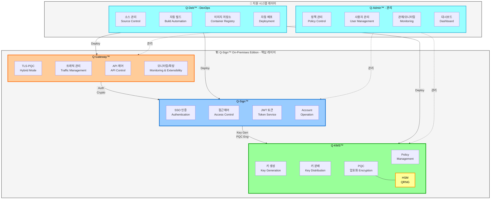
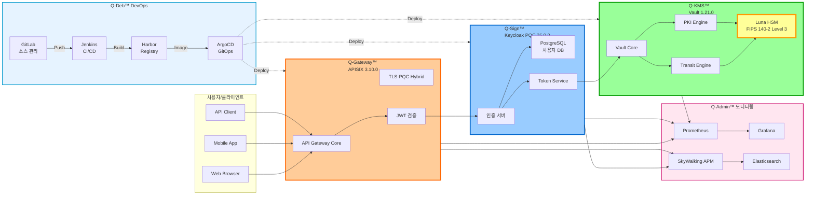

# Q-Docs - QSIGN 프로젝트 통합 문서

> Post-Quantum Cryptography (PQC) 기반 통합 SSO 및 키 관리 시스템

## 📚 문서 구조

### [00-overview](./00-overview/) - 프로젝트 개요
프로젝트 소개 및 전체 개요
- [PROJECT-OVERVIEW.md](./00-overview/PROJECT-OVERVIEW.md) - 프로젝트 개요
- [SYSTEM-COMPONENTS.md](./00-overview/SYSTEM-COMPONENTS.md) - 시스템 컴포넌트
- [TECHNOLOGY-STACK.md](./00-overview/TECHNOLOGY-STACK.md) - 기술 스택

### [01-architecture](./01-architecture/) - 아키텍처
시스템 아키텍처 및 설계
- [ARCHITECTURE-OVERVIEW.md](./01-architecture/ARCHITECTURE-OVERVIEW.md) - 아키텍처 개요
- [PQC-ARCHITECTURE.md](./01-architecture/PQC-ARCHITECTURE.md) - PQC 아키텍처
- [NETWORK-TOPOLOGY.md](./01-architecture/NETWORK-TOPOLOGY.md) - 네트워크 구성
- [DATA-FLOW.md](./01-architecture/DATA-FLOW.md) - 데이터 플로우
- [SECURITY-DESIGN.md](./01-architecture/SECURITY-DESIGN.md) - 보안 설계

### [02-setup](./02-setup/) - 설치 및 설정
초기 설치 및 환경 설정
- [PREREQUISITES.md](./02-setup/PREREQUISITES.md) - 사전 요구사항
- [INSTALLATION.md](./02-setup/INSTALLATION.md) - 설치 가이드
- [CONFIGURATION.md](./02-setup/CONFIGURATION.md) - 환경 설정
- [HSM-SETUP.md](./02-setup/HSM-SETUP.md) - Luna HSM 설정

### [03-deployment](./03-deployment/) - 배포
Kubernetes 및 GitOps 배포
- [GITOPS-DEPLOYMENT.md](./03-deployment/GITOPS-DEPLOYMENT.md) - GitOps 배포
- [ARGOCD-SETUP.md](./03-deployment/ARGOCD-SETUP.md) - ArgoCD 설정
- [KUBERNETES-DEPLOYMENT.md](./03-deployment/KUBERNETES-DEPLOYMENT.md) - Kubernetes 배포
- [HELM-CHARTS.md](./03-deployment/HELM-CHARTS.md) - Helm Chart 가이드

### [04-operations](./04-operations/) - 운영
시스템 운영 및 모니터링
- [DAILY-OPERATIONS.md](./04-operations/DAILY-OPERATIONS.md) - 일상 운영
- [MONITORING.md](./04-operations/MONITORING.md) - 모니터링
- [BACKUP-RECOVERY.md](./04-operations/BACKUP-RECOVERY.md) - 백업 및 복구
- [SCALING.md](./04-operations/SCALING.md) - 스케일링 가이드

### [05-api-reference](./05-api-reference/) - API 문서
API 레퍼런스 및 사용 예제
- [KEYCLOAK-API.md](./05-api-reference/KEYCLOAK-API.md) - Keycloak API
- [VAULT-API.md](./05-api-reference/VAULT-API.md) - Vault API
- [APISIX-API.md](./05-api-reference/APISIX-API.md) - APISIX API

### [06-troubleshooting](./06-troubleshooting/) - 문제 해결
일반적인 문제 및 해결 방법
- [COMMON-ISSUES.md](./06-troubleshooting/COMMON-ISSUES.md) - 일반적인 문제
- [FAQ.md](./06-troubleshooting/FAQ.md) - 자주 묻는 질문
- [DEBUG-GUIDE.md](./06-troubleshooting/DEBUG-GUIDE.md) - 디버깅 가이드

### [07-sequence-diagrams](./07-sequence-diagrams/) - 시퀀스 다이어그램
시스템 플로우 및 상호작용 다이어그램
- [SEQUENCE-DIAGRAMS.md](./07-sequence-diagrams/SEQUENCE-DIAGRAMS.md) - 시퀀스 다이어그램 개요
- [AUTH-FLOW.md](./07-sequence-diagrams/AUTH-FLOW.md) - 인증 플로우 (7개 다이어그램)
- [TOKEN-LIFECYCLE.md](./07-sequence-diagrams/TOKEN-LIFECYCLE.md) - 토큰 라이프사이클 (7개 다이어그램)
- [KEY-MANAGEMENT.md](./07-sequence-diagrams/KEY-MANAGEMENT.md) - 키 관리 (8개 다이어그램)
- [DEPLOYMENT-FLOW.md](./07-sequence-diagrams/DEPLOYMENT-FLOW.md) - 배포 플로우 (8개 다이어그램)

### [08-q-tls](./08-q-tls/) - Q-TLS (Q-SSL) 설계 ✨ NEW!
양자 내성 전송 보안 계층 설계 문서
- [Q-TLS-OVERVIEW.md](./08-q-tls/Q-TLS-OVERVIEW.md) - Q-TLS/Q-SSL 개요 (23개 다이어그램)
- [Q-TLS-ARCHITECTURE.md](./08-q-tls/Q-TLS-ARCHITECTURE.md) - 아키텍처 설계 (21개 다이어그램)
- [Q-TLS-DESIGN.md](./08-q-tls/Q-TLS-DESIGN.md) - 상세 프로토콜 설계 (8개 다이어그램)
- [CERTIFICATE-MANAGEMENT.md](./08-q-tls/CERTIFICATE-MANAGEMENT.md) - 인증서 관리 (5개 다이어그램)
- [HANDSHAKE-PROTOCOL.md](./08-q-tls/HANDSHAKE-PROTOCOL.md) - TLS-PQC Hybrid 핸드셰이크 (9개 다이어그램)
- [CIPHER-SUITES.md](./08-q-tls/CIPHER-SUITES.md) - 암호화 스위트 (4개 다이어그램)
- [SEQUENCE-DIAGRAMS.md](./08-q-tls/SEQUENCE-DIAGRAMS.md) - Q-TLS 시퀀스 다이어그램 (10개)
- [IMPLEMENTATION-GUIDE.md](./08-q-tls/IMPLEMENTATION-GUIDE.md) - 구현 가이드 (15+ 스크립트)
- [INTEGRATION.md](./08-q-tls/INTEGRATION.md) - 시스템 통합 (7개 다이어그램)
- [TESTING-VALIDATION.md](./08-q-tls/TESTING-VALIDATION.md) - 테스트 및 검증

## 🎯 Quick Start

### 빠른 시작
```bash
# 1. 저장소 클론
git clone http://192.168.0.11:7780/root/qsign.git
cd qsign

# 2. 사전 요구사항 확인
./scripts/check-prerequisites.sh

# 3. 설치
./scripts/install.sh

# 4. 배포
kubectl apply -f gitops-repo/argocd/applications/
```

### 접속 정보
- **ArgoCD**: http://192.168.0.11:30080
- **Keycloak PQC (Q-Sign)**: http://192.168.0.11:30181
- **Keycloak HSM (PQC-SSO)**: http://192.168.0.11:30699
- **Q-KMS Vault**: http://192.168.0.11:30820
- **APISIX Gateway**: http://192.168.0.11:32602
- **Grafana**: http://192.168.0.11:30030
- **Admin Dashboard**: http://192.168.0.11:30093

## 📖 주요 기능

### 🔐 Post-Quantum Cryptography
- **DILITHIUM3** (NIST FIPS 204): 양자 내성 디지털 서명
- **KYBER1024** (NIST FIPS 203): 양자 내성 키 교환
- **SPHINCS+**: 백업 서명 알고리즘
- **Hybrid Mode**: PQC + Classical 암호화

### 🔑 SSO 인증
- Keycloak 기반 Single Sign-On
- OIDC/OAuth 2.0 프로토콜
- PQC JWT 토큰 발급 및 검증
- Luna HSM 통합 인증

### 🗝️ 키 관리
- HashiCorp Vault 기반 KMS
- Luna HSM 하드웨어 보안 모듈
- Transit Engine (암호화/복호화)
- Secret Engine (키 저장)

### 🚀 API Gateway
- Apache APISIX
- 동적 라우팅
- PQC JWT 검증
- Rate Limiting
- CORS 지원

### 📊 모니터링
- Prometheus 메트릭 수집
- Grafana 대시보드
- SkyWalking APM
- Elasticsearch 로그 저장

### 🔄 GitOps
- ArgoCD 자동 배포
- Git 기반 형상 관리
- Helm Chart 패키징
- 자동 동기화

## 🏗️ 시스템 구성

### 시스템 아키텍처 개요

> Q-Sign™ On-Premises Edition 전체 아키텍처



### 상세 시스템 구성도



### 네임스페이스별 구성
```
├── argocd          # ArgoCD 배포
├── q-sign          # Keycloak PQC + Postgres
├── pqc-sso         # Keycloak HSM + SSO Test App
├── q-kms           # Q-KMS Vault + Luna HSM
├── q-app           # 테스트 애플리케이션 (App1-7)
├── qsign-prod      # Gateway, 모니터링, 대시보드
├── harbor          # Container Registry
└── guestbook       # 샘플 애플리케이션
```

## 🔒 보안 정책

### PQC 알고리즘
- **NIST Level 3** 보안 수준
- **FIPS 204** (ML-DSA/Dilithium)
- **FIPS 205** (SLH-DSA/SPHINCS+)
- **FIPS 203** (ML-KEM/Kyber)

### HSM 통합
- **Luna HSM**: FIPS 140-2 Level 3
- **PKCS#11** 인터페이스
- 하드웨어 키 생성 및 저장
- 안전한 서명 및 검증

## 📞 지원

### 문서
- [아키텍처 문서](./01-architecture/)
- [배포 가이드](./03-deployment/)
- [운영 가이드](./04-operations/)
- [문제 해결](./06-troubleshooting/)

### 리소스
- GitLab: https://192.168.0.11:7743
- Harbor: http://192.168.0.11:31800
- Jenkins: https://192.168.0.11:7643

---

**Last Updated**: 2025-11-16
**Version**: 1.0.0
**Project**: QSIGN - Post-Quantum Cryptography SSO & KMS
